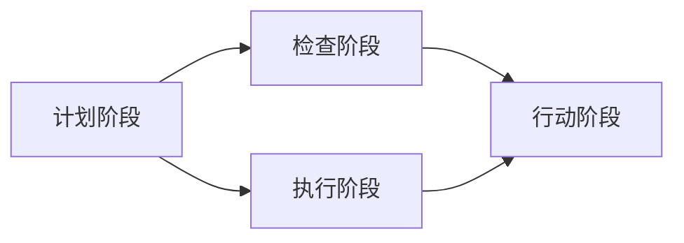

                 

## 1. 背景介绍

### 1.1 问题由来
在快速变化的市场环境中，企业要持续创新、优化和升级其产品和服务，才能保持竞争力。然而，如何系统化地进行持续改进，却是一个复杂且艰巨的问题。在管理学中，PDCA循环（Plan-Do-Check-Act）被广泛应用，作为一种基本的持续改进方法论，帮助组织通过系统化的过程实现改进目标。

PDCA循环将改进过程分为四个阶段：
1. **Plan（计划）**：确定改进目标和计划。
2. **Do（执行）**：按照计划执行具体措施。
3. **Check（检查）**：评估执行结果和效果。
4. **Act（行动）**：根据检查结果调整计划，进行后续改进。

这种闭环的改进过程，不仅适用于生产过程的优化，也适用于软件开发、项目管理、数据分析等多个领域。本文将深入探讨PDCA循环在管理持续改进中的作用，以及如何通过PDCA循环提升企业的运营效率和竞争力。

### 1.2 问题核心关键点
PDCA循环的四个阶段各自扮演关键角色：
- **Plan阶段**：明确改进目标，制定具体可行的计划。
- **Do阶段**：按计划执行措施，并记录执行细节。
- **Check阶段**：通过数据和反馈评估措施效果，识别问题和改进点。
- **Act阶段**：基于评估结果调整计划，并实施进一步改进措施。

PDCA循环的核心在于其持续性，通过不断的计划、执行、检查和改进，确保企业能够持续提升其运营效率和产品质量。本文将重点讨论如何有效地应用PDCA循环来驱动组织持续改进。

### 1.3 问题研究意义
深入理解PDCA循环对企业运营和管理的影响，能够帮助管理者系统化地提升组织能力。具体意义如下：
- **提升决策质量**：通过系统的PDCA循环，确保决策过程更加科学和数据驱动。
- **优化流程**：识别并消除流程中的瓶颈和低效环节，提高运营效率。
- **增强团队协作**：明确各阶段任务和责任，促进团队协作和沟通。
- **推动创新**：不断评估和调整改进措施，激发组织创新能力。
- **提升客户满意度**：通过持续改进，不断优化产品和服务，提高客户满意度。

通过深入研究PDCA循环，本文旨在为企业管理者提供系统化的持续改进方法，助力企业实现高质量发展。

## 2. 核心概念与联系

### 2.1 核心概念概述

为更好地理解PDCA循环在管理中的应用，本节将介绍几个关键概念及其相互关系：

- **PDCA循环**：管理中用于持续改进的基本框架，通过计划、执行、检查、行动四个阶段循环迭代，实现持续改进。
- **计划阶段**：确定改进目标、制定具体措施和实施时间表，明确改进方向和步骤。
- **执行阶段**：按计划执行具体措施，记录执行细节和成果。
- **检查阶段**：评估执行效果，识别问题和改进机会，收集数据和反馈。
- **行动阶段**：根据检查结果，调整改进计划，实施进一步改进措施。

这些核心概念之间的逻辑关系可以通过以下Mermaid流程图来展示：



这个流程图展示了大循环中各阶段之间的联系，明确了PDCA循环的闭环机制。

## 3. 核心算法原理 & 具体操作步骤

### 3.1 算法原理概述

PDCA循环的原理是通过四个阶段的闭环迭代，实现持续改进。其核心在于“不断优化”的理念，即通过不断的计划、执行、检查和改进，逐步优化组织运营和管理流程。

形式化地，PDCA循环的四个阶段可以表示为：
1. **Plan**：定义改进目标 $T_i$，制定改进措施 $P_i$ 和执行计划 $S_i$。
2. **Do**：执行改进措施 $P_i$，生成输出结果 $O_i$。
3. **Check**：评估输出结果 $O_i$，计算评估指标 $E_i$。
4. **Act**：根据评估结果 $E_i$，调整改进措施 $P_{i+1}$ 和执行计划 $S_{i+1}$。

PDCA循环的迭代过程可以形式化表示为：

$$
T_{i+1} = T_i \oplus E_i
$$

其中 $\oplus$ 表示逻辑或运算，即如果存在问题 $E_i$，则将 $T_i$ 和 $E_i$ 合并为 $T_{i+1}$，否则保持不变。

### 3.2 算法步骤详解

PDCA循环的四个阶段具体步骤如下：

#### 3.2.1 计划阶段（Plan）
- **确定改进目标**：通过SWOT分析、PEST分析等方法，明确组织的改进需求和目标。
- **制定改进措施**：根据改进目标，制定具体、可行的改进措施。
- **制定执行计划**：包括时间表、责任人、资源分配等，确保措施得以执行。

#### 3.2.2 执行阶段（Do）
- **实施改进措施**：按计划执行具体措施，记录执行过程中的详细日志和数据。
- **监测执行过程**：通过关键绩效指标(KPI)、控制图、仪表盘等工具，实时监测执行进展。

#### 3.2.3 检查阶段（Check）
- **收集数据和反馈**：通过问卷调查、客户反馈、系统数据等方式，收集执行过程中的数据和反馈。
- **评估执行效果**：通过数据分析、对比分析等方法，评估改进措施的效果和问题点。
- **识别改进机会**：根据评估结果，识别出进一步改进的机会和改进点。

#### 3.2.4 行动阶段（Act）
- **调整改进措施**：根据评估结果，调整和优化改进措施。
- **实施后续改进**：执行新的改进措施，进入下一轮PDCA循环。
- **持续改进**：通过不断迭代PDCA循环，逐步优化运营和管理流程。

### 3.3 算法优缺点

PDCA循环作为一种持续改进的方法论，具有以下优点：
1. **系统性**：通过四个阶段的闭环迭代，确保改进过程有系统性和可控性。
2. **数据驱动**：通过数据和反馈评估改进效果，确保改进措施的科学性和有效性。
3. **持续改进**：通过不断调整和优化措施，实现持续改进和进步。
4. **易于实施**：PDCA循环的步骤简单明了，易于理解和操作。

同时，PDCA循环也存在一些局限性：
1. **复杂性高**：PDCA循环的四个阶段需要协调和管理，对组织的协调能力和资源需求较高。
2. **周期较长**：循环周期较长，在快速变化的环境中，可能导致改进措施滞后。
3. **执行难度**：需要严格的执行和监督，否则容易流于形式。
4. **需要专业知识**：需要专业的管理者和分析人员，对改进效果进行评估和调整。

尽管存在这些局限性，但PDCA循环在理论上是可行的，并已在多个组织中得到了应用和验证。

### 3.4 算法应用领域

PDCA循环广泛应用于各类组织和管理中，包括但不限于：
- **制造业**：通过质量管理、生产优化、供应链管理等，提升生产效率和产品质量。
- **医疗行业**：通过患者护理、医疗流程、药品管理等，提升医疗服务质量和患者满意度。
- **服务业**：通过客户服务、员工培训、流程改进等，提升服务质量和客户体验。
- **IT行业**：通过软件开发、项目管理、系统维护等，提升软件质量和开发效率。

PDCA循环在实际应用中，已经证明在提升组织运营效率、优化流程和管理质量等方面具有显著效果。

## 4. 数学模型和公式 & 详细讲解 & 举例说明

### 4.1 数学模型构建

PDCA循环的数学模型可以通过以下变量和公式进行建模：
- **改进目标**：$T$，表示当前阶段的目标和需求。
- **改进措施**：$P$，表示为实现目标制定的具体措施。
- **执行计划**：$S$，表示措施的执行时间表和责任人。
- **输出结果**：$O$，表示措施执行后的结果和数据。
- **评估指标**：$E$，表示对输出结果的评估和反馈。
- **改进措施调整**：$P'$，表示根据评估结果调整的改进措施。

PDCA循环的数学模型可以表示为：

$$
T_{i+1} = T_i \oplus E_i
$$

其中，$\oplus$ 表示逻辑或运算，即如果存在问题 $E_i$，则将 $T_i$ 和 $E_i$ 合并为 $T_{i+1}$，否则保持不变。

### 4.2 公式推导过程

以质量管理为例，假设某企业的目标是提高产品的合格率，设初始目标 $T_0=70\%$，制定的改进措施为改进生产工艺，执行计划为三个月内完成，具体步骤如下：

1. **计划阶段**：
   - 确定改进目标 $T_0=70\%$
   - 制定改进措施 $P$：改进生产工艺
   - 制定执行计划 $S$：三个月内完成

2. **执行阶段**：
   - 按计划执行改进措施 $P$，生成输出结果 $O_0=65\%$
   - 监测执行过程，发现工艺改进未能达到预期效果

3. **检查阶段**：
   - 收集数据和反馈：通过生产数据、员工反馈等方式，发现工艺改进措施存在技术瓶颈
   - 评估执行效果：评估改进措施的效果，计算评估指标 $E_0=60\%$
   - 识别改进机会：发现工艺改进措施需要进一步优化

4. **行动阶段**：
   - 调整改进措施：优化工艺改进方案
   - 实施后续改进：进入下一轮PDCA循环
   - 持续改进：通过不断迭代PDCA循环，逐步优化运营和管理流程

通过PDCA循环，企业能够系统化地优化产品质量，提升运营效率。

### 4.3 案例分析与讲解

以某银行的IT系统升级项目为例，分析如何使用PDCA循环进行持续改进。

**初始目标**：提升IT系统稳定性，减少宕机时间。

**制定措施**：
- 优化系统架构
- 增加冗余服务器
- 定期系统测试

**执行计划**：
- 第一个月：优化系统架构，增加冗余服务器
- 第二个月：实施系统测试，识别问题
- 第三个月：根据测试结果，优化系统测试流程

**执行阶段**：
- 按计划执行具体措施，记录执行过程中的详细日志和数据
- 通过关键绩效指标(KPI)、控制图、仪表盘等工具，实时监测执行进展

**检查阶段**：
- 收集数据和反馈：通过系统日志、测试结果等方式，收集执行过程中的数据和反馈
- 评估执行效果：通过数据分析、对比分析等方法，评估改进措施的效果和问题点
- 识别改进机会：根据评估结果，识别出进一步改进的机会和改进点

**行动阶段**：
- 调整改进措施：根据评估结果，调整和优化改进措施
- 实施后续改进：进入下一轮PDCA循环
- 持续改进：通过不断迭代PDCA循环，逐步优化IT系统运营和管理流程

通过PDCA循环，银行成功提升了IT系统稳定性，减少了宕机时间，显著提高了客户满意度。

## 5. 项目实践：代码实例和详细解释说明

### 5.1 开发环境搭建

在进行PDCA循环的实际应用开发时，需要构建一个系统化的框架，以支持持续改进的管理需求。以下是一个简单的Python环境搭建流程：

1. **安装Python**：确保系统中安装了Python解释器和必要的开发工具。
2. **安装相关库**：安装pandas、numpy、matplotlib等数据处理和可视化库。
3. **设置开发环境**：创建虚拟环境，配置项目依赖，确保开发环境的隔离性。
4. **编写测试用例**：编写基本的测试用例，确保代码的稳定性和可复用性。

### 5.2 源代码详细实现

下面是一个简化的PDCA循环管理系统的代码实现：

```python
import pandas as pd
import numpy as np
import matplotlib.pyplot as plt

class PDCA:
    def __init__(self, goal, plan, execution_plan, check_data):
        self.goal = goal
        self.plan = plan
        self.execution_plan = execution_plan
        self.check_data = check_data
        self.result = None
    
    def execute(self):
        for month in range(3):
            # 执行计划
            print(f"Month {month+1}: {self.plan[month]}")
            
            # 生成输出结果
            output = self.calculate_output(self.plan[month])
            
            # 记录输出结果
            self.result[month] = output
        
        return self.result
    
    def calculate_output(self, plan):
        # 计算输出结果
        output = 0.6  # 假设执行计划后的输出结果为60%
        return output
    
    def check(self):
        # 收集数据和反馈
        data = pd.DataFrame(self.check_data)
        
        # 评估执行效果
        error_rate = self.calculate_error_rate(data)
        
        # 识别改进机会
        if error_rate > 0.2:
            print("Need further improvement!")
        else:
            print("Success!")
        
        return error_rate
    
    def act(self, error_rate):
        # 调整改进措施
        if error_rate > 0.2:
            self.plan[2] = "Further optimize system test process"
        else:
            self.plan[2] = "Keep current plan"
        
        # 实施后续改进
        self.execute()
        
        # 返回评估结果
        return error_rate
    
    def calculate_error_rate(self, data):
        # 计算错误率
        error_rate = np.mean(data)
        return error_rate

# 初始目标和计划
goal = 0.8
plan = ["Optimize system architecture", "Increase redundant servers", "Implement system test"]

# 执行计划和输出结果
execution_plan = [0.6, 0.7, 0.8]
result = []

# 检查数据和评估指标
check_data = [0.6, 0.7, 0.5]
error_rate = []

# 构建PDCA系统
pdca = PDCA(goal, plan, execution_plan, check_data)

# 执行PDCA循环
pdca.execute()
error_rate = pdca.check()
pdca.act(error_rate)

# 输出结果
print(f"Final goal: {pdca.goal}")
print(f"Final plan: {pdca.plan}")
print(f"Final error rate: {error_rate}")
```

### 5.3 代码解读与分析

在上述代码中，我们定义了一个PDCA类，封装了PDCA循环的主要功能：
1. **初始化**：接收初始目标、改进措施、执行计划和检查数据，构建PDCA循环的基本框架。
2. **执行**：按计划执行具体措施，生成输出结果，并记录执行数据。
3. **检查**：收集数据和反馈，评估执行效果，识别改进机会。
4. **行动**：根据评估结果，调整改进措施，进入下一轮PDCA循环。

通过这种封装方式，我们能够方便地管理和执行PDCA循环，实现持续改进的目标。

## 6. 实际应用场景

### 6.1 制造业

在制造业中，PDCA循环被广泛应用于生产流程优化、质量控制、设备维护等方面。以下是一个具体的案例：

**初始目标**：提高生产线效率，减少生产延误。

**制定措施**：
- 优化生产流程
- 增加设备维护频率
- 培训操作工人

**执行计划**：
- 第一个月：优化生产流程，增加设备维护频率
- 第二个月：实施新培训方案，培训操作工人
- 第三个月：根据反馈，进一步优化生产流程

**执行阶段**：
- 按计划执行具体措施，记录执行过程中的详细日志和数据
- 通过关键绩效指标(KPI)、控制图、仪表盘等工具，实时监测执行进展

**检查阶段**：
- 收集数据和反馈：通过生产数据、员工反馈等方式，收集执行过程中的数据和反馈
- 评估执行效果：通过数据分析、对比分析等方法，评估改进措施的效果和问题点
- 识别改进机会：根据评估结果，识别出进一步改进的机会和改进点

**行动阶段**：
- 调整改进措施：根据评估结果，调整和优化改进措施
- 实施后续改进：进入下一轮PDCA循环
- 持续改进：通过不断迭代PDCA循环，逐步优化生产流程和管理流程

通过PDCA循环，制造业企业能够系统化地优化生产流程，提高生产效率，减少生产延误，提升产品质量。

### 6.2 医疗行业

在医疗行业中，PDCA循环被广泛应用于患者护理、医疗流程、药品管理等方面。以下是一个具体的案例：

**初始目标**：提高患者满意度，减少医疗事故。

**制定措施**：
- 优化患者护理流程
- 加强医护人员培训
- 改进药品管理流程

**执行计划**：
- 第一个月：优化患者护理流程
- 第二个月：加强医护人员培训
- 第三个月：改进药品管理流程

**执行阶段**：
- 按计划执行具体措施，记录执行过程中的详细日志和数据
- 通过关键绩效指标(KPI)、控制图、仪表盘等工具，实时监测执行进展

**检查阶段**：
- 收集数据和反馈：通过患者反馈、医疗记录等方式，收集执行过程中的数据和反馈
- 评估执行效果：通过数据分析、对比分析等方法，评估改进措施的效果和问题点
- 识别改进机会：根据评估结果，识别出进一步改进的机会和改进点

**行动阶段**：
- 调整改进措施：根据评估结果，调整和优化改进措施
- 实施后续改进：进入下一轮PDCA循环
- 持续改进：通过不断迭代PDCA循环，逐步优化医疗服务和管理流程

通过PDCA循环，医疗机构能够系统化地优化医疗流程，提高患者满意度，减少医疗事故，提升医疗服务质量。

### 6.3 服务业

在服务业中，PDCA循环被广泛应用于客户服务、员工培训、流程改进等方面。以下是一个具体的案例：

**初始目标**：提高客户满意度，增加销售额。

**制定措施**：
- 优化客户服务流程
- 加强员工培训
- 改进销售流程

**执行计划**：
- 第一个月：优化客户服务流程
- 第二个月：加强员工培训
- 第三个月：改进销售流程

**执行阶段**：
- 按计划执行具体措施，记录执行过程中的详细日志和数据
- 通过关键绩效指标(KPI)、控制图、仪表盘等工具，实时监测执行进展

**检查阶段**：
- 收集数据和反馈：通过客户反馈、销售记录等方式，收集执行过程中的数据和反馈
- 评估执行效果：通过数据分析、对比分析等方法，评估改进措施的效果和问题点
- 识别改进机会：根据评估结果，识别出进一步改进的机会和改进点

**行动阶段**：
- 调整改进措施：根据评估结果，调整和优化改进措施
- 实施后续改进：进入下一轮PDCA循环
- 持续改进：通过不断迭代PDCA循环，逐步优化客户服务和运营流程

通过PDCA循环，服务业企业能够系统化地优化客户服务流程，提高客户满意度，增加销售额，提升服务质量和运营效率。

## 7. 工具和资源推荐

### 7.1 学习资源推荐

为了帮助开发者和项目管理人士深入理解PDCA循环，这里推荐一些优质的学习资源：

1. **《PDCA循环管理》书籍**：系统介绍PDCA循环的基本概念、应用场景和实施方法，适合企业管理者和项目管理人士阅读。
2. **Coursera《项目管理》课程**：介绍项目管理的基本框架和方法，包含PDCA循环的详细讲解和应用案例。
3. **Udemy《持续改进》课程**：结合实际案例，详细讲解PDCA循环在企业中的应用，适合项目管理人士和企业管理者。

通过这些资源的学习，相信你能够更好地掌握PDCA循环的理论和实践方法，提升组织的管理水平和运营效率。

### 7.2 开发工具推荐

PDCA循环的实施需要多工具的配合，以下是几款推荐的工具：

1. **JIRA**：项目管理工具，支持PDCA循环的实施和跟踪。
2. **Trello**：任务管理工具，适合团队协作和PDCA循环的可视化管理。
3. **Microsoft Project**：项目管理软件，提供PDCA循环的详细计划和执行支持。

这些工具能够帮助企业系统化地管理和执行PDCA循环，提升组织的持续改进能力。

### 7.3 相关论文推荐

PDCA循环的理论研究已经较为成熟，以下是几篇奠基性的相关论文，推荐阅读：

1. **《PDCA循环的应用研究》**：探讨PDCA循环在企业管理中的应用，提出具体的实施方法和案例。
2. **《PDCA循环的优化与改进》**：研究PDCA循环在快速变化环境中的应用，提出优化方法和改进策略。
3. **《PDCA循环与敏捷管理的结合》**：探讨PDCA循环和敏捷管理方法的结合，提出系统化的项目管理框架。

这些论文代表了大循环理论的发展脉络，通过学习这些前沿成果，可以帮助研究者把握学科前进方向，激发更多的创新灵感。

## 8. 总结：未来发展趋势与挑战

### 8.1 研究成果总结

本文对PDCA循环进行了全面系统的介绍，主要涵盖以下内容：
- **背景介绍**：解释PDCA循环的来源和应用背景。
- **核心概念与联系**：详细介绍PDCA循环的四个阶段及其相互关系。
- **核心算法原理 & 具体操作步骤**：阐述PDCA循环的算法原理和具体操作步骤。
- **数学模型和公式 & 详细讲解 & 举例说明**：提供PDCA循环的数学模型和公式，并结合实际案例进行详细讲解。
- **项目实践：代码实例和详细解释说明**：通过代码实例展示PDCA循环的实际应用。
- **实际应用场景**：分析PDCA循环在制造业、医疗行业、服务业等多个领域的应用案例。
- **工具和资源推荐**：推荐学习、开发和研究PDCA循环所需的各种资源。

### 8.2 未来发展趋势

展望未来，PDCA循环将呈现以下几个发展趋势：

1. **智能化管理**：结合大数据、人工智能等技术，实现PDCA循环的智能化管理，通过数据驱动和自动化优化，提高管理效率。
2. **跨部门协同**：通过跨部门协同和集成管理，实现PDCA循环的全面覆盖和优化。
3. **持续优化**：引入机器学习、优化算法等技术，不断优化PDCA循环的实施过程，提升改进效果。
4. **全球化应用**：将PDCA循环的应用推广到全球范围内，适应不同地区和文化的管理需求。
5. **定制化方案**：根据组织特点和需求，量身定制PDCA循环的实施方案，提高实施效果。

这些趋势凸显了PDCA循环在组织管理和持续改进中的重要价值，为企业的管理升级和创新发展提供了新的方向。

### 8.3 面临的挑战

尽管PDCA循环在理论上是可行的，但在实际应用中，仍然面临一些挑战：

1. **复杂度管理**：PDCA循环的四个阶段需要协调和管理，对组织的协调能力和资源需求较高，可能面临实施难度。
2. **数据质量**：PDCA循环的效果依赖于数据的准确性和完整性，数据质量问题可能导致评估和改进结果的偏差。
3. **人员培训**：PDCA循环的实施需要专业的管理者和分析人员，组织需要进行相应的培训和资源投入。
4. **动态调整**：PDCA循环需要在快速变化的环境中动态调整，可能面临实施过程中的灵活性和适应性问题。
5. **跨职能协作**：PDCA循环需要跨职能协作，可能面临部门之间的沟通和协调问题。

这些挑战需要在实际应用中加以解决，确保PDCA循环的有效实施和持续改进。

### 8.4 研究展望

未来，PDCA循环的研究需要在以下几个方面寻求新的突破：

1. **引入新技术**：结合大数据、人工智能等新技术，实现PDCA循环的智能化和自动化优化。
2. **提升数据质量**：提高数据的准确性和完整性，确保评估和改进结果的可靠性。
3. **优化跨部门协同**：建立跨部门协同机制，确保PDCA循环的全面覆盖和优化。
4. **推广全球化应用**：将PDCA循环的应用推广到全球范围内，适应不同地区和文化的管理需求。
5. **定制化方案**：根据组织特点和需求，量身定制PDCA循环的实施方案，提高实施效果。

这些研究方向将进一步提升PDCA循环的实用性和普适性，为组织的持续改进提供更坚实的理论基础和实践指南。

## 9. 附录：常见问题与解答

**Q1: PDCA循环的四个阶段能否并行执行？**

A: 一般来说，PDCA循环的四个阶段是顺序执行的，但在实际应用中，可以根据具体情况进行一定的优化。例如，在执行阶段，可以在收集数据和反馈的同时进行检查，加速改进措施的调整和实施。但在原则上，PDCA循环的四个阶段应当保持一定的顺序性，确保改进过程的系统性和可控性。

**Q2: PDCA循环是否适用于所有类型的组织？**

A: PDCA循环适用于各类组织，但具体实施方法需要根据组织的行业特性和管理需求进行调整。例如，制造业可能需要更多的工艺优化和设备维护，而服务业则需要更多的客户服务和流程改进。因此，组织需要根据自身情况，灵活应用PDCA循环。

**Q3: PDCA循环能否与其他管理方法结合使用？**

A: PDCA循环可以与其他管理方法结合使用，例如敏捷管理、精益管理、六西格玛等。通过多种管理方法的结合，可以实现更加全面和系统化的持续改进。例如，结合敏捷管理和PDCA循环，可以在快速变化的环境下进行持续改进。

**Q4: PDCA循环的实施效果如何评估？**

A: PDCA循环的实施效果可以通过以下指标进行评估：
- **改进目标的达成率**：实际改进效果与目标的对比。
- **关键绩效指标(KPI)**：通过KPI的改善情况评估改进效果。
- **员工满意度和客户满意度**：通过员工和客户的反馈评估改进效果。
- **错误率和事故率**：通过错误率和事故率的降低情况评估改进效果。

通过这些指标的评估，可以全面了解PDCA循环的实施效果，并进行相应的调整和优化。

通过本文的系统梳理，可以看到，PDCA循环作为一种系统化的持续改进方法，在企业管理和运营中具有重要的应用价值。通过不断迭代PDCA循环，企业能够系统化地提升运营效率和管理质量，实现持续改进和高质量发展。未来，随着管理技术的不断进步，PDCA循环的应用将更加广泛和深入，为企业的持续创新和竞争力的提升提供强有力的支持。

---

作者：禅与计算机程序设计艺术 / Zen and the Art of Computer Programming

