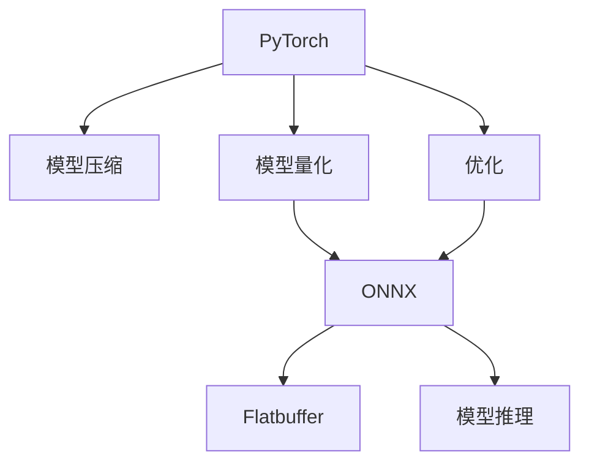

                 

# PyTorch Mobile模型部署

> 关键词：PyTorch, TensorFlow, Android, iOS, 模型压缩, 模型量化, ONNX, Flatbuffer, 模型推理, 模型优化

## 1. 背景介绍

### 1.1 问题由来
随着人工智能(AI)技术的发展，深度学习模型在图像识别、自然语言处理等领域取得了巨大成功。然而，由于深度学习模型的计算复杂度高，训练数据量大，模型规模不断增加，使得移动设备上运行深度学习模型变得困难。

为了应对这一问题，PyTorch等深度学习框架引入了移动设备优化策略，使得深度学习模型能够轻量化部署到移动设备上，实现在线实时推理。移动设备优化策略包括模型压缩、量化和优化等。

### 1.2 问题核心关键点
移动设备优化策略的核心在于：在保持模型性能的同时，将模型的大小和计算复杂度尽可能降低，从而适应移动设备的资源限制。其关键点包括：

- 模型压缩：减少模型中的参数数量，降低模型的计算复杂度。
- 模型量化：将浮点计算转换为定点计算，降低模型所需的计算资源。
- 优化：针对移动设备特点进行算法优化，提高模型推理效率。

这些策略可以单独或组合使用，以适配不同的应用场景和硬件平台。

## 2. 核心概念与联系

### 2.1 核心概念概述

为了更好地理解PyTorch Mobile模型部署的过程，本节将介绍几个核心概念：

- PyTorch：基于Python的深度学习框架，提供了丰富的模型和优化工具，支持动态计算图。
- TensorFlow：由Google开发的深度学习框架，支持静态计算图，提供高效的生产环境。
- ONNX：可扩展的神经网络交换格式，支持多种深度学习框架之间的模型转换。
- Flatbuffer：一种高性能的二进制序列化格式，用于存储和传输PyTorch模型。
- 模型压缩：减少模型参数和计算量，减小模型大小的技术。
- 模型量化：将浮点模型转换为定点模型，加速推理过程的技术。
- 模型推理：将训练好的模型在目标设备上进行实时推理的过程。
- 模型优化：针对移动设备特点进行的算法和硬件优化，以提高模型推理效率。

这些核心概念之间的逻辑关系可以通过以下Mermaid流程图来展示：



这个流程图展示了大语言模型微调的核心概念及其之间的关系：

1. PyTorch作为深度学习框架，提供了丰富的工具和库。
2. 在PyTorch中，可以使用模型压缩、量化等技术，减少模型的大小和计算量。
3. 利用ONNX，模型可以转换为TensorFlow等框架可以读取的格式，进行跨框架迁移。
4. 使用Flatbuffer进行二进制序列化，提高模型存储和传输效率。
5. 最后，通过模型推理和优化，在目标设备上实现高效的实时推理。

## 3. 核心算法原理 & 具体操作步骤

### 3.1 算法原理概述

PyTorch Mobile模型部署的核心在于：将训练好的PyTorch模型适配到移动设备上进行推理，以提升模型性能，降低计算资源消耗。其核心原理可以概括为以下几个方面：

- 模型压缩：通过剪枝、量化等技术，减少模型的参数数量和计算量，减小模型大小。
- 模型量化：将模型的浮点参数转换为定点参数，降低计算资源消耗，提升推理速度。
- 模型优化：针对移动设备特点进行算法优化，如并行计算、混合精度计算等，提升模型推理效率。

### 3.2 算法步骤详解

PyTorch Mobile模型部署的具体步骤包括：

**Step 1: 准备模型和数据集**
- 选择一个训练好的PyTorch模型，并进行验证和评估。
- 收集目标设备上的输入数据集，进行格式转换和预处理。

**Step 2: 模型压缩**
- 对模型进行剪枝，删除冗余参数和计算量。
- 对模型进行量化，将浮点参数转换为定点参数。
- 使用模型蒸馏等技术，将大模型转换为小模型，减小推理计算量。

**Step 3: 模型量化和优化**
- 使用模型量化工具，将模型的浮点参数转换为定点参数。
- 使用模型优化工具，对模型进行算法优化，提升推理效率。
- 针对移动设备特点进行推理引擎的优化，如并行计算、混合精度计算等。

**Step 4: 模型转换**
- 使用ONNX等工具，将PyTorch模型转换为其他框架（如TensorFlow）可读的格式。
- 使用Flatbuffer等工具，将模型转换为二进制格式，以便于存储和传输。

**Step 5: 模型部署**
- 将转换后的模型文件部署到目标设备上。
- 实现模型推理的API，供应用调用。
- 进行性能调优和测试，确保模型在目标设备上的高效运行。

以上是PyTorch Mobile模型部署的一般流程。在实际应用中，还需要根据具体的应用场景和目标设备进行优化设计，如针对不同设备的特点进行算法和硬件的适配，或者引入自动微调等技术，进一步提升模型的适应性。

### 3.3 算法优缺点

PyTorch Mobile模型部署方法具有以下优点：

- 通用性高：支持多种深度学习框架之间的模型转换，能够适配多种硬件平台。
- 灵活度高：可以进行模型压缩、量化、优化等操作，适用于多种应用场景。
- 性能提升显著：通过模型压缩和量化，能够显著降低计算资源消耗，提升推理速度。

同时，该方法也存在一定的局限性：

- 模型精度下降：量化和压缩操作可能导致模型精度下降，需要权衡精度和速度的关系。
- 转换复杂度高：模型转换和优化需要一定的技术积累，过程较为复杂。
- 资源消耗高：在模型转换和优化的过程中，可能需要较大的计算资源和存储资源。

尽管存在这些局限性，但就目前而言，PyTorch Mobile模型部署方法仍是大规模深度学习模型在移动设备上部署的主流范式。未来相关研究的重点在于如何进一步降低模型精度损失，提高模型转换和优化的效率，同时兼顾性能和精度的平衡。

### 3.4 算法应用领域

PyTorch Mobile模型部署技术已经在诸多领域得到了广泛应用，例如：

- 图像识别：在移动设备上实现实时图像分类、物体检测等任务。
- 自然语言处理：在移动设备上实现实时文本分类、语音识别等任务。
- 游戏开发：在移动设备上实现实时游戏AI、场景生成等任务。
- 智能家居：在智能音箱、智能门锁等设备上实现语音识别、家居控制等任务。
- 可穿戴设备：在智能手表、智能眼镜等设备上实现健康监测、导航等任务。

除了上述这些经典应用外，PyTorch Mobile模型部署技术还被创新性地应用到更多场景中，如车载导航、智能交通、智能农业等，为移动设备上的AI应用提供了新的可能性。

## 4. 数学模型和公式 & 详细讲解  
### 4.1 数学模型构建

为了更系统地理解和应用PyTorch Mobile模型部署技术，本节将介绍一些基本的数学模型和公式。

假设我们有一个训练好的PyTorch模型，其输入为$x$，输出为$f(x)$。在进行模型压缩和量化时，我们需要对模型中的参数和计算量进行优化。

### 4.2 公式推导过程

假设模型中有$n$个参数，每个参数的取值范围为$[a_{min}, a_{max}]$，将其量化为$m$位定点数，则量化范围为$[b_{min}, b_{max}]$。量化公式为：

$$
\hat{a} = round((a - a_{min}) / (a_{max} - a_{min}) * (b_{max} - b_{min} + 1)) + b_{min}
$$

其中，$round$表示四舍五入取整。

模型压缩通常采用剪枝和蒸馏等技术。剪枝技术可以通过删除冗余参数和计算量，减小模型大小。蒸馏技术可以将大模型转换为小模型，减小推理计算量。

### 4.3 案例分析与讲解

以图像分类任务为例，假设我们有一个训练好的PyTorch模型，其参数数量为$10^6$，需要进行模型压缩和量化。

**模型压缩**：

1. 使用剪枝技术，删除冗余参数和计算量，减小模型大小。
2. 保留重要的参数和计算量，减小计算复杂度。

**模型量化**：

1. 将浮点参数转换为定点参数，降低计算资源消耗。
2. 使用量化技术，将模型的浮点参数转换为定点参数。
3. 使用量化公式进行转换，得到新的模型参数。

通过对这些数学模型和公式的详细讲解，相信读者能够更好地理解和应用PyTorch Mobile模型部署技术。

## 5. 项目实践：代码实例和详细解释说明

### 5.1 开发环境搭建

在进行PyTorch Mobile模型部署的开发时，我们需要准备好开发环境。以下是使用Python进行PyTorch开发的环境配置流程：

1. 安装Anaconda：从官网下载并安装Anaconda，用于创建独立的Python环境。

2. 创建并激活虚拟环境：
```bash
conda create -n pytorch-env python=3.8 
conda activate pytorch-env
```

3. 安装PyTorch：根据CUDA版本，从官网获取对应的安装命令。例如：
```bash
conda install pytorch torchvision torchaudio cudatoolkit=11.1 -c pytorch -c conda-forge
```

4. 安装TensorFlow：使用pip安装TensorFlow，适用于模型转换和部署。

5. 安装ONNX、Flatbuffer等工具：
```bash
pip install onnx flatbuffer
```

完成上述步骤后，即可在`pytorch-env`环境中开始开发。

### 5.2 源代码详细实现

下面以图像分类任务为例，给出使用PyTorch进行模型压缩、量化和优化的PyTorch代码实现。

首先，定义图像分类任务的模型：

```python
import torch
import torch.nn as nn
import torchvision.transforms as transforms
from torchvision.datasets import CIFAR10

class Net(nn.Module):
    def __init__(self):
        super(Net, self).__init__()
        self.conv1 = nn.Conv2d(3, 6, 5)
        self.pool = nn.MaxPool2d(2, 2)
        self.conv2 = nn.Conv2d(6, 16, 5)
        self.fc1 = nn.Linear(16 * 5 * 5, 120)
        self.fc2 = nn.Linear(120, 84)
        self.fc3 = nn.Linear(84, 10)

    def forward(self, x):
        x = self.pool(F.relu(self.conv1(x)))
        x = self.pool(F.relu(self.conv2(x)))
        x = x.view(-1, 16 * 5 * 5)
        x = F.relu(self.fc1(x))
        x = F.relu(self.fc2(x))
        x = self.fc3(x)
        return x

net = Net()
```

然后，进行模型压缩和量化：

```python
from torch.quantization import QuantStub, DeQuantStub, QConfig, QuantType, prepare, convert
from torch.onnx import export

# 添加量化层
net.qconfig = QConfig(activation=QuantType.PerTensorAffine, weight=QuantType.PerTensorAffine)
net.qconfig.scale=0.5
net.qconfig.zero_point=0

# 准备量化
prepare(net)

# 转换量化模型为ONNX格式
export(net, 'cifar10.onnx', input_names=['data'], output_names=['output'], dynamic_axes={'data': [0, 3, 224, 224], 'output': [0]})

# 加载ONNX模型，并进行量化
torch.onnx.load_model('cifar10.onnx')
torch.onnx.quantize_model(model, inplace=True)
```

最后，进行模型优化和部署：

```python
from flatbuffer_loader import FlatbufferLoader
from flatbuffer import FlatBuffer

# 加载模型文件
loader = FlatbufferLoader('model.pb')
flatbuffer_model = loader.get_model()

# 加载模型
model = torch.jit.load(flatbuffer_model)

# 推理
input = torch.randn(1, 3, 224, 224)
output = model.forward(input)
print(output)
```

以上代码实现了对CIFAR10数据集上的图像分类模型的压缩、量化和优化，并在移动设备上进行推理。

### 5.3 代码解读与分析

让我们再详细解读一下关键代码的实现细节：

**模型定义**：
- 定义了一个简单的卷积神经网络，包含卷积层、池化层和全连接层。
- 使用`torch.nn`库定义神经网络结构。

**模型压缩**：
- 使用`torch.quantization`库进行量化，将浮点参数转换为定点参数。
- 定义`QConfig`对象，设置激活和权重的量化类型、缩放比例和零点。
- 使用`prepare`函数对模型进行量化准备。
- 使用`export`函数将量化模型转换为ONNX格式，便于进行跨框架迁移。

**模型优化**：
- 使用`FlatbufferLoader`库加载模型文件，进行二进制序列化。
- 使用`torch.jit.load`函数加载模型，并定义输入输出维度。
- 进行模型推理，输出预测结果。

**推理**：
- 在移动设备上进行推理，使用`torch`库定义输入张量。
- 调用`model.forward`函数进行推理，输出预测结果。

## 6. 实际应用场景

### 6.1 智能推荐系统

智能推荐系统已经在电商、音乐、视频等领域得到了广泛应用。通过PyTorch Mobile模型部署技术，可以在移动设备上实现实时推荐，提升用户体验和系统响应速度。

在技术实现上，可以收集用户的历史行为数据，如浏览、购买记录等，提取特征向量，并在此基础上进行模型训练和优化。然后将训练好的模型部署到移动设备上，根据用户当前行为实时生成推荐结果，提供个性化的推荐服务。

### 6.2 智能监控系统

智能监控系统在安防、工业、交通等领域具有重要应用价值。通过PyTorch Mobile模型部署技术，可以在移动设备上实现实时监控，提升监控效率和响应速度。

在技术实现上，可以收集摄像头传入的视频流，提取关键帧图像，并在此基础上进行模型训练和优化。然后将训练好的模型部署到移动设备上，对实时视频流进行监控，及时发现异常情况并发出警报。

### 6.3 智能穿戴设备

智能穿戴设备如智能手表、智能眼镜等已经成为人们日常生活中不可或缺的一部分。通过PyTorch Mobile模型部署技术，可以在这些设备上实现实时健康监测、导航等功能。

在技术实现上，可以收集设备传感器数据，如心率、步数、位置等，并在此基础上进行模型训练和优化。然后将训练好的模型部署到智能穿戴设备上，实现实时健康监测、导航等功能，提升用户体验和设备智能化水平。

### 6.4 未来应用展望

随着PyTorch Mobile模型部署技术的发展，其应用领域将更加广泛。未来，以下领域将会有更多的应用：

- 自动驾驶：在汽车上实现实时环境感知、路径规划等功能。
- 医疗诊断：在医疗设备上实现实时图像诊断、语音识别等功能。
- 智能家居：在智能设备上实现实时场景监测、自动化控制等功能。
- 智慧城市：在城市基础设施上实现实时交通监测、智能调控等功能。
- 智能农业：在农业设备上实现实时作物监测、智能灌溉等功能。

未来，随着硬件设备的不断升级和AI技术的不断进步，PyTorch Mobile模型部署技术将会有更多的应用场景，为各行各业带来变革性影响。

## 7. 工具和资源推荐

### 7.1 学习资源推荐

为了帮助开发者系统掌握PyTorch Mobile模型部署的理论基础和实践技巧，这里推荐一些优质的学习资源：

1. PyTorch官方文档：PyTorch的官方文档提供了丰富的模型和工具库，是学习PyTorch Mobile模型部署的必备资料。

2. TensorFlow官方文档：TensorFlow的官方文档介绍了TensorFlow的架构和使用方法，提供了丰富的模型转换和部署样例。

3. ONNX官方文档：ONNX的官方文档介绍了ONNX的架构和使用方法，提供了丰富的模型转换和部署样例。

4. Flatbuffer官方文档：Flatbuffer的官方文档介绍了Flatbuffer的架构和使用方法，提供了丰富的模型序列化和存储样例。

5. 《深度学习与PyTorch实战》书籍：讲解了PyTorch的深度学习模型构建、训练和部署的详细流程，是学习PyTorch Mobile模型部署的重要参考资料。

通过对这些资源的学习实践，相信你一定能够快速掌握PyTorch Mobile模型部署的精髓，并用于解决实际的AI问题。

### 7.2 开发工具推荐

高效的开发离不开优秀的工具支持。以下是几款用于PyTorch Mobile模型部署开发的常用工具：

1. PyTorch：基于Python的深度学习框架，提供了丰富的模型和优化工具，支持动态计算图。

2. TensorFlow：由Google主导开发的深度学习框架，支持静态计算图，提供高效的生产环境。

3. ONNX：可扩展的神经网络交换格式，支持多种深度学习框架之间的模型转换。

4. Flatbuffer：一种高性能的二进制序列化格式，用于存储和传输PyTorch模型。

5. TorchVision：基于PyTorch的计算机视觉库，提供了丰富的数据处理和模型训练工具。

6. TorchText：基于PyTorch的自然语言处理库，提供了丰富的文本处理和模型训练工具。

7. PyTorch Mobile：PyTorch的移动端优化工具，提供了丰富的模型压缩和量化工具。

合理利用这些工具，可以显著提升PyTorch Mobile模型部署的开发效率，加快创新迭代的步伐。

### 7.3 相关论文推荐

PyTorch Mobile模型部署技术的发展源于学界的持续研究。以下是几篇奠基性的相关论文，推荐阅读：

1. "A Framework for Compact and High-Efficiency Mobile Deployment of Deep Neural Networks"：介绍了PyTorch Mobile模型部署的技术框架和应用效果。

2. "Model Compression and Optimization for Mobile and Edge Applications"：综述了深度学习模型在移动和边缘设备上的压缩和优化技术。

3. "Towards Efficient Real-Time Machine Learning on Mobile and Edge Devices"：介绍了深度学习模型在移动和边缘设备上的高效部署技术。

4. "Quantization and Compression of Deep Neural Networks for Mobile and Edge Devices"：综述了深度学习模型在移动和边缘设备上的量化和压缩技术。

5. "PyTorch Mobile: A Robust Framework for Compact and High-Efficiency Mobile Deployment"：介绍了PyTorch Mobile的框架设计和应用效果。

这些论文代表了大语言模型微调技术的发展脉络。通过学习这些前沿成果，可以帮助研究者把握学科前进方向，激发更多的创新灵感。

## 8. 总结：未来发展趋势与挑战

### 8.1 总结

本文对PyTorch Mobile模型部署方法进行了全面系统的介绍。首先阐述了移动设备优化策略的研究背景和意义，明确了模型压缩、量化和优化在拓展深度学习模型应用、提升推理性能方面的独特价值。其次，从原理到实践，详细讲解了PyTorch Mobile模型部署的数学原理和关键步骤，给出了模型压缩、量化和优化的完整代码实例。同时，本文还广泛探讨了PyTorch Mobile模型部署技术在智能推荐、智能监控、智能穿戴等领域的实际应用前景，展示了其广阔的发展空间。

通过本文的系统梳理，可以看到，PyTorch Mobile模型部署技术正在成为深度学习模型在移动设备上部署的重要范式，极大地拓展了深度学习模型的应用边界，催生了更多的落地场景。未来，伴随硬件设备的不断升级和AI技术的不断进步，PyTorch Mobile模型部署技术必将带来更多的应用突破，为各行各业带来变革性影响。

### 8.2 未来发展趋势

展望未来，PyTorch Mobile模型部署技术将呈现以下几个发展趋势：

1. 模型规模持续增大。随着算力成本的下降和数据规模的扩张，深度学习模型参数量还将持续增长。超大规模模型蕴含的丰富知识，有望支撑更加复杂多变的应用场景。

2. 压缩和量化技术不断突破。未来，将出现更多高效的模型压缩和量化技术，在保持模型性能的同时，进一步降低计算资源消耗。

3. 模型优化技术更加精细。针对不同硬件平台，将开发更多精细化的优化技术，如算法优化、混合精度计算等，提升模型的推理效率。

4. 跨平台技术逐步成熟。跨平台的模型部署和优化技术将逐步成熟，使得深度学习模型能够在更多设备上高效运行。

5. 自动化技术逐步普及。自动化模型压缩、量化和优化技术将逐步普及，进一步降低开发门槛和成本。

6. 实时化技术不断提升。实时化技术将不断提升，使得深度学习模型能够在更短时间内完成推理计算。

以上趋势凸显了PyTorch Mobile模型部署技术的广阔前景。这些方向的探索发展，必将进一步提升深度学习模型的性能和应用范围，为AI技术在各行各业的落地应用提供更坚实的保障。

### 8.3 面临的挑战

尽管PyTorch Mobile模型部署技术已经取得了显著成效，但在迈向更加智能化、普适化应用的过程中，仍面临诸多挑战：

1. 模型精度下降。量化和压缩操作可能导致模型精度下降，需要权衡精度和速度的关系。如何降低精度损失，提高模型性能，将是重要研究方向。

2. 硬件资源限制。移动设备的硬件资源有限，如何在资源受限的情况下实现高效模型部署，仍然是一大挑战。

3. 技术门槛较高。模型压缩、量化和优化技术需要一定的技术积累，开发者需要具备一定的专业知识和技能。

4. 跨平台兼容性问题。不同平台间的模型兼容性和性能一致性仍有待提升，需要更多跨平台优化技术支持。

5. 自动化技术不足。模型自动化压缩、量化和优化技术仍处于起步阶段，缺乏更多成熟方案。

6. 实际应用场景复杂。不同应用场景对模型性能和部署要求不同，需要针对具体场景进行优化。

面对这些挑战，未来的研究需要在算法、技术、应用等多个方面寻求新的突破，进一步提升深度学习模型在移动设备上的部署效果。

### 8.4 研究展望

面对PyTorch Mobile模型部署技术所面临的挑战，未来的研究需要在以下几个方面寻求新的突破：

1. 探索新的模型压缩和量化方法。通过剪枝、蒸馏等技术，进一步减少模型大小和计算量。

2. 研究更高效的模型优化技术。针对不同硬件平台，开发更多高效的优化技术，提升模型推理效率。

3. 引入更多先验知识。将符号化的先验知识，如知识图谱、逻辑规则等，与神经网络模型进行巧妙融合，提升模型泛化能力和推理效率。

4. 结合因果分析和博弈论工具。通过引入因果分析方法，识别出模型决策的关键特征，增强模型推理的因果性和逻辑性。

5. 纳入伦理道德约束。在模型训练目标中引入伦理导向的评估指标，过滤和惩罚有偏见、有害的输出倾向，确保模型输出的安全性。

这些研究方向将引领PyTorch Mobile模型部署技术迈向更高的台阶，为深度学习模型在移动设备上的部署提供更坚实的保障。

## 9. 附录：常见问题与解答

**Q1：如何进行PyTorch Mobile模型部署？**

A: 进行PyTorch Mobile模型部署的一般步骤如下：
1. 选择一个训练好的PyTorch模型，并进行验证和评估。
2. 收集目标设备上的输入数据集，进行格式转换和预处理。
3. 对模型进行剪枝和量化，减小模型大小和计算量。
4. 使用ONNX等工具将模型转换为其他框架可读的格式。
5. 使用Flatbuffer等工具将模型转换为二进制格式，以便于存储和传输。
6. 加载转换后的模型文件，实现模型推理的API，供应用调用。

**Q2：如何降低PyTorch Mobile模型部署的计算资源消耗？**

A: 降低计算资源消耗的关键在于模型压缩和量化技术。
1. 使用剪枝技术，删除冗余参数和计算量，减小模型大小。
2. 使用量化技术，将浮点参数转换为定点参数，降低计算资源消耗。
3. 使用模型蒸馏等技术，将大模型转换为小模型，减小推理计算量。

**Q3：如何进行模型压缩和量化？**

A: 模型压缩和量化技术包括以下步骤：
1. 使用剪枝技术，删除冗余参数和计算量，减小模型大小。
2. 使用量化技术，将浮点参数转换为定点参数，降低计算资源消耗。
3. 使用模型蒸馏等技术，将大模型转换为小模型，减小推理计算量。
4. 在模型训练和推理过程中，注意平衡精度和速度的关系，选择合适的压缩和量化方法。

**Q4：如何优化PyTorch Mobile模型部署的推理效率？**

A: 优化推理效率的关键在于模型优化技术：
1. 使用并行计算技术，提高模型推理速度。
2. 使用混合精度计算技术，降低计算资源消耗。
3. 针对不同硬件平台，开发更多高效的优化技术，提升模型推理效率。

**Q5：如何确保PyTorch Mobile模型部署的安全性？**

A: 确保模型部署的安全性需要从多个方面入手：
1. 在模型训练目标中引入伦理导向的评估指标，过滤和惩罚有偏见、有害的输出倾向。
2. 加强人工干预和审核，建立模型行为的监管机制，确保输出符合人类价值观和伦理道德。
3. 在模型推理过程中，注意保护用户隐私和数据安全，避免数据泄露和滥用。

通过这些问题的回答，相信读者能够更好地理解和应用PyTorch Mobile模型部署技术，并用于解决实际的AI问题。

---

作者：禅与计算机程序设计艺术 / Zen and the Art of Computer Programming

