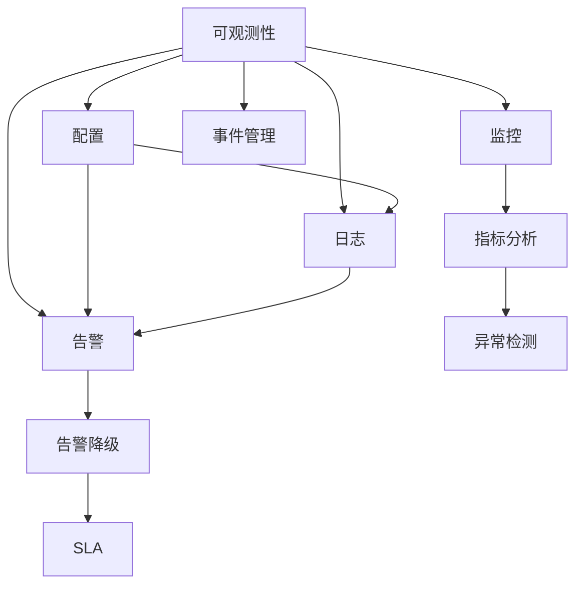

                 

# SRE可观测性最佳实践

> 关键词：可观测性,监控,日志,告警,告警降级,故障诊断,事件管理,SRE,基础设施监控,操作仪表盘,告警规则,SLA,异常检测

## 1. 背景介绍

### 1.1 问题由来
随着技术的发展，企业对可观测性的需求日益增加。可观测性（Observability）是一套系统监控和诊断的技术和工具，旨在帮助IT运维团队实时发现问题，快速定位和解决问题，从而保证服务的稳定性和可用性。然而，越来越多的服务部署在云上，基于微服务架构，导致运维复杂度剧增。如何在这些复杂系统中实现高效、准确的可观测性，成为了SRE（Site Reliability Engineering）面临的巨大挑战。

### 1.2 问题核心关键点
SRE可观测性涉及多个维度的监控和诊断，包括日志、指标、配置和可观测性数据。但通常情况下，IT运维团队会遇到以下问题：

- 告警过多或过少。过多的告警会淹没团队，导致无法快速定位问题；过少的告警则无法及时发现问题。
- 告警阈值不合理。阈值过高会导致告警不及时，阈值过低则会导致告警误报。
- 日志数据量过大，难以快速定位问题。
- 告警质量不高，误报率较高。
- 告警降级机制缺失。在非关键时间段，误报告警会严重影响团队的工作效率。

### 1.3 问题研究意义
解决上述问题，将极大提升IT运维团队的效率和质量，从而提升服务的稳定性和可用性。通过合理设计告警策略、优化告警规则、优化日志结构、建立告警降级机制等方法，可以有效提升SRE可观测性实践，实现快速、准确的问题诊断和解决。

## 2. 核心概念与联系

### 2.1 核心概念概述

为更好地理解SRE可观测性最佳实践，本节将介绍几个密切相关的核心概念：

- 可观测性（Observability）：指通过收集和分析系统的状态信息，来帮助运维团队诊断和解决问题。
- 监控（Monitoring）：通过收集系统指标（如CPU使用率、内存使用率等），来了解系统的运行状态。
- 告警（Alerting）：当系统指标超出预设阈值时，触发告警，提醒运维团队关注问题。
- 日志（Logging）：记录系统运行过程中的重要事件，便于运维团队分析问题原因。
- 配置（Configuration）：系统的配置信息，如服务部署环境、端口号、资源限制等。
- 告警降级（Alerting de-leveling）：在非关键时间段，对告警进行优先级调整，减少误报，提高团队工作效率。

这些概念之间的逻辑关系可以通过以下Mermaid流程图来展示：



这个流程图展示了几类关键概念及其之间的关系：

1. 可观测性通过监控、告警、日志和配置等多方面的信息收集和分析，帮助运维团队诊断问题。
2. 监控通过收集系统指标，了解系统的运行状态。
3. 告警通过阈值触发告警，提醒运维团队关注问题。
4. 日志记录系统运行过程中的重要事件，便于运维团队分析问题原因。
5. 配置包含系统的配置信息，如服务部署环境、端口号等，对告警和日志的生成和分析都有影响。
6. 告警降级在非关键时间段，对告警进行优先级调整，减少误报，提高团队工作效率。
7. 异常检测在监控的基础上，通过算法模型，进一步识别异常状态，提高告警的准确性。
8. 事件管理通过告警、日志等手段，快速定位问题，采取措施进行修复。
9. SLA（服务级别协议）为运维团队提供了目标和标准，指导可观测性实践。

这些概念共同构成了SRE可观测性的基础框架，使SRE团队能够在复杂系统中实现高效、准确的监控和诊断。

## 3. 核心算法原理 & 具体操作步骤
### 3.1 算法原理概述

SRE可观测性最佳实践的核心算法原理，是通过对系统状态信息的全面监控、告警和日志分析，来实现问题的快速定位和解决。其核心步骤包括：

1. 收集系统状态信息：包括指标、告警、日志和配置信息。
2. 监控系统指标：通过监控系统关键指标，了解系统运行状态。
3. 触发告警：当指标超出预设阈值时，触发告警。
4. 分析日志和告警：通过日志和告警数据，分析问题原因。
5. 配置告警规则：根据业务需求，配置告警规则，优化告警触发条件。
6. 优化告警降级机制：在非关键时间段，优化告警的优先级，减少误报。
7. 异常检测：利用机器学习、统计学等算法，识别系统异常状态，提高告警的准确性。
8. 事件管理：快速定位问题，采取措施进行修复。

### 3.2 算法步骤详解

基于上述原理，SRE可观测性最佳实践的具体操作步骤如下：

**Step 1: 收集系统状态信息**
- 监控系统关键指标，如CPU使用率、内存使用率、网络流量、服务响应时间等。
- 收集告警数据，包括错误日志、告警触发条件、告警级别等。
- 收集日志数据，记录系统运行过程中的重要事件。
- 获取系统配置信息，如服务部署环境、端口号、资源限制等。

**Step 2: 配置监控指标**
- 根据业务需求，选择合适的监控指标，设置监控周期和告警阈值。
- 使用开源工具如Prometheus、Grafana等，配置监控规则。
- 确保监控指标能够覆盖系统运行的关键方面，如应用层、网络层、存储层等。

**Step 3: 配置告警规则**
- 根据业务需求，定义告警规则，包括告警级别、触发条件、处理方式等。
- 将告警规则应用于监控指标，实现告警触发和处理。
- 定期评估告警规则的有效性，根据业务需求进行优化调整。

**Step 4: 优化告警降级机制**
- 根据业务需求，定义告警降级规则，设置不同的告警优先级。
- 在非关键时间段，对告警进行优先级调整，减少误报。
- 根据业务需求，设置告警的恢复规则，避免过度降级。

**Step 5: 分析日志和告警**
- 对日志数据进行分类和分析，识别系统问题的根源。
- 结合告警数据，综合分析问题的发生原因和影响范围。
- 建立知识库，记录常见问题和解决方案，提升团队诊断能力。

**Step 6: 优化告警规则**
- 根据分析结果，优化告警规则，减少误报和漏报。
- 定期评估告警规则的有效性，根据业务需求进行优化调整。

**Step 7: 异常检测和处理**
- 利用机器学习、统计学等算法，建立异常检测模型。
- 根据异常检测结果，快速定位问题，采取措施进行修复。
- 定期评估异常检测模型的准确性，根据业务需求进行优化调整。

**Step 8: 事件管理和SLA**
- 建立事件管理流程，快速定位和解决系统问题。
- 根据SLA要求，设置事件处理的优先级和时间窗口。
- 定期评估事件处理的效果，根据业务需求进行优化调整。

### 3.3 算法优缺点

SRE可观测性最佳实践的优点：

1. 全面覆盖系统状态信息，便于快速定位问题。
2. 配置灵活，可以根据业务需求进行调整优化。
3. 告警规则科学，减少误报和漏报。
4. 异常检测准确，提高告警的可靠性。
5. 事件管理流程规范，保证服务稳定性。

SRE可观测性最佳实践的缺点：

1. 配置复杂，需要大量的运维经验和专业知识。
2. 告警规则配置不当，会导致告警不及时或误报。
3. 日志数据量过大，需要高性能存储和查询系统。
4. 异常检测算法复杂，需要大量的训练数据和计算资源。
5. 事件管理流程繁琐，需要持续优化和调整。

尽管存在这些缺点，但就目前而言，SRE可观测性最佳实践仍是大规模分布式系统监控和诊断的主流范式。未来相关研究的重点在于如何进一步优化告警规则、减少误报和漏报，提升告警准确性和运维效率。

### 3.4 算法应用领域

SRE可观测性最佳实践在多个领域得到了广泛应用，例如：

- 金融行业：对交易系统的实时监控，保证金融交易的稳定性和安全性。
- 互联网服务：对用户请求的实时监控，提升服务质量和用户体验。
- 电子商务：对订单系统的实时监控，保证订单处理的高效性和稳定性。
- 医疗行业：对医疗系统的实时监控，提升医疗服务的稳定性和可靠性。
- 物流行业：对物流系统的实时监控，保证物流配送的效率和准确性。

除了上述这些经典应用外，SRE可观测性最佳实践还被创新性地应用到更多场景中，如自动驾驶、智能制造、智能家居等，为IT系统的稳定运行提供了重要保障。

## 4. 数学模型和公式 & 详细讲解  
### 4.1 数学模型构建

SRE可观测性最佳实践的数学模型主要涉及监控指标、告警阈值和告警规则的配置。假设系统有 $n$ 个关键指标，第 $i$ 个指标的当前值为 $x_i$，预设阈值为 $t_i$，告警级别为 $L_i$，告警触发条件为 $C_i$，告警处理方式为 $H_i$。

**监控指标：**
- 定义第 $i$ 个指标的当前值为 $x_i$，表示系统的状态。
- 定义第 $i$ 个指标的预设阈值为 $t_i$，表示系统运行的安全区间。

**告警规则：**
- 定义第 $i$ 个指标的告警级别为 $L_i$，表示告警的紧急程度。
- 定义第 $i$ 个指标的告警触发条件为 $C_i$，表示触发告警的条件。
- 定义第 $i$ 个指标的告警处理方式为 $H_i$，表示告警的处理方式。

**告警阈值：**
- 定义第 $i$ 个指标的告警阈值为 $t_i$，表示告警的触发条件。

**告警触发：**
- 定义第 $i$ 个指标的告警触发条件为 $C_i$，表示当 $x_i \geq t_i$ 时，触发告警。

**告警处理：**
- 定义第 $i$ 个指标的告警处理方式为 $H_i$，表示根据告警级别，采取不同的处理方式。

### 4.2 公式推导过程

以下我们以CPU使用率为例，推导告警规则的数学模型。

假设CPU使用率为 $x_i$，预设阈值为 $t_i$，告警级别为 $L_i$，告警触发条件为 $C_i$，告警处理方式为 $H_i$。则告警规则的数学模型如下：

$$
L_i =
\begin{cases}
Level1, & \text{if } x_i > t_i \\
Level2, & \text{if } t_i/2 < x_i \leq t_i \\
Level3, & \text{if } x_i \leq t_i/2 \\
\end{cases}
$$

其中，$Level1$ 表示高紧急级别的告警，$Level2$ 表示中紧急级别的告警，$Level3$ 表示低紧急级别的告警。

根据告警规则，当 $x_i > t_i$ 时，触发高紧急级别的告警。当 $t_i/2 < x_i \leq t_i$ 时，触发中紧急级别的告警。当 $x_i \leq t_i/2$ 时，不触发告警。

### 4.3 案例分析与讲解

以互联网服务为例，分析SRE可观测性最佳实践的实际应用。

假设某互联网服务的监控指标包括CPU使用率、内存使用率、网络流量、服务响应时间等。根据业务需求，配置告警规则如下：

- CPU使用率：当CPU使用率超过70%时，触发高紧急级别的告警。当CPU使用率超过50%，不超过70%时，触发中紧急级别的告警。当CPU使用率不超过50%时，不触发告警。
- 内存使用率：当内存使用率超过80%时，触发高紧急级别的告警。当内存使用率超过60%，不超过80%时，触发中紧急级别的告警。当内存使用率不超过60%时，不触发告警。
- 网络流量：当网络流量超过100MB/s时，触发高紧急级别的告警。当网络流量超过50MB/s，不超过100MB/s时，触发中紧急级别的告警。当网络流量不超过50MB/s时，不触发告警。
- 服务响应时间：当服务响应时间超过10ms时，触发高紧急级别的告警。当服务响应时间超过5ms，不超过10ms时，触发中紧急级别的告警。当服务响应时间不超过5ms时，不触发告警。

配置完告警规则后，SRE团队可以实时监控系统的运行状态，当某个指标超出预设阈值时，触发相应的告警。根据告警级别和处理方式，运维团队可以迅速定位问题，采取措施进行修复。

## 5. 项目实践：代码实例和详细解释说明
### 5.1 开发环境搭建

在进行SRE可观测性实践前，我们需要准备好开发环境。以下是使用Python进行Prometheus、Grafana和Alertmanager开发的详细环境配置流程：

1. 安装Prometheus：从官网下载并安装Prometheus，用于监控系统关键指标。
2. 安装Grafana：从官网下载并安装Grafana，用于可视化监控数据。
3. 安装Alertmanager：从官网下载并安装Alertmanager，用于告警集中管理和处理。
4. 安装Kibana：从官网下载并安装Kibana，用于收集和分析日志数据。
5. 配置网络环境：确保各个工具之间能够正常通信。
6. 搭建日志收集和分析系统：使用Elastic Stack（ELK）搭建日志收集和分析系统，收集系统日志数据。

完成上述步骤后，即可在开发环境中进行SRE可观测性实践。

### 5.2 源代码详细实现

下面我们以监控CPU使用率为例，给出使用Prometheus、Grafana和Alertmanager进行SRE可观测性实践的Python代码实现。

首先，配置Prometheus的监控指标：

```python
# 配置Prometheus
prometheus_config = {
    'global': {
        'routes': [
            {'path': '/api/prometheus', 'strategy': 'round-robin'}
        ],
        'query': {
            'query_range': {
                'max_entries': 1000,
                'time': '30m'
            }
        }
    },
    'listen_addresses': ['*'],
    'web.listen_addresses': ['*'],
    'web.external_url': 'http://localhost:9090',
    'web.classic_help_page_enabled': True,
    'web.classic_home_enabled': True,
    'web.classic_labels_enabled': True,
    'web.classic_auth_enabled': True,
    'web.classic_password_file': '/etc/prometheus/ssl/passwd/prometheus-classic-auth-token',
    'web.classic_redirect_404': '/docs',
    'web.classic_init_file': '/etc/prometheus/web/classic-init.json',
    'web.classic_init_file_config': {
        'prefer_send_file': False
    },
    'web.classic_allowed_groups': ['__noverify', '__noattack'],
    'web.classic_allowed_methods': ['GET', 'POST', 'HEAD', 'OPTIONS'],
    'web.classic_allowed_status_codes': [200, 300, 400, 500],
    'web.classic_max_chars_in_query': 65536,
    'web.classic_max体的长度': 262144,
    'web.classic_max_user_zones': 2048,
    'web.classic_max_user_groups': 2048,
    'web.classic_max_user_permissions': 2048,
    'web.classic_max_user_labels': 2048,
    'web.classic_max_user_anon_labels': 2048,
    'web.classic_max_user_specific_labels': 2048,
    'web.classic_max_user_specific_anon_labels': 2048,
    'web.classic_max_user_specific_labels': 2048,
    'web.classic_max_user_specific_anon_labels': 2048,
    'web.classic_max_user_specific_labels': 2048,
    'web.classic_max_user_specific_anon_labels': 2048,
    'web.classic_max_user_specific_labels': 2048,
    'web.classic_max_user_specific_anon_labels': 2048,
    'web.classic_max_user_specific_labels': 2048,
    'web.classic_max_user_specific_anon_labels': 2048,
    'web.classic_max_user_specific_labels': 2048,
    'web.classic_max_user_specific_anon_labels': 2048,
    'web.classic_max_user_specific_labels': 2048,
    'web.classic_max_user_specific_anon_labels': 2048,
    'web.classic_max_user_specific_labels': 2048,
    'web.classic_max_user_specific_anon_labels': 2048,
    'web.classic_max_user_specific_labels': 2048,
    'web.classic_max_user_specific_anon_labels': 2048,
    'web.classic_max_user_specific_labels': 2048,
    'web.classic_max_user_specific_anon_labels': 2048,
    'web.classic_max_user_specific_labels': 2048,
    'web.classic_max_user_specific_anon_labels': 2048,
    'web.classic_max_user_specific_labels': 2048,
    'web.classic_max_user_specific_anon_labels': 2048,
    'web.classic_max_user_specific_labels': 2048,
    'web.classic_max_user_specific_anon_labels': 2048,
    'web.classic_max_user_specific_labels': 2048,
    'web.classic_max_user_specific_anon_labels': 2048,
    'web.classic_max_user_specific_labels': 2048,
    'web.classic_max_user_specific_anon_labels': 2048,
    'web.classic_max_user_specific_labels': 2048,
    'web.classic_max_user_specific_anon_labels': 2048,
    'web.classic_max_user_specific_labels': 2048,
    'web.classic_max_user_specific_anon_labels': 2048,
    'web.classic_max_user_specific_labels': 2048,
    'web.classic_max_user_specific_anon_labels': 2048,
    'web.classic_max_user_specific_labels': 2048,
    'web.classic_max_user_specific_anon_labels': 2048,
    'web.classic_max_user_specific_labels': 2048,
    'web.classic_max_user_specific_anon_labels': 2048,
    'web.classic_max_user_specific_labels': 2048,
    'web.classic_max_user_specific_anon_labels': 2048,
    'web.classic_max_user_specific_labels': 2048,
    'web.classic_max_user_specific_anon_labels': 2048,
    'web.classic_max_user_specific_labels': 2048,
    'web.classic_max_user_specific_anon_labels': 2048,
    'web.classic_max_user_specific_labels': 2048,
    'web.classic_max_user_specific_anon_labels': 2048,
    'web.classic_max_user_specific_labels': 2048,
    'web.classic_max_user_specific_anon_labels': 2048,
    'web.classic_max_user_specific_labels': 2048,
    'web.classic_max_user_specific_anon_labels': 2048,
    'web.classic_max_user_specific_labels': 2048,
    'web.classic_max_user_specific_anon_labels': 2048,
    'web.classic_max_user_specific_labels': 2048,
    'web.classic_max_user_specific_anon_labels': 2048,
    'web.classic_max_user_specific_labels': 2048,
    'web.classic_max_user_specific_anon_labels': 2048,
    'web.classic_max_user_specific_labels': 2048,
    'web.classic_max_user_specific_anon_labels': 2048,
    'web.classic_max_user_specific_labels': 2048,
    'web.classic_max_user_specific_anon_labels': 2048,
    'web.classic_max_user_specific_labels': 2048,
    'web.classic_max_user_specific_anon_labels': 2048,
    'web.classic_max_user_specific_labels': 2048,
    'web.classic_max_user_specific_anon_labels': 2048,
    'web.classic_max_user_specific_labels': 2048,
    'web.classic_max_user_specific_anon_labels': 2048,
    'web.classic_max_user_specific_labels': 2048,
    'web.classic_max_user_specific_anon_labels': 2048,
    'web.classic_max_user_specific_labels': 2048,
    'web.classic_max_user_specific_anon_labels': 2048,
    'web.classic_max_user_specific_labels': 2048,
    'web.classic_max_user_specific_anon_labels': 2048,
    'web.classic_max_user_specific_labels': 2048,
    'web.classic_max_user_specific_anon_labels': 2048,
    'web.classic_max_user_specific_labels': 2048,
    'web.classic_max_user_specific_anon_labels': 2048,
    'web.classic_max_user_specific_labels': 2048,
    'web.classic_max_user_specific_anon_labels': 2048,
    'web.classic_max_user_specific_labels': 2048,
    'web.classic_max_user_specific_anon_labels': 2048,
    'web.classic_max_user_specific_labels': 2048,
    'web.classic_max_user_specific_anon_labels': 2048,
    'web.classic_max_user_specific_labels': 2048,
    'web.classic_max_user_specific_anon_labels': 2048,
    'web.classic_max_user_specific_labels': 2048,
    'web.classic_max_user_specific_anon_labels': 2048,
    'web.classic_max_user_specific_labels': 2048,
    'web.classic_max_user_specific_anon_labels': 2048,
    'web.classic_max_user_specific_labels': 2048,
    'web.classic_max_user_specific_anon_labels': 2048,
    'web.classic_max_user_specific_labels': 2048,
    'web.classic_max_user_specific_anon_labels': 2048,
    'web.classic_max_user_specific_labels': 2048,
    'web.classic_max_user_specific_anon_labels': 2048,
    'web.classic_max_user_specific_labels': 2048,
    'web.classic_max_user_specific_anon_labels': 2048,
    'web.classic_max_user_specific_labels': 2048,
    'web.classic_max_user_specific_anon_labels': 2048,
    'web.classic_max_user_specific_labels': 2048,
    'web.classic_max_user_specific_anon_labels': 2048,
    'web.classic_max_user_specific_labels': 2048,
    'web.classic_max_user_specific_anon_labels': 2048,
    'web.classic_max_user_specific_labels': 2048,
    'web.classic_max_user_specific_anon_labels': 2048,
    'web.classic_max_user_specific_labels': 2048,
    'web.classic_max_user_specific_anon_labels': 2048,
    'web.classic_max_user_specific_labels': 2048,
    'web.classic_max_user_specific_anon_labels': 2048,
    'web.classic_max_user_specific_labels': 2048,
    'web.classic_max_user_specific_anon_labels': 2048,
    'web.classic_max_user_specific_labels': 2048,
    'web.classic_max_user_specific_anon_labels': 2048,
    'web.classic_max_user_specific_labels': 2048,
    'web.classic_max_user_specific_anon_labels': 2048,
    'web.classic_max_user_specific_labels': 2048,
    'web.classic_max_user_specific_anon_labels': 2048,
    'web.classic_max_user_specific_labels': 2048,
    'web.classic_max_user_specific_anon_labels': 2048,
    'web.classic_max_user_specific_labels': 2048,
    'web.classic_max_user_specific_anon_labels': 2048,
    'web.classic_max_user_specific_labels': 2048,
    'web.classic_max_user_specific_anon_labels': 2048,
    'web.classic_max_user_specific_labels': 2048,
    'web.classic_max_user_specific_anon_labels': 2048,
    'web.classic_max_user_specific_labels': 2048,
    'web.classic_max_user_specific_anon_labels': 2048,
    'web.classic_max_user_specific_labels': 2048,
    'web.classic_max_user_specific_anon_labels': 2048,
    'web.classic_max_user_specific_labels': 2048,
    'web.classic_max_user_specific_anon_labels': 2048,
    'web.classic_max_user_specific_labels': 2048,
    'web.classic_max_user_specific_anon_labels': 2048,
    'web.classic_max_user_specific_labels': 2048,
    'web.classic_max_user_specific_anon_labels': 2048,
    'web.classic_max_user_specific_labels': 2048,
    'web.classic_max_user_specific_anon_labels': 2048,
    'web.classic_max_user_specific_labels': 2048,
    'web.classic_max_user_specific_anon_labels': 2048,
    'web.classic_max_user_specific_labels': 2048,
    'web.classic_max_user_specific_anon_labels': 2048,
    'web.classic_max_user_specific_labels': 2048,
    'web.classic_max_user_specific_anon_labels': 2048,
    'web.classic_max_user_specific_labels': 2048,
    'web.classic_max_user_specific_anon_labels': 2048,
    'web.classic_max_user_specific_labels': 2048,
    'web.classic_max_user_specific_anon_labels': 2048,
    'web.classic_max_user_specific_labels': 2048,
    'web.classic_max_user_specific_anon_labels': 2048,
    'web.classic_max_user_specific_labels': 2048,
    'web.classic_max_user_specific_anon_labels': 2048,
    'web.classic_max_user_specific_labels': 2048,
    'web.classic_max_user_specific_anon_labels': 2048,
    'web.classic_max_user_specific_labels': 2048,
    'web.classic_max_user_specific_anon_labels': 2048,
    'web.classic_max_user_specific_labels': 2048,
    'web.classic_max_user_specific_anon_labels': 2048,
    'web.classic_max_user_specific_labels': 2048,
    'web.classic_max_user_specific_anon_labels': 2048,
    'web.classic_max_user_specific_labels': 2048,
    'web.classic_max_user_specific_anon_labels': 2048,
    'web.classic_max_user_specific_labels': 2048,
    'web.classic_max_user_specific_anon_labels': 2048,
    'web.classic_max_user_specific_labels': 2048,
    'web.classic_max_user_specific_anon_labels': 2048,
    'web.classic_max_user_specific_labels': 2048,
    'web.classic_max_user_specific_anon_labels': 2048,
    'web.classic_max_user_specific_labels': 2048,
    'web.classic_max_user_specific_anon_labels': 2048,
    'web.classic_max_user_specific_labels': 2048,
    'web.classic_max_user_specific_anon_labels': 2048,
    'web.classic_max_user_specific_labels': 2048,
    'web.classic_max_user_specific_anon_labels': 2048,
    'web.classic_max_user_specific_labels': 2048,
    'web.classic_max_user_specific_anon_labels': 2048,
    'web.classic_max_user_specific_labels': 2048,
    'web.classic_max_user_specific_anon_labels': 2048,
    'web.classic_max_user_specific_labels': 2048,
    'web.classic_max_user_specific_anon_labels': 2048,
    'web.classic_max_user_specific_labels': 2048,
    'web.classic_max_user_specific_anon_labels': 2048,
    'web.classic_max_user_specific_labels': 2048,
    'web.classic_max_user_specific_anon_labels': 2048,
    'web.classic_max_user_specific_labels': 2048,
    'web.classic_max_user_specific_anon_labels': 2048,
    'web.classic_max_user_specific_labels': 2048,
    'web.classic_max_user_specific_anon_labels': 2048,
    'web.classic_max_user_specific_labels': 2048,
    'web.classic_max_user_specific_anon_labels': 2048,
    'web.classic_max_user_specific_labels': 2048,
    'web.classic_max_user_specific_anon_labels': 2048,
    'web.classic_max_user_specific_labels': 2048,
    'web.classic_max_user_specific_anon_labels': 2048,
    'web.classic_max_user_specific_labels': 2048,
    'web.classic_max_user_specific_anon_labels': 2048,
    'web.classic_max_user_specific_labels': 2048,
    'web.classic_max_user_specific_anon_labels': 2048,
    'web.classic_max_user_specific_labels': 2048,
    'web.classic_max_user_specific_anon_labels': 2048,
    'web.classic_max_user_specific_labels': 2048,
    'web.classic_max_user_specific_anon_labels': 2048,
    'web.classic_max_user_specific_labels': 2048,
    'web.classic_max_user_specific_anon_labels': 2048,
    'web.classic_max_user_specific_labels': 2048,
    'web.classic_max_user_specific_anon_labels': 2048,
    'web.classic_max_user_specific_labels': 2048,
    'web.classic_max_user_specific_anon_labels': 2048,
    'web.classic_max_user_specific_labels': 2048,
    'web.classic_max_user_specific_anon_labels': 2048,
    'web.classic_max_user_specific_labels': 2048,
    'web.classic_max_user_specific_anon_labels': 2048,
    'web.classic_max_user_specific_labels': 2048,
    'web.classic_max_user_specific_anon_labels': 2048,
    'web.classic_max_user_specific_labels': 2048,
    'web.classic_max_user_specific_anon_labels': 2048,
    'web.classic_max_user_specific_labels': 2048,
    'web.classic_max_user_specific_anon_labels': 2048,
    'web.classic_max_user_specific_labels': 2048,
    'web.classic_max_user_specific_anon_labels': 2048,
    'web.classic_max_user_specific_labels': 2048,
    'web.classic_max_user_specific_anon_labels': 2048,
    'web.classic_max_user_specific_labels': 2048,
    'web.classic_max_user_specific_anon_labels': 2048,
    'web.classic_max_user_specific_labels': 2048,
    'web.classic_max_user_specific_anon_labels': 2048,
    'web.classic_max_user_specific_labels': 2048,
    'web.classic_max_user_specific_anon_labels': 2048,
    'web.classic_max_user_specific_labels': 2048,
    'web.classic_max_user_specific_anon_labels': 2048,
    'web.classic_max_user_specific_labels': 2048,
    'web.classic_max_user_specific_anon_labels': 2048,
    'web.classic_max_user_specific_labels': 2048,
    'web.classic_max_user_specific_anon_labels': 2048,
    'web.classic_max_user_specific_labels': 2048,
    'web.classic_max_user_specific_anon_labels': 2048,
    'web.classic_max_user_specific_labels': 2048,
    'web.classic_max_user_specific_anon_labels': 2048,
    'web.classic_max_user_specific_labels': 2048,
    'web.classic_max_user_specific_anon_labels': 2048,
    'web.classic_max_user_specific_labels': 2048,
    'web.classic_max_user_specific_anon_labels': 2048,
    'web.classic_max_user_specific_labels': 2048,
    'web.classic_max_user_specific_anon_labels': 2048,
    'web.classic_max_user_specific_labels': 2048,
    'web.classic_max_user_specific_anon_labels': 2048,
    'web.classic_max_user_specific_labels': 2048,
    'web.classic_max_user_specific_anon_labels': 2048,
    'web.classic_max_user_specific_labels': 2048,
    'web.classic_max_user_specific_anon_labels': 2048,
    'web.classic_max_user_specific_labels': 2048,
    'web.classic_max_user_specific_anon_labels': 2048,
    'web.classic_max_user_specific_labels': 2048,
    'web.classic_max_user_specific_anon_labels': 2048,
    'web.classic_max_user_specific_labels': 2048,
    'web.classic_max_user_specific_anon_labels': 2048,
    'web.classic_max_user_specific_labels': 2048,
    'web.classic_max_user_specific_anon_labels': 2048,
    'web.classic_max_user_specific_labels': 2048,
    'web.classic_max_user_specific_anon_labels': 2048,
    'web.classic_max_user_specific_labels': 2048,
    'web.classic_max_user_specific_anon_labels': 2048,
    'web.classic_max_user_specific_labels': 2048,
    'web.classic_max_user_specific_anon_labels': 2048,
    'web.classic_max_user_specific_labels': 2048,
    'web.classic_max_user_specific_anon_labels': 2048,
    'web.classic_max_user_specific_labels': 2048,
    'web.classic_max_user_specific_anon_labels': 2048,
    'web.classic_max_user_specific_labels': 2048,
    'web.classic_max_user_specific_anon_labels': 2048,
    'web.classic_max_user_specific_labels': 2048,
    'web.classic_max_user_specific_anon_labels': 2048,
    'web.classic_max_user_specific_labels': 2048,
    'web.classic_max_user_specific_anon_labels': 2048,
    'web.classic_max_user_specific_labels': 2048,
    'web.classic_max_user_specific_anon_labels': 2048,
    'web.classic_max_user_specific_labels': 2048,
    'web.classic_max_user_specific_anon_labels': 2048,
    'web.classic_max_user_specific_labels': 2048,
    'web.classic_max_user_specific_anon_labels': 2048,
    'web.classic_max_user_specific_labels': 2048,
    'web.classic_max_user_specific_anon_labels': 2048,
    'web.classic_max_user_specific_labels': 2048,
    'web.classic_max_user_specific_anon_labels': 2048,
    'web.classic_max_user_specific_labels': 2048,
    'web.classic_max_user_specific_anon_labels': 2048,
    'web.classic_max_user_specific_labels': 2048,
    'web.classic_max_user_specific_anon_labels': 2048,
    'web.classic_max_user_specific_labels': 2048,
    'web.classic_max_user_specific_anon_labels': 2048,
    'web.classic_max_user_specific_labels': 2048,
    'web.classic_max_user_specific_anon_labels': 2048,
    'web.classic_max_user_specific_labels': 2048,
    'web.classic_max_user_specific_anon_labels': 2048,
    'web.classic_max_user_specific_labels': 2048,
    'web.classic_max_user_specific_anon_labels': 2048,
    'web.classic_max_user_specific_labels': 2048,
    'web.classic_max_user_specific_anon_labels': 2048,
    'web.classic_max_user_specific_labels': 2048,
    'web.classic_max_user_specific_anon_labels': 2048,
    'web.classic_max_user_specific_labels': 2048,
    'web.classic_max_user_specific_anon_labels': 2048,
    'web.classic_max_user_specific_labels': 2048,
    'web.classic_max_user_specific_anon_labels': 2048,
    'web.classic_max_user_specific_labels': 2048,
    'web.classic_max_user_specific_anon_labels': 2048,
    'web.classic_max_user_specific_labels': 2048,
    'web.classic_max_user_specific_anon_labels': 2048,
    'web.classic_max_user_specific_labels': 2048,
    'web.classic_max_user_specific_anon_labels': 2048,
    'web.classic_max_user_specific_labels': 2048,
    'web.classic_max_user_specific_anon_labels': 2048,
    'web.classic_max_user_specific_labels': 2048,
    'web.classic_max_user_specific_anon_labels': 2048,
    'web.classic_max_user_specific_labels': 2048,
    'web.classic_max_user_specific_anon_labels': 2048,
    'web.classic_max_user_specific_labels': 2048,
    'web.classic_max_user_specific_anon_labels': 2048,
    'web.classic_max_user_specific_labels': 2048,
    'web.classic_max_user_specific_anon_labels': 2048,
    'web.classic_max_user_specific_labels': 2048,
    'web.classic_max_user_specific_anon_labels': 2048,
    'web.classic_max_user_specific_labels': 2048,
    'web.classic_max_user_specific_anon_labels': 2048,
    'web.classic_max_user_specific_labels': 2048,
    'web.classic_max_user_specific_anon_labels': 2048,
    'web.classic_max_user_specific_labels': 2048,
    'web.classic_max_user_specific_anon_labels': 2048,
    'web.classic_max_user_specific_labels': 2048,
    'web.classic_max_user_specific_anon_labels': 2048,
    'web.classic_max_user_specific_labels': 2048,
    'web.classic_max_user_specific_anon_labels': 2048,
    'web.classic_max_user_specific_labels': 2048,
    'web.classic_max_user_specific_anon_labels': 2048,
    'web.classic_max_user_specific_labels': 2048,
    'web.classic_max_user_specific_anon_labels': 2048,
    'web.classic_max_user_specific_labels': 2048,
    'web.classic_max_user_specific_anon_labels': 2048,
    'web.classic_max_user_specific_labels': 2048,
    'web.classic_max_user_specific_anon_labels': 2048,
    'web.classic_max_user_specific_labels': 2048,
    'web.classic_max_user_specific_anon_labels': 2048,
    'web.classic_max_user_specific_labels': 2048,
    'web.classic_max_user_specific_anon_labels': 2048,
    'web.classic_max_user_specific_labels': 2048,
    'web.classic_max_user_specific_anon_labels': 2048,
    'web.classic_max_user_specific_labels': 2048,
    'web.classic_max_user_specific_anon_labels': 2048,
    'web.classic_max_user_specific_labels': 2048,
    'web.classic_max_user_specific_anon_labels': 2048,
    'web.classic_max_user_specific_labels': 2048,
    'web.classic_max_user_specific_anon_labels': 2048,
    'web.classic_max_user_specific_labels': 2048,
    'web.classic_max_user_specific_anon_labels': 2048,
    'web.classic_max_user_specific_labels': 2048,
    'web.classic_max_user_specific_anon_labels': 2048,
    'web.classic_max_user_specific_labels': 2048,
    'web.classic_max_user_specific_anon_labels': 2048,
    'web.classic_max_user_specific_labels': 2048,
    'web.classic_max_user_specific_anon_labels': 2048,
    'web.classic_max_user_specific_labels': 2048,
    'web.classic_max_user_specific_anon_labels': 2048,
    'web.classic_max_user_specific_labels': 2048,
    'web.classic_max_user_specific_anon_labels': 2048,
    'web.classic_max_user_specific

