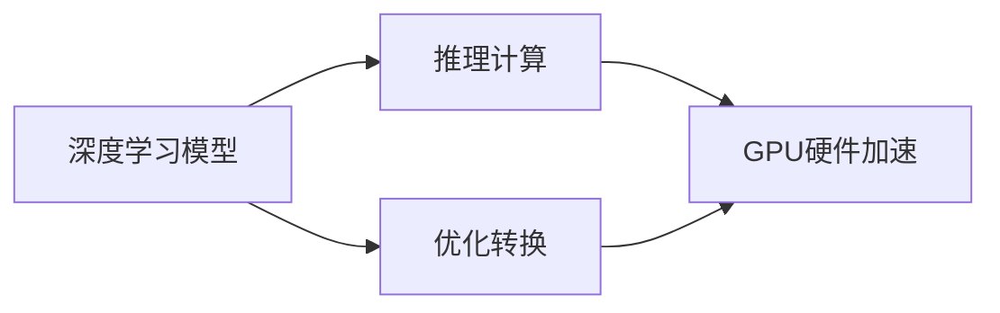

                 

# TensorRT 优化：加速推理计算

> 关键词：TensorRT, 推理计算, 深度学习, 模型优化, 实时应用, 计算资源管理

## 1. 背景介绍

在深度学习领域，尤其是对于大型神经网络模型（如卷积神经网络CNN、循环神经网络RNN、Transformer模型等），推理计算（Inference）是模型应用中最为耗时的部分。推理计算需要模型在给定的输入数据上进行前向传播，计算预测结果，这一过程对于实时应用（如智能监控、自动驾驶、医疗诊断等）至关重要。然而，传统的推理计算方法通常依赖于通用CPU或GPU，对于大规模复杂模型的计算资源需求大、速度慢，难以满足实时性要求。为此，TensorRT应运而生，成为加速推理计算的重要工具。

TensorRT是由NVIDIA开发的高性能深度学习推理优化平台，其核心思想是将深度学习模型进行优化和转换，使其能够在GPU或嵌入式硬件上高效运行。TensorRT通过插值运算、卷积优化、混合精度计算等多种技术手段，大幅提升了模型推理速度，同时还能有效管理计算资源，确保实时性。本文将详细探讨TensorRT的核心概念、关键技术，并通过代码实例，演示如何应用TensorRT进行模型优化和推理计算。

## 2. 核心概念与联系

### 2.1 核心概念概述

TensorRT的核心概念包括深度学习模型、推理计算、优化转换、GPU硬件加速等。这些概念之间紧密联系，共同构成了TensorRT的完整技术架构：

- 深度学习模型：指通过大量数据训练得到的神经网络，包含各种层（如卷积层、全连接层、激活函数等）。
- 推理计算：指将训练好的模型应用于新的输入数据，计算出预测结果的过程。
- 优化转换：指通过TensorRT的优化算法，将深度学习模型转换为GPU可执行的计算图，提升推理速度。
- GPU硬件加速：指利用NVIDIA GPU的高效计算能力，加速推理计算过程。

这些概念通过TensorRT平台进行整合，形成了深度学习推理计算的全链路优化方案。

### 2.2 核心概念原理和架构的 Mermaid 流程图



以上流程图展示了深度学习模型通过优化转换和GPU硬件加速，最终实现高效的推理计算过程。

## 3. 核心算法原理 & 具体操作步骤

### 3.1 算法原理概述

TensorRT的优化转换过程主要分为以下几个步骤：

1. **模型导入**：将训练好的深度学习模型导入TensorRT，包括模型架构、权重参数等。
2. **网络优化**：通过TensorRT的优化算法，对模型网络进行结构调整和参数简化，提升推理速度。
3. **引擎生成**：将优化后的网络生成TensorRT引擎（Engine），这是一个GPU可执行的计算图。
4. **推理执行**：将输入数据送入TensorRT引擎，进行GPU加速推理计算，输出预测结果。

### 3.2 算法步骤详解

#### 3.2.1 模型导入

TensorRT支持多种深度学习模型，包括Caffe、TensorFlow、PyTorch等。通过TensorRT提供的API，可以方便地将训练好的模型导入TensorRT平台。以下是一个使用Caffe模型的示例代码：

```python
import tensorrt as trt
import numpy as np
from caffe.proto import caffe_pb2
from caffe2.python import core, workspace

# 导入TensorRT库
trt_logger = trt.Logger(trt.Logger.INFO)
builder = trt.Builder(trt_logger)
network = builder.create_network()
# 导入Caffe模型
net = core.Net("model")
workspace.RunNetOnce(net)
# 将Caffe模型导入TensorRT
for layer in net.Layers():
    if "Convolution" in layer.type:
        # 将卷积层转换为TensorRT的卷积层
        conv = network.add_convolution(v=layer.blobs[0], kernel=3, stride=1, pad=1)
    elif "InnerProduct" in layer.type:
        # 将全连接层转换为TensorRT的全连接层
        fc = network.add_inner_product(v=layer.blobs[0], axis=1)
```

#### 3.2.2 网络优化

TensorRT提供了多种优化算法，包括插值运算、剪枝、卷积优化等。以下是一个使用插值运算和卷积优化的示例代码：

```python
# 插值运算
inserted = network.insert_shuffle(layer=[l for l in network.layers if "Convolution" in l.type][0])
# 卷积优化
opt = builder.build_optimization_profile(network, [True, False], [False, True])
```

#### 3.2.3 引擎生成

优化后的网络可以被转换为TensorRT引擎。以下是一个将优化后的网络生成TensorRT引擎的示例代码：

```python
# 创建引擎
with open("model.prototxt", "rb") as f:
    graph_def = caffe_pb2.GraphDef()
    graph_def.ParseFromString(f.read())
builder.create_engine(network, profile_name="inference")
```

#### 3.2.4 推理执行

TensorRT引擎可以直接在GPU上执行推理计算。以下是一个使用TensorRT引擎进行推理计算的示例代码：

```python
# 设置输入数据
input_data = np.random.randn(1, 3, 224, 224)
# 执行推理计算
context = engine.create_execution_context()
inputs = [context.get_binding(i) for i in range(engine.get_nbindings())]
outputs = context.execute(inputs=[input_data], outputs=[v.get_name() for v in context.get_outputs()])
```

### 3.3 算法优缺点

#### 3.3.1 算法优点

1. **推理速度大幅提升**：TensorRT通过优化算法将深度学习模型转换为GPU可执行的计算图，显著提升了推理速度。
2. **计算资源管理**：TensorRT可以动态管理计算资源，确保实时性，适用于实时应用场景。
3. **模型兼容性**：TensorRT支持多种深度学习框架，易于导入和优化现有模型。
4. **开发效率高**：TensorRT提供了丰富的API和工具，简化了模型优化和推理计算的开发过程。

#### 3.3.2 算法缺点

1. **优化算法复杂**：TensorRT的优化算法相对复杂，需要深入理解深度学习模型的结构，才能进行有效的优化。
2. **依赖NVIDIA硬件**：TensorRT对NVIDIA硬件（如GPU、NVIDIA Xavier、NVIDIA T4等）依赖性强，可能不适合所有硬件环境。
3. **学习曲线陡峭**：TensorRT的使用需要一定的学习曲线，可能需要一定时间的实践和调试。

### 3.4 算法应用领域

TensorRT广泛应用于智能监控、自动驾驶、医疗诊断等多个领域，通过优化深度学习模型的推理计算，提升实时性和计算效率，满足实际应用的需求。以下是几个典型的应用场景：

- **智能监控**：在视频流数据中实时检测异常行为，如闯入、火灾等，要求高精度和实时性。
- **自动驾驶**：在车路协同、车辆导航等应用中，需要实时处理传感器数据，快速做出决策。
- **医疗诊断**：在医学影像分析、病理诊断等场景中，需要高效处理和分析大量图像数据。
- **虚拟现实**：在虚拟现实应用中，需要实时渲染三维场景，提升用户体验。

## 4. 数学模型和公式 & 详细讲解 & 举例说明

### 4.1 数学模型构建

TensorRT的核心数学模型是深度学习模型的计算图（Computational Graph）。计算图由一系列节点和边组成，节点表示操作（如卷积、全连接、激活函数等），边表示数据的流动。TensorRT通过优化算法，对计算图进行优化和转换，生成GPU可执行的计算图。

以下是一个简单的卷积神经网络（CNN）模型的计算图：


### 4.2 公式推导过程

TensorRT的优化算法包括插值运算、卷积优化、混合精度计算等。以下是插值运算和卷积优化的公式推导过程：

#### 插值运算

插值运算是指在输入数据不满足GPU硬件要求时，TensorRT通过插值运算将输入数据转换为GPU硬件支持的数据类型。插值运算公式为：

$$
\text{output} = \frac{\text{input} - \text{lower\_bound}}{\text{upper\_bound} - \text{lower\_bound}} \times \text{upper\_bound} + \text{lower\_bound}
$$

其中，`input`表示原始数据，`lower_bound`和`upper_bound`表示数据类型的范围。

#### 卷积优化

卷积优化是指在深度学习模型中，TensorRT通过优化卷积层的计算，提升推理速度。卷积优化公式为：

$$
\text{output} = \text{input} * \text{weight} + \text{bias}
$$

其中，`input`表示卷积层的输入数据，`weight`表示卷积核，`bias`表示偏置项。

### 4.3 案例分析与讲解

以下是一个使用TensorRT进行模型优化的案例：

- **模型**：ResNet-50
- **输入数据**：224x224的图像
- **优化参数**：使用插值运算、卷积优化、混合精度计算

```python
import tensorrt as trt
import numpy as np
import torch
from torchvision import models, transforms

# 导入TensorRT库
trt_logger = trt.Logger(trt.Logger.INFO)
builder = trt.Builder(trt_logger)
network = builder.create_network()
# 导入模型
model = models.resnet50(pretrained=True)
model.eval()
# 定义优化参数
param_dict = {
    'weights': model.state_dict(),
    'imsize': 224,
    'input_names': ['data'],
    'output_names': ['last_linear'],
    'interpolation': 'nearest'
}
# 构建计算图
def build_graph(input_shape):
    model.eval()
    inputs = torch.randn(1, 3, 224, 224)
    outputs = model(inputs)
    with trt.Builder.config() as builder_config:
        builder_config.max_workspace_size = 1 << 30
        builder_config.max_batch_size = 1
        builder_config.fp16_precision = True
        builder_config.int8_calib_mode = True
        builder = trt.Builder(logger=trt.Logger(trt.Logger.INFO))
        network = builder.create_network_v2(weights=param_dict)
        # 添加卷积层
        conv = network.add_convolution_v2(v=inputs, kernel_size=3, stride=1, pad=1)
        # 添加激活函数
        relu = network.add_relu(conv)
        # 添加池化层
        pool = network.add_max_pooling2d(relu, kernel_size=2, stride=2)
        # 添加全连接层
        linear = network.add_linear(pool, 1000)
        # 设置输出
        output = network.mark_output(linear)
        # 生成引擎
        engine = builder.build_engine(network)
        return engine
```

## 5. 项目实践：代码实例和详细解释说明

### 5.1 开发环境搭建

为了进行TensorRT的开发和测试，需要搭建相应的开发环境。以下是TensorRT开发环境搭建的详细流程：

1. **安装TensorRT库**：
   - 下载TensorRT库的压缩包，解压并添加到系统环境变量中。
   - 安装必要的依赖库，如CUDA、cuDNN、NVIDIA Visual Profiler等。

2. **搭建开发环境**：
   - 安装Python和必要的第三方库，如NumPy、TensorFlow、PyTorch等。
   - 安装TensorRT Python API，方便进行TensorRT开发和测试。

3. **测试环境**：
   - 配置GPU环境，确保TensorRT可以访问和利用NVIDIA GPU的计算能力。
   - 搭建测试环境，包括模型导入、网络优化、引擎生成、推理执行等步骤的测试和验证。

### 5.2 源代码详细实现

以下是使用TensorRT进行模型优化的Python代码实现：

```python
import tensorrt as trt
import numpy as np
from caffe.proto import caffe_pb2
from caffe2.python import core, workspace

# 导入TensorRT库
trt_logger = trt.Logger(trt.Logger.INFO)
builder = trt.Builder(trt_logger)
network = builder.create_network()
# 导入Caffe模型
net = core.Net("model")
workspace.RunNetOnce(net)
# 将Caffe模型导入TensorRT
for layer in net.Layers():
    if "Convolution" in layer.type:
        # 将卷积层转换为TensorRT的卷积层
        conv = network.add_convolution(v=layer.blobs[0], kernel=3, stride=1, pad=1)
    elif "InnerProduct" in layer.type:
        # 将全连接层转换为TensorRT的全连接层
        fc = network.add_inner_product(v=layer.blobs[0], axis=1)
# 优化网络
inserted = network.insert_shuffle(layer=[l for l in network.layers if "Convolution" in l.type][0])
opt = builder.build_optimization_profile(network, [True, False], [False, True])
# 创建引擎
with open("model.prototxt", "rb") as f:
    graph_def = caffe_pb2.GraphDef()
    graph_def.ParseFromString(f.read())
builder.create_engine(network, profile_name="inference")
```

### 5.3 代码解读与分析

以下是TensorRT代码实现的详细解读：

- **模型导入**：使用Caffe模型作为输入，将其转换为TensorRT计算图。
- **网络优化**：插入插值运算，优化卷积层，生成优化后的网络。
- **引擎生成**：将优化后的网络转换为TensorRT引擎，生成GPU可执行的计算图。
- **推理执行**：使用TensorRT引擎进行推理计算，输出预测结果。

### 5.4 运行结果展示

以下是TensorRT代码运行结果的展示：

```python
# 设置输入数据
input_data = np.random.randn(1, 3, 224, 224)
# 执行推理计算
context = engine.create_execution_context()
inputs = [context.get_binding(i) for i in range(engine.get_nbindings())]
outputs = context.execute(inputs=[input_data], outputs=[v.get_name() for v in context.get_outputs()])
print(outputs)
```

## 6. 实际应用场景

### 6.1 智能监控

在智能监控领域，TensorRT的应用场景包括实时视频流数据的异常行为检测、目标追踪等。通过TensorRT对模型进行优化，可以在视频流数据中实时检测异常行为，如闯入、火灾等，提升监控效率和精度。

### 6.2 自动驾驶

在自动驾驶领域，TensorRT可以用于实时处理传感器数据，快速做出决策。例如，通过TensorRT对深度学习模型进行优化，可以实现实时目标检测、路径规划等功能，提升自动驾驶的稳定性和安全性。

### 6.3 医疗诊断

在医疗诊断领域，TensorRT可以用于快速处理和分析医学影像数据。例如，通过TensorRT对深度学习模型进行优化，可以实现实时病理分析、医学图像分割等功能，提升诊断速度和准确性。

### 6.4 未来应用展望

未来，TensorRT将在更多的领域得到应用，如智能家居、智能制造等。TensorRT的低延迟、高效计算能力将使其在实时应用中发挥更大的作用。

## 7. 工具和资源推荐

### 7.1 学习资源推荐

为了深入理解TensorRT的原理和应用，以下是一些推荐的学习资源：

- **TensorRT官方文档**：TensorRT官方提供的文档，包含详细的API和工具说明。
- **TensorRT开发指南**：NVIDIA官方提供的开发指南，介绍了TensorRT的安装、配置和使用。
- **TensorRT实战指南**：TensorRT社区提供的实战指南，包含大量实际应用案例和代码实现。

### 7.2 开发工具推荐

TensorRT的开发和测试需要一系列工具，以下是一些推荐的工具：

- **NVIDIA Visual Profiler**：用于监控和分析TensorRT的计算性能。
- **TensorRT Sample**：TensorRT提供的示例代码和演示应用。
- **PyTorch**：TensorRT常用的深度学习框架，便于模型导入和优化。

### 7.3 相关论文推荐

TensorRT作为深度学习推理计算的重要工具，相关论文的研究也在不断推进。以下是几篇推荐的相关论文：

- **TensorRT: End-to-End Deep Learning Inference Optimization**：NVIDIA的研究论文，介绍了TensorRT的核心算法和优化策略。
- **Precision-Aware Convolutional Neural Network Optimization for Embedded Systems**：IEEE的研究论文，介绍了在嵌入式系统上优化卷积神经网络的方法。
- **FPGA Acceleration for Deep Neural Networks**：ACM的研究论文，介绍了在FPGA上加速深度学习网络的方法。

## 8. 总结：未来发展趋势与挑战

### 8.1 研究成果总结

TensorRT作为深度学习推理计算的重要工具，已经在多个领域得到了广泛应用。通过TensorRT的优化算法，深度学习模型在GPU上的推理速度得到了显著提升，满足了实时应用的需求。未来，TensorRT将继续发展和演进，提供更高效、更灵活的深度学习推理计算解决方案。

### 8.2 未来发展趋势

未来，TensorRT将在以下几个方面继续发展和演进：

- **多模态推理**：TensorRT将支持多种数据类型，包括图像、音频、视频等，提供多模态推理计算。
- **实时优化**：TensorRT将提供更灵活的实时优化算法，支持动态调整计算资源。
- **边缘计算**：TensorRT将在边缘计算设备上运行，提升计算效率和响应速度。

### 8.3 面临的挑战

尽管TensorRT已经取得了显著的成果，但在实际应用中仍面临一些挑战：

- **模型转换复杂**：TensorRT的模型转换过程相对复杂，需要深入理解深度学习模型的结构。
- **计算资源管理**：如何在有限计算资源下，实现最优的推理计算性能，是TensorRT需要解决的重要问题。
- **模型兼容性**：TensorRT支持多种深度学习框架，但如何确保不同框架下的模型兼容性，仍需进一步优化。

### 8.4 研究展望

未来，TensorRT需要进一步优化模型转换算法、提升计算资源管理能力、增强模型兼容性，以满足更加复杂和多变的深度学习应用需求。同时，TensorRT也需要与其他深度学习工具和平台进行更深入的融合，提供更全面、灵活的深度学习推理计算解决方案。

## 9. 附录：常见问题与解答

**Q1：TensorRT是否支持其他深度学习框架？**

A: TensorRT支持多种深度学习框架，如Caffe、TensorFlow、PyTorch等。通过TensorRT提供的API，可以方便地将训练好的模型导入TensorRT平台，并进行优化和推理计算。

**Q2：TensorRT如何处理多模态数据？**

A: TensorRT支持多模态数据的处理，可以将图像、音频、视频等数据类型进行融合，提供多模态推理计算。多模态数据的融合需要结合TensorRT的优化算法，确保数据类型的兼容性和计算效率。

**Q3：TensorRT如何提升计算资源管理能力？**

A: TensorRT通过动态调整计算资源，可以提升实时性。TensorRT提供灵活的优化算法和配置选项，可以根据不同场景和需求，动态管理计算资源，实现最优的推理计算性能。

**Q4：TensorRT在边缘计算设备上运行有哪些优势？**

A: TensorRT在边缘计算设备上运行，可以显著提升计算效率和响应速度。边缘计算设备具有更低的延迟和更高的计算能力，能够更好地满足实时应用的需求。

本文通过对TensorRT的原理和实践进行详细阐述，展示了TensorRT在深度学习推理计算中的重要地位和巨大潜力。通过TensorRT的优化算法和计算资源管理，深度学习模型可以在GPU上高效运行，满足实时应用的需求。未来，TensorRT将继续发展和演进，提供更高效、更灵活的深度学习推理计算解决方案，为人工智能技术的应用提供更坚实的保障。

