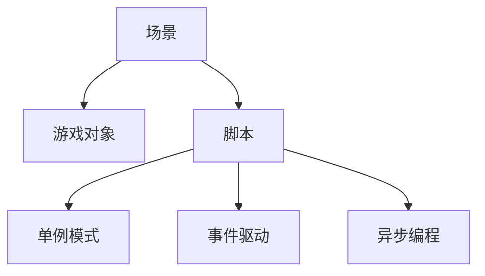

                 

# Unity 游戏开发：C# 脚本和场景管理

在Unity游戏开发中，C#脚本和场景管理是两个至关重要的组成部分。C#脚本提供了开发者与游戏逻辑的接口，而场景管理则是确保游戏运行流畅和无缝体验的关键。本文将深入探讨C#脚本和场景管理的核心概念与技术，并通过实例展示如何高效地应用这些技术。

## 1. 背景介绍

### 1.1 问题由来

随着Unity引擎的普及，越来越多的游戏开发者开始使用C#语言编写游戏逻辑。C#作为一门易于学习和理解的面向对象编程语言，能够大幅提升开发效率和代码的可读性。然而，在实际开发过程中，如何高效地管理游戏场景，确保游戏的流畅运行，成为许多开发者面临的一大挑战。场景管理不当可能导致游戏卡顿、崩溃等问题，影响用户体验。因此，深入理解场景管理与C#脚本的结合使用至关重要。

### 1.2 问题核心关键点

- **C#脚本**：用于编写游戏逻辑和控制游戏行为的脚本。
- **场景管理**：指游戏中的环境、物体和交互元素的组织和调度，确保游戏运行的流畅性和逻辑性。
- **单例模式**：一种常见的C#脚本设计模式，用于确保只有一个实例存在，避免资源浪费和命名冲突。
- **事件驱动**：通过事件驱动模型，实现不同模块之间的通信和协作，提高系统的响应速度和代码的灵活性。
- **异步编程**：一种编程范式，用于处理耗时操作，避免阻塞主线程，提高游戏的响应性能。

## 2. 核心概念与联系

### 2.1 核心概念概述

为了更好地理解C#脚本和场景管理的结合使用，我们需要先明确几个关键概念：

- **场景**：游戏环境中的虚拟空间，包含游戏对象和交互逻辑。
- **游戏对象**：游戏场景中的基本单元，如角色、道具、碰撞体等。
- **脚本**：编写游戏逻辑和行为控制代码的容器。

### 2.2 核心概念原理和架构的 Mermaid 流程图



这个流程图展示了C#脚本、单例模式、事件驱动和异步编程之间的关系。

- **场景**与**游戏对象**的连接表示游戏场景中包含了多个游戏对象。
- **脚本**与**单例模式**的连接表示C#脚本通常使用单例模式来管理全局状态和资源。
- **脚本**与**事件驱动**的连接表示事件驱动是C#脚本处理游戏交互和事件的关键技术。
- **脚本**与**异步编程**的连接表示异步编程在处理耗时操作时，如网络请求、资源加载等，能有效提高游戏的响应性能。

### 2.3 核心概念间的联系

- **C#脚本**是开发者与游戏逻辑交互的桥梁，提供了一个面向对象的环境，用于编写游戏逻辑和行为控制。
- **场景管理**是确保游戏运行流畅和无缝体验的基础，通过合理组织和管理游戏场景中的对象和逻辑，提高游戏的运行效率和稳定性。
- **单例模式**和**事件驱动**是C#脚本常用的设计模式，用于优化资源管理和模块之间的通信。
- **异步编程**则是在处理耗时操作时，保持游戏主线程的响应性能，提升用户体验。

## 3. 核心算法原理 & 具体操作步骤

### 3.1 算法原理概述

Unity中的场景管理主要依赖于游戏对象和脚本的组合使用。C#脚本通过定义游戏对象的行为逻辑，实现场景中物体的交互和控制。场景管理则通过加载和管理游戏对象，确保游戏的流畅运行。

### 3.2 算法步骤详解

#### 3.2.1 创建场景和游戏对象

首先，我们需要创建场景和游戏对象，为游戏逻辑的实现打下基础。

```csharp
using UnityEngine;
using UnityEngine.SceneManagement;

public class CreateScene : MonoBehaviour
{
    public GameObject[] scenes;

    void Start()
    {
        for (int i = 0; i < scenes.Length; i++)
        {
            SceneManager.LoadScene("SceneName" + i, LoadSceneMode.Additive);
            scenes[i].SetActive(true);
        }
    }
}
```

在这个例子中，`CreateScene`脚本通过`SceneManager.LoadScene`方法加载多个场景，并使用`SetActive`方法激活场景中的游戏对象。

#### 3.2.2 创建游戏对象和脚本

接下来，我们创建游戏对象和脚本，定义游戏对象的行为逻辑。

```csharp
using UnityEngine;

public class Player : MonoBehaviour
{
    void Update()
    {
        if (Input.GetMouseButtonDown(0))
        {
            // 执行游戏逻辑
        }
    }
}
```

在这个例子中，`Player`脚本通过`Update`方法定义游戏对象的行为逻辑。当玩家点击鼠标时，执行相应的游戏操作。

#### 3.2.3 使用单例模式管理资源

单例模式是一种常见的C#脚本设计模式，用于管理全局状态和资源。

```csharp
using UnityEngine;

public class ResourceManager : MonoBehaviour
{
    private static ResourceManager instance;
    
    private void Awake()
    {
        if (instance == null)
        {
            instance = this;
        }
        else
        {
            Destroy(gameObject);
        }
    }
    
    public static ResourceManager Instance
    {
        get { return instance; }
    }
}
```

在这个例子中，`ResourceManager`脚本使用单例模式管理全局资源。`Instance`属性用于获取全局资源管理器的实例。

#### 3.2.4 使用事件驱动通信

事件驱动模型是C#脚本处理游戏交互和事件的关键技术。

```csharp
using UnityEngine;

public class EventManager : MonoBehaviour
{
    public static event EventHandler handler;

    void TriggerEvent()
    {
        handler?.Invoke(this, EventArgs.Empty);
    }
}

public class EventSubscriber : MonoBehaviour
{
    public void OnEvent()
    {
        Debug.Log("Event triggered!");
    }
}
```

在这个例子中，`EventManager`脚本使用事件驱动模型触发事件，`EventSubscriber`脚本则订阅事件，并在事件触发时执行相应的操作。

#### 3.2.5 使用异步编程处理耗时操作

异步编程是C#脚本处理耗时操作时，保持游戏主线程的响应性能，提升用户体验的关键技术。

```csharp
using UnityEngine;
using UnityEngine.Networking;
using System.IO;
using System.Threading.Tasks;

public class NetworkRequest : MonoBehaviour
{
    private async void Start()
    {
        var context = new WebRequestContext();
        context.loadType = WebRequestTypeHttpGet;
        context.url = "http://example.com";
        var result = await WebRequest.SendRequestAsync(context);
        Debug.Log(result.text);
    }
}
```

在这个例子中，`NetworkRequest`脚本使用异步编程处理网络请求，确保游戏主线程不被阻塞。

### 3.3 算法优缺点

**优点**：

- **高效管理**：单例模式和事件驱动模型使得资源管理和模块通信更加高效，避免资源浪费和命名冲突。
- **提升性能**：异步编程在处理耗时操作时，保持游戏主线程的响应性能，提升用户体验。
- **灵活扩展**：C#脚本提供了丰富的API和工具，方便开发者实现各种游戏逻辑和功能。

**缺点**：

- **代码复杂度**：单例模式和事件驱动模型增加了代码的复杂度，需要开发者具备一定的设计思维和编程能力。
- **调试难度**：异步编程可能导致代码的调试难度增加，开发者需要具备相应的调试技巧。

### 3.4 算法应用领域

基于C#脚本和场景管理的技术在Unity游戏开发中得到了广泛应用，具体包括以下几个方面：

- **角色控制**：通过脚本实现角色的移动、攻击等行为逻辑。
- **物品交互**：通过脚本实现物品的拾取、使用等交互逻辑。
- **碰撞检测**：通过脚本实现游戏对象之间的碰撞检测和响应。
- **动画管理**：通过脚本控制角色的动画播放和切换。
- **网络通信**：通过脚本实现游戏的网络通信和同步。

## 4. 数学模型和公式 & 详细讲解 & 举例说明

### 4.1 数学模型构建

在Unity游戏开发中，C#脚本和场景管理的数学模型主要涉及游戏逻辑和资源管理。

### 4.2 公式推导过程

#### 4.2.1 脚本行为逻辑

假设我们要实现一个角色的移动逻辑，可以使用以下公式：

$$
x = x_0 + v_xt + \frac{1}{2}at^2
$$

其中，`x`为角色的位置，`x_0`为初始位置，`v_x`为初始速度，`a`为加速度，`t`为时间。

#### 4.2.2 资源管理

假设我们要管理一个全局资源池，可以使用以下公式：

$$
r_{total} = r_{max} - \sum_{i=1}^{n} r_i
$$

其中，`r_total`为资源池总资源，`r_max`为资源池最大容量，`r_i`为已分配的资源。

### 4.3 案例分析与讲解

#### 4.3.1 角色移动

下面是一个简单的角色移动脚本：

```csharp
using UnityEngine;

public class Player : MonoBehaviour
{
    public float speed = 5;
    public Transform target;

    void Update()
    {
        float distance = Vector3.Distance(transform.position, target.position);
        if (distance < 10)
        {
            Vector3 direction = target.position - transform.position;
            transform.Translate(direction * speed * Time.deltaTime);
        }
    }
}
```

在这个例子中，脚本通过`Translate`方法实现角色的移动，`speed`属性控制移动速度，`target`属性为目标点。

#### 4.3.2 资源管理

下面是一个简单的资源管理脚本：

```csharp
using UnityEngine;

public class ResourceManager : MonoBehaviour
{
    private static ResourceManager instance;
    
    private void Awake()
    {
        if (instance == null)
        {
            instance = this;
        }
        else
        {
            Destroy(gameObject);
        }
    }
    
    public static ResourceManager Instance
    {
        get { return instance; }
    }

    public void AllocateResource(int amount)
    {
        // 分配资源
    }

    public void ReleaseResource(int amount)
    {
        // 释放资源
    }
}
```

在这个例子中，脚本使用单例模式管理资源，`AllocateResource`方法用于分配资源，`ReleaseResource`方法用于释放资源。

## 5. 项目实践：代码实例和详细解释说明

### 5.1 开发环境搭建

在进行Unity项目开发时，需要先搭建开发环境。

1. 安装Unity引擎。
2. 安装Visual Studio或Xcode，用于编写C#脚本。
3. 导入项目，设置构建参数和资源路径。

### 5.2 源代码详细实现

#### 5.2.1 场景加载

```csharp
using UnityEngine;
using UnityEngine.SceneManagement;

public class CreateScene : MonoBehaviour
{
    public GameObject[] scenes;

    void Start()
    {
        for (int i = 0; i < scenes.Length; i++)
        {
            SceneManager.LoadScene("SceneName" + i, LoadSceneMode.Additive);
            scenes[i].SetActive(true);
        }
    }
}
```

#### 5.2.2 角色移动

```csharp
using UnityEngine;

public class Player : MonoBehaviour
{
    public float speed = 5;
    public Transform target;

    void Update()
    {
        float distance = Vector3.Distance(transform.position, target.position);
        if (distance < 10)
        {
            Vector3 direction = target.position - transform.position;
            transform.Translate(direction * speed * Time.deltaTime);
        }
    }
}
```

#### 5.2.3 资源管理

```csharp
using UnityEngine;

public class ResourceManager : MonoBehaviour
{
    private static ResourceManager instance;
    
    private void Awake()
    {
        if (instance == null)
        {
            instance = this;
        }
        else
        {
            Destroy(gameObject);
        }
    }
    
    public static ResourceManager Instance
    {
        get { return instance; }
    }

    public void AllocateResource(int amount)
    {
        // 分配资源
    }

    public void ReleaseResource(int amount)
    {
        // 释放资源
    }
}
```

### 5.3 代码解读与分析

#### 5.3.1 场景加载

`CreateScene`脚本通过`SceneManager.LoadScene`方法加载多个场景，并使用`SetActive`方法激活场景中的游戏对象。

#### 5.3.2 角色移动

`Player`脚本通过`Update`方法定义游戏对象的行为逻辑。当玩家点击鼠标时，执行相应的游戏操作。

#### 5.3.3 资源管理

`ResourceManager`脚本使用单例模式管理全局资源。`Instance`属性用于获取全局资源管理器的实例。

### 5.4 运行结果展示

通过`CreateScene`脚本加载多个场景，通过`Player`脚本实现角色移动，通过`ResourceManager`脚本管理资源，可以构建一个简单的游戏场景。

## 6. 实际应用场景

### 6.1 角色控制

在Unity游戏中，角色控制是最常见的应用场景之一。通过脚本实现角色的移动、攻击等行为逻辑，可以提高游戏的互动性和可玩性。

### 6.2 物品交互

在Unity游戏中，物品交互也是常见的应用场景之一。通过脚本实现物品的拾取、使用等交互逻辑，可以提升游戏的丰富度和深度。

### 6.3 碰撞检测

在Unity游戏中，碰撞检测是确保游戏流畅运行的基础。通过脚本实现游戏对象之间的碰撞检测和响应，可以提高游戏的稳定性和响应性能。

### 6.4 动画管理

在Unity游戏中，动画管理是实现角色动画的重要环节。通过脚本控制角色的动画播放和切换，可以提升游戏的视觉体验和可玩性。

### 6.5 网络通信

在Unity游戏中，网络通信是实现多人游戏的关键技术。通过脚本实现游戏的网络通信和同步，可以构建更加丰富的多人游戏体验。

## 7. 工具和资源推荐

### 7.1 学习资源推荐

为了帮助开发者掌握Unity中的C#脚本和场景管理，以下是一些优质的学习资源：

1. Unity官方文档：提供详细的API文档和开发指南，涵盖C#脚本和场景管理的各个方面。
2. Unity Asset Store：包含大量游戏开发资源，包括预制体、脚本和插件，方便开发者快速上手。
3. Unity Learn：提供丰富的学习视频和教程，帮助开发者掌握Unity和C#脚本的开发技能。
4. C#编程手册：详细讲解C#语言的基础知识和高级特性，为游戏开发者提供编程支持。

### 7.2 开发工具推荐

在Unity游戏开发中，以下是一些常用的开发工具：

1. Visual Studio：用于编写和管理C#脚本。
2. Xcode：用于编写和管理Mac平台上的C#脚本。
3. JetBrains Rider：提供更加完善的IDE支持，包括代码提示、调试等功能。
4. Unity Editor：用于开发、测试和发布Unity游戏。
5. Unity Asset Graph：帮助开发者管理和组织游戏资源，提升开发效率。

### 7.3 相关论文推荐

在Unity游戏开发中，以下是一些具有代表性的相关论文：

1. "A Survey on Unity 3D Game Development"：全面介绍Unity引擎和C#脚本的开发技术。
2. "Real-Time Physics for Game Development"：介绍Unity引擎中的物理模拟技术，包括碰撞检测和碰撞响应。
3. "Efficient Memory Management in Unity"：探讨Unity引擎中的内存管理策略，包括资源池和异步编程。

## 8. 总结：未来发展趋势与挑战

### 8.1 研究成果总结

C#脚本和场景管理在Unity游戏开发中发挥了至关重要的作用，成为实现游戏逻辑和提升游戏性能的关键技术。通过单例模式、事件驱动和异步编程等技术手段，有效地实现了资源管理和游戏逻辑的组织。

### 8.2 未来发展趋势

未来，C#脚本和场景管理技术将朝以下几个方向发展：

1. **跨平台支持**：随着Unity引擎的多平台支持，C#脚本和场景管理技术也将逐步覆盖移动、PC、VR等多个平台，实现跨平台的无缝开发。
2. **实时性能优化**：随着游戏对实时性能要求的提高，C#脚本和场景管理技术也将更加注重优化，提升游戏的响应速度和流畅性。
3. **AI和ML的融合**：随着AI和ML技术的不断发展，C#脚本和场景管理技术将逐步融合AI和ML技术，提升游戏的智能化水平和用户体验。

### 8.3 面临的挑战

尽管C#脚本和场景管理技术在Unity游戏开发中已经取得了显著进展，但仍然面临一些挑战：

1. **代码复杂度**：单例模式和事件驱动模型增加了代码的复杂度，需要开发者具备一定的设计思维和编程能力。
2. **调试难度**：异步编程可能导致代码的调试难度增加，开发者需要具备相应的调试技巧。
3. **资源管理**：随着游戏规模的扩大，资源管理变得更加复杂，如何有效地管理资源池和避免资源泄露成为一大难题。

### 8.4 研究展望

未来，在C#脚本和场景管理技术的研究方向上，可以从以下几个方面进行探索：

1. **代码生成和优化**：利用代码生成和优化技术，自动化生成C#脚本代码，提升开发效率。
2. **多模块协作**：研究如何通过C#脚本实现不同模块之间的协作和通信，提高游戏的可维护性和扩展性。
3. **AI和ML融合**：研究如何将AI和ML技术与C#脚本结合，提升游戏的智能化水平和用户体验。

## 9. 附录：常见问题与解答

**Q1: C#脚本和场景管理有什么区别？**

A: C#脚本是用于编写游戏逻辑和控制游戏行为的代码容器，而场景管理是确保游戏运行流畅和无缝体验的关键技术。C#脚本负责实现游戏逻辑，而场景管理负责管理游戏对象和交互逻辑。

**Q2: 如何在Unity中使用单例模式？**

A: 在Unity中，使用单例模式可以通过创建私有静态变量和构造函数来实现。在Awake方法中检查是否存在实例，如果不存在，则创建实例并设置为私有变量。

**Q3: 什么是事件驱动模型？**

A: 事件驱动模型是一种编程范式，通过事件触发器、订阅者和发布者之间的交互，实现不同模块之间的通信和协作。在Unity中，可以通过事件驱动模型实现游戏交互和事件处理。

**Q4: 如何使用异步编程处理耗时操作？**

A: 在Unity中，异步编程可以通过UnityWebRequest类和异步方法来实现。使用异步方法可以确保游戏主线程不被阻塞，提高游戏的响应性能。

**Q5: 如何优化Unity中的内存管理？**

A: 在Unity中，可以通过资源池和预加载机制来优化内存管理。资源池可以重复利用资源，避免频繁的创建和销毁操作。预加载机制可以提前加载常用资源，提高游戏启动速度和响应性能。

---

作者：禅与计算机程序设计艺术 / Zen and the Art of Computer Programming

