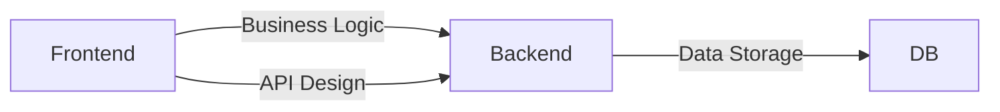

                 

# Web 全栈开发：构建动态网站

> 关键词：Web开发, 全栈技术, 前端框架, 后端服务, 数据库, API设计, 部署与维护

## 1. 背景介绍

在现代互联网时代，Web应用已经成为企业和个人获取信息、交流互动、电子商务的重要平台。Web全栈开发是指掌握前端、后端和数据库等多种技能，能够从零开始构建、优化、部署和管理动态网站。本文将系统介绍Web全栈开发的基本概念、核心技能与实践方法，帮助开发者构建高效、稳定、美观的动态网站。

## 2. 核心概念与联系

### 2.1 核心概念概述

为更好地理解Web全栈开发，本节将介绍几个关键概念及其相互关系：

- **Web开发**：涉及网站的设计、开发、测试、部署和维护，是一个复杂的综合性工程。Web开发需要前端和后端协同工作，前端负责界面和交互设计，后端负责数据处理和业务逻辑实现。

- **全栈技术**：指开发者具备前端、后端和数据库等全方位技能，能够独立完成从需求分析到项目交付的全过程开发。

- **前端框架**：如React、Vue、Angular等，提供了一套组件、工具和库，加速前端开发，提升代码质量和开发效率。

- **后端服务**：负责处理业务逻辑、数据存储、API设计等，支持前端功能实现，保障网站的稳定性和安全性。

- **数据库**：用于存储和管理网站数据，常见的数据库有MySQL、MongoDB、PostgreSQL等，支持不同类型数据的存储需求。

这些概念通过前端和后端的协作，形成一个完整的Web应用系统。以下Mermaid流程图展示了这些概念之间的联系：



## 3. 核心算法原理 & 具体操作步骤

### 3.1 算法原理概述

Web全栈开发的核心算法原理主要体现在以下几个方面：

- **前端渲染**：通过前端框架渲染页面，将动态数据插入HTML结构中，提升用户体验。
- **后端处理**：使用后端服务处理请求和响应，进行数据验证、业务逻辑处理等。
- **API设计**：通过API连接前端和后端，实现数据交互和业务协同。
- **数据库管理**：使用数据库存储和管理数据，支持数据增删改查操作。

这些算法原理在实际开发中，通过前端、后端、API和数据库的协同工作，完成动态网站的构建与优化。

### 3.2 算法步骤详解

Web全栈开发的一般流程如下：

**Step 1: 需求分析与设计**

- 明确项目需求和目标。
- 设计网站架构，确定前端和后端功能模块。

**Step 2: 技术选型与准备**

- 选择合适的前端框架和后端技术栈。
- 安装必要的开发工具和环境。

**Step 3: 前端开发**

- 编写HTML、CSS、JavaScript代码，实现页面布局和交互逻辑。
- 使用前端框架进行组件化开发，提升开发效率。

**Step 4: 后端开发**

- 设计API接口，编写后端代码，实现业务逻辑。
- 使用数据库存储数据，保障数据一致性和安全性。

**Step 5: API集成与测试**

- 开发API接口，进行前后端数据交互测试。
- 对API接口进行单元测试和集成测试，确保稳定性。

**Step 6: 部署与维护**

- 将前端、后端和API部署到服务器或云平台。
- 定期进行系统维护和优化，确保网站性能稳定。

### 3.3 算法优缺点

Web全栈开发具有以下优点：

- **高效协同**：前端与后端协同工作，提升开发效率和代码质量。
- **灵活扩展**：掌握多种技能，可以灵活应对项目需求变化。
- **性能优化**：能综合考虑前端渲染和后端处理，提升网站性能。

同时，也存在以下缺点：

- **学习成本高**：需要掌握多种技术栈，学习曲线较陡。
- **复杂度高**：项目复杂度增加，需要更多时间和资源。
- **协作难度大**：前后端协同工作，沟通和协作成本较高。

### 3.4 算法应用领域

Web全栈开发广泛应用于企业网站、电商网站、社交平台、移动应用等，包括但不限于：

- 企业官网：展示企业信息、产品介绍、新闻动态等。
- 电商平台：销售商品、管理订单、支付结算等。
- 社交平台：用户注册、发布内容、消息互动等。
- 移动应用：提供在线服务、游戏、社交等功能。

## 4. 数学模型和公式 & 详细讲解 & 举例说明

### 4.1 数学模型构建

Web全栈开发涉及的前端渲染和后端处理可以通过以下数学模型进行描述：

- **前端渲染模型**：将HTML、CSS、JavaScript等前端代码渲染到浏览器页面。
- **后端处理模型**：接收HTTP请求，处理业务逻辑，返回HTTP响应。

以一个简单的登录页面为例，前端渲染模型为：

$$
\text{前端渲染} = \text{HTML} + \text{CSS} + \text{JavaScript}
$$

后端处理模型为：

$$
\text{后端处理} = \text{HTTP请求} \to \text{业务逻辑} \to \text{HTTP响应}
$$

### 4.2 公式推导过程

以登录页面为例，用户输入用户名和密码，通过HTTP POST请求发送到后端API接口，后端根据用户名和密码查询数据库，验证用户身份，返回登录结果：

$$
\text{前端渲染} \to \text{后端处理} \to \text{HTTP响应}
$$

其中，前端渲染将用户名和密码显示在登录表单中，后端处理包括用户输入验证、数据库查询、身份验证等业务逻辑，最终返回登录结果。

### 4.3 案例分析与讲解

以电商平台为例，用户浏览商品、加入购物车、结算支付等流程，涉及前端渲染、后端处理、API集成和数据库管理等多个环节：

- **前端渲染**：展示商品列表、商品详情、购物车等页面。
- **后端处理**：处理用户请求，更新购物车、结算订单等。
- **API集成**：通过API接口实现用户登录、商品查询、订单管理等功能。
- **数据库管理**：存储商品信息、用户数据、订单数据等。

这些环节通过前端、后端和API的协同工作，构建了电商平台的完整功能，保障了网站的稳定性和用户体验。

## 5. 项目实践：代码实例和详细解释说明

### 5.1 开发环境搭建

在进行Web全栈开发之前，需要准备开发环境，步骤如下：

1. 安装Node.js：从官网下载并安装Node.js，作为前端开发的运行环境。

2. 安装React：通过npm安装React框架，用于前端组件化开发。

3. 安装Express：通过npm安装Express框架，用于后端API开发。

4. 安装MongoDB：从官网下载并安装MongoDB数据库，用于存储数据。

5. 配置环境变量：设置数据库连接信息和API端口等。

### 5.2 源代码详细实现

以下是使用React和Express进行Web全栈开发的示例代码：

**前端代码**：

```javascript
import React, { useState } from 'react';

function Login() {
  const [username, setUsername] = useState('');
  const [password, setPassword] = useState('');

  const handleSubmit = async () => {
    const response = await fetch('/api/login', {
      method: 'POST',
      headers: {
        'Content-Type': 'application/json'
      },
      body: JSON.stringify({ username, password })
    });

    const result = await response.json();
    console.log(result);
  };

  return (
    <div>
      <input type="text" value={username} onChange={(e) => setUsername(e.target.value)} />
      <input type="password" value={password} onChange={(e) => setPassword(e.target.value)} />
      <button onClick={handleSubmit}>Login</button>
    </div>
  );
}

export default Login;
```

**后端代码**：

```javascript
const express = require('express');
const bodyParser = require('body-parser');
const mongoose = require('mongoose');

const app = express();

app.use(bodyParser.json());

mongoose.connect('mongodb://localhost:27017/myapp', { useNewUrlParser: true });

const UserSchema = new mongoose.Schema({
  username: String,
  password: String
});

const User = mongoose.model('User', UserSchema);

app.post('/api/login', async (req, res) => {
  const { username, password } = req.body;

  const user = await User.findOne({ username, password });
  if (!user) {
    res.status(401).json({ message: 'Invalid credentials' });
  } else {
    res.json({ message: 'Login successful' });
  }
});

app.listen(3000, () => {
  console.log('Server started on port 3000');
});
```

**运行结果**：

在前端代码中，用户输入用户名和密码，通过handleSubmit函数将数据发送到后端API接口，后端根据用户名和密码查询数据库，返回登录结果。在前端页面上，实时显示登录结果，实现动态页面渲染。

## 6. 实际应用场景

### 6.1 企业网站

企业网站需要展示企业信息、产品介绍、新闻动态等，Web全栈开发可以轻松实现以下功能：

- 首页：展示企业logo、导航菜单、公司简介等。
- 产品页：展示产品列表、产品详情、客户评价等。
- 新闻页：展示企业新闻、行业动态、专家观点等。

### 6.2 电商网站

电商网站需要销售商品、管理订单、支付结算等，Web全栈开发可以实现以下功能：

- 商品列表：展示商品分类、商品信息、价格等。
- 商品详情：展示商品图片、描述、评价等。
- 购物车：展示购物车信息，支持添加、删除、结算等操作。

### 6.3 社交平台

社交平台需要用户注册、发布内容、消息互动等，Web全栈开发可以实现以下功能：

- 用户登录：展示登录表单，验证用户信息。
- 用户注册：展示注册表单，添加新用户。
- 动态消息：展示用户发布的消息、点赞、评论等。

### 6.4 移动应用

移动应用需要提供在线服务、游戏、社交等功能，Web全栈开发可以实现以下功能：

- 用户登录：展示登录界面，验证用户信息。
- 用户注册：展示注册界面，添加新用户。
- 消息通知：展示用户收到的消息、提醒等。

## 7. 工具和资源推荐

### 7.1 学习资源推荐

以下是几本关于Web全栈开发的经典书籍，推荐阅读：

- 《JavaScript高级程序设计》（《JavaScript: The Definitive Guide》）：讲解JavaScript的高级特性和开发技巧，是前端开发者的必读书籍。
- 《Node.js设计模式》（《Design Patterns》）：讲解Node.js编程模式和最佳实践，帮助开发者构建高质量的后端服务。
- 《MongoDB实战》（《MongoDB: The Definitive Guide》）：讲解MongoDB数据库的高级特性和操作技巧，帮助开发者高效管理数据。

### 7.2 开发工具推荐

以下是几款常用的Web全栈开发工具，推荐使用：

- Visual Studio Code：轻量级的代码编辑器，支持多种语言和框架，是前端开发的首选工具。
- Git：版本控制系统，支持代码管理和协作，是开发和部署的基础工具。
- Docker：容器化工具，支持快速构建、部署和管理Web应用，提高开发效率。

### 7.3 相关论文推荐

以下是几篇关于Web全栈开发的经典论文，推荐阅读：

- 《Web开发模式与设计》（《Web Development Patterns》）：介绍Web开发的最佳实践和模式，帮助开发者构建高效的应用系统。
- 《Web全栈开发实践》（《Full-stack Web Development》）：讲解Web全栈开发的技术栈、工具和框架，帮助开发者全面掌握Web开发技能。
- 《Web应用性能优化》（《Web Application Performance Optimization》）：讲解Web应用性能调优的原理和技巧，提升Web应用的性能和用户体验。

## 8. 总结：未来发展趋势与挑战

### 8.1 研究成果总结

Web全栈开发是现代Web开发的重要方向，涉及前端、后端、数据库等多个环节，需要开发者具备全面的技能和知识。通过掌握前端、后端和数据库等多种技能，开发者可以构建高效、稳定、美观的动态网站，提升用户体验和网站性能。

### 8.2 未来发展趋势

展望未来，Web全栈开发将呈现以下几个发展趋势：

- **技术栈多样化**：随着技术的发展，Web全栈开发将涵盖更多的技术和工具，如函数即服务、边缘计算、区块链等。
- **前端工程化**：前端工程化将成为Web开发的重要方向，通过组件化、模块化、测试驱动等方式，提升开发效率和代码质量。
- **后端微服务化**：后端服务将采用微服务架构，提升系统的可扩展性和可维护性。
- **前端与后端融合**：前端与后端将更加紧密地融合，形成统一的开发和管理体系。

### 8.3 面临的挑战

尽管Web全栈开发具有诸多优势，但在实际应用中也面临一些挑战：

- **学习成本高**：需要掌握多种技术和工具，学习曲线较陡。
- **协作难度大**：前后端协同工作，沟通和协作成本较高。
- **性能优化难**：前端渲染和后端处理需要协同优化，提升性能难度较大。

### 8.4 研究展望

未来的Web全栈开发研究将聚焦于以下几个方向：

- **自动化开发**：通过自动化工具和框架，提升开发效率和代码质量。
- **混合编程**：结合前端和后端编程语言，实现无缝衔接和协作。
- **跨平台开发**：实现Web应用的跨平台开发和部署，提升应用的适用性和灵活性。
- **智能开发**：利用人工智能技术，提升Web开发和测试的智能化水平。

## 9. 附录：常见问题与解答

**Q1: 什么是Web全栈开发？**

A: Web全栈开发是指开发者掌握前端、后端和数据库等多种技能，能够从零开始构建、优化、部署和管理动态网站。

**Q2: 如何学习Web全栈开发？**

A: 可以通过以下步骤学习Web全栈开发：

- 掌握前端开发技能，如HTML、CSS、JavaScript、React等。
- 掌握后端开发技能，如Node.js、Express、MongoDB等。
- 学习Web应用开发最佳实践和设计模式，提升开发质量。

**Q3: Web全栈开发的优势是什么？**

A: Web全栈开发的优势在于：

- 高效协同：前端与后端协同工作，提升开发效率和代码质量。
- 灵活扩展：掌握多种技能，可以灵活应对项目需求变化。
- 性能优化：能综合考虑前端渲染和后端处理，提升网站性能。

**Q4: Web全栈开发的学习曲线是否陡峭？**

A: Web全栈开发的学习曲线较陡，需要掌握多种技术和工具，但通过系统学习和实践，可以逐步掌握相关技能。

---

作者：禅与计算机程序设计艺术 / Zen and the Art of Computer Programming

