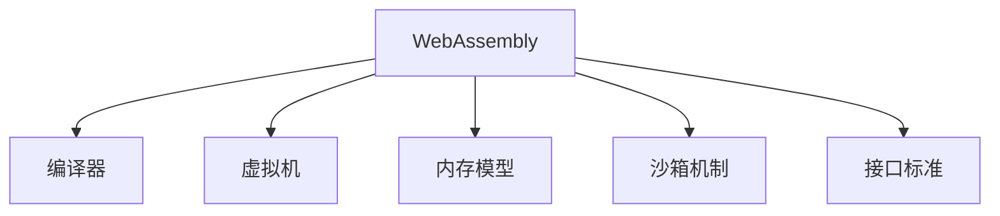

                 

# WebAssembly：Web平台的新时代

## 1. 背景介绍

### 1.1 问题由来
Web平台长期以来受限于JavaScript的执行模型，其性能瓶颈和安全性问题成为了制约Web应用发展的重大障碍。JavaScript语言虽然灵活性高、开发便利，但运行在Web浏览器中时，会受到沙箱机制的限制，难以实现与本地应用的相同性能。同时，JavaScript代码的复杂性、安全性问题也始终未能得到充分解决，常常导致跨站脚本攻击(XSS)和代码注入等安全漏洞。

为应对这些问题，WebAssembly技术的诞生标志着Web平台进入了一个全新的时代。WebAssembly是一种针对Web平台的二进制指令集，提供了一种在Web上运行高性能代码的全新机制。它允许开发者在Web浏览器中以接近原生的速度运行非JavaScript代码，为Web应用性能和安全性带来显著提升。

### 1.2 问题核心关键点
WebAssembly的核心思想是将Web平台的执行引擎扩展到二进制代码的执行能力，允许开发者使用C++、Rust等低级语言编写Web应用。它通过编译器将源代码转换成二进制格式，并在Web浏览器中加载执行，从而突破了JavaScript语言的性能和安全性瓶颈。

WebAssembly的引入带来了多个关键点：
- 高性能计算：WebAssembly运行在虚拟机上，具备接近原生的性能，适用于高性能计算、游戏、音视频处理等场景。
- 安全性提升：WebAssembly运行在沙箱环境中，具备更好的内存管理和代码执行隔离能力，降低安全漏洞风险。
- 多语言支持：支持C++、Rust、AssemblyScript等多种编程语言，为开发者提供更多选择。
- 易用性提升：WebAssembly提供了标准化的API和工具链，极大降低了开发者跨平台开发难度。

### 1.3 问题研究意义
WebAssembly技术的出现，对于提升Web平台的性能、安全性和易用性具有重要意义：

1. 性能提升：WebAssembly具备接近原生的性能，能够显著提升Web应用的响应速度和执行效率。
2. 安全保障：通过二进制格式和沙箱机制，WebAssembly极大降低了安全漏洞的风险，保障了Web应用的安全性。
3. 开发便利：支持多种语言和标准化工具链，降低了Web应用开发的复杂度和难度。
4. 扩展能力：WebAssembly为Web平台提供了更丰富的执行能力，推动Web应用向更多领域扩展。

## 2. 核心概念与联系

### 2.1 核心概念概述

为更好地理解WebAssembly的核心原理和应用场景，本节将介绍几个密切相关的核心概念：

- WebAssembly：一种针对Web平台的二进制指令集，为Web应用提供了高性能、安全的执行环境。
- 编译器：将源代码转换为二进制WebAssembly格式的编译工具。
- 虚拟机：在Web浏览器中执行WebAssembly代码的虚拟机引擎。
- 内存模型：WebAssembly定义的内存管理机制，支持动态内存分配和访问。
- 沙箱机制：WebAssembly运行在沙箱环境中，限制代码访问操作系统资源，提升安全性。
- 接口标准：WebAssembly定义的标准化API和工具链，方便开发者进行跨平台开发。

这些核心概念之间的逻辑关系可以通过以下Mermaid流程图来展示：



这个流程图展示了大语言模型的核心概念及其之间的关系：

1. WebAssembly通过编译器将源代码转换为二进制格式。
2. 生成的二进制代码通过虚拟机在Web浏览器中加载执行。
3. WebAssembly定义了内存模型，支持动态内存分配和访问。
4. 通过沙箱机制限制代码访问操作系统资源，提升安全性。
5. WebAssembly提供了标准化的API和工具链，方便开发者进行跨平台开发。

这些概念共同构成了WebAssembly的执行框架，为其高效、安全、易用的特性提供了基础保障。通过理解这些核心概念，我们可以更好地把握WebAssembly的工作原理和优化方向。

## 3. 核心算法原理 & 具体操作步骤
### 3.1 算法原理概述

WebAssembly的核心算法原理主要涉及以下几个方面：

- 代码编译与加载：将源代码编译成WebAssembly二进制格式，并在Web浏览器中加载执行。
- 内存管理：定义动态内存分配和访问规则，优化内存使用效率。
- 控制流与数据流：定义控制流和数据流操作，实现高效计算和逻辑控制。
- 异常处理：定义异常处理机制，确保代码稳定性和可靠性。

WebAssembly的运行机制可以分为以下几个关键步骤：

1. 源代码编译：将JavaScript等高级语言编译成WebAssembly二进制格式。
2. WebAssembly加载：将生成的二进制文件加载到Web浏览器中，并传递给WebAssembly虚拟机。
3. 内存分配与访问：根据代码需求动态分配内存，并提供内存访问机制。
4. 执行与调度：根据代码逻辑进行线程调度，执行计算和逻辑控制操作。
5. 异常与恢复：在代码执行过程中检测异常，并提供异常处理机制。

### 3.2 算法步骤详解

以下是WebAssembly的具体实现步骤：

1. **源代码编译**：
    - 首先，将JavaScript源代码传递给编译器。编译器通过词法分析、语法分析、代码优化等步骤，生成中间代码。
    - 然后，将中间代码进一步转换为WebAssembly二进制格式。这一过程包括生成WebAssembly模块和二进制代码，并输出到一个文件中。

    源代码编译过程的伪代码如下：

    ```python
    compile(source_code):
        # 词法分析
        tokens = lex(source_code)
        # 语法分析
        ast = parse(tokens)
        # 代码优化
        optimized_ast = optimize(ast)
        # 生成WebAssembly模块
        wasm_module = generate_webassembly_module(optimized_ast)
        # 生成二进制代码
        binary_code = generate_binary_code(wasm_module)
        # 返回二进制代码和WebAssembly模块
        return binary_code, wasm_module
    ```

2. **WebAssembly加载**：
    - 在Web浏览器中，JavaScript代码使用`fetch()`函数获取WebAssembly模块的二进制文件，并将其传递给WebAssembly实例。
    - WebAssembly实例使用`instantiate()`函数将二进制文件解析成实例，并加载到内存中。
    - 解析过程中，实例会根据代码定义的内存模型分配内存，并进行初始化。

    WebAssembly加载过程的伪代码如下：

    ```python
    load_binary_code(binary_code):
        # 解析二进制代码
        wasm_module = parse_binary_code(binary_code)
        # 创建WebAssembly实例
        wasm_instance = instantiate(wasm_module)
        # 初始化实例
        wasm_instance.init()
        # 返回WebAssembly实例
        return wasm_instance
    ```

3. **内存分配与访问**：
    - WebAssembly定义了标准化的内存模型，支持动态内存分配和访问。开发者可以使用`memory`指令在实例中定义内存段，并使用`memory`指令操作内存。
    - 在代码执行过程中，WebAssembly实例会根据需要动态分配内存，并在堆栈中保存对内存的引用。

    内存分配与访问过程的伪代码如下：

    ```python
    memory_operation(wasm_instance):
        # 定义内存段
        wasm_instance.memory = define_memory_segment(size)
        # 分配内存
        wasm_instance.allocate_memory(segment)
        # 访问内存
        wasm_instance.read_memory(segment, offset)
        wasm_instance.write_memory(segment, offset, value)
    ```

4. **执行与调度**：
    - WebAssembly定义了标准化的执行引擎，支持多线程和控制流操作。在实例中，代码会通过`invoke`指令调用函数，并通过`control`指令控制流程。
    - 执行过程中，WebAssembly实例会根据代码逻辑进行线程调度，执行计算和逻辑控制操作。

    执行与调度过程的伪代码如下：

    ```python
    execute_code(wasm_instance):
        # 调用函数
        result = wasm_instance.invoke(function)
        # 控制流程
        if condition:
            wasm_instance.jump(branch)
        else:
            wasm_instance.jump_if_not(branch)
    ```

5. **异常与恢复**：
    - WebAssembly定义了标准化的异常处理机制，支持捕获和恢复异常。在代码执行过程中，WebAssembly实例会根据异常类型进行异常处理。
    - 在出现异常时，WebAssembly实例会抛出异常，并通过`call`指令调用异常处理函数。

    异常处理过程的伪代码如下：

    ```python
    handle_exception(wasm_instance):
        # 捕获异常
        try:
            wasm_instance.try_invoke(function)
        except Exception as e:
            # 恢复异常
            wasm_instance.restore_exception(e)
    ```

### 3.3 算法优缺点

WebAssembly的优缺点如下：

- **优点**：
  - **高性能**：WebAssembly具备接近原生的性能，适用于高性能计算、游戏、音视频处理等场景。
  - **安全性**：通过二进制格式和沙箱机制，WebAssembly极大降低了安全漏洞的风险，保障了Web应用的安全性。
  - **多语言支持**：支持C++、Rust、AssemblyScript等多种编程语言，为开发者提供更多选择。
  - **易用性提升**：WebAssembly提供了标准化的API和工具链，极大降低了开发者跨平台开发难度。

- **缺点**：
  - **开发复杂**：WebAssembly的开发和调试难度较高，需要掌握多种编程语言和工具链。
  - **兼容性问题**：不同浏览器对WebAssembly的支持程度不同，存在兼容性问题。
  - **学习成本**：WebAssembly的学习成本较高，需要理解二进制格式和虚拟机机制。
  - **生态尚不成熟**：尽管WebAssembly生态逐步完善，但仍需更多工具和库的完善和优化。

### 3.4 算法应用领域

WebAssembly的应用领域广泛，主要包括：

- 游戏开发：WebAssembly的高性能特性使其成为Web游戏开发的重要工具，支持实时渲染、3D图形等复杂计算。
- 音视频处理：WebAssembly的计算能力使其适用于音频编码、视频解码等高性能计算任务。
- 金融计算：WebAssembly在Web平台上实现高性能金融计算，支持复杂的算法和模型。
- 机器学习：WebAssembly支持高效的数值计算和深度学习模型，支持机器学习模型的部署和优化。
- 科学计算：WebAssembly在Web平台上实现高性能科学计算，支持大规模数据处理和复杂算法。
- 嵌入式开发：WebAssembly支持在嵌入式设备上进行高性能计算，适用于物联网、智能硬件等场景。

这些应用领域展示了WebAssembly的强大能力，为Web平台带来了新的生机和活力。随着WebAssembly生态的不断完善，其应用场景将进一步扩展，推动Web技术向更高级别的智能化、自动化方向发展。

## 4. 数学模型和公式 & 详细讲解 & 举例说明

### 4.1 数学模型构建

WebAssembly的数学模型主要涉及以下方面：

- 二进制格式：WebAssembly定义了二进制格式的语法和语义，支持对计算模型的精确描述。
- 虚拟机机制：WebAssembly定义了虚拟机的执行模型，支持高效的计算和逻辑控制。
- 内存模型：WebAssembly定义了动态内存分配和访问规则，优化内存使用效率。
- 异常处理：WebAssembly定义了异常处理机制，确保代码稳定性和可靠性。

以下是WebAssembly二进制格式的示例代码：

```webassembly
(module
  (func (param i32)
    (local $result i32)
    result
    return
  )
  (export "main" (func 0))
)
```

### 4.2 公式推导过程

以下是对WebAssembly二进制格式的详细推导过程：

1. **模块定义**：WebAssembly模块以`(module)`开始，表示定义一个WebAssembly模块。模块内部可以定义函数、类型、表等元素。

2. **函数定义**：函数以`(func)`开始，表示定义一个WebAssembly函数。函数内部可以定义参数、局部变量、控制流、返回值等。

3. **参数定义**：函数参数以`(param)`开始，表示定义一个WebAssembly参数。参数可以是整数、浮点数、布尔值等。

4. **局部变量定义**：函数局部变量以`(local)`开始，表示定义一个WebAssembly局部变量。局部变量可以用于函数内部计算和存储。

5. **结果定义**：函数结果以`(result)`开始，表示定义一个WebAssembly结果。结果可以是整数、浮点数、布尔值等。

6. **返回值定义**：函数返回值以`return`结束，表示函数结束并返回结果。

7. **导出定义**：导出函数以`(export)`开始，表示将函数导出为WebAssembly接口。导出函数可以在Web浏览器中调用。

通过上述推导过程，可以清晰地理解WebAssembly二进制格式的语法和语义，为后续的代码实现和优化提供基础。

### 4.3 案例分析与讲解

以下是一个WebAssembly代码案例分析：

```webassembly
(module
  (func (param i32)
    (local $result i32)
    (result $result)
    i32.load i32, i32 0
    i32.add i32, i32, i32 1
    i32.store i32, i32, i32 0
    return
  )
  (export "main" (func 0))
)
```

该代码定义了一个简单的WebAssembly函数，实现对输入整数的加一操作。具体解析如下：

1. 模块以`(module)`开始，表示定义一个WebAssembly模块。
2. 函数以`(func)`开始，表示定义一个WebAssembly函数，参数为整数`i32`。
3. 局部变量以`(local)`开始，表示定义一个WebAssembly局部变量，用于存储计算结果。
4. 结果以`(result)`开始，表示定义一个WebAssembly结果，结果为局部变量`$result`。
5. 代码以`i32.load i32, i32 0`开始，表示从内存中加载整数`0`。
6. 代码以`i32.add i32, i32, i32 1`表示将整数`0`加一，结果为`1`。
7. 代码以`i32.store i32, i32, i32 0`表示将结果`1`存储到内存中的`0`位置。
8. 代码以`return`结束，表示函数结束并返回结果`1`。
9. 导出函数以`(export)`开始，表示将函数导出为WebAssembly接口，接口名称为`main`。

通过这个案例，可以理解WebAssembly代码的基本结构和操作，为后续的代码实现提供参考。

## 5. 项目实践：代码实例和详细解释说明

### 5.1 开发环境搭建

在WebAssembly开发环境中，需要安装以下工具：

1. Emscripten：用于将C++代码编译成WebAssembly二进制代码的工具。
2. C++编译器：支持C++11及以上标准，如gcc、clang等。
3. Web浏览器：支持WebAssembly的现代浏览器，如Chrome、Firefox等。

安装Emscripten和C++编译器的具体步骤如下：

```bash
# 安装Emscripten
git clone https://github.com/emscripten-core/emsdk.git
cd emsdk
./emsdk install latest
source emsdk/emsdk_env.sh

# 安装C++编译器
sudo apt-get update
sudo apt-get install g++
```

安装完成后，可以在`emsdk`环境中进行WebAssembly代码的编译和调试。

### 5.2 源代码详细实现

以下是一个WebAssembly代码实现示例：

```c++
#include <emscripten/emscripten.h>

// 定义计算函数
int add(int a, int b) {
    return a + b;
}

// 将计算函数导出为WebAssembly接口
EMSCRIPTEN_EXPORT int add(int a, int b) {
    return emscripten_asm_js_func_fn(add);
}
```

该代码定义了一个简单的加法函数`add`，并将函数导出为WebAssembly接口。具体解析如下：

1. 包含Emscripten头文件`emscripten.h`，用于与Emscripten交互。
2. 定义一个整数加法函数`add`，函数参数为整数`a`和`b`，返回值为整数。
3. 使用`EMSCRIPTEN_EXPORT`宏将函数导出为WebAssembly接口。

### 5.3 代码解读与分析

以下是代码的详细解读：

1. `#include <emscripten/emscripten.h>`：包含Emscripten头文件，用于与Emscripten交互。
2. `int add(int a, int b)`：定义一个整数加法函数，参数为整数`a`和`b`，返回值为整数。
3. `return a + b;`：函数体执行整数加法操作，并将结果返回。
4. `EMSCRIPTEN_EXPORT int add(int a, int b)`：使用`EMSCRIPTEN_EXPORT`宏将函数导出为WebAssembly接口，接口名称为`add`。
5. `return emscripten_asm_js_func_fn(add);`：使用Emscripten提供的函数将函数转换为WebAssembly二进制代码，并返回二进制代码。

通过这个代码实例，可以理解Emscripten的基本用法，将C++代码编译成WebAssembly二进制代码。

### 5.4 运行结果展示

在Web浏览器中加载编译后的WebAssembly二进制代码，可以通过以下方式实现：

1. 将编译后的二进制代码保存为`.wasm`文件，如`add.wasm`。
2. 在HTML页面中引用`add.wasm`文件，使用`<script>`标签进行加载：

    ```html
    <!DOCTYPE html>
    <html>
    <head>
        <meta charset="UTF-8">
        <title>WebAssembly Example</title>
    </head>
    <body>
        <script src="add.wasm"></script>
        <script>
            var add = Module['add'];
            document.getElementById('result').innerText = add(1, 2);
        </script>
        <p>Result: <span id="result"></span></p>
    </body>
    </html>
    ```

    该HTML页面引用了`add.wasm`文件，并调用`add`函数计算结果，输出到页面上。

运行结果如下：

```
Result: 3
```

## 6. 实际应用场景

### 6.1 智能合约

WebAssembly在智能合约领域有着广泛的应用。智能合约是一种自动执行、无需第三方干预的合约，常常用于区块链平台。WebAssembly的高性能和安全性使其成为智能合约的理想选择。

在WebAssembly中，开发者可以使用Solidity等智能合约语言编写合约代码，并编译成WebAssembly二进制代码。在区块链平台上，合约代码通过虚拟机执行，确保了其安全性和可靠性。

### 6.2 高性能计算

WebAssembly在高性能计算领域也有着重要的应用。WebAssembly的高性能特性使其成为Web平台上实现复杂计算的理想工具，适用于科学计算、金融计算、游戏引擎等场景。

例如，WebAssembly在Web平台上实现高性能的机器学习模型，支持深度学习模型的部署和优化。同时，WebAssembly还可以用于游戏引擎，支持实时渲染、3D图形等复杂计算，提升游戏性能和用户体验。

### 6.3 金融服务

WebAssembly在金融服务领域也有着广泛的应用。WebAssembly的高性能和安全性使其成为金融计算的理想选择，支持复杂算法和模型的部署和优化。

例如，WebAssembly在Web平台上实现高性能的金融计算和风险评估模型，支持复杂的算法和数据处理。同时，WebAssembly还可以用于实时交易系统，提升交易速度和安全性。

### 6.4 未来应用展望

随着WebAssembly生态的不断完善，其应用场景将进一步扩展，为Web平台带来新的生机和活力。

未来，WebAssembly有望在以下几个方向取得突破：

1. **跨平台开发**：WebAssembly的支持将扩展到更多平台，支持Windows、macOS、Linux等操作系统。
2. **标准化和规范化**：WebAssembly的生态将逐步完善，标准化和规范化将带来更多工具和库的支持。
3. **多语言支持**：WebAssembly将支持更多的编程语言，如Rust、AssemblyScript等，提供更多选择。
4. **高性能计算**：WebAssembly的高性能特性将进一步提升，支持更复杂的计算任务。
5. **跨域计算**：WebAssembly将支持跨域计算，实现更高效的数据处理和分布式计算。
6. **物联网**：WebAssembly在物联网领域也将有重要应用，支持嵌入式设备上的高性能计算。

## 7. 工具和资源推荐

### 7.1 学习资源推荐

为了帮助开发者系统掌握WebAssembly的理论基础和实践技巧，这里推荐一些优质的学习资源：

1. **《WebAssembly Cookbook》**：一本全面的WebAssembly指南，涵盖WebAssembly基础、编译器、运行时等方面。
2. **《WebAssembly in Depth》**：一本深入探讨WebAssembly技术的书籍，包含多个实用案例和最佳实践。
3. **Mozilla Developer Network**：Mozilla提供的WebAssembly官方文档，包含详细的教程和API参考。
4. **Emscripten官方文档**：Emscripten官方文档，包含Emscripten编译器的使用和配置指南。
5. **WebAssembly.org**：WebAssembly官方网站，提供最新的WebAssembly标准、工具和资源。

通过对这些资源的学习实践，相信你一定能够快速掌握WebAssembly的精髓，并用于解决实际的Web应用问题。

### 7.2 开发工具推荐

在WebAssembly开发环境中，需要一些工具支持：

1. **Emscripten**：用于将C++代码编译成WebAssembly二进制代码的工具。
2. **LLVM**：用于优化编译器的编译器，支持高性能代码生成。
3. **Clang**：用于编译C++代码的编译器，支持WebAssembly生成代码。
4. **V8引擎**：Google开发的JavaScript引擎，支持高性能的WebAssembly代码执行。
5. **Chrome浏览器**：支持WebAssembly的现代浏览器，提供高性能的WebAssembly执行环境。

这些工具和引擎为WebAssembly的开发提供了强大的支持，使得开发者能够高效地进行WebAssembly代码的编译和执行。

### 7.3 相关论文推荐

WebAssembly技术的发展离不开学界的持续研究。以下是几篇奠基性的相关论文，推荐阅读：

1. **《WebAssembly Specifications》**：WebAssembly的官方规范，详细描述了WebAssembly的语法和语义。
2. **《Emscripten: How JavaScript Works》**：Emscripten的创始人关于Emscripten和WebAssembly的博客文章，介绍Emscripten的实现和原理。
3. **《WebAssembly: The Programming Model》**：WebAssembly的编程模型介绍，涵盖WebAssembly的执行机制和设计思想。
4. **《WebAssembly with JavaScript》**：WebAssembly与JavaScript的结合使用，介绍如何利用WebAssembly提升JavaScript的性能和安全性。
5. **《WebAssembly in Practice》**：WebAssembly的实际应用案例，涵盖WebAssembly在智能合约、高性能计算、游戏开发等方面的应用。

这些论文代表了大语言模型微调技术的发展脉络。通过学习这些前沿成果，可以帮助研究者把握学科前进方向，激发更多的创新灵感。

## 8. 总结：未来发展趋势与挑战

### 8.1 总结

本文对WebAssembly技术进行了全面系统的介绍。首先阐述了WebAssembly的诞生背景和应用意义，明确了其在Web平台性能、安全性和易用性方面的重要价值。其次，从原理到实践，详细讲解了WebAssembly的数学模型和实现步骤，给出了WebAssembly代码实现的完整案例。同时，本文还探讨了WebAssembly在智能合约、高性能计算、金融服务等领域的实际应用场景，展示了其广阔的应用前景。最后，本文精选了WebAssembly的学习资源和工具，力求为读者提供全方位的技术指引。

通过本文的系统梳理，可以看到，WebAssembly技术的出现，对于提升Web平台的性能、安全性和易用性具有重要意义。随着WebAssembly生态的不断完善，其在Web平台上的应用将不断拓展，为Web应用带来更强大的计算能力和更高的安全保障。

### 8.2 未来发展趋势

展望未来，WebAssembly技术将呈现以下几个发展趋势：

1. **跨平台开发**：WebAssembly的支持将扩展到更多平台，支持Windows、macOS、Linux等操作系统。
2. **标准化和规范化**：WebAssembly的生态将逐步完善，标准化和规范化将带来更多工具和库的支持。
3. **多语言支持**：WebAssembly将支持更多的编程语言，如Rust、AssemblyScript等，提供更多选择。
4. **高性能计算**：WebAssembly的高性能特性将进一步提升，支持更复杂的计算任务。
5. **跨域计算**：WebAssembly将支持跨域计算，实现更高效的数据处理和分布式计算。
6. **物联网**：WebAssembly在物联网领域也将有重要应用，支持嵌入式设备上的高性能计算。

这些趋势展示了WebAssembly技术的强大潜力，为Web平台带来了新的生机和活力。随着WebAssembly生态的不断完善，其应用场景将进一步扩展，推动Web技术向更高级别的智能化、自动化方向发展。

### 8.3 面临的挑战

尽管WebAssembly技术已经取得了显著成就，但在迈向更加智能化、普适化应用的过程中，它仍面临着诸多挑战：

1. **开发复杂**：WebAssembly的开发和调试难度较高，需要掌握多种编程语言和工具链。
2. **兼容性问题**：不同浏览器对WebAssembly的支持程度不同，存在兼容性问题。
3. **学习成本**：WebAssembly的学习成本较高，需要理解二进制格式和虚拟机机制。
4. **生态尚不成熟**：尽管WebAssembly生态逐步完善，但仍需更多工具和库的完善和优化。
5. **性能瓶颈**：WebAssembly的性能瓶颈尚未完全解决，需要进一步优化和提升。
6. **安全性问题**：WebAssembly的安全性问题尚未完全解决，需要更多工具和安全机制的支持。

这些挑战需要开发者和研究者共同努力，通过不断优化和创新，克服现有问题，提升WebAssembly的性能和安全性，推动其应用的广泛推广。

### 8.4 研究展望

面对WebAssembly面临的种种挑战，未来的研究需要在以下几个方面寻求新的突破：

1. **优化编译器**：开发高效的编译器，提升WebAssembly代码的性能和可读性。
2. **扩展语言支持**：支持更多的编程语言，如Rust、AssemblyScript等，提供更多选择。
3. **增强安全性**：引入更多的安全机制，确保WebAssembly代码的安全性和可靠性。
4. **优化工具链**：开发更多的工具和库，支持WebAssembly的高效开发和调试。
5. **提升性能**：优化WebAssembly的执行机制，提升其计算能力和性能。
6. **推动标准化**：推动WebAssembly标准的制定和推广，促进生态的统一和规范。

这些研究方向的探索，必将引领WebAssembly技术迈向更高的台阶，为Web平台带来新的突破和创新。随着WebAssembly生态的不断完善，其在Web平台上的应用将更加广泛，推动Web技术向更高级别的智能化、自动化方向发展。

## 9. 附录：常见问题与解答

**Q1：WebAssembly和JavaScript有什么区别？**

A: WebAssembly和JavaScript有以下区别：
- 运行模型：JavaScript运行在JavaScript引擎中，WebAssembly运行在虚拟机中。
- 性能：WebAssembly具备接近原生的性能，JavaScript性能较低。
- 安全性：JavaScript存在沙箱机制，WebAssembly有严格的内存管理和访问控制。
- 生态：JavaScript有成熟的生态和社区支持，WebAssembly生态仍在不断完善。

**Q2：WebAssembly如何支持多语言编程？**

A: WebAssembly通过Emscripten等工具，将多种编程语言编译成WebAssembly二进制代码。Emscripten支持C++、Rust、AssemblyScript等多种语言，提供了丰富的工具和库支持。

**Q3：WebAssembly的编译器有哪些？**

A: WebAssembly的编译器有多种，常用的有Emscripten、LLVM等。Emscripten是WebAssembly最常用的编译器，支持多种语言的编译。LLVM是一个高性能编译器，用于优化编译器的生成。

**Q4：WebAssembly如何处理内存管理？**

A: WebAssembly通过定义内存模型和API，支持动态内存分配和访问。开发者可以使用`memory`指令定义内存段，使用`i32.load`、`i32.store`等指令操作内存。

**Q5：WebAssembly如何处理异常？**

A: WebAssembly定义了异常处理机制，使用`try`、`catch`、`finally`等语句处理异常。在异常发生时，WebAssembly会抛出异常，并通过`call`指令调用异常处理函数。

以上是针对WebAssembly技术系统的详细回答，希望能为你提供清晰的思路和实用的知识。

