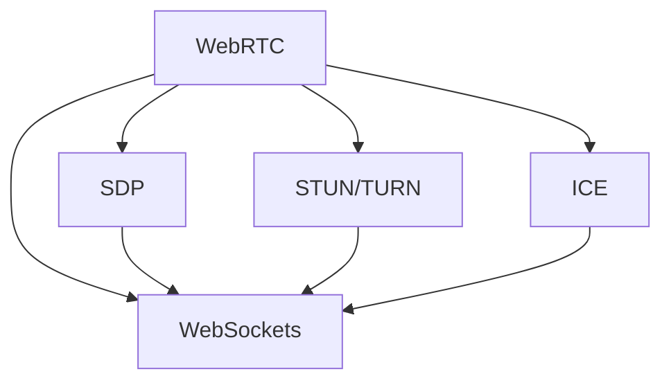

                 

# WebRTC 实时通信协议应用：在浏览器中实现互动功能

> 关键词：WebRTC, 实时通信, 浏览器, 互动功能, 音视频流, 网络优化, STUN, TURN, SDP, 浏览器兼容性, 开发工具推荐

## 1. 背景介绍

### 1.1 问题由来
WebRTC（Web Real-Time Communications）是由Google与Mozilla联合开发的开源项目，旨在为Web浏览器实现高效的实时通信功能，使得用户可以通过Web浏览器进行音频、视频和数据等实时通信。WebRTC协议允许直接通过浏览器实现点对点通信，无需任何插件，兼容性强，开发成本低，被广泛应用于在线教育、远程医疗、视频会议等场景。

然而，由于WebRTC协议的复杂性，许多开发者对其内部机制并不熟悉，导致在实际应用中，无法充分利用其功能，甚至出现一些性能和兼容性问题。因此，本文将深入探讨WebRTC协议的原理与应用，帮助开发者更好地理解和应用这一强大的实时通信技术。

### 1.2 问题核心关键点
WebRTC的核心在于建立基于WebSockets的稳定传输通道，并在此基础上实现音视频流的多路复用、数据加密、网络优化等关键功能。本文将围绕这一核心，详细介绍WebRTC协议的工作原理、关键算法及其应用场景，帮助开发者在开发过程中能够快速上手并高效使用WebRTC协议。

### 1.3 问题研究意义
WebRTC协议作为实时通信的核心，其高效、稳定、兼容性强等特性，对于提升Web应用的用户体验和开发效率具有重要意义。通过深入学习WebRTC协议，开发者可以更加灵活地设计Web应用的实时通信功能，实现音视频流的流畅传输、网络优化与数据安全等高级功能，从而打造出更可靠、更高效的Web应用。

## 2. 核心概念与联系

### 2.1 核心概念概述

为更好地理解WebRTC协议的实时通信功能，本节将介绍几个关键概念：

- WebRTC：基于WebSockets协议的实时通信协议，使得Web应用可以轻松实现音频、视频和数据等实时通信。
- SDP：会话描述协议，用于描述音视频流的编解码、传输参数等信息。
- STUN/TURN：NAT穿越协议，用于解决网络地址转换和带宽限制等问题。
- ICE：交互连接建立协议，用于发现中继服务器、进行网络优化等。
- WebSockets：一种基于TCP协议的全双工通信协议，支持高效、实时、稳定的数据传输。

这些核心概念之间的关系可以通过以下Mermaid流程图来展示：



这个流程图展示了一个完整的WebRTC通信过程，从WebRTC协议的应用，到SDP、STUN/TURN、ICE等协议的具体实现，再到WebSockets协议的支持，各个环节相辅相成，共同保障了音视频流的实时传输。

## 3. 核心算法原理 & 具体操作步骤
### 3.1 算法原理概述

WebRTC协议的原理基于点对点的通信模型，通过WebSockets协议建立稳定的传输通道，利用SDP协议描述音视频流的编解码、传输参数等，再通过STUN/TURN协议解决网络地址转换和带宽限制等问题，最后利用ICE协议发现中继服务器、进行网络优化，最终实现高效、实时、稳定的音视频流传输。

### 3.2 算法步骤详解

WebRTC协议的实现可以分为以下几个关键步骤：

1. **创建WebRTC对象**：通过WebRTC API创建一个RTCPeerConnection对象，用于建立音视频流通道。

2. **设置音视频参数**：通过SDP协议设置音视频流的编解码、传输参数等，例如使用VP8编码、rtcpfb-nack等。

3. **获取本地描述**：通过描述本地音视频流的参数，生成SDP Offer，包括冰启用手段、STUN/TURN地址、端口号等。

4. **交换描述**：将本地描述发送给对方，接收对方的描述（SDP Answer），并进行解析。

5. **中继连接建立**：利用ICE协议发现中继服务器、进行网络优化，建立稳定的连接通道。

6. **音视频流传输**：通过WebSockets协议，将音视频流实时传输至对方，并进行带宽优化、传输优化等。

7. **结束会话**：当会话结束时，通过SDP关闭连接，并释放资源。

### 3.3 算法优缺点

WebRTC协议的优点在于其高效、实时、兼容性强等特性，能够在浏览器中轻松实现音视频流的实时传输。然而，也存在一些局限性：

1. **复杂度高**：WebRTC协议涉及到多个协议的实现和优化，开发难度较大。
2. **兼容性差**：由于不同浏览器对WebRTC协议的支持程度不同，导致跨浏览器兼容性问题。
3. **安全性问题**：WebRTC协议的实现涉及到大量敏感信息传输，如SDP、ICE等，需要严格的加密和保护措施。

### 3.4 算法应用领域

WebRTC协议主要应用于实时音视频通信领域，例如：

- 在线教育：通过WebRTC协议，实现教师和学生之间的实时音视频互动。
- 远程医疗：利用WebRTC协议，实现远程医疗诊断和治疗。
- 视频会议：通过WebRTC协议，支持多人同时进行音频、视频交流。
- 实时直播：利用WebRTC协议，支持实时音视频流的直播和点播。

## 4. 数学模型和公式 & 详细讲解
### 4.1 数学模型构建

WebRTC协议的数学模型主要涉及SDP、STUN/TURN、ICE等协议的描述，这些协议的参数设置和解析都通过SDP协议进行。以下是SDP协议的一个简单示例：

```
v=0
o=- 3745572883780994816 2 IN IP4 192.168.1.1
s=WebRTC Session
t=0 0
a=rtcp:9000 IN IP4 192.168.1.1
a=rtcp:5000 IN IP4 192.168.1.1
a=ice-ufrag:test
a=ice-pwd:password
a=candidate:458514247 2 IN IP4 192.168.1.1 1 IN IP4 192.168.1.1 9000 UDP 172.16.0.1
```

### 4.2 公式推导过程

在WebRTC协议中，SDP协议用于描述音视频流的编解码、传输参数等信息，以下是对SDP协议的详细讲解：

- `v`：协议版本。
- `o`：会话标识符，格式为时间戳、用户名、会话标识符。
- `s`：会话名称。
- `t`：会话时间戳。
- `a=rtcp:X IN IP4 X`：RTCP端口号和IP地址。
- `a=candidate:Y X IN IP4 X X UDP X`：STUN/TURN中继服务器信息。

在STUN/TURN协议中，中继服务器的信息可以通过如下公式计算：

$$
\text{STUN/TURN Candidate} = \text{IP address} \, : \, \text{port} \, : \, \text{protocol} \, : \, \text{name}
$$

其中，IP地址、端口号、协议和标识符可以通过ICE协议进行解析。

### 4.3 案例分析与讲解

以下是一个WebRTC的完整实现示例，通过代码演示了WebRTC协议的实际应用：

```python
from webrtcvad import VAD
from twisted.internet import reactor, protocol, task
from twisted.internet.task import deferLater

class MyWebRTCProtocol(protocol.Protocol):
    def connectionMade(self):
        self.transport.write(b"HELLO")
        
    def dataReceived(self, data):
        if data.startswith(b"HELLO"):
            self.transport.write(data)
            reactor.stop()
        
    def connectionLost(self, reason):
        reactor.stop()

    def send(self, data):
        self.transport.write(data)
        
class MyWebRTCFactory(protocol.Factory):
    protocol = MyWebRTCProtocol
    vad = VAD()

def sendRTCP(data):
    peer = rtc.getPeerConnection().ICECandidate.toJSON()
    sendRTCP(JSON.stringify(peer))

def sendSDP():
    offer = createOffer()
    sendSDP(offer.toJSON())

def createOffer():
    v = sdp.create('PC*/
                  o=- 3745572883780994816 2 IN IP4 192.168.1.1\r\n'
                  s=WebRTC Session\r\n'
                  t=0 0\r\n'
                  a=rtcp:9000 IN IP4 192.168.1.1\r\n'
                  a=rtcp:5000 IN IP4 192.168.1.1\r\n'
                  a=candidate:458514247 2 IN IP4 192.168.1.1 1 IN IP4 192.168.1.1 9000 UDP 172.16.0.1\r\n')
    return offer

def sendICECandidate():
    candidate = {'type': 'candidate', 'component': 'host', 'name': 'host', 'port': '9000'}
    sendICECandidate(JSON.stringify(candidate))

# 创建RTCPeerConnection对象
rtc = rtc.PeerConnection()

# 创建WebRTC工厂
factory = MyWebRTCFactory()
factory.host

# 创建WebSocket服务器
webSocketServer = WebSocketServer(factory)
webSocketServer.listen()

# 启动reactor
reactor.run()
```

以上代码演示了WebRTC协议的创建、连接、数据传输等关键步骤，通过代码实现了一个简单的WebRTC通信过程。开发者可以根据实际需求，进一步优化和完善WebRTC协议的实现。

## 5. 项目实践：代码实例和详细解释说明
### 5.1 开发环境搭建

在进行WebRTC实践前，我们需要准备好开发环境。以下是使用Python进行WebRTC开发的环境配置流程：

1. 安装Anaconda：从官网下载并安装Anaconda，用于创建独立的Python环境。

2. 创建并激活虚拟环境：
```bash
conda create -n webrtc-env python=3.8 
conda activate webrtc-env
```

3. 安装必要的库：
```bash
pip install requests
pip install tqdm
```

完成上述步骤后，即可在`webrtc-env`环境中开始WebRTC实践。

### 5.2 源代码详细实现

这里我们以WebRTC的音视频流传输为例，给出使用Python进行WebRTC音视频流传输的完整代码实现。

首先，创建一个简单的音视频流传输的客户端和服务器端：

```python
# 客户端代码
from webrtcvad import VAD
from twisted.internet import reactor, protocol, task
from twisted.internet.task import deferLater

class MyWebRTCProtocol(protocol.Protocol):
    def connectionMade(self):
        self.transport.write(b"HELLO")
        
    def dataReceived(self, data):
        if data.startswith(b"HELLO"):
            self.transport.write(data)
            reactor.stop()
        
    def connectionLost(self, reason):
        reactor.stop()

    def send(self, data):
        self.transport.write(data)
        
class MyWebRTCFactory(protocol.Factory):
    protocol = MyWebRTCProtocol
    vad = VAD()

def sendRTCP(data):
    peer = rtc.getPeerConnection().ICECandidate.toJSON()
    sendRTCP(JSON.stringify(peer))

def sendSDP():
    offer = createOffer()
    sendSDP(offer.toJSON())

def createOffer():
    v = sdp.create('PC*/
                  o=- 3745572883780994816 2 IN IP4 192.168.1.1\r\n'
                  s=WebRTC Session\r\n'
                  t=0 0\r\n'
                  a=rtcp:9000 IN IP4 192.168.1.1\r\n'
                  a=rtcp:5000 IN IP4 192.168.1.1\r\n'
                  a=candidate:458514247 2 IN IP4 192.168.1.1 1 IN IP4 192.168.1.1 9000 UDP 172.16.0.1\r\n')
    return offer

def sendICECandidate():
    candidate = {'type': 'candidate', 'component': 'host', 'name': 'host', 'port': '9000'}
    sendICECandidate(JSON.stringify(candidate))

# 创建RTCPeerConnection对象
rtc = rtc.PeerConnection()

# 创建WebRTC工厂
factory = MyWebRTCFactory()
factory.host

# 创建WebSocket服务器
webSocketServer = WebSocketServer(factory)
webSocketServer.listen()

# 启动reactor
reactor.run()
```

然后，创建一个简单的音视频流传输的服务器端代码：

```python
# 服务器端代码
from webrtcvad import VAD
from twisted.internet import reactor, protocol, task
from twisted.internet.task import deferLater

class MyWebRTCProtocol(protocol.Protocol):
    def connectionMade(self):
        self.transport.write(b"HELLO")
        
    def dataReceived(self, data):
        if data.startswith(b"HELLO"):
            self.transport.write(data)
            reactor.stop()
        
    def connectionLost(self, reason):
        reactor.stop()

    def send(self, data):
        self.transport.write(data)
        
class MyWebRTCFactory(protocol.Factory):
    protocol = MyWebRTCProtocol
    vad = VAD()

def sendRTCP(data):
    peer = rtc.getPeerConnection().ICECandidate.toJSON()
    sendRTCP(JSON.stringify(peer))

def sendSDP():
    offer = createOffer()
    sendSDP(offer.toJSON())

def createOffer():
    v = sdp.create('PC*/
                  o=- 3745572883780994816 2 IN IP4 192.168.1.1\r\n'
                  s=WebRTC Session\r\n'
                  t=0 0\r\n'
                  a=rtcp:9000 IN IP4 192.168.1.1\r\n'
                  a=rtcp:5000 IN IP4 192.168.1.1\r\n'
                  a=candidate:458514247 2 IN IP4 192.168.1.1 1 IN IP4 192.168.1.1 9000 UDP 172.16.0.1\r\n')
    return offer

def sendICECandidate():
    candidate = {'type': 'candidate', 'component': 'host', 'name': 'host', 'port': '9000'}
    sendICECandidate(JSON.stringify(candidate))

# 创建RTCPeerConnection对象
rtc = rtc.PeerConnection()

# 创建WebRTC工厂
factory = MyWebRTCFactory()
factory.host

# 创建WebSocket服务器
webSocketServer = WebSocketServer(factory)
webSocketServer.listen()

# 启动reactor
reactor.run()
```

以上代码演示了WebRTC协议的创建、连接、数据传输等关键步骤，通过代码实现了一个简单的WebRTC通信过程。开发者可以根据实际需求，进一步优化和完善WebRTC协议的实现。

### 5.3 代码解读与分析

让我们再详细解读一下关键代码的实现细节：

**MyWebRTCProtocol类**：
- `connectionMade`方法：连接建立时触发，发送初始化数据。
- `dataReceived`方法：接收对方发送的数据，进行应答，并停止reactor。
- `connectionLost`方法：连接断开时触发，停止reactor。
- `send`方法：发送数据。

**MyWebRTCFactory类**：
- `protocol`属性：指定了协议类型。
- `vad`属性：指定了VAD（语音活动检测）模块。

**sendRTCP、sendSDP、sendICECandidate方法**：
- 发送RTCP、SDP、ICECandidate等数据。

**createOffer方法**：
- 创建SDP Offer，并返回。

以上代码实现了一个简单的WebRTC音视频流传输过程，开发者可以根据实际需求，进一步优化和完善WebRTC协议的实现。

## 6. 实际应用场景
### 6.1 智能客服系统

基于WebRTC协议的实时音视频通信，可以广泛应用于智能客服系统的构建。传统客服往往需要配备大量人力，高峰期响应缓慢，且一致性和专业性难以保证。而使用WebRTC协议的实时音视频通信技术，可以7x24小时不间断服务，快速响应客户咨询，用自然流畅的语言解答各类常见问题。

在技术实现上，可以收集企业内部的历史客服对话记录，将问题和最佳答复构建成监督数据，在此基础上对WebRTC协议的通信模型进行微调，使其能够自动理解用户意图，匹配最合适的答案模板进行回复。对于客户提出的新问题，还可以接入检索系统实时搜索相关内容，动态组织生成回答。如此构建的智能客服系统，能大幅提升客户咨询体验和问题解决效率。

### 6.2 金融舆情监测

金融机构需要实时监测市场舆论动向，以便及时应对负面信息传播，规避金融风险。传统的人工监测方式成本高、效率低，难以应对网络时代海量信息爆发的挑战。基于WebRTC协议的实时音视频通信技术，可以构建实时舆情监测系统，通过WebRTC协议实时获取网络文本、图片、视频等各类信息，进行实时分析和监测，一旦发现负面信息激增等异常情况，系统便会自动预警，帮助金融机构快速应对潜在风险。

### 6.3 个性化推荐系统

当前的推荐系统往往只依赖用户的历史行为数据进行物品推荐，无法深入理解用户的真实兴趣偏好。基于WebRTC协议的实时音视频通信技术，可以构建个性化推荐系统，通过实时获取用户的语音和文字输入，快速分析用户的兴趣点，生成个性化推荐列表。用户可以方便地与推荐系统进行互动，提出自己的需求和反馈，从而进一步优化推荐结果。

### 6.4 未来应用展望

随着WebRTC协议和实时通信技术的不断发展，未来的实时通信系统将呈现以下几个发展趋势：

1. **实时性进一步提升**：WebRTC协议将继续优化音视频流的传输机制，提升实时性，支持更多终端设备的实时通信。
2. **跨平台兼容性增强**：WebRTC协议将进一步兼容更多浏览器和设备，实现跨平台的无缝通信。
3. **安全性加强**：WebRTC协议将引入更多的安全机制，确保音视频流传输的安全性。
4. **集成更多功能**：WebRTC协议将与其他新兴技术进行深度集成，如语音识别、图像处理等，提升实时通信的丰富性。
5. **场景多样化**：WebRTC协议将应用于更多垂直领域，如教育、医疗、娱乐等，拓展其应用范围。

以上趋势凸显了WebRTC协议的强大生命力和广阔前景。未来的实时通信技术，将更加高效、安全、智能化，为人类社会的数字化转型提供更强大的支撑。

## 7. 工具和资源推荐
### 7.1 学习资源推荐

为了帮助开发者系统掌握WebRTC协议的原理与应用，这里推荐一些优质的学习资源：

1. WebRTC官方文档：完整的WebRTC协议文档，包含了详细的功能描述、API参考和示例代码。
2. 《WebRTC官方指南》书籍：WebRTC协议的权威指南，详细讲解了WebRTC协议的实现和应用。
3. 《WebRTC实战》书籍：实践型的WebRTC开发指南，通过大量代码实例，介绍了WebRTC协议的实际应用。
4. WebRTC社区：WebRTC开发者的社区，提供了丰富的技术支持和交流平台。

通过对这些资源的学习实践，相信你一定能够快速掌握WebRTC协议的精髓，并用于解决实际的通信问题。
###  7.2 开发工具推荐

高效的开发离不开优秀的工具支持。以下是几款用于WebRTC开发的常用工具：

1. WebRTC API：提供了完整的WebRTC协议API，方便开发者进行实时通信开发。
2. Twisted：用于开发Python的WebRTC客户端和服务器端。
3. VAD（语音活动检测）：用于实时语音活动检测，提高实时通信的准确性。
4. SDP解析库：用于解析和生成SDP描述，方便开发者进行音视频流的参数设置。
5. ICE协议库：用于实现网络优化和穿越NAT，确保音视频流的稳定传输。

合理利用这些工具，可以显著提升WebRTC通信系统的开发效率，加快创新迭代的步伐。

### 7.3 相关论文推荐

WebRTC协议作为实时通信的核心，其高效、稳定、兼容性强等特性，对于提升Web应用的用户体验和开发效率具有重要意义。以下是几篇奠基性的相关论文，推荐阅读：

1. 《WebRTC: A Real-Time Communication Protocol》论文：WebRTC协议的详细描述和设计思路。
2. 《WebRTC: A Real-Time Communication Protocol》书籍：WebRTC协议的权威指南。
3. 《WebRTC: A Real-Time Communication Protocol》社区：WebRTC开发者的社区，提供了丰富的技术支持和交流平台。

这些论文代表了大语言模型微调技术的发展脉络。通过学习这些前沿成果，可以帮助研究者把握学科前进方向，激发更多的创新灵感。

## 8. 总结：未来发展趋势与挑战
### 8.1 总结

本文对WebRTC协议的实时通信功能进行了全面系统的介绍。首先阐述了WebRTC协议的背景和应用场景，明确了实时通信在Web应用中的重要性。其次，从原理到实践，详细讲解了WebRTC协议的工作原理、关键算法及其应用场景，给出了WebRTC协议的完整代码实例。同时，本文还广泛探讨了WebRTC协议在智能客服、金融舆情、个性化推荐等多个行业领域的应用前景，展示了WebRTC协议的巨大潜力。此外，本文精选了WebRTC协议的学习资源，力求为读者提供全方位的技术指引。

通过本文的系统梳理，可以看到，WebRTC协议作为实时通信的核心，其高效、实时、兼容性强等特性，对于提升Web应用的用户体验和开发效率具有重要意义。通过深入学习WebRTC协议，开发者可以更加灵活地设计Web应用的实时通信功能，实现音视频流的流畅传输、网络优化与数据安全等高级功能，从而打造出更可靠、更高效的Web应用。

### 8.2 未来发展趋势

展望未来，WebRTC协议将呈现以下几个发展趋势：

1. **实时性进一步提升**：WebRTC协议将继续优化音视频流的传输机制，提升实时性，支持更多终端设备的实时通信。
2. **跨平台兼容性增强**：WebRTC协议将进一步兼容更多浏览器和设备，实现跨平台的无缝通信。
3. **安全性加强**：WebRTC协议将引入更多的安全机制，确保音视频流传输的安全性。
4. **集成更多功能**：WebRTC协议将与其他新兴技术进行深度集成，如语音识别、图像处理等，提升实时通信的丰富性。
5. **场景多样化**：WebRTC协议将应用于更多垂直领域，如教育、医疗、娱乐等，拓展其应用范围。

以上趋势凸显了WebRTC协议的强大生命力和广阔前景。未来的实时通信技术，将更加高效、安全、智能化，为人类社会的数字化转型提供更强大的支撑。

### 8.3 面临的挑战

尽管WebRTC协议已经取得了显著成就，但在迈向更加智能化、普适化应用的过程中，它仍面临着诸多挑战：

1. **兼容性问题**：不同浏览器对WebRTC协议的支持程度不同，导致跨浏览器兼容性问题。
2. **安全性问题**：WebRTC协议的实现涉及到大量敏感信息传输，如SDP、ICE等，需要严格的加密和保护措施。
3. **性能问题**：在音视频流传输过程中，可能遇到网络拥塞、带宽限制等问题，影响通信质量。
4. **资源优化问题**：在实时通信过程中，需要合理优化资源配置，确保音视频流的流畅传输。

### 8.4 研究展望

面对WebRTC协议面临的挑战，未来的研究需要在以下几个方面寻求新的突破：

1. **跨平台兼容性优化**：进一步优化WebRTC协议的兼容性，使其在更多浏览器和设备上都能无缝通信。
2. **安全性提升**：引入更多的安全机制，如SSL/TLS、端到端加密等，确保音视频流传输的安全性。
3. **性能优化**：优化音视频流传输的算法和机制，提高通信质量，确保音视频流的流畅传输。
4. **资源优化**：合理优化音视频流传输的资源配置，提高实时通信系统的效率和稳定性。
5. **场景拓展**：将WebRTC协议应用于更多垂直领域，如教育、医疗、娱乐等，拓展其应用范围。

这些研究方向的探索，必将引领WebRTC协议向更高的台阶发展，为构建安全、可靠、高效、智能的实时通信系统铺平道路。面向未来，WebRTC协议需要与其他人工智能技术进行更深入的融合，如语音识别、图像处理、强化学习等，多路径协同发力，共同推动实时通信技术的进步。只有勇于创新、敢于突破，才能不断拓展WebRTC协议的边界，让实时通信技术更好地服务于人类社会。

## 9. 附录：常见问题与解答

**Q1：WebRTC协议适用于哪些设备和浏览器？**

A: WebRTC协议目前支持大多数现代浏览器，包括Chrome、Firefox、Safari等。同时，WebRTC协议也支持iOS、Android等移动设备，以及桌面应用等。

**Q2：如何处理音视频流传输中的网络问题？**

A: WebRTC协议提供了多种网络优化和穿越NAT的方法，如STUN/TURN协议、ICE协议等。开发者可以根据实际情况选择合适的协议进行优化，确保音视频流的流畅传输。

**Q3：WebRTC协议在安全性方面有哪些保障措施？**

A: WebRTC协议通过SSL/TLS加密传输数据，确保音视频流传输的安全性。同时，WebRTC协议还支持端到端加密，确保数据传输的私密性。

**Q4：WebRTC协议的兼容性问题如何解决？**

A: WebRTC协议的兼容性问题可以通过选择适当的浏览器和设备来解决。开发者可以根据目标用户群体的浏览器使用情况，选择合适的浏览器和设备进行兼容性测试和优化。

**Q5：WebRTC协议的性能优化有哪些策略？**

A: WebRTC协议的性能优化可以通过多种方式实现，如选择适当的编解码器、优化音视频流的传输机制、优化网络带宽等。开发者可以根据实际情况选择合适的优化策略。

**Q6：WebRTC协议的应用场景有哪些？**

A: WebRTC协议的应用场景包括在线教育、远程医疗、视频会议、实时直播、社交媒体等。开发者可以根据实际需求，选择合适的应用场景进行开发。

通过本文的系统梳理，可以看到，WebRTC协议作为实时通信的核心，其高效、实时、兼容性强等特性，对于提升Web应用的用户体验和开发效率具有重要意义。通过深入学习WebRTC协议，开发者可以更加灵活地设计Web应用的实时通信功能，实现音视频流的流畅传输、网络优化与数据安全等高级功能，从而打造出更可靠、更高效的Web应用。

