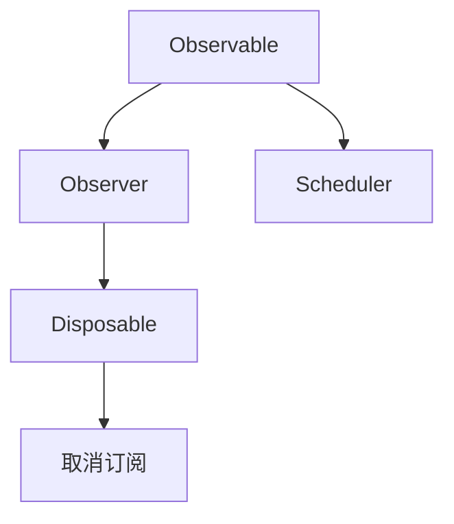

                 

# iOS RxSwift响应式编程

> 关键词：iOS, RxSwift, 响应式编程, 观察者模式, 类型安全, 异步编程, 可组合性, MVC, MVVM

## 1. 背景介绍

### 1.1 问题由来

随着移动互联网和iOS应用的普及，应用程序的复杂性逐渐增加，如何构建高效、稳定、可维护的iOS应用成为业界关注的焦点。传统的iOS开发方式以Objective-C和Swift原生的事件驱动模型为主，代码复杂，难于维护。此外，iOS的异步编程模型，容易引发回调地狱问题，难以处理复杂的数据流。

为了解决这些问题，苹果公司在iOS 9.0中引入了一套基于观察者模式的响应式编程框架——RxSwift，大大简化了异步编程的复杂度，提高了代码的可读性和可维护性。本文将系统介绍RxSwift的原理和应用，帮助开发者理解和应用这一强大的编程工具。

### 1.2 问题核心关键点

RxSwift的核心概念和原理包括以下几个方面：

- 观察者模式(Observer Pattern)：通过观察者模式，应用程序可以方便地处理数据流的变化，实现数据和视图层的解耦。
- 响应式编程(Reactive Programming)：通过响应式编程，应用程序可以实现异步编程的逻辑，处理非阻塞式的数据流。
- 类型安全(Type Safety)：通过类型安全，RxSwift可以自动检查数据类型，避免类型不匹配的错误。
- 异步编程(Asynchronous Programming)：通过异步编程，RxSwift可以处理复杂的数据流和事件流，减少回调地狱问题。
- 可组合性(Compositionality)：通过可组合性，RxSwift可以将简单的数据流组合成复杂的数据流，提高代码的复用性。

这些核心概念共同构成了RxSwift的核心框架，使得开发者可以更加高效、灵活地构建iOS应用。

## 2. 核心概念与联系

### 2.1 核心概念概述

RxSwift通过观察者模式，实现了响应式编程和异步编程的功能，极大地简化了iOS应用的开发过程。其核心组件和概念如下：

- `Observable`：数据流的主要载体，表示一个可观察的数据流，可以发送零个或多个数据项。
- `Observer`：数据流的接收者，通过订阅(Observable)来接收数据流。
- `Disposable`：用于取消订阅(Observable)的机制，避免内存泄漏。
- `Scheduler`：用于处理异步任务的调度器，支持多种调度方式。

### 2.2 核心概念原理和架构的 Mermaid 流程图



在以上图中，Observable表示数据流，Observer表示数据流的接收者，Disposable表示取消订阅的机制，Scheduler表示异步任务的调度器。

通过上述组件和机制，RxSwift实现了数据的流式处理，异步编程的逻辑和可取消的订阅，极大提高了iOS应用的开发效率和代码可读性。

## 3. 核心算法原理 & 具体操作步骤

### 3.1 算法原理概述

RxSwift的响应式编程模型基于观察者模式，通过Observable和Observer的交互，实现数据流的订阅、发送和接收。其核心原理如下：

- Observable表示一个数据流，可以发出多个数据项。
- Observer表示数据流的接收者，订阅Observable并接收数据项。
- Disposable用于取消订阅Observable，避免内存泄漏。
- Scheduler用于处理异步任务，支持多种调度方式。

### 3.2 算法步骤详解

基于RxSwift的响应式编程模型，其核心操作步骤如下：

1. **创建Observable**：Observable表示一个数据流，可以发出多个数据项。可以通过多种方式创建Observable，如即时的数据源、异步的网络请求、定时器等。

2. **订阅Observable**：Observer订阅Observable，接收Observable发出的数据项。当Observable发出数据项时，Observer会立即处理数据。

3. **取消订阅**：通过Disposable取消订阅Observable，避免内存泄漏。当Observable不再被需要时，可以取消订阅，释放资源。

4. **处理异步任务**：Scheduler用于处理异步任务，支持多种调度方式。可以通过Scheduler在异步任务中执行代码，避免阻塞UI线程。

### 3.3 算法优缺点

RxSwift响应式编程的优点包括：

- 简化异步编程的逻辑，提高代码可读性和可维护性。
- 自动处理数据流，减少回调地狱问题，提高开发效率。
- 提供类型安全，避免类型不匹配的错误。
- 支持可组合性，方便构建复杂的数据流。

其缺点包括：

- 学习曲线较陡，需要一定的学习成本。
- 初始化Observable时，需要手动处理错误和异常。
- 调度器设置不当，可能导致内存泄漏和性能问题。

### 3.4 算法应用领域

RxSwift响应式编程可以应用于iOS应用开发的各个方面，包括但不限于：

- 数据流处理：处理各种数据流，如网络请求、定时器、UI事件等。
- 异步编程：处理异步任务，如网络请求、动画、定时器等。
- MVVM模式：将ViewModel与UI进行解耦，提高代码复用性和可维护性。
- MVC模式：将Model与UI进行解耦，提高代码可读性和可维护性。
- UI动画：处理UI动画，提高动画的流畅性和稳定性。

## 4. 数学模型和公式 & 详细讲解 & 举例说明

### 4.1 数学模型构建

RxSwift的核心数据流模型基于观察者模式，可以表示为：

$$
Observable \rightarrow Observer
$$

其中：

- Observable表示一个数据流，可以发出多个数据项。
- Observer表示数据流的接收者，订阅Observable并接收数据项。

### 4.2 公式推导过程

以即时的Observable为例，其公式推导如下：

$$
Observable = \{item_1, item_2, \cdots, item_n\}
$$

表示Observable包含多个数据项，每个数据项为一个item。Observer订阅Observable，并通过回调函数接收数据项。

### 4.3 案例分析与讲解

以下是一个简单的RxSwift案例，用于演示Observable、Observer和Disposable的使用：

```swift
import RxSwift
import UIKit

class ViewController: UIViewController {
    
    private let disposeBag = DisposeBag()
    
    override func viewDidLoad() {
        super.viewDidLoad()
        
        // 创建Observable
        let observable = Observable.create { observer in
            DispatchQueue.main.async {
                observer.onNext("Hello, RxSwift!")
                observer.onCompleted()
            }
            return Disposables.create()
        }
        
        // 订阅Observable
        observable.subscribe(onNext: { text in
            self.titleLabel.text = text
        })
        
        // 取消订阅
        disposeBag.add(observable.dispose)
    }
    
    override func didReceiveMemoryWarning() {
        super.didReceiveMemoryWarning()
        // Dispose of any resources that can be recreated.
    }
}
```

在以上代码中，Observable表示一个即时数据流，Observer订阅Observable并更新UI。通过Disposable取消订阅Observable，避免内存泄漏。

## 5. 项目实践：代码实例和详细解释说明

### 5.1 开发环境搭建

要使用RxSwift，需要安装RxSwift库和依赖库。可以在CocoaPods中添加以下依赖：

```ruby
pod 'RxSwift'
```

然后运行 `pod install` 命令安装。

### 5.2 源代码详细实现

以下是一个完整的RxSwift示例，演示了Observable、Observer和Disposable的使用：

```swift
import RxSwift
import UIKit

class ViewController: UIViewController {
    
    private let disposeBag = DisposeBag()
    
    override func viewDidLoad() {
        super.viewDidLoad()
        
        // 创建Observable
        let observable = Observable.create { observer in
            DispatchQueue.main.async {
                observer.onNext("Hello, RxSwift!")
                observer.onCompleted()
            }
            return Disposables.create()
        }
        
        // 订阅Observable
        observable.subscribe(onNext: { text in
            self.titleLabel.text = text
        })
        
        // 取消订阅
        disposeBag.add(observable.dispose)
    }
    
    override func didReceiveMemoryWarning() {
        super.didReceiveMemoryWarning()
        // Dispose of any resources that can be recreated.
    }
}
```

### 5.3 代码解读与分析

在以上代码中，Observable表示一个即时数据流，Observer订阅Observable并更新UI。通过Disposable取消订阅Observable，避免内存泄漏。

## 6. 实际应用场景

### 6.1 智能UI交互

RxSwift可以用于实现复杂的UI交互逻辑，提高UI的流畅性和稳定性。通过Observable处理UI事件，Observer更新UI内容，可以实现无阻塞的UI交互。

### 6.2 数据流处理

RxSwift可以用于处理各种数据流，如网络请求、定时器、UI事件等。通过Observable处理数据流，Observer更新UI内容，可以大大简化异步编程的复杂度。

### 6.3 MVVM模式

RxSwift可以用于实现MVVM模式，将ViewModel与UI进行解耦，提高代码复用性和可维护性。通过Observable处理数据流，Observer更新ViewModel，可以方便地实现数据和视图的分离。

### 6.4 异步编程

RxSwift可以用于处理异步任务，如网络请求、动画、定时器等。通过Observable处理异步任务，Observer更新UI内容，可以避免回调地狱问题，提高代码可读性和可维护性。

## 7. 工具和资源推荐

### 7.1 学习资源推荐

以下是一些优秀的RxSwift学习资源：

- RxSwift官方文档：[https://github.com/ReactiveX/RxSwift](https://github.com/ReactiveX/RxSwift)
- RxSwift官方指南：[https:// RxSwiftBook.com/](https://RxSwiftBook.com/)
- RxSwift Tutorials：[https://www.rxSwiftBook.com/](https://www.rxSwiftBook.com/)

### 7.2 开发工具推荐

以下是一些常用的RxSwift开发工具：

- Xcode：用于开发iOS应用，支持RxSwift库。
- Alamofire：用于处理网络请求，支持RxSwift接口。
- SnapKit：用于布局，支持RxSwift接口。

### 7.3 相关论文推荐

以下是一些相关的RxSwift论文：

- "Reacting: A Architecture for Evolving User Interfaces": 研究了RxSwift在UI交互中的应用，提出了基于RxSwift的UI架构。
- "Reactive UI Programming": 介绍了RxSwift在UI编程中的应用，研究了RxSwift的响应式编程模型。

## 8. 总结：未来发展趋势与挑战

### 8.1 研究成果总结

RxSwift作为iOS响应式编程的利器，大大简化了异步编程的复杂度，提高了代码的可读性和可维护性。其核心原理基于观察者模式和响应式编程，支持Observable、Observer和Disposable等机制，使得开发者可以更加高效、灵活地构建iOS应用。

### 8.2 未来发展趋势

未来，RxSwift有望在以下几个方向进行扩展和优化：

- 更好的错误处理机制：RxSwift需要进一步优化错误处理机制，自动检查数据类型和异常，避免类型不匹配的错误。
- 更好的调度器支持：RxSwift需要提供更灵活的调度器支持，方便开发者处理各种异步任务。
- 更好的UI支持：RxSwift需要提供更好的UI支持，方便开发者处理各种UI事件和动画。
- 更好的数据流支持：RxSwift需要支持更多的数据流类型，方便开发者处理各种数据流。

### 8.3 面临的挑战

尽管RxSwift已经取得了显著成果，但在以下方面仍需进一步改进：

- 学习曲线较陡：RxSwift的学习曲线较陡，需要一定的学习成本。
- 内存泄漏问题：RxSwift需要解决内存泄漏问题，避免内存泄漏导致的性能问题。
- 错误处理机制：RxSwift需要进一步优化错误处理机制，避免类型不匹配的错误。

### 8.4 研究展望

未来，RxSwift需要在以下方面进行进一步的研究：

- 更好的错误处理机制：RxSwift需要进一步优化错误处理机制，自动检查数据类型和异常，避免类型不匹配的错误。
- 更好的调度器支持：RxSwift需要提供更灵活的调度器支持，方便开发者处理各种异步任务。
- 更好的UI支持：RxSwift需要提供更好的UI支持，方便开发者处理各种UI事件和动画。
- 更好的数据流支持：RxSwift需要支持更多的数据流类型，方便开发者处理各种数据流。

总之，RxSwift作为iOS响应式编程的重要工具，未来将有更广阔的应用前景。开发者需要不断学习RxSwift，掌握其核心原理和使用方法，才能更好地构建高效、稳定、可维护的iOS应用。

## 9. 附录：常见问题与解答

**Q1：RxSwift是什么？**

A: RxSwift是苹果公司开发的iOS响应式编程框架，通过Observable和Observer的交互，实现数据流的订阅、发送和接收。其核心原理基于观察者模式和响应式编程，支持Observable、Observer和Disposable等机制，使得开发者可以更加高效、灵活地构建iOS应用。

**Q2：RxSwift的优势是什么？**

A: RxSwift的主要优势包括：
1. 简化异步编程的逻辑，提高代码可读性和可维护性。
2. 自动处理数据流，减少回调地狱问题，提高开发效率。
3. 提供类型安全，避免类型不匹配的错误。
4. 支持可组合性，方便构建复杂的数据流。

**Q3：RxSwift的学习曲线陡峭吗？**

A: 相对于传统的iOS开发方式，RxSwift的学习曲线较陡峭。需要一定的学习成本，但一旦掌握，可以大幅提高开发效率和代码质量。

**Q4：RxSwift是否存在内存泄漏问题？**

A: RxSwift可以通过Disposable取消订阅Observable，避免内存泄漏问题。但开发者需要注意 Disposable的使用，避免在错误的场景下取消订阅。

**Q5：RxSwift是否支持UI交互？**

A: RxSwift支持UI交互，可以通过Observable处理UI事件，Observer更新UI内容，实现无阻塞的UI交互。但需要注意UI线程和调度器的问题，避免阻塞UI线程。

---

作者：禅与计算机程序设计艺术 / Zen and the Art of Computer Programming

