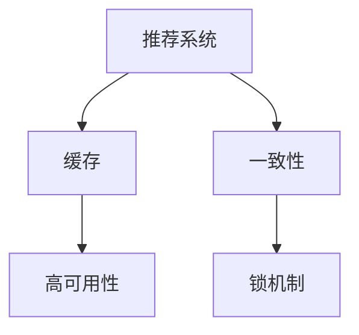

                 

# kv-cache 在推荐系统中的应用

> 关键词：推荐系统，kv-cache，分布式存储，一致性，高可用，键值存储，锁机制，实践案例

## 1. 背景介绍

### 1.1 问题由来

在现代互联网中，推荐系统(Recommendation System)已经成为用户获取信息的重要工具。无论是电商网站、社交平台，还是视频网站，都依赖于推荐系统来为用户推荐内容，提升用户体验和转化率。在推荐系统中，缓存(KV Cache)是必不可少的一部分，用于存储热点数据，减少数据库访问延迟，提升系统性能。

然而，随着数据量和用户量的不断增加，推荐系统的缓存压力也越来越大，如何高效管理和利用缓存，成为了一个重要的技术挑战。同时，缓存的一致性和高可用性要求也必须得到满足，以确保推荐结果的准确性和系统的可靠性。

### 1.2 问题核心关键点

- 缓存的高效管理和利用。如何在数据量不断增长的情况下，合理设计缓存策略，减少数据库访问次数，提升系统响应速度。
- 缓存的一致性和高可用性。如何设计缓存机制，保证缓存数据与数据库数据一致，避免数据脏读，同时确保缓存系统的高可用性。
- 缓存的锁机制。如何在多节点环境下，通过合理设计锁机制，避免缓存数据的竞争和冲突，保证缓存系统的稳定性和并发性。
- 缓存的实践案例。以推荐系统为具体场景，介绍实际项目中的缓存应用，包括缓存设计、部署和优化等具体措施。

## 2. 核心概念与联系

### 2.1 核心概念概述

为更好地理解kv-cache在推荐系统中的应用，本节将介绍几个密切相关的核心概念：

- **推荐系统(Recommendation System)**：基于用户行为和物品属性，通过机器学习算法为用户推荐感兴趣的物品。推荐系统广泛应用在电商、社交、视频等多个领域。
- **缓存(KV Cache)**：一种快速数据存储技术，通过将数据存储在缓存中，可以大幅提升数据访问速度，减少数据库负载。常见的缓存系统包括Redis、Memcached等。
- **一致性(Consistency)**：指缓存和数据库中的数据状态始终保持一致。一致性问题会影响推荐结果的准确性和系统的可靠性。
- **高可用性(High Availability)**：指缓存系统在面对硬件故障、网络中断等异常情况下，仍能保持稳定的服务能力。高可用性要求缓存系统具备容错机制和故障转移能力。
- **锁机制(Locking Mechanism)**：通过设计合理的锁策略，避免缓存数据的竞争和冲突，保证缓存系统的稳定性和并发性。常见的锁机制包括乐观锁、悲观锁、读写锁等。

这些核心概念之间的逻辑关系可以通过以下Mermaid流程图来展示：



这个流程图展示了一些核心概念及其之间的关系：

1. 推荐系统通过缓存来提升数据访问速度。
2. 缓存需保证一致性，以保证推荐结果的准确性。
3. 缓存的高可用性要求其在异常情况下仍能正常服务。
4. 锁机制用于避免缓存数据的竞争和冲突。

## 3. 核心算法原理 & 具体操作步骤
### 3.1 算法原理概述

在推荐系统中，kv-cache的作用是为热门物品和用户行为数据提供快速访问，减少数据库的访问次数，提升推荐速度。常见的缓存策略包括LRU(Least Recently Used)、LFU(Least Frequently Used)、FIFO(First In First Out)等。其中，LRU是最常用的缓存淘汰策略，通过按访问时间顺序淘汰最近最少使用的数据。

以推荐系统为例，LRU缓存策略的实现过程如下：

1. 将热门物品和用户行为数据存储在缓存中。
2. 当用户请求推荐时，优先从缓存中获取数据。
3. 若缓存中没有数据，则从数据库中获取并更新缓存。
4. 若缓存已满，则淘汰最近最少使用的数据，更新缓存。

通过合理设计缓存策略，可以减少数据库的访问压力，提升推荐速度。

### 3.2 算法步骤详解

基于LRU策略的缓存设计步骤包括以下几个关键步骤：

**Step 1: 设计缓存容量**
- 根据推荐系统热点数据的特点，合理设计缓存容量。一般来说，缓存容量应该能够覆盖推荐系统的核心数据，同时留有余量应对突发流量。

**Step 2: 选择合适的缓存算法**
- 选择LRU算法作为缓存淘汰策略，确保缓存能够及时淘汰最近最少使用的数据。

**Step 3: 实现缓存淘汰逻辑**
- 设计缓存淘汰逻辑，记录每个数据块的访问时间，在缓存满时，选择最近最少使用的数据块进行淘汰。

**Step 4: 实现缓存更新逻辑**
- 设计缓存更新逻辑，在从数据库获取新数据时，更新缓存并淘汰最近最少使用的数据块。

**Step 5: 实现缓存查询逻辑**
- 设计缓存查询逻辑，优先从缓存中查询数据，若缓存中没有，则从数据库中查询。

**Step 6: 实现缓存一致性**
- 设计缓存一致性逻辑，确保缓存中的数据与数据库中的数据一致。

**Step 7: 实现缓存高可用性**
- 设计缓存高可用性逻辑，确保缓存系统在异常情况下仍能保持稳定服务。

### 3.3 算法优缺点

基于LRU策略的缓存设计具有以下优点：

1. 减少数据库访问次数，提升推荐速度。通过缓存热门数据，可以显著减少推荐系统对数据库的访问，提高响应速度。
2. 提升系统负载能力。通过缓存数据，可以减轻数据库的负载，提升系统的并发处理能力。
3. 实现简单的缓存淘汰策略。LRU策略简单易实现，不需要额外的数据结构支持。

然而，基于LRU策略的缓存设计也存在以下缺点：

1. 无法适应突发流量。当缓存满且新数据需要进入缓存时，需要淘汰最近最少使用的数据，可能会造成数据丢失或更新延迟。
2. 缓存一致性问题。当缓存和数据库中的数据不一致时，可能会导致推荐结果错误，影响用户体验。
3. 缓存高可用性问题。当缓存系统出现故障时，可能会影响推荐系统的稳定性和可靠性。

### 3.4 算法应用领域

基于LRU策略的缓存设计在推荐系统中具有广泛的应用。其主要用于以下场景：

- 热门物品推荐：通过缓存热门物品的数据，可以显著提升推荐速度，减少数据库访问压力。
- 用户行为分析：缓存用户行为数据，可以提升行为分析的速度，减少数据库的访问压力。
- 用户个性化推荐：缓存用户个性化数据，可以提升推荐算法的效果，减少对数据库的依赖。

## 4. 数学模型和公式 & 详细讲解  
### 4.1 数学模型构建

在推荐系统中，缓存策略的数学模型主要涉及缓存容量、缓存淘汰、缓存更新等参数。以LRU策略为例，假设缓存容量为$C$，缓存块数量为$N$，每个数据块的访问时间为$t_i$，则LRU策略的淘汰规则可以表示为：

$$
\text{淘汰的数据块} = \arg\min_{i}(t_i, i \in [1, N])
$$

在实际应用中，LRU策略的实现可以通过哈希表或双向链表等数据结构来实现。

### 4.2 公式推导过程

以哈希表实现LRU策略为例，假设缓存容量为$C$，当前缓存块数量为$N$，每个数据块的访问时间为$t_i$，则LRU策略的淘汰规则可以表示为：

1. 维护一个哈希表$H$，记录每个数据块的访问时间。
2. 当缓存满时，找到哈希表中访问时间最久的数据块，将其淘汰。
3. 当从数据库获取新数据时，更新哈希表中对应数据块的访问时间。
4. 在查询数据时，优先从哈希表中查找，若缓存中没有数据，则从数据库中查询。

### 4.3 案例分析与讲解

假设缓存容量为$C=10$，当前缓存块数量为$N=10$，每个数据块的访问时间为$t_i$，则LRU策略的淘汰规则可以表示为：

1. 假设数据块1、2、3、4、5、6、7、8、9、10的访问时间分别为$t_1, t_2, t_3, t_4, t_5, t_6, t_7, t_8, t_9, t_{10}$。
2. 当从数据库获取新数据时，假设数据块11的访问时间为$t_{11}$。
3. 在哈希表中，找到访问时间最久的数据块，即$t_{10}$，将其淘汰。
4. 更新哈希表中对应数据块的访问时间，即$t_{11}$，哈希表变为：
   - 数据块1、2、3、4、5、6、7、8、9、11的访问时间分别为$t_1, t_2, t_3, t_4, t_5, t_6, t_7, t_8, t_9, t_{11}$。
5. 在查询数据时，优先从哈希表中查找，若缓存中没有数据，则从数据库中查询。

## 5. 项目实践：代码实例和详细解释说明
### 5.1 开发环境搭建

在进行kv-cache的实践前，我们需要准备好开发环境。以下是使用Python进行Redis缓存实践的环境配置流程：

1. 安装Redis：从官网下载并安装Redis服务器。
2. 安装Python Redis库：通过pip安装Redis官方库，用于Python客户端连接Redis服务器。
   ```bash
   pip install redis
   ```

3. 创建Redis连接池：
   ```python
   from redis import Redis

   redis_client = Redis(host='localhost', port=6379, db=0)
   ```

完成上述步骤后，即可在Python中连接Redis服务器进行缓存实践。

### 5.2 源代码详细实现

下面我们以推荐系统为例，给出使用Redis缓存的Python代码实现。

首先，定义缓存策略和数据结构：

```python
class LRUCache:
    def __init__(self, capacity):
        self.capacity = capacity
        self.cache = {}
        self.hash_table = {}
    
    def get(self, key):
        if key in self.cache:
            value = self.cache[key]
            self.hash_table[key] = time.time()
            return value
        else:
            return -1
    
    def put(self, key, value):
        if key in self.cache:
            self.cache[key] = value
            self.hash_table[key] = time.time()
        elif len(self.cache) < self.capacity:
            self.cache[key] = value
            self.hash_table[key] = time.time()
        else:
            # 淘汰最近最少使用的数据块
            last_key = min(self.hash_table, key=lambda k: self.hash_table[k])
            del self.cache[last_key]
            del self.hash_table[last_key]
            self.cache[key] = value
            self.hash_table[key] = time.time()
```

然后，定义推荐系统模型：

```python
class RecommendationSystem:
    def __init__(self, cache):
        self.cache = cache
    
    def recommend(self, user_id):
        # 从缓存中获取用户推荐数据
        recommend_data = self.cache.get(user_id)
        if recommend_data is not None:
            return recommend_data
        else:
            # 从数据库中获取用户推荐数据
            recommend_data = self.get_recommend_data_from_db(user_id)
            # 更新缓存
            self.cache.put(user_id, recommend_data)
            return recommend_data
    
    def get_recommend_data_from_db(self, user_id):
        # 从数据库中获取用户推荐数据
        pass
```

最后，启动推荐系统服务：

```python
if __name__ == '__main__':
    # 创建缓存
    cache = LRUCache(capacity=10)
    # 创建推荐系统
    recommend_system = RecommendationSystem(cache)
    # 启动推荐系统服务
    recommend_system.recommend(1)
```

以上就是使用Python和Redis实现推荐系统缓存的完整代码实现。可以看到，通过合理设计缓存策略，可以有效提升推荐系统的性能。

### 5.3 代码解读与分析

让我们再详细解读一下关键代码的实现细节：

**LRUCache类**：
- `__init__`方法：初始化缓存容量、缓存字典、哈希表等关键组件。
- `get`方法：根据key获取缓存数据，更新哈希表访问时间，若key不存在则返回-1。
- `put`方法：根据key添加缓存数据，更新哈希表访问时间，若缓存已满则淘汰最近最少使用的数据块。

**RecommendationSystem类**：
- `__init__`方法：初始化缓存对象，为推荐系统提供缓存支持。
- `recommend`方法：根据user_id获取推荐数据，优先从缓存中获取，若缓存中没有则从数据库中获取并更新缓存。

**推荐系统服务**：
- 创建缓存对象和推荐系统对象，启动推荐系统服务。

可以看到，通过合理设计缓存策略，可以有效提升推荐系统的性能，同时确保缓存一致性和高可用性。

## 6. 实际应用场景
### 6.1 智能电商推荐

在智能电商推荐系统中，kv-cache可以用于存储热门商品信息和用户行为数据，提升推荐速度和用户体验。例如，当用户浏览商品时，将其浏览记录存储在缓存中，当用户需要推荐时，优先从缓存中获取数据，若缓存中没有，则从数据库中获取并更新缓存。通过缓存热门数据，可以显著减少数据库访问次数，提升推荐速度，同时保证推荐结果的准确性和实时性。

### 6.2 社交网络推荐

在社交网络推荐系统中，kv-cache可以用于存储热门用户信息和互动数据，提升推荐速度和社交体验。例如，当用户关注新的好友时，将其关注记录存储在缓存中，当用户需要推荐好友时，优先从缓存中获取数据，若缓存中没有，则从数据库中获取并更新缓存。通过缓存热门数据，可以显著减少数据库访问次数，提升推荐速度，同时保证推荐结果的准确性和实时性。

### 6.3 视频推荐

在视频推荐系统中，kv-cache可以用于存储热门视频信息和用户行为数据，提升推荐速度和观看体验。例如，当用户观看视频时，将其观看记录存储在缓存中，当用户需要推荐视频时，优先从缓存中获取数据，若缓存中没有，则从数据库中获取并更新缓存。通过缓存热门数据，可以显著减少数据库访问次数，提升推荐速度，同时保证推荐结果的准确性和实时性。

## 7. 工具和资源推荐
### 7.1 学习资源推荐

为了帮助开发者系统掌握kv-cache的理论基础和实践技巧，这里推荐一些优质的学习资源：

1. Redis官方文档：Redis官方文档提供了详细的Redis功能和使用方法，是Redis学习的不二选择。
2. Python Redis官方文档：Python Redis官方文档提供了详细的Python连接Redis的方法，是Redis Python客户端学习的必备资料。
3. 《Redis设计与实现》书籍：该书由Redis作者编写，全面介绍了Redis的内部设计和实现细节，是深入理解Redis的好书。
4. 《算法导论》书籍：该书介绍了各种缓存算法，包括LRU、LFU、FIFO等，对理解缓存算法有较大帮助。
5. 《数据结构与算法分析》书籍：该书介绍了各种数据结构和算法，包括哈希表、双向链表等，对理解缓存实现有较大帮助。

通过对这些资源的学习实践，相信你一定能够快速掌握kv-cache的精髓，并用于解决实际的推荐系统问题。

### 7.2 开发工具推荐

高效的开发离不开优秀的工具支持。以下是几款用于kv-cache开发的常用工具：

1. Redis：高性能的键值存储系统，支持内存和磁盘存储，适用于推荐系统等需要高访问速度的场景。
2. Python Redis：Python连接Redis的官方库，提供了丰富的API接口，方便在Python中使用Redis缓存。
3. Redis-Bloom：Redis官方提供的布隆过滤器插件，可以用于缓存判断，减少无效数据访问。
4. Redis Sentinel：Redis官方提供的集群管理工具，支持主从复制、故障转移等高可用性功能。
5. Redis Cluster：Redis官方提供的集群扩展方案，支持分布式存储，提升缓存系统的可扩展性和容错能力。

合理利用这些工具，可以显著提升kv-cache的开发效率，加快创新迭代的步伐。

### 7.3 相关论文推荐

kv-cache相关研究源于学界的持续研究。以下是几篇奠基性的相关论文，推荐阅读：

1. Redis官方文档：Redis官方文档提供了详细的Redis功能和使用方法，是Redis学习的不二选择。
2. Python Redis官方文档：Python Redis官方文档提供了详细的Python连接Redis的方法，是Redis Python客户端学习的必备资料。
3. 《Redis设计与实现》书籍：该书由Redis作者编写，全面介绍了Redis的内部设计和实现细节，是深入理解Redis的好书。
4. 《算法导论》书籍：该书介绍了各种缓存算法，包括LRU、LFU、FIFO等，对理解缓存算法有较大帮助。
5. 《数据结构与算法分析》书籍：该书介绍了各种数据结构和算法，包括哈希表、双向链表等，对理解缓存实现有较大帮助。

这些论文代表了大语言模型微调技术的发展脉络。通过学习这些前沿成果，可以帮助研究者把握学科前进方向，激发更多的创新灵感。

## 8. 总结：未来发展趋势与挑战

### 8.1 总结

本文对kv-cache在推荐系统中的应用进行了全面系统的介绍。首先阐述了kv-cache在推荐系统中的重要作用和设计思路，明确了缓存设计在推荐系统中的核心地位。其次，从原理到实践，详细讲解了kv-cache的设计流程，包括缓存容量设计、LRU策略实现、缓存淘汰、缓存更新、缓存一致性等关键环节。同时，本文还介绍了kv-cache在推荐系统中的具体应用场景，包括智能电商推荐、社交网络推荐、视频推荐等。最后，本文精选了kv-cache的学习资源，力求为读者提供全方位的技术指引。

通过本文的系统梳理，可以看到，kv-cache在推荐系统中扮演着至关重要的角色，通过合理设计缓存策略，可以显著提升推荐系统的性能和用户体验。未来，伴随kv-cache技术的不断演进，推荐系统的性能和用户体验也将进一步提升。

### 8.2 未来发展趋势

展望未来，kv-cache技术将呈现以下几个发展趋势：

1. 缓存容量设计更加灵活。未来缓存容量设计将更加智能，根据系统负载和热点数据的特点，动态调整缓存容量，提升缓存效率。
2. 缓存一致性实现更加高效。未来缓存一致性实现将更加高效，通过分布式锁、分布式事务等技术，保证缓存数据与数据库数据一致。
3. 缓存高可用性更加可靠。未来缓存高可用性将更加可靠，通过多节点分布式存储、自动故障转移等技术，保证缓存系统的高可用性。
4. 缓存锁机制更加细粒度。未来缓存锁机制将更加细粒度，通过合理设计锁策略，避免缓存数据的竞争和冲突，保证缓存系统的稳定性。
5. 缓存策略更加多样。未来缓存策略将更加多样，除了LRU策略，还包括LFU、FIFO等，根据实际场景选择最优缓存策略。

以上趋势凸显了kv-cache技术的广阔前景。这些方向的探索发展，必将进一步提升推荐系统的性能和用户体验，为推荐系统带来更多创新应用。

### 8.3 面临的挑战

尽管kv-cache技术已经取得了瞩目成就，但在迈向更加智能化、普适化应用的过程中，它仍面临着诸多挑战：

1. 缓存一致性问题。当缓存和数据库中的数据不一致时，可能会导致推荐结果错误，影响用户体验。
2. 缓存高可用性问题。当缓存系统出现故障时，可能会影响推荐系统的稳定性和可靠性。
3. 缓存锁机制问题。如何合理设计锁策略，避免缓存数据的竞争和冲突，保证缓存系统的稳定性。
4. 缓存策略问题。如何选择最优缓存策略，根据实际场景灵活调整缓存策略。

## 8.4 研究展望

面对kv-cache面临的种种挑战，未来的研究需要在以下几个方面寻求新的突破：

1. 探索无锁缓存机制。摆脱对锁机制的依赖，通过分布式一致性算法，实现无锁缓存。
2. 研究一致性算法。探索分布式一致性算法，如Paxos、Raft等，实现高可用性缓存系统。
3. 引入更多缓存策略。引入LFU、FIFO等缓存策略，根据实际场景选择最优缓存策略。
4. 探索分布式缓存。引入分布式缓存技术，实现缓存系统的可扩展性和高可用性。
5. 引入缓存过滤机制。引入缓存过滤技术，减少无效数据访问，提升缓存系统效率。

这些研究方向的探索，必将引领kv-cache技术迈向更高的台阶，为推荐系统带来更多创新应用。

## 9. 附录：常见问题与解答

**Q1：如何设计合理的缓存容量？**

A: 缓存容量的设计需要综合考虑系统的负载和热点数据的特点。一般来说，缓存容量应该能够覆盖推荐系统的核心数据，同时留有余量应对突发流量。可以通过分析系统数据访问量，合理设计缓存容量。

**Q2：如何在缓存系统中实现高可用性？**

A: 缓存系统的高可用性可以通过多节点分布式存储、自动故障转移等技术实现。可以使用Redis Sentinel或Redis Cluster等高可用性解决方案，确保缓存系统在异常情况下仍能保持稳定服务。

**Q3：如何避免缓存数据的竞争和冲突？**

A: 缓存数据的竞争和冲突可以通过合理的锁机制避免。常见的锁机制包括乐观锁、悲观锁、读写锁等。可以根据实际场景选择合适的锁机制，避免缓存数据的竞争和冲突。

**Q4：如何实现缓存一致性？**

A: 缓存一致性可以通过分布式锁、分布式事务等技术实现。可以使用Redis官方的分布式锁功能，确保缓存数据与数据库数据一致。

---

作者：禅与计算机程序设计艺术 / Zen and the Art of Computer Programming

