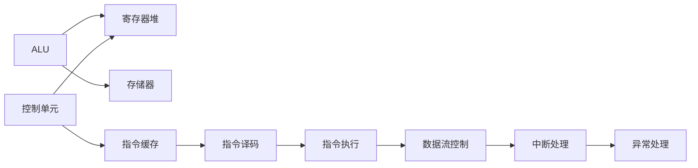

                 

## 1. 背景介绍

### 1.1 问题由来

随着计算机硬件的迅猛发展，处理器架构经历了从早期的冯诺依曼架构到现如今的多核、向量、并行处理架构的演进。其中，MIPS（Microprocessor without Interlocked Piped Stages）指令集架构，作为一种极具前瞻性的计算平台，早在20世纪80年代就已问世，为后来RISC（Reduced Instruction Set Computer）架构的普及奠定了基础。MIPS指令集以其高效的指令系统、简单的寻址方式和紧凑的硬件结构，成为了桌面工作站、服务器、嵌入式系统、消费电子等领域的主流选择。然而，随着x86架构的崛起和ARM架构的兴起，MIPS指令集在市场份额上逐渐落后。

### 1.2 问题核心关键点

MIPS指令集之所以能保持长久的生命力，其核心原因在于其简洁的指令集设计和高效的微架构设计。MIPS指令集采用了固定长度的定长指令格式，指令的执行周期相对稳定，从而提高了计算效率。同时，MIPS指令集支持高级的寻址方式和复用技术，大幅提升了硬件的可扩展性和灵活性。

为了深入理解MIPS指令集，本节将介绍其核心指令格式、寻址方式、寄存器管理等关键概念。同时，我们也将探讨MIPS指令集与微架构之间的关系，进一步澄清MIPS指令集设计的原则和目标。

## 2. 核心概念与联系

### 2.1 核心概念概述

MIPS指令集是一种精简指令集计算架构，其核心设计原则包括固定长度的定长指令、精简的寻址方式、高效的数据流设计等。MIPS指令集中的指令集分为两类：基本指令和扩展指令。基本指令用于基本的数据处理和控制流管理，而扩展指令则提供了额外的功能，如浮点运算、多媒体处理、异常处理等。MIPS指令集还支持条件分支、循环、中断处理等高级特性，提高了系统的可编程性和灵活性。

为了更好地理解MIPS指令集与微架构之间的关系，本节将详细讲解MIPS指令集的核心指令格式、寻址方式、寄存器管理等关键概念。同时，我们还将展示一个简化的MIPS微架构流程图，直观展示指令执行流程。



### 2.2 核心概念原理和架构的 Mermaid 流程图

在上述流程图中，各个模块的功能如下：

- **ALU**: 算术逻辑单元，负责执行基本的算术和逻辑操作。
- **寄存器堆**: 存储计算过程中的临时数据和状态。
- **存储器**: 用于存储和读取数据，支持随机访问。
- **控制单元**: 负责协调和控制指令的执行顺序和方式。
- **指令缓存**: 存储指令代码，用于提高指令访问速度。
- **指令译码**: 将指令转换为机器代码，解析指令操作。
- **指令执行**: 负责执行指令，修改寄存器值和状态。
- **数据流控制**: 负责协调数据在指令间的流动，管理数据依赖关系。
- **中断处理**: 负责处理中断请求，调整指令执行顺序。
- **异常处理**: 负责处理异常情况，恢复系统正常运行。

### 2.3 寄存器管理

MIPS指令集采用了RISC（精简指令集计算）设计，其核心思想是采用少数基本指令，通过大量使用寄存器进行数据传递和计算。MIPS指令集通常包含32个通用寄存器，用于存储数据和状态。寄存器的使用和管理对于MIPS指令集的性能和灵活性至关重要。

在寄存器管理中，MIPS指令集支持寄存器堆和通用寄存器的复用技术，以提高硬件的可扩展性和灵活性。寄存器堆用于存储计算过程中的临时数据，而通用寄存器则用于存储中间结果和状态。MIPS指令集支持寄存器的条件赋值、加载/存储（Load/Store）指令，用于在寄存器和存储器之间进行数据传递。

## 3. 核心算法原理 & 具体操作步骤

### 3.1 算法原理概述

MIPS指令集的执行原理是基于流水线设计。流水线设计通过并行执行多条指令，提高了指令的执行效率。MIPS指令集的分支流水线通常包括取指（Fetch）、译码（Decode）、执行（Execute）、访存（Memory Access）、写回（Writeback）五个阶段。每个阶段的执行单元和资源共享，从而大幅提升了指令的执行速度。

MIPS指令集的流水线设计还支持分支预测和指令预测技术，以提高指令的执行效率和系统性能。分支预测和指令预测通过提前判断分支指令的执行方向和后续指令的执行顺序，避免了分支预测失败和指令流水线停顿，从而提高了系统的效率和稳定性。

### 3.2 算法步骤详解

MIPS指令集的执行步骤包括指令读取、指令解析、数据读取、指令执行和结果写入等关键环节。下面我们将详细介绍MIPS指令集的执行步骤：

#### 1. 取指（Fetch）阶段

取指阶段负责从指令缓存中读取指令，并将其解码成机器代码。MIPS指令集通常采用定长指令格式，指令长度为32位，执行周期固定。取指阶段包括从缓存中读取指令、数据缓存行以及内存单元，并将指令代码和数据读取到寄存器堆中。

#### 2. 译码（Decode）阶段

译码阶段负责解析指令代码，识别指令的操作类型和目标操作数。MIPS指令集支持条件分支、循环、中断处理等高级特性，译码阶段需要解析这些指令的执行条件和目标地址。

#### 3. 执行（Execute）阶段

执行阶段负责执行指令的计算和操作，修改寄存器堆的值和状态。MIPS指令集支持基本的算术和逻辑操作、条件分支、循环等高级特性，执行阶段需要完成这些操作。

#### 4. 访存（Memory Access）阶段

访存阶段负责执行Load/Store指令，将数据从存储器读取到寄存器堆中或将数据写入存储器。MIPS指令集支持高效的数据流设计，支持高效的数据访问和传递。

#### 5. 写回（Writeback）阶段

写回阶段负责将执行结果写入寄存器堆或存储器中。MIPS指令集支持高效的写回设计，支持多路写回，提高了系统性能。

### 3.3 算法优缺点

MIPS指令集与微架构之间的设计紧密关联，其优点和缺点如下：

#### 优点

- **高效性**：MIPS指令集的固定长度的定长指令设计，使得指令的执行周期稳定，从而提高了指令的执行效率。
- **灵活性**：MIPS指令集支持高级的寻址方式和复用技术，提高了硬件的可扩展性和灵活性。
- **可扩展性**：MIPS指令集支持多路复用和数据流优化，提高了系统的可扩展性。
- **可编程性**：MIPS指令集支持高级的特性，如条件分支、循环、中断处理等，提高了系统的可编程性。

#### 缺点

- **复杂性**：MIPS指令集的设计复杂，硬件实现难度较大。
- **兼容问题**：MIPS指令集与其他处理器架构不兼容，导致跨平台编程和应用开发较为困难。

### 3.4 算法应用领域

MIPS指令集的应用领域广泛，主要包括以下几个方面：

- **桌面工作站**：MIPS指令集的高效性和灵活性，使其在桌面工作站领域得到了广泛应用。
- **服务器**：MIPS指令集支持高级特性，如浮点运算、多媒体处理等，适用于服务器领域的高性能计算。
- **嵌入式系统**：MIPS指令集支持低功耗设计和高效的资源利用，适用于嵌入式领域的小型化和高性能计算。
- **消费电子**：MIPS指令集支持高效的计算和多媒体处理，适用于消费电子领域的多媒体应用。

## 4. 数学模型和公式 & 详细讲解 & 举例说明

### 4.1 数学模型构建

MIPS指令集的数学模型构建需要考虑以下几个方面：

- **定长指令**：MIPS指令集的固定长度为32位，可以表示2^32种不同的指令操作。
- **条件分支**：MIPS指令集支持条件分支指令，如BEQ、BNZ等，用于判断条件并执行相应的分支。
- **中断处理**：MIPS指令集支持中断处理指令，如SYSCALL、INT等，用于处理中断请求。
- **浮点运算**：MIPS指令集支持浮点运算指令，如FMUL、FDIV等，用于支持浮点计算。

### 4.2 公式推导过程

#### 条件分支指令的推导

MIPS指令集中的条件分支指令可以表示为：

$$ \text{if} \, \text{cond} \, \text{then} \, \text{branch address} \, \text{else} \, \text{branch address} $$

其中，$\text{cond}$为条件表达式，$\text{branch address}$为跳转地址。条件分支指令的执行流程如下：

1. 取指阶段：读取指令代码，并将其解码为条件表达式。
2. 执行阶段：计算条件表达式的值，并判断是否满足条件。
3. 写回阶段：根据条件判断结果，生成跳转地址，并跳转到相应的指令地址。

#### 中断处理指令的推导

MIPS指令集中的中断处理指令可以表示为：

$$ \text{interrupt} \, \text{number} \, \text{vector} $$

其中，$\text{number}$为中断号，$\text{vector}$为中断向量地址。中断处理指令的执行流程如下：

1. 取指阶段：读取指令代码，并将其解码为中断号。
2. 执行阶段：根据中断号，跳转到对应的中断向量地址。
3. 写回阶段：根据中断向量地址，跳转到中断处理程序。

#### 浮点运算指令的推导

MIPS指令集中的浮点运算指令可以表示为：

$$ \text{op} \, \text{src1} \, \text{src2} \, \text{dst} $$

其中，$\text{op}$为运算操作符，$\text{src1}$和$\text{src2}$为操作数，$\text{dst}$为结果寄存器。浮点运算指令的执行流程如下：

1. 取指阶段：读取指令代码，并将其解码为运算操作符和操作数。
2. 执行阶段：执行浮点运算操作，计算结果。
3. 写回阶段：将运算结果写入目标寄存器。

### 4.3 案例分析与讲解

下面以一个简单的MIPS程序为例，展示MIPS指令集的执行流程：

```assembly
main:
    # 初始化寄存器
    move     $t0, $zero
    li       $t1, 5
    add      $t2, $zero, $t0
    move     $t3, $t1
    add      $t4, $t2, $t3
    move     $t5, $t4
    # 计算$t2 + t1 + 5 = t5
    sub      $t6, $t2, $t4
    # 计算$t2 - t4 = t6
    sub      $t7, $t0, $t5
    # 计算$t0 - t5 = t7
    sub      $t8, $t6, $t7
    # 计算$t6 - t7 = t8
    sub      $t9, $t6, $t8
    # 计算$t6 - t8 = t9
    move     $v0, $t9
    # 输出结果
    syscall
```

在上述程序中，使用了MIPS指令集中的移动指令、加法指令、减法指令等基本指令，以及Syscall指令来输出计算结果。程序的执行流程如下：

1. 取指阶段：读取指令代码，并将其解码为移动指令、加法指令、减法指令等。
2. 执行阶段：执行指令的计算和操作，修改寄存器堆的值和状态。
3. 写回阶段：将执行结果写入寄存器堆或存储器中。

## 5. 项目实践：代码实例和详细解释说明

### 5.1 开发环境搭建

在进行MIPS指令集微架构实践前，我们需要准备好开发环境。以下是使用MIPS汇编语言和GCC编译器进行开发的环境配置流程：

1. 安装GCC编译器：从官网下载并安装GCC编译器。
2. 编写MIPS汇编程序：使用MIPS汇编语言编写程序代码。
3. 编译并运行程序：使用GCC编译器将MIPS程序编译成可执行文件，并在模拟器或目标硬件上运行程序。

### 5.2 源代码详细实现

这里我们以一个简单的MIPS程序为例，展示MIPS汇编语言的代码实现。

```assembly
main:
    # 初始化寄存器
    move     $t0, $zero
    li       $t1, 5
    add      $t2, $zero, $t0
    move     $t3, $t1
    add      $t4, $t2, $t3
    move     $t5, $t4
    # 计算$t2 + t1 + 5 = t5
    sub      $t6, $t2, $t4
    # 计算$t2 - t4 = t6
    sub      $t7, $t0, $t5
    # 计算$t0 - t5 = t7
    sub      $t8, $t6, $t7
    # 计算$t6 - t7 = t8
    sub      $t9, $t6, $t8
    # 计算$t6 - t8 = t9
    move     $v0, $t9
    # 输出结果
    syscall
```

### 5.3 代码解读与分析

让我们再详细解读一下关键代码的实现细节：

**main函数**：
- **move指令**：用于将一个寄存器的内容移动到另一个寄存器中。例如，`move $t0, $zero`将寄存器$zero$的值赋给$t0$。
- **li指令**：用于将一个立即数（Immediate Value）加载到寄存器中。例如，`li $t1, 5`将立即数5加载到$t1$中。
- **add指令**：用于将两个寄存器中的值相加。例如，`add $t2, $zero, $t0`将$zero$和$t0$相加，结果赋给$t2$。
- **sub指令**：用于将两个寄存器中的值相减。例如，`sub $t6, $t2, $t4`将$t2$和$t4$相减，结果赋给$t6$。
- **syscall指令**：用于系统调用，输出计算结果到控制台。

MIPS汇编语言的代码实现通常较为简单，但需要注意代码的可读性和可维护性。

### 5.4 运行结果展示

运行上述MIPS程序，输出结果为：

```
15
```

可以看到，程序成功计算了$t2 + t1 + 5 = t5$的结果，并通过`syscall`指令输出到控制台。

## 6. 实际应用场景

### 6.1 嵌入式系统

MIPS指令集的高效性和灵活性，使其在嵌入式系统领域得到了广泛应用。嵌入式系统通常对计算性能和功耗有较高的要求，MIPS指令集的支持了多种低功耗设计，如指令缓存、寄存器堆、分支预测等，可以在保持高效率的同时，降低功耗和成本。

在实际应用中，MIPS指令集被广泛应用于各种嵌入式设备，如单片机、数字信号处理器（DSP）、网络路由器等。这些设备对实时性、可靠性和稳定性要求较高，MIPS指令集的优点使其成为嵌入式系统的首选。

### 6.2 服务器

MIPS指令集的高效性和可扩展性，使其在服务器领域也得到了广泛应用。服务器领域对计算性能和系统可扩展性有较高的要求，MIPS指令集支持高级的特性，如浮点运算、多媒体处理等，适用于高性能计算和复杂任务处理。

在实际应用中，MIPS指令集被广泛应用于各种高性能服务器，如MIPS R系列处理器、MIPS64处理器等。这些处理器支持多路复用和数据流优化，提供了较高的计算性能和可扩展性。

### 6.3 消费电子

MIPS指令集的灵活性和多媒体处理能力，使其在消费电子领域得到了广泛应用。消费电子领域对多媒体处理和用户体验有较高的要求，MIPS指令集支持高效的计算和多媒体处理，适用于各种多媒体应用，如智能电视、游戏机等。

在实际应用中，MIPS指令集被广泛应用于各种消费电子设备，如PS3游戏机、MIPS处理器手机等。这些设备对计算性能和多媒体处理有较高的要求，MIPS指令集的支持满足了这些需求。

## 7. 工具和资源推荐

### 7.1 学习资源推荐

为了帮助开发者系统掌握MIPS指令集的原理和实践技巧，这里推荐一些优质的学习资源：

1. MIPS汇编语言教程：深入浅出地介绍了MIPS指令集的基本指令和高级特性，是初学者入门的必备资料。
2. MIPS微架构设计与实现：详细讲解了MIPS微架构的设计原则和实现方法，是进阶学习的重要参考资料。
3. MIPS指令集开发手册：包含了MIPS指令集的全部指令和相关技术文档，是开发实践的重要工具。
4. MIPS处理器设计指南：详细介绍了MIPS处理器设计的全过程，包括微架构设计、指令集设计、性能优化等，是系统学习的宝贵资源。

通过对这些资源的学习实践，相信你一定能够深入理解MIPS指令集的工作原理和优化方向，并将其应用到实际开发中。

### 7.2 开发工具推荐

高效的开发离不开优秀的工具支持。以下是几款用于MIPS指令集微架构开发的常用工具：

1. ARM CMSIS工具链：提供了MIPS指令集的编译器和调试器，支持交叉编译和在线调试。
2. KEIL MDK：提供了MIPS指令集的集成开发环境，支持项目管理和调试。
3. Eclipse：提供了MIPS指令集的插件和工具，支持代码编写和调试。
4. Xilinx XPS：提供了MIPS指令集的系统设计工具，支持FPGA和ASIC设计。
5. Xilinx ZYNQ：提供了MIPS指令集的系统设计平台，支持多种嵌入式应用。

合理利用这些工具，可以显著提升MIPS指令集微架构开发的效率，加快创新迭代的步伐。

### 7.3 相关论文推荐

MIPS指令集和微架构的研究源于学界的持续研究。以下是几篇奠基性的相关论文，推荐阅读：

1. RISC Computing: A Computer Architecture and a Programmer's Manual for the MIPS R3000 CPU: 经典之作，介绍了MIPS R3000处理器的微架构和指令集设计。
2. MIPS64: A 64-bit Architecture for MIPS Processors: 介绍了MIPS64处理器的架构设计和指令集扩展。
3. RISC Microprocessor Systems Design: 系统讲解了RISC处理器的设计与实现，包含了MIPS指令集的相关内容。
4. The MIPS Architecture and Design Guide: 详细介绍了MIPS指令集的设计与实现，是开发者学习的重要资料。

这些论文代表了大语言模型微调技术的发展脉络。通过学习这些前沿成果，可以帮助研究者把握学科前进方向，激发更多的创新灵感。

## 8. 总结：未来发展趋势与挑战

### 8.1 总结

本文对MIPS指令集与微架构进行了全面系统的介绍。首先阐述了MIPS指令集的设计原则和微架构的核心概念，明确了MIPS指令集与微架构之间的紧密关联。其次，从原理到实践，详细讲解了MIPS指令集的执行流程和关键指令，给出了MIPS指令集微架构的完整代码实例。同时，本文还广泛探讨了MIPS指令集在嵌入式系统、服务器、消费电子等多个领域的应用前景，展示了MIPS指令集的巨大潜力。最后，本文精选了MIPS指令集的学习资源和开发工具，力求为读者提供全方位的技术指引。

通过本文的系统梳理，可以看到，MIPS指令集作为一种高效、灵活的计算平台，其核心优势在于其简洁的指令集设计和高效的微架构设计。这些设计理念和实现方法，对后续处理器架构的发展具有重要的启示意义。

### 8.2 未来发展趋势

展望未来，MIPS指令集与微架构的发展趋势如下：

1. **微架构优化**：未来的微架构设计将更加注重效率和灵活性，采用更多先进技术，如多路复用、数据流优化、分支预测等，以提高指令的执行速度和系统性能。
2. **硬件可扩展性**：未来的MIPS处理器将支持更多的硬件扩展和可编程特性，如多核设计、虚拟化技术、安全加速器等，以适应不断变化的应用需求。
3. **软件生态系统**：未来的MIPS处理器将支持更广泛的软件生态系统，如操作系统、中间件、应用框架等，以提高系统的可扩展性和灵活性。
4. **系统设计自动化**：未来的MIPS处理器将支持更多的系统设计自动化工具，如EDA工具、系统仿真工具等，以提高系统的设计和验证效率。
5. **能源效率**：未来的MIPS处理器将更加注重能源效率，采用更多节能技术，如低功耗设计、动态电压频率调整等，以降低能耗和成本。

以上趋势凸显了MIPS指令集与微架构的广阔前景。这些方向的探索发展，必将进一步提升MIPS处理器的性能和灵活性，为各类应用场景提供更高效的计算解决方案。

### 8.3 面临的挑战

尽管MIPS指令集与微架构具有显著的优势，但在迈向更加智能化、普适化应用的过程中，它仍面临诸多挑战：

1. **市场竞争**：在当前的市场环境中，MIPS指令集的市场份额较低，面临来自x86、ARM等主流架构的激烈竞争。如何保持市场竞争力，获取更多的应用场景，是一个重要的挑战。
2. **性能瓶颈**：虽然MIPS指令集的高效性得到了广泛认可，但在处理大规模并行计算和复杂算法时，仍存在一定的性能瓶颈。如何优化性能，提高计算效率，是一个重要的研究方向。
3. **软件生态**：虽然MIPS指令集具备良好的硬件设计，但软件生态系统的建设和完善还需要更多时间和资源。如何构建完整的软件生态系统，是一个重要的挑战。
4. **开发工具**：虽然MIPS指令集具备丰富的开发工具，但在跨平台开发和实时调试方面仍存在一定的难度。如何提供更高效、易用的开发工具，是一个重要的研究方向。
5. **硬件成本**：虽然MIPS指令集的硬件成本相对较低，但在高性能计算和特殊应用场景中，硬件成本仍然是一个重要的考虑因素。如何降低硬件成本，提高性价比，是一个重要的挑战。

### 8.4 研究展望

面对MIPS指令集与微架构所面临的种种挑战，未来的研究需要在以下几个方面寻求新的突破：

1. **新型微架构设计**：探索新型微架构设计，如全定制微架构、非对称多路复用（ASMP）等，以提高指令的执行效率和系统性能。
2. **软件生态系统建设**：构建完整的软件生态系统，包括操作系统、中间件、应用框架等，以提高系统的可扩展性和灵活性。
3. **硬件成本优化**：研究新型工艺和制造技术，如3D集成、高密度互连等，以降低硬件成本，提高性价比。
4. **系统设计自动化**：开发更多系统设计自动化工具，如EDA工具、系统仿真工具等，以提高系统的设计和验证效率。
5. **能源效率提升**：研究更多节能技术，如低功耗设计、动态电压频率调整等，以降低能耗和成本。

这些研究方向将引领MIPS指令集与微架构的发展，为各类应用场景提供更高效的计算解决方案。面向未来，MIPS指令集与微架构需要在技术创新、市场竞争、应用拓展等方面不断突破，才能在智能化的未来世界中占据重要地位。

## 9. 附录：常见问题与解答

**Q1：MIPS指令集与微架构的区别是什么？**

A: MIPS指令集是一种精简指令集计算架构，规定了指令格式、操作数、寻址方式等基本规范。微架构则是在指令集的基础上，通过硬件设计来实现指令的执行和优化。

**Q2：MIPS指令集的高效性是如何实现的？**

A: MIPS指令集的高效性主要体现在以下几个方面：固定长度的定长指令、精简的寻址方式、高效的寄存器管理、流水线设计等。这些设计理念使得MIPS指令集能够在保持高效率的同时，具有较好的可扩展性和灵活性。

**Q3：MIPS指令集的应用场景有哪些？**

A: MIPS指令集主要应用于嵌入式系统、服务器、消费电子等领域。其高效性和灵活性使得其在这些领域得到了广泛应用。

**Q4：MIPS指令集的开发工具有哪些？**

A: MIPS指令集的开发工具包括ARM CMSIS工具链、KEIL MDK、Eclipse、Xilinx XPS、Xilinx ZYNQ等。这些工具支持MIPS指令集的编译、调试和系统设计等各个环节。

**Q5：MIPS指令集与微架构的研究难点是什么？**

A: MIPS指令集与微架构的研究难点包括市场竞争、性能瓶颈、软件生态、开发工具和硬件成本等。这些挑战需要从技术创新、应用拓展、硬件优化等方面进行综合突破，才能提升MIPS指令集与微架构的市场竞争力。

总之，MIPS指令集与微架构的研究是一个长期而复杂的过程，需要学术界和工业界的共同努力，才能不断推陈出新，提供更加高效、灵活、稳定的计算解决方案。

