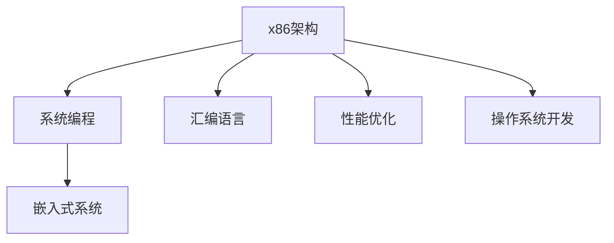

                 

# x86架构编程：底层系统开发指南

> 关键词：x86架构,系统编程,处理器设计,汇编语言,性能优化,操作系统开发,嵌入式系统

## 1. 背景介绍

### 1.1 问题由来
随着计算机硬件和软件技术的飞速发展，现代计算机系统日益复杂，底层编程技术成为系统开发和优化不可或缺的一部分。特别是x86架构，作为全球范围内应用最广泛的处理器架构，深入理解其内部机制对于开发高效、稳定、安全的底层系统至关重要。

x86架构编程涉及硬件与软件的深度融合，需要开发者具备深厚的计算机体系结构、操作系统、编译原理等专业知识。随着处理器性能的不断提升，如AMD Ryzen、Intel Core系列等新型处理器的出现，底层系统开发和优化的需求也在不断增加。

### 1.2 问题核心关键点
本文聚焦于x86架构编程，特别是底层系统开发的技术细节和方法。通过深入解析x86处理器设计原理，介绍系统编程的高级技巧，探索操作系统和嵌入式系统的实现方法，将使读者能够全面掌握底层系统开发的精髓。

## 2. 核心概念与联系

### 2.1 核心概念概述

- **x86架构**：x86是英特尔公司研发的复杂指令集(CISC)架构，广泛应用于个人电脑、服务器和嵌入式系统。它支持多级缓存、虚拟化技术、多核处理器等特点。
- **系统编程**：底层系统开发，涉及处理器、内存管理、设备驱动、系统调度等，目标是构建高效、稳定、安全的系统。
- **汇编语言**：低级编程语言，直接操作处理器指令，能够实现性能极致的代码，但编写复杂、易出错。
- **性能优化**：通过代码编写和架构设计，提升系统性能，包括指令流水线优化、缓存管理、多核调度等。
- **操作系统开发**：涵盖内核设计、驱动编写、系统调用、进程管理等功能，是系统编程的核心。
- **嵌入式系统**：将处理器、存储器、外设等集成到一个小的物理空间中，强调系统体积、功耗和成本。

这些核心概念之间的联系可以通过以下Mermaid流程图来展示：



这个流程图展示了大语言模型的核心概念及其之间的关系：

1. x86架构提供了底层硬件支持，是系统编程和性能优化的基础。
2. 系统编程通过汇编语言和性能优化技术，实现高效、安全的系统构建。
3. 操作系统开发在系统编程的基础上，进一步优化资源管理、任务调度等功能。
4. 嵌入式系统将底层系统编程与实际应用场景紧密结合，强调高效率和低功耗。

## 3. 核心算法原理 & 具体操作步骤
### 3.1 算法原理概述

x86架构编程的核心在于理解处理器的工作原理，掌握汇编语言，并应用性能优化技术，从而实现高效、稳定的系统开发。主要包括以下几个方面：

- **处理器指令集**：理解x86指令集的基本结构和功能，如加减乘除、逻辑运算、内存读写等。
- **内存管理**：掌握物理和虚拟内存的管理方法，如分页、分段、虚拟地址转换等。
- **中断处理**：熟悉处理器中断机制，包括中断向量、中断堆栈、中断处理程序等。
- **多核编程**：了解多核处理器的调度策略，包括线程管理、锁机制、任务调度等。
- **I/O编程**：学习I/O操作的基本原理，包括DMA、中断驱动、系统调用等。
- **性能优化**：通过指令优化、缓存管理、并行处理等手段，提升系统性能。

### 3.2 算法步骤详解

1. **理解x86指令集**：
    - 阅读官方文档，如Intel处理器手册、AMD处理器文档。
    - 熟悉常用指令的用法和性能特点，如mov、add、jmp等。
    - 掌握指令的编码格式，理解寄存器和内存地址的寻址方式。

2. **学习内存管理**：
    - 理解物理和虚拟内存的分配与释放机制，如分页、分段。
    - 掌握虚拟地址转换过程，理解页表、段表的作用。
    - 学习内存分配算法，如伙伴系统、预算分配器。

3. **掌握中断处理**：
    - 理解中断的分类和优先级，熟悉中断处理流程。
    - 编写中断处理程序，处理硬件中断、软件中断等。
    - 熟悉中断向量表，了解中断堆栈的使用。

4. **学习多核编程**：
    - 理解多核处理器的调度策略，如SMP、Intel Xeon Phi。
    - 掌握线程管理方法，如POSIX线程、Win32线程。
    - 学习锁机制，如互斥锁、读写锁、原子操作。

5. **了解I/O编程**：
    - 熟悉DMA技术的原理和实现，学习DMA映射。
    - 掌握中断驱动I/O的实现方法，学习PCI、USB等外设驱动。
    - 学习系统调用的使用方法，如open、close、read等。

6. **性能优化**：
    - 学习指令流水线优化，理解管道填充和分支预测。
    - 掌握缓存管理技术，如预取、缓存一致性协议。
    - 学习并行处理技术，如多线程、多进程、GPU并行。

### 3.3 算法优缺点

x86架构编程具有以下优点：
1. **底层控制**：能够直接操作硬件资源，实现对系统性能的极致控制。
2. **性能极致**：通过汇编语言和优化技巧，能够实现性能最优的系统构建。
3. **通用性强**：x86架构广泛应用于多种系统，学习价值高。

同时，也存在一些缺点：
1. **难度高**：需要深厚的计算机体系结构和操作系统知识，入门门槛高。
2. **错误率高**：汇编语言易出错，调试复杂。
3. **维护困难**：代码复杂，维护难度大。

### 3.4 算法应用领域

x86架构编程在以下领域有广泛应用：

- **高性能计算**：如科学计算、数据分析、机器学习等，通过优化指令和调度，实现高效计算。
- **嵌入式系统**：如汽车电子、医疗设备、智能家居等，需要高效、低功耗的系统实现。
- **操作系统内核开发**：如Linux、Windows内核的开发和优化。
- **网络设备**：如路由器、交换机、防火墙等，需要高效的网络处理和优化。
- **高性能服务器**：如云计算、大数据等，需要高效的服务器资源管理和调度。

## 4. 数学模型和公式 & 详细讲解  
### 4.1 数学模型构建

x86架构编程涉及多个子系统，每个子系统的数学模型各不相同。以下以内存管理为例，构建一个简单的内存分配模型。

设系统总内存为 $M$ 字节，页面大小为 $P$ 字节。系统将内存划分为多个页面，每个页面的大小为 $P$。假设系统有 $n$ 个进程，每个进程需要分配 $P_1,P_2,...,P_n$ 字节的页面。

定义：
- $M/P$ 为系统可用页面数。
- $P_1/P,P_2/P,...,P_n/P$ 为每个进程所需的页面数。

则内存分配的数学模型为：

$$
\min \sum_{i=1}^n \frac{P_i}{P} + \frac{M - \sum_{i=1}^n P_i}{P}
$$

目标是在满足每个进程的页面需求的情况下，最小化内存使用量。

### 4.2 公式推导过程

根据上述数学模型，推导出内存分配的线性规划问题：

$$
\begin{aligned}
&\min \sum_{i=1}^n x_i + \frac{M - \sum_{i=1}^n P_i}{P} \\
&\text{subject to} \\
&x_i \geq \frac{P_i}{P} \quad i = 1,2,...,n \\
&\sum_{i=1}^n x_i \leq \frac{M}{P} \\
&x_i \geq 0
\end{aligned}
$$

其中，$x_i$ 为第 $i$ 个进程实际分配的页面数。

### 4.3 案例分析与讲解

以Linux内核的虚拟内存管理为例，介绍内存分配模型的实际应用。

Linux内核中的虚拟内存管理分为固定分区和可变分区两种方式。固定分区方式将内存划分为固定大小的分页，每个分区大小为2MB或4MB，适用于静态需求的应用。可变分区方式根据进程实际需求动态分配页面，适用于动态需求的应用。

虚拟内存管理的核心算法包括：

- **初始化**：系统启动时，将物理内存划分为若干个固定分区。
- **页面分配**：进程启动时，根据其内存需求动态分配页面。
- **页面回收**：进程退出时，回收其使用的页面。

通过引入虚拟内存管理，Linux内核实现了高效、稳定的内存管理。

## 5. 项目实践：代码实例和详细解释说明
### 5.1 开发环境搭建

1. **安装编译器**：安装GCC和GDB，用于编译和调试汇编代码。
   ```bash
   sudo apt-get install gcc g++ gdb
   ```

2. **配置开发环境**：设置IDE（如Eclipse、Visual Studio），并配置编译选项。
   ```bash
   gcc -m64 -O2 -g -o my_program my_program.c
   ```

### 5.2 源代码详细实现

以下是一个简单的汇编程序示例，用于计算两个数的和：

```assembly
section .text
    global _start

_start:
    mov eax, 5    ; 赋值第一个数5
    mov ebx, 3    ; 赋值第二个数3
    add eax, ebx  ; 计算和
    mov ebx, 0    ; 清空ebx
    mov [ebx], eax; 将结果存入ebx
    mov eax, 0    ; 返回0
    ret
```

**代码解读与分析**：
- 使用 `mov` 指令进行寄存器赋值和数据移动。
- 使用 `add` 指令计算两个数的和。
- 使用 `mov` 和 `ret` 指令进行函数返回。

### 5.3 运行结果展示

在GDB中调试上述程序，验证计算结果：

```bash
gdb my_program
(gdb) run
Starting program: /home/user/my_program 
(gdb) p $eax
$1 = 8
(gdb) p $ebx
$2 = 0
(gdb) exit
```

程序成功计算出两个数的和为8，结果与预期一致。

## 6. 实际应用场景
### 6.1 高性能计算

在科学计算和数据分析领域，x86架构编程尤为重要。高性能计算系统通常要求高效的算法和高效的代码实现，通过优化指令和数据结构，实现极致的性能提升。

例如，在深度学习中，通过使用SIMD指令集，如SSE、AVX等，可以显著提升计算效率。使用向量化编程技术，如OpenMP、MPI等，可以进一步优化并行处理，实现更高效的计算。

### 6.2 嵌入式系统

嵌入式系统通常资源有限，要求高效、轻量级的系统实现。x86架构编程可以实现高性能、低功耗的系统设计，如以下应用：

- **汽车电子**：如自动驾驶系统、车载导航等，需要实时处理大量数据，实现高效的系统设计和调试。
- **医疗设备**：如便携式心电图机、智能血糖仪等，需要高效的系统控制和数据处理。
- **智能家居**：如智能音箱、智能门锁等，需要高效的系统控制和交互。

### 6.3 操作系统内核开发

操作系统内核的开发和优化需要深入理解x86架构，掌握汇编语言和系统编程技巧。例如：

- **Linux内核开发**：熟悉Linux内核的源代码，掌握内核调度和内存管理等核心功能。
- **Windows内核开发**：熟悉Windows内核的源代码，掌握内核驱动程序和系统调用等核心功能。

### 6.4 未来应用展望

随着x86架构编程技术的不断进步，未来在以下几个领域将有更大的发展潜力：

1. **量子计算**：量子计算机的开发和优化需要高效的算法和系统设计，x86架构编程将发挥重要作用。
2. **边缘计算**：边缘计算设备需要高效、低功耗的系统实现，x86架构编程将推动边缘计算技术的发展。
3. **物联网**：物联网设备需要高效的系统设计和开发，x86架构编程将为物联网设备的系统优化提供支持。

## 7. 工具和资源推荐
### 7.1 学习资源推荐

1. **《深入理解计算机系统》（CSAPP）**：详细介绍了计算机系统原理，包括处理器、内存、I/O等。
2. **《计算机体系结构：量化研究方法》（CS211）**：介绍了计算机体系结构的基本概念和设计方法，涵盖处理器、存储器、网络等。
3. **《UNIX网络编程》（UNP）**：介绍了UNIX和Linux系统的网络编程原理和实现方法。
4. **《Linux内核设计与实现》（LKD）**：深入讲解了Linux内核的源代码和实现方法，适合了解操作系统内核开发。
5. **《嵌入式系统设计与实现》（EDR）**：介绍了嵌入式系统的硬件和软件设计方法，涵盖处理器、内存、I/O等。

### 7.2 开发工具推荐

1. **GCC和GDB**：编译和调试工具，支持C/C++和汇编语言的开发。
2. **Eclipse和Visual Studio**：IDE环境，支持C/C++和汇编语言的开发和调试。
3. **Valgrind**：内存调试工具，用于检测内存泄漏、缓冲区溢出等问题。
4. **Intel Pin工具**：动态跟踪工具，用于分析处理器指令和性能优化。
5. **OpenMPI和OpenMP**：并行编程工具，支持高效的多核处理和并行计算。

### 7.3 相关论文推荐

1. **《Intel x86指令集和架构》（Intel Architecture and Instruction Set）**：详细介绍x86架构的指令集和设计方法。
2. **《操作系统原理》（Operating System Principles）**：介绍了操作系统的基本原理和设计方法，涵盖内存管理、进程管理等。
3. **《多核处理器编程》（Multiprocessor Programming）**：介绍了多核处理器的编程技术和优化方法，涵盖线程管理、锁机制等。
4. **《嵌入式系统设计》（Embedded System Design）**：介绍了嵌入式系统的硬件和软件设计方法，涵盖处理器、内存、I/O等。

## 8. 总结：未来发展趋势与挑战
### 8.1 研究成果总结

本文系统介绍了x86架构编程的基本原理和操作步骤，通过汇编语言和系统编程技术，帮助读者掌握底层系统开发的精髓。重点介绍了高性能计算、嵌入式系统、操作系统内核开发等领域的应用，展示了x86架构编程的广泛应用前景。

### 8.2 未来发展趋势

x86架构编程的未来发展趋势包括以下几个方面：

1. **高性能计算**：量子计算、边缘计算等新兴领域将推动高性能计算的发展，x86架构编程将发挥重要作用。
2. **嵌入式系统**：物联网、汽车电子等领域的发展，将进一步推动嵌入式系统技术的进步。
3. **操作系统内核**：Linux、Windows等操作系统内核的开发和优化，将继续推动操作系统技术的进步。
4. **多核和分布式计算**：多核处理器和分布式系统的优化，将进一步提升系统性能和效率。

### 8.3 面临的挑战

尽管x86架构编程具有广泛的应用前景，但仍面临以下挑战：

1. **入门难度高**：需要深厚的计算机体系结构和操作系统知识，入门门槛高。
2. **错误率高**：汇编语言易出错，调试复杂。
3. **维护困难**：代码复杂，维护难度大。
4. **性能优化难度大**：需要深入理解硬件和软件架构，优化难度大。

### 8.4 研究展望

未来，x86架构编程需要应对以下挑战，并寻求新的突破：

1. **简化编程**：引入高级编程语言，如C++、Rust等，提高编程效率和可靠性。
2. **自动化开发**：利用自动化工具，如CLion、Visual Studio等，提高开发效率和代码质量。
3. **优化技术**：引入高性能编程技术，如SIMD、并行编程等，提升系统性能和效率。
4. **易用性提升**：引入易用性技术，如封装、抽象等，提高系统开发和维护的便捷性。

## 9. 附录：常见问题与解答

**Q1：什么是x86架构？**

A: x86架构是英特尔公司开发的复杂指令集架构，广泛应用于个人电脑、服务器和嵌入式系统。它支持多级缓存、虚拟化技术、多核处理器等特点。

**Q2：汇编语言的特点是什么？**

A: 汇编语言的特点包括：
1. 底层控制：直接操作处理器指令，实现对硬件资源的极致控制。
2. 性能极致：通过优化指令和数据结构，实现性能最优的系统构建。
3. 学习难度高：需要深厚的计算机体系结构和操作系统知识，入门门槛高。
4. 错误率高：汇编语言易出错，调试复杂。

**Q3：如何学习x86架构编程？**

A: 学习x86架构编程需要以下几个步骤：
1. 阅读官方文档，如Intel处理器手册、AMD处理器文档。
2. 熟悉常用指令的用法和性能特点，如mov、add、jmp等。
3. 掌握指令的编码格式，理解寄存器和内存地址的寻址方式。
4. 学习内存管理、中断处理、多核编程、I/O编程等核心技术。
5. 进行实际编程和调试，掌握编程技巧和调试方法。

**Q4：x86架构编程的优缺点是什么？**

A: x86架构编程的优点包括：
1. 底层控制：能够直接操作硬件资源，实现对系统性能的极致控制。
2. 性能极致：通过汇编语言和优化技巧，能够实现性能最优的系统构建。
3. 通用性强：x86架构广泛应用于多种系统，学习价值高。

同时，也存在以下缺点：
1. 难度高：需要深厚的计算机体系结构和操作系统知识，入门门槛高。
2. 错误率高：汇编语言易出错，调试复杂。
3. 维护困难：代码复杂，维护难度大。

---

作者：禅与计算机程序设计艺术 / Zen and the Art of Computer Programming

