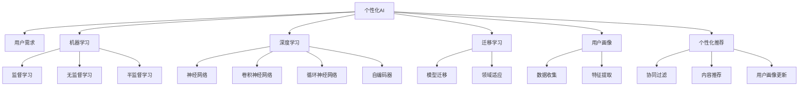

                 

# 个性化AI:满足不同用户需求的关键

> 关键词：个性化AI,用户需求,机器学习,深度学习,迁移学习

## 1. 背景介绍

### 1.1 问题由来
随着人工智能技术的快速发展，个性化AI已经成为一个热门的领域。个性化AI旨在通过了解用户的行为、偏好和需求，为其提供量身定制的服务和产品。然而，由于用户需求的多样性和动态变化，单一的AI模型难以满足所有用户的需求。因此，如何构建能够灵活适应不同用户需求的个性化AI系统，成为当前亟待解决的问题。

### 1.2 问题核心关键点
个性化AI的核心在于理解和预测用户需求，并据此提供相应的服务和建议。这包括用户偏好的识别、行为预测和个性化推荐等方面。为了实现这一目标，个性化AI通常采用数据驱动的方法，通过机器学习、深度学习、迁移学习等技术，构建能够自适应用户需求的AI模型。

### 1.3 问题研究意义
研究个性化AI对于提升用户体验、促进产品创新、降低运营成本等方面具有重要意义：

1. 提升用户体验：通过了解用户需求，个性化AI可以提供更加精准和个性化的服务，使用户感到被理解和重视。
2. 促进产品创新：个性化AI可以为产品设计提供数据支持，帮助识别市场需求和产品改进点，加速产品迭代进程。
3. 降低运营成本：通过自动化和智能化运营，个性化AI可以优化资源配置，减少人力成本，提升运营效率。

## 2. 核心概念与联系

### 2.1 核心概念概述

为更好地理解个性化AI的核心原理和应用，本节将介绍几个关键概念：

- 个性化AI（Personalized AI）：通过分析用户行为和需求，为用户提供量身定制的AI服务和建议。
- 用户需求（User Needs）：用户的个性化需求和偏好，包括搜索习惯、购买行为、兴趣爱好等。
- 机器学习（Machine Learning）：通过算法让计算机从数据中学习并提升性能的技术。
- 深度学习（Deep Learning）：一种特殊的机器学习方法，通过多层神经网络处理非线性数据。
- 迁移学习（Transfer Learning）：将一个领域学到的知识迁移到另一个相关领域，以提高在新领域中的性能。
- 用户画像（User Profiling）：通过收集和分析用户数据，构建用户模型的过程。
- 个性化推荐（Personalized Recommendation）：根据用户的历史行为和偏好，推荐个性化的内容和产品。

这些核心概念之间的逻辑关系可以通过以下Mermaid流程图来展示：



这个流程图展示了个性化AI的核心概念及其之间的关系：

1. 个性化AI通过分析用户需求，调用机器学习和深度学习技术进行模型构建。
2. 机器学习和深度学习可以采用监督学习、无监督学习、半监督学习等不同方法，构建不同类型的模型。
3. 迁移学习可以将一个领域学到的知识迁移到另一个相关领域，提升模型在新领域中的性能。
4. 用户画像通过数据收集和特征提取，构建用户模型，为个性化推荐等任务提供支持。
5. 个性化推荐通过协同过滤、内容推荐等算法，实现精准的个性化服务。

这些概念共同构成了个性化AI的学习和应用框架，使其能够灵活适应不同用户的需求，实现个性化服务。

## 3. 核心算法原理 & 具体操作步骤
### 3.1 算法原理概述

个性化AI的核心在于构建能够自适应用户需求的模型。其主要思路是通过数据驱动的方式，使用机器学习、深度学习等技术，分析用户行为和需求，并据此生成个性化推荐和服务。

### 3.2 算法步骤详解

个性化AI的构建一般包括以下几个关键步骤：

**Step 1: 数据收集与处理**
- 收集用户行为数据，如搜索历史、购买记录、社交媒体互动等。
- 对数据进行预处理，包括清洗、标准化、特征工程等。

**Step 2: 用户画像构建**
- 使用聚类、分类等机器学习方法，对用户进行分组和分类，构建用户画像。
- 对不同用户群体进行分析，识别其共同特征和差异特征。

**Step 3: 模型训练与优化**
- 选择合适的机器学习或深度学习模型，如线性回归、决策树、神经网络等。
- 使用用户画像数据进行模型训练，调整超参数以优化模型性能。

**Step 4: 个性化推荐与服务**
- 将训练好的模型应用于个性化推荐系统，根据用户画像和行为数据生成个性化推荐。
- 对推荐结果进行评估和反馈，优化模型和推荐算法。

**Step 5: 模型部署与监控**
- 将训练好的模型部署到生产环境中，通过API接口提供服务。
- 实时监控模型性能，收集用户反馈，持续优化和更新模型。

### 3.3 算法优缺点

个性化AI具有以下优点：
1. 用户导向性强。通过分析用户需求和行为，提供定制化服务，提升用户体验。
2. 灵活性高。模型可以根据不同用户需求进行定制，适应性更强。
3. 效果显著。通过个性化推荐和协同过滤等技术，显著提升推荐系统的效果。

同时，该方法也存在一些局限性：
1. 数据需求量大。需要大量的用户行为数据进行训练，数据收集和处理成本高。
2. 模型复杂度高。构建复杂的深度学习模型需要较高的计算资源和时间成本。
3. 泛化能力不足。模型对新用户的预测可能存在偏差，泛化能力有限。
4. 隐私和安全风险。用户行为数据的收集和分析可能涉及隐私问题，需要严格控制。

尽管存在这些局限性，但就目前而言，个性化AI仍是个性化推荐和服务的主流范式。未来相关研究的重点在于如何进一步降低数据需求，提高模型的泛化能力，同时兼顾隐私和安全性。

### 3.4 算法应用领域

个性化AI已经在诸多领域得到了广泛的应用，包括但不限于：

- 电子商务：根据用户购买历史和行为数据，推荐个性化的商品和优惠。
- 在线教育：根据学生的学习记录和行为数据，推荐个性化的学习资源和课程。
- 媒体娱乐：根据用户的观看历史和偏好，推荐个性化的视频、音乐和文章。
- 健康医疗：根据病人的病历和行为数据，推荐个性化的诊疗方案和治疗建议。
- 金融服务：根据用户的交易记录和行为数据，推荐个性化的金融产品和投资建议。

## 4. 数学模型和公式 & 详细讲解 & 举例说明

### 4.1 数学模型构建

本节将使用数学语言对个性化AI的构建过程进行更加严格的刻画。

记用户画像为 $P=\{p_i\}_{i=1}^N$，其中 $p_i$ 表示第 $i$ 个用户的特征向量。假设推荐系统目标为最大化用户满意度 $S$，即：

$$
\max_S \sum_{i=1}^N S(p_i)
$$

其中 $S(p_i)$ 表示用户 $i$ 的满意度函数。在实际应用中，可以根据用户行为数据（如点击次数、购买金额等）设计不同的满意度函数。

### 4.2 公式推导过程

假设满意度函数 $S(p_i)$ 可以通过以下线性模型表示：

$$
S(p_i) = w^Tp_i + b
$$

其中 $w$ 为模型的权重向量，$b$ 为截距。根据满意度函数，推荐系统可以表示为：

$$
\max_S \sum_{i=1}^N (w^Tp_i + b)
$$

为了简化问题，我们可以将其转化为线性规划问题：

$$
\min_w \sum_{i=1}^N -w^Tp_i - b
$$

使用拉格朗日乘子法，将问题转化为对偶问题：

$$
\min_{\alpha} \frac{1}{2}w^TW - \sum_{i=1}^N \alpha_i(w^Tp_i + b)
$$

其中 $W$ 为 $w$ 的协方差矩阵，$\alpha$ 为拉格朗日乘子向量。将对偶问题转化为求解：

$$
w^T = \sum_{i=1}^N \alpha_ip_i
$$

最终得到最优的权重向量 $w$，即可实现个性化推荐。

### 4.3 案例分析与讲解

假设我们有一个在线购物平台，希望通过个性化推荐提升用户满意度。我们可以收集用户的行为数据，如浏览记录、购买记录等，作为用户画像 $P$。使用线性模型对用户画像进行分析，得到用户的满意度函数 $S(p_i)$。通过最大化用户满意度函数，实现个性化推荐。

## 5. 项目实践：代码实例和详细解释说明
### 5.1 开发环境搭建

在进行个性化AI实践前，我们需要准备好开发环境。以下是使用Python进行TensorFlow开发的配置流程：

1. 安装Anaconda：从官网下载并安装Anaconda，用于创建独立的Python环境。

2. 创建并激活虚拟环境：
```bash
conda create -n tf-env python=3.8 
conda activate tf-env
```

3. 安装TensorFlow：根据CUDA版本，从官网获取对应的安装命令。例如：
```bash
conda install tensorflow-gpu=2.7 -c conda-forge -c pypi
```

4. 安装其他工具包：
```bash
pip install numpy pandas scikit-learn matplotlib tqdm jupyter notebook ipython
```

完成上述步骤后，即可在`tf-env`环境中开始个性化AI实践。

### 5.2 源代码详细实现

下面我们以个性化推荐系统为例，给出使用TensorFlow构建的PyTorch代码实现。

首先，定义推荐系统的数据处理函数：

```python
import tensorflow as tf

def preprocess_data(data):
    # 对原始数据进行清洗、标准化、特征工程等处理
    # 返回处理后的特征矩阵和标签向量
    pass
```

然后，定义模型和优化器：

```python
from tensorflow.keras.layers import Dense
from tensorflow.keras.models import Sequential

model = Sequential()
model.add(Dense(64, activation='relu', input_shape=(N,)))
model.add(Dense(1))

optimizer = tf.keras.optimizers.Adam(learning_rate=0.001)
```

接着，定义训练和评估函数：

```python
def train_model(model, train_data, validation_data, epochs):
    # 使用训练数据对模型进行训练
    # 返回训练过程中的损失函数和准确率等指标
    pass

def evaluate_model(model, test_data):
    # 使用测试数据对模型进行评估
    # 返回模型在测试集上的准确率等指标
    pass
```

最后，启动训练流程并在测试集上评估：

```python
train_data, validation_data, test_data = preprocess_data()
model.compile(optimizer=optimizer, loss='mean_squared_error', metrics=['accuracy'])
train_model(model, train_data, validation_data, epochs=10)

# 在测试集上评估模型
evaluate_model(model, test_data)
```

以上就是使用TensorFlow构建个性化推荐系统的完整代码实现。可以看到，得益于TensorFlow的强大封装，我们可以用相对简洁的代码完成模型的构建和训练。

### 5.3 代码解读与分析

让我们再详细解读一下关键代码的实现细节：

**preprocess_data函数**：
- 定义了对原始数据进行清洗、标准化、特征工程等处理的步骤，返回处理后的特征矩阵和标签向量。

**Sequential模型**：
- 构建了包含两个全连接层的神经网络模型，第一个全连接层输出64个神经元，使用ReLU激活函数，第二个全连接层输出1个神经元，用于预测用户满意度。

**train_model函数**：
- 定义了模型的训练函数，使用训练数据对模型进行训练，并返回训练过程中的损失函数和准确率等指标。

**evaluate_model函数**：
- 定义了模型的评估函数，使用测试数据对模型进行评估，并返回模型在测试集上的准确率等指标。

**训练流程**：
- 定义总的训练轮数epochs，开始循环迭代
- 每个epoch内，使用训练数据对模型进行训练，输出损失函数和准确率等指标
- 在验证集上评估模型，根据指标决定是否提前停止训练
- 所有epoch结束后，在测试集上评估模型，输出最终测试结果

可以看到，TensorFlow配合Keras库使得个性化推荐系统的代码实现变得简洁高效。开发者可以将更多精力放在数据处理、模型改进等高层逻辑上，而不必过多关注底层的实现细节。

当然，工业级的系统实现还需考虑更多因素，如模型的保存和部署、超参数的自动搜索、更灵活的任务适配层等。但核心的个性化AI构建流程基本与此类似。

## 6. 实际应用场景
### 6.1 智能客服系统

基于个性化AI的对话技术，可以广泛应用于智能客服系统的构建。传统客服往往需要配备大量人力，高峰期响应缓慢，且一致性和专业性难以保证。而使用个性化AI的对话模型，可以7x24小时不间断服务，快速响应客户咨询，用自然流畅的语言解答各类常见问题。

在技术实现上，可以收集企业内部的历史客服对话记录，将问题和最佳答复构建成监督数据，在此基础上对预训练对话模型进行微调。微调后的对话模型能够自动理解用户意图，匹配最合适的答案模板进行回复。对于客户提出的新问题，还可以接入检索系统实时搜索相关内容，动态组织生成回答。如此构建的智能客服系统，能大幅提升客户咨询体验和问题解决效率。

### 6.2 金融舆情监测

金融机构需要实时监测市场舆论动向，以便及时应对负面信息传播，规避金融风险。传统的人工监测方式成本高、效率低，难以应对网络时代海量信息爆发的挑战。基于个性化AI的文本分类和情感分析技术，为金融舆情监测提供了新的解决方案。

具体而言，可以收集金融领域相关的新闻、报道、评论等文本数据，并对其进行主题标注和情感标注。在此基础上对预训练语言模型进行微调，使其能够自动判断文本属于何种主题，情感倾向是正面、中性还是负面。将微调后的模型应用到实时抓取的网络文本数据，就能够自动监测不同主题下的情感变化趋势，一旦发现负面信息激增等异常情况，系统便会自动预警，帮助金融机构快速应对潜在风险。

### 6.3 个性化推荐系统

当前的推荐系统往往只依赖用户的历史行为数据进行物品推荐，无法深入理解用户的真实兴趣偏好。基于个性化AI的个性化推荐系统可以更好地挖掘用户行为背后的语义信息，从而提供更精准、多样的推荐内容。

在实践中，可以收集用户浏览、点击、评论、分享等行为数据，提取和用户交互的物品标题、描述、标签等文本内容。将文本内容作为模型输入，用户的后续行为（如是否点击、购买等）作为监督信号，在此基础上微调预训练语言模型。微调后的模型能够从文本内容中准确把握用户的兴趣点。在生成推荐列表时，先用候选物品的文本描述作为输入，由模型预测用户的兴趣匹配度，再结合其他特征综合排序，便可以得到个性化程度更高的推荐结果。

### 6.4 未来应用展望

随着个性化AI技术的发展，其应用场景将不断拓展，为各行各业带来变革性影响。

在智慧医疗领域，基于个性化AI的医疗问答、病历分析、药物研发等应用将提升医疗服务的智能化水平，辅助医生诊疗，加速新药开发进程。

在智能教育领域，个性化AI可以为产品设计提供数据支持，帮助识别市场需求和产品改进点，加速产品迭代进程。

在智慧城市治理中，个性化AI可以应用于城市事件监测、舆情分析、应急指挥等环节，提高城市管理的自动化和智能化水平，构建更安全、高效的未来城市。

此外，在企业生产、社会治理、文娱传媒等众多领域，基于个性化AI的人工智能应用也将不断涌现，为经济社会发展注入新的动力。相信随着技术的日益成熟，个性化AI必将在更广阔的应用领域大放异彩。

## 7. 工具和资源推荐
### 7.1 学习资源推荐

为了帮助开发者系统掌握个性化AI的理论基础和实践技巧，这里推荐一些优质的学习资源：

1. 《Deep Learning for Personalized Recommendations》书籍：介绍了基于深度学习的个性化推荐算法，涵盖协同过滤、矩阵分解等主流技术。

2. 《Personalized AI》课程：斯坦福大学开设的AI个性化课程，从原理到应用，系统讲解个性化AI的核心技术。

3. CS221《机器学习》课程：斯坦福大学开设的经典机器学习课程，涵盖监督学习、无监督学习、深度学习等基本概念。

4. Coursera《Deep Learning Specialization》课程：由Andrew Ng教授主讲，深入浅出地介绍深度学习算法，涵盖卷积神经网络、循环神经网络等技术。

5. Kaggle《推荐系统竞赛》：通过实际竞赛案例，帮助开发者积累推荐系统开发的实战经验。

通过对这些资源的学习实践，相信你一定能够快速掌握个性化AI的精髓，并用于解决实际的NLP问题。
###  7.2 开发工具推荐

高效的开发离不开优秀的工具支持。以下是几款用于个性化AI开发的常用工具：

1. TensorFlow：由Google主导开发的开源深度学习框架，生产部署方便，适合大规模工程应用。

2. PyTorch：基于Python的开源深度学习框架，灵活动态的计算图，适合快速迭代研究。

3. scikit-learn：Python机器学习库，提供了大量的机器学习算法和工具，便于快速实现原型。

4. Jupyter Notebook：交互式的数据分析和机器学习环境，支持Python代码的编写和执行。

5. Weights & Biases：模型训练的实验跟踪工具，可以记录和可视化模型训练过程中的各项指标，方便对比和调优。

6. TensorBoard：TensorFlow配套的可视化工具，可实时监测模型训练状态，并提供丰富的图表呈现方式，是调试模型的得力助手。

合理利用这些工具，可以显著提升个性化AI的开发效率，加快创新迭代的步伐。

### 7.3 相关论文推荐

个性化AI的发展源于学界的持续研究。以下是几篇奠基性的相关论文，推荐阅读：

1. 《Adaptive Deep Recommendation Models》：提出自适应深度推荐模型，结合用户画像和行为数据，实现个性化推荐。

2. 《Reinforcement Learning for Personalized Recommendation》：使用强化学习算法，动态优化推荐策略，提升个性化推荐的效果。

3. 《Learning from Crowd Feedback》：通过收集用户反馈数据，对推荐模型进行迭代优化，提升推荐系统的准确性。

4. 《Personalized Recommendation Algorithms》：综述了个性化推荐算法的研究进展，涵盖协同过滤、内容推荐、混合推荐等方法。

5. 《User Profiling and Recommendation Systems》：介绍了用户画像构建和个性化推荐系统的相关技术，为个性化AI提供了理论支持。

这些论文代表了个性化AI的发展脉络。通过学习这些前沿成果，可以帮助研究者把握学科前进方向，激发更多的创新灵感。

## 8. 总结：未来发展趋势与挑战

### 8.1 总结

本文对基于监督学习和大模型预训练的个性化AI方法进行了全面系统的介绍。首先阐述了个性化AI的研究背景和意义，明确了其在提升用户体验、促进产品创新、降低运营成本等方面的独特价值。其次，从原理到实践，详细讲解了个性化AI的构建过程，给出了完整的代码实现示例。同时，本文还广泛探讨了个性化AI在智能客服、金融舆情、个性化推荐等多个行业领域的应用前景，展示了个性化AI技术的广泛潜力。

通过本文的系统梳理，可以看到，个性化AI通过理解用户需求和行为，构建灵活自适应的推荐和服务系统，正在逐步改变传统的交互模式，提升用户体验和运营效率。未来，伴随技术不断演进，个性化AI必将在更多领域发挥重要作用，进一步推动人工智能技术的普及和应用。

### 8.2 未来发展趋势

展望未来，个性化AI将呈现以下几个发展趋势：

1. 数据驱动深度化。随着数据量的不断增长，个性化AI将更加依赖深度学习技术，构建更精准的推荐模型。

2. 用户画像精细化。通过更细致的用户画像构建，个性化AI将能够更深入地理解用户需求和行为，提供更精准的推荐和服务。

3. 跨领域应用扩展。个性化AI将逐渐拓展到更多领域，如医疗、金融、教育等，实现跨领域的协同推荐和服务。

4. 实时性提升。通过优化推荐模型和算法，个性化AI将能够实现更快速的推荐和服务响应，提升用户体验。

5. 安全性加强。在保护用户隐私和数据安全的前提下，个性化AI将更加注重伦理和法规约束，构建可信的推荐系统。

6. 社交化增强。个性化AI将更加关注用户的社交行为和互动关系，提供更加个性化的社交推荐和服务。

以上趋势凸显了个性化AI的广阔前景。这些方向的探索发展，将进一步提升推荐系统的效果和用户满意度，推动人工智能技术在更多垂直行业的落地应用。

### 8.3 面临的挑战

尽管个性化AI技术已经取得了显著成就，但在迈向更加智能化、普适化应用的过程中，它仍面临着诸多挑战：

1. 数据隐私和安全。个性化AI需要收集和分析大量用户数据，如何保护用户隐私和数据安全，成为一大难题。

2. 模型复杂性。构建复杂的深度学习模型需要较高的计算资源和时间成本，如何优化模型结构和训练效率，是一个重要问题。

3. 冷启动问题。对于新用户或无行为记录的用户，个性化AI难以提供精准推荐，如何解决冷启动问题，是一个亟待解决的问题。

4. 数据偏见。个性化AI的推荐模型可能学习到数据中的偏见，导致推荐结果不公平，如何消除数据偏见，是一个重要的研究方向。

5. 算法透明性。个性化AI的推荐过程通常缺乏可解释性，难以对其内部工作机制进行理解和调试，如何提升算法的透明性，是一个重要的研究方向。

6. 鲁棒性和泛化能力。个性化AI的推荐模型可能对噪声和异常数据敏感，如何提高模型的鲁棒性和泛化能力，是一个重要问题。

这些挑战需要我们进一步研究和突破，才能推动个性化AI技术的成熟和应用。

### 8.4 研究展望

面对个性化AI面临的挑战，未来的研究需要在以下几个方面寻求新的突破：

1. 数据隐私保护技术。开发更高效的数据隐私保护技术，如差分隐私、联邦学习等，保障用户隐私和安全。

2. 深度学习和迁移学习的结合。通过迁移学习，利用预训练模型中的通用知识，降低深度学习模型的训练成本，提升个性化AI的效果。

3. 冷启动解决方案。开发更高效的冷启动技术，如基于社交网络、内容相似性等方法，解决新用户推荐问题。

4. 数据偏见消除技术。开发更公平的推荐算法，消除数据中的偏见，提升个性化AI的公平性。

5. 算法透明性和可解释性。开发更可解释的推荐算法，提升算法的透明性和可解释性，便于用户理解和使用。

6. 鲁棒性和泛化能力提升。开发更鲁棒和泛化的推荐算法，增强个性化AI的抗干扰能力和泛化能力。

这些研究方向的探索，将进一步推动个性化AI技术的成熟和应用，为构建智能推荐系统和个性化服务提供技术支持。面向未来，个性化AI技术还需要与其他人工智能技术进行更深入的融合，如知识表示、因果推理、强化学习等，多路径协同发力，共同推动个性化AI的进步。只有勇于创新、敢于突破，才能不断拓展个性化AI的边界，让智能技术更好地服务于人类社会。

## 9. 附录：常见问题与解答

**Q1：个性化AI是否适用于所有行业？**

A: 个性化AI技术具有广泛的适用性，已在电子商务、在线教育、媒体娱乐等多个领域取得了成功。但在一些特殊行业，如医疗、金融等，需要特别关注用户隐私和数据安全，进行合规性审查。

**Q2：个性化AI与传统推荐系统有何不同？**

A: 个性化AI相比传统推荐系统，具有以下优势：
1. 更加个性化：个性化AI能够根据用户的行为和兴趣，提供更加精准的推荐。
2. 更加灵活：个性化AI可以动态更新推荐策略，适应用户需求的动态变化。
3. 更加自适应：个性化AI可以自适应用户行为变化，提高推荐的准确性和效率。

**Q3：如何降低个性化AI的冷启动问题？**

A: 降低个性化AI的冷启动问题，可以从以下几个方面入手：
1. 社交网络推荐：利用用户的社交关系，进行基于社交网络的推荐。
2. 内容相似性推荐：根据用户的历史行为，推荐相似内容。
3. 用户画像更新：通过用户行为和反馈，动态更新用户画像，逐步提升推荐效果。

**Q4：如何保护个性化AI的隐私和安全？**

A: 保护个性化AI的隐私和安全，可以从以下几个方面入手：
1. 数据匿名化：对用户数据进行匿名化处理，保护用户隐私。
2. 差分隐私：通过添加噪声，保护用户数据不被泄露。
3. 联邦学习：在分布式环境中，使用联邦学习技术，保护用户数据不离开本地设备。

**Q5：如何提升个性化AI的鲁棒性和泛化能力？**

A: 提升个性化AI的鲁棒性和泛化能力，可以从以下几个方面入手：
1. 引入对抗样本：通过加入对抗样本，提高模型的鲁棒性。
2. 多模型集成：构建多个推荐模型，取平均输出，提高泛化能力。
3. 模型压缩和稀疏化：通过模型压缩和稀疏化，降低模型复杂度，提高泛化能力。

以上问答帮助读者更好地理解个性化AI的核心概念和技术实现，为实际应用提供参考。通过本文的系统梳理，可以看到，个性化AI通过理解用户需求和行为，构建灵活自适应的推荐和服务系统，正在逐步改变传统的交互模式，提升用户体验和运营效率。未来，伴随技术不断演进，个性化AI必将在更多领域发挥重要作用，进一步推动人工智能技术的普及和应用。

