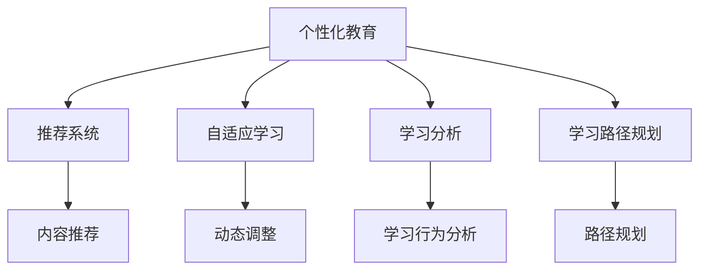

                 

# 个性化教育：定制化学习的未来趋势

> 关键词：个性化教育,定制化学习,深度学习,推荐系统,自适应算法,教育科技,学习分析

## 1. 背景介绍

### 1.1 问题由来

在当今数字化时代，教育已经不再局限于传统的课堂教学。在线教育、远程教育等新模式正在迅速发展，教育资源共享成为可能，也为个性化教育提供了新的机遇和挑战。如何通过数据和算法，实现学生学习路径的个性化定制，提升学习效果和体验，已经成为教育领域的重要课题。

### 1.2 问题核心关键点

个性化教育的实现，依赖于对每个学生的学习行为、知识水平、兴趣爱好的精准分析和预测。传统的教育方式往往采用“一刀切”的教学模式，难以适应每个学生的差异化需求。个性化教育的关键在于：

- **数据驱动**：利用学生学习数据，通过机器学习算法，发现学生学习规律和特点。
- **算法辅助**：采用推荐系统、自适应算法等技术，动态调整学习内容和学习节奏。
- **多维度评估**：不仅关注知识掌握情况，还关注学生心理健康、情感状态等多维度的评价。
- **实时反馈**：通过即时反馈机制，帮助学生及时调整学习策略，优化学习效果。

### 1.3 问题研究意义

个性化教育的实施，将显著提升教育质量，缩小城乡教育差距，实现人人享有优质教育的理想。其意义不仅在于提升学生学业成绩，还在于培养其终身学习的习惯和能力，为未来社会的发展培养更多创新型人才。

## 2. 核心概念与联系

### 2.1 核心概念概述

为了更好地理解个性化教育的实现机制，本文将介绍几个密切相关的核心概念：

- **个性化教育**：以学生的个体差异为基础，通过数据驱动和算法辅助，实现个性化学习路径和内容的定制化。
- **推荐系统**：通过分析用户行为数据，为用户推荐合适的学习内容和资源。
- **自适应学习**：根据学习者当前状态和目标，动态调整学习内容、难度和进度，以适应不同学习者的需求。
- **学习分析**：通过分析学生学习行为数据，发现学习规律和趋势，指导个性化教育的实施。
- **学习路径规划**：设计个性化的学习路径，帮助学生高效达成学习目标。

这些核心概念之间的关系可以通过以下Mermaid流程图来展示：



这个流程图展示了个性化教育的核心概念及其之间的关系：

1. **个性化教育**：是整个系统的目标，涵盖推荐系统、自适应学习、学习分析和路径规划等多个模块。
2. **推荐系统**：通过分析用户行为，推荐合适的学习内容。
3. **自适应学习**：根据学习者状态，动态调整学习内容和进度。
4. **学习分析**：通过分析学习数据，发现学习规律和趋势。
5. **学习路径规划**：设计个性化的学习路径，帮助学生高效学习。

## 3. 核心算法原理 & 具体操作步骤
### 3.1 算法原理概述

个性化教育的核心算法原理主要包括推荐系统、自适应算法和学习分析三个方面。

**推荐系统**：基于用户的历史行为数据和偏好，使用协同过滤、基于内容的推荐、深度学习等算法，为用户推荐合适的学习内容和资源。

**自适应算法**：通过分析学生的当前学习状态、目标和表现，动态调整学习内容、难度和进度，以适应学生的需求。

**学习分析**：通过分析学生的学习数据，发现其学习规律和趋势，指导个性化教育的实施。

### 3.2 算法步骤详解

#### 3.2.1 推荐系统

推荐系统的主要步骤如下：

1. **数据收集**：收集用户的学习历史、兴趣偏好、社交关系等数据。
2. **特征提取**：将收集到的数据转化为模型可以处理的特征向量。
3. **模型训练**：选择适合的推荐算法（如协同过滤、基于内容的推荐、深度学习等），对特征向量进行训练。
4. **推荐生成**：根据用户当前的行为和特征，生成个性化推荐内容。

推荐算法的选择应根据数据特点和应用场景灵活调整。常见的推荐算法包括：

- **协同过滤**：通过分析用户行为数据，找到相似用户，为用户推荐其喜欢的内容。
- **基于内容的推荐**：分析学习内容的特点，找到与用户兴趣相似的内容进行推荐。
- **深度学习推荐**：利用深度神经网络，挖掘用户行为和内容之间的复杂关系，生成个性化推荐。

#### 3.2.2 自适应学习

自适应学习的主要步骤如下：

1. **学生建模**：通过分析学生的学习数据，建立学生模型，描述其当前的学习状态和目标。
2. **内容适配**：根据学生模型，选择或生成适应的学习内容。
3. **动态调整**：根据学习效果和反馈，动态调整学习内容和进度。
4. **效果评估**：评估学习效果，反馈给学生和教师，优化学习过程。

自适应算法的选择也应根据具体需求灵活调整。常见的自适应算法包括：

- **基于规则的自适应**：根据预设的学习规则，动态调整学习内容。
- **基于模型的自适应**：使用机器学习模型，预测学生学习效果，优化学习路径。
- **基于强化学习的自适应**：通过试错机制，找到最优的学习策略。

#### 3.2.3 学习分析

学习分析的主要步骤如下：

1. **数据收集**：收集学生的学习数据，包括学习行为、成绩、情感状态等。
2. **数据清洗**：处理数据中的缺失值、异常值等，确保数据质量。
3. **特征提取**：提取有意义的特征，用于模型训练。
4. **模型训练**：选择合适的机器学习算法，如分类、聚类、回归等，对特征进行训练。
5. **结果分析**：分析模型训练结果，发现学习规律和趋势，指导个性化教育的实施。

学习分析的关键在于选择合适的机器学习算法，并确保数据质量。常见的学习分析算法包括：

- **分类算法**：用于预测学生是否能够掌握某个知识点。
- **聚类算法**：用于将学生按照学习特点进行分组，提供个性化指导。
- **回归算法**：用于预测学生的学习效果，评估学习进度。

### 3.3 算法优缺点

个性化教育的推荐系统、自适应算法和学习分析方法，具有以下优点：

1. **个性化定制**：根据学生的个体差异，提供定制化的学习路径和内容。
2. **效率提升**：通过算法优化，提高学习效果和效率。
3. **学习效果显著**：通过个性化推荐和自适应调整，学生能够更快地掌握知识。

同时，这些方法也存在一些缺点：

1. **数据依赖性强**：个性化教育的实施，依赖于高质量、全面的学生数据。
2. **算法复杂度高**：实现个性化教育需要复杂的算法和模型，对技术要求较高。
3. **资源消耗大**：个性化教育需要大量的计算资源和存储空间，成本较高。
4. **隐私保护问题**：学生数据的收集和处理，涉及到隐私保护问题，需要严格的法规和规范。

尽管存在这些缺点，但个性化教育的优势使其成为教育领域的重要发展方向。未来相关研究的方向，也将侧重于如何降低数据依赖性，提高算法效率，确保数据隐私，以实现更广泛的应用。

### 3.4 算法应用领域

个性化教育的应用领域非常广泛，涵盖以下几个方面：

- **在线教育**：通过推荐系统和自适应算法，提供个性化课程推荐和学习路径规划。
- **智能辅导系统**：利用学习分析结果，提供实时反馈和个性化辅导。
- **学习管理系统(LMS)**：集成个性化教育功能，优化学习资源和评估方式。
- **教育数据分析**：通过学习分析，发现教育规律，指导教育决策。
- **教育游戏**：利用推荐系统和自适应算法，设计个性化的学习游戏。

除了上述这些领域，个性化教育的应用还将在更多场景中得到拓展，为教育公平和个性化发展提供新的动力。

## 4. 数学模型和公式 & 详细讲解 & 举例说明

### 4.1 数学模型构建

本节将使用数学语言对个性化教育的推荐系统、自适应算法和学习分析过程进行严格的刻画。

**推荐系统数学模型**：

假设用户的历史行为数据为 $x_1, x_2, ..., x_n$，推荐内容为 $y_1, y_2, ..., y_m$。则推荐系统的目标是最小化预测误差：

$$
\min_{\theta} \sum_{i=1}^n \sum_{j=1}^m |\hat{y}_{ij} - y_j|^2
$$

其中 $\hat{y}_{ij}$ 为推荐系统预测用户对内容 $y_j$ 的评分，$y_j$ 为实际评分。

**自适应学习数学模型**：

假设学生当前状态为 $s_0$，目标为 $s_T$，学习内容为 $c_1, c_2, ..., c_t$。则自适应学习的目标是最小化总学习时间：

$$
\min_{\theta} \sum_{t=0}^{T-1} \Delta t_t + \lambda L(s_t)
$$

其中 $\Delta t_t$ 为第 $t$ 次学习的时间间隔，$L(s_t)$ 为学习内容的难度，$\lambda$ 为正则化系数。

**学习分析数学模型**：

假设学生学习行为数据为 $d_1, d_2, ..., d_n$，学习效果为 $e_1, e_2, ..., e_n$。则学习分析的目标是建立预测模型 $M$，使得 $M(d_t)$ 逼近 $e_t$：

$$
\min_{\theta} \sum_{i=1}^n (e_i - M(d_i))^2
$$

通过这些数学模型，可以较为严格地描述推荐系统、自适应学习和学习分析的过程。

### 4.2 公式推导过程

#### 4.2.1 推荐系统公式推导

以协同过滤算法为例，其基本思想是找到与目标用户行为相似的用户，为其推荐其喜欢的内容。假设用户 $u$ 对内容 $i$ 的评分表示为 $r_{ui}$，则协同过滤的预测公式为：

$$
\hat{r}_{ui} = \frac{\sum_{j \in N(u)} r_{uj} \cdot r_{ij}}{\sqrt{\sum_{j \in N(u)} r_{uj}^2} \cdot \sqrt{\sum_{j \in N(i)} r_{ij}^2}}
$$

其中 $N(u)$ 表示用户 $u$ 的邻居集合，$\hat{r}_{ui}$ 表示协同过滤预测的评分。

#### 4.2.2 自适应学习公式推导

以基于模型的自适应算法为例，其基本思想是使用机器学习模型，动态调整学习进度和内容。假设学生当前学习状态为 $s_t$，目标为 $s_T$，学习内容为 $c_t$，则自适应学习的目标函数为：

$$
\min_{\theta} \sum_{t=0}^{T-1} f(s_t, c_t) + \lambda g(s_t)
$$

其中 $f(s_t, c_t)$ 为学习内容和状态的非线性函数，$g(s_t)$ 为学习进度的正则化项。

#### 4.2.3 学习分析公式推导

以分类算法为例，其基本思想是将学生学习行为数据 $d_t$ 转化为预测结果 $e_t$。假设学习行为数据 $d_t$ 包括 $x_1, x_2, ..., x_n$，则分类算法的预测公式为：

$$
\hat{e}_t = \sum_{i=1}^n \alpha_i f(x_i; \theta)
$$

其中 $\alpha_i$ 为权值，$f(x_i; \theta)$ 为分类模型的预测函数。

### 4.3 案例分析与讲解

以推荐系统为例，分析其实际应用中的案例。

假设某在线教育平台希望为学生推荐合适的课程内容。平台收集了学生的历史学习行为数据和课程评分数据，可以使用协同过滤算法进行推荐。

首先，平台对学生进行分组，找到与其行为相似的学生。然后，利用这些相似学生对课程的评分，预测目标学生的评分。具体步骤如下：

1. 收集学生的历史学习行为数据 $x_1, x_2, ..., x_n$ 和课程评分数据 $y_1, y_2, ..., y_m$。
2. 利用协同过滤算法，找到与目标用户行为相似的学生 $u$，即 $N(u)$。
3. 计算 $u$ 对课程 $i$ 的评分 $r_{ui}$，并利用预测公式计算目标学生对课程 $i$ 的评分 $\hat{r}_{ui}$。
4. 根据评分 $\hat{r}_{ui}$，为学生推荐最合适的课程。

通过上述案例，可以看到推荐系统在个性化教育中的应用，如何利用数据和算法，为用户推荐合适的学习内容。

## 5. 项目实践：代码实例和详细解释说明
### 5.1 开发环境搭建

在进行个性化教育项目开发前，我们需要准备好开发环境。以下是使用Python进行PyTorch开发的环境配置流程：

1. 安装Anaconda：从官网下载并安装Anaconda，用于创建独立的Python环境。

2. 创建并激活虚拟环境：
```bash
conda create -n pytorch-env python=3.8 
conda activate pytorch-env
```

3. 安装PyTorch：根据CUDA版本，从官网获取对应的安装命令。例如：
```bash
conda install pytorch torchvision torchaudio cudatoolkit=11.1 -c pytorch -c conda-forge
```

4. 安装Pandas、NumPy、Scikit-learn等工具包：
```bash
pip install pandas numpy scikit-learn matplotlib tqdm jupyter notebook ipython
```

完成上述步骤后，即可在`pytorch-env`环境中开始个性化教育项目开发。

### 5.2 源代码详细实现

下面我们以推荐系统为例，给出使用PyTorch实现协同过滤推荐算法的代码实现。

首先，定义推荐系统类：

```python
import torch
from torch import nn
from sklearn.metrics import mean_squared_error

class Recommender(nn.Module):
    def __init__(self, n_users, n_items, n_factors=32):
        super(Recommender, self).__init__()
        self.n_users = n_users
        self.n_items = n_items
        self.factors = nn.Embedding(n_users, n_factors)
        self.items = nn.Embedding(n_items, n_factors)
        self.prediction = nn.Linear(n_factors * 2, 1)
        
    def forward(self, user_id, item_id):
        user = self.factors(user_id)
        item = self.items(item_id)
        prediction = self.prediction(torch.cat([user, item], dim=1))
        return prediction.squeeze()
        
    def predict(self, user_id, item_id):
        return self.forward(user_id, item_id).item()
```

然后，定义数据处理函数：

```python
def load_data(filename):
    data = pd.read_csv(filename)
    users = data['user_id'].unique()
    items = data['item_id'].unique()
    ratings = data[['user_id', 'item_id', 'rating']]
    return users, items, ratings

def split_data(ratings, train_ratio=0.8):
    train_idx, test_idx = train_test_split(ratings.index, train_size=train_ratio, random_state=42)
    train_data = ratings.loc[train_idx]
    test_data = ratings.loc[test_idx]
    return train_data, test_data
```

接着，定义训练和评估函数：

```python
def train_model(model, train_data, test_data, optimizer, device, epochs=10):
    model.to(device)
    criterion = nn.MSELoss()
    for epoch in range(epochs):
        model.train()
        for user_id, item_id, rating in train_data:
            optimizer.zero_grad()
            output = model(user_id.to(device), item_id.to(device))
            loss = criterion(output, rating.to(device))
            loss.backward()
            optimizer.step()
        if (epoch + 1) % 1 == 0:
            model.eval()
            with torch.no_grad():
                total_loss = 0
                for user_id, item_id, rating in test_data:
                    output = model(user_id.to(device), item_id.to(device))
                    loss = criterion(output, rating.to(device))
                    total_loss += loss.item()
                print(f'Epoch {epoch+1}, test loss: {total_loss / len(test_data):.4f}')
```

最后，启动训练流程并在测试集上评估：

```python
from transformers import BertTokenizer
from torch.utils.data import Dataset, DataLoader

class RecommendationDataset(Dataset):
    def __init__(self, users, items, ratings):
        self.users = users
        self.items = items
        self.ratings = ratings
        
    def __len__(self):
        return len(self.ratings)
    
    def __getitem__(self, item):
        user_id, item_id, rating = self.ratings.iloc[item]
        return user_id, item_id, rating

# 数据预处理
users, items, ratings = load_data('ratings.csv')
train_data, test_data = split_data(ratings, train_ratio=0.8)

# 数据加载器
train_loader = DataLoader(RecommendationDataset(users, items, train_data), batch_size=32)
test_loader = DataLoader(RecommendationDataset(users, items, test_data), batch_size=32)

# 模型初始化
model = Recommender(n_users=len(users), n_items=len(items))
optimizer = torch.optim.Adam(model.parameters(), lr=0.001)

# 训练过程
train_model(model, train_loader, test_loader, optimizer, device='cuda')
```

以上就是使用PyTorch实现协同过滤推荐算法的完整代码实现。可以看到，通过简单的代码编写，我们就能构建一个基础的个性化推荐系统。

### 5.3 代码解读与分析

让我们再详细解读一下关键代码的实现细节：

**Recommender类**：
- `__init__`方法：初始化用户和物品的嵌入层，以及线性预测层。
- `forward`方法：前向传播，计算预测评分。
- `predict`方法：对指定用户和物品进行评分预测。

**load_data函数**：
- 从CSV文件中加载评分数据，提取用户、物品和评分信息。

**split_data函数**：
- 将评分数据分为训练集和测试集，采用80%的比例划分。

**train_model函数**：
- 定义模型、损失函数和优化器。
- 训练模型，每轮迭代时在前向传播和反向传播中更新模型参数。
- 在每个epoch结束后，在测试集上评估模型性能。

**RecommendationDataset类**：
- 继承自`torch.utils.data.Dataset`，用于处理数据集。
- `__getitem__`方法：对单个样本进行处理，返回用户、物品和评分。

**训练流程**：
- 定义模型、优化器、损失函数等。
- 使用`train_model`函数进行模型训练。
- 在测试集上评估模型性能。

可以看到，通过简单的代码编写，我们就能构建一个基础的个性化推荐系统。开发者可以进一步扩展和优化代码，以实现更复杂的功能。

## 6. 实际应用场景
### 6.1 在线教育

在线教育平台可以通过推荐系统，为学生提供个性化课程推荐。平台可以收集学生的学习历史、课程评分、作业完成情况等数据，利用协同过滤、基于内容的推荐等算法，推荐学生最感兴趣的课程和资源。

具体实现步骤如下：

1. 收集学生学习历史和课程评分数据。
2. 使用推荐算法，计算每个课程与学生兴趣的匹配度。
3. 根据匹配度排序，生成个性化课程推荐列表。
4. 根据推荐列表，引导学生选择学习内容。

### 6.2 智能辅导系统

智能辅导系统可以通过自适应学习，提供个性化的学习路径和资源。系统可以分析学生的学习行为数据，判断其学习进度和难点，动态调整学习内容和难度。

具体实现步骤如下：

1. 收集学生的学习行为数据，如作业完成情况、测试成绩等。
2. 分析数据，建立学生模型，描述其当前学习状态和目标。
3. 根据学生模型，动态调整学习内容和进度。
4. 实时反馈学习效果，调整学习策略。

### 6.3 学习管理系统(LMS)

学习管理系统(LMS)可以通过个性化教育功能，优化学习资源和评估方式。LMS可以集成推荐系统、自适应学习等模块，为学生提供个性化的学习路径和资源。

具体实现步骤如下：

1. 收集学生的学习行为数据。
2. 使用推荐算法，为学生推荐合适的学习资源。
3. 使用自适应学习，动态调整学习内容和进度。
4. 通过学习分析，评估学习效果，优化学习路径。

### 6.4 未来应用展望

随着个性化教育技术的不断进步，其在实际应用中的场景将越来越广泛。

1. **智能校园**：通过个性化教育，为校园内的教学、管理、服务提供全面的支持。
2. **远程教育**：利用个性化教育技术，为远程教育提供高效、个性化的学习体验。
3. **企业培训**：为员工提供个性化培训课程和资源，提升其职业素养和学习效果。
4. **游戏教育**：在教育游戏中，利用个性化教育技术，提供更精准的学习路径和资源。

此外，个性化教育还将与其他人工智能技术进行更深入的融合，如自然语言处理、计算机视觉等，实现更全面的智能学习环境。

## 7. 工具和资源推荐
### 7.1 学习资源推荐

为了帮助开发者系统掌握个性化教育的理论基础和实践技巧，这里推荐一些优质的学习资源：

1. **《推荐系统：算法与应用》**：详细介绍推荐系统的基础知识和实践应用，涵盖协同过滤、基于内容的推荐、深度学习推荐等多种算法。

2. **Coursera《机器学习》**：斯坦福大学开设的机器学习课程，涵盖各种机器学习算法及其应用，适合初学者和进阶者学习。

3. **Kaggle**：机器学习和数据科学竞赛平台，通过实际案例练习推荐系统、自适应学习等技术。

4. **IEEE Xplore**：机器学习领域的重要资源库，收录了大量学术文章和会议论文，适合深度学习和个性化教育的研究。

5. **Arxiv**：机器学习和个性化教育的研究前沿，提供大量的预印本论文，适合跟踪最新研究进展。

通过对这些资源的学习实践，相信你一定能够快速掌握个性化教育的精髓，并用于解决实际的个性化教育问题。

### 7.2 开发工具推荐

高效的开发离不开优秀的工具支持。以下是几款用于个性化教育开发的常用工具：

1. **PyTorch**：基于Python的开源深度学习框架，灵活动态的计算图，适合快速迭代研究。

2. **TensorFlow**：由Google主导开发的开源深度学习框架，生产部署方便，适合大规模工程应用。

3. **Scikit-learn**：Python科学计算库，提供了丰富的机器学习算法，适合处理结构化数据。

4. **NumPy**：Python科学计算库，提供了高效的数值计算和矩阵操作。

5. **Pandas**：Python数据分析库，提供了高效的数据处理和分析功能。

6. **Jupyter Notebook**：交互式编程环境，适合进行数据分析和算法实验。

合理利用这些工具，可以显著提升个性化教育系统的开发效率，加快创新迭代的步伐。

### 7.3 相关论文推荐

个性化教育技术的发展源于学界的持续研究。以下是几篇奠基性的相关论文，推荐阅读：

1. **《推荐系统》**：斯坦福大学开设的推荐系统课程，全面介绍推荐系统的理论基础和实际应用。

2. **《深度学习与推荐系统》**：介绍深度学习在推荐系统中的应用，涵盖协同过滤、深度神经网络等多种推荐算法。

3. **《自适应学习与个性化教育》**：研究如何通过自适应学习，提供个性化的学习路径和资源。

4. **《个性化教育系统设计》**：提出基于机器学习的个性化教育系统，涵盖推荐系统、自适应学习等技术。

5. **《学习分析与个性化教育》**：研究如何通过学习分析，指导个性化教育的实施，提升学习效果。

这些论文代表了个性化教育技术的发展脉络。通过学习这些前沿成果，可以帮助研究者把握学科前进方向，激发更多的创新灵感。

## 8. 总结：未来发展趋势与挑战
### 8.1 总结

本文对个性化教育的实现机制进行了全面系统的介绍。首先阐述了个性化教育的背景和意义，明确了推荐系统、自适应算法和学习分析等核心技术的应用价值。其次，从原理到实践，详细讲解了推荐系统、自适应算法和学习分析的过程，给出了实现代码示例。同时，本文还探讨了个性化教育在在线教育、智能辅导系统、学习管理系统等领域的实际应用，展示了个性化教育的广阔前景。此外，本文精选了个性化教育的相关学习资源，力求为开发者提供全方位的技术指引。

通过本文的系统梳理，可以看到，个性化教育技术正在成为教育领域的重要发展方向，其通过数据和算法，实现学生学习路径的个性化定制，显著提升了教育质量和学习效果。随着技术的发展，个性化教育必将在更多场景中得到应用，为教育公平和个性化发展提供新的动力。

### 8.2 未来发展趋势

展望未来，个性化教育技术将呈现以下几个发展趋势：

1. **深度学习的应用**：深度学习在个性化教育中的应用将更加广泛，利用其强大的建模能力，提升推荐系统和自适应算法的性能。

2. **多模态数据的融合**：融合语音、图像、视频等多模态数据，提供更全面、丰富的学习体验。

3. **自适应算法的创新**：开发更加高效、自适应的算法，提高学习效果的个性化程度。

4. **学习分析的深入**：利用机器学习技术，深入挖掘学习规律和趋势，提供更精准的学习指导。

5. **隐私保护技术的提升**：在数据收集和处理过程中，采用更加严格的隐私保护技术，确保学生数据的安全。

6. **跨学科的融合**：与其他学科的技术进行融合，如自然语言处理、计算机视觉等，提供更全面的智能学习环境。

以上趋势凸显了个性化教育技术的广阔前景。这些方向的探索发展，必将进一步提升教育质量，推动教育公平和个性化发展。

### 8.3 面临的挑战

尽管个性化教育技术已经取得了瞩目成就，但在迈向更加智能化、普适化应用的过程中，它仍面临着诸多挑战：

1. **数据质量问题**：高质量、全面的学生数据是个性化教育的基础，但数据收集、处理和存储过程中，存在数据质量问题，如数据缺失、异常值等。

2. **算法复杂度问题**：实现个性化教育需要复杂的算法和模型，对技术要求较高，需要更多的研究和实践。

3. **资源消耗问题**：个性化教育需要大量的计算资源和存储空间，成本较高，需要高效优化技术支持。

4. **隐私保护问题**：学生数据的收集和处理，涉及到隐私保护问题，需要严格的法规和规范。

5. **技术协同问题**：个性化教育技术需要与其他学科的技术进行融合，需要更多的跨学科研究。

尽管存在这些挑战，但个性化教育的优势使其成为教育领域的重要发展方向。未来相关研究的方向，也将侧重于如何降低数据依赖性，提高算法效率，确保数据隐私，以实现更广泛的应用。

### 8.4 研究展望

面对个性化教育技术面临的挑战，未来的研究需要在以下几个方面寻求新的突破：

1. **深度学习算法的优化**：通过优化深度学习算法，提升推荐系统和自适应算法的性能，提高学习效果的个性化程度。

2. **多模态数据的融合**：探索融合语音、图像、视频等多模态数据的个性化教育技术，提供更全面、丰富的学习体验。

3. **高效自适应算法的研究**：开发更加高效、自适应的算法，提高个性化教育的实时性和适应性。

4. **学习分析模型的改进**：利用机器学习技术，深入挖掘学习规律和趋势，提供更精准的学习指导。

5. **隐私保护技术的创新**：采用更加严格的隐私保护技术，确保学生数据的安全。

6. **跨学科的合作**：与其他学科的技术进行合作，推动个性化教育技术的进一步发展。

这些研究方向的探索，必将引领个性化教育技术迈向更高的台阶，为教育公平和个性化发展提供新的动力。

## 9. 附录：常见问题与解答

**Q1：个性化教育中的数据来源有哪些？**

A: 个性化教育中的数据来源广泛，包括但不限于以下几类：

1. **学习历史数据**：记录学生的学习行为，如课程选择、学习时间、作业完成情况等。
2. **成绩数据**：记录学生的学习成绩，如考试分数、测试成绩等。
3. **反馈数据**：记录教师、同学、家长对学生的评价，如课堂表现、作业反馈等。
4. **社交网络数据**：记录学生在社交网络上的互动，如好友关系、讨论内容等。
5. **兴趣爱好数据**：记录学生的兴趣爱好，如课外活动、阅读偏好等。

这些数据来源，提供了丰富的信息，帮助个性化教育系统更好地理解学生的学习状态和需求。

**Q2：个性化教育的推荐算法有哪些？**

A: 个性化教育的推荐算法包括但不限于以下几类：

1. **协同过滤算法**：通过分析用户行为数据，找到相似用户，为其推荐其喜欢的内容。
2. **基于内容的推荐算法**：分析学习内容的特点，找到与用户兴趣相似的内容进行推荐。
3. **深度学习推荐算法**：利用深度神经网络，挖掘用户行为和内容之间的复杂关系，生成个性化推荐。
4. **混合推荐算法**：结合多种推荐算法，取长补短，提升推荐效果。

选择适合的推荐算法，需要根据数据特点和应用场景灵活调整。

**Q3：个性化教育中的自适应学习算法有哪些？**

A: 个性化教育中的自适应学习算法包括但不限于以下几类：

1. **基于规则的自适应算法**：根据预设的学习规则，动态调整学习内容。
2. **基于模型的自适应算法**：使用机器学习模型，预测学生学习效果，优化学习路径。
3. **基于强化学习的自适应算法**：通过试错机制，找到最优的学习策略。

选择适合的自适应算法，需要根据具体需求灵活调整。

**Q4：个性化教育中的学习分析算法有哪些？**

A: 个性化教育中的学习分析算法包括但不限于以下几类：

1. **分类算法**：用于预测学生是否能够掌握某个知识点。
2. **聚类算法**：用于将学生按照学习特点进行分组，提供个性化指导。
3. **回归算法**：用于预测学生的学习效果，评估学习进度。

选择适合的机器学习算法，需要根据具体需求灵活调整。

**Q5：如何评估个性化教育的推荐效果？**

A: 评估个性化教育的推荐效果，可以通过以下指标：

1. **精确率**：衡量推荐内容的准确性，即推荐内容与用户真实需求的一致性。
2. **召回率**：衡量推荐系统覆盖用户需求的程度，即推荐内容覆盖用户兴趣的程度。
3. **覆盖率**：衡量推荐内容的多样性，即推荐内容覆盖不同类型内容的程度。
4. **用户体验**：通过用户满意度调查、点击率、使用时长等指标，评估个性化教育的用户体验。

通过这些指标，可以全面评估个性化教育的推荐效果。

**Q6：个性化教育中如何保护学生隐私？**

A: 个性化教育中，保护学生隐私是至关重要的。以下是一些保护学生隐私的措施：

1. **数据匿名化**：对学生数据进行匿名化处理，确保数据无法反推到具体个人。
2. **差分隐私**：采用差分隐私技术，在保证数据有用的同时，保护个人隐私。
3. **访问控制**：严格控制数据的访问权限，确保只有授权人员可以访问敏感数据。
4. **加密技术**：对数据进行加密处理，确保数据在传输和存储过程中的安全性。
5. **合规性审查**：定期进行合规性审查，确保数据处理和使用的合法性。

通过这些措施，可以有效保护学生隐私。

---

作者：禅与计算机程序设计艺术 / Zen and the Art of Computer Programming

