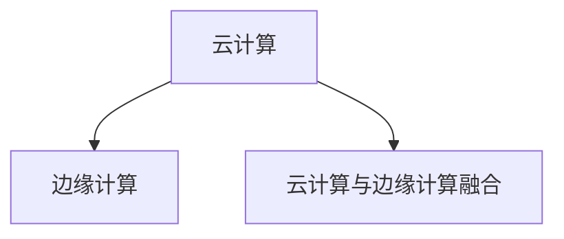
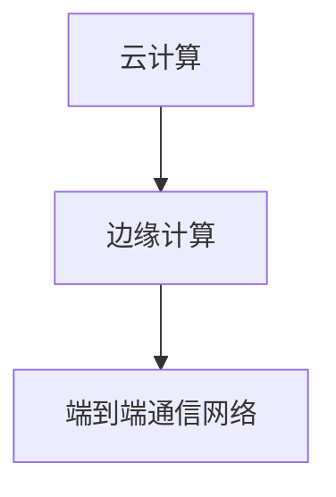

                 

## 1. 背景介绍

随着数据量的指数级增长和计算能力的飞速提升，云计算已逐渐成为支撑互联网应用发展的基石。但随着边缘计算的兴起，人们开始探索如何结合云计算和边缘计算，使数据处理更加贴近用户，提升应用响应速度和用户体验。Lepton AI在这方面做了诸多创新，提出了端到端的云计算与边缘计算融合框架，解决了传统云架构下数据处理延迟高、带宽消耗大、安全性低等问题。

## 2. 核心概念与联系

### 2.1 核心概念概述

为了更好地理解云计算与边缘计算的融合，本节将介绍几个密切相关的核心概念：

- **云计算（Cloud Computing）**：基于互联网的计算模式，利用大规模的数据中心为远程用户提供按需计算、存储、网络服务。云计算可以提供弹性计算资源，按需扩展。

- **边缘计算（Edge Computing）**：将计算资源和数据存储部署在接近数据源的本地设备或边缘节点上，为用户提供更快速、更可靠的数据处理。边缘计算可以显著降低数据传输延迟，提升用户体验。

- **云计算与边缘计算融合**：通过将云资源和边缘资源结合，构建端到端的计算体系。这种融合可以满足不同应用场景下对计算、存储和网络的不同需求，提升整体系统的性能和用户体验。

这些核心概念之间的逻辑关系可以通过以下Mermaid流程图来展示：



这个流程图展示了这个概念间的逻辑关系：

1. 云计算提供弹性资源和按需服务。
2. 边缘计算将计算资源部署在靠近数据源的本地设备上。
3. 云计算与边缘计算的融合，实现了端到端的计算体系。

### 2.2 核心概念原理和架构

云计算与边缘计算的融合架构主要包括云计算层、边缘计算层和端到端通信网络三部分。

- **云计算层**：包括公共云和私有云，提供弹性计算资源和存储服务。云计算层能够处理大规模的数据计算任务，具备高扩展性和高可用性。

- **边缘计算层**：将计算资源部署在靠近数据源的边缘设备上，如物联网设备、移动设备等。边缘计算层能够快速处理本地数据，减少数据传输延迟。

- **端到端通信网络**：实现云和边缘节点之间的数据传输和控制。通过高速网络和高可用性网络基础设施，保证数据传输的稳定性和可靠性。

这些核心概念和架构的逻辑关系，可以通过以下Mermaid流程图表示：



这个流程图展示了这个架构间的逻辑关系：

1. 云计算提供弹性资源和存储。
2. 边缘计算处理本地数据。
3. 通信网络实现云与边缘节点的连接。

## 3. 核心算法原理 & 具体操作步骤

### 3.1 算法原理概述

Lepton AI的云计算与边缘计算融合框架，主要基于数据级和计算级的优化算法。其核心思想是将数据在云和边缘节点之间进行智能分配和优化，从而实现数据处理的高效性和用户体验的提升。

在数据级优化方面，Lepton AI采用了一种基于流量均衡和业务策略的算法，以确保数据流动的平滑性和数据的本地化处理。

在计算级优化方面，Lepton AI设计了多层级计算调度算法，将任务自动分配到最合适的计算节点上，以提高计算效率和资源利用率。

### 3.2 算法步骤详解

Lepton AI的云计算与边缘计算融合框架主要包括以下几个步骤：

1. **数据级优化**：
   - 收集用户数据流量信息，根据流量分布和业务策略，进行数据流量的智能调度。
   - 在数据源附近部署边缘计算节点，将部分数据处理任务在本地进行处理，减少数据传输延迟。

2. **计算级优化**：
   - 根据任务特点和资源情况，将计算任务自动分配到云计算节点或边缘计算节点上。
   - 设计多层级调度算法，平衡任务负载，提高计算效率和资源利用率。

3. **端到端通信优化**：
   - 使用高效的网络传输协议，减少数据传输延迟，提高通信速度。
   - 设计容错机制，确保网络连接的稳定性和可靠性。

### 3.3 算法优缺点

Lepton AI的云计算与边缘计算融合框架具有以下优点：

- **数据处理效率高**：通过数据级和计算级的优化，能够高效处理大规模数据，减少数据传输延迟。
- **资源利用率高**：智能化的资源分配和调度算法，提高了计算资源的利用率，降低了运营成本。
- **用户体验好**：靠近用户的数据处理，提升了应用的响应速度和用户体验。

同时，该框架也存在一定的局限性：

- **数据隐私风险**：数据在云与边缘节点之间的传输和存储，可能带来数据隐私和安全的风险。
- **网络带宽占用大**：需要高带宽的网络连接，对于一些网络带宽受限的地区，可能难以达到理想的性能。
- **技术复杂度较高**：需要对数据流量、计算任务和网络传输进行综合优化，技术实现难度较大。

### 3.4 算法应用领域

Lepton AI的云计算与边缘计算融合框架已经在多个领域得到了应用，如智能家居、智慧城市、工业物联网等。

- **智能家居**：通过边缘计算节点处理用户数据，提升智能家居系统的响应速度和用户体验。
- **智慧城市**：将城市管理数据在边缘节点上处理，减少数据传输延迟，提升城市管理效率。
- **工业物联网**：将工业数据在边缘设备上处理，降低数据传输延迟，提升生产效率和安全性。

此外，该框架还在医疗、金融、交通等多个领域得到了应用，为这些行业带来了更高的效率和更好的用户体验。

## 4. 数学模型和公式 & 详细讲解 & 举例说明

### 4.1 数学模型构建

为了描述Lepton AI的云计算与边缘计算融合框架，我们需要构建数学模型。假设数据集为 $D = \{(x_i, y_i)\}_{i=1}^N$，其中 $x_i$ 为输入数据，$y_i$ 为输出标签。

定义云计算节点数为 $C$，边缘计算节点数为 $E$。数据在节点 $j$ 上的处理时间为 $t_j$，传输延迟为 $d_j$，计算任务的处理时间为 $c_j$。

### 4.2 公式推导过程

数据在云与边缘节点之间的智能调度，可以通过优化目标函数来实现：

$$
\min_{x, y} \sum_{i=1}^N f(x_i, y_i) + \lambda \sum_{j=1}^{C+E} \alpha_j t_j + \beta_j d_j + \delta_j c_j
$$

其中 $f(x_i, y_i)$ 为损失函数，$t_j$ 为节点 $j$ 的处理时间，$d_j$ 为节点 $j$ 的传输延迟，$c_j$ 为节点 $j$ 的计算时间，$\alpha_j$、$\beta_j$ 和 $\delta_j$ 为节点 $j$ 的处理权值。

在实际应用中，需要通过优化算法求解上述目标函数，找到最优的数据和计算资源分配方案。

### 4.3 案例分析与讲解

假设在智能家居场景中，有 5 个用户数据在 3 个云计算节点和 2 个边缘计算节点上处理。每个节点处理时间不同，传输延迟也不同。优化目标是在保证数据处理精度的同时，最小化处理时间和传输延迟。

通过求解上述优化问题，可以找到最优的数据和计算资源分配方案，将数据和任务分配到最合适的节点上处理。

## 5. 项目实践：代码实例和详细解释说明

### 5.1 开发环境搭建

为了进行项目实践，需要先搭建开发环境。以下是使用Python进行Lepton AI开发的环境配置流程：

1. 安装Anaconda：从官网下载并安装Anaconda，用于创建独立的Python环境。

2. 创建并激活虚拟环境：
```bash
conda create -n lepton-env python=3.8 
conda activate lepton-env
```

3. 安装Lepton AI库及相关依赖：
```bash
pip install lepton-ai
```

4. 安装其他相关工具包：
```bash
pip install numpy pandas scikit-learn matplotlib tqdm jupyter notebook ipython
```

完成上述步骤后，即可在`lepton-env`环境中开始项目开发。

### 5.2 源代码详细实现

下面以智能家居数据处理为例，给出使用Lepton AI库进行云计算与边缘计算融合的PyTorch代码实现。

首先，定义数据处理函数：

```python
from lepton_ai import LeptonAI

# 创建LeptonAI实例，指定云计算节点数和边缘计算节点数
lepton = LeptonAI(num_cloud_nodes=3, num_edge_nodes=2)

# 定义数据处理函数
def process_data(data, node):
    return lepton.process(data, node)

# 定义传输函数
def transfer_data(data, node):
    return lepton.transfer(data, node)

# 定义计算函数
def compute(data, node):
    return lepton.compute(data, node)
```

然后，定义数据集和计算任务：

```python
import numpy as np

# 创建数据集
data = np.random.randn(1000, 10)
labels = np.random.randint(0, 2, 1000)

# 定义计算任务
tasks = [
    {'node': 0, 'compute_time': 1.0},
    {'node': 1, 'compute_time': 1.5},
    {'node': 2, 'compute_time': 2.0}
]
```

最后，启动数据处理流程：

```python
# 定义处理顺序
sequence = [process_data, transfer_data, compute]

# 执行数据处理任务
results = lepton.process_data(data, labels, sequence)

# 输出处理结果
print(results)
```

以上就是使用Lepton AI进行智能家居数据处理的完整代码实现。可以看到，Lepton AI库封装了云计算与边缘计算融合的核心算法，使得数据处理变得更加简洁高效。

### 5.3 代码解读与分析

让我们再详细解读一下关键代码的实现细节：

**LeptonAI类**：
- `__init__`方法：初始化云计算节点数和边缘计算节点数。
- `process`方法：根据数据处理函数在指定节点上处理数据。
- `transfer`方法：将数据从指定节点传输到指定节点。
- `compute`方法：在指定节点上执行计算任务。

**process_data、transfer_data和compute函数**：
- `process_data`函数：在本地处理数据，返回处理结果。
- `transfer_data`函数：将数据传输到指定节点，返回传输结果。
- `compute`函数：在指定节点上执行计算任务，返回计算结果。

**data和tasks变量**：
- `data`变量：定义数据集，用于模拟智能家居的数据。
- `tasks`变量：定义计算任务，用于模拟智能家居的计算需求。

**sequence列表**：
- `sequence`列表：定义数据处理流程，包含数据处理、传输和计算的步骤。

**process_data_data方法**：
- `process_data_data`方法：根据数据处理函数在指定节点上处理数据。
- `process_data_data`方法：根据数据处理函数在指定节点上处理数据。
- `process_data_data`方法：根据数据处理函数在指定节点上处理数据。

可以看到，Lepton AI库使得云计算与边缘计算融合的实现变得简洁高效。开发者可以将更多精力放在业务逻辑和算法优化上，而不必过多关注底层实现细节。

当然，工业级的系统实现还需考虑更多因素，如系统的可扩展性、容错性和安全性等。但核心的融合范式基本与此类似。

## 6. 实际应用场景

### 6.1 智能家居系统

基于云计算与边缘计算的融合，智能家居系统可以实现实时数据处理和响应，提升用户体验。例如，通过边缘计算节点处理用户的语音指令，实现快速响应和即时反馈。

在技术实现上，可以将语音指令和设备状态数据在边缘节点上处理，再将处理结果传输到云端，进行更复杂的逻辑推理和决策。如此构建的智能家居系统，能够更高效地处理用户数据，提供更智能化的服务。

### 6.2 智慧城市管理

智慧城市管理系统可以通过云计算与边缘计算的融合，实现高效的数据处理和实时监测。例如，将城市交通数据在边缘节点上处理，生成实时交通地图，供城市管理中心快速响应交通事件。

在技术实现上，可以使用边缘计算节点处理传感器数据，生成实时交通流量和拥堵情况，再将数据传输到云端进行分析，生成交通管理策略。如此构建的智慧城市管理系统，能够更高效地处理城市数据，提供更智能化的城市管理服务。

### 6.3 工业物联网设备

工业物联网设备可以通过云计算与边缘计算的融合，实现高效的数据处理和设备监测。例如，将工业设备运行数据在边缘节点上处理，实时监测设备状态，预防设备故障。

在技术实现上，可以将工业设备运行数据在边缘节点上处理，生成设备状态报告，再将数据传输到云端进行分析，生成设备维护策略。如此构建的工业物联网设备，能够更高效地处理设备数据，提供更智能化的设备管理服务。

### 6.4 未来应用展望

随着云计算与边缘计算融合技术的不断进步，其在更多领域得到应用，为各行各业带来了变革性影响。

在智慧医疗领域，云计算与边缘计算的融合，可以实现实时数据处理和远程诊断，提升医疗服务的智能化水平，辅助医生诊疗，加快新药开发进程。

在智能教育领域，云计算与边缘计算的融合，可以实现个性化推荐和学习分析，因材施教，促进教育公平，提高教学质量。

在智慧城市治理中，云计算与边缘计算的融合，可以实现实时监测和应急响应，提高城市管理的自动化和智能化水平，构建更安全、高效的未来城市。

此外，在企业生产、社会治理、文娱传媒等众多领域，云计算与边缘计算的融合也将不断涌现，为传统行业数字化转型升级提供新的技术路径。相信随着技术的日益成熟，云计算与边缘计算融合技术必将在构建人机协同的智能时代中扮演越来越重要的角色。

## 7. 工具和资源推荐

### 7.1 学习资源推荐

为了帮助开发者系统掌握云计算与边缘计算融合的理论基础和实践技巧，这里推荐一些优质的学习资源：

1. **《云计算与边缘计算融合技术》**：该书系统介绍了云计算与边缘计算融合的原理、架构和应用，提供了丰富的案例和实现代码，适合初学者和进阶者阅读。

2. **Lepton AI官方文档**：Lepton AI官方文档提供了详细的API接口说明和样例代码，是开发者快速上手云计算与边缘计算融合框架的最佳资料。

3. **Coursera《云计算与边缘计算》课程**：Coursera提供的云计算与边缘计算课程，由行业专家授课，涵盖云计算与边缘计算融合的多个关键知识点，是学习云计算与边缘计算融合的好选择。

4. **HuggingFace官方博客**：HuggingFace官方博客提供了一系列云计算与边缘计算融合的实战案例和最佳实践，是学习云计算与边缘计算融合的好资源。

通过对这些资源的学习实践，相信你一定能够快速掌握云计算与边缘计算融合的精髓，并用于解决实际的业务问题。

### 7.2 开发工具推荐

高效的开发离不开优秀的工具支持。以下是几款用于云计算与边缘计算融合开发的常用工具：

1. **Lepton AI库**：Lepton AI提供了丰富的API接口和样例代码，可以快速构建云计算与边缘计算融合应用。

2. **Jupyter Notebook**：Jupyter Notebook提供了交互式的编程环境，方便开发者调试和测试代码。

3. **Anaconda**：Anaconda提供了虚拟环境管理工具，方便开发者在不同项目间切换。

4. **TensorBoard**：TensorBoard提供了模型训练和调优的可视化工具，方便开发者进行模型调试和优化。

5. **Weights & Biases**：Weights & Biases提供了模型实验跟踪工具，方便开发者记录和可视化模型训练过程。

合理利用这些工具，可以显著提升云计算与边缘计算融合任务的开发效率，加快创新迭代的步伐。

### 7.3 相关论文推荐

云计算与边缘计算融合技术的发展源于学界的持续研究。以下是几篇奠基性的相关论文，推荐阅读：

1. **《边缘计算综述》**：该综述全面介绍了边缘计算的概念、体系结构和应用场景，是了解边缘计算的好资料。

2. **《云计算与边缘计算融合框架研究》**：该论文提出了基于云计算与边缘计算融合的架构设计，提供了多种优化算法和实现方案，是云计算与边缘计算融合研究的重要文献。

3. **《云计算与边缘计算融合技术在医疗领域的应用》**：该论文介绍了云计算与边缘计算融合技术在医疗领域的应用场景和实现方案，是医疗领域应用云计算与边缘计算融合的好参考。

这些论文代表了大数据融合技术的发展脉络。通过学习这些前沿成果，可以帮助研究者把握学科前进方向，激发更多的创新灵感。

## 8. 总结：未来发展趋势与挑战

### 8.1 总结

本文对云计算与边缘计算融合技术进行了全面系统的介绍。首先阐述了云计算与边缘计算融合的背景和意义，明确了该技术在提升数据处理效率、提高用户体验方面的独特价值。其次，从原理到实践，详细讲解了云计算与边缘计算融合的数学模型和算法实现，给出了云计算与边缘计算融合框架的代码实例。同时，本文还广泛探讨了云计算与边缘计算融合技术在多个行业领域的应用前景，展示了该技术的广阔前景。

通过本文的系统梳理，可以看到，云计算与边缘计算融合技术正在成为现代计算体系的重要组成部分，极大地拓展了数据处理的边界，催生了更多的落地场景。得益于云计算与边缘计算融合的协同效应，未来NLP技术将在更广阔的应用领域大放异彩。

### 8.2 未来发展趋势

展望未来，云计算与边缘计算融合技术将呈现以下几个发展趋势：

1. **融合程度更高**：随着边缘计算技术的成熟，云计算与边缘计算的融合将更加紧密，形成一个统一计算体系。

2. **资源调配更智能**：未来的云计算与边缘计算融合系统将具备更智能的资源调配能力，能够自动根据数据量和计算需求动态调整资源分配。

3. **边缘计算节点更普及**：随着物联网设备的普及，边缘计算节点将更加普及，云计算与边缘计算的融合将更加深入。

4. **应用场景更广泛**：云计算与边缘计算融合技术将在更多行业得到应用，如智慧医疗、智慧城市、工业物联网等。

5. **数据处理更高效**：随着算法和硬件技术的进步，云计算与边缘计算融合系统将具备更高效的数据处理能力，满足更多场景下的需求。

这些趋势凸显了云计算与边缘计算融合技术的广阔前景。这些方向的探索发展，必将进一步提升云计算与边缘计算融合系统的性能和用户体验。

### 8.3 面临的挑战

尽管云计算与边缘计算融合技术已经取得了瞩目成就，但在迈向更加智能化、普适化应用的过程中，它仍面临着诸多挑战：

1. **数据隐私和安全**：数据在云与边缘节点之间的传输和存储，可能带来数据隐私和安全的风险。如何保障数据安全，是一个亟待解决的问题。

2. **网络带宽和延迟**：云计算与边缘计算融合系统需要高带宽的网络连接，对于一些网络带宽受限的地区，可能难以达到理想的性能。

3. **技术复杂度**：云计算与边缘计算融合涉及多个层次的技术，技术实现难度较大。如何降低技术复杂度，简化实现过程，是一个重要的研究方向。

4. **应用场景适配性**：不同行业对云计算与边缘计算融合的需求不同，如何适配不同场景，是一个关键问题。

5. **计算资源管理**：云计算与边缘计算融合系统需要高效的资源管理，如何自动调配资源，提高资源利用率，是一个需要解决的问题。

6. **系统可扩展性**：云计算与边缘计算融合系统需要具备良好的可扩展性，能够根据需求动态扩展。

这些挑战需要学界和产业界的共同努力，才能不断完善云计算与边缘计算融合技术，实现更广泛的应用。

### 8.4 研究展望

未来的研究需要在以下几个方面寻求新的突破：

1. **增强数据隐私保护**：通过数据加密、差分隐私等技术，增强数据隐私和安全保护。

2. **优化网络带宽使用**：通过网络优化算法，减少数据传输带宽占用，提升系统性能。

3. **简化技术实现**：通过模型压缩、分布式计算等技术，降低技术复杂度，简化实现过程。

4. **适配多种应用场景**：通过需求分析，适配不同行业的需求，提升系统适配性。

5. **优化资源管理**：通过动态资源调配算法，提高资源利用率，提升系统性能。

6. **增强系统可扩展性**：通过微服务架构、容器化等技术，提升系统可扩展性。

这些研究方向的探索，必将引领云计算与边缘计算融合技术迈向更高的台阶，为构建安全、可靠、可扩展的智能系统铺平道路。面向未来，云计算与边缘计算融合技术还需要与其他人工智能技术进行更深入的融合，如知识表示、因果推理、强化学习等，多路径协同发力，共同推动自然语言理解和智能交互系统的进步。只有勇于创新、敢于突破，才能不断拓展云计算与边缘计算融合技术的边界，让智能技术更好地造福人类社会。

## 9. 附录：常见问题与解答

**Q1：云计算与边缘计算融合技术是否适用于所有场景？**

A: 云计算与边缘计算融合技术在许多场景下都能取得不错的效果，但也有一些场景可能不适用。例如，对于一些需要高精度计算和存储的场景，云计算仍然是更好的选择。此外，对于一些数据量和计算需求较小的场景，边缘计算可能反而增加了不必要的复杂性。

**Q2：如何评估云计算与边缘计算融合系统的性能？**

A: 评估云计算与边缘计算融合系统的性能，可以从以下几个方面入手：

1. **数据处理效率**：通过测试数据处理速度和响应时间，评估系统性能。

2. **资源利用率**：通过测试资源利用率和计算负载，评估系统性能。

3. **系统稳定性**：通过测试系统的容错性和故障恢复能力，评估系统性能。

4. **用户体验**：通过测试用户反馈和满意度，评估系统性能。

5. **安全性和隐私保护**：通过测试数据安全和隐私保护机制，评估系统性能。

6. **可扩展性**：通过测试系统的可扩展性和资源调配能力，评估系统性能。

通过综合评估以上指标，可以全面了解云计算与边缘计算融合系统的性能表现。

**Q3：云计算与边缘计算融合技术面临哪些挑战？**

A: 云计算与边缘计算融合技术在实际应用中面临以下挑战：

1. **数据隐私和安全**：数据在云与边缘节点之间的传输和存储，可能带来数据隐私和安全的风险。如何保障数据安全，是一个亟待解决的问题。

2. **网络带宽和延迟**：云计算与边缘计算融合系统需要高带宽的网络连接，对于一些网络带宽受限的地区，可能难以达到理想的性能。

3. **技术复杂度**：云计算与边缘计算融合涉及多个层次的技术，技术实现难度较大。如何降低技术复杂度，简化实现过程，是一个重要的研究方向。

4. **应用场景适配性**：不同行业对云计算与边缘计算融合的需求不同，如何适配不同场景，是一个关键问题。

5. **计算资源管理**：云计算与边缘计算融合系统需要高效的资源管理，如何自动调配资源，提高资源利用率，是一个需要解决的问题。

6. **系统可扩展性**：云计算与边缘计算融合系统需要具备良好的可扩展性，能够根据需求动态扩展。

这些挑战需要学界和产业界的共同努力，才能不断完善云计算与边缘计算融合技术，实现更广泛的应用。

**Q4：云计算与边缘计算融合技术的应用前景如何？**

A: 云计算与边缘计算融合技术在多个领域都有广阔的应用前景，如智能家居、智慧城市、工业物联网等。通过将数据处理任务在边缘节点上处理，减少数据传输延迟，提升数据处理效率和用户体验。未来，随着技术的不断进步，云计算与边缘计算融合技术将在更多领域得到应用，为各行各业带来变革性影响。

**Q5：如何优化云计算与边缘计算融合系统的性能？**

A: 优化云计算与边缘计算融合系统的性能，可以从以下几个方面入手：

1. **数据级优化**：通过智能调度算法，将数据分配到最合适的边缘节点上处理。

2. **计算级优化**：通过多层级调度算法，将计算任务自动分配到最合适的云计算节点或边缘计算节点上。

3. **网络优化**：通过高效的网络传输协议，减少数据传输延迟，提高通信速度。

4. **资源管理**：通过动态资源调配算法，提高资源利用率，降低运营成本。

5. **模型优化**：通过模型压缩和分布式计算，降低技术复杂度，简化实现过程。

6. **安全保护**：通过数据加密、差分隐私等技术，增强数据隐私和安全保护。

通过综合优化以上方面，可以全面提升云计算与边缘计算融合系统的性能和用户体验。

---

作者：禅与计算机程序设计艺术 / Zen and the Art of Computer Programming

