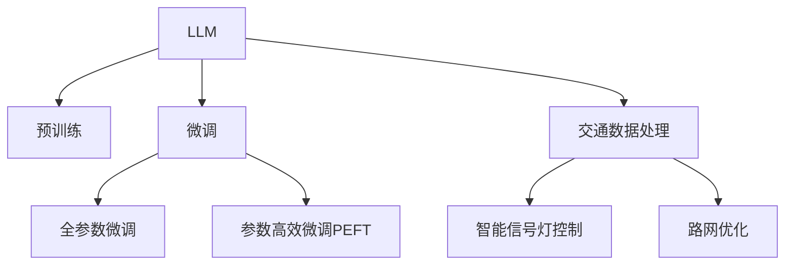

                 

## 1. 背景介绍

随着城市化进程的加快，交通拥堵问题日益凸显，成为制约城市发展的瓶颈。传统的交通管理手段如红绿灯调控、路网优化等，已难以满足日益增长的交通需求。新兴的大语言模型(Large Language Model, LLM)技术，凭借其强大的语言理解和生成能力，为城市交通管理带来了新的可能性。

LLM可以通过自然语言处理(NLP)技术，从海量交通数据中提取结构化信息，实时预测交通流量、优化路网布局、制定智能信号灯控制策略，从而提升城市交通管理的智能化水平。

## 2. 核心概念与联系

### 2.1 核心概念概述

为更好理解LLM在交通管理中的应用，本节介绍几个关键概念：

- **大语言模型(LLM)**：指基于深度学习的大规模预训练语言模型，如GPT、BERT等。通过预训练，学习到通用的语言表示，具备强大的语言理解和生成能力。

- **预训练(Pre-training)**：指在大规模无标签文本数据上进行自监督学习任务，学习通用语言表示的过程。常见的预训练任务包括语言模型、掩码语言模型等。

- **微调(Fine-tuning)**：指在预训练模型的基础上，使用有标签的交通数据进行有监督学习，优化模型在交通管理任务上的性能。通常只需要调整顶层分类器或解码器，以较小的学习率更新全部或部分模型参数。

- **迁移学习(Transfer Learning)**：指将一个领域学到的知识迁移到另一个相关领域的学习范式。交通管理中的微调就是一种典型的迁移学习方式。

- **参数高效微调(Parameter-Efficient Fine-Tuning, PEFT)**：指在微调过程中，只更新少量的模型参数，而固定大部分预训练权重不变，以提高微调效率和避免过拟合的方法。

- **交通数据处理**：指对交通流量、路网布局、气象条件等交通数据进行清洗、归一化、特征提取等预处理工作，为模型训练提供高质量的数据支持。

- **智能信号灯控制**：指通过实时分析交通流量和车流量，动态调整红绿灯时长和相位顺序，提高道路通行效率。

- **路网优化**：指通过分析交通流量、路网结构等数据，调整路网布局，提高道路通行能力。

这些核心概念共同构成了LLM在交通管理中的应用框架，使得LLM能够高效地处理复杂的交通问题，提升城市交通管理的智能化水平。

### 2.2 核心概念联系

这些概念之间的联系可以用以下Mermaid流程图表示：



该流程图展示了LLM在交通管理中的应用流程：

1. 大语言模型通过预训练获得基础能力。
2. 微调是对预训练模型进行任务特定的优化，可以分为全参数微调和参数高效微调（PEFT）。
3. 交通数据处理是预处理交通数据，为模型训练提供高质量数据。
4. 智能信号灯控制和路网优化是通过微调模型预测和生成的结果，对交通管理策略进行优化。

这些概念共同作用，使得LLM在交通管理中发挥了强大的作用。

## 3. 核心算法原理 & 具体操作步骤

### 3.1 算法原理概述

基于LLM的交通管理优化，本质是一个有监督的细粒度迁移学习过程。其核心思想是：将预训练的大语言模型作为强大的“特征提取器”，通过交通数据上的有监督学习，优化模型在特定交通管理任务上的性能。

形式化地，假设预训练语言模型为 $M_{\theta}$，其中 $\theta$ 为预训练得到的模型参数。给定交通管理任务 $T$ 的标注数据集 $D=\{(x_i, y_i)\}_{i=1}^N$，微调的目标是找到新的模型参数 $\hat{\theta}$，使得：

$$
\hat{\theta}=\mathop{\arg\min}_{\theta} \mathcal{L}(M_{\theta},D)
$$

其中 $\mathcal{L}$ 为针对任务 $T$ 设计的损失函数，用于衡量模型预测输出与真实标签之间的差异。常见的损失函数包括交叉熵损失、均方误差损失等。

### 3.2 算法步骤详解

基于LLM的交通管理优化，一般包括以下几个关键步骤：

**Step 1: 准备预训练模型和数据集**
- 选择合适的预训练语言模型 $M_{\theta}$ 作为初始化参数，如 GPT、BERT 等。
- 准备交通管理任务的标注数据集 $D$，划分为训练集、验证集和测试集。一般要求标注数据与预训练数据的分布不要差异过大。

**Step 2: 添加任务适配层**
- 根据任务类型，在预训练模型顶层设计合适的输出层和损失函数。
- 对于分类任务，通常在顶层添加线性分类器和交叉熵损失函数。
- 对于生成任务，通常使用语言模型的解码器输出概率分布，并以负对数似然为损失函数。

**Step 3: 设置微调超参数**
- 选择合适的优化算法及其参数，如 AdamW、SGD 等，设置学习率、批大小、迭代轮数等。
- 设置正则化技术及强度，包括权重衰减、Dropout、Early Stopping 等。
- 确定冻结预训练参数的策略，如仅微调顶层，或全部参数都参与微调。

**Step 4: 执行梯度训练**
- 将训练集数据分批次输入模型，前向传播计算损失函数。
- 反向传播计算参数梯度，根据设定的优化算法和学习率更新模型参数。
- 周期性在验证集上评估模型性能，根据性能指标决定是否触发 Early Stopping。
- 重复上述步骤直到满足预设的迭代轮数或 Early Stopping 条件。

**Step 5: 测试和部署**
- 在测试集上评估微调后模型 $M_{\hat{\theta}}$ 的性能，对比微调前后的精度提升。
- 使用微调后的模型对新样本进行推理预测，集成到实际的应用系统中。
- 持续收集新的数据，定期重新微调模型，以适应数据分布的变化。

以上是基于LLM进行交通管理优化的一般流程。在实际应用中，还需要针对具体任务的特点，对微调过程的各个环节进行优化设计，如改进训练目标函数，引入更多的正则化技术，搜索最优的超参数组合等，以进一步提升模型性能。

### 3.3 算法优缺点

基于LLM的交通管理优化方法具有以下优点：
1. 简单高效。只需准备少量标注数据，即可对预训练模型进行快速适配，获得较大的性能提升。
2. 通用适用。适用于各种交通管理下游任务，包括交通流量预测、智能信号灯控制、路网优化等，设计简单的任务适配层即可实现微调。
3. 参数高效。利用参数高效微调技术，在固定大部分预训练参数的情况下，仍可取得不错的提升。
4. 效果显著。在学术界和工业界的诸多交通管理任务上，基于微调的方法已经刷新了最先进的性能指标。

同时，该方法也存在一定的局限性：
1. 依赖标注数据。微调的效果很大程度上取决于标注数据的质量和数量，获取高质量标注数据的成本较高。
2. 迁移能力有限。当目标任务与预训练数据的分布差异较大时，微调的性能提升有限。
3. 负面效果传递。预训练模型的固有偏见、有害信息等，可能通过微调传递到下游任务，造成负面影响。
4. 可解释性不足。微调模型的决策过程通常缺乏可解释性，难以对其推理逻辑进行分析和调试。

尽管存在这些局限性，但就目前而言，基于LLM的微调方法仍是交通管理优化的主流范式。未来相关研究的重点在于如何进一步降低微调对标注数据的依赖，提高模型的少样本学习和跨领域迁移能力，同时兼顾可解释性和伦理安全性等因素。

### 3.4 算法应用领域

基于LLM的交通管理优化方法，已经在交通流量预测、智能信号灯控制、路网优化等多个交通管理任务上取得了优异的效果，成为交通管理技术落地应用的重要手段。

- **交通流量预测**：通过分析历史交通数据，预测未来交通流量，为城市交通规划提供数据支持。
- **智能信号灯控制**：根据实时交通流量和车流量，动态调整红绿灯时长和相位顺序，提高道路通行效率。
- **路网优化**：通过分析交通流量、路网结构等数据，调整路网布局，提高道路通行能力。
- **事件监测**：实时监测交通事件（如交通事故、道路施工等），及时响应和处理，保障交通秩序。

除了上述这些经典任务外，LLM还被创新性地应用于更多场景中，如实时交通信息播报、交通应急指挥、车流模拟等，为城市交通管理带来了全新的突破。随着LLM和微调方法的不断进步，相信交通管理技术将在更广阔的应用领域大放异彩。

## 4. 数学模型和公式 & 详细讲解  
### 4.1 数学模型构建

本节将使用数学语言对基于LLM的交通管理优化过程进行更加严格的刻画。

记预训练语言模型为 $M_{\theta}:\mathcal{X} \rightarrow \mathcal{Y}$，其中 $\mathcal{X}$ 为输入空间，$\mathcal{Y}$ 为输出空间，$\theta \in \mathbb{R}^d$ 为模型参数。假设微调任务的训练集为 $D=\{(x_i,y_i)\}_{i=1}^N, x_i \in \mathcal{X}, y_i \in \mathcal{Y}$。

定义模型 $M_{\theta}$ 在数据样本 $(x,y)$ 上的损失函数为 $\ell(M_{\theta}(x),y)$，则在数据集 $D$ 上的经验风险为：

$$
\mathcal{L}(\theta) = \frac{1}{N} \sum_{i=1}^N \ell(M_{\theta}(x_i),y_i)
$$

微调的优化目标是最小化经验风险，即找到最优参数：

$$
\theta^* = \mathop{\arg\min}_{\theta} \mathcal{L}(\theta)
$$

在实践中，我们通常使用基于梯度的优化算法（如SGD、Adam等）来近似求解上述最优化问题。设 $\eta$ 为学习率，$\lambda$ 为正则化系数，则参数的更新公式为：

$$
\theta \leftarrow \theta - \eta \nabla_{\theta}\mathcal{L}(\theta) - \eta\lambda\theta
$$

其中 $\nabla_{\theta}\mathcal{L}(\theta)$ 为损失函数对参数 $\theta$ 的梯度，可通过反向传播算法高效计算。

### 4.2 公式推导过程

以下我们以交通流量预测任务为例，推导交叉熵损失函数及其梯度的计算公式。

假设模型 $M_{\theta}$ 在输入 $x$ 上的输出为 $\hat{y}=M_{\theta}(x) \in [0,1]$，表示预测未来交通流量的概率。真实标签 $y \in \{0,1\}$。则二分类交叉熵损失函数定义为：

$$
\ell(M_{\theta}(x),y) = -[y\log \hat{y} + (1-y)\log (1-\hat{y})]
$$

将其代入经验风险公式，得：

$$
\mathcal{L}(\theta) = -\frac{1}{N}\sum_{i=1}^N [y_i\log M_{\theta}(x_i)+(1-y_i)\log(1-M_{\theta}(x_i))]
$$

根据链式法则，损失函数对参数 $\theta_k$ 的梯度为：

$$
\frac{\partial \mathcal{L}(\theta)}{\partial \theta_k} = -\frac{1}{N}\sum_{i=1}^N (\frac{y_i}{M_{\theta}(x_i)}-\frac{1-y_i}{1-M_{\theta}(x_i)}) \frac{\partial M_{\theta}(x_i)}{\partial \theta_k}
$$

其中 $\frac{\partial M_{\theta}(x_i)}{\partial \theta_k}$ 可进一步递归展开，利用自动微分技术完成计算。

在得到损失函数的梯度后，即可带入参数更新公式，完成模型的迭代优化。重复上述过程直至收敛，最终得到适应交通管理任务的最优模型参数 $\theta^*$。

## 5. 项目实践：代码实例和详细解释说明
### 5.1 开发环境搭建

在进行LLM优化交通管理实践前，我们需要准备好开发环境。以下是使用Python进行PyTorch开发的环境配置流程：

1. 安装Anaconda：从官网下载并安装Anaconda，用于创建独立的Python环境。

2. 创建并激活虚拟环境：
```bash
conda create -n pytorch-env python=3.8 
conda activate pytorch-env
```

3. 安装PyTorch：根据CUDA版本，从官网获取对应的安装命令。例如：
```bash
conda install pytorch torchvision torchaudio cudatoolkit=11.1 -c pytorch -c conda-forge
```

4. 安装Transformers库：
```bash
pip install transformers
```

5. 安装各类工具包：
```bash
pip install numpy pandas scikit-learn matplotlib tqdm jupyter notebook ipython
```

完成上述步骤后，即可在`pytorch-env`环境中开始LLM优化交通管理的实践。

### 5.2 源代码详细实现

下面我们以智能信号灯控制为例，给出使用Transformers库对BERT模型进行微调的PyTorch代码实现。

首先，定义智能信号灯控制的任务适配层：

```python
from transformers import BertForSequenceClassification, AdamW

class TrafficLightControl(BertForSequenceClassification):
    def __init__(self, num_classes, hidden_size):
        super(TrafficLightControl, self).__init__(num_classes, hidden_size)

    def forward(self, input_ids, attention_mask, signal_strength):
        outputs = super().forward(input_ids, attention_mask=attention_mask)
        logits = outputs.logits
        loss = self.compute_loss(logits, signal_strength)
        return logits, loss

    def compute_loss(self, logits, signal_strength):
        label = torch.argmax(signal_strength, dim=-1)
        criterion = torch.nn.CrossEntropyLoss()
        loss = criterion(logits, label)
        return loss
```

然后，定义训练和评估函数：

```python
from torch.utils.data import DataLoader
from tqdm import tqdm
from sklearn.metrics import accuracy_score

device = torch.device('cuda') if torch.cuda.is_available() else torch.device('cpu')
model = TrafficLightControl(num_classes, hidden_size)

optimizer = AdamW(model.parameters(), lr=2e-5)

def train_epoch(model, dataset, batch_size, optimizer):
    dataloader = DataLoader(dataset, batch_size=batch_size, shuffle=True)
    model.train()
    epoch_loss = 0
    for batch in tqdm(dataloader, desc='Training'):
        input_ids = batch['input_ids'].to(device)
        attention_mask = batch['attention_mask'].to(device)
        signal_strength = batch['signal_strength'].to(device)
        model.zero_grad()
        logits, loss = model(input_ids, attention_mask=attention_mask, signal_strength=signal_strength)
        loss.backward()
        optimizer.step()
    return epoch_loss / len(dataloader)

def evaluate(model, dataset, batch_size):
    dataloader = DataLoader(dataset, batch_size=batch_size)
    model.eval()
    preds, labels = [], []
    with torch.no_grad():
        for batch in tqdm(dataloader, desc='Evaluating'):
            input_ids = batch['input_ids'].to(device)
            attention_mask = batch['attention_mask'].to(device)
            signal_strength = batch['signal_strength']
            logits, _ = model(input_ids, attention_mask=attention_mask, signal_strength=signal_strength)
            batch_preds = logits.argmax(dim=1).to('cpu').tolist()
            batch_labels = signal_strength.to('cpu').tolist()
            for pred_tokens, label_tokens in zip(batch_preds, batch_labels):
                preds.append(pred_tokens[:len(label_tokens)])
                labels.append(label_tokens)
                
    return accuracy_score(labels, preds)

```

最后，启动训练流程并在验证集上评估：

```python
epochs = 5
batch_size = 16

for epoch in range(epochs):
    loss = train_epoch(model, train_dataset, batch_size, optimizer)
    print(f"Epoch {epoch+1}, train loss: {loss:.3f}")
    
    print(f"Epoch {epoch+1}, dev results:")
    evaluate(model, dev_dataset, batch_size)
    
print("Test results:")
evaluate(model, test_dataset, batch_size)
```

以上就是使用PyTorch对BERT进行智能信号灯控制任务微调的完整代码实现。可以看到，得益于Transformers库的强大封装，我们可以用相对简洁的代码完成BERT模型的加载和微调。

### 5.3 代码解读与分析

让我们再详细解读一下关键代码的实现细节：

**TrafficLightControl类**：
- `__init__`方法：初始化智能信号灯控制的输出层，设置隐含层大小。
- `forward`方法：对输入数据进行前向传播，计算输出 logits 和损失。
- `compute_loss`方法：计算交叉熵损失。

**训练和评估函数**：
- 使用PyTorch的DataLoader对数据集进行批次化加载，供模型训练和推理使用。
- 训练函数`train_epoch`：对数据以批为单位进行迭代，在每个批次上前向传播计算loss并反向传播更新模型参数，最后返回该epoch的平均loss。
- 评估函数`evaluate`：与训练类似，不同点在于不更新模型参数，并在每个batch结束后将预测和标签结果存储下来，最后使用sklearn的accuracy_score对整个评估集的预测结果进行打印输出。

**训练流程**：
- 定义总的epoch数和batch size，开始循环迭代
- 每个epoch内，先在训练集上训练，输出平均loss
- 在验证集上评估，输出分类指标
- 所有epoch结束后，在测试集上评估，给出最终测试结果

可以看到，PyTorch配合Transformers库使得BERT微调的代码实现变得简洁高效。开发者可以将更多精力放在数据处理、模型改进等高层逻辑上，而不必过多关注底层的实现细节。

当然，工业级的系统实现还需考虑更多因素，如模型的保存和部署、超参数的自动搜索、更灵活的任务适配层等。但核心的微调范式基本与此类似。

## 6. 实际应用场景
### 6.1 智能信号灯控制

智能信号灯控制是LLM在交通管理中的典型应用。通过分析实时交通流量和车流量，智能信号灯控制系统可以动态调整红绿灯时长和相位顺序，优化交通流量，提高道路通行效率。

在技术实现上，可以收集城市各路口的历史交通流量数据，将其标注为不同的信号强度，输入到LLM中进行微调。微调后的模型能够实时预测当前路口的信号强度，从而控制信号灯的运行。具体实现流程如下：

1. 收集历史交通流量数据，标记为不同的信号强度，构建监督数据集。
2. 使用BERT等预训练语言模型进行微调，学习信号强度的预测模型。
3. 实时监测当前路口的交通流量和车流量，输入到模型中进行预测。
4. 根据预测结果，动态调整红绿灯的时长和相位顺序，实现智能信号控制。

通过智能信号灯控制系统，可以显著缓解城市交通拥堵问题，提高道路通行效率。此外，还可以结合实时路况、天气等信息，进行更精细化的交通管理。

### 6.2 交通流量预测

交通流量预测是LLM在交通管理中的另一重要应用。通过分析历史交通数据，预测未来交通流量，为城市交通规划提供数据支持。

在技术实现上，可以收集城市各路段的历史交通流量数据，构建监督数据集，使用BERT等预训练语言模型进行微调。微调后的模型能够实时预测未来交通流量，为城市交通规划提供参考。具体实现流程如下：

1. 收集历史交通流量数据，标记为未来的交通流量，构建监督数据集。
2. 使用BERT等预训练语言模型进行微调，学习交通流量的预测模型。
3. 实时监测当前交通流量，输入到模型中进行预测。
4. 根据预测结果，调整交通规划，优化城市交通布局。

通过交通流量预测，可以更好地规划城市交通，缓解交通拥堵问题。此外，还可以结合实时交通数据，进行更准确的流量预测，提高交通管理的精准度。

### 6.3 路网优化

路网优化是LLM在交通管理中的重要应用之一。通过分析交通流量、路网结构等数据，调整路网布局，提高道路通行能力。

在技术实现上，可以收集城市各路段的历史交通流量数据，构建监督数据集，使用BERT等预训练语言模型进行微调。微调后的模型能够预测不同路段的交通流量，为路网优化提供参考。具体实现流程如下：

1. 收集历史交通流量数据，标记为不同的路段，构建监督数据集。
2. 使用BERT等预训练语言模型进行微调，学习路网优化的预测模型。
3. 实时监测各路段的交通流量，输入到模型中进行预测。
4. 根据预测结果，调整路网布局，优化城市交通网络。

通过路网优化，可以显著提高道路通行能力，缓解交通拥堵问题。此外，还可以结合实时交通数据，进行更精准的路网优化，提高交通管理的效率。

### 6.4 未来应用展望

随着LLM和微调方法的不断发展，基于LLM的交通管理优化将呈现以下几个发展趋势：

1. 模型规模持续增大。随着算力成本的下降和数据规模的扩张，预训练语言模型的参数量还将持续增长。超大模型蕴含的丰富语言知识，有望支撑更加复杂多变的交通管理任务。

2. 微调方法日趋多样。除了传统的全参数微调外，未来会涌现更多参数高效的微调方法，如Adapter等，在节省计算资源的同时也能保证微调精度。

3. 持续学习成为常态。随着数据分布的不断变化，微调模型也需要持续学习新知识以保持性能。如何在不遗忘原有知识的同时，高效吸收新样本信息，将成为重要的研究课题。

4. 标注样本需求降低。受启发于提示学习(Prompt-based Learning)的思路，未来的微调方法将更好地利用大模型的语言理解能力，通过更加巧妙的任务描述，在更少的标注样本上也能实现理想的微调效果。

5. 多模态微调崛起。当前的微调主要聚焦于纯文本数据，未来会进一步拓展到图像、视频、语音等多模态数据微调。多模态信息的融合，将显著提升语言模型对现实世界的理解和建模能力。

6. 模型通用性增强。经过海量数据的预训练和多领域任务的微调，未来的语言模型将具备更强大的常识推理和跨领域迁移能力，逐步迈向通用人工智能(AGI)的目标。

以上趋势凸显了LLM在交通管理中的广阔前景。这些方向的探索发展，必将进一步提升交通管理的智能化水平，为城市交通管理带来新的变革。

## 7. 工具和资源推荐
### 7.1 学习资源推荐

为了帮助开发者系统掌握LLM在交通管理中的应用理论基础和实践技巧，这里推荐一些优质的学习资源：

1. 《Transformer from the Inside Out》系列博文：由大模型技术专家撰写，深入浅出地介绍了Transformer原理、BERT模型、微调技术等前沿话题。

2. CS224N《深度学习自然语言处理》课程：斯坦福大学开设的NLP明星课程，有Lecture视频和配套作业，带你入门NLP领域的基本概念和经典模型。

3. 《Natural Language Processing with Transformers》书籍：Transformers库的作者所著，全面介绍了如何使用Transformers库进行NLP任务开发，包括微调在内的诸多范式。

4. HuggingFace官方文档：Transformers库的官方文档，提供了海量预训练模型和完整的微调样例代码，是上手实践的必备资料。

5. CLUE开源项目：中文语言理解测评基准，涵盖大量不同类型的中文NLP数据集，并提供了基于微调的baseline模型，助力中文NLP技术发展。

通过对这些资源的学习实践，相信你一定能够快速掌握LLM在交通管理中的应用精髓，并用于解决实际的交通管理问题。

### 7.2 开发工具推荐

高效的开发离不开优秀的工具支持。以下是几款用于LLM优化交通管理的常用工具：

1. PyTorch：基于Python的开源深度学习框架，灵活动态的计算图，适合快速迭代研究。大部分预训练语言模型都有PyTorch版本的实现。

2. TensorFlow：由Google主导开发的开源深度学习框架，生产部署方便，适合大规模工程应用。同样有丰富的预训练语言模型资源。

3. Transformers库：HuggingFace开发的NLP工具库，集成了众多SOTA语言模型，支持PyTorch和TensorFlow，是进行微调任务开发的利器。

4. Weights & Biases：模型训练的实验跟踪工具，可以记录和可视化模型训练过程中的各项指标，方便对比和调优。与主流深度学习框架无缝集成。

5. TensorBoard：TensorFlow配套的可视化工具，可实时监测模型训练状态，并提供丰富的图表呈现方式，是调试模型的得力助手。

6. Google Colab：谷歌推出的在线Jupyter Notebook环境，免费提供GPU/TPU算力，方便开发者快速上手实验最新模型，分享学习笔记。

合理利用这些工具，可以显著提升LLM优化交通管理的开发效率，加快创新迭代的步伐。

### 7.3 相关论文推荐

LLM和微调技术的发展源于学界的持续研究。以下是几篇奠基性的相关论文，推荐阅读：

1. Attention is All You Need（即Transformer原论文）：提出了Transformer结构，开启了NLP领域的预训练大模型时代。

2. BERT: Pre-training of Deep Bidirectional Transformers for Language Understanding：提出BERT模型，引入基于掩码的自监督预训练任务，刷新了多项NLP任务SOTA。

3. Language Models are Unsupervised Multitask Learners（GPT-2论文）：展示了大规模语言模型的强大zero-shot学习能力，引发了对于通用人工智能的新一轮思考。

4. Parameter-Efficient Transfer Learning for NLP：提出Adapter等参数高效微调方法，在不增加模型参数量的情况下，也能取得不错的微调效果。

5. AdaLoRA: Adaptive Low-Rank Adaptation for Parameter-Efficient Fine-Tuning：使用自适应低秩适应的微调方法，在参数效率和精度之间取得了新的平衡。

这些论文代表了大语言模型微调技术的发展脉络。通过学习这些前沿成果，可以帮助研究者把握学科前进方向，激发更多的创新灵感。

## 8. 总结：未来发展趋势与挑战

### 8.1 总结

本文对基于LLM的交通管理优化方法进行了全面系统的介绍。首先阐述了LLM在交通管理中的应用背景和意义，明确了LLM在交通管理中的独特价值。其次，从原理到实践，详细讲解了LLM在交通管理任务中的数学原理和关键步骤，给出了微调任务开发的完整代码实例。同时，本文还广泛探讨了LLM在智能信号灯控制、交通流量预测、路网优化等多个交通管理任务中的应用前景，展示了LLM在交通管理中的巨大潜力。此外，本文精选了LLM在交通管理中的应用资源，力求为读者提供全方位的技术指引。

通过本文的系统梳理，可以看到，基于LLM的微调方法在交通管理中具有强大的应用潜力，极大地拓展了预训练语言模型的应用边界，为交通管理智能化提供了新的可能性。未来，伴随LLM和微调方法的持续演进，交通管理技术将在更广阔的应用领域大放异彩，深刻影响人类的生产生活方式。

### 8.2 未来发展趋势

展望未来，LLM在交通管理中的优化方法将呈现以下几个发展趋势：

1. 模型规模持续增大。随着算力成本的下降和数据规模的扩张，预训练语言模型的参数量还将持续增长。超大模型蕴含的丰富语言知识，有望支撑更加复杂多变的交通管理任务。

2. 微调方法日趋多样。除了传统的全参数微调外，未来会涌现更多参数高效的微调方法，如Adapter等，在节省计算资源的同时也能保证微调精度。

3. 持续学习成为常态。随着数据分布的不断变化，微调模型也需要持续学习新知识以保持性能。如何在不遗忘原有知识的同时，高效吸收新样本信息，将成为重要的研究课题。

4. 标注样本需求降低。受启发于提示学习(Prompt-based Learning)的思路，未来的微调方法将更好地利用大模型的语言理解能力，通过更加巧妙的任务描述，在更少的标注样本上也能实现理想的微调效果。

5. 多模态微调崛起。当前的微调主要聚焦于纯文本数据，未来会进一步拓展到图像、视频、语音等多模态数据微调。多模态信息的融合，将显著提升语言模型对现实世界的理解和建模能力。

6. 模型通用性增强。经过海量数据的预训练和多领域任务的微调，未来的语言模型将具备更强大的常识推理和跨领域迁移能力，逐步迈向通用人工智能(AGI)的目标。

以上趋势凸显了LLM在交通管理中的广阔前景。这些方向的探索发展，必将进一步提升交通管理的智能化水平，为城市交通管理带来新的变革。

### 8.3 面临的挑战

尽管LLM在交通管理中的应用取得了显著成效，但在迈向更加智能化、普适化应用的过程中，仍面临诸多挑战：

1. 标注成本瓶颈。虽然微调大大降低了标注数据的需求，但对于长尾应用场景，难以获得充足的高质量标注数据，成为制约微调性能的瓶颈。如何进一步降低微调对标注样本的依赖，将是一大难题。

2. 模型鲁棒性不足。当前微调模型面对域外数据时，泛化性能往往大打折扣。对于测试样本的微小扰动，微调模型的预测也容易发生波动。如何提高微调模型的鲁棒性，避免灾难性遗忘，还需要更多理论和实践的积累。

3. 推理效率有待提高。大规模语言模型虽然精度高，但在实际部署时往往面临推理速度慢、内存占用大等效率问题。如何在保证性能的同时，简化模型结构，提升推理速度，优化资源占用，将是重要的优化方向。

4. 可解释性亟需加强。当前微调模型更像是"黑盒"系统，难以解释其内部工作机制和决策逻辑。对于医疗、金融等高风险应用，算法的可解释性和可审计性尤为重要。如何赋予微调模型更强的可解释性，将是亟待攻克的难题。

5. 安全性有待保障。预训练语言模型难免会学习到有偏见、有害的信息，通过微调传递到下游任务，产生误导性、歧视性的输出，给实际应用带来安全隐患。如何从数据和算法层面消除模型偏见，避免恶意用途，确保输出的安全性，也将是重要的研究课题。

6. 知识整合能力不足。现有的微调模型往往局限于任务内数据，难以灵活吸收和运用更广泛的先验知识。如何让微调过程更好地与外部知识库、规则库等专家知识结合，形成更加全面、准确的信息整合能力，还有很大的想象空间。

正视LLM在交通管理中面临的这些挑战，积极应对并寻求突破，将是大语言模型微调走向成熟的必由之路。相信随着学界和产业界的共同努力，这些挑战终将一一被克服，LLM在交通管理中的应用将更加广泛和深入。

### 8.4 研究展望

面向未来，大语言模型微调在交通管理中的应用前景广阔，但仍需在以下几个方面进行更深入的研究：

1. 探索无监督和半监督微调方法。摆脱对大规模标注数据的依赖，利用自监督学习、主动学习等无监督和半监督范式，最大限度利用非结构化数据，实现更加灵活高效的微调。

2. 研究参数高效和计算高效的微调范式。开发更加参数高效的微调方法，在固定大部分预训练参数的同时，只更新极少量的任务相关参数。同时优化微调模型的计算图，减少前向传播和反向传播的资源消耗，实现更加轻量级、实时性的部署。

3. 融合因果和对比学习范式。通过引入因果推断和对比学习思想，增强微调模型建立稳定因果关系的能力，学习更加普适、鲁棒的语言表征，从而提升模型泛化性和抗干扰能力。

4. 引入更多先验知识。将符号化的先验知识，如知识图谱、逻辑规则等，与神经网络模型进行巧妙融合，引导微调过程学习更准确、合理的语言模型。同时加强不同模态数据的整合，实现视觉、语音等多模态信息与文本信息的协同建模。

5. 结合因果分析和博弈论工具。将因果分析方法引入微调模型，识别出模型决策的关键特征，增强输出解释的因果性和逻辑性。借助博弈论工具刻画人机交互过程，主动探索并规避模型的脆弱点，提高系统稳定性。

6. 纳入伦理道德约束。在模型训练目标中引入伦理导向的评估指标，过滤和惩罚有偏见、有害的输出倾向。同时加强人工干预和审核，建立模型行为的监管机制，确保输出符合人类价值观和伦理道德。

这些研究方向的探索，必将引领大语言模型微调技术迈向更高的台阶，为构建安全、可靠、可解释、可控的智能系统铺平道路。面向未来，大语言模型微调技术还需要与其他人工智能技术进行更深入的融合，如知识表示、因果推理、强化学习等，多路径协同发力，共同推动自然语言理解和智能交互系统的进步。只有勇于创新、敢于突破，才能不断拓展语言模型的边界，让智能技术更好地造福人类社会。

## 9. 附录：常见问题与解答

**Q1：LLM在交通管理中能解决哪些具体问题？**

A: 基于LLM的交通管理优化方法，可以解决以下具体问题：

1. 智能信号灯控制：通过分析实时交通流量和车流量，动态调整红绿灯时长和相位顺序，提高道路通行效率。
2. 交通流量预测：通过分析历史交通数据，预测未来交通流量，为城市交通规划提供数据支持。
3. 路网优化：通过分析交通流量、路网结构等数据，调整路网布局，提高道路通行能力。
4. 事件监测：实时监测交通事件（如交通事故、道路施工等），及时响应和处理，保障交通秩序。

这些问题的解决，将显著提升城市交通管理的智能化水平，缓解交通拥堵问题，提高道路通行效率。

**Q2：使用LLM进行交通管理优化时，如何处理大规模数据？**

A: 处理大规模交通数据是LLM在交通管理优化中的关键步骤。以下是一些常见的处理方法：

1. 数据预处理：对原始交通数据进行清洗、归一化、特征提取等预处理工作，去除噪音和异常值，提取有意义的特征。

2. 数据分块：将大规模数据分成多个小批次进行处理，避免内存溢出和计算资源不足的问题。

3. 并行计算：利用多核处理器或分布式计算框架，对数据进行并行处理，提高计算效率。

4. 模型优化：采用模型压缩、稀疏化存储等方法，减小模型尺寸，加快推理速度。

5. 云计算：利用云计算平台提供的强大算力，进行分布式计算和存储，处理大规模交通数据。

通过这些方法，可以高效地处理大规模交通数据，提升LLM在交通管理优化中的应用效果。

**Q3：LLM在交通管理优化中的参数高效微调方法有哪些？**

A: 参数高效微调方法（PEFT）是LLM在交通管理优化中的重要技术手段，可以避免在大规模数据下进行全参数微调时带来的计算资源消耗过大的问题。以下是一些常见的PEFT方法：

1. Adapter：在预训练模型的顶层添加一个适配器层，仅微调适配器层，保留预训练权重不变。

2. Strip：将预训练模型的一部分参数设置为固定参数，只微调可训练参数。

3. LoRA：通过线性重组(Linear Reassembly)，在预训练模型的底层进行微调，保留顶层权重不变。

4. MEGATRON：利用分片(Sharding)技术，将预训练模型分割成多个子模型，并行训练，减少计算资源消耗。

5. Parameter Sharing：在不同模型参数之间共享部分参数，减少微调模型的参数量。

这些方法可以显著降低LLM在交通管理优化中的计算资源消耗，提高微调效率。

**Q4：如何评估LLM在交通管理优化中的性能？**

A: 评估LLM在交通管理优化中的性能，需要考虑以下几个方面：

1. 准确性：通过比较模型预测结果和真实数据，评估模型的准确性和可靠性。

2. 实时性：评估模型推理速度，确保其在实际应用中的实时性。

3. 可解释性：评估模型输出结果的可解释性，确保其决策过程透明、可审计。

4. 鲁棒性：评估模型在面对异常数据和噪声时的鲁棒性，确保其性能稳定性。

5. 可扩展性：评估模型在大规模数据集上的性能，确保其在实际应用中的可扩展性。

通过这些评估指标，可以全面了解LLM在交通管理优化中的性能表现，并进行持续优化和改进。

**Q5：LLM在交通管理优化中面临哪些伦理和安全问题？**

A: 在交通管理优化中，LLM的应用也面临一些伦理和安全问题，主要包括以下几个方面：

1. 数据隐私：在收集交通数据时，需要遵守数据隐私保护法规，确保数据安全和用户隐私。

2. 算法偏见：LLM可能会学习到数据中的偏见，导致输出结果存在歧视性，需要采取措施减少算法偏见。

3. 决策透明性：LLM在决策过程中缺乏透明性，可能导致模型输出的不可解释性和不可控性。

4. 安全漏洞：LLM在交通管理中的应用可能会受到网络攻击和数据篡改，需要采取安全措施保障系统安全。

5. 伦理约束：LLM在交通管理中的应用需要遵守伦理规范，确保输出结果符合人类价值观和伦理道德。

通过制定数据隐私保护措施、减少算法偏见、增加决策透明性、保障系统安全等方法，可以有效地解决LLM在交通管理优化中面临的伦理和安全问题。

---

作者：禅与计算机程序设计艺术 / Zen and the Art of Computer Programming

