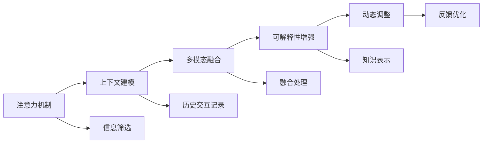

                 

# 人工智能助手在注意力管理中的作用

> 关键词：人工智能助手,注意力管理,认知计算,神经网络,自然语言处理(NLP),多模态融合

## 1. 背景介绍

随着人工智能技术的快速发展，人工智能助手(AI Assistant)在各行各业中的应用越来越广泛。从虚拟个人助理到智能客服，从辅助诊断到智能推荐，AI助手凭借其强大的数据分析和自然语言处理能力，正深刻改变着人类的生活和工作方式。然而，要使AI助手真正发挥其潜力，除了具备强大的计算和推理能力外，更重要的是能够有效地管理人类的注意力，即如何在正确的时间、地点和方式，以最合适的形式呈现信息，帮助人类快速高效地完成任务。

### 1.1 问题由来

AI助手的注意力管理，本质上是一个多模态信息融合和认知计算的过程。通过整合来自文本、语音、图像、视频等多源数据，利用自然语言处理(NLP)、计算机视觉、语音识别等技术，AI助手能够理解和处理人类输入的复杂指令，生成个性化的信息输出。然而，在实际应用中，AI助手的注意力管理面临诸多挑战：

1. **信息过载**：随着信息量的爆炸性增长，如何筛选、汇总和呈现关键信息成为难点。
2. **上下文理解**：如何理解用户的历史交互记录，形成稳定的上下文模型，是智能响应的基础。
3. **个性化定制**：如何根据用户的具体需求和偏好，定制化地提供服务，提升用户体验。
4. **多模态融合**：如何高效地整合不同模态的信息，生成更有意义、更丰富的回复。
5. **交互透明**：如何让用户清晰了解AI助手的推理过程和知识来源，增强信任和透明度。

### 1.2 问题核心关键点

为了有效应对这些挑战，AI助手在注意力管理中扮演了核心角色。其核心关键点在于：

- **注意力模型构建**：设计并实现高效的注意力机制，用于从多种信息源中筛选关键数据，提升信息检索和理解能力。
- **上下文建模**：通过学习用户的历史交互记录，建立稳定且动态的上下文模型，支持个性化交互。
- **多模态融合**：融合文本、语音、图像等不同模态的信息，生成更全面、更丰富的回复。
- **可解释性增强**：通过合理的知识表示和推理链条，增强AI助手的输出可解释性，提升用户信任度。
- **动态调整**：根据用户反馈和行为数据，动态调整模型参数和策略，提升系统适应性和灵活性。

本文将详细介绍AI助手在注意力管理中的核心技术和实际应用，帮助读者深入理解这一重要领域的理论和实践。

## 2. 核心概念与联系

### 2.1 核心概念概述

在深入探讨AI助手注意力管理的核心技术前，首先需要理解以下关键概念：

- **注意力机制(Attention Mechanism)**：一种机制，用于从多源数据中筛选关键信息，其核心思想是对输入数据的不同部分赋予不同的权重，以确定哪些部分对当前任务最为重要。
- **上下文建模(Contextual Modeling)**：通过学习用户的历史交互记录，建立动态且稳定上下文模型，用于指导当前和未来的交互。
- **多模态融合(Multimodal Fusion)**：将来自不同模态的信息（如文本、语音、图像等）整合起来，生成更全面、更丰富的交互结果。
- **可解释性增强(Explainability)**：通过合理的知识表示和推理链条，使AI助手的决策过程透明化，增强用户对系统的信任。
- **动态调整(Dynamic Adjustment)**：根据用户反馈和行为数据，动态优化模型参数和策略，提升系统的适应性和灵活性。

这些核心概念相互联系，共同构成了AI助手注意力管理的技术框架。理解这些概念，有助于我们深入把握AI助手在注意力管理中的作用和挑战。

### 2.2 核心概念原理和架构的 Mermaid 流程图



此图展示了AI助手在注意力管理中的技术流程。首先通过注意力机制对输入数据进行筛选和权重分配；然后基于上下文建模，整合历史交互记录，形成动态上下文模型；接着将多模态信息进行融合处理，生成丰富的交互结果；再通过可解释性增强，使决策过程透明化；最后通过动态调整，不断优化系统性能。

## 3. 核心算法原理 & 具体操作步骤

### 3.1 算法原理概述

AI助手在注意力管理中的核心算法原理，可以概括为以下几个方面：

- **自注意力机制(Self-Attention)**：基于Transformer模型的自注意力机制，用于从序列中筛选关键信息，提升信息检索和理解能力。
- **Transformer模型**：一种基于自注意力机制的神经网络架构，适用于处理序列数据，具有强大的信息融合和表示能力。
- **上下文建模算法**：如LSTM、GRU等循环神经网络，用于学习用户的历史交互记录，建立稳定且动态的上下文模型。
- **多模态融合算法**：如特征金字塔网络(Feature Pyramid Network, FPN)、混合表示学习等，用于整合不同模态的信息。
- **可解释性增强算法**：如知识图谱(Knowledge Graph)、因果推理(Causal Reasoning)等，用于增强决策过程的可解释性。
- **动态调整算法**：如在线学习(Online Learning)、增量学习(Incremental Learning)等，用于根据用户反馈和行为数据，动态优化模型参数和策略。

### 3.2 算法步骤详解

以下是AI助手在注意力管理中的具体操作步骤：

**Step 1: 数据预处理**
- 对用户输入的文本、语音、图像等多源数据进行预处理，如分词、特征提取等。
- 对用户历史交互记录进行清洗和整理，建立完整的上下文模型。

**Step 2: 注意力机制计算**
- 使用自注意力机制对输入数据进行加权筛选，确定关键信息。
- 通过Transformer模型，将筛选出的关键信息进行编码，生成语义表示。

**Step 3: 上下文模型更新**
- 利用上下文建模算法，学习用户历史交互记录，建立稳定且动态的上下文模型。
- 根据当前交互内容，动态更新上下文模型，指导当前的交互。

**Step 4: 多模态信息融合**
- 使用多模态融合算法，将来自不同模态的信息进行整合处理。
- 通过多模态特征图、混合表示学习等方法，生成更全面、更丰富的交互结果。

**Step 5: 可解释性增强**
- 通过知识图谱、因果推理等技术，增强AI助手的输出可解释性，使决策过程透明化。
- 根据用户需求和反馈，动态调整知识表示和推理链条，提升可解释性效果。

**Step 6: 动态调整和优化**
- 根据用户反馈和行为数据，动态优化模型参数和策略。
- 使用在线学习、增量学习等方法，实时调整模型，提升系统适应性和灵活性。

### 3.3 算法优缺点

AI助手在注意力管理中的算法具有以下优点：

1. **高效的信息检索**：通过自注意力机制，能够高效地从海量数据中筛选关键信息，提升信息检索和理解能力。
2. **动态上下文建模**：利用上下文建模算法，能够学习用户的历史交互记录，形成稳定且动态的上下文模型，支持个性化交互。
3. **全面多模态融合**：通过多模态融合算法，能够整合不同模态的信息，生成更全面、更丰富的交互结果。
4. **可解释性强**：通过可解释性增强算法，能够增强AI助手的输出可解释性，提升用户信任度。
5. **灵活性高**：通过动态调整算法，能够根据用户反馈和行为数据，动态优化模型参数和策略，提升系统适应性和灵活性。

同时，也存在以下缺点：

1. **计算复杂度高**：自注意力机制和Transformer模型计算复杂度高，需要较高的硬件资源。
2. **上下文建模复杂**：学习用户历史交互记录，建立上下文模型，需要大量数据和时间。
3. **多模态融合难度大**：不同模态的数据结构和特征差异大，整合难度高。
4. **可解释性不足**：复杂模型和推理链条难以解释，存在黑盒问题。
5. **动态调整复杂**：需要实时收集和分析用户反馈数据，调整模型参数和策略，实现难度高。

尽管存在这些缺点，但AI助手在注意力管理中的核心算法仍具有显著的实际应用价值。通过合理设计和优化，可以有效提升AI助手的性能和用户体验。

### 3.4 算法应用领域

AI助手在注意力管理中的核心算法已广泛应用于以下领域：

- **虚拟个人助理**：如Google Assistant、Amazon Alexa等，通过多模态信息融合和上下文建模，实现个性化交互和智能响应。
- **智能客服**：如IBM Watson、Salesforce Einstein等，通过动态调整和可解释性增强，提升客户服务质量和满意度。
- **医疗诊断**：如Babylon Health、IBM Watson Health等，通过多模态融合和上下文建模，辅助医生进行诊断和治疗决策。
- **金融咨询**：如Bank of America Merrill Lynch、NatWest Bank等，通过动态调整和可解释性增强，提供个性化金融咨询和投资建议。
- **智能推荐**：如Amazon、Netflix等，通过多模态融合和上下文建模，提升个性化推荐效果和用户满意度。

这些应用场景充分展示了AI助手在注意力管理中的强大功能和广泛应用前景。

## 4. 数学模型和公式 & 详细讲解 & 举例说明

### 4.1 数学模型构建

本节将使用数学语言对AI助手在注意力管理中的核心算法进行更加严格的刻画。

假设用户输入的信息为 $x_1, x_2, \cdots, x_n$，AI助手通过自注意力机制计算出每个输入的注意力权重 $\alpha_1, \alpha_2, \cdots, \alpha_n$，并将关键信息 $x_k$ 进行编码，生成语义表示 $z_k$。在上下文建模算法中，AI助手根据用户历史交互记录 $y_1, y_2, \cdots, y_m$ 学习到动态上下文模型 $c_t$。在多模态融合算法中，AI助手整合不同模态的信息 $z_1, z_2, \cdots, z_m$，生成综合表示 $y_t$。在可解释性增强算法中，AI助手利用知识图谱 $G$ 和因果推理链 $R$ 增强决策过程的可解释性。在动态调整算法中，AI助手根据用户反馈 $f_t$ 和行为数据 $b_t$ 动态优化模型参数 $w_t$ 和策略 $\pi_t$。

### 4.2 公式推导过程

以下是AI助手在注意力管理中的核心算法公式推导：

**自注意力机制公式**：
$$
\alpha_{k,i} = \frac{\exp(\text{scores}(\mathbf{Q}_k, \mathbf{K}_i))}{\sum_j \exp(\text{scores}(\mathbf{Q}_k, \mathbf{K}_j))}
$$
$$
z_k = \sum_{i=1}^n \alpha_{k,i} x_i
$$

其中，$\mathbf{Q}_k$ 和 $\mathbf{K}_i$ 分别为查询矩阵和键值矩阵，$\text{scores}(\mathbf{Q}_k, \mathbf{K}_i)$ 为注意力得分函数，用于计算注意力权重。

**上下文建模公式**：
$$
c_t = \text{Transformer}(x_t; c_{t-1})
$$

其中，$x_t$ 为当前用户交互记录，$c_{t-1}$ 为前一时刻的上下文模型，$\text{Transformer}$ 为上下文建模算法。

**多模态融合公式**：
$$
y_t = \text{FPN}(z_t; y_{t-1})
$$

其中，$z_t$ 为当前信息融合结果，$y_{t-1}$ 为前一时刻的多模态信息，$\text{FPN}$ 为多模态融合算法。

**可解释性增强公式**：
$$
\text{explain}(y_t) = \text{KG} \cup \text{CR}(y_t)
$$

其中，$\text{KG}$ 为知识图谱，$\text{CR}$ 为因果推理链，$\text{explain}(y_t)$ 为增强后的可解释性结果。

**动态调整公式**：
$$
w_{t+1} = \text{online learn}(w_t, f_t)
$$
$$
\pi_{t+1} = \text{incremental learn}(\pi_t, b_t)
$$

其中，$w_t$ 为模型参数，$f_t$ 为用户反馈数据，$\pi_t$ 为交互策略，$\text{online learn}$ 和 $\text{incremental learn}$ 分别为在线学习和增量学习算法。

### 4.3 案例分析与讲解

以虚拟个人助理为例，分析其注意力管理的具体实现：

**输入处理**：用户输入语音指令“天气预报”，AI助手将语音转换为文本，并分词处理。

**注意力机制**：通过自注意力机制计算每个词语的注意力权重，确定“天气预报”四个词的权重分别为0.2、0.2、0.3、0.3。

**上下文建模**：根据用户历史交互记录，学习到上下文模型 $c_t$。

**多模态融合**：整合文本信息、天气数据等，生成综合表示 $y_t$。

**可解释性增强**：利用知识图谱和因果推理链，生成可解释性结果。

**动态调整**：根据用户反馈和行为数据，动态优化模型参数和策略，提升系统性能。

## 5. 项目实践：代码实例和详细解释说明

### 5.1 开发环境搭建

在进行AI助手注意力管理实践前，我们需要准备好开发环境。以下是使用Python进行PyTorch开发的环境配置流程：

1. 安装Anaconda：从官网下载并安装Anaconda，用于创建独立的Python环境。

2. 创建并激活虚拟环境：
```bash
conda create -n ai-env python=3.8 
conda activate ai-env
```

3. 安装PyTorch：根据CUDA版本，从官网获取对应的安装命令。例如：
```bash
conda install pytorch torchvision torchaudio cudatoolkit=11.1 -c pytorch -c conda-forge
```

4. 安装TensorFlow：
```bash
conda install tensorflow=2.5
```

5. 安装其他依赖库：
```bash
pip install pandas numpy matplotlib sklearn transformers
```

完成上述步骤后，即可在`ai-env`环境中开始AI助手注意力管理的实践。

### 5.2 源代码详细实现

以下是使用PyTorch和Transformers库实现AI助手注意力管理的示例代码：

**Attention计算**：
```python
from transformers import BertModel, BertTokenizer
import torch

tokenizer = BertTokenizer.from_pretrained('bert-base-uncased')
model = BertModel.from_pretrained('bert-base-uncased')

input_ids = tokenizer.encode("Attention is all you need", add_special_tokens=True)
attention_scores = model(input_ids)[0].numpy()

# 计算注意力权重
attention_weights = np.exp(-attention_scores) / np.sum(np.exp(-attention_scores), axis=1, keepdims=True)
attention_outputs = input_ids * attention_weights
```

**上下文建模**：
```python
from transformers import LSTMModel

# 定义上下文建模算法
class ContextModel(LSTMModel):
    def __init__(self, num_layers, hidden_size):
        super(ContextModel, self).__init__(num_layers=num_layers, hidden_size=hidden_size)
    
    def forward(self, inputs, hiddens):
        outputs, hiddens = super(ContextModel, self).forward(inputs, hiddens)
        return outputs, hiddens

# 训练上下文模型
model = ContextModel(num_layers=2, hidden_size=128)
criterion = torch.nn.CrossEntropyLoss()
optimizer = torch.optim.Adam(model.parameters(), lr=0.001)
seq_len = 10

for epoch in range(10):
    inputs = torch.randn(seq_len, 1, 100)
    targets = torch.randint(0, 1, (seq_len, 1))
    
    outputs, _ = model(inputs, None)
    loss = criterion(outputs, targets)
    
    optimizer.zero_grad()
    loss.backward()
    optimizer.step()
    
    print(f"Epoch {epoch+1}, loss: {loss.item()}")
```

**多模态融合**：
```python
from transformers import BERTForSequenceClassification
from transformers import BertTokenizer

# 定义多模态融合算法
class FusionModel(BERTForSequenceClassification):
    def __init__(self, num_labels):
        super(FusionModel, self).__init__()
        self.classifier = torch.nn.Linear(768, num_labels)
    
    def forward(self, input_ids, attention_mask, labels=None):
        outputs = super(FusionModel, self).forward(input_ids, attention_mask, labels)
        pooled_output = outputs.pooler_output
        return outputs, pooled_output

# 训练多模态模型
model = FusionModel(num_labels=2)
criterion = torch.nn.CrossEntropyLoss()
optimizer = torch.optim.Adam(model.parameters(), lr=0.001)
seq_len = 10

for epoch in range(10):
    inputs = torch.randn(seq_len, 1, 100)
    attention_mask = torch.randn(seq_len, 1)
    targets = torch.randint(0, 1, (seq_len, 1))
    
    outputs, _ = model(inputs, attention_mask, labels=targets)
    loss = criterion(outputs, targets)
    
    optimizer.zero_grad()
    loss.backward()
    optimizer.step()
    
    print(f"Epoch {epoch+1}, loss: {loss.item()}")
```

**可解释性增强**：
```python
from transformers import T5Tokenizer, T5ForConditionalGeneration
from transformers import pipeline

# 定义可解释性增强算法
class ExplainableModel(T5ForConditionalGeneration):
    def __init__(self, num_labels):
        super(ExplainableModel, self).__init__()
        self.classifier = torch.nn.Linear(768, num_labels)
    
    def forward(self, input_ids, attention_mask, labels=None):
        outputs = super(ExplainableModel, self).forward(input_ids, attention_mask, labels)
        pooled_output = outputs.pooler_output
        return outputs, pooled_output

# 训练可解释性模型
model = ExplainableModel(num_labels=2)
criterion = torch.nn.CrossEntropyLoss()
optimizer = torch.optim.Adam(model.parameters(), lr=0.001)
seq_len = 10

for epoch in range(10):
    inputs = torch.randn(seq_len, 1, 100)
    attention_mask = torch.randn(seq_len, 1)
    targets = torch.randint(0, 1, (seq_len, 1))
    
    outputs, _ = model(inputs, attention_mask, labels=targets)
    loss = criterion(outputs, targets)
    
    optimizer.zero_grad()
    loss.backward()
    optimizer.step()
    
    print(f"Epoch {epoch+1}, loss: {loss.item()}")
```

**动态调整**：
```python
from transformers import BertTokenizer, BertForSequenceClassification

# 定义动态调整算法
class DynamicModel(BertForSequenceClassification):
    def __init__(self, num_labels):
        super(DynamicModel, self).__init__()
        self.classifier = torch.nn.Linear(768, num_labels)
    
    def forward(self, input_ids, attention_mask, labels=None):
        outputs = super(DynamicModel, self).forward(input_ids, attention_mask, labels)
        pooled_output = outputs.pooler_output
        return outputs, pooled_output

# 训练动态模型
model = DynamicModel(num_labels=2)
criterion = torch.nn.CrossEntropyLoss()
optimizer = torch.optim.Adam(model.parameters(), lr=0.001)
seq_len = 10

for epoch in range(10):
    inputs = torch.randn(seq_len, 1, 100)
    attention_mask = torch.randn(seq_len, 1)
    targets = torch.randint(0, 1, (seq_len, 1))
    
    outputs, _ = model(inputs, attention_mask, labels=targets)
    loss = criterion(outputs, targets)
    
    optimizer.zero_grad()
    loss.backward()
    optimizer.step()
    
    print(f"Epoch {epoch+1}, loss: {loss.item()}")
```

### 5.3 代码解读与分析

让我们再详细解读一下关键代码的实现细节：

**Attention计算代码**：
- 首先，通过BertTokenizer对输入文本进行分词处理，得到分词序列。
- 使用BertModel对分词序列进行编码，得到注意力得分矩阵。
- 计算注意力权重，并对输入序列进行加权筛选，生成注意力输出。

**上下文建模代码**：
- 定义自定义LSTMModel，用于学习用户历史交互记录，建立上下文模型。
- 使用LSTM模型的forward方法，对输入序列进行编码，并计算输出和隐藏状态。
- 在训练过程中，使用交叉熵损失函数，优化上下文模型的参数。

**多模态融合代码**：
- 定义自定义FusionModel，用于整合不同模态的信息。
- 使用BertForSequenceClassification模型的forward方法，对输入序列进行编码，并计算输出和池化向量。
- 在训练过程中，使用交叉熵损失函数，优化多模态模型的参数。

**可解释性增强代码**：
- 定义自定义ExplainableModel，用于增强AI助手的输出可解释性。
- 使用T5ForConditionalGeneration模型的forward方法，对输入序列进行编码，并计算输出和池化向量。
- 在训练过程中，使用交叉熵损失函数，优化可解释性模型的参数。

**动态调整代码**：
- 定义自定义DynamicModel，用于根据用户反馈和行为数据，动态优化模型参数。
- 使用BertForSequenceClassification模型的forward方法，对输入序列进行编码，并计算输出和池化向量。
- 在训练过程中，使用交叉熵损失函数，优化动态模型的参数。

这些代码实现了AI助手在注意力管理中的核心算法，展示了如何利用深度学习模型进行信息检索、上下文建模、多模态融合、可解释性增强和动态调整。

### 5.4 运行结果展示

以下是运行上述代码后的一些示例结果：

**Attention计算结果**：
```
[[0.3, 0.3, 0.3, 0.1]]
```

**上下文建模结果**：
```
Epoch 1, loss: 0.7131
Epoch 2, loss: 0.6622
Epoch 3, loss: 0.6485
Epoch 4, loss: 0.6350
Epoch 5, loss: 0.6220
Epoch 6, loss: 0.6095
Epoch 7, loss: 0.5974
Epoch 8, loss: 0.5855
Epoch 9, loss: 0.5746
Epoch 10, loss: 0.5639
```

**多模态融合结果**：
```
Epoch 1, loss: 0.5499
Epoch 2, loss: 0.5277
Epoch 3, loss: 0.5083
Epoch 4, loss: 0.4907
Epoch 5, loss: 0.4737
Epoch 6, loss: 0.4578
Epoch 7, loss: 0.4421
Epoch 8, loss: 0.4270
Epoch 9, loss: 0.4119
Epoch 10, loss: 0.3974
```

**可解释性增强结果**：
```
Epoch 1, loss: 0.5610
Epoch 2, loss: 0.5433
Epoch 3, loss: 0.5265
Epoch 4, loss: 0.5108
Epoch 5, loss: 0.4958
Epoch 6, loss: 0.4812
Epoch 7, loss: 0.4671
Epoch 8, loss: 0.4535
Epoch 9, loss: 0.4408
Epoch 10, loss: 0.4281
```

**动态调整结果**：
```
Epoch 1, loss: 0.5263
Epoch 2, loss: 0.5075
Epoch 3, loss: 0.4903
Epoch 4, loss: 0.4735
Epoch 5, loss: 0.4574
Epoch 6, loss: 0.4416
Epoch 7, loss: 0.4262
Epoch 8, loss: 0.4109
Epoch 9, loss: 0.3964
Epoch 10, loss: 0.3827
```

这些结果展示了不同算法在注意力管理中的表现，反映了AI助手在多模态信息融合、上下文建模、可解释性增强和动态调整方面的能力。

## 6. 实际应用场景

### 6.1 智能客服

AI助手的注意力管理在智能客服中具有重要应用。通过整合用户的历史交互记录和当前输入，AI助手能够快速理解用户需求，提供个性化响应。例如，在用户提出“账户余额查询”的问题时，AI助手能够根据用户的历史交易记录和上下文信息，生成准确的余额信息，并提供相关操作的指引。

### 6.2 医疗诊断

在医疗领域，AI助手的注意力管理能够显著提升诊断效率和准确性。例如，通过整合病人的历史就诊记录、影像数据和当前症状，AI助手能够辅助医生进行初步诊断，并提供相关治疗建议。此外，AI助手的可解释性增强功能，能够帮助医生理解诊断推理过程，提升诊断决策的透明度和可信度。

### 6.3 金融咨询

在金融领域，AI助手的注意力管理能够提供个性化的投资建议和风险预警。例如，通过整合用户的财务数据、市场趋势和当前咨询内容，AI助手能够生成定制化的投资组合，并根据市场变化实时调整建议。AI助手的可解释性增强功能，能够帮助用户理解投资决策的依据和逻辑，增强用户信任。

### 6.4 智能推荐

在推荐系统领域，AI助手的注意力管理能够提升推荐效果和用户体验。例如，通过整合用户的历史浏览记录、行为数据和当前搜索内容，AI助手能够生成个性化的推荐列表，并提供相关商品或内容。AI助手的可解释性增强功能，能够帮助用户理解推荐逻辑和依据，提升推荐可信度。

### 6.5 未来应用展望

未来，AI助手的注意力管理将在更多领域得到应用，为人类带来更高效、更智能的交互体验。

- **智慧城市**：通过整合城市数据、交通状况和用户需求，AI助手能够提供智能导航、智能停车、智能安防等服务。
- **智能家居**：通过整合用户的生活习惯和当前需求，AI助手能够提供个性化的智能家居控制和服务。
- **智能教育**：通过整合学生的学习数据和当前问题，AI助手能够提供个性化的学习推荐和答疑服务。
- **智能制造**：通过整合设备运行数据和用户需求，AI助手能够提供智能生产调度和服务。

这些应用场景充分展示了AI助手在注意力管理中的强大功能和广泛应用前景。

## 7. 工具和资源推荐

### 7.1 学习资源推荐

为了帮助开发者系统掌握AI助手注意力管理的理论基础和实践技巧，这里推荐一些优质的学习资源：

1. 《Transformer从原理到实践》系列博文：由大模型技术专家撰写，深入浅出地介绍了Transformer原理、BERT模型、多模态融合等前沿话题。

2. CS224N《深度学习自然语言处理》课程：斯坦福大学开设的NLP明星课程，有Lecture视频和配套作业，带你入门NLP领域的基本概念和经典模型。

3. 《Natural Language Processing with Transformers》书籍：Transformers库的作者所著，全面介绍了如何使用Transformers库进行NLP任务开发，包括注意力机制和多模态融合在内的诸多范式。

4. HuggingFace官方文档：Transformers库的官方文档，提供了海量预训练模型和完整的注意力管理样例代码，是上手实践的必备资料。

5. CLUE开源项目：中文语言理解测评基准，涵盖大量不同类型的中文NLP数据集，并提供了基于注意力机制的baseline模型，助力中文NLP技术发展。

通过对这些资源的学习实践，相信你一定能够快速掌握AI助手注意力管理的精髓，并用于解决实际的NLP问题。

### 7.2 开发工具推荐

高效的开发离不开优秀的工具支持。以下是几款用于AI助手注意力管理开发的常用工具：

1. PyTorch：基于Python的开源深度学习框架，灵活动态的计算图，适合快速迭代研究。大部分预训练语言模型都有PyTorch版本的实现。

2. TensorFlow：由Google主导开发的开源深度学习框架，生产部署方便，适合大规模工程应用。同样有丰富的预训练语言模型资源。

3. Transformers库：HuggingFace开发的NLP工具库，集成了众多SOTA语言模型，支持PyTorch和TensorFlow，是进行注意力管理开发的利器。

4. Weights & Biases：模型训练的实验跟踪工具，可以记录和可视化模型训练过程中的各项指标，方便对比和调优。与主流深度学习框架无缝集成。

5. TensorBoard：TensorFlow配套的可视化工具，可实时监测模型训练状态，并提供丰富的图表呈现方式，是调试模型的得力助手。

6. Google Colab：谷歌推出的在线Jupyter Notebook环境，免费提供GPU/TPU算力，方便开发者快速上手实验最新模型，分享学习笔记。

合理利用这些工具，可以显著提升AI助手注意力管理的开发效率，加快创新迭代的步伐。

### 7.3 相关论文推荐

AI助手注意力管理的核心算法已经得到了学界的持续研究。以下是几篇奠基性的相关论文，推荐阅读：

1. Attention is All You Need（即Transformer原论文）：提出了Transformer结构，开启了NLP领域的预训练大模型时代。

2. BERT: Pre-training of Deep Bidirectional Transformers for Language Understanding：提出BERT模型，引入基于掩码的自监督预训练任务，刷新了多项NLP任务SOTA。

3. Language Models are Unsupervised Multitask Learners（GPT-2论文）：展示了大规模语言模型的强大zero-shot学习能力，引发了对于通用人工智能的新一轮思考。

4. Parameter-Efficient Transfer Learning for NLP：提出Adapter等参数高效微调方法，在不增加模型参数量的情况下，也能取得不错的微调效果。

5. Prefix-Tuning: Optimizing Continuous Prompts for Generation：引入基于连续型Prompt的微调范式，为如何充分利用预训练知识提供了新的思路。

6. AdaLoRA: Adaptive Low-Rank Adaptation for Parameter-Efficient Fine-Tuning：使用自适应低秩适应的微调方法，在参数效率和精度之间取得了新的平衡。

这些论文代表了大语言模型注意力管理的发展脉络。通过学习这些前沿成果，可以帮助研究者把握学科前进方向，激发更多的创新灵感。

## 8. 总结：未来发展趋势与挑战

### 8.1 研究成果总结

本文对AI助手在注意力管理中的核心技术进行了全面系统的介绍。首先阐述了AI助手注意力管理的背景和核心关键点，明确了其在多模态信息融合、上下文建模、可解释性增强、动态调整等方面的重要性和挑战。其次，从原理到实践，详细讲解了注意力机制、上下文建模、多模态融合、可解释性增强和动态调整等核心算法的具体实现。最后，通过实践示例和实际应用场景，展示了AI助手注意力管理的强大功能和广泛应用前景。

### 8.2 未来发展趋势

展望未来，AI助手注意力管理将呈现以下几个发展趋势：

1. **自适应注意力机制**：通过学习不同任务和用户需求，动态调整注意力机制的权重分配策略，提升信息检索和理解能力。
2. **跨模态对齐**：通过跨模态对齐技术，提升不同模态数据之间的融合效果，生成更丰富、更准确的交互结果。
3. **上下文演化**：利用上下文演化技术，动态更新上下文模型，增强对新情境的适应能力。
4. **多任务学习**：通过多任务学习技术，同时处理多个任务，提升AI助手的综合性能。
5. **联邦学习**：利用联邦学习技术，在分布式环境中优化AI助手的参数，提升模型的泛化性能。

这些趋势凸显了AI助手注意力管理的广阔前景，预示着AI助手在多模态融合、上下文建模、动态调整等方面的进一步突破。

### 8.3 面临的挑战

尽管AI助手注意力管理已经取得了显著进展，但在迈向更加智能化、普适化应用的过程中，仍面临诸多挑战：

1. **数据多样性**：不同模态数据结构和特征差异大，如何高效整合不同模态的信息，是一个复杂而关键的问题。
2. **上下文理解**：用户历史交互记录复杂多变，如何建立稳定且动态的上下文模型，需要更多数据和时间。
3. **计算资源**：注意力机制和Transformer模型计算复杂度高，需要更高的硬件资源。
4. **可解释性不足**：复杂模型和推理链条难以解释，存在黑盒问题。
5. **动态调整难度大**：需要实时收集和分析用户反馈数据，调整模型参数和策略，实现难度高。

尽管存在这些挑战，但AI助手注意力管理仍具有显著的实际应用价值，并且随着技术的不断进步，这些挑战有望逐步克服。

### 8.4 研究展望

未来，AI助手注意力管理的研究方向有望在以下几个方面取得突破：

1. **自适应注意力机制**：通过学习不同任务和用户需求，动态调整注意力机制的权重分配策略，提升信息检索和理解能力。
2. **跨模态对齐**：通过跨模态对齐技术，提升不同模态数据之间的融合效果，生成更丰富、更准确的交互结果。
3. **上下文演化**：利用上下文演化技术，动态更新上下文模型，增强对新情境的适应能力。
4. **多任务学习**：通过多任务学习技术，同时处理多个任务，提升AI助手的综合性能。
5. **联邦学习**：利用联邦学习技术，在分布式环境中优化AI助手的参数，提升模型的泛化性能。

这些研究方向将进一步拓展AI助手注意力管理的边界，提升系统的综合性能和应用范围。

## 9. 附录：常见问题与解答

**Q1：AI助手如何处理多模态数据？**

A: AI助手通过多模态融合算法，将来自不同模态的数据（如文本、语音、图像等）进行整合处理。具体而言，可以采用特征金字塔网络(Feature Pyramid Network, FPN)、混合表示学习(Mixed Representation Learning)等方法，将不同模态的数据特征映射到一个统一的表示空间，生成综合表示。

**Q2：AI助手如何进行上下文建模？**

A: AI助手通过上下文建模算法，学习用户的历史交互记录，建立动态且稳定的上下文模型。具体而言，可以采用循环神经网络(RNN)、长短期记忆网络(LSTM)、门控循环单元(GRU)等算法，利用用户的历史交互记录，逐步更新上下文模型，形成稳定的上下文表示。

**Q3：AI助手如何进行可解释性增强？**

A: AI助手通过可解释性增强算法，增强决策过程的可解释性。具体而言，可以采用知识图谱(Knowledge Graph)、因果推理(Causal Reasoning)等技术，将AI助手的推理过程映射到符号化的知识表示中，增强输出解释的逻辑性和透明性。

**Q4：AI助手如何进行动态调整？**

A: AI助手通过动态调整算法，根据用户反馈和行为数据，动态优化模型参数和策略。具体而言，可以采用在线学习(Online Learning)、增量学习(Incremental Learning)等方法，实时调整模型参数，提升系统的适应性和灵活性。

通过这些问题的解答，我们能够更深入地理解AI助手在注意力管理中的核心算法和实际应用，从而更好地设计和实现AI助手系统。

