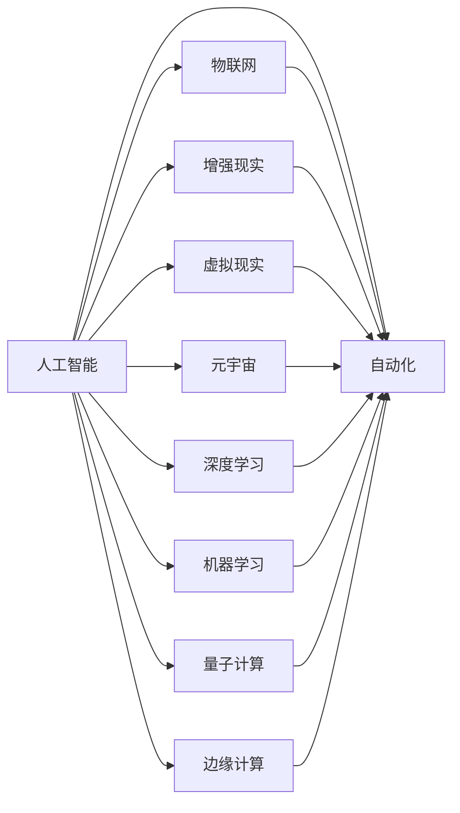

                 

# 人工智能在2050年的应用与发展

> 关键词：人工智能, 自动化, 物联网, 机器人, 增强现实, 虚拟现实, 元宇宙, 深度学习, 机器学习, 量子计算, 边缘计算

## 1. 背景介绍

### 1.1 问题由来

自20世纪下半叶以来，人工智能（AI）以其独特的技术优势和应用潜力，对人类社会的进步和发展产生了深远影响。从20世纪90年代的人工智能热潮，到21世纪初大数据和云计算的兴起，再到近年来深度学习与量子计算的突破，AI技术正以越来越快的速度融入人们的日常生活与工作。

展望未来，2050年的AI发展将展现更为广阔的应用前景。AI技术将与物联网、5G网络、量子计算等新兴技术融合，为各个领域带来深刻的变革。本文将从背景与现状出发，探讨未来AI的发展趋势，及其实际应用场景，为读者描绘出一幅2050年人工智能的全景图。

### 1.2 问题核心关键点

人工智能的未来发展主要围绕以下几个关键点展开：

- **智能技术的融合与发展**：AI与物联网、量子计算、边缘计算等技术的深度融合，将大幅提升智能系统的响应速度和处理能力。
- **人机交互模式的创新**：增强现实（AR）、虚拟现实（VR）等技术的普及，将为人类带来全新的交互体验，提升人机协同效率。
- **AI伦理与安全**：随着AI技术的普及，如何保障其公平性、透明性及安全性，将是未来发展的重点。
- **AI应用的跨界拓展**：AI将跨界应用于教育、医疗、工业等多个领域，助力行业数字化转型。
- **智能化城市的构建**：智慧城市建设将通过AI技术实现全方位、全过程智能化管理，提升城市治理水平。

以上关键点构成了2050年人工智能应用与发展的基石，使AI技术在多个维度全面渗透，并在各个领域发挥核心驱动作用。

## 2. 核心概念与联系

### 2.1 核心概念概述

为更全面理解人工智能的未来应用与发展，本节将介绍几个核心概念及其相互联系：

- **人工智能（AI）**：通过计算机系统模拟人类智能，实现机器学习、感知、决策、语言理解等智能过程。
- **自动化（Auto）**：利用AI技术实现自动化生产、服务、管理等过程，减少人力投入，提高效率。
- **物联网（IoT）**：将各种物理设备通过互联网连接起来，实现智能化管理和远程控制。
- **增强现实（AR）**：通过虚拟信息与真实环境结合，增强人类对现实世界的感知和交互能力。
- **虚拟现实（VR）**：构建完全由计算机生成的三维虚拟环境，为用户提供沉浸式体验。
- **元宇宙（Metaverse）**：通过区块链、虚拟现实等技术构建的虚拟空间，实现数字身份与现实世界的深度融合。
- **深度学习（DL）**：利用神经网络结构，模拟人类深度认知过程，解决复杂非线性问题。
- **机器学习（ML）**：通过数据驱动的学习过程，使计算机系统具备自我提升能力。
- **量子计算（QC）**：利用量子力学的原理，实现信息处理的高效化，解决传统计算难以处理的复杂问题。
- **边缘计算（Edge Computing）**：将计算能力从中心节点下放到边缘设备，提升数据处理的时效性。

这些核心概念之间相互联系，共同构成了未来AI发展的技术框架。

### 2.2 核心概念原理和架构的 Mermaid 流程图



该图展示了人工智能与其他核心概念之间的联系，说明了AI技术通过与物联网、AR、VR、DL、ML、QC和Edge Computing的结合，实现智能自动化、智能化交互和实时处理等核心功能。

## 3. 核心算法原理 & 具体操作步骤

### 3.1 算法原理概述

未来的人工智能发展，将聚焦于以下几个核心算法原理：

- **深度学习（DL）**：通过神经网络结构和多层感知器，模拟人脑的感知与识别能力，实现图像、语音、自然语言处理等任务。
- **机器学习（ML）**：利用统计学和优化技术，使系统能够从数据中学习规律，优化决策模型。
- **强化学习（RL）**：通过与环境的交互，使系统通过试错不断优化行为策略。
- **迁移学习（TL）**：利用已有知识加速新任务的学习，提高模型的泛化能力。
- **自监督学习（SSL）**：通过大量未标注数据进行自我监督学习，获得有意义的特征表示。
- **无监督学习（UL）**：从数据本身寻找结构，无需标注即可学习。

这些算法原理的深度融合，将推动未来AI技术的进步。

### 3.2 算法步骤详解

未来人工智能的应用与发展，涉及以下几个关键步骤：

**Step 1: 数据采集与预处理**

1. **数据采集**：通过各种传感器、设备获取真实世界的各种数据，包括文本、图像、音频等。
2. **数据清洗**：处理缺失数据、异常值，确保数据质量。
3. **数据标注**：对部分数据进行人工标注，为训练模型提供监督信号。

**Step 2: 模型训练与优化**

1. **模型选择**：根据任务需求选择合适的模型结构，如CNN、RNN、Transformer等。
2. **数据划分**：将数据划分为训练集、验证集和测试集。
3. **模型训练**：使用深度学习框架进行模型训练，优化模型参数。
4. **性能评估**：在验证集上评估模型性能，调整模型参数。

**Step 3: 模型部署与测试**

1. **模型部署**：将训练好的模型部署到生产环境中。
2. **性能监测**：实时监测模型在实际环境中的表现。
3. **模型更新**：根据新数据和反馈不断更新模型，保持其时效性。

### 3.3 算法优缺点

未来人工智能的算法优势与缺点如下：

**优点**：

- **高效处理复杂问题**：AI算法能够处理海量数据和复杂问题，提升决策速度与质量。
- **自我提升与优化**：通过学习和优化，AI算法能够不断改进性能，适应新的应用场景。
- **跨界应用广泛**：AI技术广泛应用于教育、医疗、工业等多个领域，推动行业数字化转型。

**缺点**：

- **数据依赖性强**：模型的性能依赖于高质量的数据，数据采集与标注成本较高。
- **计算资源需求高**：深度学习与量子计算等算法对计算资源的需求高，增加了系统成本。
- **公平性与安全性**：AI模型可能存在偏见和歧视，安全性问题需进一步保障。
- **复杂度与可解释性**：模型结构复杂，难以解释其内部决策逻辑，增加了模型部署和维护难度。

### 3.4 算法应用领域

未来人工智能的应用领域包括：

1. **智能制造**：AI技术应用于生产线自动化、质量检测、智能调度等，提升制造业效率。
2. **智能医疗**：通过图像识别、自然语言处理等技术，辅助医生进行疾病诊断与治疗。
3. **智能交通**：AI技术应用于自动驾驶、交通流量监测、智能导航等，提升交通安全与效率。
4. **智能金融**：通过智能投研、风险管理、客户服务等应用，提升金融服务的精准性与效率。
5. **智能教育**：利用AI技术进行个性化教育、智能辅导、学习分析等，提升教育质量。
6. **智能家居**：通过语音识别、图像处理等技术，实现家居设备的智能互联与控制。
7. **智能零售**：利用AI进行商品推荐、库存管理、顾客行为分析等，提升零售业智能化水平。
8. **智慧城市**：通过AI技术实现城市交通管理、环境监测、能源优化等，提升城市治理能力。
9. **环境保护**：AI技术应用于气候预测、环境监测、污染治理等，推动环保工作。
10. **社会治理**：利用AI技术进行公共安全、社区管理、社会心理分析等，提升社会治理水平。

以上领域展示了未来人工智能技术的广泛应用，预示着未来社会的全面智能化与数字化。

## 4. 数学模型和公式 & 详细讲解 & 举例说明

### 4.1 数学模型构建

未来AI的数学模型构建将更加注重与实际应用的紧密结合，以下是几个典型的数学模型构建案例：

**案例一：智能交通信号控制**

1. **问题描述**：在交通高峰期，如何通过信号灯控制，优化交通流量。
2. **模型构建**：建立交通网络图模型，通过深度学习模型预测交通流量，优化信号灯控制策略。
3. **公式推导**：
   $$
   \hat{y} = f(x; \theta)
   $$
   其中 $x$ 为交通流量数据，$y$ 为信号灯控制策略，$f$ 为深度学习模型，$\theta$ 为模型参数。

**案例二：智能推荐系统**

1. **问题描述**：用户浏览网页时，如何推荐其可能感兴趣的内容。
2. **模型构建**：构建用户行为图模型，通过深度学习模型预测用户兴趣，推荐相关内容。
3. **公式推导**：
   $$
   \hat{y} = f(x; \theta)
   $$
   其中 $x$ 为用户行为数据，$y$ 为用户感兴趣的内容，$f$ 为深度学习模型，$\theta$ 为模型参数。

### 4.2 公式推导过程

以下以智能推荐系统为例，推导推荐模型的预测公式：

假设推荐模型为神经网络结构，输入为 $x = [x_1, x_2, ..., x_n]$，表示用户的历史行为数据。模型的预测结果 $\hat{y}$ 由下式给出：

$$
\hat{y} = f(x; \theta) = \sigma(W \cdot x + b)
$$

其中 $W$ 和 $b$ 为模型参数，$\sigma$ 为激活函数。对于二分类问题，可以将其转换为 $0/1$ 输出，用于表示用户是否对某内容感兴趣。

### 4.3 案例分析与讲解

智能推荐系统作为AI应用的典型场景，展示了AI如何通过数据驱动，提升用户体验与推荐准确性。利用用户行为数据，推荐模型能够在保证用户隐私的同时，提高个性化推荐的精度，推动电商、社交媒体等领域的发展。

## 5. 项目实践：代码实例和详细解释说明

### 5.1 开发环境搭建

为了构建智能推荐系统，本文推荐使用以下开发环境：

1. **Python**：作为主要的编程语言，Python拥有丰富的数据处理、深度学习库。
2. **PyTorch**：基于动态计算图，支持快速迭代与模型调试。
3. **TensorFlow**：基于静态计算图，适合生产部署与模型优化。
4. **Jupyter Notebook**：便于数据可视化与代码共享。
5. **Keras**：高层次深度学习库，支持快速搭建神经网络模型。
6. **Scikit-Learn**：用于数据预处理与特征工程。

搭建开发环境的具体步骤如下：

1. 安装Python和相关依赖包：
   ```
   pip install numpy pandas matplotlib scikit-learn tensorboard pytorch torchvision torchtext
   ```

2. 配置Jupyter Notebook环境：
   ```
   jupyter notebook
   ```

3. 创建虚拟环境：
   ```
   conda create -n myenv python=3.8
   conda activate myenv
   ```

4. 安装TensorFlow和PyTorch：
   ```
   pip install tensorflow pytorch torchvision torchtext
   ```

### 5.2 源代码详细实现

以下是一个简单的智能推荐系统的代码实现示例：

**用户行为数据类**：

```python
class UserBehavior:
    def __init__(self, user_id, behavior_data):
        self.user_id = user_id
        self.behavior_data = behavior_data

    def get_feature(self):
        return self.behavior_data
```

**推荐模型类**：

```python
import torch
import torch.nn as nn
import torch.optim as optim

class RecommendationModel(nn.Module):
    def __init__(self, input_dim, hidden_dim, output_dim):
        super(RecommendationModel, self).__init__()
        self.hidden_layer = nn.Linear(input_dim, hidden_dim)
        self.output_layer = nn.Linear(hidden_dim, output_dim)

    def forward(self, x):
        x = torch.relu(self.hidden_layer(x))
        x = torch.sigmoid(self.output_layer(x))
        return x
```

**模型训练函数**：

```python
def train_model(model, train_data, test_data, epochs, batch_size):
    optimizer = optim.Adam(model.parameters(), lr=0.01)
    loss_fn = nn.BCELoss()

    for epoch in range(epochs):
        model.train()
        for data, labels in train_data:
            optimizer.zero_grad()
            output = model(data)
            loss = loss_fn(output, labels)
            loss.backward()
            optimizer.step()

        model.eval()
        with torch.no_grad():
            correct = 0
            total = 0
            for data, labels in test_data:
                output = model(data)
                _, predicted = torch.max(output.data, 1)
                total += labels.size(0)
                correct += (predicted == labels).sum().item()

            accuracy = 100 * correct / total
            print(f"Epoch {epoch+1}, accuracy: {accuracy:.2f}%")
```

### 5.3 代码解读与分析

在上述代码中，`UserBehavior`类用于表示用户行为数据，包含用户ID和行为数据。`RecommendationModel`类定义了一个简单的推荐模型，由一个隐藏层和一个输出层组成，用于预测用户是否对某内容感兴趣。训练函数 `train_model` 使用Adam优化器，通过二元交叉熵损失函数进行模型训练，并在测试集上评估模型准确率。

## 6. 实际应用场景

### 6.1 智能制造

AI在智能制造中的应用广泛，主要体现在以下几个方面：

1. **智能生产调度**：利用AI算法进行生产过程优化，动态调整生产线，提升生产效率。
2. **质量检测与控制**：通过图像识别和机器学习技术，检测产品缺陷，实现自动化质量控制。
3. **设备维护与管理**：通过预测性维护模型，预测设备故障，优化维护计划。

### 6.2 智能医疗

AI在智能医疗中的应用包括：

1. **疾病诊断与治疗**：通过图像识别、自然语言处理等技术，辅助医生进行疾病诊断与治疗。
2. **健康监测与管理**：利用可穿戴设备收集数据，通过AI模型进行健康监测与分析，提供个性化健康管理建议。
3. **药物研发**：通过AI算法进行药物分子设计、药效预测，加速新药研发进程。

### 6.3 智能交通

AI在智能交通中的应用包括：

1. **自动驾驶**：通过AI技术实现自动驾驶，提高道路安全与通行效率。
2. **交通流量管理**：利用AI算法进行交通流量预测与优化，减少交通拥堵。
3. **智能导航**：通过AI技术进行路径规划与导航，提升出行体验。

### 6.4 未来应用展望

未来，随着AI技术的进一步发展，其应用领域将更加广泛，涉及教育、金融、农业等多个领域，带来深远影响：

1. **智能教育**：通过AI技术进行个性化教学与辅导，提升教育质量与效率。
2. **智能金融**：通过AI技术进行风险管理、智能投研，提升金融服务的精准性与效率。
3. **智能农业**：利用AI技术进行作物种植、病虫害预测与控制，提高农业生产效率。
4. **环境保护**：通过AI技术进行气候预测、环境监测、污染治理，推动环保工作。

## 7. 工具和资源推荐

### 7.1 学习资源推荐

为帮助读者系统掌握AI技术，以下是一些优质的学习资源：

1. **《深度学习》（Ian Goodfellow）**：深度学习领域的经典教材，涵盖深度学习的基础理论与应用。
2. **《机器学习实战》（Peter Harrington）**：实用的机器学习编程教程，提供大量实战项目案例。
3. **Coursera机器学习课程**：由斯坦福大学Andrew Ng教授开设，系统讲解机器学习基础与算法。
4. **Kaggle竞赛**：利用Kaggle竞赛平台，实践机器学习与深度学习项目，提升实战能力。
5. **Google AI博客**：Google AI团队定期发布深度学习与AI技术的最新进展与研究。

### 7.2 开发工具推荐

以下推荐的工具可用于AI项目开发：

1. **PyTorch**：基于动态计算图，支持快速迭代与模型调试。
2. **TensorFlow**：基于静态计算图，适合生产部署与模型优化。
3. **TensorBoard**：可视化工具，可实时监测模型训练状态，提供丰富的图表呈现方式。
4. **Jupyter Notebook**：便于数据可视化与代码共享。
5. **Keras**：高层次深度学习库，支持快速搭建神经网络模型。
6. **Scikit-Learn**：用于数据预处理与特征工程。

### 7.3 相关论文推荐

未来AI技术的最新研究进展，可通过以下论文获得：

1. **《Transformer模型：注意力机制的突破》（Vaswani et al.）**：提出Transformer结构，为深度学习领域带来重大突破。
2. **《大规模深度学习模型在图像识别上的效果》（He et al.）**：展示大规模深度学习模型在图像识别任务上的优越表现。
3. **《深度强化学习在AlphaGo中的应用》（Silver et al.）**：通过强化学习，实现AlphaGo在围棋领域的突破。
4. **《无监督表示学习》（Hinton et al.）**：探讨无监督学习在数据表示学习中的应用。
5. **《量子计算在机器学习中的应用》（Lloyd et al.）**：讨论量子计算在机器学习领域的应用前景。

## 8. 总结：未来发展趋势与挑战

### 8.1 研究成果总结

未来AI的发展主要聚焦于以下几个方面：

1. **自动化与智能化**：AI技术在制造业、医疗、交通等领域的应用，将极大提升生产效率与服务质量。
2. **多模态融合**：将视觉、听觉、触觉等多模态信息融合，提升人机交互体验。
3. **跨界应用拓展**：AI技术在农业、教育、环境保护等领域的应用，将推动行业数字化转型。
4. **智能化城市建设**：通过AI技术实现城市智能化管理，提升城市治理水平。
5. **数据安全与隐私**：随着AI应用普及，数据安全与隐私保护成为关键问题。
6. **伦理与社会责任**：AI技术的公平性、透明性与伦理责任需进一步研究。

### 8.2 未来发展趋势

未来AI的发展趋势包括：

1. **AI与IoT深度融合**：通过IoT设备收集数据，利用AI算法进行实时处理与分析，提升智能系统的响应速度。
2. **AR与VR普及**：AR与VR技术将广泛应用，提升人机交互体验，带来新一轮技术变革。
3. **边缘计算普及**：边缘计算将使AI算法在本地设备上实现高效处理，减少数据传输与延迟。
4. **量子计算突破**：量子计算将解决复杂问题，带来计算能力的革命性提升。
5. **元宇宙发展**：通过元宇宙技术，构建虚拟现实与现实世界深度融合的空间。

### 8.3 面临的挑战

未来AI的发展面临以下挑战：

1. **数据获取与标注**：高质量数据与标注成本高，限制AI模型的应用范围。
2. **计算资源需求**：深度学习与量子计算对计算资源的需求高，增加了系统成本。
3. **模型公平性与安全性**：AI模型可能存在偏见与歧视，需保障模型公平性与安全性。
4. **模型可解释性**：深度学习模型复杂，难以解释其内部决策逻辑，增加了模型部署与维护难度。
5. **伦理与社会责任**：AI技术的公平性、透明性与伦理责任需进一步研究。

### 8.4 研究展望

未来AI研究的主要方向包括：

1. **AI与IoT融合**：研究AI与IoT技术的深度融合，提升智能系统的实时处理能力。
2. **AR与VR技术**：研究AR与VR技术在多模态交互中的应用，提升人机协同效率。
3. **边缘计算**：研究边缘计算技术，实现AI算法在本地设备的处理与优化。
4. **量子计算**：研究量子计算在AI中的应用，解决复杂问题。
5. **元宇宙**：研究元宇宙技术在虚拟现实与现实世界的深度融合。
6. **AI伦理与社会责任**：研究AI技术的公平性、透明性与伦理责任，保障AI系统的健康发展。

## 9. 附录：常见问题与解答

**Q1：如何构建智能交通系统？**

A: 智能交通系统构建涉及多个步骤：

1. **数据采集**：通过传感器、摄像头等设备，实时采集交通数据。
2. **数据预处理**：清洗与处理数据，确保数据质量。
3. **模型训练**：选择合适的模型结构，如神经网络，通过大量交通数据进行训练。
4. **模型部署**：将训练好的模型部署到交通管理系统中，实现智能交通控制。

**Q2：AI在医疗领域的应用有哪些？**

A: AI在医疗领域的应用包括：

1. **疾病诊断**：通过图像识别技术，辅助医生进行疾病诊断。
2. **健康监测**：利用可穿戴设备收集数据，通过AI模型进行健康监测与分析。
3. **药物研发**：利用AI算法进行药物分子设计、药效预测，加速新药研发进程。

**Q3：未来AI在教育领域的应用前景如何？**

A: 未来AI在教育领域的应用前景广阔：

1. **个性化教育**：通过AI技术进行个性化教学与辅导，提升教育质量。
2. **智能辅导**：利用AI算法进行智能辅导，帮助学生解决学习难题。
3. **学习分析**：通过AI技术进行学习行为分析，提供个性化学习建议。

**Q4：AI在环境保护领域的应用有哪些？**

A: AI在环境保护领域的应用包括：

1. **气候预测**：利用AI技术进行气候预测，优化环境政策。
2. **环境监测**：通过AI算法进行环境监测，发现污染源。
3. **污染治理**：利用AI技术进行污染治理，提升环境质量。

**Q5：AI伦理与安全问题如何解决？**

A: AI伦理与安全问题的解决需从多方面入手：

1. **公平性**：通过数据平衡与模型公平性约束，确保AI模型的公平性。
2. **透明性**：提高AI模型的透明性与可解释性，增强用户信任。
3. **安全性**：采用安全防护措施，防止AI模型的滥用与误用。
4. **伦理约束**：建立AI伦理准则与规范，保障AI技术的应用责任。

作者：禅与计算机程序设计艺术 / Zen and the Art of Computer Programming

