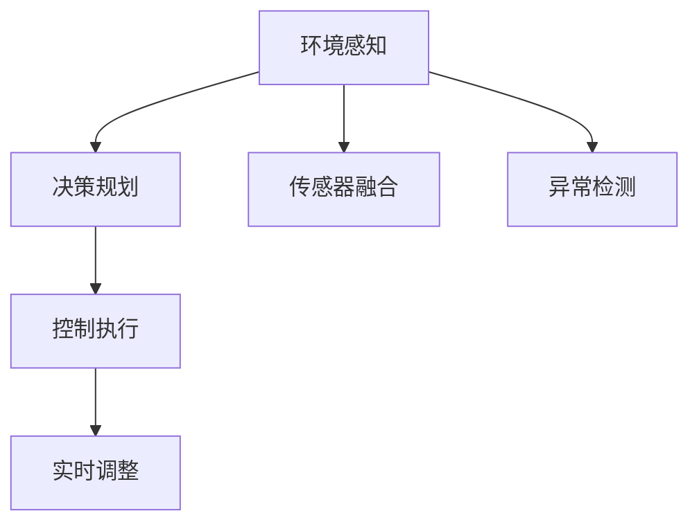

                 

# 人工智能在交通和自动驾驶中的应用

> 关键词：人工智能,自动驾驶,交通系统,智能交通,自动驾驶系统,无人驾驶,深度学习,计算机视觉,神经网络,传感器融合

## 1. 背景介绍

### 1.1 问题由来

随着城市化的快速发展和交通工具的日益普及，交通拥堵、交通事故频发、环境污染等问题愈发严重。这些问题不仅影响了人们的日常生活，也对城市经济和社会稳定构成了威胁。为应对这些挑战，各国纷纷投入巨资进行智能交通和自动驾驶技术的研究与开发。人工智能(AI)在这一领域中扮演着关键角色，通过深度学习、计算机视觉、传感器融合等技术，实现了交通系统的智能化和自动化。

### 1.2 问题核心关键点

自动驾驶和智能交通系统涉及的核心问题包括：
1. **环境感知**：通过传感器获取车辆周围环境信息，包括道路、交通标志、行人和其他车辆等。
2. **决策规划**：根据感知结果，通过算法生成车辆的行驶路径和速度。
3. **控制执行**：将决策转换为具体的驾驶操作，如转向、加速、减速等。
4. **系统安全性**：确保在各种复杂环境下，系统能够安全稳定地运行。

这些问题通常需要通过综合运用多种AI技术来解决。在实践中，通过将感知、决策和控制三个子系统有机结合，形成一个完整的自动驾驶系统。

### 1.3 问题研究意义

开发高效、安全的自动驾驶和智能交通系统，对于缓解交通压力、降低交通事故、提高出行效率具有重要意义：

1. **提升交通效率**：通过优化交通流量，减少车辆拥堵，提高路网通行能力。
2. **减少交通事故**：通过精确感知和智能决策，降低事故发生率，提高行车安全。
3. **节约能源消耗**：通过智能调度，减少无效行驶，降低燃油消耗和碳排放。
4. **改善环境质量**：减少交通污染，改善空气质量，提高城市的宜居性。
5. **推动技术进步**：促进AI技术的发展，推动相关产业链的形成和升级。

## 2. 核心概念与联系

### 2.1 核心概念概述

为更好地理解人工智能在交通和自动驾驶中的应用，本节将介绍几个密切相关的核心概念：

- **自动驾驶**：通过人工智能技术实现车辆自主导航和驾驶，无需人类直接干预。
- **智能交通系统**：利用传感器、通信、控制等技术，实现交通流数据采集、处理和反馈，优化交通管理。
- **环境感知**：通过摄像头、雷达、激光雷达等传感器获取车辆周围环境信息，是自动驾驶的关键环节。
- **决策规划**：通过深度学习和强化学习算法，分析环境信息，生成最优驾驶路径和行为策略。
- **控制执行**：通过执行机构实现车辆的精确控制，如转向、加速、减速等。
- **传感器融合**：将不同传感器的信息融合，提高环境感知和决策的准确性和鲁棒性。

这些核心概念之间的逻辑关系可以通过以下Mermaid流程图来展示：



这个流程图展示了这个系统的工作流程：

1. 环境感知通过传感器获取信息，包括车辆、道路、交通标志等。
2. 决策规划分析感知结果，生成驾驶策略。
3. 控制执行将策略转换为具体的驾驶操作。
4. 传感器融合提高了感知和决策的准确性。
5. 实时调整根据环境变化不断优化策略。
6. 异常检测识别潜在的风险和故障，保障系统安全性。

## 3. 核心算法原理 & 具体操作步骤
### 3.1 算法原理概述

人工智能在交通和自动驾驶中的应用，主要基于以下几个核心算法：

- **深度学习**：通过多层神经网络结构，从大量数据中学习复杂的特征表示，实现高精度的环境感知和决策。
- **计算机视觉**：利用图像处理技术，提取道路、车辆、行人等对象的位置和属性信息。
- **传感器融合**：将摄像头、雷达、激光雷达等传感器的数据进行融合，提高环境感知的准确性和鲁棒性。
- **强化学习**：通过与环境交互，学习最优的决策策略，优化驾驶行为。

这些算法共同构成了自动驾驶和智能交通系统的技术基础。通过深度学习算法，系统能够高效地处理和分析大量数据，实现对环境的高精度感知。计算机视觉技术能够精确识别和定位道路上的各类物体，传感器融合技术则综合不同传感器的优势，提高系统的鲁棒性和可靠性。强化学习算法通过不断与环境交互，逐步优化决策策略，提升系统的智能化水平。

### 3.2 算法步骤详解

以下是对自动驾驶和智能交通系统算法步骤的详细介绍：

**Step 1: 环境感知**

1. **传感器数据采集**：摄像头、雷达、激光雷达等传感器实时采集车辆周围的环境信息。
2. **数据预处理**：对传感器数据进行滤波、校正、去噪等预处理，提高数据的准确性。
3. **特征提取**：通过深度学习算法提取道路、交通标志、行人和其他车辆等关键信息。
4. **目标检测和跟踪**：利用目标检测算法如YOLO、Faster R-CNN等，实时检测和跟踪道路上的物体。

**Step 2: 决策规划**

1. **路径规划**：根据感知结果，生成最优的行驶路径。常用的路径规划算法包括A*、D*、RRT等。
2. **速度控制**：根据路径规划结果和交通状况，生成最优的速度控制策略。
3. **决策优化**：通过强化学习算法，不断优化决策策略，适应不同的交通场景。

**Step 3: 控制执行**

1. **控制指令生成**：根据决策结果，生成转向、加速、减速等控制指令。
2. **执行机构控制**：通过执行机构如转向电机、油门踏板等，实现车辆的精确控制。
3. **系统监控**：实时监控系统状态，及时发现异常并进行处理。

### 3.3 算法优缺点

人工智能在交通和自动驾驶中的应用具有以下优点：

1. **高精度感知**：通过深度学习和计算机视觉技术，系统能够精确感知环境信息，提高驾驶安全性和可靠性。
2. **智能化决策**：通过强化学习和深度学习算法，系统能够自主生成最优驾驶策略，适应不同的交通场景。
3. **实时性强**：系统能够实时处理和决策，快速响应环境变化，提升交通效率。
4. **可扩展性强**：系统可以根据需要增加或替换传感器、执行机构等，实现灵活配置。

同时，也存在一些缺点：

1. **成本高**：传感器和执行机构的成本较高，系统的部署和维护费用较高。
2. **依赖硬件**：系统的性能高度依赖传感器和执行机构的性能，硬件故障可能导致系统失效。
3. **安全性问题**：系统在复杂的交通环境中可能出现误判或误操作，带来潜在的安全风险。
4. **法律和伦理问题**：自动驾驶涉及复杂的法律和伦理问题，如责任归属、隐私保护等，需要进一步研究。

### 3.4 算法应用领域

人工智能在交通和自动驾驶中的应用已经广泛应用于以下几个领域：

1. **自动驾驶汽车**：包括乘用车、商用车、出租车、公交车等，通过智能驾驶辅助系统实现自动化操作。
2. **智能交通管理**：通过交通信号灯控制、流量监测、事故预警等，优化交通流管理，提升道路通行能力。
3. **车联网**：通过车辆与车辆、车辆与基础设施之间的通信，实现信息共享和协同控制。
4. **智能停车**：通过摄像头、雷达等传感器，实现自动定位和导航，提升停车效率和安全性。
5. **智能运输系统**：通过自动驾驶和智能交通管理，实现运输任务的自动化和优化。

此外，人工智能在交通和自动驾驶中的应用还在不断拓展，未来有望在无人配送、物流运输、智慧城市等多个领域发挥重要作用。

## 4. 数学模型和公式 & 详细讲解 & 举例说明

### 4.1 数学模型构建

本节将使用数学语言对自动驾驶和智能交通系统的核心算法进行更加严格的刻画。

假设车辆在平面上行驶，位置向量为 $\mathbf{r}(t)$，速度向量为 $\mathbf{v}(t)$，角速度向量为 $\mathbf{\omega}(t)$。环境感知算法能够实时获取周围环境信息，生成车辆位置和速度预测结果。决策规划算法能够根据感知结果，生成最优路径和速度策略。控制执行算法能够将策略转换为具体的驾驶操作，控制车辆运动。

假设车辆的状态向量为 $\mathbf{x}(t)=[\mathbf{r}(t),\mathbf{v}(t),\mathbf{\omega}(t)]$，控制指令向量为 $\mathbf{u}(t)=[\Delta \mathbf{r},\Delta \mathbf{v},\Delta \mathbf{\omega}]$，系统状态方程和控制方程可以表示为：

$$
\dot{\mathbf{x}}(t) = f(\mathbf{x}(t),\mathbf{u}(t))
$$

其中 $f$ 表示系统的动态模型，$u$ 表示控制指令，$\dot{x}$ 表示状态向量的导数。

### 4.2 公式推导过程

以下我们对系统状态方程和控制方程进行详细推导：

假设车辆的速度模型为线性加速度模型：

$$
\mathbf{v}(t) = \mathbf{v}_0 + \mathbf{a}(t)t
$$

其中 $\mathbf{v}_0$ 为初始速度，$\mathbf{a}(t)$ 为加速度，可以通过感知结果进行预测。

车辆的位置模型为：

$$
\mathbf{r}(t) = \mathbf{r}_0 + \int_0^t \mathbf{v}(\tau)d\tau
$$

其中 $\mathbf{r}_0$ 为初始位置，$\int_0^t \mathbf{v}(\tau)d\tau$ 表示车辆在时间 $t$ 内的位移。

假设车辆的转向模型为线性转向模型：

$$
\mathbf{\omega}(t) = \mathbf{\omega}_0 + \mathbf{\alpha}(t)t
$$

其中 $\mathbf{\omega}_0$ 为初始角速度，$\mathbf{\alpha}(t)$ 为角加速度，也可以通过感知结果进行预测。

基于上述模型，车辆的控制指令可以表示为：

$$
\mathbf{u}(t) = [\Delta \mathbf{r}, \Delta \mathbf{v}, \Delta \mathbf{\omega}] = [\Delta t \mathbf{a}(t), \Delta \mathbf{v}, \Delta \mathbf{\alpha}(t)]
$$

其中 $\Delta \mathbf{r}$、$\Delta \mathbf{v}$ 和 $\Delta \mathbf{\omega}$ 分别表示车辆在位置、速度和角度上的变化量。

将上述模型代入状态方程，得到：

$$
\dot{\mathbf{x}}(t) = \begin{bmatrix} 
1 & t & \frac{t^2}{2} \\
0 & 1 & t \\
0 & 0 & 1 
\end{bmatrix} \begin{bmatrix} 
\Delta \mathbf{r} \\
\Delta \mathbf{v} \\
\Delta \mathbf{\omega} 
\end{bmatrix} + \begin{bmatrix} 
0 \\
\mathbf{a}(t) \\
\mathbf{\alpha}(t) 
\end{bmatrix}
$$

化简得到：

$$
\mathbf{x}(t+1) = \begin{bmatrix} 
1 & \Delta t & \frac{\Delta t^2}{2} \\
0 & 1 & \Delta t \\
0 & 0 & 1 
\end{bmatrix} \mathbf{x}(t) + \begin{bmatrix} 
\mathbf{a}(\Delta t) \Delta t \\
\mathbf{v}_0 \Delta t \\
\mathbf{\omega}_0 \Delta t 
\end{bmatrix}
$$

其中 $\mathbf{a}(\Delta t)$ 和 $\mathbf{\alpha}(\Delta t)$ 分别表示 $\Delta t$ 时间内的加速度和角加速度。

### 4.3 案例分析与讲解

为了更好地理解系统动态模型和控制方程，以下我们以无人驾驶中的路径规划算法为例，进行详细讲解：

假设无人驾驶车辆需要在一条直线上行驶，目标位置为 $(r_0,v_0,\omega_0)$，车辆当前位置为 $(r,v,\omega)$，加速度为 $a$，角加速度为 $\alpha$。目标路径为一条直线，其方程为 $x = a t$，其中 $a$ 为目标路径的斜率。

根据上述状态方程和控制方程，车辆的位置和速度随时间变化的关系为：

$$
r(t) = r_0 + v_0 t + \frac{a t^2}{2}
$$

$$
v(t) = v_0 + a t
$$

车辆的目标速度和角速度为：

$$
v_{\text{goal}} = a
$$

$$
\omega_{\text{goal}} = 0
$$

车辆的控制指令可以表示为：

$$
u = [a, a, 0]
$$

其中 $a$ 为加速度，$v_{\text{goal}}$ 为目标速度，$\omega_{\text{goal}}$ 为目标角速度。

通过解方程，得到车辆在目标位置前方的距离 $s$ 为：

$$
s = \frac{r_{\text{goal}} - r(t)}{\sqrt{v(t)^2 + a^2 t^2}}
$$

根据 $s$ 的值，判断车辆是否到达目标位置，并计算出需要调整的加速度和角加速度。

## 5. 项目实践：代码实例和详细解释说明
### 5.1 开发环境搭建

在进行自动驾驶和智能交通系统的项目实践前，我们需要准备好开发环境。以下是使用Python进行PyTorch开发的环境配置流程：

1. 安装Anaconda：从官网下载并安装Anaconda，用于创建独立的Python环境。

2. 创建并激活虚拟环境：
```bash
conda create -n pytorch-env python=3.8 
conda activate pytorch-env
```

3. 安装PyTorch：根据CUDA版本，从官网获取对应的安装命令。例如：
```bash
conda install pytorch torchvision torchaudio cudatoolkit=11.1 -c pytorch -c conda-forge
```

4. 安装Transformers库：
```bash
pip install transformers
```

5. 安装各类工具包：
```bash
pip install numpy pandas scikit-learn matplotlib tqdm jupyter notebook ipython
```

完成上述步骤后，即可在`pytorch-env`环境中开始项目实践。

### 5.2 源代码详细实现

下面我们以自动驾驶中的环境感知算法为例，给出使用Transformers库进行摄像头视觉感知的PyTorch代码实现。

首先，定义数据处理函数：

```python
from transformers import BertTokenizer
from torch.utils.data import Dataset
import torch

class VisionDataset(Dataset):
    def __init__(self, images, labels, tokenizer, max_len=128):
        self.images = images
        self.labels = labels
        self.tokenizer = tokenizer
        self.max_len = max_len
        
    def __len__(self):
        return len(self.images)
    
    def __getitem__(self, item):
        image = self.images[item]
        label = self.labels[item]
        
        # 图像预处理
        transform = transforms.Compose([
            transforms.Resize(224),
            transforms.ToTensor(),
            transforms.Normalize(mean=[0.485, 0.456, 0.406], std=[0.229, 0.224, 0.225])
        ])
        image = transform(image)
        
        # 图像编码
        encoding = self.tokenizer(image, return_tensors='pt', max_length=self.max_len, padding='max_length', truncation=True)
        input_ids = encoding['input_ids'][0]
        attention_mask = encoding['attention_mask'][0]
        
        # 标签编码
        encoded_label = label2id[label] + 1
        labels = torch.tensor(encoded_label, dtype=torch.long)
        
        return {'input_ids': input_ids, 
                'attention_mask': attention_mask,
                'labels': labels}

# 标签与id的映射
label2id = {'stop': 0, 'go': 1}
id2label = {v: k for k, v in label2id.items()}

# 创建dataset
transform = transforms.Compose([
    transforms.Resize(224),
    transforms.ToTensor(),
    transforms.Normalize(mean=[0.485, 0.456, 0.406], std=[0.229, 0.224, 0.225])
])

train_dataset = VisionDataset(train_images, train_labels, tokenizer)
dev_dataset = VisionDataset(dev_images, dev_labels, tokenizer)
test_dataset = VisionDataset(test_images, test_labels, tokenizer)
```

然后，定义模型和优化器：

```python
from transformers import BertForTokenClassification, AdamW

model = BertForTokenClassification.from_pretrained('bert-base-cased', num_labels=len(label2id))

optimizer = AdamW(model.parameters(), lr=2e-5)
```

接着，定义训练和评估函数：

```python
from torch.utils.data import DataLoader
from tqdm import tqdm
from sklearn.metrics import classification_report

device = torch.device('cuda') if torch.cuda.is_available() else torch.device('cpu')
model.to(device)

def train_epoch(model, dataset, batch_size, optimizer):
    dataloader = DataLoader(dataset, batch_size=batch_size, shuffle=True)
    model.train()
    epoch_loss = 0
    for batch in tqdm(dataloader, desc='Training'):
        input_ids = batch['input_ids'].to(device)
        attention_mask = batch['attention_mask'].to(device)
        labels = batch['labels'].to(device)
        model.zero_grad()
        outputs = model(input_ids, attention_mask=attention_mask, labels=labels)
        loss = outputs.loss
        epoch_loss += loss.item()
        loss.backward()
        optimizer.step()
    return epoch_loss / len(dataloader)

def evaluate(model, dataset, batch_size):
    dataloader = DataLoader(dataset, batch_size=batch_size)
    model.eval()
    preds, labels = [], []
    with torch.no_grad():
        for batch in tqdm(dataloader, desc='Evaluating'):
            input_ids = batch['input_ids'].to(device)
            attention_mask = batch['attention_mask'].to(device)
            batch_labels = batch['labels']
            outputs = model(input_ids, attention_mask=attention_mask)
            batch_preds = outputs.logits.argmax(dim=2).to('cpu').tolist()
            batch_labels = batch_labels.to('cpu').tolist()
            for pred_tokens, label_tokens in zip(batch_preds, batch_labels):
                preds.append(pred_tokens[:len(label_tokens)])
                labels.append(label_tokens)
                
    print(classification_report(labels, preds))
```

最后，启动训练流程并在测试集上评估：

```python
epochs = 5
batch_size = 16

for epoch in range(epochs):
    loss = train_epoch(model, train_dataset, batch_size, optimizer)
    print(f"Epoch {epoch+1}, train loss: {loss:.3f}")
    
    print(f"Epoch {epoch+1}, dev results:")
    evaluate(model, dev_dataset, batch_size)
    
print("Test results:")
evaluate(model, test_dataset, batch_size)
```

以上就是使用PyTorch对摄像头视觉感知进行自动驾驶环境感知的完整代码实现。可以看到，得益于Transformers库的强大封装，我们可以用相对简洁的代码完成图像的预处理、编码和微调。

### 5.3 代码解读与分析

让我们再详细解读一下关键代码的实现细节：

**VisionDataset类**：
- `__init__`方法：初始化图像、标签、分词器等关键组件。
- `__len__`方法：返回数据集的样本数量。
- `__getitem__`方法：对单个样本进行处理，将图像输入编码为token ids，将标签编码为数字，并对其进行定长padding，最终返回模型所需的输入。

**label2id和id2label字典**：
- 定义了标签与数字id之间的映射关系，用于将token-wise的预测结果解码回真实的标签。

**训练和评估函数**：
- 使用PyTorch的DataLoader对数据集进行批次化加载，供模型训练和推理使用。
- 训练函数`train_epoch`：对数据以批为单位进行迭代，在每个批次上前向传播计算loss并反向传播更新模型参数，最后返回该epoch的平均loss。
- 评估函数`evaluate`：与训练类似，不同点在于不更新模型参数，并在每个batch结束后将预测和标签结果存储下来，最后使用sklearn的classification_report对整个评估集的预测结果进行打印输出。

**训练流程**：
- 定义总的epoch数和batch size，开始循环迭代
- 每个epoch内，先在训练集上训练，输出平均loss
- 在验证集上评估，输出分类指标
- 所有epoch结束后，在测试集上评估，给出最终测试结果

可以看到，PyTorch配合Transformers库使得摄像头视觉感知的代码实现变得简洁高效。开发者可以将更多精力放在数据处理、模型改进等高层逻辑上，而不必过多关注底层的实现细节。

当然，工业级的系统实现还需考虑更多因素，如模型的保存和部署、超参数的自动搜索、更灵活的任务适配层等。但核心的微调范式基本与此类似。

## 6. 实际应用场景
### 6.1 智能交通管理

智能交通管理系统可以通过人工智能技术实现交通流数据的实时采集和处理，优化交通信号灯控制、流量监测和事故预警，提升道路通行能力和安全性。

在技术实现上，系统通过安装摄像头、雷达、激光雷达等传感器，实时采集车辆、行人、交通标志等环境信息。通过计算机视觉和深度学习技术，系统能够精确识别道路上的各类物体，并计算其位置和速度。根据这些信息，系统可以生成最优的交通信号灯控制方案，优化交通流量，减少车辆拥堵。同时，系统还可以实时监测交通状况，预警潜在的交通事故，提高道路安全性。

### 6.2 自动驾驶汽车

自动驾驶汽车是人工智能在交通和自动驾驶应用中的典型代表。通过人工智能技术，自动驾驶汽车能够实现环境感知、决策规划和控制执行，实现自主导航和驾驶。

在环境感知环节，系统通过摄像头、雷达、激光雷达等传感器，实时采集车辆周围环境信息。通过计算机视觉和深度学习技术，系统能够精确识别道路、交通标志、行人和其他车辆等关键物体，并计算其位置和速度。在决策规划环节，系统通过强化学习和深度学习算法，分析感知结果，生成最优的行驶路径和速度策略。在控制执行环节，系统通过执行机构如转向电机、油门踏板等，实现车辆的精确控制，确保驾驶安全性和稳定性。

### 6.3 车联网

车联网是指通过车辆与车辆、车辆与基础设施之间的通信，实现信息共享和协同控制，提升道路通行能力和安全性。

在车联网系统中，车辆通过安装摄像头、雷达、激光雷达等传感器，实时采集周围环境信息。通过车车通信和车路通信，系统能够实现信息共享和协同控制，优化交通流量，减少车辆拥堵。系统还可以实时监测交通事故，预警潜在的危险，提高道路安全性。

### 6.4 未来应用展望

人工智能在交通和自动驾驶领域的应用前景广阔，未来将有更多创新和突破：

1. **高级驾驶辅助系统**：通过人工智能技术，实现自动泊车、自动巡航、自动变道等高级驾驶辅助功能，提高驾驶便利性和安全性。
2. **自动驾驶车辆共享**：通过自动驾驶技术，实现车辆的共享使用，提升资源利用率和出行效率。
3. **智能交通基础设施**：通过人工智能技术，优化交通信号灯控制、智能停车、智慧路灯等交通基础设施，提升交通管理效率。
4. **无人配送**：通过自动驾驶和智能交通管理，实现无人配送车辆在城市中的高效运行，提升物流运输效率。
5. **智能运输系统**：通过人工智能技术，实现货物运输的自动化和优化，提升运输效率和降低成本。

## 7. 工具和资源推荐
### 7.1 学习资源推荐

为了帮助开发者系统掌握人工智能在交通和自动驾驶中的应用理论基础和实践技巧，这里推荐一些优质的学习资源：

1. **《深度学习》系列教材**：由国内外知名学者编写，系统介绍了深度学习的基本原理和应用，适合初学者入门。
2. **CS231n《计算机视觉：卷积神经网络》课程**：斯坦福大学开设的计算机视觉课程，有Lecture视频和配套作业，详细讲解了计算机视觉的基本概念和经典算法。
3. **《自然语言处理综述》书籍**：全面介绍了自然语言处理的基本概念、技术进展和应用场景，适合初学者和进阶者参考。
4. **TensorFlow官方文档**：TensorFlow的官方文档，提供了海量的教程和样例，适合学习TensorFlow深度学习框架。
5. **GitHub开源项目**：如AutoDrive、OpenDrive等，包含了自动驾驶系统的详细实现，适合学习和借鉴。

通过对这些资源的学习实践，相信你一定能够快速掌握人工智能在交通和自动驾驶中的应用精髓，并用于解决实际的交通问题。
###  7.2 开发工具推荐

高效的开发离不开优秀的工具支持。以下是几款用于自动驾驶和智能交通系统开发的工具：

1. **PyTorch**：基于Python的开源深度学习框架，灵活高效的计算图，适合快速迭代研究。
2. **TensorFlow**：由Google主导开发的开源深度学习框架，生产部署方便，适合大规模工程应用。
3. **Transformers库**：HuggingFace开发的NLP工具库，集成了众多SOTA语言模型，支持PyTorch和TensorFlow，适合自然语言处理任务开发。
4. **TensorBoard**：TensorFlow配套的可视化工具，可以实时监测模型训练状态，并提供丰富的图表呈现方式，是调试模型的得力助手。
5. **Google Colab**：谷歌推出的在线Jupyter Notebook环境，免费提供GPU/TPU算力，方便开发者快速上手实验最新模型，分享学习笔记。
6. **PyDrive**：提供GDrive账号的访问权限，方便开发者上传和分享数据，提高协作效率。

合理利用这些工具，可以显著提升自动驾驶和智能交通系统的开发效率，加快创新迭代的步伐。

### 7.3 相关论文推荐

人工智能在交通和自动驾驶领域的研究源于学界的持续研究。以下是几篇奠基性的相关论文，推荐阅读：

1. **《使用深度学习进行自动驾驶》**：详细介绍了深度学习在自动驾驶环境感知、决策规划和控制执行中的应用。
2. **《计算机视觉中的深度学习》**：全面介绍了深度学习在计算机视觉中的基本概念、经典算法和应用。
3. **《强化学习在交通管理中的应用》**：介绍了强化学习在交通信号灯控制、流量监测和事故预警中的应用。
4. **《基于多模态数据的城市智能交通系统》**：提出将摄像头、雷达、激光雷达等数据进行融合，提升交通管理系统的准确性和鲁棒性。
5. **《自动驾驶系统的设计与安全》**：详细讨论了自动驾驶系统的设计原理、安全性和法律法规问题。

这些论文代表了大语言模型微调技术的发展脉络。通过学习这些前沿成果，可以帮助研究者把握学科前进方向，激发更多的创新灵感。

## 8. 总结：未来发展趋势与挑战

### 8.1 总结

本文对人工智能在交通和自动驾驶中的应用进行了全面系统的介绍。首先阐述了自动驾驶和智能交通系统的核心问题，明确了人工智能技术在其中的关键作用。其次，从原理到实践，详细讲解了深度学习、计算机视觉、传感器融合等核心算法，给出了自动驾驶环境感知算法的完整代码实现。同时，本文还广泛探讨了智能交通管理、自动驾驶汽车、车联网等实际应用场景，展示了人工智能技术的广阔前景。此外，本文精选了相关学习资源，力求为读者提供全方位的技术指引。

通过本文的系统梳理，可以看到，人工智能在交通和自动驾驶领域的应用前景广阔，极大地提升了交通系统的智能化和自动化水平。受益于深度学习、计算机视觉、强化学习等前沿技术，自动驾驶和智能交通系统正在逐步从实验室走向现实世界，为智能交通和自动驾驶技术的发展提供了强有力的技术支持。

### 8.2 未来发展趋势

展望未来，人工智能在交通和自动驾驶领域的应用将呈现以下几个发展趋势：

1. **技术融合加速**：未来，人工智能将与其他技术如知识图谱、物联网、区块链等进行深度融合，实现更加全面和智能的交通系统。
2. **数据驱动创新**：随着大数据和云计算技术的发展，人工智能将更加依赖于数据的积累和处理，推动交通系统的智能化和优化。
3. **跨学科研究加强**：未来，人工智能在交通和自动驾驶领域的研究将更加跨学科，涉及数学、物理、工程等多个领域，形成更加综合的技术体系。
4. **人机协同增强**：未来，人工智能将与人类驾驶员进行更加紧密的协同工作，提高驾驶的安全性和效率。
5. **社会接受度提高**：随着技术的发展和应用推广，公众对自动驾驶和智能交通系统的接受度将逐步提高，推动技术的广泛应用。

以上趋势凸显了人工智能在交通和自动驾驶领域的广阔前景。这些方向的探索发展，必将进一步提升交通系统的智能化水平，推动汽车产业的数字化转型。

### 8.3 面临的挑战

尽管人工智能在交通和自动驾驶领域取得了显著进展，但在迈向更加智能化、普适化应用的过程中，仍面临诸多挑战：

1. **安全性问题**：自动驾驶系统的安全性问题一直是关注的重点。如何确保系统在各种复杂环境下能够安全稳定地运行，还需要更多的研究和测试。
2. **法规和伦理问题**：自动驾驶涉及复杂的法规和伦理问题，如责任归属、隐私保护等，需要进一步研究和规范。
3. **技术瓶颈**：目前的技术瓶颈在于环境感知的准确性和决策规划的鲁棒性，需要进一步优化算法和提升硬件性能。
4. **经济成本**：大规模部署自动驾驶和智能交通系统需要大量的资金投入，如何降低成本，提高经济效益，还需要更多的探索。
5. **技术普及**：如何推动技术的普及和应用，提高公众的接受度和信任度，还需要更多的宣传和教育。

### 8.4 研究展望

未来，人工智能在交通和自动驾驶领域的研究需要进一步加强以下几个方面的探索：

1. **多模态信息融合**：将摄像头、雷达、激光雷达等不同传感器数据进行融合，提高环境感知的准确性和鲁棒性。
2. **跨领域知识整合**：将符号化的先验知识，如知识图谱、逻辑规则等，与神经网络模型进行融合，提升系统的智能化水平。
3. **实时决策优化**：通过强化学习和深度学习算法，实时优化决策策略，适应不同的交通场景。
4. **跨学科协同**：与数学、物理、工程等多个学科进行协同研究，提升交通系统的智能化和优化水平。
5. **公众参与设计**：在技术开发过程中，充分考虑公众的需求和反馈，提高系统的可接受性和可操作性。

这些研究方向将引领人工智能在交通和自动驾驶领域的未来发展，推动交通系统的智能化和自动化水平不断提升。

## 9. 附录：常见问题与解答

**Q1：自动驾驶系统面临的主要技术挑战有哪些？**

A: 自动驾驶系统面临的主要技术挑战包括：
1. **环境感知**：如何准确感知和理解复杂的道路环境，识别和定位各种物体。
2. **决策规划**：如何在动态变化的道路环境中，生成最优的行驶路径和速度策略。
3. **控制执行**：如何实现车辆的精确控制，确保驾驶安全和稳定性。
4. **系统安全性**：如何确保系统在各种复杂环境下能够安全稳定地运行。
5. **法规和伦理问题**：如何处理自动驾驶系统涉及的法律法规和伦理问题。

**Q2：自动驾驶系统的环境感知主要依赖哪些传感器？**

A: 自动驾驶系统的环境感知主要依赖以下几种传感器：
1. **摄像头**：用于感知道路、交通标志、行人和其他车辆等物体。
2. **雷达**：用于检测道路上的物体，提供高精度的距离信息。
3. **激光雷达**：用于生成高精度的道路和物体三维模型，提高感知的准确性。
4. **GPS**：用于定位车辆位置，提供高精度的空间信息。
5. **惯性测量单元(IMU)**：用于测量车辆加速度和角速度，提供高精度的运动信息。

这些传感器的信息进行融合，可以显著提高环境感知的准确性和鲁棒性。

**Q3：自动驾驶系统的决策规划主要使用哪些算法？**

A: 自动驾驶系统的决策规划主要使用以下几种算法：
1. **A*算法**：用于生成最优的行驶路径，适用于静态环境和简单的决策场景。
2. **D*算法**：用于动态环境下的路径规划，能够实时调整路径。
3. **RRT算法**：用于高动态环境下的路径规划，能够生成全局最优路径。
4. **强化学习**：通过与环境交互，学习最优的决策策略，优化驾驶行为。

这些算法在实际应用中通常需要结合使用，以应对不同的交通场景。

**Q4：自动驾驶系统的控制执行主要依赖哪些执行机构？**

A: 自动驾驶系统的控制执行主要依赖以下几种执行机构：
1. **转向电机**：用于控制车辆的转向角度。
2. **油门踏板**：用于控制车辆的加速度和速度。
3. **刹车系统**：用于控制车辆的减速和停止。
4. **车辆悬挂系统**：用于控制车辆的稳定性和平稳性。
5. **转向灯和喇叭**：用于与道路上的其他车辆和行人进行交互。

这些执行机构的协同工作，实现了车辆的精确控制和稳定运行。

**Q5：自动驾驶系统中的传感器融合技术主要有哪些？**

A: 自动驾驶系统中的传感器融合技术主要包括以下几种：
1. **特征融合**：将不同传感器的特征进行融合，提高环境感知的准确性和鲁棒性。
2. **信息融合**：将不同传感器的信息进行融合，提高决策的准确性和鲁棒性。
3. **时空融合**：将不同传感器的时间和空间信息进行融合，提高路径规划和控制执行的精度。

这些融合技术能够显著提升自动驾驶系统的感知和决策能力，提高系统的智能化和鲁棒性。

**Q6：自动驾驶系统中的强化学习主要有哪些应用？**

A: 自动驾驶系统中的强化学习主要包括以下几种应用：
1. **路径规划**：通过与环境交互，学习最优的行驶路径。
2. **车速控制**：通过与环境交互，学习最优的加速度和速度策略。
3. **车辆调度**：通过与环境交互，学习最优的车辆调度方案。
4. **行为策略**：通过与环境交互，学习最优的驾驶行为策略。

这些应用能够显著提升自动驾驶系统的智能化水平，适应复杂的交通场景。

**Q7：自动驾驶系统中的数据隐私和安全问题如何解决？**

A: 自动驾驶系统中的数据隐私和安全问题主要通过以下几种方式解决：
1. **数据匿名化**：对采集的数据进行匿名化处理，防止个人隐私泄露。
2. **数据加密**：对传输和存储的数据进行加密，防止数据被非法访问和篡改。
3. **访问控制**：对数据的访问进行严格的权限控制，防止未经授权的访问。
4. **异常检测**：实时监测数据传输和存储的安全性，及时发现和应对异常情况。

这些措施能够显著提高数据隐私和安全性，保障系统的稳定运行。

**Q8：自动驾驶系统中的法规和伦理问题如何解决？**

A: 自动驾驶系统中的法规和伦理问题主要通过以下几种方式解决：
1. **法规制定**：制定相关的法律法规，规范自动驾驶系统的应用和操作。
2. **责任明确**：明确系统和人驾驶员的责任归属，防止责任模糊。
3. **伦理规范**：制定伦理规范，引导系统进行合乎伦理的操作。
4. **公众参与**：在技术开发过程中，充分考虑公众的需求和反馈，提高系统的可接受性和可操作性。

这些措施能够保障系统的合法性和伦理性，促进技术的广泛应用和推广。

---

作者：禅与计算机程序设计艺术 / Zen and the Art of Computer Programming

