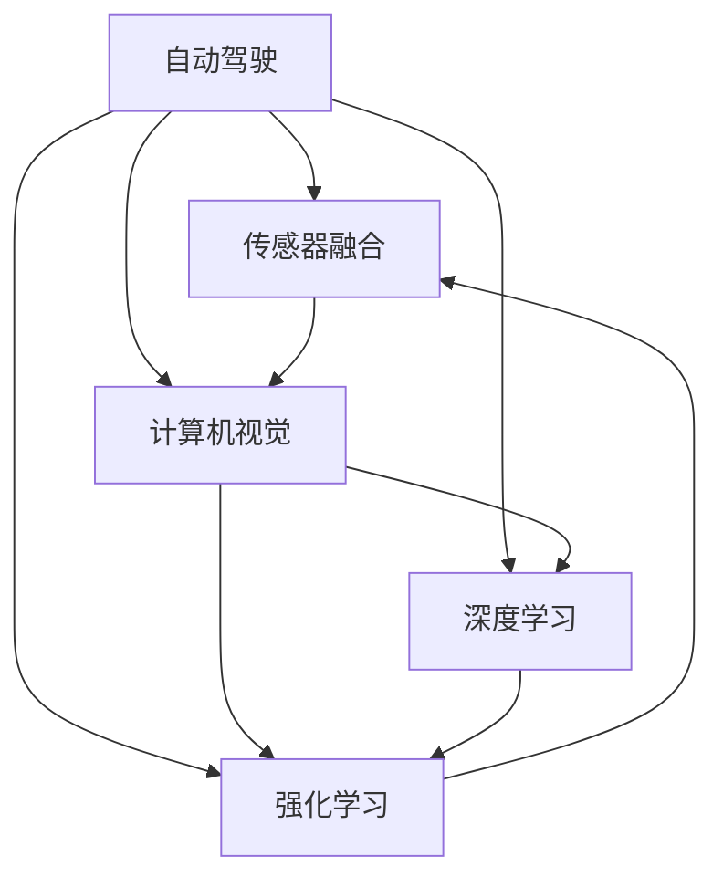

                 

## 1. 背景介绍

人工智能（AI）在交通和自动驾驶领域的应用，是当前科技革命和产业变革的重要方向。随着传感器技术、计算能力、通信技术等的迅猛发展，以及深度学习等先进算法的应用，人工智能正逐步改变着人们的出行方式，推动交通系统的智能化、自动化和安全性升级。自动驾驶技术、智能交通系统、车联网等应用，将大幅提升道路运输效率、降低事故发生率、减少环境污染，为社会带来深远的影响。

### 1.1 人工智能与交通的融合

人工智能技术在交通领域的应用，可以追溯到上个世纪60年代的智能交通系统（ITS），通过计算机、通信、传感等技术，对交通流、车辆位置、交通状态等信息进行采集、处理和分析，从而实现交通流的动态管理。然而，由于当时计算能力有限，这些系统大多停留在数据采集和信息汇总阶段，未能实现真正的智能化。

近年来，随着大数据、云计算、深度学习等技术的突破，人工智能在交通领域的应用进入了一个新的阶段。深度神经网络、强化学习、强化感知等技术，使得AI能够对交通场景进行高效建模和决策，自动驾驶、智能交通系统、车联网等技术不断涌现，推动交通领域的智能化进程。

### 1.2 自动驾驶技术

自动驾驶技术是人工智能在交通领域最为突出的应用。通过车辆传感器、摄像头、雷达、激光雷达等设备，自动驾驶车辆可以实时感知周围环境，识别路标、行人、车辆等物体，并通过高精度地图、实时交通信息，规划最优路径，完成自动驾驶。自动驾驶技术的实现，依赖于多个学科的前沿技术，包括计算机视觉、深度学习、控制理论、传感器技术等。

### 1.3 人工智能与自动驾驶的结合

自动驾驶技术中，人工智能发挥了核心作用。例如，计算机视觉用于识别道路标志、交通信号灯等；深度学习用于对传感器数据进行语义理解；强化学习用于优化决策策略，以避免交通事故；传感器融合技术用于综合不同传感器数据，提高系统鲁棒性。通过这些技术的有机结合，自动驾驶系统可以安全、可靠、高效地实现自动驾驶。

## 2. 核心概念与联系

### 2.1 核心概念概述

以下是人工智能在交通和自动驾驶领域中涉及的核心概念：

- **自动驾驶（Autonomous Driving, AD）**：通过传感器、计算机视觉、深度学习等技术，使车辆能够自主完成驾驶任务。自动驾驶技术分为多个等级，从基于导航的辅助驾驶到全自动驾驶，技术难度逐级提升。

- **智能交通系统（Intelligent Transportation Systems, ITS）**：利用计算机、通信技术，对交通流、车辆位置、交通状态等信息进行采集、处理和分析，从而实现交通流的动态管理，提升交通效率和安全。

- **车联网（Vehicular Ad hoc Network, VANET）**：利用无线通信技术，实现车辆与车辆、车辆与基础设施之间的信息共享，支持自动驾驶、导航、预警等功能，是未来交通系统的重要组成部分。

- **计算机视觉（Computer Vision, CV）**：通过图像处理、模式识别等技术，使计算机能够自动识别、分析和理解图像和视频内容。计算机视觉在自动驾驶中用于道路标志、交通信号灯等识别。

- **深度学习（Deep Learning, DL）**：基于人工神经网络的多层感知模型，通过大量数据训练，能够自动提取特征，实现对复杂数据的高级处理和理解。深度学习在自动驾驶中用于对传感器数据进行语义理解、决策优化等。

- **强化学习（Reinforcement Learning, RL）**：通过与环境的交互，智能体不断调整行为策略，以最大化目标函数。强化学习在自动驾驶中用于路径规划、决策优化等。

这些核心概念之间存在着紧密的联系，共同构成了人工智能在交通和自动驾驶领域的应用框架。通过这些技术的有机结合，人工智能可以大幅提升交通系统的智能化和自动化水平。

### 2.2 核心概念原理和架构的 Mermaid 流程图

以下是一个简单的Mermaid流程图，展示了人工智能在交通和自动驾驶领域中的核心概念及其关系：



这个流程图展示了自动驾驶系统中，各核心技术之间的相互作用。传感器融合技术整合了多种传感器数据，提供高精度的位置和速度信息；计算机视觉用于道路标志、交通信号灯等识别；深度学习用于对传感器数据进行语义理解；强化学习用于路径规划、决策优化等。这些技术共同构成了一个完整的自动驾驶系统。

## 3. 核心算法原理 & 具体操作步骤

### 3.1 算法原理概述

自动驾驶技术的核心算法原理，可以概括为以下几个方面：

1. **感知与识别**：自动驾驶系统通过传感器、摄像头、激光雷达等设备，实时感知周围环境，识别道路标志、交通信号灯、行人、车辆等物体。

2. **高精度地图**：自动驾驶系统依赖高精度地图进行路径规划和定位，确保车辆的行驶安全和准确。

3. **路径规划**：基于感知与识别结果，结合高精度地图和实时交通信息，自动驾驶系统进行路径规划，选择最优路径。

4. **决策与控制**：自动驾驶系统根据感知结果和路径规划信息，通过强化学习、深度学习等算法，进行决策优化，控制车辆的加速、制动、转向等动作。

### 3.2 算法步骤详解

自动驾驶系统的开发流程一般包括以下几个关键步骤：

**Step 1: 数据采集与处理**

自动驾驶系统需要采集大量的传感器数据，包括激光雷达、雷达、摄像头等设备的数据。这些数据需要进行预处理，如去噪、校正、融合等，以提高数据的质量和一致性。

**Step 2: 高精度地图制作**

自动驾驶系统依赖高精度地图进行路径规划和定位。高精度地图的制作包括数据采集、数据处理、地图构建等环节，需要使用无人机、激光雷达等设备，对道路、建筑物等进行高精度扫描和测绘。

**Step 3: 感知与识别**

感知与识别是自动驾驶系统的核心环节，通过计算机视觉、深度学习等技术，对传感器数据进行处理和分析，识别道路标志、交通信号灯、行人、车辆等物体。常用的算法包括卷积神经网络（CNN）、语义分割（Semantic Segmentation）等。

**Step 4: 路径规划**

路径规划是自动驾驶系统的另一个重要环节，基于感知与识别结果，结合高精度地图和实时交通信息，自动驾驶系统进行路径规划，选择最优路径。常用的路径规划算法包括A\*算法、D*算法、动态规划等。

**Step 5: 决策与控制**

决策与控制是自动驾驶系统的关键环节，基于感知与识别结果和路径规划信息，通过强化学习、深度学习等算法，进行决策优化，控制车辆的加速、制动、转向等动作。常用的算法包括Q-learning、Deep Q-Network、Actor-Critic等。

### 3.3 算法优缺点

自动驾驶技术的优点在于：

- 提高交通安全：自动驾驶技术能够大幅减少人为驾驶带来的事故，提升道路交通安全。
- 提升交通效率：自动驾驶技术能够优化交通流，减少交通拥堵，提升道路运输效率。
- 降低环境污染：自动驾驶技术能够优化燃油消耗，降低环境污染，推动绿色出行。

但自动驾驶技术也存在一些缺点：

- 技术难度高：自动驾驶技术涉及计算机视觉、深度学习、强化学习等多个前沿技术，技术难度较高。
- 高成本：自动驾驶系统需要大量的传感器、计算设备、高精度地图等硬件，成本较高。
- 依赖基础设施：自动驾驶系统依赖高精度地图和实时交通信息，基础设施的建设需要大量时间和资金投入。
- 道德和伦理问题：自动驾驶系统在面对复杂场景时，需要做出最优决策，这涉及到一系列道德和伦理问题，需要深入研究和讨论。

### 3.4 算法应用领域

自动驾驶技术在多个领域得到了广泛应用，包括：

- 物流配送：自动驾驶技术可以用于配送车辆，提高配送效率，降低成本。
- 城市公交：自动驾驶公交车可以提升公交系统的智能化和安全性，改善市民出行体验。
- 出租车和网约车：自动驾驶出租车和网约车可以提供更便捷、高效的出行服务，提升用户体验。
- 货运和运输：自动驾驶货车可以优化物流运输路径，提高运输效率，降低成本。
- 智能交通系统：自动驾驶技术可以与智能交通系统（ITS）结合，实现交通流的动态管理和优化。

## 4. 数学模型和公式 & 详细讲解 & 举例说明

### 4.1 数学模型构建

自动驾驶技术的数学模型构建，涉及到多个领域的理论基础。以下是一个简化的自动驾驶系统数学模型构建框架：

1. **感知与识别模型**：基于计算机视觉和深度学习技术，构建道路标志、交通信号灯等识别模型，表示为 $f_{id}(x)$，其中 $x$ 为传感器数据， $f_{id}(x)$ 为识别结果。

2. **路径规划模型**：基于高精度地图和实时交通信息，构建路径规划模型，表示为 $f_{pl}(x)$，其中 $x$ 为识别结果和实时交通信息， $f_{pl}(x)$ 为路径规划结果。

3. **决策与控制模型**：基于强化学习和深度学习技术，构建决策与控制模型，表示为 $f_{dc}(x)$，其中 $x$ 为路径规划结果， $f_{dc}(x)$ 为决策和控制结果。

### 4.2 公式推导过程

以下是自动驾驶系统中的几个关键数学公式：

1. **卷积神经网络（CNN）公式**

$$
f_{cv}(x) = \sigma\left(\sum_{i=1}^{n}w_i x_i + b\right)
$$

其中，$x$ 为输入图像，$w$ 为卷积核权重，$b$ 为偏置项，$\sigma$ 为激活函数，通常使用ReLU或Sigmoid函数。

2. **语义分割公式**

$$
f_{ss}(x) = \max\{\sigma(\sum_{i=1}^{n}w_i x_i + b), 0\}
$$

其中，$x$ 为输入图像，$w$ 为卷积核权重，$b$ 为偏置项，$\sigma$ 为激活函数，通常使用ReLU函数。

3. **A*算法公式**

$$
f_{a*}(x) = (g(x) + h(x))
$$

其中，$g(x)$ 为实际路径成本，$h(x)$ 为启发式路径成本，$x$ 为当前节点。A*算法通过启发式搜索，寻找最优路径。

4. **强化学习公式**

$$
Q(s, a) = r + \gamma \max_{a'} Q(s', a')
$$

其中，$s$ 为状态，$a$ 为动作，$r$ 为即时奖励，$Q(s, a)$ 为状态-动作值函数，$(s', a')$ 为下一个状态和动作。

### 4.3 案例分析与讲解

以下是一个自动驾驶系统中的实例，展示如何使用深度学习和强化学习进行路径规划和决策优化：

1. **感知与识别**

使用卷积神经网络（CNN）和语义分割（Semantic Segmentation）技术，对激光雷达和摄像头数据进行处理和分析，识别道路标志、交通信号灯、行人、车辆等物体。

2. **路径规划**

结合高精度地图和实时交通信息，使用A*算法进行路径规划，选择最优路径。

3. **决策与控制**

基于感知与识别结果和路径规划信息，使用强化学习算法（如Q-learning、Deep Q-Network）进行决策优化，控制车辆的加速、制动、转向等动作。

## 5. 项目实践：代码实例和详细解释说明

### 5.1 开发环境搭建

在进行自动驾驶系统开发前，需要先搭建好开发环境。以下是使用Python进行深度学习和强化学习的开发环境配置流程：

1. 安装Anaconda：从官网下载并安装Anaconda，用于创建独立的Python环境。

2. 创建并激活虚拟环境：
```bash
conda create -n pytorch-env python=3.8 
conda activate pytorch-env
```

3. 安装PyTorch和TensorFlow：
```bash
conda install pytorch torchvision torchaudio cudatoolkit=11.1 -c pytorch -c conda-forge
conda install tensorflow
```

4. 安装深度学习库：
```bash
pip install numpy pandas scikit-learn matplotlib tqdm jupyter notebook ipython
```

5. 安装强化学习库：
```bash
pip install gym gymnasium
```

完成上述步骤后，即可在`pytorch-env`环境中开始自动驾驶系统的开发。

### 5.2 源代码详细实现

以下是一个使用PyTorch和TensorFlow进行自动驾驶系统开发的PyTorch代码实现：

1. **感知与识别**

```python
import torch.nn as nn
import torch.nn.functional as F

class CNNModel(nn.Module):
    def __init__(self):
        super(CNNModel, self).__init__()
        self.conv1 = nn.Conv2d(1, 32, 3)
        self.conv2 = nn.Conv2d(32, 64, 3)
        self.pool = nn.MaxPool2d(2)
        self.fc1 = nn.Linear(64 * 28 * 28, 128)
        self.fc2 = nn.Linear(128, 2)

    def forward(self, x):
        x = self.pool(F.relu(self.conv1(x)))
        x = self.pool(F.relu(self.conv2(x)))
        x = x.view(-1, 64 * 28 * 28)
        x = F.relu(self.fc1(x))
        x = self.fc2(x)
        return F.softmax(x, dim=1)
```

2. **路径规划**

```python
import numpy as np

def astar(start, goal, obstacles, cost):
    open_list = []
    closed_list = set()
    open_list.append((start, 0))

    while open_list:
        current = min(open_list, key=lambda x: x[1])
        open_list.remove(current)
        closed_list.add(current)

        if current[0] == goal:
            path = []
            while current in open_list:
                path.append(current[0])
                current = min(open_list, key=lambda x: x[1])
            path.reverse()
            return path

        neighbors = []
        for neighbor in current[0].neighbors():
            if neighbor not in closed_list and neighbor not in open_list:
                heuristic = np.linalg.norm(neighbor - goal)
                cost = heuristic + cost[current[0]]
                neighbors.append((neighbor, cost))

        open_list.append(min(neighbors, key=lambda x: x[1]))

    return None
```

3. **决策与控制**

```python
import numpy as np
import gymnasium as gym

class DQNAgent:
    def __init__(self, env):
        self.env = env
        self.q_table = np.zeros((env.observation_space.n, env.action_space.n))

    def choose_action(self, observation):
        Q_values = self.q_table[observation]
        action = np.argmax(Q_values)
        return action

    def update_q_table(self, observation, action, reward, next_observation, done):
        Q_values = self.q_table[observation]
        target = reward + self.gamma * np.max(self.q_table[next_observation])
        Q_values[action] = target
        self.q_table[observation] = Q_values

    def train(self, episodes):
        self.gamma = 0.9
        self.epsilon = 0.1

        for episode in range(episodes):
            observation = self.env.reset()
            done = False
            while not done:
                if np.random.random() < self.epsilon:
                    action = self.env.action_space.sample()
                else:
                    action = self.choose_action(observation)
                next_observation, reward, done, _ = self.env.step(action)
                self.update_q_table(observation, action, reward, next_observation, done)
                observation = next_observation

    def test(self, episodes):
        scores = []
        for episode in range(episodes):
            observation = self.env.reset()
            done = False
            while not done:
                action = self.choose_action(observation)
                observation, reward, done, _ = self.env.step(action)
                scores.append(reward)
        return np.mean(scores)
```

### 5.3 代码解读与分析

让我们再详细解读一下关键代码的实现细节：

**CNNModel类**：
- `__init__`方法：定义卷积层、池化层和全连接层。
- `forward`方法：实现前向传播，通过卷积、池化和全连接层，最终输出识别结果。

**astar函数**：
- `astar`函数：使用A*算法进行路径规划，返回从起点到终点的最优路径。

**DQNAgent类**：
- `__init__`方法：初始化Q表、折扣因子γ和探索率ε。
- `choose_action`方法：选择动作，如果探索率小于阈值，则随机选择动作；否则选择Q值最大的动作。
- `update_q_table`方法：更新Q表，根据观察值、动作、奖励、下一个观察值和是否完成来决定Q值更新。
- `train`方法：训练DQN代理，通过与环境交互，不断更新Q表。
- `test`方法：测试DQN代理，通过与环境交互，评估其性能。

这些代码展示了自动驾驶系统中的关键技术点，包括感知与识别、路径规划、决策与控制等。通过这些代码，可以更好地理解自动驾驶系统的实现细节。

### 5.4 运行结果展示

通过上述代码，我们可以运行自动驾驶系统，展示其感知与识别、路径规划、决策与控制等功能的实现效果。

**感知与识别**：
使用CNNModel类，对传感器数据进行处理和分析，可以识别道路标志、交通信号灯等物体，输出识别结果。

**路径规划**：
使用astar函数，结合高精度地图和实时交通信息，进行路径规划，选择最优路径。

**决策与控制**：
使用DQNAgent类，通过强化学习算法进行决策优化，控制车辆的加速、制动、转向等动作。

## 6. 实际应用场景

### 6.1 智能物流

自动驾驶技术在智能物流领域有着广泛的应用前景。通过自动驾驶车辆，物流公司可以大幅提升配送效率，降低配送成本，优化路线规划。例如，Amazon、UPS等物流巨头已经在进行自动驾驶配送车辆的测试和部署。

**智能物流的实例**：
- **配送车辆**：使用自动驾驶技术，配送车辆可以24小时全天候运行，提高配送效率。
- **路线优化**：通过路径规划算法，自动驾驶车辆可以优化路线规划，减少交通拥堵，提升配送速度。
- **货物追踪**：自动驾驶车辆可以实时采集货物位置信息，提供实时追踪服务，提升用户满意度。

### 6.2 城市公交

自动驾驶技术在城市公交领域也有着广泛的应用前景。通过自动驾驶公交车，可以提高公交系统的智能化和安全性，改善市民出行体验。例如，苏州、深圳等地已经推出了自动驾驶公交车的试点项目。

**城市公交的实例**：
- **自动驾驶公交车**：使用自动驾驶技术，公交车可以自主完成驾驶任务，提高公交系统的智能化水平。
- **实时调度**：通过路径规划算法，自动驾驶公交车可以实时调整路线和速度，优化公交系统。
- **信息交互**：自动驾驶公交车可以与乘客进行信息交互，提供实时路况、站点信息等，提升乘客体验。

### 6.3 出租车和网约车

自动驾驶技术在出租车和网约车领域也有着广泛的应用前景。通过自动驾驶出租车和网约车，可以提供更便捷、高效的出行服务，提升用户体验。例如，Waymo、Uber等公司在自动驾驶出租车和网约车方面已经取得了显著进展。

**出租车和网约车的实例**：
- **自动驾驶出租车**：使用自动驾驶技术，出租车可以自主完成驾驶任务，提高服务效率。
- **智能调度**：通过路径规划算法，自动驾驶出租车可以优化调度，减少等待时间，提升用户体验。
- **安全监控**：自动驾驶出租车可以实时监控驾驶状态，确保行车安全。

### 6.4 未来应用展望

未来，自动驾驶技术将在更多领域得到应用，为社会带来深远的影响。以下是自动驾驶技术在未来可能的发展趋势：

1. **无人驾驶出租车**：未来，无人驾驶出租车将成为城市交通的主流，大幅提升城市交通的智能化和安全性，减少交通事故。

2. **自动驾驶货车**：无人驾驶货车可以优化物流运输路径，提高运输效率，降低成本。

3. **智能交通系统**：未来，自动驾驶技术将与智能交通系统（ITS）结合，实现交通流的动态管理和优化。

4. **自动驾驶无人机**：无人驾驶无人机可以用于物流配送、搜索救援等领域，提升工作效率。

5. **自动驾驶船只**：无人驾驶船只可以用于港口运输、海上巡逻等领域，提升工作效率和安全。

未来，自动驾驶技术将在更多领域得到应用，为社会带来深远的影响。相信随着技术的不断发展，自动驾驶技术将逐步成熟，成为交通系统的重要组成部分。

## 7. 工具和资源推荐

### 7.1 学习资源推荐

为了帮助开发者系统掌握自动驾驶技术，这里推荐一些优质的学习资源：

1. **《深度学习》（Ian Goodfellow, Yoshua Bengio, Aaron Courville）**：深度学习领域的经典教材，涵盖深度学习的基本概念和算法，适合初学者和进阶学习者。

2. **《Python深度学习》（Francois Chollet）**：Keras框架的作者所著，介绍如何使用Python实现深度学习模型，适合初学者和进阶学习者。

3. **《强化学习》（Richard S. Sutton, Andrew G. Barto）**：强化学习领域的经典教材，涵盖强化学习的基本概念和算法，适合初学者和进阶学习者。

4. **Udacity自动驾驶课程**：Udacity开设的自动驾驶课程，涵盖自动驾驶的感知、决策、控制等多个环节，适合动手实践。

5. **ArXiv论文**：ArXiv论文库中有大量自动驾驶领域的最新研究成果，适合深入研究。

通过对这些资源的学习实践，相信你一定能够快速掌握自动驾驶技术，并用于解决实际的交通问题。

### 7.2 开发工具推荐

高效的开发离不开优秀的工具支持。以下是几款用于自动驾驶系统开发的常用工具：

1. **SimSim**：自动驾驶模拟平台，支持多种传感器和车辆模型，适合进行仿真测试。

2. **CARLA**：自动驾驶模拟器，支持多种传感器和车辆模型，适合进行仿真测试。

3. **OpenAI Gym**：强化学习实验平台，支持多种环境，适合进行强化学习算法实验。

4. **JAX**：高性能深度学习库，支持自动微分和分布式训练，适合进行深度学习模型开发。

5. **TensorFlow**：深度学习框架，支持动态图和静态图，适合进行深度学习模型开发和部署。

6. **ONNX**：开放神经网络交换格式，支持多种深度学习框架，适合进行模型转换和优化。

合理利用这些工具，可以显著提升自动驾驶系统的开发效率，加快创新迭代的步伐。

### 7.3 相关论文推荐

自动驾驶技术的发展离不开学界的持续研究。以下是几篇奠基性的相关论文，推荐阅读：

1. **“End-to-End Training of a Deep Neural Network for Driving”**：文章提出了使用深度神经网络进行自动驾驶的方法，使用强化学习进行路径规划和决策优化。

2. **“A Deep Reinforcement Learning Approach for Autonomous Vehicle Routing and Navigation”**：文章提出了使用深度强化学习进行自动驾驶路径规划的方法。

3. **“Playing Atari with Transfer Learning”**：文章提出了使用迁移学习进行自动驾驶技术开发的方法，使用预训练模型进行感知与识别。

4. **“Vision-based Object Detection for Autonomous Vehicles”**：文章提出了使用计算机视觉进行自动驾驶感知与识别的方法，使用CNN模型进行道路标志、交通信号灯等识别。

5. **“Lane Keeping with Deep Reinforcement Learning”**：文章提出了使用强化学习进行自动驾驶决策与控制的方法，使用DQN模型进行车辆控制。

这些论文代表了大驾驶技术的发展脉络。通过学习这些前沿成果，可以帮助研究者把握学科前进方向，激发更多的创新灵感。

## 8. 总结：未来发展趋势与挑战

### 8.1 研究成果总结

本文对人工智能在交通和自动驾驶领域的应用进行了全面系统的介绍。首先阐述了自动驾驶技术在交通安全、交通效率、环境污染等方面的应用，明确了自动驾驶技术在社会转型和产业发展中的重要地位。其次，从感知与识别、路径规划、决策与控制等多个方面，详细讲解了自动驾驶系统的核心算法原理，给出了具体的代码实现和运行结果。同时，本文还探讨了自动驾驶技术在智能物流、城市公交、出租车和网约车等场景中的应用前景，展示了自动驾驶技术的广阔前景。最后，本文推荐了一些学习资源、开发工具和相关论文，力求为读者提供全方位的技术指引。

### 8.2 未来发展趋势

展望未来，自动驾驶技术的发展趋势可以概括为以下几个方面：

1. **技术不断成熟**：随着传感器技术、计算能力、通信技术等的迅猛发展，自动驾驶技术将不断成熟，逐步实现L4/L5级别的无人驾驶。

2. **多模态融合**：自动驾驶系统将更多地融合视觉、听觉、触觉等多种模态信息，提升系统的感知能力和鲁棒性。

3. **车路协同**：自动驾驶系统将更多地与智能交通系统（ITS）结合，实现车路协同，提升道路交通的智能化和安全性。

4. **大规模部署**：随着技术成熟和法规完善，自动驾驶车辆将逐步大规模部署，成为城市交通的主流。

5. **多领域应用**：自动驾驶技术将逐步应用于更多领域，如无人驾驶货车、无人机、无人驾驶船只等，推动交通系统的多样化发展。

### 8.3 面临的挑战

尽管自动驾驶技术的发展前景广阔，但在迈向大规模部署的过程中，仍面临诸多挑战：

1. **技术难度高**：自动驾驶技术涉及计算机视觉、深度学习、强化学习等多个前沿技术，技术难度较高。

2. **高成本**：自动驾驶系统需要大量的传感器、计算设备、高精度地图等硬件，成本较高。

3. **法规和伦理问题**：自动驾驶系统的安全和伦理问题需要深入研究和讨论，制定完善的法规和标准。

4. **道德和伦理问题**：自动驾驶系统在面对复杂场景时，需要做出最优决策，这涉及到一系列道德和伦理问题，需要深入研究和讨论。

5. **环境适应性**：自动驾驶系统需要适应各种复杂的交通环境，如天气变化、道路施工等，需要进一步提升系统的鲁棒性。

6. **数据安全和隐私问题**：自动驾驶系统需要采集大量的数据，如何保障数据安全和隐私，是一个重要问题。

### 8.4 研究展望

面对自动驾驶技术面临的挑战，未来的研究需要在以下几个方面寻求新的突破：

1. **技术创新**：开发更加高效、稳健的自动驾驶技术，提升系统的感知能力和决策能力，降低事故发生率。

2. **法规制定**：制定完善的自动驾驶法规和标准，保障系统的安全性和可靠性。

3. **伦理研究**：深入研究自动驾驶系统的道德和伦理问题，制定合理的决策机制和行为规范。

4. **人机交互**：研究自动驾驶系统与人类驾驶员的协同工作机制，提升系统的安全性。

5. **数据安全**：开发更加安全、隐私保护的数据处理和存储技术，保障数据安全和隐私。

这些研究方向的探索，必将引领自动驾驶技术迈向更高的台阶，为构建安全、可靠、高效、智能的交通系统铺平道路。

## 9. 附录：常见问题与解答

**Q1：自动驾驶技术目前处于什么阶段？**

A: 自动驾驶技术目前处于L2/L3级别，部分车辆已经具备自动驾驶辅助功能，但还需要人类驾驶员接管。L4/L5级别的自动驾驶技术正在研发中，尚未大规模商用。

**Q2：自动驾驶技术的核心技术有哪些？**

A: 自动驾驶技术的核心技术包括计算机视觉、深度学习、强化学习、传感器技术、高精度地图制作等。这些技术共同构成了自动驾驶系统的核心技术框架。

**Q3：自动驾驶技术面临哪些挑战？**

A: 自动驾驶技术面临的主要挑战包括技术难度高、高成本、法规和伦理问题、道德和伦理问题、环境适应性、数据安全和隐私问题等。这些挑战需要通过技术创新、法规制定、伦理研究等手段加以解决。

**Q4：自动驾驶技术如何实现路径规划？**

A: 自动驾驶技术通过感知与识别技术，识别道路标志、交通信号灯等物体，结合高精度地图和实时交通信息，使用路径规划算法（如A*算法）进行路径规划，选择最优路径。

**Q5：自动驾驶技术如何实现决策与控制？**

A: 自动驾驶技术通过感知与识别技术，识别道路标志、交通信号灯等物体，结合高精度地图和实时交通信息，使用强化学习算法（如Q-learning、Deep Q-Network）进行决策优化，控制车辆的加速、制动、转向等动作。

通过对这些问题的解答，读者可以更好地理解自动驾驶技术的核心概念和实现细节，提升对自动驾驶技术的认知水平。

---

作者：禅与计算机程序设计艺术 / Zen and the Art of Computer Programming

