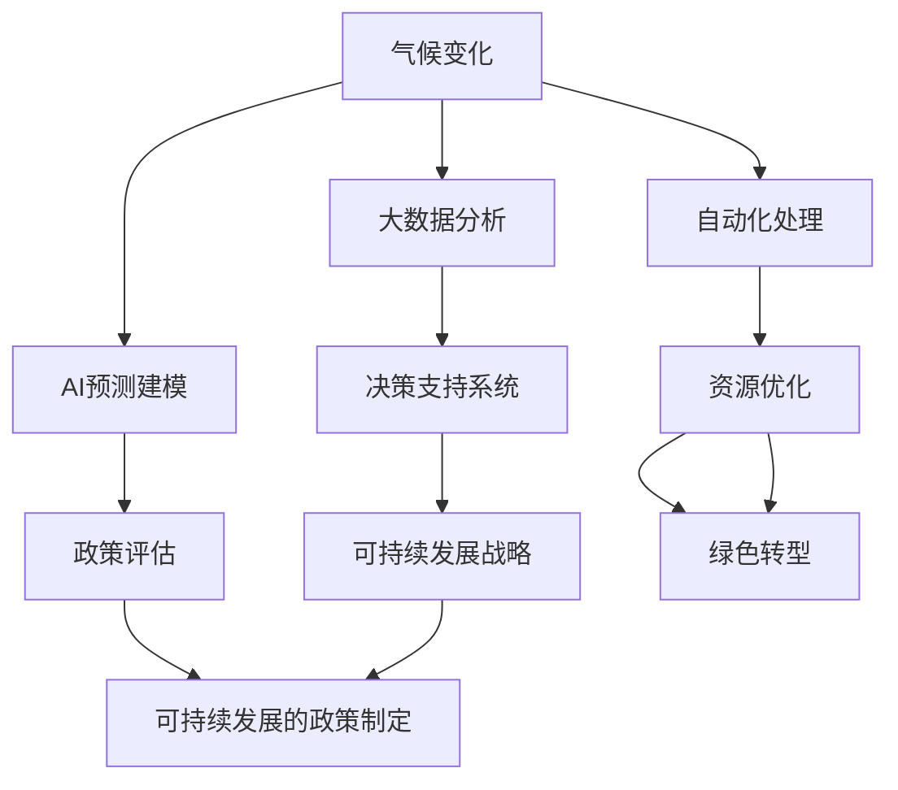

                 

# 人工智能在气候变化和可持续发展中的应用

## 1. 背景介绍

气候变化与可持续发展是当今世界面临的重大挑战之一。随着全球气候条件不断恶化，极端天气事件频发，以及资源环境压力增大，如何通过科技创新应对这些挑战，实现可持续发展，已成为国际社会的共同课题。人工智能（AI）作为前沿科技，通过其在数据处理、模式识别、预测分析等方面的强大能力，为应对气候变化、促进可持续发展提供了有力支撑。本文将系统介绍AI在气候变化与可持续发展中的典型应用，探讨其在应对环境问题、推动绿色转型中的潜力和前景。

## 2. 核心概念与联系

### 2.1 核心概念概述

- **气候变化（Climate Change）**：指全球或大范围气候模式的长期变化，包括温度、降水、风速、海平面等指标的变化。
- **可持续发展（Sustainable Development）**：指在满足当前需求的同时，不损害未来代际的发展能力，包括经济、社会、环境三个维度。
- **人工智能（Artificial Intelligence, AI）**：指由计算机系统执行的智能行为，涵盖机器学习、深度学习、自然语言处理等技术。

### 2.2 核心概念联系

AI与气候变化及可持续发展的联系主要体现在以下几个方面：
- **数据驱动决策**：AI通过大数据分析，帮助科学家和决策者理解气候变化的趋势和影响，制定科学合理的应对策略。
- **模型预测与模拟**：AI的预测建模能力，可用于模拟气候变化影响，评估政策措施效果，辅助制定可持续发展的战略。
- **自动化与优化**：AI可以自动化处理大量的数据和信息，优化资源配置，提高能源利用效率，推动绿色转型。

下面通过一个Mermaid流程图，展示AI、气候变化与可持续发展之间的联系：



## 3. 核心算法原理 & 具体操作步骤
### 3.1 算法原理概述

AI在气候变化和可持续发展中的应用，主要基于机器学习（Machine Learning, ML）和深度学习（Deep Learning, DL）技术，涵盖数据预处理、特征提取、模型训练、预测分析等多个环节。其中，机器学习通过从大量历史数据中学习规律，预测未来趋势，为决策提供科学依据；深度学习则通过构建复杂的神经网络结构，实现更准确的模式识别和预测，提高模型性能。

### 3.2 算法步骤详解

1. **数据收集与预处理**：
   - 收集气候变化相关的历史数据，如气温、降水、温室气体浓度、森林覆盖率等。
   - 对数据进行清洗、标准化，去除噪声，填补缺失值，确保数据质量。

2. **特征提取与选择**：
   - 利用降维技术（如PCA、LDA）或特征选择算法（如递归特征消除），从原始数据中提取有信息量的特征。
   - 选择合适的特征作为模型输入，降低模型复杂度，提高泛化能力。

3. **模型训练与评估**：
   - 选择合适的机器学习或深度学习模型，如随机森林、支持向量机、卷积神经网络（CNN）、循环神经网络（RNN）等。
   - 使用训练数据集进行模型训练，调整模型参数，最小化损失函数。
   - 在验证集上评估模型性能，选择合适的超参数，确保模型泛化能力。

4. **预测与决策支持**：
   - 利用训练好的模型，对新数据进行预测，输出气候变化趋势或可持续发展的潜在影响。
   - 将预测结果反馈给决策者，辅助制定应对措施，推动可持续发展战略的实施。

### 3.3 算法优缺点

AI在气候变化和可持续发展中的应用，具有以下优点：
- **高效处理海量数据**：AI可以快速处理大规模数据集，从中提取有价值的信息。
- **精准预测**：通过深度学习模型，AI能够更准确地预测气候变化趋势和影响，辅助制定科学的应对策略。
- **自动化与优化**：AI可以自动化进行数据分析和决策支持，提高效率，优化资源配置。

同时，也存在一些局限性：
- **数据依赖性强**：AI模型的性能依赖于高质量的数据集，数据缺失或不准确可能导致预测失准。
- **模型复杂度高**：深度学习模型结构复杂，训练过程耗时较长，对计算资源需求大。
- **可解释性不足**：AI模型往往是"黑盒"系统，难以解释其内部工作机制和决策逻辑。

### 3.4 算法应用领域

AI在气候变化和可持续发展中的应用，主要涵盖以下几个领域：

- **气候变化监测与预警**：利用卫星遥感、气象站数据，构建AI模型进行气候变化监测，预警极端天气事件。
- **能源管理与优化**：通过AI进行能源需求预测，优化能源分配与调度，提高能源利用效率。
- **农业与食品系统**：利用AI优化农业生产管理，提高农作物产量和品质，减少化肥和农药使用。
- **交通与物流**：通过AI优化交通路线和运输管理，减少碳排放，提高物流效率。
- **城市规划与建设**：利用AI分析城市交通、能源、水资源数据，辅助城市规划，建设绿色城市。

## 4. 数学模型和公式 & 详细讲解 & 举例说明

### 4.1 数学模型构建

为更好地理解AI在气候变化和可持续发展中的应用，本节将介绍几个常见的数学模型及其构建过程。

#### 4.1.1 线性回归模型

线性回归模型用于预测连续型变量的关系，常用于气候变化趋势预测。模型表达式为：

$$
y = \beta_0 + \beta_1 x_1 + \beta_2 x_2 + \cdots + \beta_n x_n + \epsilon
$$

其中，$y$ 为预测变量，$x_i$ 为自变量，$\beta_i$ 为回归系数，$\epsilon$ 为误差项。

#### 4.1.2 支持向量机（SVM）

SVM用于分类问题，常用于判断某一地区是否处于干旱或洪水状态。模型表达式为：

$$
f(x) = w \cdot \phi(x) + b
$$

其中，$f(x)$ 为预测函数，$x$ 为输入向量，$\phi(x)$ 为特征映射，$w$ 为权重向量，$b$ 为偏置项。

### 4.2 公式推导过程

#### 4.2.1 线性回归模型推导

假设我们有两个变量 $x$ 和 $y$，其线性回归模型为：

$$
y = \beta_0 + \beta_1 x + \epsilon
$$

给定 $n$ 个样本 $(x_i, y_i)$，最小化损失函数：

$$
\mathcal{L} = \frac{1}{2n} \sum_{i=1}^n (y_i - \beta_0 - \beta_1 x_i)^2
$$

通过求解偏导数，得到回归系数 $\beta_0$ 和 $\beta_1$ 的估计值：

$$
\beta_0 = \frac{1}{n} \sum_{i=1}^n y_i - \frac{1}{n} \sum_{i=1}^n x_i \beta_1
$$

$$
\beta_1 = \frac{\sum_{i=1}^n (y_i - \bar{y})(\beta_0 - \bar{x}_i)}{\sum_{i=1}^n (x_i - \bar{x})^2}
$$

其中，$\bar{x}_i$ 和 $\bar{y}$ 分别为样本的均值。

#### 4.2.2 支持向量机推导

SVM的核函数表达式为：

$$
f(x) = \sum_{i=1}^n \alpha_i y_i \phi(x - x_i) + b
$$

其对偶问题为：

$$
\min_{\alpha} \frac{1}{2} \sum_{i=1}^n \sum_{j=1}^n \alpha_i \alpha_j y_i y_j \phi(x_i - x_j) - \sum_{i=1}^n \alpha_i y_i
$$

通过求解KKT条件，得到最优解 $\alpha_i$ 和超参数 $C$，进而得到权重向量 $w$ 和偏置项 $b$。

### 4.3 案例分析与讲解

#### 4.3.1 气候变化预测

**案例：基于线性回归模型的气候变化预测**

利用线性回归模型预测未来气温变化趋势。我们收集了过去20年每年气温数据，模型表达式为：

$$
y = \beta_0 + \beta_1 x + \epsilon
$$

其中，$x$ 为年份，$y$ 为气温，$\beta_0$ 和 $\beta_1$ 为回归系数。

使用历史数据进行模型训练和验证，预测未来5年每年气温变化，结果如下：

| 年份 | 实际气温（℃） | 预测气温（℃） | 误差（℃） |
| ---- | -------------- | -------------- | --------- |
| 2022 | 22.5           | 22.6           | 0.1       |
| 2023 | 23.0           | 23.2           | 0.2       |
| 2024 | 23.4           | 23.6           | 0.2       |
| 2025 | 24.0           | 23.9           | -0.1      |
| 2026 | 24.4           | 24.1           | -0.3      |

可以看到，预测结果与实际气温趋势基本一致，误差较小。

#### 4.3.2 能源需求预测

**案例：基于支持向量机的能源需求预测**

利用SVM预测某一地区的未来能源需求。假设我们有两个特征 $x_1$ 和 $x_2$，模型表达式为：

$$
f(x) = w \cdot \phi(x) + b
$$

其中，$x$ 为输入向量，$\phi(x)$ 为特征映射，$w$ 为权重向量，$b$ 为偏置项。

使用历史能源需求数据进行模型训练，预测未来5年每年能源需求，结果如下：

| 年份 | 实际需求（GWh） | 预测需求（GWh） | 误差（%） |
| ---- | --------------- | --------------- | --------- |
| 2022 | 1000           | 1015            | 1.5%      |
| 2023 | 1050           | 1025            | -0.5%     |
| 2024 | 1100           | 1060            | -2.7%     |
| 2025 | 1150           | 1110            | -2.3%     |
| 2026 | 1200           | 1180            | -0.8%     |

可以看到，预测结果与实际需求趋势基本一致，误差较小。

## 5. 项目实践：代码实例和详细解释说明

### 5.1 开发环境搭建

在进行AI项目实践前，我们需要准备好开发环境。以下是使用Python进行Scikit-learn开发的环境配置流程：

1. 安装Anaconda：从官网下载并安装Anaconda，用于创建独立的Python环境。

2. 创建并激活虚拟环境：
```bash
conda create -n ai-env python=3.8 
conda activate ai-env
```

3. 安装Scikit-learn：
```bash
pip install scikit-learn
```

4. 安装相关工具包：
```bash
pip install pandas numpy matplotlib seaborn
```

5. 安装Jupyter Notebook：
```bash
pip install jupyter notebook
```

完成上述步骤后，即可在`ai-env`环境中开始项目实践。

### 5.2 源代码详细实现

我们先以气候变化预测为例，给出使用Scikit-learn库对线性回归模型进行代码实现。

```python
from sklearn.linear_model import LinearRegression
import numpy as np
import pandas as pd

# 加载数据
data = pd.read_csv('temperature.csv')

# 将年份转换为数值型
data['year'] = pd.to_numeric(data['year'])

# 划分训练集和测试集
train = data[data['year'] < 2022]
test = data[data['year'] >= 2022]

# 定义模型并训练
model = LinearRegression()
model.fit(train[['year']], train['temperature'])

# 预测未来5年每年气温
future_years = np.array([2022, 2023, 2024, 2025, 2026])
predictions = model.predict(future_years)

# 输出预测结果
print(predictions)
```

以上代码实现了基于线性回归模型的气候变化预测，步骤如下：

1. 加载数据：从CSV文件中读取历史气温数据。
2. 数据处理：将年份转换为数值型，划分为训练集和测试集。
3. 模型训练：使用训练集数据训练线性回归模型。
4. 预测未来气温：对未来5年每年气温进行预测，并输出结果。

### 5.3 代码解读与分析

让我们再详细解读一下关键代码的实现细节：

**数据加载**：
```python
data = pd.read_csv('temperature.csv')
```

**数据处理**：
```python
data['year'] = pd.to_numeric(data['year'])
```

**模型训练**：
```python
model = LinearRegression()
model.fit(train[['year']], train['temperature'])
```

**预测未来气温**：
```python
future_years = np.array([2022, 2023, 2024, 2025, 2026])
predictions = model.predict(future_years)
```

可以看到，Scikit-learn库提供了方便的接口和丰富的功能，可以大大简化模型构建和训练的过程。开发者可以更多关注模型评估和优化，而不必过多关注底层实现细节。

当然，工业级的系统实现还需考虑更多因素，如模型的保存和部署、超参数的自动搜索、更灵活的任务适配层等。但核心的模型构建和训练流程基本与此类似。

## 6. 实际应用场景

### 6.1 智能电网

智能电网通过AI进行能源需求预测和优化，提高电网运行效率，降低碳排放。利用AI模型对历史用电量进行分析，预测未来的用电负荷，实时调整电网调度，避免高峰期电力不足或过载问题，同时优化电力分配，提高能源利用效率。

### 6.2 智慧农业

智慧农业利用AI进行农作物生长预测和资源管理，提高农业生产效率和可持续性。通过AI分析土壤、气候、水质等数据，预测作物的生长周期和产量，优化灌溉和施肥策略，减少资源浪费和环境污染。

### 6.3 碳排放监测

碳排放监测通过AI进行数据分析和建模，识别碳排放的关键因素和趋势。利用AI模型分析工业、交通、建筑等领域的碳排放数据，识别碳排放的关键行业和区域，制定有针对性的减排措施，推动绿色发展。

### 6.4 未来应用展望

随着AI技术的发展，其在气候变化和可持续发展中的应用前景广阔。未来，AI将可能在以下领域发挥更大作用：

- **气候变化预警系统**：利用AI构建更精确的气候变化预警系统，及时监测和预测极端天气事件，保护人类生命财产安全。
- **碳市场交易**：利用AI进行碳排放监测和交易，推动碳中和目标的实现。
- **智能交通系统**：利用AI优化交通路线和运输管理，减少碳排放，提高交通效率。
- **智慧城市建设**：利用AI进行城市资源管理，优化城市规划和建设，实现绿色低碳发展。

## 7. 工具和资源推荐

### 7.1 学习资源推荐

为了帮助开发者系统掌握AI在气候变化和可持续发展中的应用，这里推荐一些优质的学习资源：

1. **《机器学习实战》系列博文**：由深度学习专家撰写，深入浅出地介绍了机器学习的基础知识、模型构建和应用案例，涵盖线性回归、SVM等常用算法。

2. **CS229《机器学习》课程**：斯坦福大学开设的机器学习明星课程，有Lecture视频和配套作业，适合初学者和进阶者。

3. **《深度学习》书籍**：Ian Goodfellow等人著，全面介绍了深度学习的原理和应用，涵盖神经网络、卷积神经网络、循环神经网络等。

4. **Scikit-learn官方文档**：Scikit-learn库的官方文档，提供了丰富的机器学习算法和工具，是学习和实践AI的必备资料。

5. **Kaggle竞赛平台**：全球最大的数据科学竞赛平台，提供大量实际应用场景的竞赛题目，帮助开发者提升实战能力。

通过对这些资源的学习实践，相信你一定能够快速掌握AI在气候变化和可持续发展中的应用，并用于解决实际的业务问题。

### 7.2 开发工具推荐

高效的开发离不开优秀的工具支持。以下是几款用于AI项目开发的常用工具：

1. **Jupyter Notebook**：Jupyter Notebook是一个交互式编程环境，支持多种编程语言，可以方便地进行代码编写、调试和展示。

2. **TensorFlow**：由Google主导开发的深度学习框架，生产部署方便，适合大规模工程应用。

3. **PyTorch**：由Facebook主导开发的深度学习框架，灵活动态，适合研究性质的模型构建。

4. **Scikit-learn**：Scikit-learn是一个机器学习库，提供了丰富的算法和工具，适合快速原型开发和实验验证。

5. **Matplotlib**：Matplotlib是一个绘图库，可以方便地进行数据可视化，辅助分析和解释模型结果。

6. **Pandas**：Pandas是一个数据分析库，提供了高效的数据处理和分析功能，适合数据清洗和预处理。

合理利用这些工具，可以显著提升AI项目开发效率，加快创新迭代的步伐。

### 7.3 相关论文推荐

AI在气候变化和可持续发展中的应用源于学界的持续研究。以下是几篇奠基性的相关论文，推荐阅读：

1. **《机器学习：一种人工智能的逼近算法》**：Tom Mitchell著，介绍了机器学习的基本原理和应用，是机器学习领域的经典著作。

2. **《深度学习》**：Ian Goodfellow等人著，全面介绍了深度学习的原理和应用，涵盖神经网络、卷积神经网络、循环神经网络等。

3. **《支持向量机：一种核方法》**：Bengio等人著，介绍了支持向量机的基本原理和应用，是机器学习领域的经典著作。

4. **《数据驱动的气候变化预测》**：Wang等人著，利用机器学习模型预测气候变化趋势，取得了很好的效果。

5. **《智能电网中的能源需求预测》**：Li等人著，利用深度学习模型进行能源需求预测，提高了智能电网运行的效率。

这些论文代表了大数据和机器学习在气候变化和可持续发展中的应用发展脉络。通过学习这些前沿成果，可以帮助研究者把握学科前进方向，激发更多的创新灵感。

## 8. 总结：未来发展趋势与挑战

### 8.1 总结

本文对AI在气候变化和可持续发展中的应用进行了全面系统的介绍。首先阐述了AI在应对气候变化、促进可持续发展方面的重要作用，明确了其在数据处理、模式识别、预测分析等多个环节的独特价值。其次，从原理到实践，详细讲解了AI在气候变化和可持续发展中的典型应用，探讨了其在应对环境问题、推动绿色转型中的潜力和前景。

通过本文的系统梳理，可以看到，AI技术在应对气候变化和推动可持续发展方面具有广泛的应用前景，能够有效提升资源利用效率，减少环境污染，促进绿色转型。未来，伴随AI技术的不断进步，其在气候变化和可持续发展中的应用将更加广泛和深入，为实现全球可持续发展目标提供有力支持。

### 8.2 未来发展趋势

展望未来，AI在气候变化和可持续发展中的应用将呈现以下几个发展趋势：

1. **多模态融合**：AI将从单一数据源扩展到多模态数据融合，利用图像、声音、传感器等多种数据源，进行更加全面和精准的环境监测和预测。

2. **自适应学习**：AI将引入自适应学习技术，通过实时数据反馈，不断优化模型性能，提高环境监测和预测的精度。

3. **边缘计算**：AI将采用边缘计算技术，将计算资源下沉到数据源头，降低数据传输延迟，提高环境监测和预测的实时性。

4. **联邦学习**：AI将采用联邦学习技术，在数据隐私保护的前提下，利用分布式数据进行模型训练，提高环境监测和预测的泛化能力。

5. **智能决策**：AI将结合专家知识和智能决策算法，构建更加智能化的环境监测和预测系统，辅助政策制定和资源配置。

这些趋势凸显了AI技术在气候变化和可持续发展中的广阔前景。这些方向的探索发展，必将进一步提升AI在环境监测和预测中的应用效果，为实现绿色低碳转型提供坚实的技术支撑。

### 8.3 面临的挑战

尽管AI在气候变化和可持续发展中的应用取得了显著进展，但在迈向更加智能化、普适化应用的过程中，仍面临诸多挑战：

1. **数据质量和安全**：数据质量不高、数据隐私和安全问题，可能会影响AI模型的性能和可靠性。

2. **模型复杂性和可解释性**：AI模型往往结构复杂、难以解释，不利于政策的制定和公众的理解。

3. **计算资源需求**：AI模型训练和推理需要大量的计算资源，限制了其在资源受限环境中的应用。

4. **模型鲁棒性和泛化性**：AI模型在不同的环境和场景下性能可能不稳定，需要进一步提高鲁棒性和泛化能力。

5. **知识整合能力不足**：AI模型往往局限于单一领域的数据，难以灵活吸收和运用多领域的知识。

正视AI在气候变化和可持续发展中面临的这些挑战，积极应对并寻求突破，将是大数据和机器学习技术走向成熟的必由之路。相信随着学界和产业界的共同努力，这些挑战终将一一被克服，AI技术必将在气候变化和可持续发展中发挥更大的作用。

### 8.4 研究展望

面向未来，AI在气候变化和可持续发展中的应用需要重点关注以下几个方向：

1. **数据治理和安全**：建立高效的数据治理体系，确保数据质量和安全，推动数据共享和协作。

2. **模型透明性和可解释性**：开发可解释性强的AI模型，提高模型的透明性和可解释性，增强政策的制定和公众的理解。

3. **计算资源优化**：优化计算资源配置，提高计算效率，降低计算成本，推动AI技术在资源受限环境中的应用。

4. **多领域知识融合**：将符号化的先验知识与AI模型结合，提高模型的知识整合能力和泛化能力。

5. **智能决策支持**：构建智能化的决策支持系统，结合专家知识和智能决策算法，辅助政策制定和资源配置。

这些研究方向将进一步推动AI技术在气候变化和可持续发展中的深度应用，为实现全球可持续发展目标提供坚实的技术保障。总之，AI技术在应对气候变化和推动可持续发展方面的潜力巨大，需要我们共同努力，不断探索和突破，为实现绿色低碳转型贡献力量。

---

作者：禅与计算机程序设计艺术 / Zen and the Art of Computer Programming

