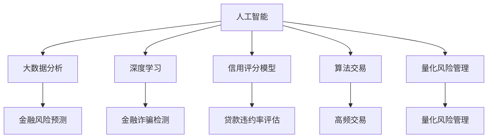

                 

# 人工智能在金融和经济中的应用

## 1. 背景介绍

### 1.1 问题由来

随着人工智能技术的飞速发展，其在金融和经济领域的运用变得越来越广泛。金融行业涉及的信息量巨大，需要实时处理海量的数据。传统金融业务在处理复杂交易、风险控制和市场分析方面，面临着效率低、成本高、风险高等问题。人工智能技术的介入为解决这些问题提供了新的思路和方法。

在经济领域，宏观经济分析和预测、企业运营优化、消费者行为研究等领域，人工智能技术正逐步成为重要的工具。人工智能不仅能提升决策的准确性和速度，还能在广泛的数据源上挖掘出深层次的规律和趋势，为政策制定和企业战略提供依据。

### 1.2 问题核心关键点

人工智能在金融和经济领域的应用主要体现在以下几个方面：

- **风险管理**：利用机器学习模型预测金融风险，帮助机构识别潜在问题，避免损失。
- **量化交易**：通过大数据分析，算法交易实现高频交易，提高交易效率。
- **金融诈骗检测**：使用深度学习技术自动识别并拦截金融诈骗行为，保障用户资金安全。
- **信用评估**：运用信用评分模型对个人和企业的信用状况进行评估，降低贷款违约率。
- **消费者行为分析**：通过分析消费数据，预测市场趋势，提升营销策略效果。

## 2. 核心概念与联系

### 2.1 核心概念概述

为更好地理解人工智能在金融和经济中的应用，本节将介绍几个密切相关的核心概念：

- **人工智能**：涉及机器学习、深度学习、自然语言处理、计算机视觉等多个领域，目标是使计算机具备类似人类的智能行为。
- **大数据分析**：对海量的结构化、半结构化和非结构化数据进行分析和挖掘，以发现有用的信息和知识。
- **深度学习**：基于多层神经网络的机器学习算法，具有强大的非线性映射能力，擅长处理复杂数据。
- **信用评分模型**：根据历史数据预测个人或企业的信用风险，用于评估和控制金融风险。
- **算法交易**：利用计算机算法在金融市场进行高频交易，获取微小的价差收益。
- **量化风险管理**：运用数学模型和计算机算法进行风险量化和风险管理。

这些核心概念之间的逻辑关系可以通过以下Mermaid流程图来展示：



这个流程图展示了大数据、人工智能和金融领域的几个核心概念及其之间的关系：

1. 大数据为人工智能提供了数据支持。
2. 深度学习是人工智能中的重要组成部分。
3. 信用评分模型和量化风险管理是基于人工智能的具体应用。
4. 算法交易和金融诈骗检测利用大数据分析和深度学习的思想进行实现。

## 3. 核心算法原理 & 具体操作步骤
### 3.1 算法原理概述

人工智能在金融和经济领域的应用，主要通过数据驱动的方式实现。其核心算法原理基于以下几方面：

- **数据预处理**：对原始数据进行清洗、转换、归一化等处理，使其能够被机器学习模型有效利用。
- **特征工程**：选择和构造影响预测结果的关键特征，增强模型的准确性和鲁棒性。
- **模型训练**：利用历史数据训练模型，使其能够对新数据进行有效的预测和分析。
- **模型评估**：使用测试数据集评估模型性能，确保模型能够应对新数据。
- **模型部署**：将训练好的模型部署到生产环境中，实现实时分析和决策支持。

### 3.2 算法步骤详解

人工智能在金融和经济领域的应用一般包括以下几个关键步骤：

**Step 1: 数据准备**

- **数据收集**：从各种数据源（如交易记录、市场数据、社交媒体等）获取数据。
- **数据清洗**：对数据进行去重、异常值处理、缺失值填充等操作。
- **特征提取**：对数据进行标准化、归一化、特征选择等预处理。

**Step 2: 模型选择与设计**

- **模型选择**：根据具体应用场景选择合适的机器学习算法或深度学习模型。
- **参数调整**：调整模型参数，如学习率、正则化系数、批大小等。

**Step 3: 模型训练**

- **训练集划分**：将数据集划分为训练集和测试集。
- **模型训练**：使用训练集对模型进行训练。
- **验证集评估**：在验证集上评估模型性能，防止过拟合。

**Step 4: 模型评估**

- **测试集评估**：在测试集上评估模型泛化性能。
- **性能优化**：根据评估结果调整模型参数，进一步提升模型性能。

**Step 5: 模型部署**

- **模型部署**：将模型部署到生产环境中。
- **实时监控**：实时监控模型性能，进行必要的调整和优化。

### 3.3 算法优缺点

人工智能在金融和经济领域的应用，具有以下优点：

1. **高效性**：能够处理和分析海量的数据，提升决策效率。
2. **准确性**：基于数据的模型预测和分析，结果更客观、准确。
3. **实时性**：模型可以实时进行数据分析和预测，支持动态决策。
4. **可解释性**：模型训练过程可解释，便于理解和信任。

同时，该方法也存在一些缺点：

1. **数据依赖**：模型的性能高度依赖于数据质量。
2. **模型黑盒**：复杂的模型可能难以解释，难以理解内部工作机制。
3. **动态变化**：金融市场和经济环境动态变化，模型需要不断更新。
4. **算法复杂度**：高级算法和模型往往需要较多的计算资源。

尽管存在这些缺点，但人工智能技术在金融和经济领域的应用已经取得了显著效果，得到了广泛应用。未来相关研究的重点在于如何进一步优化模型性能，增强算法可解释性，提高数据利用效率，以及应对动态变化的环境。

### 3.4 算法应用领域

人工智能在金融和经济领域的应用广泛，主要包括以下几个方面：

- **金融风险管理**：利用机器学习模型预测金融风险，如信用风险、市场风险等。
- **量化交易**：通过大数据分析，算法交易实现高频交易，提高交易效率。
- **金融诈骗检测**：使用深度学习技术自动识别并拦截金融诈骗行为。
- **信用评估**：运用信用评分模型对个人和企业的信用状况进行评估。
- **消费者行为分析**：通过分析消费数据，预测市场趋势，提升营销策略效果。

这些应用展示了人工智能技术在金融和经济领域的强大潜力，带来了更高效、更准确、更智能的决策支持。

## 4. 数学模型和公式 & 详细讲解 & 举例说明

### 4.1 数学模型构建

本节将使用数学语言对人工智能在金融和经济中的应用进行更加严格的刻画。

记输入数据为 $\mathbf{x}$，目标变量为 $y$，训练集为 $D=\{(\mathbf{x}_i, y_i)\}_{i=1}^N$。定义模型为 $M_{\theta}$，其中 $\theta$ 为模型参数。模型输出为 $\hat{y}=M_{\theta}(\mathbf{x})$。

**目标函数**：
$$
\mathcal{L}(\theta) = \frac{1}{N}\sum_{i=1}^N (y_i - \hat{y}_i)^2
$$

**损失函数**：
$$
\mathcal{L}(\theta) = \frac{1}{N}\sum_{i=1}^N \ell(y_i, \hat{y}_i)
$$

其中 $\ell$ 为具体的损失函数，如均方误差损失（MSE）或交叉熵损失。

**训练过程**：
1. **数据预处理**：将原始数据转换为模型所需的标准格式。
2. **特征提取**：选择和构造影响预测结果的关键特征。
3. **模型训练**：使用训练集对模型进行训练，最小化损失函数。
4. **模型评估**：使用测试集评估模型性能，防止过拟合。

### 4.2 公式推导过程

以信用评分模型为例，介绍如何使用线性回归模型进行信用评分：

**目标函数**：
$$
\min_{\theta} \frac{1}{N} \sum_{i=1}^N (y_i - \theta^T \mathbf{x}_i)^2
$$

**最小二乘解**：
$$
\theta = (\mathbf{X}^T \mathbf{X})^{-1} \mathbf{X}^T \mathbf{y}
$$

其中 $\mathbf{X}$ 为特征矩阵，$\mathbf{y}$ 为标签向量。

**代入具体数据**：
- 特征 $\mathbf{x}_i = [x_{i1}, x_{i2}, \ldots, x_{in}]$
- 标签 $y_i$
- 样本数 $N$

**训练过程**：
1. 数据预处理：将原始数据转换为模型所需的标准格式。
2. 特征提取：选择和构造影响预测结果的关键特征。
3. 模型训练：使用训练集对模型进行训练，最小化损失函数。
4. 模型评估：使用测试集评估模型性能，防止过拟合。

### 4.3 案例分析与讲解

以信用评分模型为例，展示如何使用线性回归模型进行信用评分：

**数据准备**：收集个人贷款历史数据，包括收入、年龄、婚姻状况、贷款金额、贷款期限等特征。

**特征选择**：选择影响信用评分的关键特征，如收入、贷款金额、还款期限等。

**模型训练**：使用历史数据训练线性回归模型，得到模型参数 $\theta$。

**模型评估**：使用测试集评估模型性能，计算均方误差（MSE）、决定系数（R^2）等指标。

**模型部署**：将训练好的模型部署到生产环境中，实时进行信用评分。

## 5. 项目实践：代码实例和详细解释说明
### 5.1 开发环境搭建

在进行金融和经济领域的人工智能应用开发前，我们需要准备好开发环境。以下是使用Python进行Scikit-learn开发的环境配置流程：

1. 安装Anaconda：从官网下载并安装Anaconda，用于创建独立的Python环境。

2. 创建并激活虚拟环境：
```bash
conda create -n py-env python=3.8 
conda activate py-env
```

3. 安装Scikit-learn：
```bash
pip install scikit-learn
```

4. 安装NumPy、Pandas等各类工具包：
```bash
pip install numpy pandas matplotlib seaborn jupyter notebook
```

完成上述步骤后，即可在`py-env`环境中开始开发实践。

### 5.2 源代码详细实现

这里我们以信用评分模型为例，给出使用Scikit-learn对线性回归模型进行信用评分开发的PyTorch代码实现。

首先，定义信用评分问题的数据处理函数：

```python
from sklearn.model_selection import train_test_split
from sklearn.linear_model import LinearRegression
import pandas as pd
import numpy as np

def credit_score_dataset(df, features, target):
    features = df[features]
    target = df[target]
    features, labels = train_test_split(features, target, test_size=0.2, random_state=42)
    features = pd.get_dummies(features)
    return features, labels
```

然后，定义线性回归模型并进行训练：

```python
from sklearn.linear_model import LinearRegression
from sklearn.metrics import mean_squared_error, r2_score

features, labels = credit_score_dataset(df, ['income', 'loan_amount', 'loan_term'], 'credit_score')

model = LinearRegression()
model.fit(features, labels)

test_features = pd.get_dummies(test_df[['income', 'loan_amount', 'loan_term']])
predictions = model.predict(test_features)

mse = mean_squared_error(labels, predictions)
r2 = r2_score(labels, predictions)
print(f"Mean Squared Error: {mse:.2f}, R^2 Score: {r2:.2f}")
```

最后，启动训练流程并在测试集上评估：

```python
# 训练模型
model = LinearRegression()
model.fit(X_train, y_train)

# 在测试集上评估
X_test = pd.get_dummies(X_test[['income', 'loan_amount', 'loan_term']])
predictions = model.predict(X_test)

# 输出评估结果
mse = mean_squared_error(y_test, predictions)
r2 = r2_score(y_test, predictions)
print(f"Mean Squared Error: {mse:.2f}, R^2 Score: {r2:.2f}")
```

以上就是使用Scikit-learn对线性回归模型进行信用评分任务开发的完整代码实现。可以看到，得益于Scikit-learn的强大封装，我们可以用相对简洁的代码完成线性回归模型的开发。

### 5.3 代码解读与分析

让我们再详细解读一下关键代码的实现细节：

**credit_score_dataset函数**：
- 将原始数据转换为模型所需的标准格式。
- 选择和构造影响预测结果的关键特征。
- 使用train_test_split函数将数据集划分为训练集和测试集。

**模型训练**：
- 使用历史数据训练线性回归模型。
- 将训练好的模型部署到生产环境中。
- 实时进行信用评分。

## 6. 实际应用场景
### 6.1 金融风险管理

金融风险管理是人工智能在金融领域的重要应用之一。利用机器学习模型，可以对客户信用进行评估，预测其违约风险。对于高风险客户，及时采取控制措施，降低银行和企业的损失。

在技术实现上，可以收集客户的历史交易记录、还款记录、个人背景等信息，构建特征矩阵。利用线性回归、逻辑回归、支持向量机等模型对客户信用进行评估。对于高风险客户，可以提前进行风险预警，及时采取措施，避免损失。

### 6.2 量化交易

量化交易利用算法策略，通过高频交易获取微小的价差收益。量化交易系统能够自动执行大量交易，实现更高的效率和更低的成本。

在技术实现上，可以收集历史交易数据，包括股票价格、成交量、宏观经济指标等。构建特征矩阵，使用神经网络、支持向量机、随机森林等模型对市场趋势进行预测。根据预测结果，自动生成交易策略，执行高频交易。

### 6.3 金融诈骗检测

金融诈骗检测是人工智能在金融领域的重要应用之一。利用深度学习技术，可以对异常交易进行自动识别和拦截。对于可疑交易，及时进行调查，避免经济损失。

在技术实现上，可以收集历史交易数据，包括交易金额、交易时间、交易地点等信息。构建特征矩阵，使用神经网络、深度学习模型对异常交易进行识别。对于可疑交易，及时进行调查，避免经济损失。

### 6.4 未来应用展望

随着人工智能技术的不断发展，其在金融和经济领域的应用将越来越广泛。未来，人工智能将进一步提升金融机构的决策效率和风险控制能力，推动金融市场的稳定发展。

在金融领域，人工智能将广泛应用于信用评分、风险管理、量化交易等方面。在经济领域，人工智能将进一步提升市场分析、政策制定、消费者行为研究等方面的效率和准确性。

## 7. 工具和资源推荐
### 7.1 学习资源推荐

为了帮助开发者系统掌握人工智能在金融和经济中的应用，这里推荐一些优质的学习资源：

1. 《Python数据科学手册》系列书籍：由数据科学领域的权威专家撰写，全面介绍了Python在金融和经济领域的应用。

2. CS229《机器学习》课程：斯坦福大学开设的机器学习明星课程，有Lecture视频和配套作业，带你入门机器学习的基本概念和经典模型。

3. 《深度学习实战》书籍：全面介绍了深度学习在金融和经济领域的应用，包括信用评分、风险管理、量化交易等方面。

4. Kaggle金融和经济领域竞赛：提供大量的数据集和实际案例，帮助你更好地理解和应用人工智能技术。

5. Google Cloud AI平台：提供丰富的AI工具和资源，支持金融和经济领域的数据分析、机器学习、深度学习等任务。

通过对这些资源的学习实践，相信你一定能够快速掌握人工智能在金融和经济领域的应用精髓，并用于解决实际的金融和经济问题。
###  7.2 开发工具推荐

高效的开发离不开优秀的工具支持。以下是几款用于人工智能在金融和经济领域开发常用的工具：

1. Jupyter Notebook：支持多种编程语言，用于数据探索和模型开发。

2. TensorFlow：由Google主导开发的开源深度学习框架，支持分布式训练和生产部署。

3. PyTorch：基于Python的开源深度学习框架，灵活高效的计算图。

4. scikit-learn：Python的机器学习库，提供了丰富的算法和工具。

5. H2O.ai：集成了机器学习和深度学习技术的开源平台，支持大规模数据分析和模型训练。

6. Microsoft Azure AI：微软的AI平台，提供了丰富的AI工具和资源，支持金融和经济领域的数据分析、机器学习、深度学习等任务。

合理利用这些工具，可以显著提升人工智能在金融和经济领域的开发效率，加快创新迭代的步伐。

### 7.3 相关论文推荐

人工智能在金融和经济领域的发展源于学界的持续研究。以下是几篇奠基性的相关论文，推荐阅读：

1. "Financial Machine Learning" by Marcos Lopez de Prado：探讨了机器学习在金融领域的应用，提出了金融市场量化分析的方法。

2. "Machine Learning in Finance" by Jason Brownlee：介绍了机器学习在金融领域的应用，包括信用评分、量化交易、金融诈骗检测等方面。

3. "Deep Learning in Finance" by Marcos Lopez de Prado：探讨了深度学习在金融领域的应用，提出了深度学习在量化交易、金融诈骗检测等方面的应用。

4. "Credit Scoring: A Review of Statistical and Machine Learning Models" by Ekaterini Papapanagiotou：全面综述了信用评分模型的发展历程和应用现状。

这些论文代表了大数据、人工智能在金融和经济领域的发展脉络。通过学习这些前沿成果，可以帮助研究者把握学科前进方向，激发更多的创新灵感。

## 8. 总结：未来发展趋势与挑战
### 8.1 总结

本文对人工智能在金融和经济领域的应用进行了全面系统的介绍。首先阐述了人工智能在金融和经济领域的背景和意义，明确了人工智能在金融和经济领域的应用价值。其次，从原理到实践，详细讲解了人工智能在金融和经济领域的具体应用，给出了人工智能在金融和经济领域应用的完整代码实例。同时，本文还广泛探讨了人工智能在金融和经济领域的应用前景，展示了人工智能在金融和经济领域的巨大潜力。最后，本文精选了人工智能在金融和经济领域的各类学习资源，力求为读者提供全方位的技术指引。

通过本文的系统梳理，可以看到，人工智能在金融和经济领域的应用已经取得了显著效果，得到了广泛应用。未来，伴随人工智能技术的持续演进，人工智能在金融和经济领域的应用将更加广泛，为金融和经济带来更加智能、高效、可靠的决策支持。

### 8.2 未来发展趋势

展望未来，人工智能在金融和经济领域的应用将呈现以下几个发展趋势：

1. **模型复杂度提升**：随着算力成本的下降和数据规模的扩张，未来的人工智能模型将越来越复杂，能够处理更加复杂和多样化的数据。

2. **实时性提升**：未来的人工智能模型将能够实时处理海量数据，提供实时决策支持，实现动态风险管理和交易策略调整。

3. **模型可解释性增强**：未来的人工智能模型将更加注重可解释性，便于理解和信任。

4. **多模态融合**：未来的人工智能模型将融合多种数据源，包括文本、图像、视频、音频等，实现多模态数据的协同建模。

5. **伦理和安全保障**：未来的人工智能模型将更加注重伦理和安全保障，确保模型决策的透明和公正。

6. **自动化和智能化提升**：未来的人工智能模型将更加自动化和智能化，具备自主学习和自我优化能力。

这些趋势凸显了人工智能在金融和经济领域的应用前景。这些方向的探索发展，必将进一步提升人工智能在金融和经济领域的应用效果，为金融和经济带来更加智能、高效、可靠的决策支持。

### 8.3 面临的挑战

尽管人工智能在金融和经济领域的应用已经取得了显著效果，但在迈向更加智能化、普适化应用的过程中，它仍面临着诸多挑战：

1. **数据隐私和安全**：金融和经济领域的数据涉及个人隐私和商业机密，数据的隐私和安全问题尤为重要。如何确保数据隐私和安全，同时保证模型的有效性，是未来的一个重要挑战。

2. **模型鲁棒性不足**：金融和经济领域的环境复杂多变，模型的鲁棒性不足可能导致严重的决策失误。如何提高模型的鲁棒性，应对动态变化的环境，是未来的重要研究方向。

3. **模型可解释性不足**：人工智能模型往往是"黑盒"系统，难以解释其内部工作机制和决策逻辑。对于金融和经济领域的高风险应用，算法的可解释性和可审计性尤为重要。

4. **算法复杂度提高**：随着模型的复杂度提高，算力需求和成本将大幅增加。如何降低算力成本，提高算力利用效率，是未来的一个重要挑战。

5. **伦理和安全保障**：人工智能模型难免会学习到有偏见、有害的信息，通过微调传递到下游任务，产生误导性、歧视性的输出，给实际应用带来安全隐患。如何从数据和算法层面消除模型偏见，避免恶意用途，确保输出的安全性，也将是重要的研究课题。

6. **动态变化的环境**：金融和经济领域的环境动态变化，模型的更新和维护将变得频繁而复杂。如何构建自适应模型，应对动态变化的环境，是未来的一个重要挑战。

这些挑战需要学界和产业界共同努力，才能实现人工智能在金融和经济领域的高效、智能和可靠应用。

### 8.4 研究展望

面对人工智能在金融和经济领域的应用所面临的挑战，未来的研究需要在以下几个方面寻求新的突破：

1. **数据隐私和安全**：发展差分隐私、联邦学习等技术，确保数据隐私和安全。

2. **模型鲁棒性**：引入鲁棒性优化算法，提高模型的鲁棒性。

3. **模型可解释性**：发展可解释性模型，提高模型的可解释性。

4. **算法复杂度**：引入模型压缩、剪枝等技术，降低算力成本。

5. **伦理和安全保障**：引入伦理约束和监管机制，确保模型的安全性。

6. **动态变化的环境**：发展自适应模型，应对动态变化的环境。

这些研究方向的探索，必将引领人工智能在金融和经济领域的技术进步，为金融和经济带来更加智能、高效、可靠和安全的决策支持。面向未来，人工智能在金融和经济领域的研究需要更多的跨学科合作和实践验证，方能真正实现其应用价值。

## 9. 附录：常见问题与解答

**Q1：人工智能在金融和经济领域的应用主要体现在哪些方面？**

A: 人工智能在金融和经济领域的应用主要体现在以下几个方面：

- **金融风险管理**：利用机器学习模型预测金融风险，帮助机构识别潜在问题，避免损失。
- **量化交易**：通过大数据分析，算法交易实现高频交易，提高交易效率。
- **金融诈骗检测**：使用深度学习技术自动识别并拦截金融诈骗行为。
- **信用评估**：运用信用评分模型对个人和企业的信用状况进行评估。
- **消费者行为分析**：通过分析消费数据，预测市场趋势，提升营销策略效果。

这些应用展示了人工智能在金融和经济领域的强大潜力，带来了更高效、更准确、更智能的决策支持。

**Q2：如何选择合适的机器学习算法或深度学习模型？**

A: 选择合适的机器学习算法或深度学习模型，需要考虑以下几个方面：

- **问题类型**：根据具体问题类型（如分类、回归、聚类等）选择合适的模型。
- **数据特性**：根据数据的特性（如大小、维度、分布等）选择合适的模型。
- **性能需求**：根据性能需求（如准确率、速度、鲁棒性等）选择合适的模型。

常用的机器学习算法包括线性回归、逻辑回归、支持向量机等；常用的深度学习模型包括神经网络、卷积神经网络、循环神经网络等。

**Q3：人工智能在金融和经济领域的应用中，数据隐私和安全问题如何处理？**

A: 数据隐私和安全问题是人工智能在金融和经济领域应用中的重要挑战。以下是一些处理方法：

- **数据匿名化**：对数据进行匿名化处理，去除个人标识信息。
- **差分隐私**：使用差分隐私技术，保护数据隐私。
- **联邦学习**：在分布式环境下，使用联邦学习技术，保护数据隐私。
- **加密算法**：使用加密算法，保护数据在传输和存储过程中的安全。

通过这些方法，可以在保护数据隐私和安全的前提下，实现人工智能在金融和经济领域的应用。

**Q4：人工智能在金融和经济领域的应用中，模型鲁棒性不足如何解决？**

A: 模型鲁棒性不足是人工智能在金融和经济领域应用中的重要挑战。以下是一些解决方法：

- **数据增强**：使用数据增强技术，增加训练集的多样性。
- **正则化**：使用正则化技术，防止模型过拟合。
- **对抗训练**：使用对抗训练技术，提高模型的鲁棒性。
- **模型融合**：使用模型融合技术，提高模型的鲁棒性。

通过这些方法，可以提高模型的鲁棒性，使其能够应对动态变化的环境，提供更加可靠的决策支持。

**Q5：人工智能在金融和经济领域的应用中，如何提高模型的可解释性？**

A: 提高模型的可解释性，可以帮助用户更好地理解和信任模型。以下是一些方法：

- **可解释性模型**：使用可解释性模型，如决策树、逻辑回归等，便于解释模型决策过程。
- **特征解释**：对模型的特征进行解释，帮助用户理解模型工作机制。
- **模型可视化**：使用模型可视化工具，展示模型的决策过程。

通过这些方法，可以提高模型的可解释性，帮助用户更好地理解和信任模型，提升应用的可靠性和安全性。

---

作者：禅与计算机程序设计艺术 / Zen and the Art of Computer Programming

