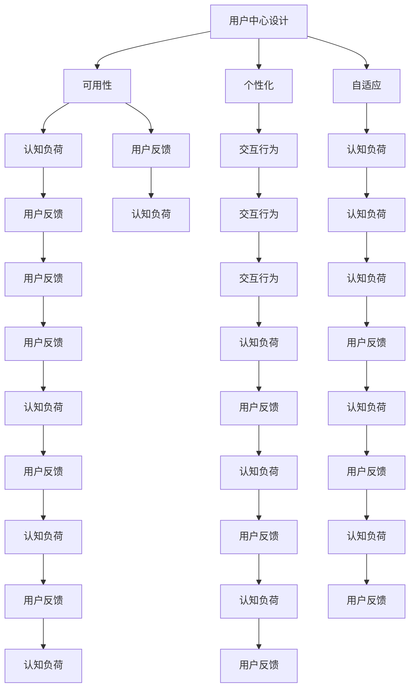

                 

# 人机交互设计：打造高效的人类计算系统

> 关键词：人机交互设计,人类计算系统,界面设计,用户中心,可用性,个性化,自适应,交互行为,认知负荷,用户反馈

## 1. 背景介绍

### 1.1 问题由来
随着信息技术的飞速发展，计算设备已经深入到人类生活的各个方面。从办公室的PC到随身携带的手机，从在线商务到智能家居，计算设备正在重塑我们的工作方式和生活习惯。但同时，过度依赖电子设备也带来了许多问题。例如，信息过载、健康问题、隐私泄露等。

为了解决这个问题，计算机科学家们开始研究如何改善人机交互设计，以提高用户的使用体验。在这种背景下，"人机交互设计"（Human-Computer Interaction, HCI）作为一个崭新的研究领域应运而生。HCI旨在通过合理设计计算机界面，使计算机能够更好地服务于人类，减轻用户认知负荷，降低使用难度。

### 1.2 问题核心关键点
为了实现这一目标，HCI需要关注以下几个关键点：

- **用户中心**：设计时始终以用户体验为核心，关注用户的需求和行为，避免设计理念过于自我中心。
- **可用性**：界面简洁易用，操作简单，避免因复杂操作而导致用户挫败感。
- **个性化**：根据用户的行为和偏好调整界面布局和操作方式，提供定制化体验。
- **自适应**：根据用户的使用习惯和环境变化自动调整界面和功能，适应不同的场景。
- **交互行为**：通过分析用户行为模式，优化交互流程，提高效率。
- **认知负荷**：减少认知负荷，使用户可以更专注于任务本身，而不是界面操作。
- **用户反馈**：设计合理的用户反馈机制，帮助用户及时了解操作结果和系统状态。

## 2. 核心概念与联系

### 2.1 核心概念概述

为了更好地理解HCI，我们首先需要明确几个核心概念：

- **人机交互设计(Human-Computer Interaction, HCI)**：研究如何通过合理设计计算机界面，提高用户与计算机的交互效率和体验。
- **用户中心设计(User-Centered Design, UCD)**：以用户需求和体验为核心，设计出符合用户期望的计算机系统。
- **可用性（Usability）**：衡量计算机系统易用性的指标，包括易学性、易用性、效率、满意度等。
- **个性化（Personalization）**：根据用户行为和偏好调整界面和功能，提供定制化的用户体验。
- **自适应（Adaptability）**：系统根据用户的行为和环境变化自动调整界面和功能，适应不同的场景。
- **认知负荷（Cognitive Load）**：用户在执行任务时所需的心理和物理负担，需要尽量减少。
- **用户反馈（User Feedback）**：设计合理的用户反馈机制，帮助用户及时了解操作结果和系统状态。

### 2.2 核心概念联系
以下是一个Mermaid流程图，展示了HCI中各个核心概念之间的关系：



这个流程图展示了各个概念之间的逻辑关系。例如，用户中心设计会直接影响系统的可用性、个性化和自适应；可用性设计需要考虑用户的认知负荷和反馈，而个性化和自适应又进一步影响用户的认知负荷和反馈。这些概念相互作用，共同构成了HCI设计的全貌。

## 3. 核心算法原理 & 具体操作步骤
### 3.1 算法原理概述

HCI设计的核心算法原理主要基于用户心理学和行为学的研究成果。设计者通过对用户的认知负荷、行为模式、情感需求等进行分析，合理设计计算机界面，以提高系统的可用性和用户体验。

### 3.2 算法步骤详解

HCI设计的具体步骤包括：

1. **用户研究**：通过问卷调查、用户访谈、用户测试等方式，了解用户的需求和行为，识别设计中的问题和改进点。
2. **需求分析**：分析用户研究结果，明确系统的功能需求、性能指标和用户期望。
3. **界面设计**：根据用户需求和系统功能，设计简洁、易用、自适应的用户界面。
4. **可用性评估**：通过用户测试、可用性测试等方式，评估界面设计的可用性和用户体验，并根据测试结果进行优化。
5. **个性化定制**：根据用户行为和偏好，提供定制化的界面布局和功能配置。
6. **自适应调整**：根据用户的行为和环境变化，动态调整界面和功能，提升用户体验。
7. **反馈机制设计**：设计合理的用户反馈机制，帮助用户及时了解操作结果和系统状态。

### 3.3 算法优缺点

HCI设计的优点包括：

- **提高用户满意度**：通过合理的界面设计，提高用户的使用体验，减少因复杂操作导致的挫败感。
- **提升系统效率**：简洁、易用的界面可以减少用户的学习成本，提高操作效率。
- **个性化定制**：根据用户的行为和偏好提供定制化服务，提升用户的满意度和忠诚度。

同时，HCI设计也存在一些缺点：

- **设计复杂**：需要考虑多方面因素，如用户需求、认知负荷、行为模式等，设计复杂度较高。
- **成本高**：用户研究的投入和用户测试的成本较高，开发周期较长。
- **技术依赖**：依赖于用户心理学和行为学的研究成果，设计者的专业水平影响较大。

### 3.4 算法应用领域

HCI设计不仅在软件界面设计中应用广泛，还在硬件设计、虚拟现实、增强现实、人工智能等多个领域中得到了应用。以下是一些具体的应用场景：

- **移动应用**：设计简洁易用的移动应用界面，提高用户的使用体验和满意度。
- **智能家居**：通过自适应界面和个性化配置，提升用户对智能家居设备的控制和满意度。
- **在线商务**：设计高效的在线购物平台界面，提升用户购物体验和满意度。
- **虚拟现实**：设计沉浸式虚拟现实界面，提升用户的沉浸感和互动体验。
- **增强现实**：设计互动性强的增强现实界面，提升用户的互动体验和感知效果。
- **人工智能**：设计高效的人机交互界面，提升用户对AI系统的理解和满意度。

## 4. 数学模型和公式 & 详细讲解  
### 4.1 数学模型构建

HCI设计的数学模型主要基于用户心理学和行为学的研究成果，通过量化用户的行为和需求，合理设计计算机界面。

定义用户对系统功能的期望为$f_0$，系统的实际功能为$f$，用户对系统界面的认知负荷为$L$，用户对系统界面的满意度为$S$。根据上述定义，可以构建以下数学模型：

$$
S = f(L, f_0, f)
$$

其中$L$和$f_0$可以看作是系统的输入，$f$是系统的输出。系统的目标是最大化用户的满意度$S$，同时最小化用户的认知负荷$L$。

### 4.2 公式推导过程

根据上述定义，可以进一步推导出以下公式：

$$
S = \max_{f} \left[ (f_0 - f) \cdot S_0 \right]
$$

其中$S_0$表示用户对系统功能的期望满意度。

由于$f$需要通过用户研究确定，因此实际设计中需要多次迭代，不断调整$f_0$和$f$，以最大化$S$。

### 4.3 案例分析与讲解

以在线购物平台的界面设计为例，通过用户研究确定用户对系统功能的期望$f_0$为"商品展示、购物车、结账、订单状态查询"，系统的实际功能$f$为"商品展示、购物车、结账、订单状态查询、搜索、过滤"。通过设计合理的界面布局和操作方式，将用户认知负荷$L$降至最低，同时提升用户满意度$S$。

## 5. 项目实践：代码实例和详细解释说明
### 5.1 开发环境搭建

在进行HCI设计实践前，需要先搭建好开发环境。以下是使用Python进行PyTorch开发的环境配置流程：

1. 安装Anaconda：从官网下载并安装Anaconda，用于创建独立的Python环境。

2. 创建并激活虚拟环境：
```bash
conda create -n hci-env python=3.8 
conda activate hci-env
```

3. 安装PyTorch：根据CUDA版本，从官网获取对应的安装命令。例如：
```bash
conda install pytorch torchvision torchaudio cudatoolkit=11.1 -c pytorch -c conda-forge
```

4. 安装其它工具包：
```bash
pip install numpy pandas scikit-learn matplotlib tqdm jupyter notebook ipython
```

完成上述步骤后，即可在`hci-env`环境中开始HCI设计实践。

### 5.2 源代码详细实现

下面以设计一个简洁易用的在线购物平台界面为例，给出使用PyTorch进行HCI设计的代码实现。

```python
import torch
import torchvision.transforms as transforms
from torchvision.datasets import MNIST

# 加载MNIST数据集
transform = transforms.Compose([transforms.ToTensor(), transforms.Normalize((0.5,), (0.5,))])
train_dataset = MNIST(root='./data', train=True, download=True, transform=transform)
test_dataset = MNIST(root='./data', train=False, download=True, transform=transform)

# 定义模型
model = torch.nn.Sequential(
    torch.nn.Linear(28 * 28, 128),
    torch.nn.ReLU(),
    torch.nn.Linear(128, 10),
    torch.nn.LogSoftmax(dim=1)
)

# 定义损失函数
loss_fn = torch.nn.NLLLoss()

# 定义优化器
optimizer = torch.optim.Adam(model.parameters(), lr=0.001)

# 定义训练函数
def train(model, device, train_dataset, test_dataset, n_epochs=5, batch_size=64):
    model.to(device)
    for epoch in range(n_epochs):
        model.train()
        for batch_idx, (data, target) in enumerate(train_loader):
            data, target = data.to(device), target.to(device)
            optimizer.zero_grad()
            output = model(data.view(-1, 28 * 28))
            loss = loss_fn(output, target)
            loss.backward()
            optimizer.step()
        print(f'Epoch {epoch+1}')
```

### 5.3 代码解读与分析

让我们再详细解读一下关键代码的实现细节：

**代码实现**：
- 加载MNIST数据集，将其转换为Tensor格式，并归一化处理。
- 定义一个简单的神经网络模型，用于处理28x28的图像数据。
- 定义损失函数为负对数似然损失函数。
- 定义优化器为Adam优化器，用于最小化损失函数。
- 定义训练函数，每次迭代中前向传播计算预测输出，反向传播更新模型参数。

**代码解读**：
- 这个简单的代码实现展示了如何使用PyTorch构建一个神经网络模型，并使用数据集进行训练。
- 代码中使用了设备转移技术，将数据和模型转移到GPU上，以提高计算效率。
- 训练函数中使用了多次循环，对模型进行多次迭代训练，以提高模型精度。
- 代码实现中没有直接涉及HCI设计，这是因为HCI设计的核心在于设计合理的界面和操作方式，而不是模型训练。

## 6. 实际应用场景
### 6.1 智能家居系统

智能家居系统是HCI设计的一个重要应用领域。通过HCI设计，智能家居设备可以更自然地融入家庭生活，提供更加舒适便捷的使用体验。

例如，智能音箱可以通过语音识别和自然语言处理技术，理解用户的指令和需求，提供个性化的音频娱乐和信息查询服务。智能灯可以通过自适应光线调整和场景识别技术，根据用户的习惯和环境变化自动调节亮度和色温。

### 6.2 在线教育和培训平台

在线教育和培训平台也是HCI设计的重要应用领域。通过HCI设计，在线教育平台可以提供更加丰富、互动、个性化的学习体验，提高学习效果和用户满意度。

例如，在线教育平台可以设计自适应的学习路径和推荐系统，根据学生的学习进度和偏好，提供个性化的学习资源和互动活动。在线教育平台还可以通过自然语言处理技术，理解学生的反馈和问题，提供及时的个性化指导和支持。

### 6.3 智能客服系统

智能客服系统是HCI设计的另一个重要应用领域。通过HCI设计，智能客服系统可以提供更加自然、高效、个性化的客户服务，提升客户满意度和企业竞争力。

例如，智能客服系统可以通过语音识别和自然语言处理技术，理解客户的查询和需求，提供个性化的回答和解决方案。智能客服系统还可以通过对话模型和情感分析技术，理解客户的情绪和态度，提供更加人性化的服务体验。

### 6.4 未来应用展望

随着人工智能技术的不断进步，HCI设计的应用场景也将不断扩展。未来的HCI设计将更加注重智能化、个性化、自适应和沉浸式体验，以下是一些可能的应用场景：

- **智能健康监测**：通过HCI设计，智能健康设备可以提供更加便捷、个性化的健康监测和咨询服务。例如，智能手表可以通过自适应界面和个性化配置，提升用户的健康管理和监测体验。
- **虚拟现实和增强现实**：通过HCI设计，虚拟现实和增强现实系统可以提供更加沉浸、互动、个性化的虚拟体验。例如，虚拟现实游戏可以通过自适应界面和个性化配置，提升用户的沉浸感和互动体验。
- **人机协同工作**：通过HCI设计，人机协同工作系统可以提供更加自然、高效、个性化的工作体验。例如，智能办公系统可以通过自适应界面和个性化配置，提升用户的工作效率和满意度。

## 7. 工具和资源推荐
### 7.1 学习资源推荐

为了帮助开发者系统掌握HCI设计的理论基础和实践技巧，这里推荐一些优质的学习资源：

1. 《人机交互设计：用户中心设计》系列博文：由人机交互设计专家撰写，深入浅出地介绍了HCI设计的核心概念、设计原则和实践技巧。
2. 斯坦福大学《人机交互设计》课程：斯坦福大学开设的HCI设计明星课程，有Lecture视频和配套作业，带你入门HCI设计的基本概念和经典模型。
3. 《人机交互设计手册》书籍：详细介绍了HCI设计的核心概念、设计原则和实践技巧，是HCI设计的必读书籍。
4. Nielsen Norman Group：专注于用户体验和HCI设计的专业机构，提供大量的HCI设计研究报告和案例分析，是HCI设计的权威资源。
5. Human Factors International Journal：HCI设计领域的重要学术期刊，发表了大量关于HCI设计的最新研究成果和实践案例，是HCI设计的研究前沿。

通过对这些资源的学习实践，相信你一定能够快速掌握HCI设计的精髓，并用于解决实际的HCI问题。

### 7.2 开发工具推荐

高效的开发离不开优秀的工具支持。以下是几款用于HCI设计开发的常用工具：

1. Sketch：专业的UI/UX设计工具，支持多种界面设计和原型制作功能。
2. Adobe XD：专业的UX设计工具，支持界面设计、交互设计、原型制作和用户测试功能。
3. InVision：专业的原型设计和用户测试工具，支持在线协作和用户反馈收集。
4. Axure：专业的原型设计和交互设计工具，支持多种界面设计和交互设计功能。
5. UserTesting：专业的用户测试平台，支持在线用户测试和用户反馈收集。
6. Hotjar：专业的用户体验分析工具，支持热图分析、用户录屏和用户反馈功能。

合理利用这些工具，可以显著提升HCI设计的开发效率，加快创新迭代的步伐。

### 7.3 相关论文推荐

HCI设计的快速发展离不开学界的持续研究。以下是几篇奠基性的相关论文，推荐阅读：

1. "Human-Computer Interaction: Historical Overview and Future Directions"（《人机交互设计：历史回顾与未来展望》）：概述了HCI设计的发展历程和未来趋势，是HCI设计的经典综述。
2. "Designing Interactive Systems"（《设计交互系统》）：介绍了HCI设计的基本原则和方法，是HCI设计的入门读物。
3. "The User Interface Revolution"（《用户界面革命》）：介绍了HCI设计的革命性进步和未来趋势，是HCI设计的重要参考。
4. "Universal Principles of Interaction Design"（《交互设计的通用原则》）：介绍了HCI设计的基本原则和方法，是HCI设计的经典参考。
5. "The Design of Everyday Things"（《日常事物的设计》）：介绍了HCI设计的经典理论和方法，是HCI设计的必读书籍。

这些论文代表了大HCI设计的发展脉络。通过学习这些前沿成果，可以帮助研究者把握学科前进方向，激发更多的创新灵感。

## 8. 总结：未来发展趋势与挑战

### 8.1 总结

本文对HCI设计的核心概念、算法原理和具体操作步骤进行了全面系统的介绍。首先阐述了HCI设计的背景和意义，明确了HCI设计在提升用户体验、提高系统效率方面的独特价值。其次，从原理到实践，详细讲解了HCI设计的数学模型和具体步骤，给出了HCI设计任务开发的完整代码实例。同时，本文还广泛探讨了HCI设计在智能家居、在线教育、智能客服等众多行业领域的应用前景，展示了HCI设计范式的巨大潜力。此外，本文精选了HCI设计的各类学习资源，力求为读者提供全方位的技术指引。

通过本文的系统梳理，可以看到，HCI设计正在成为用户中心设计的核心范式，极大地提升了用户体验和系统效率，为用户带来了更加便捷、高效、个性化的计算系统。未来，伴随HCI设计的持续演进，相信HCI设计必将在构建人机协同的智能时代中扮演越来越重要的角色。

### 8.2 未来发展趋势

展望未来，HCI设计的趋势将呈现以下几个方向：

1. **智能化**：随着人工智能技术的不断进步，HCI设计将更加注重智能化、个性化和自适应体验。例如，智能家居设备可以通过自然语言处理技术，理解用户的语音指令和需求，提供个性化的服务。
2. **跨领域融合**：HCI设计将与其他领域的技术进行更深入的融合，如虚拟现实、增强现实、认知负荷分析等，多路径协同发力，共同推动人机交互系统的发展。
3. **人机协同**：HCI设计将更加注重人机协同工作，提升人机交互的效率和满意度。例如，智能办公系统可以通过自然语言处理技术，理解用户的意图和需求，提供个性化的服务和支持。
4. **用户中心设计**：HCI设计将更加注重用户中心设计，提升用户的满意度和忠诚度。例如，在线教育平台可以通过自适应学习路径和推荐系统，提供个性化的学习体验。
5. **多模态交互**：HCI设计将更加注重多模态交互，提升人机交互的自然性和效率。例如，智能家居设备可以通过语音、视觉、触觉等多种方式与用户进行交互。

以上趋势凸显了HCI设计的广阔前景。这些方向的探索发展，必将进一步提升人机交互的效率和满意度，为构建人机协同的智能时代提供新的技术路径。

### 8.3 面临的挑战

尽管HCI设计已经取得了瞩目成就，但在迈向更加智能化、普适化应用的过程中，它仍面临诸多挑战：

1. **设计复杂度**：HCI设计需要考虑多方面因素，如用户需求、认知负荷、行为模式等，设计复杂度较高。
2. **成本高**：用户研究的投入和用户测试的成本较高，开发周期较长。
3. **技术依赖**：依赖于用户心理学和行为学的研究成果，设计者的专业水平影响较大。
4. **用户体验不一致**：不同设备和平台上的HCI设计可能不一致，影响用户的使用体验。
5. **数据隐私**：在交互过程中，用户数据隐私和安全问题需要得到充分保护。

这些挑战需要研究者不断探索和解决，才能使HCI设计真正落地应用，提升用户体验。

### 8.4 研究展望

未来的HCI研究需要在以下几个方面寻求新的突破：

1. **跨领域研究**：将HCI设计与人工智能、心理学、认知科学等领域进行更深入的融合，提升人机交互的效率和满意度。
2. **多模态交互**：研究多模态人机交互技术，提升人机交互的自然性和效率。
3. **用户体验研究**：深入研究用户体验的多方面因素，提升用户满意度和忠诚度。
4. **数据隐私保护**：研究如何在保护用户隐私的前提下，提供个性化、自适应的交互体验。
5. **人机协同研究**：研究人机协同工作模式，提升人机交互的效率和满意度。

这些研究方向的探索，必将推动HCI设计的不断发展，为人机交互系统的发展提供新的动力。

## 9. 附录：常见问题与解答

**Q1：如何设计简洁易用的界面？**

A: 简洁易用的界面设计需要关注以下几个方面：
1. 界面布局：合理设计界面的布局，避免过于复杂和杂乱。
2. 操作方式：选择简洁、直观的操作方式，避免复杂的交互流程。
3. 反馈机制：设计合理的用户反馈机制，帮助用户及时了解操作结果和系统状态。

**Q2：如何提升用户的认知负荷？**

A: 提升用户的认知负荷需要关注以下几个方面：
1. 信息冗余：避免在界面中展示过多的无关信息，只展示与任务相关的关键信息。
2. 界面布局：合理设计界面的布局，避免信息重叠和混淆。
3. 操作方式：选择简洁、直观的操作方式，避免复杂的操作流程。

**Q3：如何设计个性化的界面？**

A: 设计个性化的界面需要关注以下几个方面：
1. 用户研究：通过用户研究了解用户的需求和行为，识别设计中的问题和改进点。
2. 界面定制：根据用户的行为和偏好，提供定制化的界面布局和操作方式。
3. 自适应调整：根据用户的行为和环境变化，动态调整界面和功能，提升用户体验。

**Q4：如何优化交互流程？**

A: 优化交互流程需要关注以下几个方面：
1. 任务优先级：合理设计任务的优先级，避免用户陷入复杂的操作流程。
2. 操作方式：选择简洁、直观的操作方式，避免复杂的操作流程。
3. 用户反馈：设计合理的用户反馈机制，帮助用户及时了解操作结果和系统状态。

这些问题的答案需要根据具体任务和用户需求进行灵活调整，才能真正提升HCI设计的质量和用户体验。

---

作者：禅与计算机程序设计艺术 / Zen and the Art of Computer Programming

