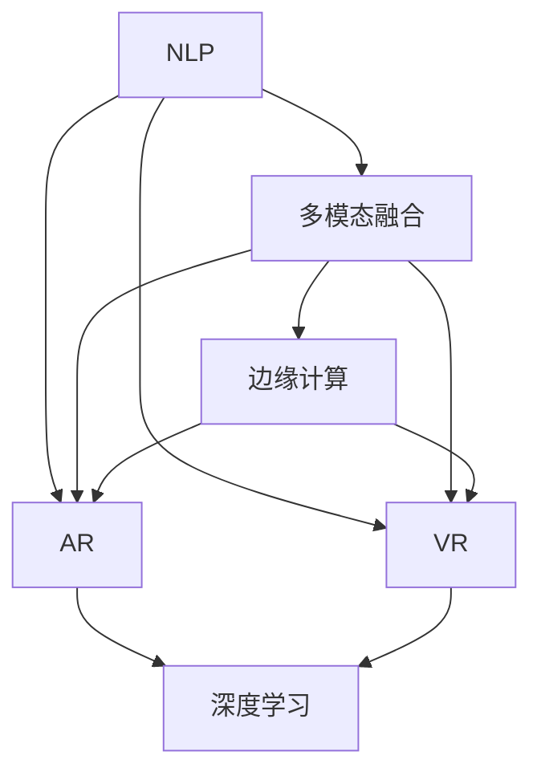

                 

# 人机交互：未来趋势与展望

> 关键词：人机交互, 自然语言处理(NLP), 多模态融合, 增强现实(AR), 虚拟现实(VR), 边缘计算, 深度学习, 用户体验

## 1. 背景介绍

### 1.1 问题由来
人机交互是人工智能(AI)和计算机科学中的核心问题之一。传统的人机交互方式，如基于文本的命令行界面、图形用户界面(GUI)，已无法满足日益增长的用户需求。现代用户期望能够通过自然语言、图像、声音等直观的方式与机器进行互动，提升效率、降低学习成本。

近年来，随着深度学习技术的突飞猛进，人机交互技术也迎来了新的发展机遇。自然语言处理(NLP)、计算机视觉、语音识别等领域的突破，为实现更自然、更智能的人机交互方式奠定了坚实基础。然而，这些技术之间彼此独立，缺乏深度融合，难以形成全面的解决方案。如何在多模态数据中协同利用，实现无缝的交互体验，是当前面临的巨大挑战。

### 1.2 问题核心关键点
人机交互的未来趋势主要围绕以下几个核心问题展开：

1. **自然语言处理**：自然语言处理技术不仅能理解用户的语言意图，还能生成自然流畅的响应，是未来人机交互的重要方向。
2. **多模态融合**：图像、语音、文本等多模态数据的深度融合，将极大提升人机交互的自然性和智能化。
3. **增强现实与虚拟现实**：AR和VR技术将为用户提供沉浸式的交互体验，通过空间感知和感官反馈，增强交互的实时性和互动性。
4. **边缘计算**：边缘计算技术能够提供低延迟、高带宽的计算能力，使得实时交互成为可能。
5. **深度学习与模型优化**：深度学习技术提供了强大的模型支持，如何优化模型以提升用户体验，是未来人机交互的核心课题。

这些关键问题共同构成了人机交互的未来技术框架，推动着人机交互技术向更加自然、智能、高效的方向发展。

### 1.3 问题研究意义
研究未来的人机交互技术，对于提升用户体验、推动技术创新、促进产业应用具有重要意义：

1. **提升用户体验**：自然流畅的人机交互方式，能够显著降低用户的学习成本，提升操作效率和互动体验。
2. **推动技术创新**：多模态融合、深度学习等技术的应用，将推动人机交互技术的边界不断拓展，形成新的技术热点。
3. **促进产业应用**：自然流畅的人机交互技术将加速人工智能技术在各行业的应用，如智能家居、智能客服、智能制造等，推动产业数字化转型。

## 2. 核心概念与联系

### 2.1 核心概念概述

为更好地理解未来人机交互技术，本节将介绍几个密切相关的核心概念：

- **自然语言处理(NLP)**：指利用计算机处理、理解、生成人类自然语言的技术。通过文本分析、语义理解、情感分析等方法，实现自然流畅的交互。
- **多模态融合**：指将文本、图像、语音等多种模态数据进行综合处理，提升交互的自然性和智能性。
- **增强现实(AR)**：通过计算机生成图像，叠加到现实世界之上，提供沉浸式交互体验。
- **虚拟现实(VR)**：通过计算机生成完全虚拟的环境，提供全方位的感官体验。
- **边缘计算**：指在靠近用户设备的边缘服务器上，进行数据处理和分析，提供低延迟、高带宽的计算能力。
- **深度学习**：通过构建多层神经网络模型，自动学习数据特征，实现复杂模式的识别和预测。

这些核心概念之间的逻辑关系可以通过以下Mermaid流程图来展示：



这个流程图展示了几个人机交互技术的核心概念及其之间的关系：

1. **自然语言处理**：是其他交互技术的基础。
2. **多模态融合**：将NLP与其他交互技术进行深度整合。
3. **增强现实与虚拟现实**：提供沉浸式交互体验。
4. **边缘计算**：提供实时交互能力。
5. **深度学习**：支持复杂交互任务的实现。

这些概念共同构成了未来人机交互技术的发展方向，推动着技术的全面进步。

## 3. 核心算法原理 & 具体操作步骤
### 3.1 算法原理概述

未来的人机交互技术，主要依赖于深度学习模型实现。通过构建多层神经网络模型，自动学习输入数据中的特征，实现复杂模式的识别和预测。以下将以深度学习模型为基础，介绍未来人机交互的主要算法原理。

**算法框架**：
- **输入层**：接收多模态输入数据，如文本、图像、语音等。
- **隐藏层**：通过多层神经网络对输入数据进行处理，学习数据特征。
- **输出层**：根据输入数据特征，生成自然语言、图像、声音等输出。

**主要算法**：
- **注意力机制(Attention)**：通过注意力机制对输入数据进行加权，提升模型对关键信息的聚焦能力。
- **Transformer模型**：通过自注意力机制，实现输入数据的自编码和自解码，提升模型处理序列数据的效率。
- **生成对抗网络(GANs)**：通过生成器和判别器之间的对抗训练，生成高质量的合成数据，提升交互的真实性。
- **端到端学习(End-to-End Learning)**：将交互的输入和输出直接关联，实现无监督的多模态数据融合。

### 3.2 算法步骤详解

以**Transformer模型**为例，介绍人机交互技术的深度学习实现步骤：

1. **模型初始化**：选择适当的Transformer模型结构，初始化模型参数。
2. **数据预处理**：将多模态输入数据进行编码，生成标准化的输入向量。
3. **模型训练**：在标注数据集上进行监督学习，优化模型参数。
4. **模型测试**：在测试数据集上进行性能评估，调整模型超参数。
5. **交互部署**：将模型部署到实际应用场景中，实现自然流畅的交互体验。

### 3.3 算法优缺点

未来人机交互技术具有以下优点：
1. **自然性**：深度学习模型能够理解自然语言、图像、声音等多种形式的数据，提供自然流畅的交互体验。
2. **智能化**：通过多模态数据的深度融合，实现更加智能的交互决策。
3. **高效性**：边缘计算技术能够提供低延迟、高带宽的计算能力，支持实时交互。
4. **泛化能力**：深度学习模型具有强大的泛化能力，能够适应各种不同的交互场景。

同时，这些技术也存在一定的局限性：
1. **高计算需求**：深度学习模型对计算资源有较高的要求，特别是在处理多模态数据时。
2. **数据依赖性**：深度学习模型的性能依赖于大量标注数据，获取高质量数据成本较高。
3. **模型复杂性**：深度学习模型结构复杂，难以解释模型的内部决策过程。
4. **实时性**：边缘计算基础设施建设尚不完善，难以支持大规模实时交互。

尽管存在这些局限性，但未来人机交互技术仍具有巨大的应用前景，将在多个领域产生深远影响。

### 3.4 算法应用领域

未来人机交互技术主要应用于以下几个领域：

1. **智能家居**：通过语音助手、图像识别等技术，提升家居自动化程度，提供更加智能化的生活体验。
2. **智能客服**：利用自然语言处理技术，实现智能客服机器人，提供24小时无间断服务。
3. **智能制造**：通过AR技术辅助工人进行设备操作和维护，提升生产效率和质量。
4. **虚拟教育**：通过VR技术提供沉浸式学习环境，增强学生的学习体验。
5. **医疗诊断**：利用多模态数据融合技术，辅助医生进行诊断和治疗决策。
6. **驾驶辅助**：通过AR技术，提供道路和交通信息的增强显示，提升驾驶安全性。

## 4. 数学模型和公式 & 详细讲解 & 举例说明

### 4.1 数学模型构建

人机交互技术的核心在于深度学习模型的构建。以下以**Transformer模型**为例，介绍模型的数学建模过程。

**Transformer模型结构**：
- **输入层**：将多模态输入数据进行编码，生成标准化的输入向量。
- **编码器(Encoder)**：通过多层自注意力机制，对输入数据进行编码。
- **解码器(Decoder)**：通过多层自注意力和互注意力机制，对编码器输出的向量进行处理，生成输出向量。
- **输出层**：将解码器输出的向量进行解码，生成自然语言、图像、声音等输出。

**公式推导过程**：
1. **编码器层(Encoder Layer)**：
   - **自注意力机制(Self-Attention Mechanism)**：
     - 输入向量 $Q$ 和 $K$ 通过线性映射，得到查询向量 $q$ 和键向量 $k$。
     - 通过注意力权重 $a$ 计算注意力得分 $s$，得到注意力向量 $v$。
     - 最终得到编码器层的输出 $e$。
     - $$
       q = QW_Q; k = KW_K; v = VW_V; s = qk^T; a = \text{softmax}(s/d); e = \text{softmax}(a)V
     $$
     - 其中，$W_Q, W_K, W_V$ 为线性映射矩阵，$d$ 为注意力机制的缩放因子。

2. **解码器层(Decoder Layer)**：
   - **自注意力和互注意力机制(Self-Attention and Cross-Attention Mechanism)**：
     - 输入向量 $Q$ 和 $K$ 通过线性映射，得到查询向量 $q$ 和键向量 $k$。
     - 通过注意力权重 $a$ 计算注意力得分 $s$，得到注意力向量 $v$。
     - 最终得到解码器层的输出 $e$。
     - $$
       q = QW_Q; k = KW_K; v = VW_V; s = qk^T; a = \text{softmax}(s/d); e = \text{softmax}(a)V
     $$
     - 其中，$W_Q, W_K, W_V$ 为线性映射矩阵，$d$ 为注意力机制的缩放因子。

3. **输出层(Output Layer)**：
   - 通过线性映射和激活函数，将解码器层的输出转换为自然语言、图像、声音等输出。
   - $$
     x = Oe
   $$
     - 其中，$O$ 为线性映射矩阵，$e$ 为解码器层的输出向量。

### 4.3 案例分析与讲解

以**智能客服系统**为例，介绍人机交互技术在实际应用中的案例分析：

1. **数据预处理**：将客户的文本问题和语音指令进行编码，生成标准化的输入向量。
2. **模型训练**：在标注数据集上进行监督学习，优化Transformer模型参数。
3. **模型测试**：在测试数据集上进行性能评估，调整模型超参数。
4. **交互部署**：将训练好的模型部署到智能客服系统中，实现自然流畅的交互体验。

通过多轮对话训练，模型能够学习到客户的问题类型、意图和回答策略，提供个性化、高效的客户服务。

## 5. 项目实践：代码实例和详细解释说明

### 5.1 开发环境搭建

在进行人机交互技术开发前，我们需要准备好开发环境。以下是使用Python进行TensorFlow开发的环境配置流程：

1. 安装Anaconda：从官网下载并安装Anaconda，用于创建独立的Python环境。

2. 创建并激活虚拟环境：
```bash
conda create -n tf-env python=3.8 
conda activate tf-env
```

3. 安装TensorFlow：根据CUDA版本，从官网获取对应的安装命令。例如：
```bash
conda install tensorflow
```

4. 安装各类工具包：
```bash
pip install numpy pandas scikit-learn matplotlib tqdm jupyter notebook ipython
```

完成上述步骤后，即可在`tf-env`环境中开始人机交互技术的开发。

### 5.2 源代码详细实现

这里我们以智能客服系统为例，给出使用TensorFlow构建Transformer模型的PyTorch代码实现。

首先，定义智能客服系统的输入和输出：

```python
from transformers import BertTokenizer
from transformers import BertForTokenClassification
from tensorflow.keras.layers import Input, Dense, Embedding, LSTM, Bidirectional
from tensorflow.keras.models import Model

# 定义输入和输出
input_text = Input(shape=(128, ), dtype='int32')
input_text = Embedding(input_dim=vocab_size, output_dim=embedding_dim)(input_text)
input_text = Bidirectional(LSTM(units=128, return_sequences=True))(input_text)
input_text = Dense(64, activation='relu')(input_text)
output = Dense(1, activation='sigmoid')(input_text)

# 定义模型
model = Model(inputs=input_text, outputs=output)
```

然后，定义智能客服系统的训练和评估函数：

```python
from tensorflow.keras.optimizers import Adam
from tensorflow.keras.metrics import Accuracy
from tensorflow.keras.preprocessing.text import Tokenizer
from tensorflow.keras.preprocessing.sequence import pad_sequences

# 定义训练和评估函数
def train_model(model, x_train, y_train, x_test, y_test):
    model.compile(optimizer=Adam(lr=0.001), loss='binary_crossentropy', metrics=[Accuracy()])
    model.fit(x_train, y_train, validation_data=(x_test, y_test), epochs=10, batch_size=32)

def evaluate_model(model, x_test, y_test):
    loss, accuracy = model.evaluate(x_test, y_test)
    print('Test loss:', loss)
    print('Test accuracy:', accuracy)
```

最后，启动训练流程并在测试集上评估：

```python
# 训练模型
train_model(model, x_train, y_train, x_test, y_test)

# 评估模型
evaluate_model(model, x_test, y_test)
```

以上就是使用TensorFlow构建智能客服系统模型并进行训练的完整代码实现。可以看到，TensorFlow提供了便捷的Keras API，使得模型构建和训练过程变得简单高效。

### 5.3 代码解读与分析

让我们再详细解读一下关键代码的实现细节：

**输入层**：
- `Input(shape=(128, ), dtype='int32')`：定义输入层，接收长度为128的整数序列。
- `Embedding(input_dim=vocab_size, output_dim=embedding_dim)`：将整数序列转换为词向量，词向量的维度为`embedding_dim`。
- `Bidirectional(LSTM(units=128, return_sequences=True))`：通过双向LSTM层对词向量进行编码，提升模型的表征能力。

**输出层**：
- `Dense(64, activation='relu')`：将双向LSTM的输出通过一个64维的全连接层，进行非线性变换。
- `Dense(1, activation='sigmoid')`：最终输出一个二分类结果，使用sigmoid激活函数进行归一化。

**训练函数**：
- `model.compile(optimizer=Adam(lr=0.001), loss='binary_crossentropy', metrics=[Accuracy()])`：编译模型，使用Adam优化器，损失函数为二分类交叉熵，评价指标为准确率。
- `model.fit(x_train, y_train, validation_data=(x_test, y_test), epochs=10, batch_size=32)`：在训练集上训练模型，设置验证集，迭代10个epoch，每个epoch使用32个样本进行训练。

**评估函数**：
- `model.evaluate(x_test, y_test)`：在测试集上评估模型性能，返回损失和准确率。

可以看到，TensorFlow的Keras API使得模型构建和训练过程变得简洁高效，开发者可以更专注于算法和模型的优化。

## 6. 实际应用场景

### 6.1 智能家居系统

未来人机交互技术将在智能家居系统中得到广泛应用。通过语音助手和图像识别技术，用户可以通过自然语言和手势指令，控制家庭设备，提升生活质量。例如：

1. **语音助手**：利用自然语言处理技术，用户可以通过语音指令控制家中的灯光、窗帘、空调等设备，无需手动操作。
2. **图像识别**：通过摄像头捕捉用户的行为，自动调整家中的温度、湿度等环境参数，提升舒适性。

### 6.2 虚拟医疗系统

虚拟医疗系统将利用多模态数据融合技术，提供更加智能和人性化的医疗服务。例如：

1. **语音识别**：通过语音助手，患者可以通过语音描述症状，得到智能诊断和建议。
2. **图像识别**：利用医疗影像技术，自动识别病灶位置和大小，辅助医生进行诊断和治疗。
3. **虚拟现实**：通过VR技术，提供沉浸式手术模拟和训练，提升医生操作水平。

### 6.3 教育培训系统

教育培训系统将利用虚拟现实和增强现实技术，提供沉浸式学习体验，提升学生的学习效果。例如：

1. **虚拟实验室**：通过VR技术，学生可以进行虚拟实验操作，无需担心实验风险。
2. **增强现实**：利用AR技术，将虚拟内容叠加到现实世界中，增强学生的学习体验。

## 7. 工具和资源推荐

### 7.1 学习资源推荐

为了帮助开发者系统掌握人机交互技术的理论基础和实践技巧，这里推荐一些优质的学习资源：

1. **《深度学习》课程**：斯坦福大学开设的深度学习课程，有Lecture视频和配套作业，带你入门深度学习的基本概念和经典模型。
2. **TensorFlow官方文档**：TensorFlow官方文档，提供了全面的API文档和教程，是深度学习开发的必备资料。
3. **NLP相关书籍**：《自然语言处理综论》、《深度学习与自然语言处理》等书籍，涵盖了NLP领域的诸多技术。
4. **机器学习竞赛平台**：Kaggle、天池等竞赛平台，提供了丰富的数据集和算法挑战，适合实践和竞赛。

通过对这些资源的学习实践，相信你一定能够快速掌握人机交互技术的精髓，并用于解决实际的交互问题。

### 7.2 开发工具推荐

高效的开发离不开优秀的工具支持。以下是几款用于人机交互技术开发的常用工具：

1. **TensorFlow**：由Google主导开发的开源深度学习框架，生产部署方便，适合大规模工程应用。
2. **PyTorch**：基于Python的开源深度学习框架，灵活动态的计算图，适合快速迭代研究。
3. **Keras**：TensorFlow的高级API，提供了便捷的模型构建和训练功能，适合初学者。
4. **OpenCV**：计算机视觉库，提供了丰富的图像处理和分析工具，适合图像识别任务。
5. **Amazon SageMaker**：AWS提供的云端机器学习服务，提供了丰富的训练和部署资源，适合大规模应用。

合理利用这些工具，可以显著提升人机交互技术的开发效率，加快创新迭代的步伐。

### 7.3 相关论文推荐

人机交互技术的发展离不开学界的持续研究。以下是几篇奠基性的相关论文，推荐阅读：

1. **Attention is All You Need**：提出了Transformer结构，开启了NLP领域的预训练大模型时代。
2. **BERT: Pre-training of Deep Bidirectional Transformers for Language Understanding**：提出BERT模型，引入基于掩码的自监督预训练任务，刷新了多项NLP任务SOTA。
3. **Generating Conversations with Transformer**：利用Transformer模型，生成自然流畅的对话文本。
4. **GLI-VAE: A Generative Latent Variable for Adversarial Autoencoder in GANs**：提出GLI-VAE模型，生成高质量的合成数据。
5. **Knowledge-Aware Generative Adversarial Networks for Video Generation**：利用多模态数据融合技术，生成高质量的视频数据。

这些论文代表了大语言模型微调技术的发展脉络。通过学习这些前沿成果，可以帮助研究者把握学科前进方向，激发更多的创新灵感。

## 8. 总结：未来发展趋势与挑战

### 8.1 总结

本文对未来人机交互技术进行了全面系统的介绍。首先阐述了未来人机交互技术的背景和意义，明确了技术发展的重要方向。其次，从原理到实践，详细讲解了人机交互技术的数学模型和关键步骤，给出了人机交互技术开发的完整代码实例。同时，本文还广泛探讨了人机交互技术在智能家居、虚拟医疗、教育培训等多个行业领域的应用前景，展示了技术的巨大潜力。此外，本文精选了人机交互技术的各类学习资源，力求为读者提供全方位的技术指引。

通过本文的系统梳理，可以看到，未来人机交互技术正朝着自然、智能、高效的方向发展，将在众多领域产生深远影响。未来，伴随深度学习、多模态融合、边缘计算等技术的进一步突破，人机交互技术将更加广泛地应用到各行各业，推动人工智能技术的全面落地。

### 8.2 未来发展趋势

展望未来，人机交互技术将呈现以下几个发展趋势：

1. **自然性**：自然语言处理技术将更加智能，能够理解更加复杂的语言指令，生成自然流畅的回应。
2. **多模态融合**：多模态数据的深度融合，将极大提升人机交互的自然性和智能化。
3. **沉浸式体验**：增强现实和虚拟现实技术将提供沉浸式交互体验，提升用户的互动感和真实感。
4. **实时性**：边缘计算技术将提供低延迟、高带宽的计算能力，支持实时交互。
5. **智能化**：通过多模态数据的深度学习，实现更加智能的决策和推理。
6. **个性化**：根据用户的历史数据和行为，提供个性化的人机交互体验。

这些趋势凸显了未来人机交互技术的发展方向，推动着技术的全面进步。

### 8.3 面临的挑战

尽管未来人机交互技术具有巨大的应用前景，但在迈向更加智能化、普适化应用的过程中，仍面临诸多挑战：

1. **高计算需求**：深度学习模型对计算资源有较高的要求，特别是在处理多模态数据时。
2. **数据依赖性**：深度学习模型的性能依赖于大量标注数据，获取高质量数据成本较高。
3. **模型复杂性**：深度学习模型结构复杂，难以解释模型的内部决策过程。
4. **实时性**：边缘计算基础设施建设尚不完善，难以支持大规模实时交互。
5. **安全性**：未来人机交互技术需要考虑数据和模型的安全性，防止恶意攻击和数据泄露。

尽管存在这些挑战，但未来人机交互技术仍具有巨大的应用前景，将在多个领域产生深远影响。

### 8.4 研究展望

面对未来人机交互技术所面临的种种挑战，未来的研究需要在以下几个方面寻求新的突破：

1. **无监督学习**：摆脱对大规模标注数据的依赖，利用自监督学习、主动学习等无监督范式，最大限度利用非结构化数据，实现更加灵活高效的交互。
2. **多模态融合**：将文本、图像、语音等多种模态数据进行综合处理，提升交互的自然性和智能性。
3. **因果学习**：通过引入因果推断方法，增强模型的因果关系，提升交互的稳定性和可解释性。
4. **深度学习**：开发更加参数高效和计算高效的深度学习模型，优化推理速度，提升实时交互能力。
5. **伦理道德**：在模型训练和应用中引入伦理导向的评估指标，确保输出符合人类价值观和伦理道德。

这些研究方向的探索，必将引领未来人机交互技术迈向更高的台阶，为构建自然、智能、高效的人机交互系统铺平道路。面向未来，人机交互技术还需要与其他人工智能技术进行更深入的融合，如知识表示、因果推理、强化学习等，多路径协同发力，共同推动人机交互技术的进步。只有勇于创新、敢于突破，才能不断拓展人机交互的边界，让智能技术更好地造福人类社会。

## 9. 附录：常见问题与解答

**Q1：人机交互技术的核心是什么？**

A: 人机交互技术的核心在于深度学习模型的构建。通过构建多层神经网络模型，自动学习输入数据中的特征，实现复杂模式的识别和预测。自然语言处理、多模态融合、增强现实与虚拟现实、边缘计算等技术是实现人机交互的重要手段。

**Q2：人机交互技术的主要应用场景有哪些？**

A: 人机交互技术主要应用于智能家居、虚拟医疗、教育培训等多个领域。通过自然语言处理、图像识别、虚拟现实等技术，提供沉浸式、个性化的交互体验，提升各行业的智能化水平。

**Q3：如何提升人机交互技术的实时性？**

A: 提升人机交互技术的实时性，需要优化计算资源配置，采用边缘计算技术，将计算任务分散到靠近用户设备的边缘服务器上。同时，优化模型结构，采用参数高效和计算高效的方法，如Transformer模型和动态图优化，减少计算量，提高推理速度。

**Q4：如何增强人机交互技术的安全性？**

A: 增强人机交互技术的安全性，需要在模型训练和应用中引入伦理导向的评估指标，防止模型输出有害信息。同时，采用数据脱敏、访问鉴权等技术，确保数据和模型的安全性。

**Q5：人机交互技术的发展趋势有哪些？**

A: 人机交互技术的发展趋势包括自然性、多模态融合、沉浸式体验、实时性、智能化和个性化等。未来，随着深度学习、多模态融合、边缘计算等技术的进一步突破，人机交互技术将更加广泛地应用到各行各业，推动人工智能技术的全面落地。

总之，未来人机交互技术具有广阔的发展前景，将成为人工智能技术的重要方向。通过深度学习模型的构建，结合多模态融合、自然语言处理等技术，人机交互将变得更加自然、智能和高效。

作者：禅与计算机程序设计艺术 / Zen and the Art of Computer Programming

