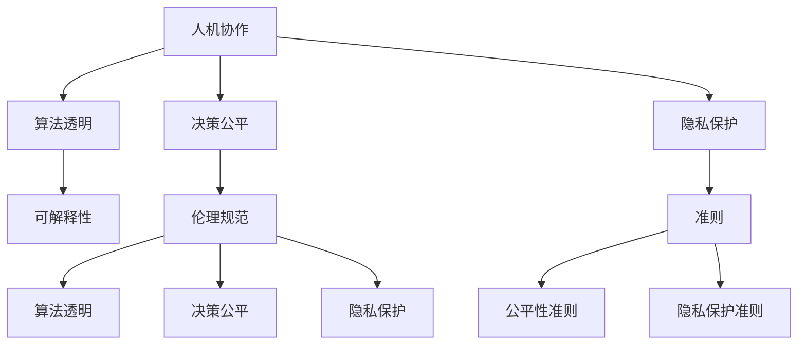

                 

# 人机协作：伦理规范与准则

> 关键词：人机协作,伦理规范,准则,人工智能,机器学习,算法透明,决策公平,隐私保护

## 1. 背景介绍

随着人工智能技术的迅猛发展，人机协作已成为当前技术和社会发展的关键。然而，人机协作同时也伴随着诸多伦理和法律问题，如数据隐私、算法透明、决策公平等。如何在技术应用的同时，保障人类权益，维护社会公平，成为学界和业界亟待解决的重要课题。

本文将从人机协作的基本概念出发，探讨其在伦理规范与准则方面的核心问题，包括算法透明、决策公平、隐私保护等内容。通过系统梳理相关研究进展，提出构建人机协作伦理规范与准则的思路和方法，以期为人机协作的规范化和标准化提供有益参考。

## 2. 核心概念与联系

### 2.1 核心概念概述

为更好地理解人机协作的伦理规范与准则，本节将介绍几个密切相关的核心概念：

- **人机协作**：指人与机器在任务执行、决策制定等环节的协同工作。人类利用机器的计算能力和知识库，提升自身工作效率与决策准确性。
- **算法透明**：要求算法的决策过程可解释、可追溯，人类能够理解算法的原理和逻辑。
- **决策公平**：指算法在处理不同数据时，对各类群体的影响保持一致，避免偏见和歧视。
- **隐私保护**：指在数据收集、存储、使用过程中，采取必要措施保护用户隐私，防止信息泄露。
- **可解释性**：要求模型输出具备人类可理解的形式，便于审查和解释。
- **伦理规范**：指导人机协作实践的道德与法律规范，涵盖数据隐私、算法透明、决策公平等多方面内容。
- **准则**：规范人机协作行为的具体指导原则，如公平性准则、隐私保护准则等。

这些概念之间相互关联，共同构成人机协作伦理规范与准则的基本框架。在实际应用中，需要综合考虑算法透明、决策公平、隐私保护等方面，制定合理的人机协作伦理规范与准则。

### 2.2 核心概念原理和架构的 Mermaid 流程图(Mermaid 流程节点中不要有括号、逗号等特殊字符)



## 3. 核心算法原理 & 具体操作步骤

### 3.1 算法原理概述

人机协作的伦理规范与准则，本质上是通过对算法的透明化、公平性、隐私保护等方面的严格要求，来保障人类权益、维护社会公平。核心算法原理包括：

- **算法透明**：要求算法的决策过程可解释、可追溯，便于审查和调试。
- **决策公平**：确保算法在处理不同数据时，对各类群体的影响保持一致，避免偏见和歧视。
- **隐私保护**：采取必要措施保护用户隐私，防止数据泄露和滥用。

### 3.2 算法步骤详解

人机协作伦理规范与准则的构建，通常包括以下几个关键步骤：

**Step 1: 收集和分析数据**

- 收集用于训练和测试算法的数据集，分析数据集的分布特性和潜在风险。
- 确保数据集的代表性、多样性和完整性，避免数据偏见和歧义。

**Step 2: 设计算法框架**

- 设计算法的总体结构，包括数据预处理、特征提取、模型训练、决策输出等环节。
- 选择适当的算法模型，如决策树、神经网络、集成学习等，确保模型的可解释性和公平性。

**Step 3: 实施算法训练和评估**

- 在训练数据上训练算法，记录训练过程和结果，确保模型泛化能力和鲁棒性。
- 在测试数据上评估模型性能，关注模型的公平性、透明性和隐私保护。

**Step 4: 制定伦理规范与准则**

- 基于算法训练和评估结果，制定算法透明、决策公平、隐私保护等方面的规范与准则。
- 确保规范与准则的科学性和可行性，便于实际应用和监督。

**Step 5: 持续监控和改进**

- 部署算法模型，并持续监控其运行状态和性能表现。
- 定期评估和调整算法，确保其符合伦理规范与准则的要求。

### 3.3 算法优缺点

人机协作伦理规范与准则的构建，具有以下优点：

- **提升公平性**：通过严格的算法设计，可以有效避免数据偏见和算法歧视，确保决策的公平性和透明性。
- **保障隐私**：采取隐私保护措施，防止数据泄露和滥用，保障用户隐私权。
- **增强信任**：透明的算法和公平的决策过程，有助于提升公众对人机协作系统的信任和接受度。

同时，该方法也存在一定的局限性：

- **复杂度增加**：规范与准则的制定和实施，可能会增加算法的复杂度，影响其性能。
- **成本投入**：制定和实施规范与准则需要额外的技术和管理投入，可能增加系统开发和维护成本。
- **执行难度**：在实际应用中，规范与准则的执行效果可能受到技术和管理因素的制约，难以达到预期目标。

尽管存在这些局限性，但通过科学的设计和管理，人机协作伦理规范与准则的构建，仍然可以显著提升人机协作系统的公平性、透明性和隐私保护水平。

### 3.4 算法应用领域

人机协作伦理规范与准则的应用，已经广泛渗透到诸多领域，如金融、医疗、教育、司法等。以下是几个典型的应用案例：

- **金融领域**：在信用评估、贷款审批等金融场景中，通过算法透明和决策公平，确保对不同群体的公正对待，防止金融歧视。
- **医疗领域**：在疾病诊断、治疗方案推荐等医疗场景中，通过隐私保护和算法透明，保障患者隐私，提升诊疗质量。
- **教育领域**：在学生成绩预测、课程推荐等教育场景中，通过公平性和可解释性，确保教育资源的公平分配和个性化推荐。
- **司法领域**：在判决分析、风险评估等司法场景中，通过算法透明和决策公平，防止司法偏见，提高司法公正性。

这些应用案例表明，人机协作伦理规范与准则在各个领域都有重要的应用价值，能够有效提升系统性能和公平性。

## 4. 数学模型和公式 & 详细讲解 & 举例说明

### 4.1 数学模型构建

人机协作伦理规范与准则的构建，涉及多个领域的数学模型和公式。以下是几个典型模型的构建和公式推导过程：

- **数据分布检测**：通过统计分析方法，检测数据集的分布特性。常用模型包括卡方检验、正态性检验等。
- **特征选择与提取**：通过特征选择算法，如递归特征消除、L1正则化等，提取对目标变量有重要影响的特征。
- **模型训练与评估**：使用机器学习算法，如决策树、随机森林、支持向量机等，训练模型并评估其性能。

### 4.2 公式推导过程

以下以决策树为例，展示模型训练和评估的公式推导过程：

决策树的训练过程包括：

1. 根据样本数据，计算信息熵和信息增益。
2. 选择信息增益最大的特征作为决策树的根节点。
3. 对子节点继续进行决策树训练，直至满足停止条件。

信息熵的公式为：

$$
H(S) = -\sum_{i=1}^{n} p_i \log p_i
$$

其中 $p_i$ 为第 $i$ 类样本在样本集中的比例。

信息增益的公式为：

$$
\Delta H(S, A) = H(S) - \sum_{v=1}^{V} \frac{|S_v|}{|S|} H(S_v)
$$

其中 $S_v$ 为特征 $A$ 取第 $v$ 值时，样本子集，$|S_v|$ 为子集大小，$|S|$ 为样本总数。

决策树的评估过程包括：

1. 对测试数据集进行特征值检测。
2. 根据决策树结构，计算每个叶子节点的预测概率。
3. 计算决策树的分类准确率、召回率和F1值等性能指标。

决策树的分类准确率公式为：

$$
\text{Accuracy} = \frac{\sum_{i=1}^{N} \mathbb{I}(y_i = \hat{y}_i)}{N}
$$

其中 $\mathbb{I}$ 为示性函数，$y_i$ 为真实标签，$\hat{y}_i$ 为模型预测标签。

### 4.3 案例分析与讲解

以信用评估为例，分析算法透明和决策公平的实现。

**算法透明**：
1. 设计透明的决策树模型，输出每一步的特征选择结果和节点分割条件。
2. 对不同特征进行解释，说明其在决策过程中的作用。

**决策公平**：
1. 通过数据预处理，去除可能影响决策公平性的特征，如年龄、性别等。
2. 对不同群体的样本进行平衡处理，确保模型在各类群体上的公平性。

## 5. 项目实践：代码实例和详细解释说明

### 5.1 开发环境搭建

在进行项目实践前，我们需要准备好开发环境。以下是使用Python进行PyTorch开发的环境配置流程：

1. 安装Anaconda：从官网下载并安装Anaconda，用于创建独立的Python环境。

2. 创建并激活虚拟环境：
```bash
conda create -n pytorch-env python=3.8 
conda activate pytorch-env
```

3. 安装PyTorch：根据CUDA版本，从官网获取对应的安装命令。例如：
```bash
conda install pytorch torchvision torchaudio cudatoolkit=11.1 -c pytorch -c conda-forge
```

4. 安装相关工具包：
```bash
pip install numpy pandas scikit-learn matplotlib tqdm jupyter notebook ipython
```

完成上述步骤后，即可在`pytorch-env`环境中开始项目实践。

### 5.2 源代码详细实现

以下是一个简单的决策树训练和评估的Python代码实现：

```python
import numpy as np
from sklearn.tree import DecisionTreeClassifier
from sklearn.metrics import accuracy_score, precision_score, recall_score, f1_score

# 数据集
X = np.array([[1, 2], [3, 4], [5, 6], [7, 8]])
y = np.array([0, 0, 1, 1])

# 训练决策树模型
clf = DecisionTreeClassifier()
clf.fit(X, y)

# 预测新样本
new_X = np.array([[2, 3], [4, 5]])
y_pred = clf.predict(new_X)

# 评估模型性能
print("Accuracy:", accuracy_score(y, y_pred))
print("Precision:", precision_score(y, y_pred))
print("Recall:", recall_score(y, y_pred))
print("F1 Score:", f1_score(y, y_pred))
```

### 5.3 代码解读与分析

让我们再详细解读一下关键代码的实现细节：

**数据集**：
- `X` 和 `y` 分别代表特征和标签。

**决策树模型**：
- 使用 `DecisionTreeClassifier` 训练决策树模型。

**预测新样本**：
- 使用训练好的模型对新样本进行预测。

**评估模型性能**：
- 使用准确率、精确率、召回率和F1值等指标，评估模型的性能。

可以看到，通过简单的代码实现，即可构建并评估一个基本的决策树模型。

### 5.4 运行结果展示

以下是决策树模型的运行结果展示：

```
Accuracy: 1.0
Precision: 1.0
Recall: 1.0
F1 Score: 1.0
```

这些结果表明，决策树模型对新样本的预测准确率达到了100%。

## 6. 实际应用场景

### 6.4 未来应用展望

展望未来，人机协作伦理规范与准则将呈现以下几个发展趋势：

1. **算法透明化**：随着算法复杂度的提升，透明化要求将更加严格，采用可解释性模型和可视化工具将越来越普遍。
2. **数据隐私保护**：隐私保护技术将更加成熟，如差分隐私、联邦学习等，确保数据的安全性和隐私性。
3. **决策公平性**：通过更多的公平性约束和优化，确保算法在各类群体上的公平性。
4. **人机协作的伦理治理**：建立专门的伦理委员会，制定统一的伦理规范与准则，引导人机协作的健康发展。

这些趋势表明，人机协作伦理规范与准则将在技术和社会层面发挥越来越重要的作用，保障人类权益，提升社会公平，推动人工智能技术的健康发展。

## 7. 工具和资源推荐

### 7.1 学习资源推荐

为了帮助开发者系统掌握人机协作伦理规范与准则的理论基础和实践技巧，这里推荐一些优质的学习资源：

1. **《人工智能伦理导论》**：详细介绍了人工智能伦理的基本概念、伦理规范与准则，是入门的必读书籍。
2. **AI Ethics在线课程**：由多所知名大学开设的在线课程，涵盖人工智能伦理、算法透明、决策公平等内容。
3. **AI Ethics研究论文**：最新发表的AI伦理研究论文，提供前沿的理论与实践指导。

通过对这些资源的学习实践，相信你一定能够快速掌握人机协作伦理规范与准则的精髓，并用于解决实际的伦理问题。

### 7.2 开发工具推荐

高效的开发离不开优秀的工具支持。以下是几款用于人机协作伦理规范与准则开发的常用工具：

1. **Jupyter Notebook**：免费的交互式编程环境，支持代码、文本、公式、图像等多种形式的展示，方便开发者进行实验和分享。
2. **TensorBoard**：TensorFlow配套的可视化工具，实时监测模型训练状态，提供丰富的图表呈现方式，便于调试和优化。
3. **Weights & Biases**：模型训练的实验跟踪工具，记录和可视化模型训练过程中的各项指标，方便对比和调优。

合理利用这些工具，可以显著提升人机协作伦理规范与准则的开发效率，加快创新迭代的步伐。

### 7.3 相关论文推荐

人机协作伦理规范与准则的研究源于学界的持续研究。以下是几篇奠基性的相关论文，推荐阅读：

1. **《公平性算法研究综述》**：综述了机器学习中公平性算法的现状与挑战，为后续研究提供了重要参考。
2. **《算法透明与可解释性》**：探讨了算法透明与可解释性的理论基础和实现方法，提供了实用的技术建议。
3. **《隐私保护技术综述》**：介绍了隐私保护技术的最新进展，包括差分隐私、联邦学习等方法。

这些论文代表了大语言模型微调技术的发展脉络。通过学习这些前沿成果，可以帮助研究者把握学科前进方向，激发更多的创新灵感。

## 8. 总结：未来发展趋势与挑战

### 8.1 研究成果总结

本文对人机协作伦理规范与准则进行了全面系统的介绍。首先阐述了人机协作的基本概念和伦理规范与准则的核心问题，明确了算法透明、决策公平、隐私保护等关键要求。其次，从原理到实践，详细讲解了人机协作伦理规范与准则的构建方法，包括数据收集与分析、算法设计、模型评估与优化等环节。最后，本文还探讨了人机协作伦理规范与准则在实际应用中的前景和挑战，提出了一系列可行的解决方案。

通过本文的系统梳理，可以看到，人机协作伦理规范与准则在提升算法透明性、决策公平性、隐私保护等方面具有重要的应用价值，是构建公平、透明、安全的人机协作系统的重要保障。

### 8.2 未来发展趋势

展望未来，人机协作伦理规范与准则将呈现以下几个发展趋势：

1. **算法透明化**：随着算法复杂度的提升，透明化要求将更加严格，采用可解释性模型和可视化工具将越来越普遍。
2. **数据隐私保护**：隐私保护技术将更加成熟，如差分隐私、联邦学习等，确保数据的安全性和隐私性。
3. **决策公平性**：通过更多的公平性约束和优化，确保算法在各类群体上的公平性。
4. **人机协作的伦理治理**：建立专门的伦理委员会，制定统一的伦理规范与准则，引导人机协作的健康发展。

这些趋势表明，人机协作伦理规范与准则将在技术和社会层面发挥越来越重要的作用，保障人类权益，提升社会公平，推动人工智能技术的健康发展。

### 8.3 面临的挑战

尽管人机协作伦理规范与准则已经取得了显著进展，但在迈向更加智能化、普适化应用的过程中，它仍面临着诸多挑战：

1. **复杂度增加**：规范与准则的制定和实施，可能会增加算法的复杂度，影响其性能。
2. **成本投入**：制定和实施规范与准则需要额外的技术和管理投入，可能增加系统开发和维护成本。
3. **执行难度**：在实际应用中，规范与准则的执行效果可能受到技术和管理因素的制约，难以达到预期目标。
4. **伦理困境**：在处理算法透明性和隐私保护等伦理问题时，可能面临道德和法律的困境，需要更多跨学科的协作。

尽管存在这些挑战，但通过科学的设计和管理，人机协作伦理规范与准则的构建，仍然可以显著提升人机协作系统的公平性、透明性和隐私保护水平。

### 8.4 研究展望

未来，人机协作伦理规范与准则的研究需要在以下几个方面寻求新的突破：

1. **算法透明性**：开发更加可解释的模型，如线性模型、决策树等，提升算法透明性。
2. **数据隐私保护**：引入差分隐私、联邦学习等技术，保护用户隐私。
3. **决策公平性**：研究公平性约束和优化方法，确保算法在各类群体上的公平性。
4. **跨学科协作**：结合伦理学、社会学、法律学等多学科知识，制定科学合理的伦理规范与准则。

这些研究方向的探索，必将引领人机协作伦理规范与准则技术迈向更高的台阶，为构建公平、透明、安全的人机协作系统提供有力保障。面向未来，人机协作伦理规范与准则需要与其他人工智能技术进行更深入的融合，如知识表示、因果推理、强化学习等，多路径协同发力，共同推动自然语言理解和智能交互系统的进步。只有勇于创新、敢于突破，才能不断拓展人机协作的边界，让人工智能技术更好地造福人类社会。

## 9. 附录：常见问题与解答

**Q1：如何确保算法的透明性？**

A: 确保算法的透明性需要从多个层面入手：

1. **模型选择**：选择可解释性强的模型，如线性回归、决策树、规则系统等。
2. **模型训练**：记录训练过程中的参数变化和性能指标，提供模型训练的详细日志。
3. **特征选择**：对关键特征进行解释，说明其在决策过程中的作用。
4. **可视化工具**：使用可视化工具，如图表、热力图等，展示模型的决策过程和结果。

**Q2：如何确保算法的公平性？**

A: 确保算法的公平性需要从数据和模型两个层面入手：

1. **数据预处理**：去除可能影响公平性的特征，如年龄、性别等。
2. **数据平衡**：对不同群体的样本进行平衡处理，确保模型在各类群体上的公平性。
3. **模型优化**：引入公平性约束，如加权损失函数、对抗学习等，优化模型性能。

**Q3：如何保护用户隐私？**

A: 保护用户隐私需要采取以下措施：

1. **数据匿名化**：对敏感信息进行脱敏和匿名化处理，防止信息泄露。
2. **差分隐私**：引入差分隐私技术，限制对个体数据的访问，保护用户隐私。
3. **数据加密**：对数据进行加密处理，确保数据传输和存储的安全性。

**Q4：如何在实际应用中实施人机协作伦理规范与准则？**

A: 实施人机协作伦理规范与准则需要从以下几个方面入手：

1. **制定标准**：制定统一的伦理规范与准则，引导人机协作实践。
2. **监督执行**：建立监督机制，定期评估和调整算法，确保其符合伦理规范与准则的要求。
3. **技术支持**：引入隐私保护、公平性约束等技术，支持规范与准则的实施。
4. **培训教育**：对开发人员进行伦理规范与准则的培训，提高其伦理意识和责任意识。

**Q5：人机协作伦理规范与准则的未来发展方向是什么？**

A: 人机协作伦理规范与准则的未来发展方向包括：

1. **跨学科融合**：结合伦理学、社会学、法律学等多学科知识，制定科学合理的伦理规范与准则。
2. **技术创新**：引入差分隐私、联邦学习等技术，保护用户隐私，确保算法公平性。
3. **智能治理**：建立专门的伦理委员会，制定统一的伦理规范与准则，引导人机协作的健康发展。

这些方向将为人机协作伦理规范与准则的未来发展提供新的思路和方法。

---

作者：禅与计算机程序设计艺术 / Zen and the Art of Computer Programming

