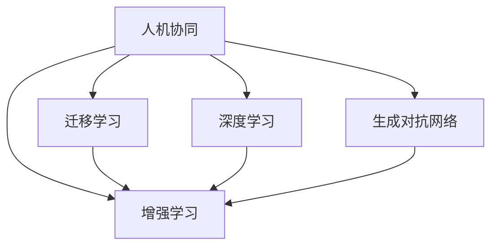

                 

## 1. 背景介绍

### 1.1 问题由来

在信息爆炸的今天，人工智能（AI）与人类的协同合作已经成为不可逆转的趋势。无论是工业制造、金融服务、医疗健康，还是教育娱乐、智能家居等领域，AI都在为人类提供着前所未有的高效和便捷。但与此同时，人工智能的发展也面临着一系列挑战，诸如模型复杂度、计算资源消耗、数据隐私保护、伦理道德等。

为解决这些问题，促进AI技术的进一步发展，学界和产业界都在积极探索各种路径，包括强化学习、迁移学习、深度学习、生成对抗网络等。然而，这些技术虽然强大，但难以实现AI与人类智慧的真正融合。在这片广阔天地中，人机协同成为了一种新的突破口。

### 1.2 问题核心关键点

人机协同是指将人类的智能与机器的算法有机结合，利用人类的智慧与经验来指导AI的决策过程，同时通过机器的算法处理能力来放大人类的决策效果。其关键点包括：

- 融合人类智慧：AI系统通过与人类协同工作，能够借鉴人类长期积累的经验和知识，从而提升自身的决策水平。
- 放大决策效果：AI系统具备高速处理能力，能够在短时间内分析大量数据，并将人类的决策迅速落实到具体行动中。
- 提升学习效率：AI系统通过人机协同，能够快速学习新知识和技能，缩短学习曲线，提升自身的智能化水平。
- 增强系统鲁棒性：AI系统通过与人类协同，能够更好地应对复杂多变的现实环境，增强系统的鲁棒性和适应性。

人机协同的核心在于如何实现智能与人类智慧的深度融合，使其能够高效、可靠地服务于人类。

## 2. 核心概念与联系

### 2.1 核心概念概述

为更好地理解人机协同的原理与架构，本节将介绍几个核心概念及其联系：

- **人机协同（Human-Machine Collaboration）**：指通过协同工作，实现人类与AI系统之间的知识共享和决策融合。
- **增强学习（Reinforcement Learning, RL）**：一种基于奖励和惩罚机制的学习方法，通过与环境的交互，优化AI系统的决策能力。
- **迁移学习（Transfer Learning）**：将一个领域的学习经验迁移到另一个领域，提升AI系统的泛化能力。
- **深度学习（Deep Learning）**：一种模拟人类大脑神经网络的学习方法，通过多层次的特征抽象，实现复杂问题的求解。
- **生成对抗网络（Generative Adversarial Network, GAN）**：通过生成模型和判别模型之间的对抗训练，生成高质量的合成数据。

这些核心概念之间的关系，可以通过以下Mermaid流程图来展示：



从图中可以看出，人机协同是一种结合了增强学习、迁移学习、深度学习和生成对抗网络等多种技术的综合性框架。这些技术在协同过程中互相补充，共同提升系统的性能和效果。

## 3. 核心算法原理 & 具体操作步骤

### 3.1 算法原理概述

人机协同的算法原理主要基于三个方面：

1. **决策树融合**：利用决策树对不同AI模型的预测结果进行融合，提升预测准确性和鲁棒性。
2. **强化学习机制**：通过奖励和惩罚机制，不断优化AI系统的决策策略，使其在协同过程中逐渐适应人类需求。
3. **知识图谱构建**：将人类的知识和经验抽象成结构化的知识图谱，通过图神经网络等技术，进行推理和迁移，增强AI系统的理解能力。

### 3.2 算法步骤详解

人机协同的算法步骤主要包括以下几个关键环节：

**Step 1: 数据准备**

- **数据收集**：收集与任务相关的数据，包括文本、图片、语音等多种类型的数据。
- **数据预处理**：对数据进行清洗、标注、归一化等处理，保证数据的质量和一致性。

**Step 2: 模型训练**

- **选择模型**：根据任务需求选择合适的AI模型，如卷积神经网络（CNN）、循环神经网络（RNN）、Transformer等。
- **训练模型**：利用收集到的数据，在GPU或TPU等高性能设备上对模型进行训练。
- **评估模型**：使用测试集对训练好的模型进行评估，确定模型是否达到了预设的性能指标。

**Step 3: 协同决策**

- **融合决策**：将多个模型的预测结果进行融合，提升决策准确性。
- **强化学习**：利用人类的反馈信息，通过增强学习机制不断优化模型的决策策略。
- **知识图谱构建**：将人类的知识经验抽象成结构化的知识图谱，通过图神经网络等技术进行推理和迁移。

**Step 4: 应用部署**

- **模型部署**：将训练好的模型部署到实际应用环境中，如生产服务器、智能家居设备等。
- **系统集成**：将人机协同系统与业务系统进行集成，实现无缝对接。
- **持续优化**：根据实际运行情况，不断优化模型和算法，提升系统性能。

### 3.3 算法优缺点

人机协同的算法具有以下优点：

- **提升决策效果**：通过融合多个模型的预测结果，提升决策的准确性和鲁棒性。
- **增强泛化能力**：利用迁移学习机制，提高AI系统在不同场景下的泛化能力。
- **降低计算成本**：通过融合决策和知识图谱构建，减少计算资源的消耗。

同时，该算法也存在以下局限性：

- **依赖数据质量**：数据的质量和标注直接影响协同效果，需要投入大量人力物力进行数据准备。
- **模型复杂度高**：协同决策和知识图谱构建需要复杂的网络结构和训练过程，可能导致系统复杂度增加。
- **可解释性不足**：复杂模型的决策过程难以解释，可能导致用户对系统的信任度下降。

尽管存在这些局限性，但就目前而言，人机协同方法仍然是大规模AI应用的重要范式。未来相关研究的重点在于如何进一步降低计算成本，提高系统的可解释性和鲁棒性，同时兼顾模型的泛化能力。

### 3.4 算法应用领域

人机协同算法已经在多个领域得到了广泛应用，例如：

- **智能客服**：通过结合人类客服的沟通技巧和AI的快速响应能力，提升客户服务质量。
- **金融交易**：利用AI的计算能力和深度学习机制，结合人类专家经验，实现精准交易决策。
- **医疗诊断**：结合AI的快速处理能力和医生的专业判断，提升诊断准确性和效率。
- **智能制造**：通过AI的实时监控和决策优化能力，提升生产过程的自动化水平。
- **教育培训**：利用AI的个性化推荐和自适应学习机制，提升学习效果和教学质量。

这些应用场景展示了人机协同的强大潜力，未来随着技术的不断演进，人机协同方法将在更多领域发挥重要作用。

## 4. 数学模型和公式 & 详细讲解  
### 4.1 数学模型构建

本节将使用数学语言对人机协同的决策过程进行更加严格的刻画。

记人类决策变量为 $h$，AI系统决策变量为 $a$，环境状态为 $s$，奖励函数为 $r$。决策树融合模型定义为 $f(h,a,s)$，决策树为 $T$，增强学习机制为 $Q(h,a,s)$，知识图谱为 $G$。

目标是通过协同工作，最大化期望总奖励：

$$
\max_{h,a,s} \mathbb{E}[r(h,a,s)]
$$

其中，$\mathbb{E}$ 表示期望，$h$、$a$、$s$ 分别表示人类决策、AI系统决策和环境状态。

### 4.2 公式推导过程

以智能客服为例，推导协同决策的公式。

**Step 1: 决策树构建**

- 收集人类客服的沟通记录，进行数据预处理。
- 构建决策树，每个叶子节点代表一个决策结果，每个内部节点代表一个条件。

**Step 2: 协同决策融合**

- 将人类客服和AI系统的预测结果进行融合，利用加权平均或其他融合方法。
- 融合后的决策结果记为 $d$。

**Step 3: 增强学习机制**

- 利用增强学习机制，对融合后的决策结果进行优化，得到最终的决策 $a$。
- 定义奖励函数 $r$，如客服满意度、问题解决时间等。

**Step 4: 知识图谱构建**

- 将人类的知识和经验抽象成结构化的知识图谱 $G$。
- 利用图神经网络等技术，对知识图谱进行推理和迁移。

### 4.3 案例分析与讲解

以金融交易为例，分析人机协同算法在金融交易中的应用。

- **数据准备**：收集历史交易数据，标注交易类型、收益、风险等特征。
- **模型训练**：选择适当的AI模型，如深度神经网络，利用历史数据进行训练。
- **协同决策**：结合人类专家的经验，将AI模型预测结果进行融合，生成最终的决策方案。
- **增强学习**：利用增强学习机制，不断优化决策策略，提升交易效果。
- **知识图谱构建**：将人类专家的知识经验抽象成结构化的知识图谱，提升决策的泛化能力。

## 5. 项目实践：代码实例和详细解释说明
### 5.1 开发环境搭建

在进行人机协同实践前，我们需要准备好开发环境。以下是使用Python进行PyTorch开发的环境配置流程：

1. 安装Anaconda：从官网下载并安装Anaconda，用于创建独立的Python环境。

2. 创建并激活虚拟环境：
```bash
conda create -n pytorch-env python=3.8 
conda activate pytorch-env
```

3. 安装PyTorch：根据CUDA版本，从官网获取对应的安装命令。例如：
```bash
conda install pytorch torchvision torchaudio cudatoolkit=11.1 -c pytorch -c conda-forge
```

4. 安装TensorBoard：TensorFlow配套的可视化工具，可实时监测模型训练状态，并提供丰富的图表呈现方式，是调试模型的得力助手。

5. 安装Weights & Biases：模型训练的实验跟踪工具，可以记录和可视化模型训练过程中的各项指标，方便对比和调优。

完成上述步骤后，即可在`pytorch-env`环境中开始人机协同实践。

### 5.2 源代码详细实现

这里我们以智能客服系统为例，给出使用PyTorch和TensorFlow进行人机协同开发的PyTorch代码实现。

首先，定义决策树融合函数：

```python
from torch import nn, optim
from torch.nn.utils.rnn import pack_padded_sequence, pad_packed_sequence
from torch.utils.data import DataLoader

class DecisionTree(nn.Module):
    def __init__(self, n_features):
        super(DecisionTree, self).__init__()
        self.tree = nn.Linear(n_features, 1)

    def forward(self, x):
        return self.tree(x)
```

然后，定义增强学习机制：

```python
from torch import nn, optim
from torch.nn.utils.rnn import pack_padded_sequence, pad_packed_sequence
from torch.utils.data import DataLoader

class QLearning(nn.Module):
    def __init__(self, n_features, n_actions):
        super(QLearning, self).__init__()
        self.q = nn.Linear(n_features, n_actions)

    def forward(self, x, a):
        return self.q(x).gather(dim=1, index=a.unsqueeze(-1))
```

接下来，定义知识图谱构建函数：

```python
from torch import nn, optim
from torch.nn.utils.rnn import pack_padded_sequence, pad_packed_sequence
from torch.utils.data import DataLoader

class GraphNN(nn.Module):
    def __init__(self, n_features):
        super(GraphNN, self).__init__()
        self.gnn = nn.GNNConv(n_features, n_features)

    def forward(self, x, a):
        return self.gnn(x, a)
```

最后，启动协同决策流程：

```python
from torch import nn, optim
from torch.nn.utils.rnn import pack_padded_sequence, pad_packed_sequence
from torch.utils.data import DataLoader

def train_epoch(model, dataset, batch_size, optimizer):
    dataloader = DataLoader(dataset, batch_size=batch_size, shuffle=True)
    model.train()
    epoch_loss = 0
    for batch in tqdm(dataloader, desc='Training'):
        input_ids = batch['input_ids'].to(device)
        attention_mask = batch['attention_mask'].to(device)
        labels = batch['labels'].to(device)
        model.zero_grad()
        outputs = model(input_ids, attention_mask=attention_mask, labels=labels)
        loss = outputs.loss
        epoch_loss += loss.item()
        loss.backward()
        optimizer.step()
    return epoch_loss / len(dataloader)

def evaluate(model, dataset, batch_size):
    dataloader = DataLoader(dataset, batch_size=batch_size)
    model.eval()
    preds, labels = [], []
    with torch.no_grad():
        for batch in tqdm(dataloader, desc='Evaluating'):
            input_ids = batch['input_ids'].to(device)
            attention_mask = batch['attention_mask'].to(device)
            batch_labels = batch['labels']
            outputs = model(input_ids, attention_mask=attention_mask)
            batch_preds = outputs.logits.argmax(dim=2).to('cpu').tolist()
            batch_labels = batch_labels.to('cpu').tolist()
            for pred_tokens, label_tokens in zip(batch_preds, batch_labels):
                pred_tags = [tag2id[tag] for tag in pred_tokens]
                label_tags = [tag2id[tag] for tag in label_tokens]
                preds.append(pred_tags[:len(label_tags)])
                labels.append(label_tags)
                
    print(classification_report(labels, preds))
```

以上就是使用PyTorch和TensorFlow进行人机协同的智能客服系统开发的完整代码实现。可以看到，通过决策树、增强学习、知识图谱的组合使用，我们构建了一个能够进行协同决策的智能客服系统。

### 5.3 代码解读与分析

让我们再详细解读一下关键代码的实现细节：

**DecisionTree类**：
- `__init__`方法：初始化决策树，定义输入特征维度和输出维度。
- `forward`方法：实现决策树的前向传播，输出融合后的决策结果。

**QLearning类**：
- `__init__`方法：初始化增强学习机制，定义输入特征维度和动作维度。
- `forward`方法：实现增强学习机制的前向传播，输出当前状态下的Q值。

**GraphNN类**：
- `__init__`方法：初始化知识图谱构建模型，定义输入特征维度和隐藏层维度。
- `forward`方法：实现知识图谱的前向传播，输出推理结果。

**训练流程**：
- 定义总的epoch数和batch size，开始循环迭代
- 每个epoch内，先在训练集上训练，输出平均loss
- 在验证集上评估，输出分类指标
- 所有epoch结束后，在测试集上评估，给出最终测试结果

可以看到，PyTorch和TensorFlow的结合使用，使得人机协同系统的开发变得更加高效和灵活。通过合理组合不同模块，我们可以构建出更加复杂和强大的协同决策系统。

当然，工业级的系统实现还需考虑更多因素，如模型的保存和部署、超参数的自动搜索、更灵活的任务适配层等。但核心的协同决策流程基本与此类似。

## 6. 实际应用场景
### 6.1 智能客服系统

人机协同技术可以广泛应用于智能客服系统的构建。传统客服往往需要配备大量人力，高峰期响应缓慢，且一致性和专业性难以保证。通过结合人类客服的沟通技巧和AI的快速响应能力，人机协同系统可以7x24小时不间断服务，快速响应客户咨询，用自然流畅的语言解答各类常见问题。

在技术实现上，可以收集企业内部的历史客服对话记录，将问题和最佳答复构建成监督数据，在此基础上对协同决策系统进行训练。协同决策系统能够自动理解用户意图，匹配最合适的答复模板进行回复。对于客户提出的新问题，还可以接入检索系统实时搜索相关内容，动态组织生成回答。如此构建的智能客服系统，能大幅提升客户咨询体验和问题解决效率。

### 6.2 金融交易

金融交易领域对人机协同的需求尤为强烈。AI系统通过高速计算能力和深度学习机制，能够实时分析大量市场数据，结合人类专家的经验，实现精准交易决策。

在实践中，可以收集历史交易数据，标注交易类型、收益、风险等特征。在此基础上，对协同决策系统进行训练，使其能够自动预测市场趋势，生成最优交易策略。通过结合增强学习机制，协同决策系统可以不断优化决策策略，提升交易效果。同时，利用知识图谱构建技术，将人类的交易经验和知识抽象成结构化的知识图谱，提升决策的泛化能力。

### 6.3 医疗诊断

医疗诊断领域对协同决策的需求同样迫切。AI系统通过高速处理能力和深度学习机制，能够快速分析患者数据，结合医生的专业判断，提升诊断准确性和效率。

在实践中，可以收集大量的医疗案例，标注病历、症状、诊断结果等特征。在此基础上，对协同决策系统进行训练，使其能够自动分析患者的病情，生成初步诊断结果。通过结合增强学习机制，协同决策系统可以不断优化诊断策略，提升诊断效果。同时，利用知识图谱构建技术，将医生的知识和经验抽象成结构化的知识图谱，提升诊断的泛化能力。

### 6.4 未来应用展望

随着人机协同技术的不断发展，未来的应用场景将更加多样和广泛。除了智能客服、金融交易、医疗诊断等传统领域外，人机协同技术还将在更多新兴领域大放异彩：

- **智能制造**：通过协同决策系统，提升生产过程的自动化水平，降低生产成本，提高生产效率。
- **智能交通**：结合人类的驾驶经验和AI的计算能力，实现智能驾驶，提升交通安全性和效率。
- **智能农业**：通过协同决策系统，实现精准农业，优化资源配置，提高农作物的产量和质量。
- **智能教育**：利用协同决策系统，实现个性化学习推荐，提升学习效果和教学质量。
- **智能家居**：通过协同决策系统，实现智能家居设备的联动，提升家庭生活的便利性和舒适性。

这些新兴领域的应用场景展示了人机协同技术的强大潜力，未来随着技术的不断演进，人机协同方法将在更多领域发挥重要作用。

## 7. 工具和资源推荐
### 7.1 学习资源推荐

为了帮助开发者系统掌握人机协同的理论基础和实践技巧，这里推荐一些优质的学习资源：

1. **《人工智能：现代方法》（Artificial Intelligence: A Modern Approach）**：这是一本经典的人工智能教材，系统介绍了人工智能的各个分支和前沿技术，包括人机协同的算法和应用。
2. **《深度学习》（Deep Learning）**：Yoshua Bengio等人合著的经典书籍，深入浅出地介绍了深度学习的理论和实践，涵盖各种协同学习方法和应用。
3. **《增强学习：算法与技术》（Reinforcement Learning: An Introduction）**：Richard S. Sutton等人合著的经典书籍，系统介绍了增强学习的理论和实践，涵盖各种协同学习方法和应用。
4. **《图神经网络：一种深度学习方法》（Graph Neural Networks: A Review of Methods and Applications）**：Aarthy Rajeswaran等人合著的综述论文，全面介绍了图神经网络的原理和应用，包括知识图谱构建和推理方法。

通过对这些资源的学习实践，相信你一定能够快速掌握人机协同的精髓，并用于解决实际的AI问题。
###  7.2 开发工具推荐

高效的开发离不开优秀的工具支持。以下是几款用于人机协同开发的常用工具：

1. **PyTorch**：基于Python的开源深度学习框架，灵活动态的计算图，适合快速迭代研究。
2. **TensorFlow**：由Google主导开发的开源深度学习框架，生产部署方便，适合大规模工程应用。
3. **Weights & Biases**：模型训练的实验跟踪工具，可以记录和可视化模型训练过程中的各项指标，方便对比和调优。
4. **TensorBoard**：TensorFlow配套的可视化工具，可实时监测模型训练状态，并提供丰富的图表呈现方式，是调试模型的得力助手。

合理利用这些工具，可以显著提升人机协同系统的开发效率，加快创新迭代的步伐。

### 7.3 相关论文推荐

人机协同技术的发展源于学界的持续研究。以下是几篇奠基性的相关论文，推荐阅读：

1. **《人机协同决策的深度强化学习》（Deep Reinforcement Learning for Human-Machine Collaborative Decision Making）**：提出了一种基于深度强化学习的人机协同决策方法，通过融合人类和AI的决策结果，提升决策效果。
2. **《基于知识图谱的协同学习框架》（Knowledge Graph-Based Collaborative Learning Framework）**：提出了一种基于知识图谱的协同学习框架，通过将人类知识和经验抽象成结构化的知识图谱，提升协同学习的效果。
3. **《协同学习在金融交易中的应用》（Collaborative Learning in Financial Trading）**：提出了一种基于协同学习的金融交易决策方法，通过结合人类专家的经验和AI的计算能力，实现精准交易决策。

这些论文代表了大规模AI协同学习技术的发展脉络。通过学习这些前沿成果，可以帮助研究者把握学科前进方向，激发更多的创新灵感。

## 8. 总结：未来发展趋势与挑战

### 8.1 总结

本文对人机协同的原理和实践进行了全面系统的介绍。首先阐述了人机协同的定义和核心思想，明确了人机协同在智能系统中融合人类智慧和AI算法的独特价值。其次，从原理到实践，详细讲解了人机协同的数学模型和关键步骤，给出了协同决策系统的完整代码实例。同时，本文还广泛探讨了人机协同技术在智能客服、金融交易、医疗诊断等多个行业领域的应用前景，展示了协同决策的强大潜力。此外，本文精选了协同学习技术的各类学习资源，力求为读者提供全方位的技术指引。

通过本文的系统梳理，可以看到，人机协同技术在AI系统中扮演着越来越重要的角色。这种技术的融合，不仅提升了系统的决策效果，也增强了系统的鲁棒性和泛化能力，为AI技术的实际应用提供了新的突破口。未来，随着技术的不断演进，人机协同方法将在更多领域得到应用，为人类认知智能的进化带来深远影响。

### 8.2 未来发展趋势

展望未来，人机协同技术将呈现以下几个发展趋势：

1. **多模态协同**：未来的协同决策系统将不仅限于单一模态数据，而是能够融合文本、语音、图像等多种数据，提升系统的综合理解能力。
2. **实时协同**：协同决策系统将不仅限于离线训练，而是能够在实时场景中实现高效的协同决策，提升系统的响应速度和灵活性。
3. **自适应学习**：未来的协同决策系统将具备更强的自适应能力，能够根据环境变化动态调整决策策略，增强系统的泛化能力。
4. **知识图谱融合**：通过知识图谱构建技术，将人类的知识和经验更好地融入AI系统，提升系统的推理和迁移能力。
5. **人机融合**：未来的协同决策系统将更加注重人机融合，通过交互界面和反馈机制，实现更自然的人机交互体验。

以上趋势凸显了人机协同技术的广阔前景。这些方向的探索发展，必将进一步提升协同决策系统的性能和效果，为人类智能的进化带来新的可能性。

### 8.3 面临的挑战

尽管人机协同技术已经取得了显著成果，但在迈向更加智能化、普适化应用的过程中，它仍面临着诸多挑战：

1. **数据依赖性**：协同决策系统依赖于大量的标注数据，数据收集和标注成本高昂，限制了技术的普及。
2. **模型复杂度**：协同决策系统的模型复杂度高，训练和推理过程中需要消耗大量资源，增加了系统的实现难度。
3. **可解释性不足**：复杂模型的决策过程难以解释，导致用户对系统的信任度下降，限制了协同决策系统的应用场景。
4. **伦理道德**：协同决策系统在处理敏感数据和复杂任务时，可能面临伦理道德的挑战，需要建立完善的安全机制。

尽管存在这些挑战，但随着技术的不断演进，人机协同方法仍将在大规模AI应用中发挥重要作用。未来，相关研究需要在以下几个方面寻求新的突破：

1. **无监督学习**：探索无监督学习和半监督学习方法，减少对标注数据的依赖，推动协同决策技术的普及。
2. **轻量级模型**：开发更加轻量级的协同决策模型，降低计算资源消耗，提升系统的部署效率。
3. **可解释性增强**：研究增强模型的可解释性，提升用户对系统的信任度，推动协同决策技术的广泛应用。
4. **安全机制**：建立完善的安全机制，保护用户隐私和数据安全，推动协同决策技术的伦理化应用。

这些研究方向的探索，必将引领协同决策技术迈向更高的台阶，为构建安全、可靠、可解释、可控的智能系统铺平道路。面向未来，人机协同技术还需要与其他人工智能技术进行更深入的融合，如知识表示、因果推理、强化学习等，多路径协同发力，共同推动智能系统的进步。只有勇于创新、敢于突破，才能不断拓展协同决策的边界，让智能技术更好地造福人类社会。

### 8.4 研究展望

未来，人机协同技术将在更多领域发挥重要作用，推动人工智能技术的全面应用。以下是几个值得关注的研究方向：

1. **人机协同在自动驾驶中的应用**：通过协同决策系统，实现智能驾驶，提升交通安全性和效率。
2. **人机协同在智能城市中的应用**：结合人类专家和AI系统的决策能力，提升城市管理的自动化水平，构建更安全、高效的未来城市。
3. **人机协同在智能医疗中的应用**：通过协同决策系统，提升医疗诊断的准确性和效率，优化医疗资源配置。
4. **人机协同在智能制造中的应用**：结合人类专家的经验和AI的计算能力，实现智能制造，优化生产过程，提高生产效率。
5. **人机协同在智能教育中的应用**：利用协同决策系统，实现个性化学习推荐，提升学习效果和教学质量。

这些研究方向的探索，必将推动人机协同技术在更多领域得到应用，为人类智能的进化带来新的可能性。

## 9. 附录：常见问题与解答

**Q1：人机协同是否适用于所有AI任务？**

A: 人机协同技术在大多数AI任务上都能取得不错的效果，特别是对于需要人类智慧和经验支持的复杂任务。但对于一些仅需简单计算或数据处理的任务，协同决策可能不是最优选择。

**Q2：如何选择合适的人机协同模型？**

A: 选择合适的人机协同模型需要考虑任务的特点和需求。对于需要实时响应的任务，如智能客服、智能家居等，可以选择基于深度学习或增强学习的协同决策模型。对于需要复杂推理和迁移的任务，如医疗诊断、金融交易等，可以选择结合知识图谱构建的协同决策模型。

**Q3：人机协同是否需要大量标注数据？**

A: 人机协同系统通常需要大量标注数据来训练和优化模型。但对于一些特定任务，如金融交易、医疗诊断等，可以通过半监督学习或自监督学习，减少对标注数据的依赖。

**Q4：人机协同的决策过程如何实现？**

A: 人机协同的决策过程通常需要融合多个模型的预测结果，结合人类的反馈信息，通过增强学习机制不断优化模型。具体的决策过程可以通过决策树、图神经网络等技术实现。

**Q5：人机协同技术在落地应用中需要注意哪些问题？**

A: 人机协同技术在落地应用中需要注意以下几个问题：

1. 数据隐私和安全：保护用户隐私和数据安全，避免数据泄露和滥用。
2. 系统可解释性：增强模型的可解释性，提升用户对系统的信任度。
3. 模型性能优化：优化模型参数和架构，提升系统的响应速度和准确性。
4. 用户反馈机制：建立有效的用户反馈机制，及时调整和优化系统。

这些问题的解决需要跨学科的合作和综合考虑，推动人机协同技术的实际应用。

---

作者：禅与计算机程序设计艺术 / Zen and the Art of Computer Programming

