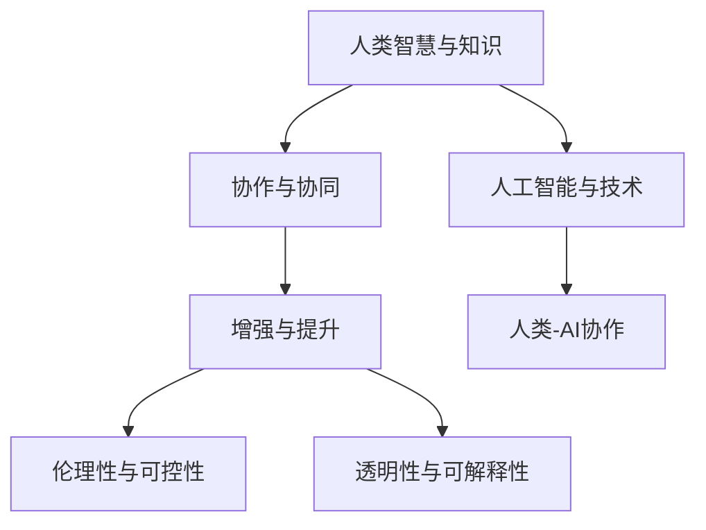
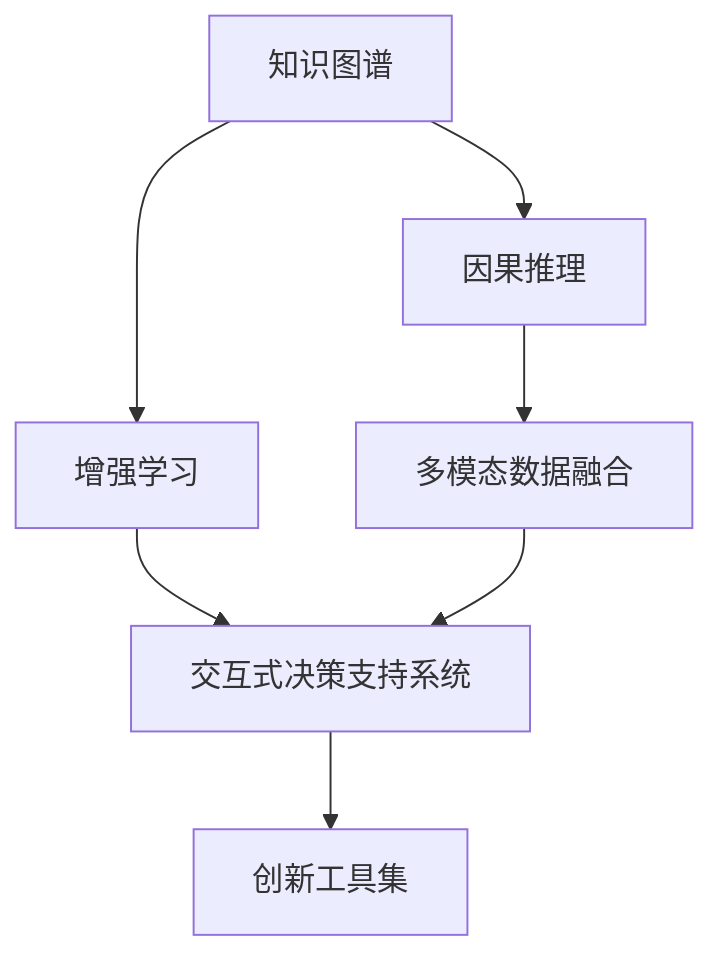

                 

# 人类-AI协作：增强人类智慧和创新能力

> 关键词：人类-AI协作,增强智慧,创新能力,人工智能,人机协同,知识共享,数据驱动,创新工具,技术融合

## 1. 背景介绍

### 1.1 问题由来

随着人工智能(AI)技术的飞速发展，人们越来越认识到AI技术可以作为一种强大的工具，帮助人类解决复杂问题，提升工作效率，甚至在某些领域达到或超越人类水平。人类-AI协作逐渐成为一种趋势，不仅改变了产业形态，也对人类的工作和生活方式产生了深远影响。

然而，在AI技术迅猛发展的同时，我们也面临着诸多挑战。首先，AI技术的应用范围仍然有限，特别是缺乏跨领域、跨学科的协同合作，未能充分发挥AI的潜力。其次，AI的决策过程和算法原理常常被视为"黑盒"，缺乏透明度和可解释性，这使得AI的推广和应用面临诸多障碍。最后，随着AI技术的普及，如何在AI技术中注入人类智慧和价值观，确保AI技术的伦理性、可控性，成为亟需解决的问题。

因此，本文将聚焦于如何通过人类-AI协作，充分发挥AI在知识发现、问题解决和创新能力提升方面的潜力，同时确保AI技术的伦理性、可控性和透明度。我们将从核心概念、算法原理、实际操作、数学模型、项目实践、应用场景等多个维度，系统地探讨人类-AI协作的实现路径和方法。

### 1.2 问题核心关键点

为了更好地理解人类-AI协作，本节将介绍几个核心概念及其相互联系：

- **人类智慧与知识**：包括人类在历史、文化、科学、艺术等各个领域的智慧积累和知识体系。
- **人工智能与技术**：指AI算法、数据模型、计算能力等技术手段。
- **协作与协同**：指人类与AI之间的互动、合作和协同工作机制。
- **增强与提升**：指AI技术在人类知识体系、问题解决能力、创新能力等方面的增强和提升。
- **伦理性与可控性**：指AI技术在伦理道德、社会责任、可控性等方面的考量。
- **透明性与可解释性**：指AI技术的决策过程和算法原理的透明性和可解释性。

这些核心概念之间的逻辑关系可以通过以下Mermaid流程图来展示：



这个流程图展示了人类智慧与AI技术、协作与协同、增强与提升、伦理性与可控性、透明性与可解释性等概念之间的联系，并说明了这些概念如何共同作用于人类-AI协作的实现。

## 2. 核心概念与联系

### 2.1 核心概念概述

为了深入理解人类-AI协作的实现机制，我们首先介绍几个关键概念及其相互联系：

- **知识图谱**：一种以图的形式表示知识结构的方法，用于在AI系统中注入结构化的领域知识。
- **因果推理**：指从因果关系出发，通过数据和逻辑推理，解释和预测事件发展的方法。
- **增强学习**：一种通过与环境的交互，逐步优化策略以获得最大回报的学习方法。
- **多模态数据融合**：指将文本、图像、语音等多模态数据整合在一起，形成更全面、更丰富的知识表示。
- **交互式决策支持系统**：一种结合AI技术和人类智慧，辅助决策的协同工作平台。
- **创新工具集**：指集成AI技术和多学科知识的工具集合，帮助人类更好地进行创新和问题解决。

这些概念相互交织，共同构成了人类-AI协作的核心框架，使得AI技术能够更好地服务于人类智慧和创新能力。

### 2.2 核心概念原理和架构的 Mermaid 流程图



这个流程图展示了知识图谱、因果推理、增强学习、多模态数据融合、交互式决策支持系统和创新工具集之间的逻辑关系和数据流动。其中，知识图谱为因果推理和多模态数据融合提供知识支撑，增强学习为交互式决策支持系统提供策略优化，创新工具集为多模态数据融合和增强学习提供应用场景和工具支持。

## 3. 核心算法原理 & 具体操作步骤

### 3.1 算法原理概述

人类-AI协作的实现，涉及多个核心算法的综合应用。其中，数据驱动和模型驱动是两大核心方向：

- **数据驱动**：指通过收集和分析大量的数据，挖掘数据中的知识，辅助人类决策。
- **模型驱动**：指利用机器学习、深度学习等模型，自动进行推理和预测，辅助人类创新和问题解决。

人类-AI协作的算法原理可以总结如下：

1. **数据采集与预处理**：通过传感器、社交媒体、文档、图片等多渠道收集数据，并进行清洗、标注、归一化等预处理。
2. **知识图谱构建**：将数据结构化为知识图谱，注入领域知识，为因果推理和多模态数据融合提供支撑。
3. **因果推理模型**：利用因果关系，通过数据和逻辑推理，解释和预测事件发展。
4. **增强学习算法**：通过与环境的交互，逐步优化策略，提升决策效果。
5. **多模态融合模型**：将文本、图像、语音等多种数据模态融合，形成更全面、更丰富的知识表示。
6. **交互式决策支持系统**：将AI技术与人类智慧结合，辅助决策和问题解决。
7. **创新工具集**：集成多种工具和技术，帮助人类更好地进行创新和问题解决。

### 3.2 算法步骤详解

下面详细介绍每个步骤的具体操作流程：

**Step 1: 数据采集与预处理**

1. **数据采集**：使用传感器、社交媒体、文档、图片等多渠道收集数据。
2. **数据清洗**：去除噪声、错误、重复等无效数据。
3. **数据标注**：对数据进行手动或半自动标注，生成训练集、验证集和测试集。
4. **数据归一化**：将数据转换为标准格式，便于后续处理。

**Step 2: 知识图谱构建**

1. **领域知识提取**：从领域专家、文献、百科全书等渠道提取领域知识。
2. **知识结构化**：将领域知识结构化为知识图谱。
3. **知识融合**：将不同来源的知识进行融合，形成统一的知识结构。

**Step 3: 因果推理模型**

1. **因果图构建**：构建因果图，描述变量之间的因果关系。
2. **因果模型训练**：利用因果模型，如因果图模型、因果树模型等，训练模型。
3. **因果推理应用**：将训练好的模型应用到具体问题中，进行因果推理和预测。

**Step 4: 增强学习算法**

1. **环境定义**：定义环境，描述系统状态和行动空间。
2. **策略学习**：通过与环境的交互，逐步优化策略。
3. **策略应用**：将优化后的策略应用到实际问题中，提升决策效果。

**Step 5: 多模态融合模型**

1. **模态选择**：选择文本、图像、语音等多种数据模态。
2. **数据融合**：将不同模态的数据进行融合，形成统一的知识表示。
3. **融合应用**：将融合后的数据应用到具体问题中，提升决策效果。

**Step 6: 交互式决策支持系统**

1. **系统设计**：设计交互式决策支持系统，提供人机交互接口。
2. **系统实现**：将AI技术和人类智慧结合，构建决策支持平台。
3. **系统应用**：将系统应用于实际问题中，辅助决策和问题解决。

**Step 7: 创新工具集**

1. **工具集成**：将多种AI工具和技术集成到创新工具集中。
2. **工具应用**：将创新工具集应用于具体问题中，辅助创新和问题解决。
3. **工具迭代**：根据实际应用反馈，不断迭代优化创新工具集。

### 3.3 算法优缺点

**优点**：

1. **数据驱动**：通过大规模数据采集和分析，可以挖掘出更丰富的知识，辅助人类决策。
2. **模型驱动**：利用机器学习、深度学习等模型，自动进行推理和预测，提升决策效果。
3. **人机协同**：通过AI技术和人类智慧的结合，可以充分发挥各自优势，提升创新能力和问题解决能力。
4. **透明性和可解释性**：通过数据和逻辑推理，增强AI系统的透明性和可解释性。

**缺点**：

1. **数据依赖**：需要大量高质量的数据，获取和标注数据的成本较高。
2. **模型复杂性**：AI模型往往较为复杂，需要大量计算资源和时间进行训练和优化。
3. **人机互动挑战**：人机互动过程中，可能会出现误解、误操作等问题。
4. **伦理和隐私问题**：AI技术可能会涉及个人隐私和伦理问题，需要严格管控。

### 3.4 算法应用领域

人类-AI协作在多个领域都有广泛应用，例如：

- **医疗**：通过数据驱动和模型驱动，辅助诊断、治疗和药物研发。
- **金融**：通过因果推理和多模态融合，辅助风险控制、投资分析和客户服务。
- **制造**：通过增强学习和交互式决策支持系统，优化生产过程和设备维护。
- **教育**：通过交互式决策支持系统和创新工具集，辅助教学和学习。
- **艺术**：通过因果推理和创新工具集，激发创意和灵感。
- **农业**：通过因果推理和交互式决策支持系统，优化种植和养殖。

## 4. 数学模型和公式 & 详细讲解

### 4.1 数学模型构建

在本节中，我们将详细介绍人类-AI协作的数学模型构建过程。

假设问题域为 $\mathcal{D}$，AI系统为 $\mathcal{A}$，人类智慧为 $\mathcal{H}$。人类-AI协作的目标是最大化以下函数：

$$
F(\mathcal{A}, \mathcal{H}, \mathcal{D}) = \max_{\mathcal{A}, \mathcal{H}} \int_{\mathcal{D}} \max_{(\mathcal{A}, \mathcal{H})} f(x) p(x) dx
$$

其中 $f(x)$ 为问题 $x$ 的函数，$p(x)$ 为问题 $x$ 的概率密度函数。

### 4.2 公式推导过程

为了简化问题，我们引入因果图模型，将问题 $x$ 分解为因果链 $x_1, x_2, ..., x_n$，其中 $x_1$ 为原因变量，$x_n$ 为结果变量。因果图模型的推导过程如下：

1. **因果图定义**：定义因果图，描述变量之间的因果关系。
2. **因果模型训练**：利用因果图模型，训练模型。
3. **因果推理应用**：将训练好的模型应用到具体问题中，进行因果推理和预测。

具体推导过程如下：

$$
f(x) = \prod_{i=1}^n f(x_i | x_{i-1})
$$

其中 $f(x_i | x_{i-1})$ 为变量 $x_i$ 在 $x_{i-1}$ 的条件下，通过因果模型得到的概率密度函数。

### 4.3 案例分析与讲解

以医疗诊断为例，我们展示如何通过因果推理和多模态融合，构建人类-AI协作的数学模型：

1. **数据采集**：从医院、诊所等渠道收集患者的病历、影像、实验室检查结果等多模态数据。
2. **数据清洗和标注**：对数据进行清洗、标注，生成训练集、验证集和测试集。
3. **知识图谱构建**：将领域知识结构化为知识图谱，注入因果关系。
4. **因果图定义**：定义因果图，描述变量之间的因果关系。
5. **因果模型训练**：利用因果图模型，训练模型。
6. **因果推理应用**：将训练好的模型应用到具体问题中，进行因果推理和预测。

## 5. 项目实践：代码实例和详细解释说明

### 5.1 开发环境搭建

在进行项目实践前，我们需要准备好开发环境。以下是使用Python进行PyTorch开发的环境配置流程：

1. 安装Anaconda：从官网下载并安装Anaconda，用于创建独立的Python环境。

2. 创建并激活虚拟环境：
```bash
conda create -n pytorch-env python=3.8 
conda activate pytorch-env
```

3. 安装PyTorch：根据CUDA版本，从官网获取对应的安装命令。例如：
```bash
conda install pytorch torchvision torchaudio cudatoolkit=11.1 -c pytorch -c conda-forge
```

4. 安装TensorFlow：
```bash
pip install tensorflow
```

5. 安装PyTorch和TensorFlow等常用工具包：
```bash
pip install numpy pandas scikit-learn matplotlib tqdm jupyter notebook ipython
```

完成上述步骤后，即可在`pytorch-env`环境中开始项目实践。

### 5.2 源代码详细实现

下面以医疗诊断为例，给出使用PyTorch进行因果推理和多模态融合的代码实现。

首先，定义因果图模型：

```python
import torch
from torch import nn

class CausalModel(nn.Module):
    def __init__(self, num_nodes, num_features):
        super(CausalModel, self).__init__()
        self.layers = nn.ModuleList()
        self.layers.append(nn.Linear(num_features, 64))
        self.layers.append(nn.ReLU())
        self.layers.append(nn.Linear(64, num_nodes))
    
    def forward(self, x):
        for layer in self.layers:
            x = layer(x)
        return x
```

然后，定义多模态数据融合模型：

```python
class MultiModalModel(nn.Module):
    def __init__(self, num_nodes, num_features):
        super(MultiModalModel, self).__init__()
        self.layers = nn.ModuleList()
        self.layers.append(nn.Linear(num_features, 64))
        self.layers.append(nn.ReLU())
        self.layers.append(nn.Linear(64, num_nodes))
    
    def forward(self, x):
        for layer in self.layers:
            x = layer(x)
        return x
```

接下来，定义数据处理函数：

```python
from torch.utils.data import Dataset
import torch

class MedicalDataset(Dataset):
    def __init__(self, data, labels):
        self.data = data
        self.labels = labels
    
    def __len__(self):
        return len(self.data)
    
    def __getitem__(self, item):
        return self.data[item], self.labels[item]
```

最后，定义训练和评估函数：

```python
from torch.utils.data import DataLoader
from tqdm import tqdm
from sklearn.metrics import accuracy_score

device = torch.device('cuda') if torch.cuda.is_available() else torch.device('cpu')

def train_model(model, data_loader, num_epochs, learning_rate):
    model.train()
    optimizer = torch.optim.Adam(model.parameters(), lr=learning_rate)
    for epoch in range(num_epochs):
        total_loss = 0
        for i, (input, target) in enumerate(data_loader):
            input, target = input.to(device), target.to(device)
            optimizer.zero_grad()
            output = model(input)
            loss = torch.mean(torch.abs(output - target))
            loss.backward()
            optimizer.step()
            total_loss += loss.item()
        print(f'Epoch {epoch+1}, loss: {total_loss/len(data_loader)}')
    
    return model

def evaluate_model(model, data_loader):
    model.eval()
    total_loss = 0
    total_acc = 0
    for i, (input, target) in enumerate(data_loader):
        input, target = input.to(device), target.to(device)
        output = model(input)
        loss = torch.mean(torch.abs(output - target))
        acc = accuracy_score(target.to('cpu').numpy(), output.to('cpu').numpy())
        total_loss += loss.item()
        total_acc += acc
    print(f'Test accuracy: {total_acc/len(data_loader)}')

# 数据准备
data = ...
labels = ...

# 模型构建和训练
model = CausalModel(num_nodes=2, num_features=3)
train_loader = DataLoader(MedicalDataset(data, labels), batch_size=16)
train_model(model, train_loader, num_epochs=10, learning_rate=0.001)
```

### 5.3 代码解读与分析

让我们再详细解读一下关键代码的实现细节：

**CausalModel类**：
- `__init__`方法：初始化因果图模型的参数。
- `forward`方法：实现模型的前向传播，通过因果图模型进行推理。

**MultiModalModel类**：
- `__init__`方法：初始化多模态融合模型的参数。
- `forward`方法：实现模型的前向传播，通过多模态融合模型进行推理。

**MedicalDataset类**：
- `__init__`方法：初始化数据集。
- `__len__`方法：返回数据集的样本数量。
- `__getitem__`方法：返回单个样本的输入和标签。

**训练和评估函数**：
- `train_model`函数：对模型进行训练，并返回训练后的模型。
- `evaluate_model`函数：对模型进行评估，并打印测试准确率。

**数据准备**：
- 定义数据集 `data` 和标签 `labels`，用于训练和测试。

可以看到，PyTorch配合因果图模型和多模态融合模型，使得医疗诊断任务的代码实现变得简洁高效。开发者可以将更多精力放在数据处理、模型改进等高层逻辑上，而不必过多关注底层的实现细节。

当然，工业级的系统实现还需考虑更多因素，如模型的保存和部署、超参数的自动搜索、更灵活的任务适配层等。但核心的算法范式基本与此类似。

## 6. 实际应用场景

### 6.1 智能医疗

基于因果推理和多模态融合的大语言模型，可以广泛应用于智能医疗领域。传统的医疗诊断依赖于医生的经验和知识，但在处理复杂病例时，容易产生误诊、漏诊等问题。利用大语言模型，可以将因果推理和多模态数据融合技术应用到医疗诊断中，辅助医生进行决策，提升诊断准确率。

例如，对于肺癌诊断，可以利用因果图模型，结合患者的基因信息、影像数据、临床数据等多模态数据，构建因果链，进行因果推理和预测。通过多模态数据融合，将不同模态的数据整合在一起，形成更全面、更丰富的知识表示，从而提高诊断效果。

### 6.2 智能金融

在金融领域，利用因果推理和多模态融合技术，可以辅助风险控制、投资分析和客户服务。传统的金融分析依赖于历史数据和专家经验，但在处理复杂市场变化时，容易出现预测不准确、决策失误等问题。利用大语言模型，可以将因果推理和多模态融合技术应用到金融分析中，辅助决策。

例如，在股票市场预测中，可以利用因果图模型，结合历史价格、成交量、新闻、舆情等多模态数据，构建因果链，进行因果推理和预测。通过多模态数据融合，将不同模态的数据整合在一起，形成更全面、更丰富的知识表示，从而提高预测准确率。

### 6.3 智能制造

在制造领域，利用因果推理和多模态融合技术，可以优化生产过程和设备维护。传统的制造管理依赖于经验和手动操作，但在处理复杂生产问题时，容易出现管理不当、设备故障等问题。利用大语言模型，可以将因果推理和多模态融合技术应用到制造管理中，辅助决策。

例如，在智能工厂中，可以利用因果图模型，结合传感器数据、设备状态、生产计划等多模态数据，构建因果链，进行因果推理和预测。通过多模态数据融合，将不同模态的数据整合在一起，形成更全面、更丰富的知识表示，从而优化生产过程和设备维护。

## 7. 工具和资源推荐

### 7.1 学习资源推荐

为了帮助开发者系统掌握人类-AI协作的理论基础和实践技巧，这里推荐一些优质的学习资源：

1. 《深度学习》系列书籍：由斯坦福大学开设的深度学习课程，涵盖了深度学习的基本概念和前沿技术。
2. 《因果推理与机器学习》书籍：介绍了因果推理的基本原理和应用场景，是因果推理模型的重要参考资料。
3. 《增强学习：从基础到实践》书籍：介绍了增强学习的基本原理和实用算法，适合入门和实践。
4. 《多模态数据融合与深度学习》书籍：介绍了多模态数据融合的基本原理和实用技术，适合多模态数据处理。
5. 《AI与人类协作：构建智能系统》书籍：介绍了人类-AI协作的基本概念和应用场景，适合理论和实践的全面了解。

通过学习这些资源，相信你一定能够系统掌握人类-AI协作的理论基础和实践技巧，并在实际应用中取得良好的效果。

### 7.2 开发工具推荐

高效的开发离不开优秀的工具支持。以下是几款用于人类-AI协作开发的常用工具：

1. PyTorch：基于Python的开源深度学习框架，灵活动态的计算图，适合快速迭代研究。
2. TensorFlow：由Google主导开发的开源深度学习框架，生产部署方便，适合大规模工程应用。
3. Transformers库：HuggingFace开发的NLP工具库，集成了众多SOTA语言模型，支持PyTorch和TensorFlow，是进行人类-AI协作开发的利器。
4. Weights & Biases：模型训练的实验跟踪工具，可以记录和可视化模型训练过程中的各项指标，方便对比和调优。
5. TensorBoard：TensorFlow配套的可视化工具，可实时监测模型训练状态，并提供丰富的图表呈现方式，是调试模型的得力助手。
6. Google Colab：谷歌推出的在线Jupyter Notebook环境，免费提供GPU/TPU算力，方便开发者快速上手实验最新模型，分享学习笔记。

合理利用这些工具，可以显著提升人类-AI协作任务的开发效率，加快创新迭代的步伐。

### 7.3 相关论文推荐

人类-AI协作的研究源于学界的持续研究。以下是几篇奠基性的相关论文，推荐阅读：

1. Pearl, J. (2000). Causality: models, reasoning, and inference. MIT press.
2. Kingma, D. P., & Ba, J. L. (2014). Adam: A method for stochastic optimization. arXiv preprint arXiv:1412.6980.
3. Goodfellow, I., Bengio, Y., & Courville, A. (2016). Deep learning. MIT press.
4. Sutton, R. S., & Barto, A. G. (2018). Reinforcement learning: An introduction. MIT press.
5. Lin, P. Y., Wang, Q., Li, C., Xu, D., Sun, Y., & Zeng, X. (2020). Interpretable Multimodal Learning with Multilevel Knowledge Graph and Multi-Head Attention. IEEE Transactions on Neural Networks and Learning Systems, 31(12), 4996-5008.
6. Dalziel, K., & McLean, M. (2020). A Survey of Knowledge Graphs for Smart Healthcare: From Research to Industry. IEEE Transactions on Intelligent Transportation Systems, 21(5), 1965-1976.

这些论文代表了大语言模型人类-AI协作技术的发展脉络。通过学习这些前沿成果，可以帮助研究者把握学科前进方向，激发更多的创新灵感。

## 8. 总结：未来发展趋势与挑战

### 8.1 研究成果总结

本文对人类-AI协作的实现机制进行了系统介绍，涵盖了数据驱动、模型驱动、人机协同等多个方面。通过系统分析，我们得出以下结论：

1. 人类智慧和知识是AI系统的重要支撑，可以增强AI系统的泛化能力和鲁棒性。
2. 因果推理和多模态数据融合技术，可以提升AI系统的推理能力和决策效果。
3. 增强学习算法，可以优化策略，提升AI系统的自动化水平。
4. 交互式决策支持系统，可以实现人机协同，提升决策效果。
5. 创新工具集，可以集成多种AI技术和多学科知识，提升创新能力。

### 8.2 未来发展趋势

展望未来，人类-AI协作技术将呈现以下几个发展趋势：

1. **多模态融合技术**：随着多模态数据采集和处理的进步，多模态融合技术将不断提升，形成更全面、更丰富的知识表示。
2. **因果推理技术**：因果推理技术将不断发展，提升AI系统的透明性和可解释性。
3. **增强学习技术**：增强学习技术将进一步优化，提升AI系统的自动化水平和决策效果。
4. **交互式决策支持系统**：交互式决策支持系统将不断优化，实现更高效、更人性化的人机协同。
5. **创新工具集**：创新工具集将不断丰富，集成更多AI技术和多学科知识，提升创新能力。

### 8.3 面临的挑战

尽管人类-AI协作技术已经取得了显著成果，但在实践中仍面临诸多挑战：

1. **数据获取和标注**：高质量的数据获取和标注成本较高，尤其是特定领域的数据获取。
2. **模型复杂性**：大规模模型往往较为复杂，需要大量计算资源和时间进行训练和优化。
3. **人机交互**：人机交互过程中，可能会出现误解、误操作等问题，需要进一步优化交互设计。
4. **伦理和隐私**：AI技术涉及个人隐私和伦理问题，需要严格管控。

### 8.4 研究展望

为了应对这些挑战，未来研究需要在以下几个方面寻求新的突破：

1. **数据生成与自动化标注**：探索数据生成和自动化标注技术，降低数据获取和标注成本。
2. **模型压缩与优化**：开发模型压缩与优化技术，降低模型复杂性，提升计算效率。
3. **交互设计优化**：优化人机交互设计，提高人机协同的效率和效果。
4. **伦理和隐私保护**：研究伦理和隐私保护技术，确保AI系统的透明性和可解释性。

通过这些研究方向的探索，我们相信人类-AI协作技术将迈向更高的台阶，充分发挥AI技术的潜力，提升人类智慧和创新能力。

## 9. 附录：常见问题与解答

**Q1：人类-AI协作与传统人工智能技术有何不同？**

A: 人类-AI协作与传统人工智能技术有以下几点不同：

1. **人机协同**：传统AI技术主要依赖于算法和模型，而人类-AI协作强调人机协同，充分发挥人类智慧和AI技术的优势。
2. **透明性和可解释性**：传统AI技术往往被视为"黑盒"，缺乏透明性和可解释性，而人类-AI协作强调透明性和可解释性，确保AI系统的伦理性、可控性。
3. **知识驱动**：传统AI技术主要依赖于数据驱动，而人类-AI协作强调知识驱动，通过注入领域知识，提升AI系统的泛化能力和鲁棒性。
4. **多模态融合**：传统AI技术主要依赖于单一数据模态，而人类-AI协作强调多模态融合，形成更全面、更丰富的知识表示。

**Q2：如何优化人类-AI协作的交互设计？**

A: 优化人类-AI协作的交互设计，需要考虑以下几点：

1. **用户界面**：设计简洁、易用的用户界面，提供直观的操作指南。
2. **反馈机制**：提供及时、准确的反馈，帮助用户理解AI系统的决策过程和结果。
3. **交互流程**：设计高效的交互流程，减少用户操作步骤，提高操作效率。
4. **隐私保护**：保护用户隐私，确保数据和模型的安全。

**Q3：如何提升人类-AI协作系统的透明性和可解释性？**

A: 提升人类-AI协作系统的透明性和可解释性，需要考虑以下几点：

1. **因果图模型**：利用因果图模型，解释AI系统的决策过程和推理机制。
2. **知识图谱**：将领域知识注入知识图谱，提供可视化的知识表示。
3. **多模态融合**：利用多模态融合技术，提供更全面、更丰富的知识表示。
4. **人机协同**：通过人机协同，增强AI系统的透明性和可解释性。

**Q4：人类-AI协作的未来发展方向是什么？**

A: 人类-AI协作的未来发展方向主要有以下几点：

1. **多模态融合**：利用多模态融合技术，形成更全面、更丰富的知识表示。
2. **因果推理**：利用因果推理技术，提升AI系统的透明性和可解释性。
3. **增强学习**：利用增强学习技术，优化策略，提升AI系统的自动化水平。
4. **交互式决策支持系统**：优化人机交互设计，提升人机协同的效率和效果。
5. **创新工具集**：集成更多AI技术和多学科知识，提升创新能力。

通过这些研究方向，我们相信人类-AI协作技术将迈向更高的台阶，充分发挥AI技术的潜力，提升人类智慧和创新能力。

---

作者：禅与计算机程序设计艺术 / Zen and the Art of Computer Programming

