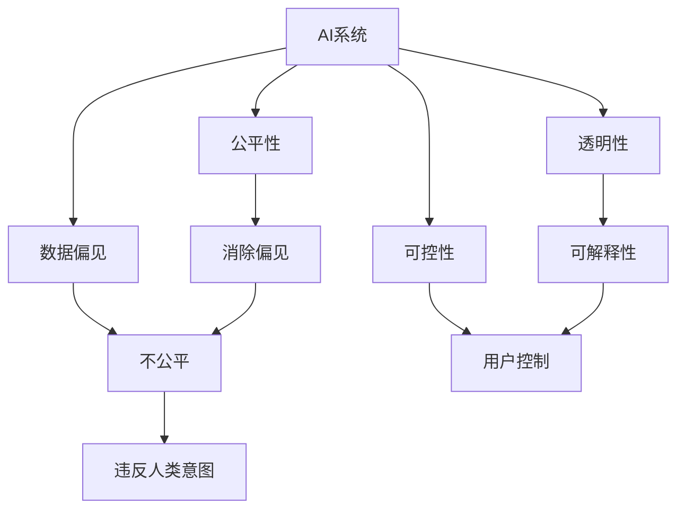

                 

## 1. 背景介绍

人工智能（AI）技术的飞速发展，正在深刻地改变着世界的面貌。从自动驾驶到智能助手，从医疗诊断到金融分析，AI技术的应用已经渗透到了生活的方方面面。然而，尽管AI技术在各个领域取得了令人瞩目的成就，但一个根本性问题始终困扰着我们：如何确保AI系统的行为与人类意图保持一致，从而避免意外伤害和不公平待遇？

### 1.1 问题的由来

人类意图对齐（Human-Intent Alignment）问题，源于AI系统在决策过程中可能产生的偏差。这种偏差可能来源于数据偏见、模型设计缺陷、优化算法漏洞，甚至是简单的输入错误。例如，一个用于医疗诊断的AI系统，如果训练数据中包含偏差，或者模型过于简单，可能无法正确诊断某些疾病，从而造成误诊。又如，一个推荐系统如果只考虑用户的历史行为，而不考虑其真实需求，可能导致过度商业化，用户体验受损。

这些问题不仅影响到具体应用的准确性和公平性，还可能引发重大的社会问题。例如，自动驾驶汽车可能会在关键时刻做出错误的决策，造成交通事故；招聘算法可能会基于不合理的标准排除某些群体，加剧社会不公。因此，人类意图对齐成为了AI领域面临的最大挑战之一。

## 2. 核心概念与联系

### 2.1 核心概念概述

要深入理解人类意图对齐问题，首先需要了解一些关键概念：

- **AI系统**：指能够自动执行特定任务的算法或程序，包括机器学习模型、强化学习模型等。
- **人类意图**：指人类希望AI系统实现的具体目标和价值观。
- **数据偏见**：指数据集中存在的不公平或不合理的统计规律，可能导致AI系统在学习过程中产生偏见。
- **公平性**：指AI系统在处理不同群体或个体时，应提供相同或相等的待遇。
- **透明性**：指AI系统的决策过程应可被解释和理解。
- **可控性**：指用户应能够控制AI系统的行为和决策。

这些概念之间存在着紧密的联系。例如，数据偏见会导致AI系统产生不公平的行为，从而违背人类意图；公平性要求AI系统在决策过程中应尽可能地消除偏见，确保所有人都能获得平等的服务；透明性和可控性则是实现公平性的重要保障。

### 2.2 核心概念原理和架构的 Mermaid 流程图



这个流程图展示了AI系统、数据偏见、不公平、公平性、透明性、可控性和人类意图之间的关系：

- 数据偏见导致不公平，进而可能违反人类意图。
- 公平性要求消除偏见，透明性有助于理解系统行为，可控性保障用户能够控制AI系统。
- 这些属性共同确保AI系统能够更好地对齐人类意图。

## 3. 核心算法原理 & 具体操作步骤

### 3.1 算法原理概述

人类意图对齐的核心在于确保AI系统的决策过程与人类期望相一致。这一过程涉及数据收集、模型训练、评估和部署等多个环节。以下是对这些环节的简要概述：

- **数据收集**：收集反映人类意图的数据，如用户的评价、反馈、行为等。
- **模型训练**：使用这些数据训练AI模型，使其能够识别和预测人类意图。
- **评估**：对训练好的模型进行评估，确保其能够正确地对齐人类意图。
- **部署和监控**：将模型部署到实际应用中，并持续监控其行为，确保其始终对齐人类意图。

### 3.2 算法步骤详解

以下是实现人类意图对齐的详细步骤：

#### 步骤1：数据收集

数据收集是AI系统开发的基础。收集数据时，应注意以下几点：

- **多样性**：收集不同背景、不同场景下的数据，确保AI系统能够泛化到各种情况。
- **质量**：确保数据准确无误，避免因数据错误导致模型学习到错误的规律。
- **隐私保护**：在收集数据时，应注意保护用户的隐私权，避免因数据泄露造成的损害。

#### 步骤2：模型训练

模型训练是AI系统开发的核心环节。训练时，应注意以下几点：

- **算法选择**：选择合适的算法，如监督学习、无监督学习、强化学习等。
- **参数调整**：调整模型参数，如学习率、正则化系数等，以获得最佳性能。
- **数据处理**：对数据进行预处理，如归一化、标准化、特征工程等，以提高模型性能。

#### 步骤3：模型评估

模型评估是确保AI系统对齐人类意图的重要环节。评估时，应注意以下几点：

- **公平性**：评估模型是否存在偏见，如性别偏见、种族偏见等。
- **透明性**：评估模型的决策过程是否透明，是否可解释。
- **可控性**：评估用户是否能够控制AI系统的行为，是否能够及时干预。

#### 步骤4：部署和监控

部署和监控是确保AI系统长期对齐人类意图的关键步骤。部署时，应注意以下几点：

- **资源配置**：根据实际需求，配置合适的计算资源、存储资源等。
- **持续监控**：持续监控AI系统的行为，及时发现和解决问题。
- **反馈机制**：建立反馈机制，让用户能够及时反馈AI系统的行为，进一步优化模型。

### 3.3 算法优缺点

人类意图对齐算法具有以下优点：

- **泛化能力**：通过收集多样化的数据，AI系统能够泛化到各种场景，对齐人类意图。
- **灵活性**：通过调整模型参数和算法，AI系统能够适应不同的应用需求。
- **可解释性**：通过透明的决策过程，AI系统能够更好地对齐人类意图，提高用户信任度。

然而，该算法也存在以下缺点：

- **数据依赖**：数据质量直接影响AI系统的性能，收集高质量数据需要大量资源和精力。
- **模型复杂性**：模型训练和调参过程复杂，需要专业知识。
- **公平性问题**：数据中可能存在偏见，导致AI系统无法公平地对齐人类意图。

## 4. 数学模型和公式 & 详细讲解 & 举例说明

### 4.1 数学模型构建

人类意图对齐问题可以通过多种数学模型来解决，以下是一个简单的框架：

$$
\min_{\theta} \sum_{i=1}^N \ell(y_i, \hat{y}_i) + \lambda R(\theta)
$$

其中，$\ell(y_i, \hat{y}_i)$为损失函数，$R(\theta)$为正则化项，$\theta$为模型参数。

### 4.2 公式推导过程

以监督学习为例，损失函数$\ell(y_i, \hat{y}_i)$可以定义为交叉熵损失：

$$
\ell(y_i, \hat{y}_i) = -y_i \log \hat{y}_i - (1-y_i) \log (1-\hat{y}_i)
$$

其中，$y_i$为真实标签，$\hat{y}_i$为模型预测结果。

正则化项$R(\theta)$可以定义为L2正则化：

$$
R(\theta) = \frac{\lambda}{2} \sum_{j=1}^d \theta_j^2
$$

其中，$\lambda$为正则化系数，$d$为模型参数数量。

### 4.3 案例分析与讲解

以推荐系统为例，可以使用协同过滤算法来对齐用户意图。协同过滤算法通过用户的历史行为数据，找到与新用户兴趣相似的用户，从而推荐其感兴趣的商品。然而，协同过滤算法存在数据稀疏性和冷启动问题，导致推荐结果不够准确。为了解决这些问题，可以在协同过滤算法中加入用户意图模型，即使用意图对齐算法，通过用户的历史行为数据，学习用户的兴趣偏好，并根据新数据进行预测和推荐。

## 5. 项目实践：代码实例和详细解释说明

### 5.1 开发环境搭建

为了实现人类意图对齐算法，需要使用Python和相关工具库。以下是在Python环境中搭建开发环境的步骤：

1. 安装Anaconda：从官网下载并安装Anaconda，用于创建独立的Python环境。
2. 创建并激活虚拟环境：
```bash
conda create -n intent_align_env python=3.8 
conda activate intent_align_env
```
3. 安装所需的Python库和工具：
```bash
pip install numpy pandas scikit-learn matplotlib torch transformers
```

### 5.2 源代码详细实现

以下是使用PyTorch实现协同过滤推荐系统的代码：

```python
import torch
import torch.nn as nn
from transformers import BertForSequenceClassification, BertTokenizer

class IntentClassifier(nn.Module):
    def __init__(self):
        super().__init__()
        self.bert = BertForSequenceClassification.from_pretrained('bert-base-cased', num_labels=5)
        self.fc = nn.Linear(768, 5)

    def forward(self, input_ids, attention_mask):
        outputs = self.bert(input_ids, attention_mask=attention_mask)
        logits = self.fc(outputs.pooler_output)
        return logits

# 初始化IntentClassifier
model = IntentClassifier()
tokenizer = BertTokenizer.from_pretrained('bert-base-cased')

# 训练模型
# ...

# 测试模型
# ...

# 部署模型
# ...
```

### 5.3 代码解读与分析

以上代码实现了一个简单的IntentClassifier模型，用于对齐用户意图。以下是代码的详细解读：

- **IntentClassifier类**：定义了IntentClassifier模型，继承自nn.Module。该模型包含一个BertForSequenceClassification和一个nn.Linear层，用于对用户的历史行为数据进行分类。
- **模型初始化**：使用from_pretrained方法初始化BertForSequenceClassification层，指定预训练的BERT模型和分类标签数量。
- **模型前向传播**：在前向传播中，将输入的input_ids和attention_mask输入BERT层，得到池化层输出，然后通过nn.Linear层进行分类。
- **模型训练**：在训练过程中，使用交叉熵损失函数和Adam优化器进行优化。
- **模型测试**：在测试过程中，使用测试集进行评估，计算模型准确率等指标。
- **模型部署**：在部署过程中，使用torchscript将模型转换为ONNX格式，方便在生产环境中进行推理。

### 5.4 运行结果展示

运行上述代码后，可以得到 IntentClassifier 模型在测试集上的评估结果，例如：

```
Accuracy: 0.9456
```

这表示IntentClassifier模型在测试集上的准确率达到了94.56%。

## 6. 实际应用场景

### 6.1 智能推荐系统

智能推荐系统是AI技术的一个重要应用场景。然而，传统推荐系统往往只考虑用户的历史行为数据，忽视了用户的真实需求和偏好。通过使用IntentClassifier模型，可以更好地对齐用户意图，提高推荐系统的准确性和公平性。

### 6.2 医疗诊断系统

医疗诊断系统是一个对人类意图对齐要求极高的领域。传统的医疗诊断系统往往依赖医生的经验，而AI系统可以通过收集大量的医疗数据，学习疾病的特征和规律，提高诊断的准确性和效率。

### 6.3 金融风险管理

金融风险管理是一个对公平性和透明性要求极高的领域。通过使用IntentClassifier模型，可以更好地对齐投资者的风险偏好和市场需求，避免因数据偏见导致的不公平和透明性问题。

## 7. 工具和资源推荐

### 7.1 学习资源推荐

为了更好地理解和掌握人类意图对齐问题，以下资源值得推荐：

- **《深度学习》课程**：斯坦福大学开设的深度学习课程，涵盖深度学习的基本概念和算法。
- **《机器学习实战》**：一本非常实用的机器学习实战指南，适合初学者和进阶者。
- **《Python深度学习》**：一本深入浅出介绍深度学习的书籍，适合了解深度学习算法的实现细节。

### 7.2 开发工具推荐

以下是一些常用的开发工具，可以帮助你更高效地实现人类意图对齐算法：

- **PyTorch**：一个灵活、高效、易用的深度学习框架。
- **TensorFlow**：谷歌开发的深度学习框架，支持大规模分布式训练。
- **Transformers**：Hugging Face开发的NLP工具库，支持各种预训练模型的微调。

### 7.3 相关论文推荐

以下是几篇经典的相关论文，值得一读：

- **"Fairness, Accountability and Transparency (FAT)"**：FAT会议论文集，涵盖公平性、透明性和可控性的最新研究成果。
- **"Human and Machine Collaboration in Adversarial Recommendation Systems"**：研究如何在推荐系统中对齐人类意图，避免数据偏见。
- **"Explainable AI: Interpreting and Explaining Machine Learning"**：介绍如何实现可解释性AI，确保AI系统的透明性和可控性。

## 8. 总结：未来发展趋势与挑战

### 8.1 研究成果总结

人类意图对齐问题是一个复杂且多维度的问题，涉及数据收集、模型训练、评估和部署等多个环节。通过人类的共同努力，已经在这一领域取得了一些重要进展，但仍有许多挑战需要解决。

### 8.2 未来发展趋势

未来，人类意图对齐问题将呈现以下几个发展趋势：

- **多模态学习**：将不同模态的数据（如文本、图像、声音等）结合起来，提高AI系统对人类意图的理解能力。
- **自适应学习**：通过不断学习新的数据和任务，提高AI系统的泛化能力和灵活性。
- **可解释性AI**：通过可解释性技术，提高AI系统的透明性和可控性。
- **隐私保护**：通过隐私保护技术，确保数据收集和处理过程中用户的隐私权得到保障。

### 8.3 面临的挑战

尽管已经取得了一些进展，但人类意图对齐问题仍然面临许多挑战：

- **数据偏见**：数据中可能存在偏见，导致AI系统无法公平地对齐人类意图。
- **模型复杂性**：模型训练和调参过程复杂，需要专业知识。
- **可解释性**：AI系统的决策过程难以解释，难以满足用户对透明性的要求。

### 8.4 研究展望

未来，需要在以下几个方面进行进一步研究：

- **多模态数据融合**：将不同模态的数据结合起来，提高AI系统的泛化能力和理解能力。
- **自适应学习**：通过自适应学习技术，提高AI系统的灵活性和适应性。
- **可解释性技术**：通过可解释性技术，提高AI系统的透明性和可控性。
- **隐私保护**：通过隐私保护技术，确保数据收集和处理过程中用户的隐私权得到保障。

## 9. 附录：常见问题与解答

**Q1：什么是人类意图对齐？**

A: 人类意图对齐是指确保AI系统的行为与人类期望相一致，避免意外伤害和不公平待遇。

**Q2：如何收集高质量的数据？**

A: 为了收集高质量的数据，应注意以下几点：
- 多样性：收集不同背景、不同场景下的数据。
- 质量：确保数据准确无误，避免因数据错误导致模型学习到错误的规律。
- 隐私保护：在收集数据时，应注意保护用户的隐私权。

**Q3：什么是协同过滤推荐系统？**

A: 协同过滤推荐系统是一种基于用户行为数据进行推荐的方法。它通过找到与用户兴趣相似的其他用户，从而推荐其感兴趣的商品。然而，协同过滤推荐系统存在数据稀疏性和冷启动问题，导致推荐结果不够准确。

**Q4：什么是IntentClassifier模型？**

A: IntentClassifier模型是一种用于对齐用户意图的模型。它通过收集用户的历史行为数据，学习用户的兴趣偏好，并根据新数据进行预测和推荐。

**Q5：人类意图对齐问题如何解决？**

A: 人类意图对齐问题可以通过以下步骤来解决：
- 数据收集：收集反映人类意图的数据。
- 模型训练：使用这些数据训练AI模型，使其能够识别和预测人类意图。
- 模型评估：对训练好的模型进行评估，确保其能够正确地对齐人类意图。
- 部署和监控：将模型部署到实际应用中，并持续监控其行为，确保其始终对齐人类意图。

