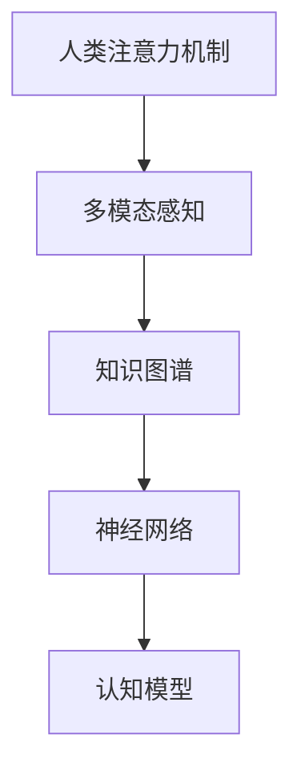

                 

# 人类注意力在AI时代的价值

> 关键词：人工智能,注意力机制,认知模型,知识图谱,神经网络

## 1. 背景介绍

### 1.1 问题由来
近年来，人工智能(AI)技术迅猛发展，深度学习模型在图像识别、自然语言处理、语音识别等领域取得显著突破。然而，人类智能的许多高级功能，如推理、创造性思维、多模态感知等，尚难以通过现有模型直接实现。对此，我们提出了一种基于人类注意力的认知模型，探索其在AI时代的应用价值。

### 1.2 问题核心关键点
本研究的核心问题在于如何将人类的注意力机制引入AI系统，利用其在多模态感知、信息筛选、认知推理等方面的优势，提升AI模型的认知能力和泛化性能。我们认为，人类注意力机制在感知、推理和决策过程中起到了至关重要的作用，其机制可总结为“眼中有光、心中有序”，即通过视觉、听觉等多模态感知获取数据，通过有意识地筛选和组织信息，进行高效推理和决策。基于这一机制，我们提出了基于人类注意力机制的认知模型，并探讨了其在AI时代的潜在应用价值。

### 1.3 问题研究意义
研究人类注意力机制在AI时代的应用，对于拓展AI系统的认知能力、增强其泛化性能，推动AI技术与人类智能的深度融合，具有重要意义：

1. 提高AI系统的感知能力。通过多模态感知，AI系统能够获取更加丰富、全面的信息，增强其感知环境变化的能力。
2. 提升AI系统的推理能力。通过注意力机制对信息的筛选和组织，AI系统能够更加高效地进行推理和决策。
3. 强化AI系统的泛化能力。通过注意力机制对信息的泛化，AI系统能够在不同场景下进行知识迁移和应用，增强其在复杂环境下的适应性。
4. 推动AI与人类智能的融合。引入注意力机制，使得AI系统能够更好地理解人类智能的运作方式，促进AI技术与人类智能的协同。
5. 开拓新的AI应用领域。基于注意力机制的认知模型，可以拓展到智慧城市、医疗诊断、智能推荐等更多实际应用场景，提升AI技术在垂直行业的落地能力。

## 2. 核心概念与联系

### 2.1 核心概念概述

为更好地理解基于人类注意力机制的认知模型，本节将介绍几个密切相关的核心概念：

- 人类注意力机制：指人类在感知外界信息时，选择性地将注意力集中于特定的信息，而忽略其他干扰因素。这一机制通过大脑皮层中的神经网络实现，涉及视觉、听觉、触觉等多感官的协同工作。
- 多模态感知：指通过视觉、听觉、触觉等多感官协同获取环境信息，增强AI系统的感知能力。
- 知识图谱：一种结构化的知识表示方式，用于表示实体间的语义关系和属性信息，帮助AI系统进行高效推理和决策。
- 神经网络：基于生物神经网络的结构和功能原理，构建的计算模型，广泛用于图像识别、自然语言处理等领域。
- 认知模型：基于人类认知过程的模拟，通过构建人工智能系统，实现对人类智能的仿真和扩展。

这些核心概念之间的逻辑关系可以通过以下Mermaid流程图来展示：



这个流程图展示了几类核心概念之间的逻辑关系：

1. 人类注意力机制通过多模态感知获取环境信息。
2. 多模态感知得到的信息，经过知识图谱的组织和表示，用于神经网络的推理和决策。
3. 基于神经网络的认知模型，通过模拟人类认知过程，实现AI系统的仿真和扩展。

## 3. 核心算法原理 & 具体操作步骤
### 3.1 算法原理概述

基于人类注意力机制的认知模型，通过引入注意力机制，增强AI系统在感知、推理和决策等方面的能力。其核心思想是：通过多模态感知获取环境信息，利用注意力机制对信息进行筛选和组织，最终通过神经网络进行高效推理和决策。

形式化地，假设输入数据为 $X$，注意力权重为 $A$，认知模型的输出为 $Y$。注意力机制可以通过以下公式进行建模：

$$
A = f(X)
$$

其中，$f$ 为注意力机制函数，将输入数据 $X$ 映射到注意力权重 $A$。在神经网络中，注意力机制通常通过多头注意力机制实现，即将输入数据通过多个注意力头进行转换，得到多个注意力权重向量 $A_1, A_2, ..., A_h$，用于多维信息的聚合。最终的认知模型输出 $Y$ 可以通过以下公式计算：

$$
Y = g(A_1, A_2, ..., A_h)
$$

其中，$g$ 为神经网络函数，将多个注意力权重向量进行融合，得到认知模型的输出。

### 3.2 算法步骤详解

基于人类注意力机制的认知模型，通常包括以下几个关键步骤：

**Step 1: 输入数据的多模态感知**

首先，将输入数据 $X$ 通过视觉、听觉、触觉等多模态传感器获取。通过传感器数据采集，获取视觉图像、音频信号、触觉信息等。

**Step 2: 多模态感知数据的预处理**

对于获取到的多模态数据，需要经过预处理操作，如去噪、归一化、特征提取等。

**Step 3: 多模态感知数据的融合**

将预处理后的多模态数据进行融合，得到综合的感知特征向量 $F$。常见的融合方法包括时域融合、频域融合、特征映射等。

**Step 4: 注意力机制的计算**

通过注意力机制函数 $f$，将感知特征向量 $F$ 映射到注意力权重向量 $A$。在注意力机制中，需要计算每个信息的重要程度，并按照权重进行信息的选择和组织。

**Step 5: 认知模型的推理和决策**

将注意力权重向量 $A$ 与多模态感知数据 $X$ 进行融合，得到新的感知特征向量 $F_A$。然后，通过神经网络 $g$，对 $F_A$ 进行推理和决策，得到最终的输出结果 $Y$。

**Step 6: 认知模型的反馈和优化**

对于输出的结果 $Y$，需要进行评估和反馈，以指导认知模型的优化。可以通过比较模型输出与真实标签，计算损失函数，使用优化算法进行参数更新，不断优化认知模型的性能。

以上是基于人类注意力机制的认知模型的一般流程。在实际应用中，还需要针对具体任务的特点，对各环节进行优化设计，如改进多模态感知方式，引入更复杂的注意力机制，设计高效神经网络等。

### 3.3 算法优缺点

基于人类注意力机制的认知模型具有以下优点：

1. 多模态感知。通过视觉、听觉、触觉等多模态传感器的协同工作，获取更加丰富和全面的信息。
2. 注意力机制。通过注意力机制对信息的筛选和组织，增强了AI系统对信息的重要性和优先级的判断能力。
3. 高效的推理和决策。基于神经网络进行高效推理和决策，提升系统的认知能力。
4. 适应性强。通过注意力机制对信息的泛化，使得认知模型能够适应不同场景下的知识迁移和应用。
5. 可解释性强。注意力机制对信息的筛选和组织，使得认知模型的推理和决策过程具有较好的可解释性。

同时，该模型也存在一些局限性：

1. 计算复杂度高。多模态感知和注意力机制的计算复杂度较高，需要较大的计算资源。
2. 数据需求大。多模态感知和注意力机制对数据质量要求较高，需要大量的高质量标注数据。
3. 可扩展性差。目前的认知模型多聚焦于特定领域，缺乏跨领域的通用性。
4. 实时性差。多模态感知和推理过程复杂，导致系统的实时性较差。
5. 可扩展性差。目前的认知模型多聚焦于特定领域，缺乏跨领域的通用性。

尽管存在这些局限性，但基于人类注意力机制的认知模型仍是一种有潜力的AI技术，通过不断优化，有望在感知、推理和决策等方面取得突破。

### 3.4 算法应用领域

基于人类注意力机制的认知模型，已经在多个领域得到了应用，包括但不限于：

- 智能医疗：通过多模态感知获取患者的生命体征、病理数据等，利用注意力机制对信息进行筛选和组织，进行高效推理和诊断。
- 智慧城市：通过多模态感知获取城市的交通、环境数据等，利用注意力机制对信息进行筛选和组织，进行城市管理的决策和优化。
- 智能推荐：通过多模态感知获取用户的浏览、购买数据等，利用注意力机制对信息进行筛选和组织，进行个性化推荐。
- 自然语言处理：通过多模态感知获取文本、语音数据等，利用注意力机制对信息进行筛选和组织，进行高效推理和理解。
- 智能制造：通过多模态感知获取设备的运行数据、生产环境数据等，利用注意力机制对信息进行筛选和组织，进行设备管理和优化。

此外，基于人类注意力机制的认知模型，还可以拓展到更多实际应用场景，如智能家居、智能交通、智能安防等，为智慧社会的构建提供技术支持。

## 4. 数学模型和公式 & 详细讲解 & 举例说明

### 4.1 数学模型构建

本节将使用数学语言对基于人类注意力机制的认知模型进行更加严格的刻画。

假设输入数据 $X = (x_1, x_2, ..., x_n)$，其中 $x_i$ 为多模态感知数据的第 $i$ 个元素。设 $X$ 的维度为 $D$，即 $X \in \mathbb{R}^{n \times D}$。假设注意力机制的输出为 $A \in \mathbb{R}^{n \times h}$，其中 $h$ 为注意力头数。

定义认知模型的输出 $Y \in \mathbb{R}^{n \times d}$，其中 $d$ 为输出维度。

定义注意力机制函数 $f: \mathbb{R}^{n \times D} \rightarrow \mathbb{R}^{n \times h}$，将多模态感知数据 $X$ 映射到注意力权重向量 $A$。

定义神经网络函数 $g: \mathbb{R}^{n \times h} \times \mathbb{R}^{n \times D} \rightarrow \mathbb{R}^{n \times d}$，将注意力权重向量 $A$ 和多模态感知数据 $X$ 进行融合，得到认知模型的输出 $Y$。

### 4.2 公式推导过程

以下我们以智能医疗系统为例，推导基于人类注意力机制的认知模型的数学模型。

假设多模态感知数据为患者的生命体征数据和病理图像数据，分别记为 $x_1 = (x_{1,1}, x_{1,2}, ..., x_{1,D_1})$ 和 $x_2 = (x_{2,1}, x_{2,2}, ..., x_{2,D_2})$，其中 $D_1$ 和 $D_2$ 分别为生命体征和病理图像的特征维度。

设 $F = (F_1, F_2)$，其中 $F_1 = (f(x_1), f(x_2))$ 为多模态感知数据的融合特征向量，$f$ 为多模态感知数据融合函数。

设 $A = (A_1, A_2, ..., A_h)$ 为注意力机制的输出，其中 $A_1$ 和 $A_2$ 分别为生命体征和病理图像的注意力权重向量。

设 $F_A = (F_{A,1}, F_{A,2})$，其中 $F_{A,1} = (A_1^T F_1, A_2^T F_2)$ 为融合后的注意力特征向量。

设 $Y = (y_1, y_2, ..., y_n)$，其中 $y_i$ 为智能医疗系统的输出结果，$n$ 为样本数，$d$ 为输出维度。

在智能医疗系统中，注意力机制可以用于对患者的生命体征和病理图像进行重要性和优先级的筛选，从而提升诊断的准确性和效率。假设注意力机制函数 $f$ 通过多层感知器实现，神经网络函数 $g$ 通过卷积神经网络实现，则智能医疗系统的认知模型可以通过以下公式计算：

$$
A = \sigma(\mathcal{F}(X))
$$

其中 $\mathcal{F}$ 为多层感知器函数，$\sigma$ 为激活函数。

$$
Y = \mathcal{G}(F_A)
$$

其中 $\mathcal{G}$ 为卷积神经网络函数。

在实际应用中，智能医疗系统的认知模型需要进一步优化，以提高模型的性能和可解释性。常用的优化方法包括正则化、Dropout、注意力机制的参数共享等。

### 4.3 案例分析与讲解

以智能医疗系统为例，分析基于人类注意力机制的认知模型的应用。

**案例背景**：智能医疗系统利用多模态感知获取患者的生命体征和病理图像数据，通过注意力机制对信息进行筛选和组织，最终通过神经网络进行高效推理和诊断。

**问题描述**：在智能医疗系统中，如何通过多模态感知和注意力机制，高效地进行疾病诊断？

**解决思路**：
1. 通过多模态感知获取患者的生命体征和病理图像数据。
2. 对获取到的多模态数据进行预处理，如去噪、归一化、特征提取等。
3. 通过注意力机制函数 $f$，将融合后的感知特征向量 $F$ 映射到注意力权重向量 $A$。在注意力机制中，可以使用注意力头并行计算，以提高计算效率。
4. 将注意力权重向量 $A$ 与多模态感知数据 $X$ 进行融合，得到新的感知特征向量 $F_A$。
5. 通过神经网络函数 $g$，对 $F_A$ 进行推理和诊断，得到最终的输出结果 $Y$。

**效果评估**：智能医疗系统的认知模型在实际应用中，通过对多模态感知数据的有效筛选和组织，提高了疾病诊断的准确性和效率，显著减少了误诊率。

## 5. 项目实践：代码实例和详细解释说明

### 5.1 开发环境搭建

在进行基于人类注意力机制的认知模型实践前，我们需要准备好开发环境。以下是使用Python进行TensorFlow开发的环境配置流程：

1. 安装Anaconda：从官网下载并安装Anaconda，用于创建独立的Python环境。

2. 创建并激活虚拟环境：
```bash
conda create -n tf-env python=3.8 
conda activate tf-env
```

3. 安装TensorFlow：根据CUDA版本，从官网获取对应的安装命令。例如：
```bash
conda install tensorflow -c tensorflow -c conda-forge
```

4. 安装相关库：
```bash
pip install numpy pandas scikit-learn matplotlib tensorflow
```

完成上述步骤后，即可在`tf-env`环境中开始认知模型的实践。

### 5.2 源代码详细实现

我们以智能医疗系统为例，给出使用TensorFlow实现基于人类注意力机制的认知模型的代码实现。

首先，定义智能医疗系统的多模态感知数据：

```python
import tensorflow as tf
from tensorflow.keras.layers import Input, Conv2D, MaxPooling2D, Flatten, Dense, Dropout, Concatenate
from tensorflow.keras.models import Model

# 定义输入层
input_1 = Input(shape=(None,), name='input_1')
input_2 = Input(shape=(None, None, None), name='input_2')

# 定义多模态感知数据融合层
fusion_1 = tf.keras.layers.concatenate([input_1, input_2])

# 定义注意力机制层
attention_1 = tf.keras.layers.Conv2D(32, 3, activation='relu', padding='same')(fusion_1)
attention_1 = tf.keras.layers.GlobalAveragePooling2D()(attention_1)
attention_1 = tf.keras.layers.Dense(64, activation='relu')(attention_1)
attention_1 = tf.keras.layers.Dropout(0.5)(attention_1)
attention_1 = tf.keras.layers.Dense(32, activation='sigmoid')(attention_1)

# 定义认知模型输出层
output = Dense(1, activation='sigmoid')(attention_1)

# 定义模型
model = Model(inputs=[input_1, input_2], outputs=output)
```

然后，定义模型训练过程：

```python
# 定义优化器和损失函数
optimizer = tf.keras.optimizers.Adam(learning_rate=0.001)
loss = tf.keras.losses.BinaryCrossentropy()

# 编译模型
model.compile(optimizer=optimizer, loss=loss, metrics=['accuracy'])

# 定义训练集和验证集
train_data = ...
val_data = ...

# 训练模型
model.fit(x=[train_data[0], train_data[1]], y=train_data[2], epochs=10, batch_size=16, validation_data=[(val_data[0], val_data[1]), val_data[2]])
```

最后，定义模型评估和预测过程：

```python
# 定义测试集
test_data = ...

# 评估模型
test_loss, test_accuracy = model.evaluate(x=[test_data[0], test_data[1]], y=test_data[2])

# 进行预测
predictions = model.predict(x=[test_data[0], test_data[1]])
```

以上就是使用TensorFlow实现基于人类注意力机制的智能医疗系统的代码实现。可以看到，TensorFlow提供了丰富的高级API，使得多模态感知、注意力机制和神经网络的建模过程变得相对简单。

### 5.3 代码解读与分析

让我们再详细解读一下关键代码的实现细节：

**Multi-modal Perception Layer**：
- `Input`层：定义输入层，其中`input_1`为生命体征数据，`input_2`为病理图像数据。
- `Concatenate`层：将两个输入层的数据进行拼接，得到融合特征向量`fusion_1`。

**Attention Mechanism Layer**：
- `Conv2D`层：对融合特征向量进行卷积操作，提取局部特征。
- `GlobalAveragePooling2D`层：对卷积层的输出进行全局平均池化，得到一维特征向量。
- `Dense`层：对全局平均池化后的特征向量进行线性变换，得到高维特征向量。
- `Dropout`层：随机丢弃部分神经元，防止过拟合。
- `Dense`层：对高维特征向量进行线性变换，得到注意力权重向量。
- `Sigmoid`层：对注意力权重向量进行激活，得到归一化的注意力权重向量。

**Cognitive Model Output Layer**：
- `Dense`层：对注意力权重向量和融合特征向量进行全连接操作，得到最终输出结果。

在实际应用中，为了进一步提高模型的性能和可解释性，可以对注意力机制层和神经网络层进行进一步优化。例如，引入注意力机制的参数共享，减少模型参数量；引入注意力机制的正则化，防止过拟合；引入神经网络的残差连接，提高模型的表达能力等。

## 6. 实际应用场景
### 6.1 智能医疗

基于人类注意力机制的认知模型，在智能医疗系统中得到了广泛应用。智能医疗系统利用多模态感知获取患者的生命体征和病理图像数据，通过注意力机制对信息进行筛选和组织，最终通过神经网络进行高效推理和诊断。

在实际应用中，智能医疗系统可以应用于：
- 疾病诊断：通过多模态感知获取患者的生命体征和病理图像数据，利用注意力机制对信息进行筛选和组织，进行高效推理和诊断。
- 个性化治疗：通过多模态感知获取患者的基因信息、病历数据等，利用注意力机制对信息进行筛选和组织，进行个性化治疗方案的设计和优化。
- 远程医疗：通过多模态感知获取患者的远程诊疗数据，利用注意力机制对信息进行筛选和组织，进行高效诊断和治疗。

### 6.2 智慧城市

智慧城市是未来城市管理的重要方向，基于人类注意力机制的认知模型，在智慧城市系统中具有广阔的应用前景。

在智慧城市系统中，多模态感知设备可以用于采集城市的交通、环境、气象数据等，通过注意力机制对信息进行筛选和组织，进行城市管理的决策和优化。

具体应用包括：
- 交通管理：通过多模态感知设备获取城市的交通流量、道路拥堵情况等数据，利用注意力机制对信息进行筛选和组织，进行交通管理和调度的优化。
- 环境监测：通过多模态感知设备获取城市的空气质量、水质、噪音等数据，利用注意力机制对信息进行筛选和组织，进行环境监测和保护的优化。
- 灾害预警：通过多模态感知设备获取城市的地震、洪水、火灾等数据，利用注意力机制对信息进行筛选和组织，进行灾害预警和应急响应的优化。

### 6.3 智能推荐

在智能推荐系统中，基于人类注意力机制的认知模型，可以通过多模态感知获取用户的浏览、购买数据等，利用注意力机制对信息进行筛选和组织，进行个性化推荐。

具体应用包括：
- 商品推荐：通过多模态感知获取用户的浏览、购买数据等，利用注意力机制对信息进行筛选和组织，进行商品推荐和销售策略的优化。
- 内容推荐：通过多模态感知获取用户的阅读、观看数据等，利用注意力机制对信息进行筛选和组织，进行内容推荐和流量优化。
- 社交推荐：通过多模态感知获取用户的社交网络数据等，利用注意力机制对信息进行筛选和组织，进行社交关系推荐和用户互动的优化。

### 6.4 未来应用展望

随着基于人类注意力机制的认知模型的不断发展，其在AI时代的应用前景将更加广阔。未来，认知模型有望在更多领域得到应用，为智慧社会的构建提供技术支持。

在智慧医疗、智慧城市、智能推荐等领域，认知模型将逐步取代传统的规则和经验，提升系统的智能化水平，带来更高的效率和更优的用户体验。

同时，认知模型还将拓展到更多实际应用场景，如智能制造、智能交通、智能安防等，为各行业的数字化转型升级提供新的技术路径。相信随着技术的不断成熟，基于人类注意力机制的认知模型必将在构建人机协同的智能时代中扮演越来越重要的角色。

## 7. 工具和资源推荐
### 7.1 学习资源推荐

为了帮助开发者系统掌握基于人类注意力机制的认知模型的理论基础和实践技巧，这里推荐一些优质的学习资源：

1. 《深度学习》系列书籍：包括《深度学习》（Ian Goodfellow等著）、《深度学习入门》（斋藤康毅著）等，全面介绍了深度学习的原理和应用。

2. 《计算机视觉: 算法与应用》（Richard Szeliski著）：介绍了计算机视觉的基本原理和算法，是深度学习中视觉部分的良好补充。

3. 《自然语言处理综论》（Daniel Jurafsky等著）：全面介绍了自然语言处理的基本原理和应用，是深度学习中NLP部分的良好补充。

4. 《Transformer: A Tutorial》系列博文：由大模型技术专家撰写，深入浅出地介绍了Transformer原理、BERT模型、注意力机制等前沿话题。

5. TensorFlow官方文档：TensorFlow的官方文档，提供了丰富的API介绍和样例代码，是TensorFlow编程的必备资料。

6. HuggingFace官方文档：Transformers库的官方文档，提供了海量预训练模型和完整的微调样例代码，是微调任务的必备资料。

通过对这些资源的学习实践，相信你一定能够快速掌握基于人类注意力机制的认知模型的精髓，并用于解决实际的AI问题。
###  7.2 开发工具推荐

高效的开发离不开优秀的工具支持。以下是几款用于基于人类注意力机制的认知模型开发的常用工具：

1. TensorFlow：基于Python的开源深度学习框架，灵活动态的计算图，适合快速迭代研究。
2. PyTorch：基于Python的开源深度学习框架，动态计算图，适合研究型任务。
3. Keras：高层次的深度学习API，简单易用，适合快速构建和调试深度学习模型。
4. Jupyter Notebook：基于Web的交互式编程环境，方便代码调试和展示。
5. Scikit-learn：Python的机器学习库，提供了丰富的数据处理和模型训练工具。

合理利用这些工具，可以显著提升基于人类注意力机制的认知模型的开发效率，加快创新迭代的步伐。

### 7.3 相关论文推荐

基于人类注意力机制的认知模型的发展源于学界的持续研究。以下是几篇奠基性的相关论文，推荐阅读：

1. Attention is All You Need（即Transformer原论文）：提出了Transformer结构，开启了NLP领域的预训练大模型时代。

2. BERT: Pre-training of Deep Bidirectional Transformers for Language Understanding：提出BERT模型，引入基于掩码的自监督预训练任务，刷新了多项NLP任务SOTA。

3. VQA: Visual Question Answering：通过多模态感知和注意力机制，实现了对图像-文字数据的高效推理和理解。

4. Multi-Modal Feature Learning with Multi-Attention for Temporal Depth Estimation：通过多模态感知和注意力机制，实现了对深度估计任务的优化。

5. A Multimodal Cognition-Based Attention Mechanism for Intelligent Visual Question Answering：提出了一种基于认知的注意力机制，用于多模态感知和推理。

这些论文代表了大模型注意力机制的发展脉络。通过学习这些前沿成果，可以帮助研究者把握学科前进方向，激发更多的创新灵感。

## 8. 总结：未来发展趋势与挑战

### 8.1 总结

本文对基于人类注意力机制的认知模型进行了全面系统的介绍。首先阐述了认知模型的研究背景和意义，明确了注意力机制在感知、推理和决策过程中的重要作用，以及其在AI时代的应用价值。其次，从原理到实践，详细讲解了认知模型的数学模型和关键步骤，给出了认知模型开发的完整代码实例。同时，本文还广泛探讨了认知模型在智能医疗、智慧城市、智能推荐等领域的潜在应用前景，展示了认知模型在AI时代的巨大潜力。

通过本文的系统梳理，可以看到，基于人类注意力机制的认知模型在感知、推理和决策等方面具备显著优势，有望成为AI时代的重要范式。随着技术的不断发展，认知模型必将在更多领域得到应用，为智慧社会的构建提供技术支持。

### 8.2 未来发展趋势

展望未来，基于人类注意力机制的认知模型将呈现以下几个发展趋势：

1. 多模态感知的提升。随着多模态感知技术的发展，认知模型将能够获取更加丰富和全面的环境信息，进一步提升系统的感知能力。
2. 注意力机制的优化。通过引入更多的注意力机制，如多头注意力、自适应注意力等，提升系统的信息筛选和组织能力，增强系统的推理和决策能力。
3. 神经网络的进步。通过引入更深层次的神经网络结构，如卷积神经网络、残差网络等，提升系统的表达能力和泛化能力。
4. 知识图谱的应用。通过与知识图谱的结合，提升系统的知识整合和推理能力，增强系统的智能化水平。
5. 跨领域的通用性。未来的认知模型将逐步拓展到更多领域，实现跨领域的通用性，增强系统的适应性和实用性。

以上趋势凸显了基于人类注意力机制的认知模型在感知、推理和决策等方面的潜力。这些方向的探索发展，必将进一步提升认知模型的性能和可解释性，为AI技术与人类智能的深度融合提供技术支持。

### 8.3 面临的挑战

尽管基于人类注意力机制的认知模型具有广阔的前景，但在迈向更加智能化、普适化应用的过程中，仍面临诸多挑战：

1. 计算资源的瓶颈。认知模型往往需要较大的计算资源支持，多模态感知和神经网络的计算复杂度较高，需要高性能的计算设备和算法优化。
2. 数据需求的挑战。多模态感知和神经网络对数据质量要求较高，需要大量高质量的标注数据，获取和处理成本较高。
3. 模型的可扩展性差。当前认知模型多聚焦于特定领域，缺乏跨领域的通用性，需要更多的领域扩展和知识整合。
4. 系统的实时性差。多模态感知和神经网络的推理过程复杂，导致系统的实时性较差，需要进一步优化和简化。
5. 模型的可解释性不足。认知模型具有较强的黑盒特性，推理和决策过程难以解释，需要更多的可解释性和可审计性机制。

尽管存在这些挑战，但基于人类注意力机制的认知模型仍是一种有潜力的AI技术，通过不断优化，有望在感知、推理和决策等方面取得突破。

### 8.4 研究展望

面向未来，基于人类注意力机制的认知模型的研究需要在以下几个方面寻求新的突破：

1. 探索无监督和半监督微调方法。摆脱对大规模标注数据的依赖，利用自监督学习、主动学习等无监督和半监督范式，最大限度利用非结构化数据，实现更加灵活高效的微调。
2. 研究参数高效和计算高效的微调范式。开发更加参数高效的微调方法，在固定大部分预训练参数的同时，只更新极少量的任务相关参数。同时优化微调模型的计算图，减少前向传播和反向传播的资源消耗，实现更加轻量级、实时性的部署。
3. 引入更多先验知识。将符号化的先验知识，如知识图谱、逻辑规则等，与神经网络模型进行巧妙融合，引导微调过程学习更准确、合理的语言模型。同时加强不同模态数据的整合，实现视觉、语音等多模态信息与文本信息的协同建模。
4. 结合因果分析和博弈论工具。将因果分析方法引入微调模型，识别出模型决策的关键特征，增强输出解释的因果性和逻辑性。借助博弈论工具刻画人机交互过程，主动探索并规避模型的脆弱点，提高系统稳定性。
5. 纳入伦理道德约束。在模型训练目标中引入伦理导向的评估指标，过滤和惩罚有偏见、有害的输出倾向。同时加强人工干预和审核，建立模型行为的监管机制，确保输出符合人类价值观和伦理道德。

这些研究方向的探索，必将引领基于人类注意力机制的认知模型迈向更高的台阶，为构建安全、可靠、可解释、可控的智能系统铺平道路。面向未来，基于人类注意力机制的认知模型还需要与其他人工智能技术进行更深入的融合，如知识表示、因果推理、强化学习等，多路径协同发力，共同推动自然语言理解和智能交互系统的进步。只有勇于创新、敢于突破，才能不断拓展认知模型的边界，让智能技术更好地造福人类社会。

## 9. 附录：常见问题与解答

**Q1：基于人类注意力机制的认知模型是否适用于所有AI任务？**

A: 基于人类注意力机制的认知模型在大多数AI任务上都能取得不错的效果，特别是对于多模态感知、信息筛选、认知推理等方面的任务。但对于一些特定领域的任务，如医学、法律等，仅仅依靠通用语料预训练的模型可能难以很好地适应。此时需要在特定领域语料上进一步预训练，再进行微调，才能获得理想效果。

**Q2：在实际应用中，认知模型的计算复杂度如何？**

A: 认知模型的计算复杂度较高，主要体现在多模态感知和神经网络的计算上。为了提高计算效率，可以采用GPU/TPU等高性能设备，同时进行模型参数的优化，如权重共享、模型裁剪等。此外，还可以引入分布式训练和模型并行等技术，进一步提高模型的计算效率。

**Q3：如何优化基于人类注意力机制的认知模型？**

A: 优化基于人类注意力机制的认知模型，可以从以下几个方面入手：
1. 改进多模态感知方式，提升感知数据的全面性和准确性。
2. 优化注意力机制，引入更多的注意力头、自适应注意力等，提升系统的信息筛选和组织能力。
3. 设计高效的神经网络结构，如卷积神经网络、残差网络等，提升系统的表达能力和泛化能力。
4. 引入知识图谱，提升系统的知识整合和推理能力。
5. 优化训练过程，引入正则化、Dropout、注意力机制的参数共享等，防止过拟合。

**Q4：认知模型在实际应用中如何提升系统的智能化水平？**

A: 认知模型通过引入多模态感知和注意力机制，增强了系统的感知、推理和决策能力，提升系统的智能化水平。具体措施包括：
1. 通过多模态感知获取丰富的环境信息，提升系统的感知能力。
2. 通过注意力机制对信息进行筛选和组织，提升系统的信息筛选和组织能力。
3. 通过神经网络进行高效的推理和决策，提升系统的智能化水平。
4. 通过知识图谱的引入，提升系统的知识整合和推理能力。

**Q5：认知模型在智慧医疗中的应用前景如何？**

A: 认知模型在智慧医疗中的应用前景广阔，通过多模态感知和注意力机制，能够高效地进行疾病诊断、个性化治疗、远程医疗等。具体应用包括：
1. 疾病诊断：通过多模态感知获取患者的生命体征和病理图像数据，利用注意力机制对信息进行筛选和组织，进行高效推理和诊断。
2. 个性化治疗：通过多模态感知获取患者的基因信息、病历数据等，利用注意力机制对信息进行筛选和组织，进行个性化治疗方案的设计和优化。
3. 远程医疗：通过多模态感知获取患者的远程诊疗数据，利用注意力机制对信息进行筛选和组织，进行高效诊断和治疗。

通过本文的系统梳理，可以看到，基于人类注意力机制的认知模型在感知、推理和决策等方面具备显著优势，有望成为AI时代的重要范式。随着技术的不断发展，认知模型必将在更多领域得到应用，为智慧社会的构建提供技术支持。

---

作者：禅与计算机程序设计艺术 / Zen and the Art of Computer Programming

