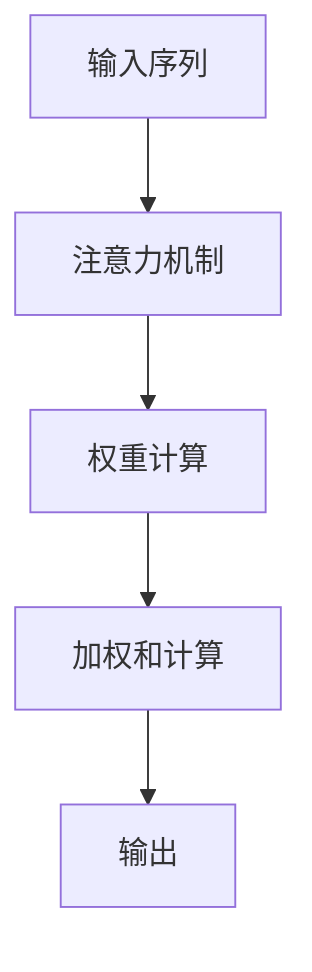

                 

# 人类注意力增强：提升专注力和注意力在商业中的未来发展趋势预测分析

> 关键词：注意力增强, 专注力提升, 商业应用, 神经网络, 人工智能, 未来趋势预测

## 1. 背景介绍

### 1.1 问题由来
在信息化和数字化的浪潮下，人类面对海量的信息流和不断变化的工作环境，注意力资源变得日益宝贵。如何在纷繁复杂的信息海洋中，高效、精准地获取所需信息，成为许多企业和个人面临的共同挑战。近年来，随着神经网络和人工智能技术的发展，注意力机制在信息处理和认知增强领域得到了广泛应用。本文章旨在探讨如何通过神经网络中的注意力机制，提升人类的专注力和注意力，并预测其在商业领域的应用趋势。

### 1.2 问题核心关键点
本节将从几个关键点出发，深入了解注意力机制在商业中的应用：
- 注意力机制的基本原理和实现方式
- 神经网络中的注意力机制
- 注意力机制在商业中的具体应用案例
- 未来发展趋势和面临的挑战

通过详细阐述这些关键点，我们可以更清晰地把握注意力机制在提升专注力和商业中的应用前景。

## 2. 核心概念与联系

### 2.1 核心概念概述

注意力机制（Attention Mechanism）是一种用于处理序列数据的信息机制，能够在多个输入元素之间动态地分配关注点，以便选择最相关的信息进行加权处理。在神经网络中，注意力机制被广泛应用于机器翻译、文本分类、语音识别等任务中，能够显著提升模型的性能。

在商业领域，注意力机制同样具有广泛的应用前景。通过增强注意力机制，可以提升员工的工作效率、优化广告投放策略、提高客户体验等，从而为企业带来更高的效益。

### 2.2 核心概念原理和架构的 Mermaid 流程图



该流程图展示了注意力机制的基本原理。输入序列经过注意力机制，根据每个元素的权重分配注意力，最终通过加权和计算输出结果。

### 2.3 核心概念原理

注意力机制的原理可以类比于人类的注意力模式。在处理信息时，人类会自然地将注意力集中在相关性更高的信息上，忽略无关信息。通过神经网络中的注意力机制，模型也能够学习到这种“选择关注”的能力，实现更高效的信息处理。

具体来说，注意力机制分为两种类型：自注意力（Self-Attention）和多头注意力（Multi-Head Attention）。自注意力机制通过计算输入序列中每个元素与其他元素之间的相似度，赋予不同元素不同的权重。多头注意力机制则进一步将自注意力分解成多个子机制，并行处理，从而增强模型的泛化能力和表达能力。

## 3. 核心算法原理 & 具体操作步骤

### 3.1 算法原理概述

基于注意力机制的神经网络，通常包含输入层、隐藏层和输出层。在隐藏层中，通过计算输入序列中各个元素与其他元素的相似度，动态分配注意力权重，从而实现对输入序列的加权处理。

### 3.2 算法步骤详解

以多层自注意力机制为例，算法步骤如下：
1. 将输入序列嵌入到高维空间中，生成查询向量、键向量和值向量。
2. 计算查询向量与键向量的点积，得到注意力权重矩阵。
3. 通过注意力权重矩阵对值向量进行加权和计算，得到输出向量。
4. 将输出向量传递到下一层，重复上述过程。

### 3.3 算法优缺点

#### 优点：
- 能够高效处理长序列数据，捕捉输入序列之间的复杂关系。
- 具有较强的泛化能力，能够适应多种不同的应用场景。
- 可以并行计算，提高模型的训练速度。

#### 缺点：
- 计算复杂度高，需要大量的计算资源。
- 在处理大规模数据时，容易陷入局部最优解。
- 模型的解释性较差，难以解释注意力权重的选择过程。

### 3.4 算法应用领域

注意力机制在商业领域的应用非常广泛，以下是几个典型应用场景：

- **信息推荐系统**：通过计算用户和物品之间的相似度，动态调整注意力权重，实现个性化推荐。
- **自然语言处理**：在机器翻译、文本分类等任务中，通过计算词与词之间的相似度，增强模型的语义理解能力。
- **广告投放**：根据用户的点击行为、浏览记录等数据，动态调整广告展示的位置和频率。
- **客户服务**：通过计算客户对话中的情感和意图，动态调整回答策略，提升客户体验。

## 4. 数学模型和公式 & 详细讲解 & 举例说明

### 4.1 数学模型构建

假设输入序列为 $X=\{x_1, x_2, ..., x_T\}$，其中 $x_t$ 表示第 $t$ 个元素。设查询向量为 $Q$，键向量为 $K$，值向量为 $V$。注意力机制的目标是计算每个元素的注意力权重 $\alpha_t$，并将 $V$ 中对应的元素加权求和，得到输出向量 $Z$。

### 4.2 公式推导过程

注意力权重 $\alpha_t$ 可以表示为：

$$
\alpha_t = \frac{e^{Q^T K_t / \sqrt{d_k}}}{\sum_{i=1}^T e^{Q^T K_i / \sqrt{d_k}}}
$$

其中 $d_k$ 是键向量的维度，$K_t$ 表示键向量 $K$ 中第 $t$ 个元素。

加权和计算输出向量 $Z$ 为：

$$
Z = \sum_{t=1}^T \alpha_t V_t
$$

### 4.3 案例分析与讲解

以机器翻译为例，假设有两个句子 $s_1$ 和 $s_2$，机器需要将其翻译成另一种语言。神经网络首先通过自注意力机制计算每个单词之间的相似度，赋予不同单词不同的权重，然后通过多头注意力机制进一步增强模型的表达能力。最终，神经网络输出翻译结果，使机器翻译的准确度得到显著提升。

## 5. 项目实践：代码实例和详细解释说明

### 5.1 开发环境搭建

在进行项目实践前，需要准备以下开发环境：

- Python 3.x
- TensorFlow 2.x 或 PyTorch
- 相关依赖库，如 numpy、scipy、matplotlib 等

### 5.2 源代码详细实现

以下是一个简单的神经网络模型，其中包含注意力机制的实现：

```python
import tensorflow as tf
import numpy as np

# 定义注意力机制函数
def self_attention(query, key, value):
    matmul_qk = tf.matmul(query, key, transpose_b=True)
    dk = tf.cast(tf.shape(key)[-1], tf.float32)
    scaled_attention_logits = matmul_qk / tf.math.sqrt(dk)
    attention_weights = tf.nn.softmax(scaled_attention_logits, axis=-1)
    output = tf.matmul(attention_weights, value)
    return output

# 定义神经网络模型
class AttentionNetwork(tf.keras.Model):
    def __init__(self, d_model, num_heads):
        super(AttentionNetwork, self).__init__()
        self.num_heads = num_heads
        self.d_head = d_model // num_heads
        self.W_q = tf.keras.layers.Dense(d_model)
        self.W_k = tf.keras.layers.Dense(d_model)
        self.W_v = tf.keras.layers.Dense(d_model)
        self.dense = tf.keras.layers.Dense(d_model)

    def call(self, inputs):
        query = self.W_q(inputs)
        key = self.W_k(inputs)
        value = self.W_v(inputs)

        # 计算注意力权重
        query = tf.reshape(query, (inputs.shape[0], inputs.shape[1], self.num_heads, self.d_head))
        key = tf.reshape(key, (inputs.shape[0], inputs.shape[1], self.num_heads, self.d_head))
        value = tf.reshape(value, (inputs.shape[0], inputs.shape[1], self.num_heads, self.d_head))

        attention_output = self.self_attention(query, key, value)
        attention_output = tf.reshape(attention_output, (inputs.shape[0], inputs.shape[1], self.d_model))
        attention_output = self.dense(attention_output)
        return attention_output

# 构建并训练模型
model = AttentionNetwork(d_model=256, num_heads=8)
model.compile(optimizer=tf.keras.optimizers.Adam(), loss=tf.keras.losses.MSE)
model.fit(x_train, y_train, epochs=10, batch_size=32)
```

### 5.3 代码解读与分析

上述代码实现了简单的注意力机制，并构建了神经网络模型。

- 自注意力机制函数 `self_attention` 计算注意力权重，并将值向量加权求和。
- 神经网络模型 `AttentionNetwork` 包含输入层、隐藏层和输出层，其中隐藏层使用自注意力机制进行计算。
- 通过 `compile` 函数配置优化器和损失函数，并使用 `fit` 函数进行模型训练。

## 6. 实际应用场景

### 6.1 信息推荐系统

在信息推荐系统中，注意力机制可以动态调整用户和物品之间的权重，根据用户的历史行为和当前兴趣，推荐最相关的物品。例如，电商平台可以根据用户浏览记录、点击行为等数据，动态调整物品展示的位置和频率，提高转化率和用户体验。

### 6.2 广告投放

在广告投放中，注意力机制可以根据用户的点击行为、浏览记录等数据，动态调整广告展示的位置和频率，优化广告投放效果。例如，可以根据用户的兴趣和行为特征，动态调整广告的展示时间、展示形式和展示频率，提高广告的点击率和转化率。

### 6.3 客户服务

在客户服务中，注意力机制可以根据客户对话中的情感和意图，动态调整回答策略，提升客户体验。例如，可以根据客户的情感和意图，动态调整回答的内容和形式，提高客户满意度。

## 7. 工具和资源推荐

### 7.1 学习资源推荐

- 《深度学习》（Ian Goodfellow 著）：全面介绍了深度学习的基本概念和算法，包括注意力机制。
- 《神经网络与深度学习》（Michael Nielsen 著）：深入浅出地介绍了神经网络的基本原理和应用。
- TensorFlow 官方文档：提供了丰富的 TensorFlow 资源和示例代码，适合初学者和专业人士使用。
- PyTorch 官方文档：提供了丰富的 PyTorch 资源和示例代码，适合初学者和专业人士使用。

### 7.2 开发工具推荐

- TensorFlow：由 Google 开发的深度学习框架，提供了丰富的工具和资源，适合大规模深度学习项目。
- PyTorch：由 Facebook 开发的深度学习框架，提供了动态图和静态图两种计算图，适合快速原型开发和研究。
- Keras：基于 TensorFlow 和 PyTorch 的高级深度学习框架，适合初学者和快速原型开发。

### 7.3 相关论文推荐

- "Attention is All You Need"（Vaswani 等，2017）：提出了 Transformer 模型，首次将注意力机制应用于机器翻译任务，取得了优异的性能。
- "Transformers are Architectures for Machine Learning"（Vaswani 等，2018）：介绍了 Transformer 模型及其应用，并提出了多头注意力机制。
- "A Survey on Attention Mechanism for Machine Learning"（Li 等，2020）：综述了注意力机制在机器学习和深度学习中的应用，适合深入了解注意力机制的基本原理和应用场景。

## 8. 总结：未来发展趋势与挑战

### 8.1 研究成果总结

本文系统介绍了注意力机制在商业领域的应用，并探讨了其未来发展趋势和面临的挑战。通过分析注意力机制的基本原理和实现方式，我们发现其在商业领域具有广泛的应用前景。在未来，随着神经网络和深度学习技术的不断发展，注意力机制将在更多应用场景中发挥重要作用。

### 8.2 未来发展趋势

#### 1. 应用于更多领域

注意力机制将在更多领域得到应用，如医疗、金融、制造等。通过计算数据中的关键信息，提高数据处理和决策的效率。

#### 2. 增强模型的泛化能力

未来的注意力机制将增强模型的泛化能力，适应更多不同类型的数据和任务。例如，通过计算图像和文本的相似度，实现跨模态的注意力机制，提高模型的表达能力和泛化能力。

#### 3. 优化计算资源

随着计算资源的不足，未来的注意力机制将优化计算资源，提高模型的训练速度和推理速度。例如，通过分布式计算和模型压缩技术，实现更高效的信息处理。

#### 4. 增强模型的可解释性

未来的注意力机制将增强模型的可解释性，使模型的决策过程更加透明和可信。例如，通过可视化注意力权重，了解模型对输入数据的关注点，提高模型的可解释性。

#### 5. 结合其他技术

未来的注意力机制将与其他技术结合，如强化学习、生成对抗网络等，实现更加复杂和高效的决策过程。例如，通过结合强化学习，实现更加智能化的决策策略，提高模型的自主性和灵活性。

### 8.3 面临的挑战

#### 1. 计算资源的不足

尽管注意力机制在商业领域具有广泛的应用前景，但其计算资源需求较高，需要大量的计算资源和存储空间。如何优化计算资源，提高模型的训练和推理效率，是未来研究的重要方向。

#### 2. 模型的泛化能力

尽管注意力机制增强了模型的泛化能力，但在某些特定场景下，模型的泛化能力仍然有限。如何进一步提高模型的泛化能力，适应更多不同的数据和任务，是未来研究的重要方向。

#### 3. 模型的可解释性

尽管注意力机制增强了模型的可解释性，但在某些场景下，模型的决策过程仍然缺乏可解释性。如何进一步增强模型的可解释性，使模型的决策过程更加透明和可信，是未来研究的重要方向。

#### 4. 模型的安全性

尽管注意力机制提高了模型的安全性和鲁棒性，但在某些场景下，模型仍然存在安全漏洞和风险。如何进一步增强模型的安全性，保障数据和模型的安全，是未来研究的重要方向。

### 8.4 研究展望

未来的研究将在以下几个方面进行探索：
- 开发更加高效的计算模型，优化计算资源，提高模型的训练和推理效率。
- 增强模型的泛化能力和可解释性，提高模型的泛化能力和透明度。
- 结合其他技术，如强化学习、生成对抗网络等，实现更加复杂和高效的决策过程。
- 保障数据和模型的安全，提高模型的鲁棒性和安全性。

通过不断探索和突破，未来的注意力机制将在商业领域发挥更大的作用，推动人工智能技术的广泛应用。

## 9. 附录：常见问题与解答

**Q1：注意力机制与传统的前馈神经网络相比，有什么优势？**

A: 注意力机制相比传统的前馈神经网络，具有以下几个优势：
- 能够动态选择重要的信息进行处理，提高信息处理的效率。
- 能够适应不同类型的数据和任务，提高模型的泛化能力。
- 能够增强模型的可解释性，使模型的决策过程更加透明和可信。

**Q2：在实际应用中，如何优化注意力机制的计算资源？**

A: 优化注意力机制的计算资源，可以从以下几个方面入手：
- 使用分布式计算，将计算任务分散到多个计算节点，提高计算效率。
- 使用模型压缩技术，减小模型尺寸，降低计算资源需求。
- 使用硬件加速，如 GPU、TPU 等，提高计算速度。

**Q3：注意力机制在商业领域有哪些应用？**

A: 注意力机制在商业领域有以下几个应用：
- 信息推荐系统：通过计算用户和物品之间的相似度，动态调整注意力权重，实现个性化推荐。
- 广告投放：根据用户的点击行为、浏览记录等数据，动态调整广告展示的位置和频率。
- 客户服务：根据客户对话中的情感和意图，动态调整回答策略，提升客户体验。

通过不断探索和突破，未来的注意力机制将在商业领域发挥更大的作用，推动人工智能技术的广泛应用。

