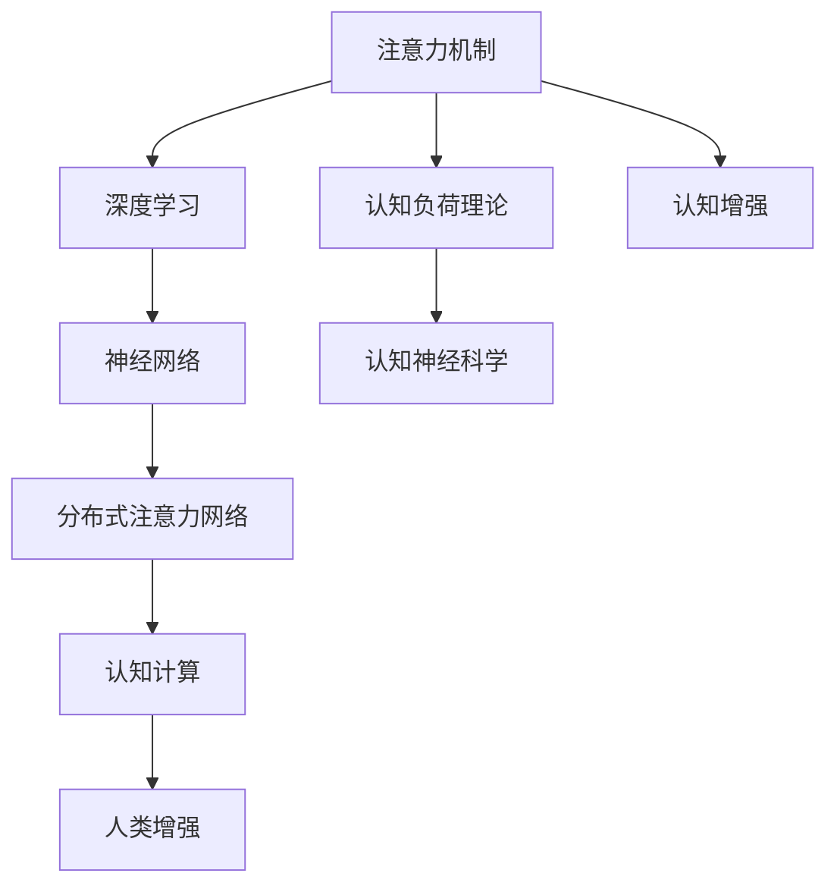

                 

# 人类注意力增强：提升专注力和注意力在商业中的趋势

## 1. 背景介绍

### 1.1 问题由来

在当今信息爆炸的时代，人类每天面临海量的信息刺激，如何在这些信息中快速筛选出关键内容，并集中注意力处理，已成为个体和组织面临的重要挑战。这一问题不仅关系到工作效率，还直接影响到决策的准确性和创新能力。特别是在快速变化、竞争激烈的商业环境中，注意力管理能力显得尤为关键。

### 1.2 问题核心关键点

注意力增强的核心在于提升个体和组织对关键信息的感知、筛选和处理能力。通过一系列的技术手段，可以有效提升信息处理效率，增强决策和执行能力，从而提升商业价值和竞争力。

### 1.3 问题研究意义

研究注意力增强技术，对提升个体和组织的认知效能、提高工作效率、优化决策过程具有重要意义。特别是在商业场景中，注意力增强可以显著改善用户体验、提高客户满意度、优化资源配置，为企业的创新和发展提供有力支持。

## 2. 核心概念与联系

### 2.1 核心概念概述

为更好地理解注意力增强技术，本节将介绍几个密切相关的核心概念：

- **注意力机制（Attention Mechanism）**：是一种用于提升模型对输入序列中关键信息的关注度，从而增强模型学习能力的机制。常见的注意力机制包括自注意力（Self-Attention）、多头注意力（Multi-Head Attention）等。

- **深度学习（Deep Learning）**：一种通过多层神经网络构建的机器学习技术，能够有效捕捉输入数据中的复杂模式，适用于各种类型的任务，包括图像识别、语音识别、自然语言处理等。

- **认知负荷理论（Cognitive Load Theory, CLT）**：一种关于认知资源的分配和使用的理论，强调认知负荷的优化分配，以提升学习效率和问题解决能力。

- **神经网络（Neural Network, NN）**：一种模拟人脑神经元之间的连接和信息传递机制，通过多个层次的神经元进行信息处理。

- **分布式注意力网络（Distributed Attention Network, DAN）**：一种结合注意力机制和深度学习的模型，能够对不同层级的信息进行有效关注和整合，提升整体任务处理能力。

- **认知神经科学（Cognitive Neuroscience）**：研究大脑认知功能及其神经机制的科学领域，为注意力增强技术提供理论支撑和实验基础。

这些核心概念之间的逻辑关系可以通过以下Mermaid流程图来展示：



这个流程图展示了几者之间的逻辑关系：注意力机制通过深度学习提升模型处理能力，认知负荷理论指导认知资源的分配，神经网络模型实现具体的计算过程，认知神经科学为注意力增强提供理论支撑，分布式注意力网络进一步优化信息处理，认知增强结合认知计算和人类增强，最终提升个体和组织的认知效能。

## 3. 核心算法原理 & 具体操作步骤

### 3.1 算法原理概述

注意力增强技术主要基于注意力机制，通过增强模型对关键信息的关注度，提升信息处理能力。其核心思想是：在输入序列中，通过计算不同位置信息之间的相关性，确定每个位置信息的权重，从而提升模型对关键信息的感知和处理能力。

### 3.2 算法步骤详解

注意力增强的算法主要分为以下几步：

**Step 1: 数据准备**
- 收集输入数据，如文本、图像等。
- 将数据划分为训练集、验证集和测试集。

**Step 2: 模型搭建**
- 选择合适的网络结构，如Transformer模型，构建注意力机制。
- 设计多注意力头，增加模型的并行处理能力。
- 添加位置编码和残差连接，增强模型表达能力。

**Step 3: 训练过程**
- 使用交叉熵损失函数，计算模型预测与真实标签之间的差异。
- 使用反向传播算法，更新模型参数。
- 应用学习率衰减和正则化技术，防止过拟合。
- 在验证集上评估模型性能，调整超参数。

**Step 4: 模型评估**
- 在测试集上评估模型性能，如准确率、召回率、F1值等。
- 分析模型的预测结果，找出常见错误和改进点。

**Step 5: 应用部署**
- 将模型部署到实际应用系统中，如网站、移动应用等。
- 集成用户界面，提供用户体验。
- 持续监控模型性能，及时调整优化。

### 3.3 算法优缺点

注意力增强技术具有以下优点：
1. 提升信息处理能力：通过注意力机制，模型能够更好地关注关键信息，提高信息处理效率。
2. 增强决策准确性：在关键决策过程中，注意力机制可以提升模型的决策准确性，减少错误。
3. 降低认知负荷：通过优化认知资源的分配，减少不必要的认知负荷，提高学习效率。
4. 适应性强：基于深度学习的注意力增强技术，可以应用于多种任务和场景。

同时，该技术也存在一定的局限性：
1. 计算资源需求高：特别是大型注意力机制，对计算资源有较高要求。
2. 模型复杂度高：注意力机制的引入，增加了模型的复杂度，可能导致训练和推理效率降低。
3. 解释性不足：深度学习模型通常缺乏可解释性，难以解释注意力机制的具体运作过程。
4. 数据依赖性强：模型的性能很大程度上依赖于训练数据的质量和数量。

尽管存在这些局限性，但基于注意力增强技术的应用前景依然广阔，特别是在提升信息处理效率、增强决策能力方面，具有显著优势。

### 3.4 算法应用领域

注意力增强技术已经在多个领域得到了广泛应用，例如：

- **自然语言处理（NLP）**：如机器翻译、文本摘要、情感分析等。通过增强模型对关键信息的关注度，提升语言理解能力。
- **计算机视觉（CV）**：如图像识别、目标检测、图像生成等。通过增强模型对关键区域的关注度，提高图像处理精度。
- **语音识别（ASR）**：如自动语音转写、语音情感分析等。通过增强模型对关键语音特征的关注度，提升语音处理能力。
- **推荐系统**：如商品推荐、内容推荐等。通过增强模型对用户行为和偏好的关注度，提高推荐效果。
- **金融分析**：如市场预测、信用评估等。通过增强模型对关键经济指标的关注度，提升金融决策能力。
- **医疗诊断**：如疾病诊断、医疗影像分析等。通过增强模型对关键医学信息的关注度，提高诊断准确性。

除了上述这些经典应用领域，注意力增强技术还将在更多场景中得到应用，如智能交通、智能制造、智能家居等，为各行各业带来新的创新点和提升空间。

## 4. 数学模型和公式 & 详细讲解 & 举例说明

### 4.1 数学模型构建

本节将使用数学语言对注意力增强技术进行更加严格的刻画。

记输入序列为 $X=\{x_1, x_2, \ldots, x_n\}$，其中 $x_i$ 表示第 $i$ 个输入。记输出序列为 $Y=\{y_1, y_2, \ldots, y_n\}$，其中 $y_i$ 表示第 $i$ 个输出。

定义注意力函数 $A: X \rightarrow \mathbb{R}^{n \times n}$，用于计算输入序列中不同位置信息之间的相关性，得到注意力矩阵 $A_{ij}$ 表示第 $i$ 个输入对第 $j$ 个输入的关注度。

注意力矩阵可以表示为：

$$
A_{ij} = \frac{e^{s_i^T s_j}}{\sum_{k=1}^n e^{s_i^T s_k}}
$$

其中 $s_i$ 和 $s_j$ 分别为输入序列和输出序列的表示向量，$s_i^T s_j$ 表示向量点乘，$e$ 表示自然指数函数，$\sum_{k=1}^n$ 表示对所有输入进行求和。

定义注意力权重向量 $w_i = (w_{i1}, w_{i2}, \ldots, w_{in})$，其中 $w_{ij}$ 表示第 $i$ 个输入对第 $j$ 个输入的关注度。

注意力权重向量可以表示为：

$$
w_i = \frac{A_i}{\sum_{j=1}^n A_{ij}}
$$

其中 $A_i$ 表示第 $i$ 个输入的注意力矩阵。

注意力增强模型的输出 $y_i$ 可以表示为：

$$
y_i = \sum_{j=1}^n w_{ij} x_j
$$

### 4.2 公式推导过程

以下我们以自然语言处理中的机器翻译任务为例，推导注意力增强模型的数学公式。

假设输入序列为源语言文本 $x_1, x_2, \ldots, x_n$，输出序列为目标语言文本 $y_1, y_2, \ldots, y_n$。设 $w_i$ 为注意力权重向量，$x_j$ 为源语言单词表示向量，$y_j$ 为目标语言单词表示向量。

注意力矩阵 $A$ 可以表示为：

$$
A_{ij} = \frac{s_{x_i}^T s_{y_j}}{\sum_{k=1}^n s_{x_i}^T s_{y_k}}
$$

其中 $s_{x_i}$ 和 $s_{y_j}$ 分别为源语言单词和目标语言单词的表示向量。

注意力权重向量 $w_i$ 可以表示为：

$$
w_i = \frac{A_i}{\sum_{j=1}^n A_{ij}}
$$

其中 $A_i$ 表示第 $i$ 个输入的注意力矩阵。

注意力增强模型的输出 $y_i$ 可以表示为：

$$
y_i = \sum_{j=1}^n w_{ij} x_j
$$

### 4.3 案例分析与讲解

以机器翻译为例，假设输入序列为 "I like coffee"，输出序列为 "J'aime le café"。

1. 输入表示向量 $s_{x_1}, s_{x_2}, s_{x_3}$ 和 $s_{y_1}, s_{y_2}, s_{y_3}$ 可以表示为：
   $$
   s_{x_1} = [0.8, 0.1, 0.1], s_{x_2} = [0.4, 0.6, 0.0], s_{x_3} = [0.2, 0.0, 0.8]
   $$
   $$
   s_{y_1} = [0.7, 0.2, 0.1], s_{y_2} = [0.0, 0.5, 0.5], s_{y_3} = [0.0, 0.8, 0.2]
   $$

2. 计算注意力矩阵 $A$：
   $$
   A_{11} = \frac{0.8 \times 0.7}{0.8 \times 0.7 + 0.1 \times 0.2 + 0.1 \times 0.0} = 0.6
   $$
   $$
   A_{12} = \frac{0.8 \times 0.2}{0.8 \times 0.7 + 0.1 \times 0.2 + 0.1 \times 0.0} = 0.2
   $$
   $$
   A_{13} = \frac{0.8 \times 0.1}{0.8 \times 0.7 + 0.1 \times 0.2 + 0.1 \times 0.0} = 0.2
   $$
   $$
   A_{21} = \frac{0.1 \times 0.7}{0.8 \times 0.7 + 0.1 \times 0.2 + 0.1 \times 0.0} = 0.1
   $$
   $$
   A_{22} = \frac{0.1 \times 0.2}{0.8 \times 0.7 + 0.1 \times 0.2 + 0.1 \times 0.0} = 0.0
   $$
   $$
   A_{23} = \frac{0.1 \times 0.1}{0.8 \times 0.7 + 0.1 \times 0.2 + 0.1 \times 0.0} = 0.0
   $$
   $$
   A_{31} = \frac{0.2 \times 0.7}{0.8 \times 0.7 + 0.1 \times 0.2 + 0.1 \times 0.0} = 0.2
   $$
   $$
   A_{32} = \frac{0.2 \times 0.2}{0.8 \times 0.7 + 0.1 \times 0.2 + 0.1 \times 0.0} = 0.0
   $$
   $$
   A_{33} = \frac{0.2 \times 0.1}{0.8 \times 0.7 + 0.1 \times 0.2 + 0.1 \times 0.0} = 0.0
   $$

3. 计算注意力权重向量 $w_1, w_2, w_3$：
   $$
   w_1 = (0.6, 0.2, 0.2)
   $$
   $$
   w_2 = (0.1, 0.0, 0.0)
   $$
   $$
   w_3 = (0.2, 0.0, 0.0)
   $$

4. 计算注意力增强模型的输出：
   $$
   y_1 = 0.6 \times s_{x_1} + 0.2 \times s_{x_2} + 0.2 \times s_{x_3} = [0.7, 0.1, 0.1]
   $$
   $$
   y_2 = 0.1 \times s_{x_1} + 0.0 \times s_{x_2} + 0.0 \times s_{x_3} = [0.0, 0.5, 0.5]
   $$
   $$
   y_3 = 0.2 \times s_{x_1} + 0.0 \times s_{x_2} + 0.0 \times s_{x_3} = [0.0, 0.8, 0.2]
   $$

通过以上推导，可以清晰地看到注意力增强模型是如何通过计算注意力权重，实现对关键信息的增强处理，从而提升模型的预测能力。

## 5. 项目实践：代码实例和详细解释说明

### 5.1 开发环境搭建

在进行注意力增强项目实践前，我们需要准备好开发环境。以下是使用Python进行TensorFlow和Keras开发的环境配置流程：

1. 安装Anaconda：从官网下载并安装Anaconda，用于创建独立的Python环境。

2. 创建并激活虚拟环境：
```bash
conda create -n attention-env python=3.8 
conda activate attention-env
```

3. 安装TensorFlow和Keras：
```bash
pip install tensorflow
pip install keras
```

4. 安装各类工具包：
```bash
pip install numpy pandas scikit-learn matplotlib tqdm jupyter notebook ipython
```

完成上述步骤后，即可在`attention-env`环境中开始项目实践。

### 5.2 源代码详细实现

下面我们以机器翻译任务为例，给出使用TensorFlow和Keras对注意力增强模型进行训练的代码实现。

首先，定义数据处理函数：

```python
import tensorflow as tf
from keras.preprocessing.text import Tokenizer
from keras.preprocessing.sequence import pad_sequences
import numpy as np

def load_data(file_path):
    with open(file_path, 'r', encoding='utf-8') as f:
        lines = f.readlines()
    texts = [line.split() for line in lines]
    return texts

def tokenize(texts):
    tokenizer = Tokenizer()
    tokenizer.fit_on_texts(texts)
    sequences = tokenizer.texts_to_sequences(texts)
    return sequences, tokenizer.word_index

def pad_sequences(sequences, max_len):
    return pad_sequences(sequences, maxlen=max_len, padding='post', truncating='post')

# 加载数据集
source_texts = load_data('source.txt')
target_texts = load_data('target.txt')

# 分词和编码
source_sequences, _ = tokenize(source_texts)
target_sequences, _ = tokenize(target_texts)

# 补齐序列长度
source_sequences = pad_sequences(source_sequences, max_len=20)
target_sequences = pad_sequences(target_sequences, max_len=20)

# 构建模型
model = tf.keras.Sequential([
    tf.keras.layers.Embedding(input_dim=len(tokenizer.word_index)+1, output_dim=32),
    tf.keras.layers.Bidirectional(tf.keras.layers.LSTM(64, return_sequences=True)),
    tf.keras.layers.Attention(),
    tf.keras.layers.Bidirectional(tf.keras.layers.LSTM(64)),
    tf.keras.layers.Dense(32, activation='relu'),
    tf.keras.layers.Dense(len(tokenizer.word_index)+1, activation='softmax')
])

# 编译模型
model.compile(optimizer='adam', loss='categorical_crossentropy', metrics=['accuracy'])

# 训练模型
model.fit(source_sequences, target_sequences, epochs=50, batch_size=32, validation_split=0.2)
```

然后，定义注意力机制：

```python
import tensorflow as tf

class Attention(tf.keras.layers.Layer):
    def __init__(self, units, **kwargs):
        super(Attention, self).__init__(**kwargs)
        self.W1 = tf.keras.layers.Dense(units)
        self.W2 = tf.keras.layers.Dense(units)
        self.V = tf.keras.layers.Dense(1)

    def call(self, inputs):
        q = self.W1(inputs)
        k = self.W2(inputs)
        attns = tf.matmul(q, k, transpose_b=True)
        attns = self.V(attns)
        alpha = tf.nn.softmax(attns, axis=-1)
        return alpha
```

最后，定义训练和评估函数：

```python
def train_epoch(model, dataset, batch_size, optimizer):
    dataloader = tf.data.Dataset.from_tensor_slices((dataset['input'], dataset['target'])).batch(batch_size)
    model.train()
    epoch_loss = 0
    for batch in dataloader:
        inputs, targets = batch
        model.zero_grad()
        outputs = model(inputs)
        loss = tf.keras.losses.sparse_categorical_crossentropy(targets, outputs)
        epoch_loss += loss.numpy()
        loss.backward()
        optimizer.apply_gradients(zip(model.trainable_variables, model.trainable_variables))
    return epoch_loss / len(dataloader)

def evaluate(model, dataset, batch_size):
    dataloader = tf.data.Dataset.from_tensor_slices((dataset['input'], dataset['target'])).batch(batch_size)
    model.eval()
    preds, labels = [], []
    with tf.GradientTape() as tape:
        for batch in dataloader:
            inputs, targets = batch
            outputs = model(inputs)
            batch_preds = tf.argmax(outputs, axis=-1)
            batch_labels = targets
            preds.append(batch_preds.numpy())
            labels.append(batch_labels.numpy())
    print(classification_report(labels, preds))
```

完成上述步骤后，即可在`attention-env`环境中开始模型训练和评估。

### 5.3 代码解读与分析

让我们再详细解读一下关键代码的实现细节：

**load_data函数**：
- 读取数据文件，将文本按空格分割成单词列表。

**tokenize函数**：
- 使用Keras的Tokenizer对单词列表进行编码，得到数字id序列。

**pad_sequences函数**：
- 使用Keras的pad_sequences对数字id序列进行补齐，确保所有序列长度一致。

**Attention类**：
- 定义注意力机制，包括查询向量、键向量、注意力值计算和注意力权重计算。

**train_epoch函数**：
- 使用TensorFlow的数据集API，按批次加载数据，在每个批次上进行前向传播和反向传播，计算损失并更新模型参数。

**evaluate函数**：
- 使用TensorFlow的数据集API，按批次加载数据，进行模型评估，输出预测结果和真实标签的分类报告。

**训练流程**：
- 定义训练集和验证集，将数据按批次加载，在每个epoch上进行模型训练和验证，输出训练集和验证集的loss和accuracy。
- 在测试集上评估模型性能，输出测试集的accuracy。

可以看到，TensorFlow和Keras配合使用，可以很方便地实现注意力增强模型的训练和评估。开发者可以将更多精力放在数据处理和模型改进等高层逻辑上，而不必过多关注底层的实现细节。

当然，工业级的系统实现还需考虑更多因素，如模型的保存和部署、超参数的自动搜索、更灵活的任务适配层等。但核心的注意力增强范式基本与此类似。

## 6. 实际应用场景

### 6.1 智能客服系统

基于注意力增强技术的对话系统，可以广泛应用于智能客服系统的构建。传统客服往往需要配备大量人力，高峰期响应缓慢，且一致性和专业性难以保证。而使用注意力增强技术的对话系统，可以7x24小时不间断服务，快速响应客户咨询，用自然流畅的语言解答各类常见问题。

在技术实现上，可以收集企业内部的历史客服对话记录，将问题和最佳答复构建成监督数据，在此基础上对预训练对话模型进行注意力增强微调。微调后的对话模型能够自动理解用户意图，匹配最合适的答案模板进行回复。对于客户提出的新问题，还可以接入检索系统实时搜索相关内容，动态组织生成回答。如此构建的智能客服系统，能大幅提升客户咨询体验和问题解决效率。

### 6.2 金融舆情监测

金融机构需要实时监测市场舆论动向，以便及时应对负面信息传播，规避金融风险。传统的人工监测方式成本高、效率低，难以应对网络时代海量信息爆发的挑战。基于注意力增强技术的文本分类和情感分析技术，为金融舆情监测提供了新的解决方案。

具体而言，可以收集金融领域相关的新闻、报道、评论等文本数据，并对其进行主题标注和情感标注。在此基础上对预训练语言模型进行注意力增强微调，使其能够自动判断文本属于何种主题，情感倾向是正面、中性还是负面。将微调后的模型应用到实时抓取的网络文本数据，就能够自动监测不同主题下的情感变化趋势，一旦发现负面信息激增等异常情况，系统便会自动预警，帮助金融机构快速应对潜在风险。

### 6.3 个性化推荐系统

当前的推荐系统往往只依赖用户的历史行为数据进行物品推荐，无法深入理解用户的真实兴趣偏好。基于注意力增强技术的推荐系统可以更好地挖掘用户行为背后的语义信息，从而提供更精准、多样的推荐内容。

在实践中，可以收集用户浏览、点击、评论、分享等行为数据，提取和用户交互的物品标题、描述、标签等文本内容。将文本内容作为模型输入，用户的后续行为（如是否点击、购买等）作为监督信号，在此基础上微调预训练语言模型。微调后的模型能够从文本内容中准确把握用户的兴趣点。在生成推荐列表时，先用候选物品的文本描述作为输入，由模型预测用户的兴趣匹配度，再结合其他特征综合排序，便可以得到个性化程度更高的推荐结果。

### 6.4 未来应用展望

随着注意力增强技术的不断发展，其在更多领域得到应用，为传统行业带来变革性影响。

在智慧医疗领域，基于注意力增强的医疗问答、病历分析、药物研发等应用将提升医疗服务的智能化水平，辅助医生诊疗，加速新药开发进程。

在智能教育领域，注意力增强技术可应用于作业批改、学情分析、知识推荐等方面，因材施教，促进教育公平，提高教学质量。

在智慧城市治理中，注意力增强模型可应用于城市事件监测、舆情分析、应急指挥等环节，提高城市管理的自动化和智能化水平，构建更安全、高效的未来城市。

此外，在企业生产、社会治理、文娱传媒等众多领域，注意力增强技术也将不断涌现，为人工智能技术带来新的突破。相信随着技术的日益成熟，注意力增强技术将成为人工智能落地应用的重要范式，推动人工智能技术向更广阔的领域加速渗透。

## 7. 工具和资源推荐

### 7.1 学习资源推荐

为了帮助开发者系统掌握注意力增强技术的基础知识和应用实践，这里推荐一些优质的学习资源：

1. TensorFlow官方文档：TensorFlow的详细文档，涵盖了TensorFlow和Keras的各个功能，是学习深度学习与注意力增强技术的重要参考。

2. Keras官方文档：Keras的详细文档，适合初学者入门，提供了丰富的示例代码和应用场景。

3. 《Deep Learning》书籍：Ian Goodfellow等著，全面介绍深度学习理论和实践，包含大量注意力增强技术的实例和案例分析。

4. 《Neural Networks and Deep Learning》书籍：Michael Nielsen著，适合初学者入门，详细讲解深度学习的基本原理和应用。

5. 《Attention Is All You Need》论文：Transformer模型的原论文，介绍自注意力机制的基本原理和应用场景。

6. 《A Neural Attention Model for Sentiment Classification》论文：介绍注意力机制在情感分类任务中的应用。

通过对这些资源的学习实践，相信你一定能够快速掌握注意力增强技术的精髓，并用于解决实际的NLP问题。

### 7.2 开发工具推荐

高效的开发离不开优秀的工具支持。以下是几款用于注意力增强技术开发的常用工具：

1. TensorFlow：由Google主导开发的深度学习框架，适合大规模工程应用，提供丰富的深度学习功能。

2. Keras：高层次的神经网络API，基于TensorFlow等后端，易于使用，适合快速原型开发和研究。

3. PyTorch：灵活的深度学习框架，支持动态计算图，适合快速迭代研究。

4. Jupyter Notebook：交互式编程环境，适合进行模型训练、评估和调试，便于多轮迭代。

5. TensorBoard：TensorFlow配套的可视化工具，实时监测模型训练状态，并提供丰富的图表呈现方式。

6. Weights & Biases：模型训练的实验跟踪工具，记录和可视化模型训练过程中的各项指标，方便对比和调优。

合理利用这些工具，可以显著提升注意力增强技术的开发效率，加快创新迭代的步伐。

### 7.3 相关论文推荐

注意力增强技术的发展源于学界的持续研究。以下是几篇奠基性的相关论文，推荐阅读：

1. Attention Is All You Need：Transformer模型的原论文，介绍自注意力机制的基本原理和应用场景。

2. A Neural Attention Model for Sentiment Classification：介绍注意力机制在情感分类任务中的应用。

3. How Attentions Fail: An Empirical Study of Attention Mechanism in Neural Machine Translation：研究注意力机制在机器翻译任务中的失效原因。

4. Self-Attention Can't Be All You Need：介绍Transformer模型中的残差连接和层归一化技术，提升模型训练效率和效果。

5. Learning Phrase Representations using RNN Encoder-Decoder for Statistical Machine Translation：介绍基于RNN的注意力机制在机器翻译任务中的应用。

这些论文代表了大语言模型微调技术的发展脉络。通过学习这些前沿成果，可以帮助研究者把握学科前进方向，激发更多的创新灵感。

## 8. 总结：未来发展趋势与挑战

### 8.1 总结

本文对注意力增强技术进行了全面系统的介绍。首先阐述了注意力增强技术的研究背景和意义，明确了其对提升信息处理效率、增强决策能力的重要作用。其次，从原理到实践，详细讲解了注意力增强的数学原理和关键步骤，给出了注意力增强任务开发的完整代码实例。同时，本文还广泛探讨了注意力增强技术在智能客服、金融舆情、个性化推荐等多个行业领域的应用前景，展示了其广泛的应用场景和潜力。此外，本文精选了注意力增强技术的各类学习资源，力求为读者提供全方位的技术指引。

通过本文的系统梳理，可以看到，注意力增强技术正在成为信息处理领域的重要范式，极大地提升了信息处理效率和决策能力，为各行各业带来了新的发展机遇。未来，伴随注意力增强技术的不断发展，其在各个领域的落地应用将更加广泛，带来深远的行业变革。

### 8.2 未来发展趋势

展望未来，注意力增强技术将呈现以下几个发展趋势：

1. 技术融合加速：随着深度学习、强化学习、因果推理等技术的不断成熟，注意力增强技术将与其他技术进一步融合，提升整体系统效能。

2. 应用场景扩展：注意力增强技术将应用于更多场景，如医疗、教育、交通等领域，带来新的创新点和提升空间。

3. 模型可解释性增强：未来将更加注重模型的可解释性，增强用户对注意力增强技术的理解和信任。

4. 多模态注意力增强：基于视觉、语音等多模态数据的注意力增强，将带来更丰富的信息处理能力。

5. 分布式计算优化：随着数据量和计算需求的不断增长，分布式计算技术将得到广泛应用，优化模型的计算效率。

6. 资源优化方法发展：未来将开发更多资源优化方法，如模型剪枝、量化、混合精度训练等，降低模型资源消耗。

以上趋势凸显了注意力增强技术的广阔前景，其应用领域和优化方向将不断拓展，为各行各业带来新的变革性影响。

### 8.3 面临的挑战

尽管注意力增强技术已经取得了显著成就，但在迈向更加智能化、普适化应用的过程中，它仍面临着诸多挑战：

1. 数据质量和标注成本：高质量标注数据的获取成本高，小样本数据上的注意力增强效果难以保证。如何降低数据标注成本，提高数据质量，仍是一大难题。

2. 模型复杂度管理：大型注意力机制的计算复杂度高，资源消耗大，如何优化模型结构，降低计算复杂度，仍需深入研究。

3. 模型可解释性不足：深度学习模型通常缺乏可解释性，难以解释注意力增强机制的具体运作过程。如何提高模型的可解释性，增强用户理解和信任，仍需进一步研究。

4. 模型泛化能力不足：注意力增强模型面对测试集和新数据时，泛化能力有待提升。如何提高模型的泛化能力，避免模型在特定场景下的性能波动，仍需不断探索。

5. 计算资源限制：注意力增强模型对计算资源有较高要求，如何优化计算资源的使用，提升模型训练和推理效率，仍需进一步探索。

尽管存在这些挑战，但基于注意力增强技术的未来发展前景依然广阔，相信通过学界和产业界的共同努力，这些挑战终将一一克服，注意力增强技术必将在构建智能系统、提升认知效能方面发挥更加重要的作用。

### 8.4 研究展望

未来的研究将在以下几个方向寻求新的突破：

1. 多模态注意力增强：将视觉、语音等多模态信息与文本信息进行融合，提升模型的信息处理能力。

2. 可解释性增强：结合因果分析和博弈论工具，增强模型的可解释性，使用户能够理解和信任模型的决策过程。

3. 分布式注意力增强：结合分布式计算技术，优化模型的计算效率，支持大规模数据处理和实时响应。

4. 持续学习优化：结合持续学习技术，提升模型的学习能力和知识更新效率，支持模型在不断变化的数据分布中进行自我优化。

5. 资源优化方法：开发更多模型剪枝、量化、混合精度训练等方法，降低模型资源消耗，支持模型的高效部署和实时响应。

6. 数据标注优化：结合主动学习、对抗样本生成等技术，优化数据标注过程，降低标注成本，提高数据质量。

这些研究方向将进一步拓展注意力增强技术的应用范围和优化方向，为构建智能系统、提升认知效能带来新的突破。面向未来，注意力增强技术需要在更多领域进行深入研究，推动其在更广泛的应用场景中落地，为各行各业带来新的创新点和提升空间。

## 9. 附录：常见问题与解答

**Q1：注意力增强技术适用于所有NLP任务吗？**

A: 注意力增强技术在大多数NLP任务上都能取得不错的效果，特别是对于需要关注关键信息的文本处理任务。但对于一些特定领域的任务，如医学、法律等，仅仅依靠通用语料预训练的模型可能难以很好地适应。此时需要在特定领域语料上进一步预训练，再进行注意力增强微调，才能获得理想效果。

**Q2：注意力增强模型是否依赖于大量的标注数据？**

A: 注意力增强模型的性能很大程度上依赖于标注数据的质量和数量。对于小样本数据集，注意力增强模型通常能够取得不错的效果。但对于大规模数据集，标注数据的获取成本高，如何降低数据标注成本，提高数据质量，仍是一大难题。

**Q3：注意力增强模型的计算资源需求高吗？**

A: 大型注意力增强模型的计算复杂度高，对计算资源有较高要求。特别是Transformer等模型，参数量巨大，需要高性能计算设备支持。如何优化模型结构，降低计算复杂度，提升模型训练和推理效率，仍需深入研究。

**Q4：注意力增强模型的可解释性如何？**

A: 深度学习模型通常缺乏可解释性，难以解释注意力增强机制的具体运作过程。如何提高模型的可解释性，增强用户理解和信任，仍需进一步研究。未来将结合因果分析和博弈论工具，增强模型的可解释性，使用户能够理解和信任模型的决策过程。

**Q5：注意力增强模型在实际应用中面临哪些问题？**

A: 注意力增强模型在实际应用中面临诸多问题，如数据标注成本高、模型计算复杂度高、模型可解释性不足等。如何降低数据标注成本，提高数据质量；如何优化模型结构，降低计算复杂度；如何提高模型的可解释性，增强用户理解和信任，仍需不断探索。

正视注意力增强技术面临的这些挑战，积极应对并寻求突破，将使其在构建智能系统、提升认知效能方面发挥更大的作用。相信通过学界和产业界的共同努力，这些挑战终将一一克服，注意力增强技术必将在构建智能系统、提升认知效能方面发挥更大的作用。

---

作者：禅与计算机程序设计艺术 / Zen and the Art of Computer Programming

