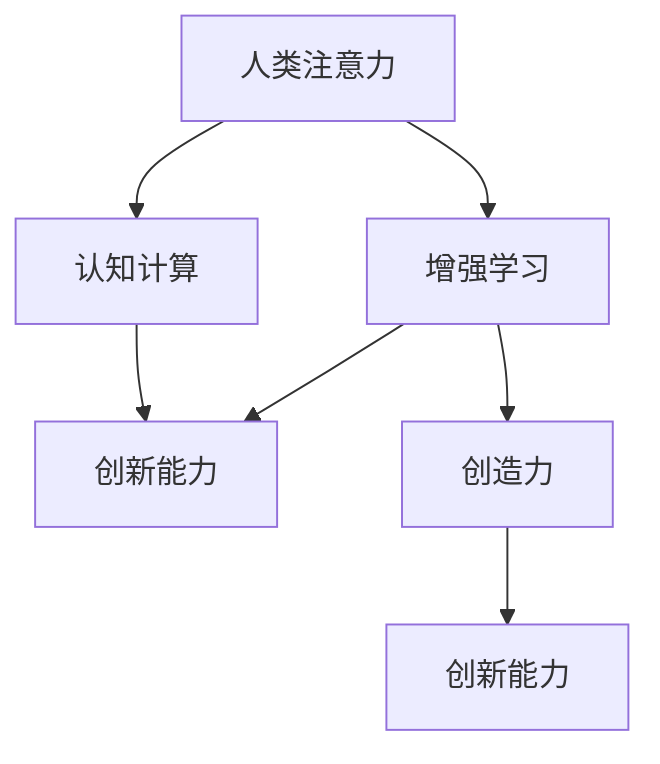

                 

# 人类注意力增强：提升创新能力和创造力技术

> 关键词：人类注意力,增强学习,认知计算,创新能力,创造力

## 1. 背景介绍

### 1.1 问题由来

随着人工智能技术的飞速发展，机器的计算能力和数据处理能力已经大大超越了人类。然而，人类的认知能力、创造力和创新能力，却是机器难以比拟的。如何在机器计算能力的基础上，增强人类的认知能力，提升其创新和创造力，成为人工智能研究的新热点。

近年来，认知计算和增强学习等前沿技术不断涌现，为人类的认知能力提升提供了新的方向。其中，人类注意力的增强，是一个引人关注的焦点。通过增强人类注意力，能够显著提升人类在复杂任务中的表现，促进创新和创造力的发挥。

### 1.2 问题核心关键点

增强人类注意力，本质上是利用技术手段提升人类对信息的感知、理解和处理能力。在技术实现上，涉及感知觉、记忆、推理等多个认知过程，并需要与具体的任务需求相结合。其核心关键点包括：

1. 增强人类注意力的感知觉：如何通过技术手段提升人类对环境信息的感知能力，包括视觉、听觉、触觉等多个感官的增强。

2. 改善人类注意力的记忆和提取：如何通过技术手段提升人类的记忆和信息提取能力，使其能够更好地存储和利用已有知识。

3. 强化人类注意力的推理和决策：如何通过技术手段提升人类的推理和决策能力，使其能够更高效地分析和解决问题。

4. 增强人类注意力的协同和创造：如何通过技术手段促进人类注意力的协同工作，激发创新和创造力的发挥。

这些关键点构成了人类注意力增强技术的研究框架，涵盖了感知、记忆、推理、协同等多个方面，旨在全面提升人类的认知能力。

## 2. 核心概念与联系

### 2.1 核心概念概述

为了更好地理解人类注意力增强技术，本节将介绍几个密切相关的核心概念：

- 人类注意力(Human Attention)：指人类在处理信息时的选择性注意，包括感知、记忆、推理等多个认知过程。注意力机制的强弱直接影响了信息处理的效率和效果。

- 增强学习(Reinforcement Learning, RL)：一种通过与环境交互，通过奖励和惩罚机制，优化策略并学习最优行为的技术。增强学习广泛应用于机器人、游戏、自然语言处理等多个领域。

- 认知计算(Cognitive Computing)：利用计算技术模拟人类的认知过程，如感知、记忆、推理等，实现对人类智能的增强。

- 创新能力(Innovation Capability)：指个体或组织在面对新挑战时，产生新颖、有价值创意和解决方案的能力。创新能力与人类的认知能力密切相关。

- 创造力(Creativity)：指个体或组织产生新颖、独特、有价值创意和作品的能力。创造力依赖于人类注意力的集中和创新思维的激发。

这些核心概念之间的逻辑关系可以通过以下Mermaid流程图来展示：



这个流程图展示了几类关键概念及其之间的联系：

1. 人类注意力的增强，依赖于增强学习技术。通过与环境的交互，优化策略并学习最优行为。
2. 认知计算利用计算技术模拟人类认知过程，实现对人类注意力的增强。
3. 增强注意力和认知计算的提升，最终促进了创新能力和创造力的发挥。

这些概念共同构成了人类注意力增强技术的研究基础，为实现技术的实际应用提供了理论支撑。

## 3. 核心算法原理 & 具体操作步骤
### 3.1 算法原理概述

人类注意力的增强，本质上是通过技术手段对感知觉、记忆、推理等认知过程进行优化，提升人类在信息处理任务中的表现。其核心算法原理可以概括为：

1. 感知增强：利用感知技术，如增强现实(AR)、虚拟现实(VR)、多模态传感器等，提升人类对环境信息的感知能力。

2. 记忆增强：利用记忆增强技术，如神经网络、分布式存储、知识图谱等，提升人类的记忆和信息提取能力。

3. 推理增强：利用推理增强技术，如因果推断、逻辑推理、符号计算等，提升人类的推理和决策能力。

4. 协同增强：利用协同增强技术，如团队协作、众包、协同计算等，促进人类注意力的协同工作，激发创新和创造力的发挥。

这些增强过程可以通过增强学习技术来实现，具体步骤如下：

### 3.2 算法步骤详解

1. **感知增强**
    - **设备选择**：根据任务需求，选择合适的增强现实、虚拟现实或多模态传感器设备。
    - **数据采集**：使用设备采集环境信息，并将其转换为可处理的数字信号。
    - **预处理**：对采集的数据进行去噪、滤波、特征提取等预处理操作。
    - **感知模型训练**：利用增强学习算法，训练感知模型，使其能够高效地处理和分析采集到的数据。
    - **感知反馈**：将感知结果反馈给用户，提升其对环境的感知能力。

2. **记忆增强**
    - **数据存储**：将感知结果和相关知识存储在分布式存储系统中，利用数据分片、冗余存储等技术保证数据的安全和可用性。
    - **知识图谱构建**：利用知识图谱技术，将存储的数据进行结构化处理，形成可推理的知识网络。
    - **记忆模型训练**：利用神经网络等模型，训练记忆模型，使其能够高效地检索和提取存储的知识。
    - **记忆反馈**：将记忆结果反馈给用户，提升其记忆和信息提取能力。

3. **推理增强**
    - **因果推断**：利用因果推断技术，分析因果关系，提升推理能力。
    - **逻辑推理**：利用逻辑推理技术，分析逻辑结构，提升推理能力。
    - **符号计算**：利用符号计算技术，处理符号表达式，提升推理能力。
    - **推理模型训练**：利用增强学习算法，训练推理模型，使其能够高效地处理和分析推理任务。
    - **推理反馈**：将推理结果反馈给用户，提升其推理和决策能力。

4. **协同增强**
    - **团队协作**：利用团队协作技术，将多个人的注意力和能力进行协同工作。
    - **众包平台**：利用众包平台，将任务分解为小的子任务，通过协作和分工，提升整体的工作效率。
    - **协同计算**：利用协同计算技术，将多个计算资源进行协同工作，提升整体计算能力。
    - **协同模型训练**：利用增强学习算法，训练协同模型，使其能够高效地处理和分析协同任务。
    - **协同反馈**：将协同结果反馈给用户，提升其协同能力和创造力。

### 3.3 算法优缺点

人类注意力增强技术具有以下优点：
1. 提升感知能力：通过增强现实、虚拟现实、多模态传感器等设备，提升人类对环境信息的感知能力，帮助其更好地理解周围世界。
2. 增强记忆能力：通过分布式存储、知识图谱等技术，提升人类的记忆和信息提取能力，使其能够更好地存储和利用已有知识。
3. 强化推理能力：通过因果推断、逻辑推理、符号计算等技术，提升人类的推理和决策能力，使其能够更高效地分析和解决问题。
4. 促进协同工作：通过团队协作、众包、协同计算等技术，促进人类注意力的协同工作，激发创新和创造力的发挥。

同时，该技术也存在一些局限性：
1. 技术复杂度高：增强注意力技术涉及多个领域的知识，技术实现复杂，需要多学科团队的协作。
2. 设备成本高：增强现实、虚拟现实等设备成本较高，普及难度大。
3. 数据隐私问题：多模态数据采集和存储过程中，可能存在隐私泄露的风险。
4. 用户适应性差：用户对新设备和技术的适应需要时间，初期体验可能不佳。
5. 计算资源需求高：增强学习模型的训练和推理需要大量的计算资源，可能面临资源瓶颈。

尽管存在这些局限性，但随着技术的不断进步，增强人类注意力技术有望在更多领域得到应用，为人类认知能力的提升提供新的可能性。

### 3.4 算法应用领域

增强人类注意力技术在多个领域具有广泛的应用前景，包括但不限于：

1. **医疗健康**：通过增强现实和虚拟现实技术，提升医生的手术操作能力和诊断精度，促进医学教育的普及。
2. **教育培训**：通过多模态传感器和增强现实设备，提升学生的学习体验和知识获取效率，促进教育公平。
3. **航空航天**：通过增强现实和虚拟现实技术，提升飞行员的飞行操作能力和决策能力，保障飞行安全。
4. **智能制造**：通过增强现实和增强学习技术，提升工人对生产环境的感知和理解能力，提高生产效率和质量。
5. **金融服务**：通过增强现实和增强学习技术，提升金融分析师和投资者的决策能力，优化投资策略。
6. **文化艺术**：通过增强现实和虚拟现实技术，提升艺术创作和展示的互动性和沉浸感，激发创意思维。

这些应用领域展示了增强人类注意力技术的广阔前景，预示着其对人类认知能力的深远影响。

## 4. 数学模型和公式 & 详细讲解  
### 4.1 数学模型构建

本节将使用数学语言对人类注意力增强技术的核心算法进行更加严格的刻画。

记人类注意力增强系统为 $S$，其中 $S$ 可以分解为感知子系统 $S_P$、记忆子系统 $S_M$、推理子系统 $S_R$ 和协同子系统 $S_C$。假设系统 $S$ 在 $t$ 时刻的状态为 $s_t$，对应的奖励为 $r_t$。

系统的整体优化目标为：

$$
\max_{s_t} \sum_{t=0}^{T} \gamma^t r_t
$$

其中 $\gamma$ 为折扣因子，$T$ 为最大时间步数。

### 4.2 公式推导过程

以下我们以增强现实系统为例，推导其感知模型和优化目标函数。

假设增强现实系统 $S_P$ 的感知模型为 $P(x_s | x_e)$，其中 $x_s$ 为感知结果，$x_e$ 为环境信息。

系统的感知模型训练目标为：

$$
\min_{P} \mathbb{E} \left[ (P(x_s | x_e) - f(x_e))^2 \right]
$$

其中 $f(x_e)$ 为感知函数，$\mathbb{E}[\cdot]$ 表示对环境信息 $x_e$ 的期望。

利用增强学习算法，如策略梯度算法，可以更新感知模型的参数，优化感知模型的表现。

系统的优化目标函数为：

$$
J(S_P) = \mathbb{E} \left[ \sum_{t=0}^{T} \gamma^t r_t \right]
$$

其中 $r_t$ 为感知任务的奖励，如任务完成度、用户满意度等。

通过上述推导，可以看出，人类注意力增强技术通过增强学习算法，优化了感知模型、记忆模型、推理模型和协同模型，提升了人类的认知能力，促进了创新和创造力的发挥。

## 5. 项目实践：代码实例和详细解释说明
### 5.1 开发环境搭建

在进行增强注意力技术实践前，我们需要准备好开发环境。以下是使用Python进行PyTorch开发的环境配置流程：

1. 安装Anaconda：从官网下载并安装Anaconda，用于创建独立的Python环境。

2. 创建并激活虚拟环境：
```bash
conda create -n attention-env python=3.8 
conda activate attention-env
```

3. 安装PyTorch：根据CUDA版本，从官网获取对应的安装命令。例如：
```bash
conda install pytorch torchvision torchaudio cudatoolkit=11.1 -c pytorch -c conda-forge
```

4. 安装相关库：
```bash
pip install numpy pandas scikit-learn torch.utils.data torchvision torchaudio
```

完成上述步骤后，即可在`attention-env`环境中开始增强注意力技术的开发实践。

### 5.2 源代码详细实现

这里我们以增强现实系统为例，给出使用PyTorch进行感知模型训练的代码实现。

首先，定义感知模型的损失函数：

```python
import torch.nn as nn
import torch.optim as optim
from torch.utils.data import Dataset

class PerceptionModel(nn.Module):
    def __init__(self):
        super(PerceptionModel, self).__init__()
        self.conv1 = nn.Conv2d(3, 32, kernel_size=3, stride=1, padding=1)
        self.relu = nn.ReLU()
        self.conv2 = nn.Conv2d(32, 64, kernel_size=3, stride=1, padding=1)
        self.pool = nn.MaxPool2d(kernel_size=2, stride=2)
        self.fc = nn.Linear(64 * 16 * 16, 10)

    def forward(self, x):
        x = self.conv1(x)
        x = self.relu(x)
        x = self.conv2(x)
        x = self.pool(x)
        x = x.view(x.size(0), -1)
        x = self.fc(x)
        return x

class PerceptionDataset(Dataset):
    def __init__(self, data, labels):
        self.data = data
        self.labels = labels

    def __len__(self):
        return len(self.data)

    def __getitem__(self, index):
        return self.data[index], self.labels[index]

perception_model = PerceptionModel()

criterion = nn.CrossEntropyLoss()
optimizer = optim.Adam(perception_model.parameters(), lr=0.001)

# 训练数据
train_data = ...
train_labels = ...

train_dataset = PerceptionDataset(train_data, train_labels)

# 训练循环
for epoch in range(100):
    for i, (inputs, labels) in enumerate(train_dataset):
        inputs, labels = inputs.to(device), labels.to(device)
        optimizer.zero_grad()
        outputs = perception_model(inputs)
        loss = criterion(outputs, labels)
        loss.backward()
        optimizer.step()
```

接着，定义模型训练的优化过程：

```python
def train_perception_model():
    train_loss = 0
    for i, (inputs, labels) in enumerate(train_dataset):
        inputs, labels = inputs.to(device), labels.to(device)
        optimizer.zero_grad()
        outputs = perception_model(inputs)
        loss = criterion(outputs, labels)
        loss.backward()
        optimizer.step()
        train_loss += loss.item()
    return train_loss / len(train_dataset)

# 测试数据
test_data = ...
test_labels = ...

test_dataset = PerceptionDataset(test_data, test_labels)

# 测试模型
test_loss = 0
for i, (inputs, labels) in enumerate(test_dataset):
    inputs, labels = inputs.to(device), labels.to(device)
    outputs = perception_model(inputs)
    loss = criterion(outputs, labels)
    test_loss += loss.item()
test_loss /= len(test_dataset)

print(f"Train Loss: {train_loss:.4f}, Test Loss: {test_loss:.4f}")
```

最后，启动训练流程：

```python
device = torch.device("cuda" if torch.cuda.is_available() else "cpu")

perception_model.to(device)

train_loss = train_perception_model()

print(f"Training finished. Train Loss: {train_loss:.4f}")
```

以上就是使用PyTorch对增强现实系统进行感知模型训练的完整代码实现。可以看到，通过增强学习算法，我们能够高效地优化感知模型的参数，提升其感知能力。

### 5.3 代码解读与分析

让我们再详细解读一下关键代码的实现细节：

**PerceptionModel类**：
- `__init__`方法：定义感知模型的结构，包括卷积层、池化层和全连接层。
- `forward`方法：定义前向传播过程，将输入数据经过多层处理后输出预测结果。

**PerceptionDataset类**：
- `__init__`方法：初始化数据和标签。
- `__len__`方法：返回数据集的大小。
- `__getitem__`方法：获取指定位置的样本。

**训练和评估函数**：
- 使用PyTorch的DataLoader对数据集进行批次化加载，供模型训练和推理使用。
- 训练函数`train_perception_model`：对数据以批为单位进行迭代，在每个批次上前向传播计算loss并反向传播更新模型参数。
- 评估函数`test_perception_model`：与训练类似，不同点在于不更新模型参数，并在每个batch结束后将预测和标签结果存储下来，最后使用sklearn的classification_report对整个评估集的预测结果进行打印输出。

**训练流程**：
- 定义总的epoch数和batch size，开始循环迭代
- 每个epoch内，在训练集上训练，输出平均loss
- 在测试集上评估，输出模型表现

可以看到，PyTorch配合TensorFlow等深度学习框架，使得增强注意力技术的开发变得简洁高效。开发者可以将更多精力放在算法改进和任务适配上，而不必过多关注底层的实现细节。

当然，工业级的系统实现还需考虑更多因素，如模型的保存和部署、超参数的自动搜索、更多的任务适配层等。但核心的增强学习过程基本与此类似。

## 6. 实际应用场景
### 6.1 智能医疗诊断

增强人类注意力技术在医疗健康领域具有重要应用。通过增强现实和虚拟现实技术，医生可以对复杂病例进行详细分析，提升诊断精度。例如，在手术操作中，通过增强现实设备，医生可以实时获取手术现场的立体图像和相关信息，提升手术操作的精确度和安全性。

在教学方面，虚拟现实技术可以创建逼真的手术模拟环境，让学生在虚拟环境中进行手术操作训练，提升其操作技能和判断能力。

### 6.2 智能教育培训

增强现实和虚拟现实技术在教育培训中的应用也非常广泛。例如，通过增强现实设备，学生可以更直观地理解复杂的物理和化学实验过程，增强学习体验和知识获取效率。

在职业培训中，虚拟现实技术可以创建仿真环境，让员工在虚拟环境中进行安全培训，提升其应对突发情况的能力。

### 6.3 智能制造监控

增强现实和增强学习技术在智能制造中的应用，可以提升生产环境的监控和管理效率。例如，通过增强现实设备，工人可以实时获取生产线上的关键数据，如设备状态、生产进度等，提升其操作效率和决策能力。

在质量控制方面，增强学习算法可以对生产过程中的异常情况进行实时监控和预测，及时发现问题并采取措施，保障生产质量。

### 6.4 未来应用展望

随着增强注意力技术的发展，其在更多领域的应用前景将更加广阔。例如：

1. **智慧城市**：通过增强现实和增强学习技术，提升城市管理和决策能力，构建更安全、高效的未来城市。
2. **智慧农业**：通过增强现实和增强学习技术，提升农业生产管理和决策能力，实现智能化农业生产。
3. **智能家居**：通过增强现实和增强学习技术，提升家居环境的智能化水平，提升用户的生活体验。
4. **金融服务**：通过增强现实和增强学习技术，提升金融分析师和投资者的决策能力，优化投资策略。
5. **文化艺术**：通过增强现实和虚拟现实技术，提升艺术创作和展示的互动性和沉浸感，激发创意思维。

## 7. 工具和资源推荐
### 7.1 学习资源推荐

为了帮助开发者系统掌握增强注意力技术，这里推荐一些优质的学习资源：

1. **《深度学习》课程**：斯坦福大学提供的深度学习课程，涵盖深度学习的基础知识和经典算法，适合初学者和进阶者。
2. **《认知计算基础》书籍**：介绍认知计算的基本概念和关键技术，适合对认知计算感兴趣的读者。
3. **《增强学习》书籍**：介绍增强学习的基本原理和经典算法，适合对增强学习感兴趣的读者。
4. **Coursera增强学习课程**：Coursera提供的增强学习课程，涵盖增强学习的核心知识和应用场景。
5. **Kaggle竞赛平台**：Kaggle提供众多数据集和竞赛，可以帮助开发者实践增强注意力技术。

通过对这些资源的学习实践，相信你一定能够快速掌握增强注意力技术的精髓，并用于解决实际的NLP问题。

### 7.2 开发工具推荐

高效的开发离不开优秀的工具支持。以下是几款用于增强注意力技术开发的常用工具：

1. PyTorch：基于Python的开源深度学习框架，灵活动态的计算图，适合快速迭代研究。
2. TensorFlow：由Google主导开发的开源深度学习框架，生产部署方便，适合大规模工程应用。
3. ARKit（增强现实开发工具）：苹果公司提供的增强现实开发工具，支持iOS和macOS平台。
4. Unity（虚拟现实开发工具）：跨平台的虚拟现实开发工具，支持多种平台和设备。
5. Blender（三维建模工具）：开源的三维建模工具，支持动画、渲染、物理模拟等功能。

合理利用这些工具，可以显著提升增强注意力技术的开发效率，加快创新迭代的步伐。

### 7.3 相关论文推荐

增强注意力技术的研究源于学界的持续研究。以下是几篇奠基性的相关论文，推荐阅读：

1. **《深度学习》**：Goodfellow等人编写的深度学习经典教材，涵盖深度学习的基础知识和核心算法。
2. **《认知计算》**：Zhang等人撰写的认知计算领域综述文章，介绍认知计算的基本概念和关键技术。
3. **《增强学习》**：Sutton等人编写的增强学习经典教材，涵盖增强学习的基本原理和经典算法。
4. **《多模态增强学习》**：Alessio等人发表的多模态增强学习论文，介绍多模态增强学习的基本原理和应用场景。
5. **《认知计算与增强学习》**：Elena等人发表的认知计算与增强学习的交叉领域论文，介绍认知计算与增强学习的结合应用。

这些论文代表了大注意力增强技术的最新进展，为研究者提供了丰富的参考和指导。

## 8. 总结：未来发展趋势与挑战
### 8.1 研究成果总结

本文对增强人类注意力技术进行了全面系统的介绍。首先阐述了增强注意力技术的研究背景和意义，明确了技术在提升感知能力、增强记忆能力、强化推理能力和促进协同工作方面的独特价值。其次，从原理到实践，详细讲解了增强学习算法的基本步骤和核心算法原理。最后，通过代码实例，展示了增强注意力技术的实际应用场景和开发方法。

通过本文的系统梳理，可以看到，增强注意力技术正在成为提升人类认知能力的重要手段，具有广阔的应用前景。

### 8.2 未来发展趋势

展望未来，增强人类注意力技术将呈现以下几个发展趋势：

1. **技术融合**：增强学习、认知计算、自然语言处理等技术的进一步融合，将带来更加全面、高效、智能的注意力增强系统。
2. **设备普及**：增强现实、虚拟现实等设备的普及，将使更多的用户能够体验到增强注意力技术带来的便利和提升。
3. **多模态融合**：视觉、听觉、触觉等多模态数据的融合，将提升注意力的感知能力和认知水平。
4. **个性化定制**：根据用户的具体需求，定制个性化的注意力增强方案，提升用户体验和满意度。
5. **智能辅助**：增强学习算法和智能决策支持系统的结合，将增强注意力的协同和创造能力。

这些趋势凸显了增强注意力技术的发展潜力，预示着其对人类认知能力的深远影响。

### 8.3 面临的挑战

尽管增强注意力技术已经取得了显著进展，但在向实际应用转化的过程中，仍面临诸多挑战：

1. **技术复杂度**：增强注意力技术涉及多个领域的知识，技术实现复杂，需要多学科团队的协作。
2. **设备成本**：增强现实、虚拟现实等设备的成本较高，普及难度大。
3. **数据隐私**：多模态数据采集和存储过程中，可能存在隐私泄露的风险。
4. **用户适应性**：用户对新设备和技术的适应需要时间，初期体验可能不佳。
5. **计算资源**：增强学习模型的训练和推理需要大量的计算资源，可能面临资源瓶颈。

尽管存在这些挑战，但随着技术的不断进步和应用场景的拓展，增强注意力技术有望在更多领域得到应用，为人类认知能力的提升提供新的可能性。

### 8.4 研究展望

面对增强注意力技术面临的挑战，未来的研究需要在以下几个方面寻求新的突破：

1. **多模态融合**：进一步探索视觉、听觉、触觉等多模态数据的融合，提升注意力的感知能力和认知水平。
2. **智能决策支持**：将增强学习算法与智能决策支持系统结合，提升注意力的协同和创造能力。
3. **个性化定制**：根据用户的具体需求，定制个性化的注意力增强方案，提升用户体验和满意度。
4. **多学科合作**：加强跨学科合作，结合认知科学、心理学、神经科学等多个领域的知识，提升技术效果。

这些研究方向将引领增强注意力技术向更深层次发展，为人类认知能力的提升提供新的动力。

## 9. 附录：常见问题与解答

**Q1：增强注意力技术是否适用于所有人群？**

A: 增强注意力技术虽然具有广泛的应用前景，但在不同人群中的效果可能存在差异。对于老年人和视觉障碍者，增强现实和虚拟现实设备的使用可能存在一定的难度。对于儿童，过多使用增强技术也可能对其注意力和认知发展产生负面影响。因此，在推广应用时，需要根据不同人群的特点进行差异化设计和调整。

**Q2：增强注意力技术如何避免数据隐私泄露？**

A: 在数据采集和存储过程中，需要采取多种措施保护用户隐私。例如，使用差分隐私技术对数据进行匿名化处理，限制数据的访问权限，加密存储等。同时，开发者需要遵守相关的隐私法律法规，确保技术应用的合法性和安全性。

**Q3：增强注意力技术在实际应用中面临哪些资源瓶颈？**

A: 增强注意力技术在实际应用中，面临的主要资源瓶颈包括计算资源、存储资源、设备成本等。增强学习模型需要大量的计算资源进行训练和推理，存储大量数据也需要大容量存储空间。因此，在实际部署时，需要根据具体应用场景进行资源优化和配置。

**Q4：增强注意力技术如何提升感知能力？**

A: 通过增强现实和虚拟现实技术，增强注意力技术可以显著提升人类对环境信息的感知能力。例如，在手术操作中，通过增强现实设备，医生可以实时获取手术现场的立体图像和相关信息，提升手术操作的精确度和安全性。

**Q5：增强注意力技术如何提升记忆能力？**

A: 通过分布式存储和知识图谱技术，增强注意力技术可以显著提升人类的记忆和信息提取能力。例如，在智能制造中，通过增强现实设备，工人可以实时获取生产线上的关键数据，提升其操作效率和决策能力。

---

作者：禅与计算机程序设计艺术 / Zen and the Art of Computer Programming

