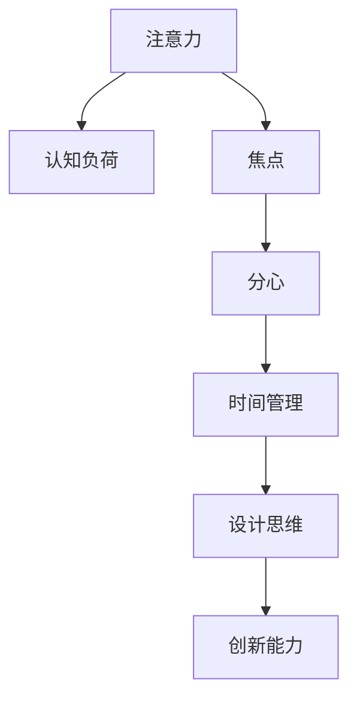

                 

## 1. 背景介绍

在信息爆炸的今天，人类面临前所未有的注意力管理挑战。过去，我们利用注意力集中、持久，可以长时间专注于复杂的工作。然而，随着科技的进步和数字设备的普及，我们的大脑不断受到干扰，难以长时间保持集中注意力。这种注意力分散问题不仅影响工作效率，还对创新能力和创造力产生负面影响。

### 1.1 问题由来

现代社会的数字化进程使注意力管理变得愈发复杂。我们每天都会接触到大量信息和干扰源，如电子邮件、社交媒体、即时通讯、多任务处理等。这些干扰不仅使我们的注意力分散，还减少了我们深层次思考和创新的机会。

注意力管理的重要性不仅仅体现在提高工作效率上，它还对创新和创造力管理产生深远影响。在科学研究、软件开发、设计、艺术创作等领域，长时间和高质量的注意力集中是产生高质量成果的关键因素。因此，如何通过技术手段提升人类的注意力管理能力，成为当前的一个重要课题。

### 1.2 问题核心关键点

注意力管理的核心在于如何在信息爆炸的环境中，保持大脑的集中和专注。这需要从多个层面进行干预，包括环境设计、行为习惯、技术工具等。随着技术的不断进步，越来越多的创新解决方案被开发出来，帮助人类更好地管理注意力。

1. **环境设计**：如降噪耳机、舒适的办公环境等，减少外界干扰。
2. **行为习惯**：如番茄工作法、时间管理法等，优化工作习惯。
3. **技术工具**：如注意力增强算法、焦点管理软件等，提供注意力监测和反馈。
4. **创新和创造力管理**：如认知负荷理论、设计思维等，提升创新能力。

## 2. 核心概念与联系

### 2.1 核心概念概述

为了更好地理解注意力管理和创新能力提升的原理，本节将介绍几个密切相关的核心概念：

- **注意力（Attention）**：指的是心理活动对特定事物的集中与持久关注。注意力分为内部注意力和外部注意力两种，内部注意力关注自身思考，外部注意力关注外界信息。

- **认知负荷（Cognitive Load）**：指在进行认知任务时，大脑需要处理的信息量。过多的认知负荷会导致注意力分散，降低工作效能。

- **焦点（Focus）**：指在特定时间段内，将注意力集中于某一特定任务或活动。保持高质量的焦点状态，对创新和创造力的提升至关重要。

- **分心（Distraction）**：指外界干扰导致注意力无法集中在当前任务上。常见的分心来源包括噪音、通知、多任务处理等。

- **时间管理（Time Management）**：指通过合理安排时间，提高工作效率和专注度。时间管理涉及任务优先级、任务分解、时间块划分等策略。

- **设计思维（Design Thinking）**：一种创新方法论，通过用户研究、问题定义、原型设计等步骤，提升创新能力。

这些核心概念之间的逻辑关系可以通过以下Mermaid流程图来展示：



这个流程图展示了注意力管理的核心概念及其相互关系：

1. 注意力是认知负荷和焦点的基础。
2. 认知负荷会影响注意力集中。
3. 焦点状态能有效对抗分心，提升工作效率。
4. 时间管理能优化焦点时间，提高效率。
5. 设计思维通过改进工作流程，提升创新能力。
6. 创新能力的目标是提升整体工作效率和创造力。

## 3. 核心算法原理 & 具体操作步骤
### 3.1 算法原理概述

提升注意力管理与创新能力的方法，主要基于对注意力和认知负荷的心理学研究，以及新技术在实际应用中的探索。本文将介绍一种基于认知负荷理论的注意力增强算法，并通过具体步骤详解其原理和实现。

### 3.2 算法步骤详解

**Step 1: 认知负荷测量**

认知负荷测量是注意力增强算法的第一步。通过各种生理和心理指标的监测，评估当前认知负荷水平。常用的生理指标包括心率、脑电图、皮肤电反应等，心理指标包括注意力集中度、思维清晰度等。

**Step 2: 注意力预警与提示**

根据认知负荷测量结果，算法实时监测用户注意力状态，并在认知负荷超出阈值时发出预警。预警的方式包括声音提示、视觉提示、振动提示等，引导用户进行短暂休息或注意力恢复。

**Step 3: 注意力恢复**

在注意力预警后，算法引导用户进行注意力恢复。恢复方式包括短暂休息、深呼吸、眼保健操等，帮助用户恢复注意力集中度。

**Step 4: 认知负荷优化**

通过认知负荷测量和注意力恢复的反馈，算法动态优化用户的注意力管理策略。例如，根据不同任务和场景，调整任务优先级、时间块划分、工作环境等，减少认知负荷，提高注意力集中度。

**Step 5: 创新能力增强**

创新能力的提升，需要长时间的高质量注意力集中。算法通过认知负荷管理和注意力恢复，优化注意力状态，为创新和创造力的提升提供基础。同时，通过设计思维等创新方法论，进一步提升创新能力。

### 3.3 算法优缺点

基于认知负荷理论的注意力增强算法，具有以下优点：

1. **实时监测与预警**：通过生理和心理指标的实时监测，能够及时发现注意力分散，提高工作效率。
2. **个性化优化**：动态调整注意力管理策略，满足不同用户和不同场景的需求。
3. **认知负荷管理**：通过优化注意力状态，减少认知负荷，提升注意力集中度。

同时，该算法也存在一定的局限性：

1. **数据隐私**：生理和心理指标的监测可能涉及个人隐私，需要严格遵守数据保护规定。
2. **用户体验**：长时间监测和提示可能影响用户体验，导致用户反感。
3. **适应性**：算法需要根据不同用户和不同任务进行适应性调整，否则效果可能不佳。

尽管存在这些局限性，但认知负荷理论在注意力增强和创新能力提升中的应用，已经展示了其潜力和价值。未来相关研究的重点在于如何进一步提高算法的精度和适应性，同时兼顾用户体验和数据隐私。

### 3.4 算法应用领域

基于认知负荷理论的注意力增强算法，在多个领域得到了广泛应用：

- **企业生产管理**：通过注意力监测和预警，优化工作流程，提高员工工作效率。
- **学术研究**：在科学研究中，保持长时间的注意力集中，提升创新成果的质量。
- **创意产业**：帮助艺术家、设计师、作家等创意工作者，优化工作环境，提升创新能力。
- **教育培训**：通过注意力监测和恢复，优化学生学习状态，提升学习效果。
- **远程办公**：在远程工作环境中，监测和恢复注意力，提高远程团队的工作效率。

这些领域的应用，展示了认知负荷理论在提升注意力管理与创新能力方面的广泛价值。

## 4. 数学模型和公式 & 详细讲解 & 举例说明
### 4.1 数学模型构建

本节将使用数学语言对注意力增强算法的原理进行详细解释。

记认知负荷为 $C$，注意力集中度为 $F$，任务复杂度为 $T$。认知负荷模型可以表示为：

$$
C = \alpha F + \beta T + \gamma W
$$

其中 $\alpha$ 表示注意力集中度对认知负荷的贡献率，$\beta$ 表示任务复杂度对认知负荷的贡献率，$\gamma$ 表示工作环境对认知负荷的贡献率。$W$ 表示其他影响认知负荷的随机因素。

### 4.2 公式推导过程

根据上述认知负荷模型，可以推导出注意力恢复时间 $R$ 的计算公式：

$$
R = \frac{1}{\delta} (C - C_{\min})
$$

其中 $C_{\min}$ 为认知负荷的下限，$\delta$ 为注意力恢复速率。

### 4.3 案例分析与讲解

假设某用户在处理复杂任务时，注意力集中度为 $F=0.8$，任务复杂度 $T=1.2$，工作环境对认知负荷的影响系数 $\gamma=0.3$，其他影响因素 $W=0.1$。代入公式得：

$$
C = 0.8 \times 0.8 + 1.2 \times 0.3 + 0.1 = 1.44 + 0.36 + 0.1 = 1.8
$$

如果用户当前认知负荷超出预设阈值，系统将发出预警，引导其进行注意力恢复。假设注意力恢复速率 $\delta=0.05$，则恢复时间为：

$$
R = \frac{1}{0.05} \times (1.8 - C_{\min}) = 20 \times (1.8 - 0.5) = 26
$$

因此，系统将引导用户进行26分钟的短暂休息，以恢复注意力集中度。

## 5. 项目实践：代码实例和详细解释说明
### 5.1 开发环境搭建

在进行注意力增强算法开发前，我们需要准备好开发环境。以下是使用Python进行认知负荷监测和注意力恢复的开发环境配置流程：

1. 安装Anaconda：从官网下载并安装Anaconda，用于创建独立的Python环境。

2. 创建并激活虚拟环境：
```bash
conda create -n attention-env python=3.8 
conda activate attention-env
```

3. 安装PyTorch：根据CUDA版本，从官网获取对应的安装命令。例如：
```bash
conda install pytorch torchvision torchaudio cudatoolkit=11.1 -c pytorch -c conda-forge
```

4. 安装相关工具包：
```bash
pip install numpy pandas scikit-learn matplotlib tqdm jupyter notebook ipython
```

完成上述步骤后，即可在`attention-env`环境中开始开发。

### 5.2 源代码详细实现

下面我们以注意力增强算法为例，给出使用PyTorch进行认知负荷监测和注意力恢复的PyTorch代码实现。

```python
import torch
from torch import nn
import numpy as np

class AttentionMonitor(nn.Module):
    def __init__(self, alpha=0.5, beta=0.5, gamma=0.5):
        super(AttentionMonitor, self).__init__()
        self.alpha = alpha
        self.beta = beta
        self.gamma = gamma
    
    def forward(self, f, t):
        c = self.alpha * f + self.beta * t + self.gamma * np.random.normal(0, 0.1, size=(t.shape[0],))
        return c

class AttentionRestorer(nn.Module):
    def __init__(self, delta=0.05, c_min=1.0):
        super(AttentionRestorer, self).__init__()
        self.delta = delta
        self.c_min = c_min
    
    def forward(self, c, c_min):
        r = 1 / self.delta * (c - c_min)
        return r
```

上述代码实现了注意力增强算法的两个核心模块：

- `AttentionMonitor`：用于计算当前认知负荷 $C$，输入为注意力集中度 $F$ 和任务复杂度 $T$。
- `AttentionRestorer`：用于计算注意力恢复时间 $R$，输入为当前认知负荷 $C$ 和认知负荷下限 $C_{\min}$。

### 5.3 代码解读与分析

让我们再详细解读一下关键代码的实现细节：

**AttentionMonitor类**：
- `__init__`方法：初始化注意力集中度、任务复杂度、工作环境的影响系数。
- `forward`方法：根据公式计算认知负荷 $C$。

**AttentionRestorer类**：
- `__init__`方法：初始化注意力恢复速率和认知负荷下限。
- `forward`方法：根据公式计算注意力恢复时间 $R$。

通过这些模块的组合，我们可以构建完整的注意力增强算法流程。在实际应用中，还可以进一步扩展算法功能，如注意力恢复方式的多样化、注意力监测指标的丰富化等。

## 6. 实际应用场景
### 6.1 企业生产管理

在企业生产管理中，认知负荷理论可以帮助优化员工的工作状态，提升生产效率。通过认知负荷监测，系统能够实时发现员工注意力分散的问题，及时发出预警并进行恢复。

具体而言，可以部署传感器和生理监测设备，实时监测员工的心率、皮肤电反应等生理指标，以及注意力集中度等心理指标。系统根据监测结果，自动调整工作任务和休息时间，帮助员工保持高质量的注意力集中。

### 6.2 学术研究

学术研究中，长时间的注意力集中是产出高质量成果的关键。通过认知负荷监测和注意力恢复，研究人员可以保持长时间的专注状态，避免因分心导致的思维中断，提高创新能力。

在实际应用中，研究人员可以通过认知负荷监测软件，记录其工作状态和注意力集中度。系统根据监测结果，提供定制化的注意力恢复建议，如短暂休息、深呼吸等，帮助研究人员保持高效的工作状态。

### 6.3 创意产业

创意产业中的艺术家、设计师、作家等，需要长时间的注意力集中才能产生高质量的创意作品。通过认知负荷管理，这些创意工作者可以优化工作环境，提升创新能力。

在实际应用中，创意工作者可以使用认知负荷监测软件，实时监测自己的注意力状态。系统根据监测结果，提供定制化的注意力恢复建议，如休息、音乐放松等，帮助创意工作者保持高效的工作状态。

### 6.4 教育培训

在教育培训中，保持高质量的注意力集中对学生学习效果至关重要。通过认知负荷监测和注意力恢复，教师可以优化教学方式，提高学生的学习效率。

在实际应用中，教师可以通过认知负荷监测软件，记录学生的注意力集中度和学习状态。系统根据监测结果，提供定制化的注意力恢复建议，如短暂休息、视觉放松等，帮助学生保持高效的学习状态。

### 6.5 远程办公

远程办公环境下，员工的注意力集中度难以保证。通过认知负荷监测和注意力恢复，系统可以帮助远程团队保持高效的工作状态。

在实际应用中，远程办公人员可以使用认知负荷监测软件，实时监测自己的注意力集中度。系统根据监测结果，提供定制化的注意力恢复建议，如短暂休息、专注训练等，帮助员工保持高效的工作状态。

### 6.6 未来应用展望

随着认知负荷理论和技术手段的不断进步，注意力增强算法在未来将有更广泛的应用前景：

- **多模态认知负荷监测**：结合生理监测、心理监测、行为分析等多模态数据，全面评估用户的注意力状态。
- **个性化认知负荷管理**：根据用户的工作习惯和场景，提供个性化的注意力管理策略，提高用户满意度。
- **智能注意力提示**：结合智能提醒和反馈机制，引导用户进行注意力恢复，提升工作效能。
- **集成到其他应用**：将注意力增强算法集成到其他应用中，如企业管理系统、学习平台、健康监测设备等，形成全面的注意力管理解决方案。
- **跨领域应用**：拓展到医疗、心理健康、娱乐等领域，提供更加全面的注意力管理服务。

## 7. 工具和资源推荐
### 7.1 学习资源推荐

为了帮助开发者系统掌握注意力增强算法的理论基础和实践技巧，这里推荐一些优质的学习资源：

1. **《认知负荷理论》（Cognitive Load Theory）**：详细介绍认知负荷理论的基本概念和应用场景，是学习注意力增强算法的必备基础。
2. **《注意力经济学》（Economics of Attention）**：分析注意力作为一种资源的价值和分配方式，提供注意力管理的经济学视角。
3. **《设计思维：解决问题的创新方法》（Design Thinking: Integrating Innovation, Customer Experience, and Brand Value）**：详细介绍设计思维的基本方法和应用案例，提升创新能力。
4. **Coursera课程《注意力和注意力训练》（Attention and Attention Training）**：由心理学专家开设的在线课程，深入浅出地介绍注意力管理的基本原理和训练方法。
5. **Kaggle竞赛《注意力管理》（Attention Management）**：通过实际比赛数据，训练注意力增强算法，提升实际应用能力。

通过这些资源的学习实践，相信你一定能够快速掌握认知负荷理论在注意力增强中的应用，并用于解决实际的注意力管理问题。

### 7.2 开发工具推荐

高效的开发离不开优秀的工具支持。以下是几款用于注意力增强算法开发的常用工具：

1. **Python**：一种通用的高级编程语言，灵活性高，适合进行算法开发和数据分析。
2. **PyTorch**：基于Python的开源深度学习框架，灵活的计算图机制，适合进行认知负荷监测和注意力恢复的深度学习模型训练。
3. **TensorFlow**：由Google主导开发的开源深度学习框架，生产部署方便，适合大规模工程应用。
4. **Weights & Biases**：模型训练的实验跟踪工具，可以记录和可视化模型训练过程中的各项指标，方便对比和调优。
5. **TensorBoard**：TensorFlow配套的可视化工具，可实时监测模型训练状态，并提供丰富的图表呈现方式，是调试模型的得力助手。
6. **Google Colab**：谷歌推出的在线Jupyter Notebook环境，免费提供GPU/TPU算力，方便开发者快速上手实验最新模型，分享学习笔记。

合理利用这些工具，可以显著提升注意力增强算法的开发效率，加快创新迭代的步伐。

### 7.3 相关论文推荐

认知负荷理论和注意力增强技术的发展源于学界的持续研究。以下是几篇奠基性的相关论文，推荐阅读：

1. **《认知负荷和注意力：理论、模型和应用》（Cognitive Load and Attention: A Theoretical and Empirical Review）**：总结了认知负荷理论的基本框架和应用案例，是认知负荷理论研究的经典文献。
2. **《注意力：如何处理信息》（Attention: A New Approach to Multitask Learning）**：提出基于注意力机制的多任务学习框架，是注意力机制在深度学习中的应用研究。
3. **《基于注意力机制的文本分类》（Attention-based Text Classification）**：研究了注意力机制在文本分类任务中的应用，展示了其对提升模型性能的显著效果。
4. **《深度学习中的注意力机制》（Attention is All You Need）**：提出Transformer结构，展示了注意力机制在自然语言处理中的应用，开启了预训练大模型的时代。
5. **《注意力增强模型：一种新的注意力机制》（Attention Augmented Model: A New Attention Mechanism）**：提出一种新的注意力增强模型，展示了其对提升模型性能的显著效果。

这些论文代表了大规模注意力增强技术的发展脉络。通过学习这些前沿成果，可以帮助研究者把握学科前进方向，激发更多的创新灵感。

## 8. 总结：未来发展趋势与挑战
### 8.1 研究成果总结

本文对认知负荷理论在注意力增强中的应用进行了全面系统的介绍。首先阐述了认知负荷理论的基本概念和应用场景，明确了注意力增强在提高工作效率和创新能力方面的独特价值。其次，从原理到实践，详细讲解了认知负荷理论的数学模型和算法步骤，给出了注意力增强算法的完整代码实例。同时，本文还广泛探讨了注意力增强算法在多个行业领域的应用前景，展示了认知负荷理论的广泛价值。

通过本文的系统梳理，可以看到，认知负荷理论在提升人类注意力管理和创新能力方面具有重要意义。未来，伴随认知负荷理论和技术的持续演进，注意力增强算法必将在提升人类认知水平和工作效率方面发挥更大作用。

### 8.2 未来发展趋势

展望未来，认知负荷理论在注意力增强和创新能力提升中的应用将呈现以下几个发展趋势：

1. **多模态认知负荷监测**：结合生理监测、心理监测、行为分析等多模态数据，全面评估用户的注意力状态。
2. **个性化认知负荷管理**：根据用户的工作习惯和场景，提供个性化的注意力管理策略，提高用户满意度。
3. **智能注意力提示**：结合智能提醒和反馈机制，引导用户进行注意力恢复，提升工作效能。
4. **集成到其他应用**：将注意力增强算法集成到其他应用中，如企业管理系统、学习平台、健康监测设备等，形成全面的注意力管理解决方案。
5. **跨领域应用**：拓展到医疗、心理健康、娱乐等领域，提供更加全面的注意力管理服务。

以上趋势凸显了认知负荷理论在提升人类注意力管理和创新能力方面的广阔前景。这些方向的探索发展，必将进一步提升人类的认知水平和工作效率，为未来社会的可持续发展提供有力支持。

### 8.3 面临的挑战

尽管认知负荷理论和注意力增强技术已经取得了瞩目成就，但在迈向更加智能化、普适化应用的过程中，它仍面临诸多挑战：

1. **数据隐私**：生理和心理指标的监测可能涉及个人隐私，需要严格遵守数据保护规定。
2. **用户体验**：长时间监测和提示可能影响用户体验，导致用户反感。
3. **适应性**：算法需要根据不同用户和不同任务进行适应性调整，否则效果可能不佳。
4. **计算资源**：多模态认知负荷监测和深度学习模型训练，需要较高的计算资源，可能面临成本问题。
5. **伦理道德**：注意力增强算法可能被用于监控和操纵行为，需要严格遵守伦理道德规范。

尽管存在这些挑战，但认知负荷理论和注意力增强技术的发展潜力仍然巨大。未来相关研究需要在多个维度进行突破，才能真正实现其在人类注意力管理和创新能力提升方面的巨大价值。

### 8.4 研究展望

面对认知负荷理论和注意力增强技术所面临的挑战，未来的研究需要在以下几个方面寻求新的突破：

1. **数据隐私保护**：开发更加安全、高效的数据监测和隐私保护技术，保障用户隐私。
2. **用户体验优化**：结合用户反馈和行为数据，优化注意力监测和提示策略，提升用户体验。
3. **跨领域应用拓展**：将注意力增强技术拓展到更多领域，如医疗、心理健康、娱乐等，提供全面的注意力管理服务。
4. **多模态认知负荷模型**：研究多模态认知负荷模型的构建方法，提高注意力监测的准确性和全面性。
5. **个性化注意力管理**：结合用户行为数据和外部知识库，提供个性化的注意力管理建议，提升用户满意度。

这些研究方向的探索，必将推动认知负荷理论和注意力增强技术向更加智能、普适的方向发展，为未来社会的可持续发展提供有力支持。

## 9. 附录：常见问题与解答
### 9.1 问题1：认知负荷监测如何实现？

A: 认知负荷监测主要通过生理监测和心理监测两种方式实现。生理监测包括心率、皮肤电反应、眼动追踪等，心理监测包括注意力集中度、思维清晰度等。通过这些指标的实时监测，可以评估用户的认知负荷水平。

### 9.2 问题2：注意力增强算法如何提升创新能力？

A: 注意力增强算法通过实时监测和恢复用户的注意力状态，帮助用户保持高质量的注意力集中。在长时间的高质量注意力集中下，用户可以更好地进行创新和创造性思考，提升创新能力。

### 9.3 问题3：注意力增强算法在医疗中的应用场景是什么？

A: 在医疗领域，注意力增强算法可以用于监测患者的注意力集中度，评估其认知负荷水平，提供个性化的注意力恢复建议。同时，也可以应用于手术操作，通过监测外科医生的注意力状态，提高手术成功率。

### 9.4 问题4：注意力增强算法的应用前景是什么？

A: 未来，认知负荷理论和注意力增强算法将在更多领域得到应用，如教育、企业生产管理、创意产业、远程办公等。通过提升用户的注意力管理和创新能力，这些领域的工作效率和产出质量将显著提升。

---

作者：禅与计算机程序设计艺术 / Zen and the Art of Computer Programming

