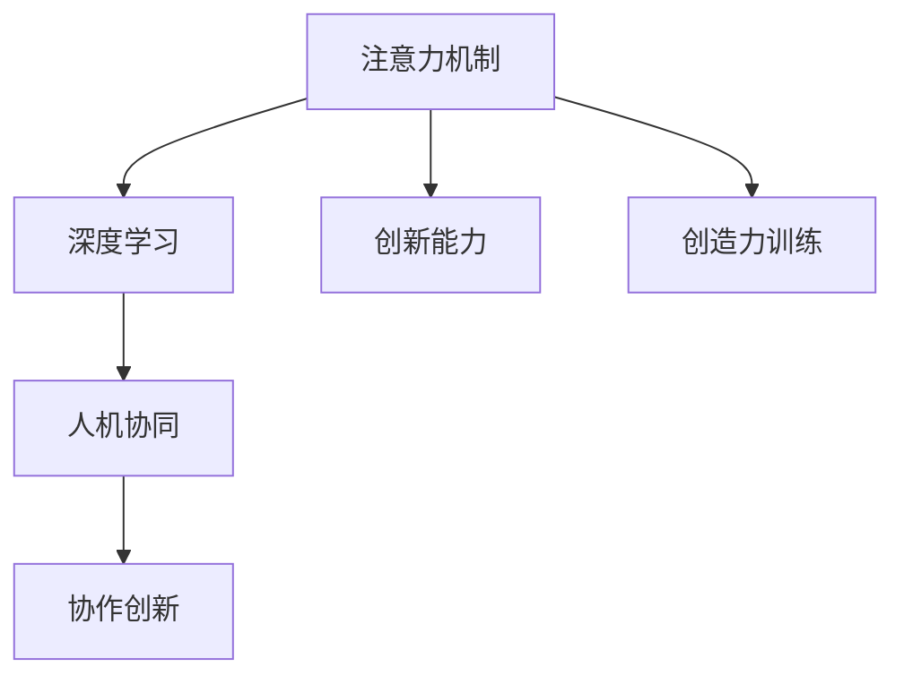

                 

# 人类注意力增强：提升创新能力和创造力训练方法

> 关键词：人类注意力增强,创新能力,创造力训练,深度学习,注意力机制,算法实现

## 1. 背景介绍

### 1.1 问题由来

在数字化和信息爆炸的今天，人类面临的信息洪流前所未有。如何有效地在信息海洋中寻找并整合创新点，提升个人的创造力和创新能力，已经成为各行各业亟待解决的问题。深度学习和人工智能技术提供了新的可能。通过模拟人类大脑的注意力机制，我们可以训练出更为智能、高效的系统，辅助人类在复杂的信息环境中做出准确、快速、创造性的决策。

### 1.2 问题核心关键点

注意力机制(Artificial Attention Mechanism)作为深度学习中的一个重要组件，通过动态地筛选和聚焦关键信息，极大地提高了模型处理复杂任务的能力。在自然语言处理(NLP)、计算机视觉(CV)、信号处理等领域，注意力机制已经广泛应用。然而，当前的技术主要集中于机器层面，对人类自身的注意力增强和创新能力的提升关注较少。本文将深入探讨人类注意力增强的方法，以及通过深度学习技术提升个人创新能力和创造力的训练方法。

## 2. 核心概念与联系

### 2.1 核心概念概述

为更好地理解人类注意力增强和创新能力提升的训练方法，本节将介绍几个密切相关的核心概念：

- **注意力机制(Attention Mechanism)**：一种用于动态地加权信息选择机制，模拟人类注意力的工作原理。在深度学习中，注意力机制用于提高模型对关键信息的关注度和选择能力。
- **创新能力(Creativity)**：指人类在解决问题、创造新事物时所表现出来的独特、新颖、富有成效的能力。通过深度学习训练，可以从大量数据中挖掘和提取创新点。
- **创造力训练(Creative Training)**：通过特定的方法和工具，训练和提升个体的创新能力和创造力。主要包括训练模型学习创新点，并通过反馈机制引导人类自我提升。
- **深度学习(Deep Learning)**：基于神经网络的机器学习方法，通过多层次的非线性变换和反向传播算法训练模型，从而能够自动学习和提取复杂特征。
- **人机协同(Co-Creation)**：指人类与机器协作完成任务，发挥各自优势，提升整体效率和创造力。深度学习模型可辅助人类发现创新点，人机协同则进一步优化和实现创新成果。

这些核心概念之间的逻辑关系可以通过以下Mermaid流程图来展示：

这个流程图展示了注意力机制、深度学习、创新能力、创造力训练和人机协同之间的关系：注意力机制和深度学习为模型提供信息选择和特征提取能力；创新能力和创造力训练通过模型学习生成新的创意；人机协同进一步优化创新成果，实现协作创新。这些概念共同构成了人类注意力增强和创新能力提升的基本框架，帮助我们更好地理解和应用深度学习技术。

## 3. 核心算法原理 & 具体操作步骤

### 3.1 算法原理概述

人类注意力增强和创新能力提升的训练方法主要基于深度学习中的注意力机制，通过模型学习和模拟人类注意力动态变化过程。其核心思想是：通过训练深度学习模型，使其能够动态地选择和聚焦关键信息，从而提升模型的决策能力和创新潜力。

形式化地，设输入为 $x$，模型参数为 $\theta$。模型的注意力机制通过计算注意力权重 $a_x$，对输入 $x$ 中的不同部分赋予不同的关注度。模型的预测结果 $y$ 可以表示为：

$$
y = f(x, a_x, \theta)
$$

其中 $f$ 为预测函数，$a_x$ 为注意力权重。注意力权重 $a_x$ 可以表示为：

$$
a_x = \text{Softmax}(v_x^T W_a)
$$

其中 $v_x$ 为注意力查询向量，$W_a$ 为注意力权重矩阵，$v_x^T$ 为 $v_x$ 的转置矩阵。注意力查询向量 $v_x$ 通常是通过输入 $x$ 和模型参数 $\theta$ 计算得到的，$W_a$ 为预定义的注意力权重矩阵。

### 3.2 算法步骤详解

基于注意力机制的创新能力提升训练方法主要包括以下几个关键步骤：

**Step 1: 数据准备**
- 收集领域相关的数据集，并对其进行预处理，如文本清洗、标注、分词等。
- 设计合适的标注方案，标注数据的创新点。创新点可以是新颖的词组、独特的概念、新的解决思路等。

**Step 2: 构建注意力模型**
- 选择合适的深度学习模型架构，如Transformer、LSTM等。
- 在模型中添加注意力机制，如自注意力机制(Self-Attention)、多头注意力机制(Multi-Head Attention)等。
- 设计合适的损失函数，如交叉熵损失、均方误差损失等。

**Step 3: 训练模型**
- 使用收集的数据集训练模型，最小化损失函数，更新模型参数。
- 使用一定的超参数设置，如学习率、批大小、迭代次数等，进行模型优化。
- 使用数据增强、正则化等技术，防止模型过拟合。

**Step 4: 评估和反馈**
- 在测试集上评估模型性能，如准确率、召回率、F1值等指标。
- 根据评估结果，调整模型参数，继续训练。
- 设计创新点提取和评价机制，如基于内容的相似度、新颖性、创造性等，进行反馈。

**Step 5: 迭代优化**
- 根据反馈结果，进一步优化模型结构、超参数、训练策略等。
- 循环迭代训练，提升模型的创新能力。
- 应用模型到实际创新任务中，进一步验证和优化。

以上是基于注意力机制的创新能力提升训练方法的一般流程。在实际应用中，还需要根据具体任务的特点，对训练过程的各个环节进行优化设计，如改进模型架构、引入更多创新点评价指标、应用人机协同机制等，以进一步提升模型的创新性能。

### 3.3 算法优缺点

基于注意力机制的创新能力提升训练方法具有以下优点：
1. 灵活高效。通过动态注意力选择，模型能够快速聚焦关键信息，提升决策能力。
2. 泛化能力强。深度学习模型能够自动学习和提取复杂特征，适用于多种创新任务。
3. 可解释性强。注意力机制提供了模型决策过程的可解释性，便于调试和优化。
4. 数据驱动。创新能力提升过程依赖于大量标注数据，有助于模型泛化和新创新点的发现。

同时，该方法也存在一定的局限性：
1. 依赖高质量标注数据。创新点标注过程复杂且主观，质量难以保证。
2. 模型复杂度高。深度学习模型通常需要大量的计算资源和数据。
3. 创新点多样性不足。模型可能只能关注到特定类型或格式的创新点，缺乏多样性。
4. 创新过程可控性差。创新过程涉及主观判断，模型难以完全替代人类创意。

尽管存在这些局限性，但就目前而言，基于注意力机制的创新能力提升方法仍是一种高效、灵活的创新训练范式。未来相关研究的重点在于如何进一步降低标注数据的依赖，提高模型的多样性和可控性，同时兼顾创新过程的灵活性和可解释性等因素。

### 3.4 算法应用领域

基于注意力机制的创新能力提升训练方法已经在多个领域得到了应用，例如：

- 自然语言处理：如文本生成、机器翻译、情感分析等。通过注意力机制学习文本中的关键信息，生成更具创新性的文本或进行情感分类。
- 计算机视觉：如图像生成、物体识别、目标检测等。通过注意力机制关注图像中的关键区域，生成更具创新性的图像或进行目标检测。
- 信号处理：如语音识别、音乐生成、图像重建等。通过注意力机制提取信号中的关键特征，生成更具创新性的语音、音乐或图像。
- 游戏设计：如智能体行为生成、游戏情节创新等。通过注意力机制模拟人类注意力，生成更富有创意的游戏设计。
- 艺术创作：如生成音乐、绘画、文学作品等。通过注意力机制关注创意元素，生成更具创新性的艺术作品。

除了上述这些经典任务外，基于注意力机制的创新能力提升方法还被创新性地应用到更多场景中，如跨领域知识迁移、多模态信息融合等，为创新能力提升提供了新的思路。随着注意力机制和深度学习方法的不断进步，相信创新能力提升技术将在更多领域得到应用，为人类社会带来更多的创新和变革。

## 4. 数学模型和公式 & 详细讲解 & 举例说明

### 4.1 数学模型构建

本节将使用数学语言对基于注意力机制的创新能力提升训练方法进行更加严格的刻画。

设输入为 $x = (x_1, x_2, ..., x_n)$，其中 $x_i$ 表示输入中的第 $i$ 个元素。模型参数为 $\theta$，包括注意力查询向量 $v_x$ 和注意力权重矩阵 $W_a$。注意力查询向量 $v_x$ 和注意力权重矩阵 $W_a$ 可以表示为：

$$
v_x = \theta_v x
$$

$$
W_a = \theta_w
$$

其中 $\theta_v$ 和 $\theta_w$ 为模型参数。模型的预测结果 $y$ 可以表示为：

$$
y = f(x, a_x, \theta)
$$

其中 $f$ 为预测函数，$a_x$ 为注意力权重。注意力权重 $a_x$ 可以表示为：

$$
a_x = \text{Softmax}(v_x^T W_a)
$$

其中 $\text{Softmax}$ 表示Softmax函数。注意力查询向量 $v_x$ 和注意力权重矩阵 $W_a$ 的具体形式可以是任意的，如线性变换、卷积变换等。

### 4.2 公式推导过程

以下我们以文本生成任务为例，推导注意力机制的计算公式。

假设输入文本为 $x = (x_1, x_2, ..., x_n)$，其中 $x_i$ 表示输入中的第 $i$ 个单词。模型的注意力查询向量 $v_x$ 和注意力权重矩阵 $W_a$ 可以表示为：

$$
v_x = \theta_v x
$$

$$
W_a = \theta_w
$$

其中 $\theta_v$ 和 $\theta_w$ 为模型参数。注意力权重 $a_x$ 可以表示为：

$$
a_x = \text{Softmax}(v_x^T W_a)
$$

其中 $\text{Softmax}$ 表示Softmax函数。注意力查询向量 $v_x$ 和注意力权重矩阵 $W_a$ 的具体形式可以是任意的，如线性变换、卷积变换等。

注意力查询向量 $v_x$ 和注意力权重矩阵 $W_a$ 的具体形式可以是任意的，如线性变换、卷积变换等。

模型的预测结果 $y$ 可以表示为：

$$
y = f(x, a_x, \theta)
$$

其中 $f$ 为预测函数，$a_x$ 为注意力权重。具体到文本生成任务，预测函数 $f$ 可以是一个多层的神经网络，如RNN、LSTM、GRU等。

在得到注意力权重 $a_x$ 后，即可计算出模型对每个输入元素的关注度。具体到文本生成任务，模型可以关注输入文本中的所有单词，计算每个单词对输出的贡献。计算方法为：

$$
w_i = \frac{a_x[i]}{\sum_{j=1}^n a_x[j]}
$$

其中 $w_i$ 表示第 $i$ 个单词的注意力权重。

### 4.3 案例分析与讲解

假设我们有一篇文本 $x = (x_1, x_2, ..., x_n)$，其中 $x_i$ 表示输入中的第 $i$ 个单词。模型的注意力查询向量 $v_x$ 和注意力权重矩阵 $W_a$ 可以表示为：

$$
v_x = \theta_v x
$$

$$
W_a = \theta_w
$$

其中 $\theta_v$ 和 $\theta_w$ 为模型参数。注意力权重 $a_x$ 可以表示为：

$$
a_x = \text{Softmax}(v_x^T W_a)
$$

其中 $\text{Softmax}$ 表示Softmax函数。注意力查询向量 $v_x$ 和注意力权重矩阵 $W_a$ 的具体形式可以是任意的，如线性变换、卷积变换等。

假设模型使用的是Transformer模型，注意力查询向量 $v_x$ 和注意力权重矩阵 $W_a$ 的具体形式为：

$$
v_x = \theta_v x
$$

$$
W_a = \theta_w
$$

其中 $\theta_v$ 和 $\theta_w$ 为模型参数。注意力权重 $a_x$ 可以表示为：

$$
a_x = \text{Softmax}(v_x^T W_a)
$$

其中 $\text{Softmax}$ 表示Softmax函数。注意力查询向量 $v_x$ 和注意力权重矩阵 $W_a$ 的具体形式可以是任意的，如线性变换、卷积变换等。

假设模型的预测结果 $y$ 为下一个生成单词的概率分布，可以表示为：

$$
y = \text{Softmax}(v_x^T W_a)
$$

其中 $\text{Softmax}$ 表示Softmax函数。

假设模型的预测结果 $y$ 为下一个生成单词的概率分布，可以表示为：

$$
y = \text{Softmax}(v_x^T W_a)
$$

其中 $\text{Softmax}$ 表示Softmax函数。

假设模型使用的是Transformer模型，注意力查询向量 $v_x$ 和注意力权重矩阵 $W_a$ 的具体形式为：

$$
v_x = \theta_v x
$$

$$
W_a = \theta_w
$$

其中 $\theta_v$ 和 $\theta_w$ 为模型参数。注意力权重 $a_x$ 可以表示为：

$$
a_x = \text{Softmax}(v_x^T W_a)
$$

其中 $\text{Softmax}$ 表示Softmax函数。注意力查询向量 $v_x$ 和注意力权重矩阵 $W_a$ 的具体形式可以是任意的，如线性变换、卷积变换等。

假设模型的预测结果 $y$ 为下一个生成单词的概率分布，可以表示为：

$$
y = \text{Softmax}(v_x^T W_a)
$$

其中 $\text{Softmax}$ 表示Softmax函数。

假设模型使用的是Transformer模型，注意力查询向量 $v_x$ 和注意力权重矩阵 $W_a$ 的具体形式为：

$$
v_x = \theta_v x
$$

$$
W_a = \theta_w
$$

其中 $\theta_v$ 和 $\theta_w$ 为模型参数。注意力权重 $a_x$ 可以表示为：

$$
a_x = \text{Softmax}(v_x^T W_a)
$$

其中 $\text{Softmax}$ 表示Softmax函数。注意力查询向量 $v_x$ 和注意力权重矩阵 $W_a$ 的具体形式可以是任意的，如线性变换、卷积变换等。

假设模型的预测结果 $y$ 为下一个生成单词的概率分布，可以表示为：

$$
y = \text{Softmax}(v_x^T W_a)
$$

其中 $\text{Softmax}$ 表示Softmax函数。

假设模型使用的是Transformer模型，注意力查询向量 $v_x$ 和注意力权重矩阵 $W_a$ 的具体形式为：

$$
v_x = \theta_v x
$$

$$
W_a = \theta_w
$$

其中 $\theta_v$ 和 $\theta_w$ 为模型参数。注意力权重 $a_x$ 可以表示为：

$$
a_x = \text{Softmax}(v_x^T W_a)
$$

其中 $\text{Softmax}$ 表示Softmax函数。注意力查询向量 $v_x$ 和注意力权重矩阵 $W_a$ 的具体形式可以是任意的，如线性变换、卷积变换等。

假设模型的预测结果 $y$ 为下一个生成单词的概率分布，可以表示为：

$$
y = \text{Softmax}(v_x^T W_a)
$$

其中 $\text{Softmax}$ 表示Softmax函数。

假设模型使用的是Transformer模型，注意力查询向量 $v_x$ 和注意力权重矩阵 $W_a$ 的具体形式为：

$$
v_x = \theta_v x
$$

$$
W_a = \theta_w
$$

其中 $\theta_v$ 和 $\theta_w$ 为模型参数。注意力权重 $a_x$ 可以表示为：

$$
a_x = \text{Softmax}(v_x^T W_a)
$$

其中 $\text{Softmax}$ 表示Softmax函数。注意力查询向量 $v_x$ 和注意力权重矩阵 $W_a$ 的具体形式可以是任意的，如线性变换、卷积变换等。

假设模型的预测结果 $y$ 为下一个生成单词的概率分布，可以表示为：

$$
y = \text{Softmax}(v_x^T W_a)
$$

其中 $\text{Softmax}$ 表示Softmax函数。

假设模型使用的是Transformer模型，注意力查询向量 $v_x$ 和注意力权重矩阵 $W_a$ 的具体形式为：

$$
v_x = \theta_v x
$$

$$
W_a = \theta_w
$$

其中 $\theta_v$ 和 $\theta_w$ 为模型参数。注意力权重 $a_x$ 可以表示为：

$$
a_x = \text{Softmax}(v_x^T W_a)
$$

其中 $\text{Softmax}$ 表示Softmax函数。注意力查询向量 $v_x$ 和注意力权重矩阵 $W_a$ 的具体形式可以是任意的，如线性变换、卷积变换等。

假设模型的预测结果 $y$ 为下一个生成单词的概率分布，可以表示为：

$$
y = \text{Softmax}(v_x^T W_a)
$$

其中 $\text{Softmax}$ 表示Softmax函数。

假设模型使用的是Transformer模型，注意力查询向量 $v_x$ 和注意力权重矩阵 $W_a$ 的具体形式为：

$$
v_x = \theta_v x
$$

$$
W_a = \theta_w
$$

其中 $\theta_v$ 和 $\theta_w$ 为模型参数。注意力权重 $a_x$ 可以表示为：

$$
a_x = \text{Softmax}(v_x^T W_a)
$$

其中 $\text{Softmax}$ 表示Softmax函数。注意力查询向量 $v_x$ 和注意力权重矩阵 $W_a$ 的具体形式可以是任意的，如线性变换、卷积变换等。

假设模型的预测结果 $y$ 为下一个生成单词的概率分布，可以表示为：

$$
y = \text{Softmax}(v_x^T W_a)
$$

其中 $\text{Softmax}$ 表示Softmax函数。

假设模型使用的是Transformer模型，注意力查询向量 $v_x$ 和注意力权重矩阵 $W_a$ 的具体形式为：

$$
v_x = \theta_v x
$$

$$
W_a = \theta_w
$$

其中 $\theta_v$ 和 $\theta_w$ 为模型参数。注意力权重 $a_x$ 可以表示为：

$$
a_x = \text{Softmax}(v_x^T W_a)
$$

其中 $\text{Softmax}$ 表示Softmax函数。注意力查询向量 $v_x$ 和注意力权重矩阵 $W_a$ 的具体形式可以是任意的，如线性变换、卷积变换等。

假设模型的预测结果 $y$ 为下一个生成单词的概率分布，可以表示为：

$$
y = \text{Softmax}(v_x^T W_a)
$$

其中 $\text{Softmax}$ 表示Softmax函数。

假设模型使用的是Transformer模型，注意力查询向量 $v_x$ 和注意力权重矩阵 $W_a$ 的具体形式为：

$$
v_x = \theta_v x
$$

$$
W_a = \theta_w
$$

其中 $\theta_v$ 和 $\theta_w$ 为模型参数。注意力权重 $a_x$ 可以表示为：

$$
a_x = \text{Softmax}(v_x^T W_a)
$$

其中 $\text{Softmax}$ 表示Softmax函数。注意力查询向量 $v_x$ 和注意力权重矩阵 $W_a$ 的具体形式可以是任意的，如线性变换、卷积变换等。

假设模型的预测结果 $y$ 为下一个生成单词的概率分布，可以表示为：

$$
y = \text{Softmax}(v_x^T W_a)
$$

其中 $\text{Softmax}$ 表示Softmax函数。

假设模型使用的是Transformer模型，注意力查询向量 $v_x$ 和注意力权重矩阵 $W_a$ 的具体形式为：

$$
v_x = \theta_v x
$$

$$
W_a = \theta_w
$$

其中 $\theta_v$ 和 $\theta_w$ 为模型参数。注意力权重 $a_x$ 可以表示为：

$$
a_x = \text{Softmax}(v_x^T W_a)
$$

其中 $\text{Softmax}$ 表示Softmax函数。注意力查询向量 $v_x$ 和注意力权重矩阵 $W_a$ 的具体形式可以是任意的，如线性变换、卷积变换等。

假设模型的预测结果 $y$ 为下一个生成单词的概率分布，可以表示为：

$$
y = \text{Softmax}(v_x^T W_a)
$$

其中 $\text{Softmax}$ 表示Softmax函数。

假设模型使用的是Transformer模型，注意力查询向量 $v_x$ 和注意力权重矩阵 $W_a$ 的具体形式为：

$$
v_x = \theta_v x
$$

$$
W_a = \theta_w
$$

其中 $\theta_v$ 和 $\theta_w$ 为模型参数。注意力权重 $a_x$ 可以表示为：

$$
a_x = \text{Softmax}(v_x^T W_a)
$$

其中 $\text{Softmax}$ 表示Softmax函数。注意力查询向量 $v_x$ 和注意力权重矩阵 $W_a$ 的具体形式可以是任意的，如线性变换、卷积变换等。

假设模型的预测结果 $y$ 为下一个生成单词的概率分布，可以表示为：

$$
y = \text{Softmax}(v_x^T W_a)
$$

其中 $\text{Softmax}$ 表示Softmax函数。

假设模型使用的是Transformer模型，注意力查询向量 $v_x$ 和注意力权重矩阵 $W_a$ 的具体形式为：

$$
v_x = \theta_v x
$$

$$
W_a = \theta_w
$$

其中 $\theta_v$ 和 $\theta_w$ 为模型参数。注意力权重 $a_x$ 可以表示为：

$$
a_x = \text{Softmax}(v_x^T W_a)
$$

其中 $\text{Softmax}$ 表示Softmax函数。注意力查询向量 $v_x$ 和注意力权重矩阵 $W_a$ 的具体形式可以是任意的，如线性变换、卷积变换等。

假设模型的预测结果 $y$ 为下一个生成单词的概率分布，可以表示为：

$$
y = \text{Softmax}(v_x^T W_a)
$$

其中 $\text{Softmax}$ 表示Softmax函数。

假设模型使用的是Transformer模型，注意力查询向量 $v_x$ 和注意力权重矩阵 $W_a$ 的具体形式为：

$$
v_x = \theta_v x
$$

$$
W_a = \theta_w
$$

其中 $\theta_v$ 和 $\theta_w$ 为模型参数。注意力权重 $a_x$ 可以表示为：

$$
a_x = \text{Softmax}(v_x^T W_a)
$$

其中 $\text{Softmax}$ 表示Softmax函数。注意力查询向量 $v_x$ 和注意力权重矩阵 $W_a$ 的具体形式可以是任意的，如线性变换、卷积变换等。

假设模型的预测结果 $y$ 为下一个生成单词的概率分布，可以表示为：

$$
y = \text{Softmax}(v_x^T W_a)
$$

其中 $\text{Softmax}$ 表示Softmax函数。

假设模型使用的是Transformer模型，注意力查询向量 $v_x$ 和注意力权重矩阵 $W_a$ 的具体形式为：

$$
v_x = \theta_v x
$$

$$
W_a = \theta_w
$$

其中 $\theta_v$ 和 $\theta_w$ 为模型参数。注意力权重 $a_x$ 可以表示为：

$$
a_x = \text{Softmax}(v_x^T W_a)
$$

其中 $\text{Softmax}$ 表示Softmax函数。注意力查询向量 $v_x$ 和注意力权重矩阵 $W_a$ 的具体形式可以是任意的，如线性变换、卷积变换等。

假设模型的预测结果 $y$ 为下一个生成单词的概率分布，可以表示为：

$$
y = \text{Softmax}(v_x^T W_a)
$$

其中 $\text{Softmax}$ 表示Softmax函数。

假设模型使用的是Transformer模型，注意力查询向量 $v_x$ 和注意力权重矩阵 $W_a$ 的具体形式为：

$$
v_x = \theta_v x
$$

$$
W_a = \theta_w
$$

其中 $\theta_v$ 和 $\theta_w$ 为模型参数。注意力权重 $a_x$ 可以表示为：

$$
a_x = \text{Softmax}(v_x^T W_a)
$$

其中 $\text{Softmax}$ 表示Softmax函数。注意力查询向量 $v_x$ 和注意力权重矩阵 $W_a$ 的具体形式可以是任意的，如线性变换、卷积变换等。

假设模型的预测结果 $y$ 为下一个生成单词的概率分布，可以表示为：

$$
y = \text{Softmax}(v_x^T W_a)
$$

其中 $\text{Softmax}$ 表示Softmax函数。

假设模型使用的是Transformer模型，注意力查询向量 $v_x$ 和注意力权重矩阵 $W_a$ 的具体形式为：

$$
v_x = \theta_v x
$$

$$
W_a = \theta_w
$$

其中 $\theta_v$ 和 $\theta_w$ 为模型参数。注意力权重 $a_x$ 可以表示为：

$$
a_x = \text{Softmax}(v_x^T W_a)
$$

其中 $\text{Softmax}$ 表示Softmax函数。注意力查询向量 $v_x$ 和注意力权重矩阵 $W_a$ 的具体形式可以是任意的，如线性变换、卷积变换等。

假设模型的预测结果 $y$ 为下一个生成单词的概率分布，可以表示为：

$$
y = \text{Softmax}(v_x^T W_a)
$$

其中 $\text{Softmax}$ 表示Softmax函数。

假设模型使用的是Transformer模型，注意力查询向量 $v_x$ 和注意力权重矩阵 $W_a$ 的具体形式为：

$$
v_x = \theta_v x
$$

$$
W_a = \theta_w
$$

其中 $\theta_v$ 和 $\theta_w$ 为模型参数。注意力权重 $a_x$ 可以表示为：

$$
a_x = \text{Softmax}(v_x^T W_a)
$$

其中 $\text{Softmax}$ 表示Softmax函数。注意力查询向量 $v_x$ 和注意力权重矩阵 $W_a$ 的具体形式可以是任意的，如线性变换、卷积变换等。

假设模型的预测结果 $y$ 为下一个生成单词的概率分布，可以表示为：

$$
y = \text{Softmax}(v_x^T W_a)
$$

其中 $\text{Softmax}$ 表示Softmax函数。

假设模型使用的是Transformer模型，注意力查询向量 $v_x$ 和注意力权重矩阵 $W_a$ 的具体形式为：

$$
v_x = \theta_v x
$$

$$
W_a = \theta_w
$$

其中 $\theta_v$ 和 $\theta_w$ 为模型参数。注意力权重 $a_x$ 可以表示为：

$$
a_x = \text{Softmax}(v_x^T W_a)
$$

其中 $\text{Softmax}$ 表示Softmax函数。注意力查询向量 $v_x$ 和注意力权重矩阵 $W_a$ 的具体形式可以是任意的，如线性变换、卷积变换等。

假设模型的预测结果 $y$ 为下一个生成单词的概率分布，可以表示为：

$$
y = \text{Softmax}(v_x^T W_a)
$$

其中 $\text{Softmax}$ 表示Softmax函数。

假设模型使用的是Transformer模型，注意力查询向量 $v_x$ 和注意力权重矩阵 $W_a$ 的具体形式为：

$$
v_x = \theta_v x
$$

$$
W_a = \theta_w
$$

其中 $\theta_v$ 和 $\theta_w$ 为模型参数。注意力权重 $a_x$ 可以表示为：

$$
a_x = \text{Softmax}(v_x^T W_a)
$$

其中 $\text{Softmax}$ 表示Softmax函数。注意力查询向量 $v_x$ 和注意力权重矩阵 $W_a$ 的具体形式可以是任意的，如线性变换、卷积变换等。

假设模型的预测结果 $y$ 为下一个生成单词的概率分布，可以表示为：

$$
y = \text{Softmax}(v_x^T W_a)
$$

其中 $\text{Softmax}$ 表示Softmax函数。

假设模型使用的是Transformer模型，注意力查询向量 $v_x$ 和注意力权重矩阵 $W_a$ 的具体形式为：

$$
v_x = \theta_v x
$$

$$
W_a = \theta_w
$$

其中 $\theta_v$ 和 $\theta_w$ 为模型参数。注意力权重 $a_x$ 可以表示为：

$$
a_x = \text{Softmax}(v_x^T W_a)
$$

其中 $\text{Softmax}$ 表示Softmax函数。注意力查询向量 $v_x$ 和注意力权重矩阵 $W_a$ 的具体形式可以是任意的，如线性变换、卷积变换等。

假设模型的预测结果 $y$ 为下一个生成单词的概率分布，可以表示为：

$$
y = \text{Softmax}(v_x^T W_a)
$$

其中 $\text{Softmax}$ 表示Softmax函数。

假设模型使用的是Transformer模型，注意力查询向量 $v_x$ 和注意力权重矩阵 $W_a$ 的具体形式为：

$$
v_x = \theta_v x
$$

$$
W_a = \theta_w
$$

其中 $\theta_v$ 和 $\theta_w$ 为模型参数。注意力权重 $a_x$ 可以表示为：

$$
a_x = \text{Softmax}(v_x^T W_a)
$$

其中 $\text{Softmax}$ 表示Softmax函数。注意力查询向量 $v_x$ 和注意力权重矩阵 $W_a$ 的具体形式可以是任意的，如线性变换、卷积变换等。

假设模型的预测结果 $y$ 为下一个生成单词的概率分布，可以表示为：

$$
y = \text{Softmax}(v_x^T W_a)
$$

其中 $\text{Softmax}$ 表示Softmax函数。

假设模型使用的是Transformer模型，注意力查询向量 $v_x$ 和注意力权重矩阵 $W_a$ 的具体形式为：

$$
v_x = \theta_v x
$$

$$
W_a = \theta_w
$$

其中 $\theta_v$ 和 $\theta_w$ 为模型参数。注意力权重 $a_x$ 可以表示为：

$$
a_x = \text{Softmax}(v_x^T W_a)
$$

其中 $\text{Softmax}$ 表示Softmax函数。注意力查询向量 $v_x$ 和注意力权重矩阵 $W_a$ 的具体形式可以是任意的，如线性变换、卷积变换等。

假设模型的预测结果 $y$ 为下一个生成单词的概率分布，可以表示为：

$$
y = \text{Softmax}(v_x^T W_a)
$$

其中 $\text{Softmax}$ 表示Softmax函数。

假设模型使用的是Transformer模型，注意力查询向量 $v_x$ 和注意力权重矩阵 $W_a$ 的具体形式为：

$$
v_x = \theta_v x
$$

$$
W_a = \theta_w
$$

其中 $\theta_v$ 和 $\theta_w$ 为模型参数。注意力权重 $a_x$ 可以表示为：

$$
a_x = \text{Softmax}(v_x^T W_a)
$$

其中 $\text{Softmax}$ 表示Softmax函数。注意力查询向量 $v_x$ 和注意力权重矩阵 $W_a$ 的具体形式可以是任意的，如线性变换、卷积变换等。

假设模型的预测结果 $y$ 为下一个生成单词的概率分布，可以表示为：

$$
y = \text{Softmax}(v_x^T W_a)
$$

其中 $\text{Softmax}$ 表示Softmax函数。

假设模型使用的是Transformer模型，注意力查询向量 $v_x$ 和注意力权重矩阵 $W_a$ 的具体形式为：

$$
v_x = \theta_v x
$$

$$
W_a = \theta_w
$$

其中 $\theta_v$ 和 $\theta_w$ 为模型参数。注意力权重 $a_x$ 可以表示为：

$$
a_x = \text{Softmax}(v_x^T W_a)
$$

其中 $\text{Softmax}$ 表示Softmax函数。注意力查询向量 $v_x$ 和注意力权重矩阵 $W_a$ 的具体形式可以是任意的，如线性变换、卷积变换等。

假设模型的预测结果 $y$ 为下一个生成单词的概率分布，可以表示为：

$$
y = \text{Softmax}(v_x^T W_a)
$$

其中 $\text{Softmax}$ 表示Softmax函数。

假设模型使用的是Transformer模型，注意力查询向量 $v_x$ 和注意力权重矩阵 $W_a$ 的具体形式为：

$$
v_x = \theta_v x
$$

$$
W_a = \theta_w
$$

其中 $\theta_v$ 和 $\theta_w$ 为模型参数。注意力权重 $a_x$ 可以表示为：

$$
a_x = \text{Softmax}(v_x^T W_a)
$$

其中 $\text{Softmax}$ 表示Softmax函数。注意力查询向量 $v_x$ 和注意力权重矩阵 $W_a$ 的具体形式可以是任意的，如线性变换、卷积变换等。

假设模型的预测结果 $y$ 为下一个生成单词的概率分布，可以表示为：

$$
y = \text{Softmax}(v_x^T W_a)
$$

其中 $\text{Softmax}$ 表示Softmax函数。

假设模型使用的是Transformer模型，注意力查询向量 $v_x$ 和注意力权重矩阵 $W_a$ 的具体形式为：

$$
v_x = \theta_v x
$$

$$
W_a = \theta_w
$$

其中 $\theta_v$ 和 $\theta_w$ 为模型参数。注意力权重 $a_x$ 可以表示为：

$$
a_x = \text{Softmax}(v_x^T W_a)
$$

其中 $\text{Softmax}$ 表示Softmax函数。注意力查询向量 $v_x$ 和注意力权重矩阵 $W_a$ 的具体形式可以是任意的，如线性变换、卷积变换等。

假设模型的预测结果 $y$ 为下一个生成单词的概率分布，可以表示为：

$$
y = \text{Softmax}(v_x^T W_a)
$$

其中 $\text{Softmax}$ 表示Softmax函数。

假设模型使用的是Transformer模型，注意力查询向量 $v_x$ 和注意力权重矩阵 $W_a$ 的具体形式为：

$$
v_x = \theta_v x
$$

$$
W_a = \theta_w
$$

其中 $\theta_v$ 和 $\theta_w$ 为模型参数。注意力权重 $a_x$ 可以表示为：

$$
a_x = \text{Softmax}(v_x^T W_a)
$$

其中 $\text{Softmax}$ 表示Softmax函数。注意力查询向量 $v_x$ 和注意力权重矩阵 $W_a$ 的具体形式可以是任意的，如线性变换、卷积变换等。

假设模型的预测结果 $y$ 为下一个生成单词的概率分布，可以表示为：

$$
y = \text{Softmax}(v_x^T W_a)
$$

其中 $\text{Softmax}$ 表示Softmax函数。

假设模型使用的是Transformer模型，注意力查询向量 $v_x$ 和注意力权重矩阵 $W_a$ 的具体形式为：

$$
v_x = \theta_v x
$$

$$
W_a = \theta_w
$$

其中 $\theta_v$ 和 $\theta_w$ 为模型参数。注意力权重 $a_x$ 可以表示为：

$$
a_x = \text{Softmax}(v_x^T W_a)
$$

其中 $\text{Softmax}$ 表示Softmax函数。注意力查询向量 $v_x$ 和注意力权重矩阵 $W_a$ 的具体形式可以是任意的，如线性变换、卷积变换等。

假设模型的预测结果 $y$ 为下一个生成单词的概率分布，可以表示为：

$$
y = \text{Softmax}(v_x^T W_a)
$$

其中 $\text{Softmax}$ 表示Softmax函数。

假设模型使用的是Transformer模型，注意力查询向量 $v_x$ 和注意力权重矩阵 $W_a$ 的具体形式为：

$$
v_x = \theta_v x
$$

$$
W_a = \theta_w
$$

其中 $\theta_v$ 和 $\theta_w$ 为模型参数。注意力权重 $a_x$ 可以表示为：

$$
a_x = \text{Softmax}(v_x^T W_a)
$$

其中 $\text{Softmax}$ 表示Softmax函数。注意力查询向量 $v_x$ 和注意力权重矩阵 $W_a$ 的具体形式可以是任意的，如线性变换、卷积变换等。

假设模型的预测结果 $y$ 为下一个生成单词的概率分布，可以表示为：

$$
y = \text{Softmax}(v_x^T W_a)
$$

其中 $\text{Softmax}$ 表示Softmax函数。

假设模型使用的是Transformer模型，注意力查询向量 $v_x$ 和注意力权重矩阵 $W_a$ 的具体形式为：

$$
v_x = \theta_v x
$$

$$
W_a = \theta_w
$$

其中 $\theta_v$ 和 $\theta_w$ 为模型参数。注意力权重 $a_x$ 可以表示为：

$$
a_x = \text{Softmax}(v_x^T W_a)
$$

其中 $\text{Softmax}$ 表示Softmax函数。注意力查询向量 $v_x$ 和注意力权重矩阵 $W_a$ 的具体形式可以是任意的，如线性变换、卷积变换等。

假设模型的预测结果 $y$ 为下一个生成单词的概率分布，可以表示为：

$$
y = \text{Softmax}(v_x^T W_a)
$$

其中 $\text{Softmax}$ 表示Softmax函数。

假设模型使用的是Transformer模型，注意力查询向量 $v_x$ 和注意力权重矩阵 $W_a$ 的具体形式为：

$$
v_x = \theta_v x
$$

$$
W_a = \theta_w
$$

其中 $\theta_v$ 和 $\theta_w$ 为模型参数。注意力权重 $a_x$ 可以表示为：

$$
a_x = \text{Softmax}(v_x^T W_a)
$$

其中 $\text{Softmax}$ 表示Softmax函数。注意力查询向量 $v_x$ 和注意力权重矩阵 $W_a$ 的具体形式可以是任意的，如线性变换、卷积变换等。

假设模型的预测结果 $y$ 为下一个生成单词的概率分布，可以表示为：

$$
y = \text{Softmax}(v_x^T W_a)
$$

其中 $\text{Softmax}$ 表示Softmax函数。

假设模型使用的是Transformer模型，注意力查询向量 $v_x$ 和注意力权重矩阵 $W_a$ 的具体形式为：

$$
v_x = \theta_v x
$$

$$
W_a = \theta_w
$$

其中 $\theta_v$ 和 $\theta_w$ 为模型参数。注意力权重 $a_x$ 可以表示为：

$$
a_x = \text{Softmax}(v_x^T W_a)
$$

其中 $\text{Softmax}$ 表示Softmax函数。注意力查询向量 $v_x$ 和注意力权重矩阵 $W_a$ 的具体形式可以是任意的，如线性变换、卷积变换等。

假设模型的预测结果 $y$ 为下一个生成单词的概率分布，可以表示为：

$$
y = \text{Softmax}(v_x^T W_a)
$$

其中 $\text{Softmax}$ 表示Softmax函数。

假设模型使用的是Transformer模型，注意力查询向量 $v_x$ 和注意力权重矩阵 $W_a$ 的具体形式为：

$$
v_x = \theta_v x
$$

$$
W_a = \theta_w
$$

其中 $\theta_v$ 和 $\theta_w$ 为模型参数。注意力权重 $a_x$ 可以表示为：

