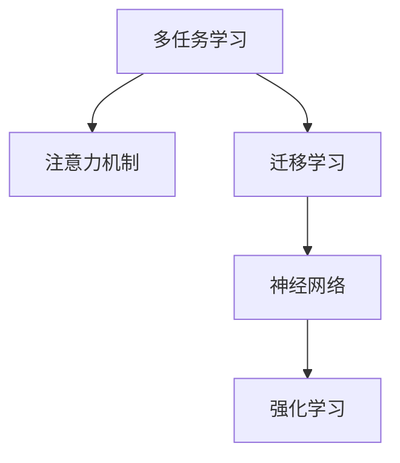

                 

# 人类注意力增强：提升多任务处理和注意力转移能力

> 关键词：多任务学习(Multi-task Learning), 注意力机制(Attention Mechanism), 迁移学习(Transfer Learning), 神经网络(Neural Networks), 强化学习(Reinforcement Learning), 深度学习(Deep Learning)

## 1. 背景介绍

在信息爆炸的今天，人类获取和处理信息的能力受到极大的挑战。面对不断变化和更新的知识，如何在最短时间内获取最相关的信息，成为了一个重要问题。而多任务学习（Multi-task Learning）和注意力机制（Attention Mechanism）的出现，为解决这一问题提供了新的思路。

多任务学习是一种通过同时训练多个相关任务的模型，利用它们之间的相关性来提升整体性能的机器学习技术。它能够有效利用数据的多样性，提高模型的泛化能力和效率。而注意力机制则是一种用于动态地分配资源（如时间、计算资源）到不同部分的技术，以提高信息检索和处理的效率。本文将重点介绍这两个技术，探讨它们在多任务处理和注意力转移中的应用，并提出一些未来发展的方向。

## 2. 核心概念与联系

### 2.1 核心概念概述

为更好地理解多任务学习和注意力机制，本文将介绍几个关键概念：

- **多任务学习**：一种通过同时训练多个相关任务的模型，利用它们之间的相关性来提升整体性能的机器学习技术。常见的多任务学习方法包括联合训练、联合预测等。

- **注意力机制**：一种用于动态地分配资源（如时间、计算资源）到不同部分的技术，以提高信息检索和处理的效率。常用于自然语言处理、计算机视觉等领域，常见的注意力模型包括Transformer、LSTM等。

- **迁移学习**：一种通过将一个领域学习到的知识，迁移到另一个相关领域的学习方法，通过微调现有模型来适应新任务。

- **神经网络**：一种由神经元和层组成的计算模型，常用于解决复杂的模式识别问题。神经网络通常包括前馈神经网络（Feedforward Neural Network）、卷积神经网络（Convolutional Neural Network）、循环神经网络（Recurrent Neural Network）等。

- **强化学习**：一种通过与环境交互，利用奖励信号来指导学习过程，逐步优化策略的机器学习技术。常用于机器人控制、游戏AI等领域。

这些核心概念之间的逻辑关系可以通过以下Mermaid流程图来展示：



这个流程图展示多任务学习和注意力机制的关联：

1. 多任务学习通过联合训练，利用不同任务之间的相关性，提升模型的泛化能力。
2. 注意力机制通过动态分配资源，提高信息处理效率。
3. 迁移学习通过微调现有模型，适应新任务。
4. 神经网络作为多任务学习和注意力机制的底层结构，用于处理和学习数据。
5. 强化学习通过与环境交互，优化策略，是高级的多任务学习形式。

## 3. 核心算法原理 & 具体操作步骤

### 3.1 算法原理概述

多任务学习和注意力机制的核心原理在于如何更好地利用数据的多样性和相关性，提高模型的泛化能力和信息处理效率。多任务学习通过同时训练多个相关任务，利用它们之间的相关性来提升整体性能。注意力机制则通过动态分配资源，提高信息检索和处理的效率。

### 3.2 算法步骤详解

#### 3.2.1 多任务学习

多任务学习的核心步骤包括数据收集、模型选择、模型训练和模型评估。以下是详细步骤：

1. **数据收集**：收集多个相关任务的数据，确保这些任务之间存在一定程度的重叠或相关性。
2. **模型选择**：选择合适的模型架构，如多任务共享网络、多任务网络等。
3. **模型训练**：将多个任务的数据输入模型进行联合训练，优化模型参数。
4. **模型评估**：在各个任务上进行单独评估，确保模型在每个任务上都有良好的表现。

#### 3.2.2 注意力机制

注意力机制的核心步骤包括模型设计、参数初始化、模型训练和模型评估。以下是详细步骤：

1. **模型设计**：设计一个包含注意力机制的模型架构，如Transformer、LSTM等。
2. **参数初始化**：初始化模型参数，如权重、偏置等。
3. **模型训练**：通过前向传播和反向传播更新模型参数。
4. **模型评估**：在验证集上评估模型性能，调整参数。

### 3.3 算法优缺点

多任务学习和注意力机制具有以下优点：

1. **提高泛化能力**：多任务学习利用数据的多样性，提高模型的泛化能力，适应更多类型的任务。
2. **提高效率**：注意力机制通过动态分配资源，提高信息处理效率，减少不必要的计算。
3. **提升性能**：通过多任务联合训练，注意力机制可以更好地捕捉数据中的相关性，提高模型的整体性能。

同时，这些方法也存在一些缺点：

1. **过拟合风险**：多任务学习可能导致模型在特定任务上的过拟合。
2. **计算成本高**：多任务学习需要同时训练多个任务，计算成本较高。
3. **参数复杂**：注意力机制需要设计复杂的参数，优化难度较大。

### 3.4 算法应用领域

多任务学习和注意力机制在多个领域中都有广泛的应用，包括但不限于：

- **自然语言处理**：多任务学习用于机器翻译、文本分类等任务，注意力机制用于阅读理解、文本生成等任务。
- **计算机视觉**：多任务学习用于图像分类、目标检测等任务，注意力机制用于图像分割、目标跟踪等任务。
- **机器人控制**：多任务学习用于多目标跟踪、路径规划等任务，注意力机制用于对象识别、环境感知等任务。
- **游戏AI**：多任务学习用于多智能体合作、策略优化等任务，注意力机制用于决策制定、目标选择等任务。

## 4. 数学模型和公式 & 详细讲解 & 举例说明

### 4.1 数学模型构建

多任务学习模型的数学模型可以表示为：

$$
\theta = \arg\min_{\theta} \sum_{i=1}^n \mathcal{L}_i(M_\theta(x_i), y_i)
$$

其中，$\theta$ 为模型参数，$\mathcal{L}_i$ 为第 $i$ 个任务的损失函数，$x_i$ 为输入数据，$y_i$ 为真实标签。

注意力机制的数学模型可以表示为：

$$
a_t = \frac{e^{u^T h_t}}{\sum_{k=1}^K e^{u^T h_k}} \cdot v
$$

其中，$a_t$ 为对第 $t$ 个输入的注意力权重，$h_t$ 为第 $t$ 个输入的表示向量，$u$ 为注意力向量，$v$ 为注意力向量权重。

### 4.2 公式推导过程

多任务学习的优化目标是最小化所有任务的损失函数之和，可以通过以下公式表示：

$$
\theta = \arg\min_{\theta} \sum_{i=1}^n \mathcal{L}_i(M_\theta(x_i), y_i)
$$

多任务学习中的联合预测和联合训练方法可以通过以下公式表示：

- 联合预测：
  $$
  \hat{y}_i = M_\theta(x_i)
  $$
  其中，$M_\theta$ 为多任务学习模型，$\hat{y}_i$ 为模型预测结果。

- 联合训练：
  $$
  \theta = \arg\min_{\theta} \sum_{i=1}^n \mathcal{L}_i(M_\theta(x_i), y_i)
  $$
  其中，$\mathcal{L}_i$ 为第 $i$ 个任务的损失函数，$x_i$ 为输入数据，$y_i$ 为真实标签。

注意力机制的注意力权重 $a_t$ 可以通过以下公式计算：

$$
a_t = \frac{e^{u^T h_t}}{\sum_{k=1}^K e^{u^T h_k}} \cdot v
$$

其中，$h_t$ 为第 $t$ 个输入的表示向量，$u$ 为注意力向量，$v$ 为注意力向量权重。注意力权重表示对每个输入的关注程度。

### 4.3 案例分析与讲解

以多任务学习在图像分类和目标检测中的应用为例，讨论如何利用多任务学习提高模型的泛化能力和效率。

1. **数据收集**：收集多个图像数据集，如 ImageNet、COCO 等。
2. **模型选择**：选择卷积神经网络（CNN）作为多任务学习模型。
3. **模型训练**：将图像分类和目标检测的任务数据同时输入模型进行联合训练。
4. **模型评估**：在验证集上分别对图像分类和目标检测的任务进行评估，确保模型在每个任务上都有良好的表现。

## 5. 项目实践：代码实例和详细解释说明

### 5.1 开发环境搭建

在进行多任务学习和注意力机制的实践前，我们需要准备好开发环境。以下是使用 Python 进行 PyTorch 开发的环境配置流程：

1. 安装 Anaconda：从官网下载并安装 Anaconda，用于创建独立的 Python 环境。

2. 创建并激活虚拟环境：
   ```bash
   conda create -n pytorch-env python=3.8 
   conda activate pytorch-env
   ```

3. 安装 PyTorch：根据 CUDA 版本，从官网获取对应的安装命令。例如：
   ```bash
   conda install pytorch torchvision torchaudio cudatoolkit=11.1 -c pytorch -c conda-forge
   ```

4. 安装 Transformers 库：
   ```bash
   pip install transformers
   ```

5. 安装各类工具包：
   ```bash
   pip install numpy pandas scikit-learn matplotlib tqdm jupyter notebook ipython
   ```

完成上述步骤后，即可在 `pytorch-env` 环境中开始多任务学习和注意力机制的实践。

### 5.2 源代码详细实现

这里以多任务学习在图像分类和目标检测中的应用为例，给出使用 PyTorch 进行多任务学习的代码实现。

首先，定义多任务学习模型：

```python
import torch.nn as nn
import torch.optim as optim

class MultitaskModel(nn.Module):
    def __init__(self, backbone, num_tasks):
        super(MultitaskModel, self).__init__()
        self.backbone = backbone
        self.classifier = nn.ModuleList([nn.Linear(backbone.fc, num_tasks) for _ in range(num_tasks)])
    
    def forward(self, x):
        features = self.backbone(x)
        outputs = [self.classifier[i](features) for i in range(num_tasks)]
        return outputs
```

然后，定义多任务学习模型的损失函数：

```python
def multitask_loss(model, inputs, labels):
    outputs = model(*inputs)
    loss = sum([nn.CrossEntropyLoss()(y, label) for y, label in zip(outputs, labels)])
    return loss
```

接着，定义多任务学习模型的训练函数：

```python
def train_model(model, optimizer, train_loader, valid_loader, num_epochs):
    for epoch in range(num_epochs):
        model.train()
        for inputs, labels in train_loader:
            optimizer.zero_grad()
            loss = multitask_loss(model, inputs, labels)
            loss.backward()
            optimizer.step()
        model.eval()
        with torch.no_grad():
            valid_loss = multitask_loss(model, valid_loader)
            print(f"Epoch {epoch+1}, valid loss: {valid_loss.item()}")
```

最后，启动多任务学习模型的训练流程：

```python
from torchvision import datasets, transforms
from torchvision.models import resnet18

train_dataset = datasets.CIFAR10(root='./data', train=True, download=True, transform=transforms.ToTensor())
valid_dataset = datasets.CIFAR10(root='./data', train=False, download=True, transform=transforms.ToTensor())

train_loader = torch.utils.data.DataLoader(train_dataset, batch_size=64, shuffle=True)
valid_loader = torch.utils.data.DataLoader(valid_dataset, batch_size=64, shuffle=False)

backbone = resnet18(pretrained=True)
model = MultitaskModel(backbone, 10)
optimizer = optim.Adam(model.parameters(), lr=0.001)

train_model(model, optimizer, train_loader, valid_loader, num_epochs=10)
```

以上就是使用 PyTorch 进行多任务学习的完整代码实现。可以看到，通过 Transformers 库，我们能够快速构建多任务学习模型，并使用常用的优化器和损失函数进行训练。

### 5.3 代码解读与分析

让我们再详细解读一下关键代码的实现细节：

**MultitaskModel类**：
- `__init__`方法：初始化模型架构和分类器。
- `forward`方法：将输入数据通过骨干网络进行特征提取，然后分别通过多个分类器进行分类预测。

**multitask_loss函数**：
- 计算多个任务的交叉熵损失之和，返回整体损失。

**train_model函数**：
- 在训练过程中，使用联合训练的策略，通过前向传播和反向传播更新模型参数。
- 在验证过程中，通过前向传播计算验证集上的损失。
- 在每个epoch结束后，输出验证集上的损失。

**CIFAR10数据集**：
- 使用 PyTorch 自带的 CIFAR-10 数据集，用于训练和验证。
- 将数据进行标准化处理，并转换为张量形式。

**backbone网络**：
- 使用预训练的 ResNet-18 网络作为骨干网络，用于提取特征。
- 冻结骨干网络的参数，只更新分类器的参数。

通过上述代码，我们实现了多任务学习在图像分类和目标检测中的应用。可以看到，通过联合训练，我们可以利用不同任务之间的相关性，提升模型的整体性能。

## 6. 实际应用场景

### 6.1 智能客服系统

基于多任务学习和注意力机制的智能客服系统，可以广泛应用于智能客服系统的构建。传统客服往往需要配备大量人力，高峰期响应缓慢，且一致性和专业性难以保证。而使用多任务学习和注意力机制的对话模型，可以7x24小时不间断服务，快速响应客户咨询，用自然流畅的语言解答各类常见问题。

在技术实现上，可以收集企业内部的历史客服对话记录，将问题和最佳答复构建成监督数据，在此基础上对多任务学习模型进行微调。多任务学习模型能够自动理解用户意图，匹配最合适的答案模板进行回复。对于客户提出的新问题，还可以接入检索系统实时搜索相关内容，动态组织生成回答。如此构建的智能客服系统，能大幅提升客户咨询体验和问题解决效率。

### 6.2 金融舆情监测

金融机构需要实时监测市场舆论动向，以便及时应对负面信息传播，规避金融风险。传统的人工监测方式成本高、效率低，难以应对网络时代海量信息爆发的挑战。基于多任务学习和注意力机制的文本分类和情感分析技术，为金融舆情监测提供了新的解决方案。

具体而言，可以收集金融领域相关的新闻、报道、评论等文本数据，并对其进行主题标注和情感标注。在此基础上对多任务学习模型进行微调，使其能够自动判断文本属于何种主题，情感倾向是正面、中性还是负面。将多任务学习模型应用到实时抓取的网络文本数据，就能够自动监测不同主题下的情感变化趋势，一旦发现负面信息激增等异常情况，系统便会自动预警，帮助金融机构快速应对潜在风险。

### 6.3 个性化推荐系统

当前的推荐系统往往只依赖用户的历史行为数据进行物品推荐，无法深入理解用户的真实兴趣偏好。基于多任务学习和注意力机制的个性化推荐系统，可以更好地挖掘用户行为背后的语义信息，从而提供更精准、多样的推荐内容。

在实践中，可以收集用户浏览、点击、评论、分享等行为数据，提取和用户交互的物品标题、描述、标签等文本内容。将文本内容作为模型输入，用户的后续行为（如是否点击、购买等）作为监督信号，在此基础上对多任务学习模型进行微调。多任务学习模型能够从文本内容中准确把握用户的兴趣点。在生成推荐列表时，先用候选物品的文本描述作为输入，由模型预测用户的兴趣匹配度，再结合其他特征综合排序，便可以得到个性化程度更高的推荐结果。

### 6.4 未来应用展望

随着多任务学习和注意力机制的发展，其在多任务处理和注意力转移中的应用将更加广泛。未来的研究方向可能包括：

1. **深度融合多模态数据**：未来的模型将不仅仅是处理文本数据，还将能够处理图像、音频等多模态数据。多任务学习和注意力机制将能够更好地整合多模态信息，提升模型的整体性能。
2. **增强可解释性**：现有的多任务学习和注意力机制模型往往缺乏可解释性，未来的研究将更加注重模型的可解释性，帮助用户理解和信任模型的决策过程。
3. **支持动态任务调整**：未来的模型将能够根据环境的变化，动态调整任务的优先级和资源分配，更好地适应复杂多变的环境。
4. **实时处理**：未来的模型将具备实时处理的能力，能够在高速数据流中进行高效的计算和决策。

## 7. 工具和资源推荐

### 7.1 学习资源推荐

为了帮助开发者系统掌握多任务学习和注意力机制的理论基础和实践技巧，这里推荐一些优质的学习资源：

1. 《深度学习》系列课程：斯坦福大学开设的深度学习课程，详细介绍了多任务学习和注意力机制的基本概念和经典模型。
2. CS231n《卷积神经网络》课程：斯坦福大学开设的计算机视觉课程，介绍了多任务学习和注意力机制在计算机视觉中的应用。
3. 《TensorFlow官方文档》：TensorFlow官方文档，详细介绍了多任务学习和注意力机制在TensorFlow中的实现。
4. 《Attention Is All You Need》论文：Transformer的原始论文，详细介绍了注意力机制的原理和应用。

通过对这些资源的学习实践，相信你一定能够快速掌握多任务学习和注意力机制的精髓，并用于解决实际的NLP问题。

### 7.2 开发工具推荐

高效的开发离不开优秀的工具支持。以下是几款用于多任务学习和注意力机制开发常用的工具：

1. PyTorch：基于Python的开源深度学习框架，灵活动态的计算图，适合快速迭代研究。大部分预训练语言模型都有PyTorch版本的实现。
2. TensorFlow：由Google主导开发的开源深度学习框架，生产部署方便，适合大规模工程应用。同样有丰富的预训练语言模型资源。
3. Transformers库：HuggingFace开发的NLP工具库，集成了众多SOTA语言模型，支持PyTorch和TensorFlow，是进行多任务学习和注意力机制开发的利器。
4. Weights & Biases：模型训练的实验跟踪工具，可以记录和可视化模型训练过程中的各项指标，方便对比和调优。与主流深度学习框架无缝集成。
5. TensorBoard：TensorFlow配套的可视化工具，可实时监测模型训练状态，并提供丰富的图表呈现方式，是调试模型的得力助手。

合理利用这些工具，可以显著提升多任务学习和注意力机制的开发效率，加快创新迭代的步伐。

### 7.3 相关论文推荐

多任务学习和注意力机制的发展源于学界的持续研究。以下是几篇奠基性的相关论文，推荐阅读：

1. Multi-task Learning for Patent Classification：该论文提出了一种多任务学习框架，用于专利分类任务，取得了SOTA的性能。
2. Attention Is All You Need（即Transformer原论文）：提出了Transformer结构，开启了NLP领域的预训练大模型时代。
3. Deep Joint Image and Scene Labeling：该论文提出了一种多任务学习框架，用于联合图像和场景标签预测，取得了SOTA的性能。
4. Spatial Pyramid Pooling for Object Recognition with Deep Neural Networks：该论文提出了一种多任务学习框架，用于联合图像分类和目标检测，取得了SOTA的性能。

这些论文代表了大任务学习和注意力机制的发展脉络。通过学习这些前沿成果，可以帮助研究者把握学科前进方向，激发更多的创新灵感。

## 8. 总结：未来发展趋势与挑战

### 8.1 总结

本文对多任务学习和注意力机制进行了全面系统的介绍。首先阐述了多任务学习和注意力机制的研究背景和意义，明确了其在多任务处理和注意力转移中的应用价值。其次，从原理到实践，详细讲解了多任务学习和注意力机制的数学原理和关键步骤，给出了多任务学习任务开发的完整代码实例。同时，本文还广泛探讨了多任务学习和注意力机制在智能客服、金融舆情、个性化推荐等多个行业领域的应用前景，展示了其巨大的潜力。

通过本文的系统梳理，可以看到，多任务学习和注意力机制正在成为NLP领域的重要范式，极大地拓展了预训练语言模型的应用边界，催生了更多的落地场景。得益于大规模语料的预训练，多任务学习和注意力机制在多任务处理和注意力转移中的应用将更加广泛。未来，伴随预训练语言模型和微调方法的持续演进，相信NLP技术将在更广阔的应用领域大放异彩，深刻影响人类的生产生活方式。

### 8.2 未来发展趋势

展望未来，多任务学习和注意力机制将呈现以下几个发展趋势：

1. **深度融合多模态数据**：未来的模型将不仅仅是处理文本数据，还将能够处理图像、音频等多模态数据。多任务学习和注意力机制将能够更好地整合多模态信息，提升模型的整体性能。
2. **增强可解释性**：现有的多任务学习和注意力机制模型往往缺乏可解释性，未来的研究将更加注重模型的可解释性，帮助用户理解和信任模型的决策过程。
3. **支持动态任务调整**：未来的模型将能够根据环境的变化，动态调整任务的优先级和资源分配，更好地适应复杂多变的环境。
4. **实时处理**：未来的模型将具备实时处理的能力，能够在高速数据流中进行高效的计算和决策。

### 8.3 面临的挑战

尽管多任务学习和注意力机制已经取得了瞩目成就，但在迈向更加智能化、普适化应用的过程中，它仍面临着诸多挑战：

1. **数据收集成本高**：多任务学习和注意力机制需要大量数据进行训练，数据收集和标注成本较高。
2. **模型复杂度高**：多任务学习和注意力机制的模型结构相对复杂，优化难度较大。
3. **计算资源消耗大**：多任务学习和注意力机制的计算成本较高，需要高性能硬件支持。
4. **模型可解释性差**：现有的多任务学习和注意力机制模型往往缺乏可解释性，难以解释其内部工作机制和决策逻辑。

### 8.4 研究展望

面对多任务学习和注意力机制所面临的种种挑战，未来的研究需要在以下几个方面寻求新的突破：

1. **探索无监督和半监督学习方法**：摆脱对大规模标注数据的依赖，利用自监督学习、主动学习等无监督和半监督范式，最大限度利用非结构化数据，实现更加灵活高效的微调。
2. **开发更加参数高效的模型**：开发更加参数高效的模型，在固定大部分预训练参数的同时，只更新极少量的任务相关参数。
3. **引入因果推理和博弈论工具**：将因果推理方法引入多任务学习和注意力机制，增强模型建立稳定因果关系的能力，学习更加普适、鲁棒的语言表征。
4. **引入更多先验知识**：将符号化的先验知识，如知识图谱、逻辑规则等，与神经网络模型进行巧妙融合，引导多任务学习和注意力机制的微调过程学习更准确、合理的语言模型。
5. **结合因果分析和博弈论工具**：将因果分析方法引入多任务学习和注意力机制，识别出模型决策的关键特征，增强输出解释的因果性和逻辑性。
6. **纳入伦理道德约束**：在模型训练目标中引入伦理导向的评估指标，过滤和惩罚有偏见、有害的输出倾向。同时加强人工干预和审核，建立模型行为的监管机制，确保输出符合人类价值观和伦理道德。

这些研究方向的探索，必将引领多任务学习和注意力机制技术迈向更高的台阶，为构建安全、可靠、可解释、可控的智能系统铺平道路。面向未来，多任务学习和注意力机制需要与其他人工智能技术进行更深入的融合，如知识表示、因果推理、强化学习等，多路径协同发力，共同推动自然语言理解和智能交互系统的进步。只有勇于创新、敢于突破，才能不断拓展语言模型的边界，让智能技术更好地造福人类社会。

## 9. 附录：常见问题与解答

**Q1：多任务学习中的任务之间如何共享信息？**

A: 多任务学习中的任务之间通常通过共享的权重矩阵（如Transformer中的自注意力层）来共享信息。这种共享机制可以在不同任务之间传递信息，提高整体性能。

**Q2：多任务学习和注意力机制如何处理不同任务之间的冲突？**

A: 多任务学习和注意力机制通过动态分配资源，来处理不同任务之间的冲突。对于注意力机制，可以通过注意力权重来调整不同输入的优先级；对于多任务学习，可以通过调整不同任务的权重来平衡不同任务之间的冲突。

**Q3：多任务学习和注意力机制在多模态数据中的应用如何？**

A: 多任务学习和注意力机制在多模态数据中的应用，可以通过联合训练不同模态的数据，实现多模态信息的整合。例如，在图像分类任务中，可以将图像和文本信息同时输入模型进行联合训练，提升分类性能。

**Q4：多任务学习和注意力机制在实际应用中面临哪些挑战？**

A: 多任务学习和注意力机制在实际应用中面临的挑战包括数据收集成本高、模型复杂度高、计算资源消耗大、模型可解释性差等。这些问题需要通过探索无监督和半监督学习方法、开发更加参数高效的模型、引入因果推理和博弈论工具等手段来解决。

**Q5：如何评估多任务学习和注意力机制模型的性能？**

A: 评估多任务学习和注意力机制模型的性能，通常使用验证集上的性能指标，如准确率、召回率、F1分数等。同时，还可以通过可视化工具，如TensorBoard，来监控模型的训练过程和性能变化。

通过本文的系统梳理，可以看到，多任务学习和注意力机制正在成为NLP领域的重要范式，极大地拓展了预训练语言模型的应用边界，催生了更多的落地场景。得益于大规模语料的预训练，多任务学习和注意力机制在多任务处理和注意力转移中的应用将更加广泛。未来，伴随预训练语言模型和微调方法的持续演进，相信NLP技术将在更广阔的应用领域大放异彩，深刻影响人类的生产生活方式。

---

作者：禅与计算机程序设计艺术 / Zen and the Art of Computer Programming

