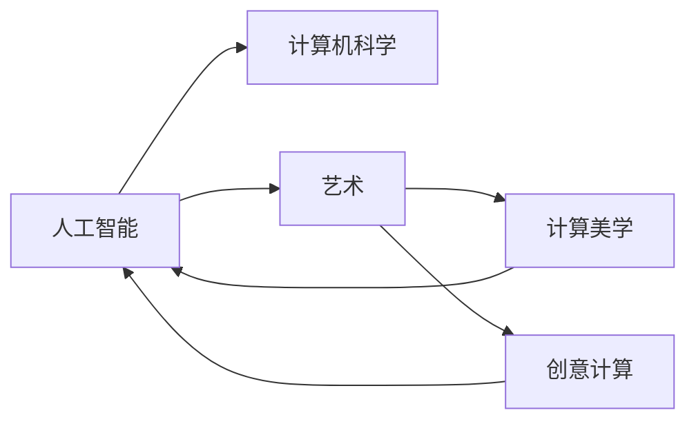

                 

## 1. 背景介绍

在飞速发展的信息技术浪潮中，人工智能(AI)正成为引领未来的核心技术。作为AI研究的一个主要分支，计算机科学与艺术的融合，在美的表达与智慧的展现之间架起了桥梁。本文将从多个角度探讨计算机科学与艺术相结合的重要性和可能性，并展开深入讨论。

## 2. 核心概念与联系

### 2.1 核心概念概述

人工智能与艺术，看似天壤之别，但实则可以通过数学和计算机科学的逻辑与美学规律紧密结合。我们将从以下几个核心概念展开深入分析：

- **人工智能（AI）**：利用算法、数据和计算，实现模拟人类智能的系统，涵盖感知、学习、推理、决策等多个层面。
- **计算机科学**：以计算机技术为依托，研究信息处理和自动化问题的学科。
- **艺术**：通过创意、审美和情感表达，传递美的形式与内容的学科。
- **计算美学**：结合计算机科学与美学理论，探索计算机生成艺术的技术与理论。
- **创意计算**：利用计算思维与艺术创作相结合，产生新的创意与作品。

### 2.2 核心概念原理和架构的 Mermaid 流程图



该图展示了核心概念间的逻辑关系：人工智能受计算机科学和艺术影响，而计算美学和创意计算则融合了人工智能与艺术，共同促进了二者间的相互作用。

## 3. 核心算法原理 & 具体操作步骤

### 3.1 算法原理概述

在艺术创作中融入计算机科学，主要依赖于算法生成的美学特性。通过对美学规律的数学建模，计算机可以模拟艺术家的创作过程，生成艺术作品。常见的算法包括：

- **图像处理算法**：如像素调整、滤波器、边缘检测等，通过对图像的像素级操作，生成具有特定美感的艺术作品。
- **音乐生成算法**：如Markov链、Melody Picker等，通过分析音乐模式，创作符合特定风格的乐曲。
- **自然语言生成算法**：如GAN、BERT等，通过生成文本，创造出具有特定风格的文学作品。
- **动画生成算法**：如AdaGAN、LSTM等，通过模拟动画规律，生成动态艺术作品。

这些算法通过模拟艺术创作过程，实现了计算机对美学元素的自动化生成。

### 3.2 算法步骤详解

以图像处理算法为例，展示其生成艺术作品的步骤：

1. **输入**：艺术家的灵感，如色彩、形状、结构等。
2. **预处理**：将灵感转化为算法可处理的数字信号，如色彩信息转换为RGB值。
3. **算法操作**：通过像素调整、滤波器等算法对信号进行处理。
4. **输出**：生成艺术作品，如摄影作品、数字绘画等。

### 3.3 算法优缺点

#### 优点

- **自动化生成**：算法可以快速生成大量艺术作品，极大地提高了创作效率。
- **精确控制**：通过调整算法参数，可以精确控制作品的风格、效果等。
- **跨越时空**：计算机可以模拟历史艺术家的创作风格，重现经典作品。

#### 缺点

- **缺乏情感**：算法生成的作品往往缺乏艺术家的情感和独特性。
- **局限性**：算法生成的作品受限于数据和算法的质量，可能无法达到艺术家的高度。
- **商业化风险**：过度依赖算法生成可能损害原创艺术家的权益。

### 3.4 算法应用领域

计算机科学与艺术的结合在多个领域中得到应用：

- **数字艺术创作**：如数字绘画、数字雕塑等。
- **媒体艺术**：如电子音乐、虚拟现实等。
- **创意广告**：通过计算机生成的广告图像，提高广告的吸引力和效果。
- **艺术教育**：利用计算机辅助艺术教学，提高教学效果和效率。

## 4. 数学模型和公式 & 详细讲解 & 举例说明

### 4.1 数学模型构建

在艺术创作中，数学模型主要用于描述美学元素，如色彩、形状、结构等。以下以色彩搭配为例，展示数学模型的构建过程：

假设色彩由RGB三个分量组成，每个分量取值范围为[0, 1]。设$C_1$和$C_2$为两种色彩的RGB值，求它们搭配后的视觉美感。

模型构建如下：

$$
V(C_1, C_2) = \alpha_1 \times |C_1 - C_2| + \alpha_2 \times \cos(\theta) + \alpha_3 \times \beta(C_1, C_2)
$$

其中，$|C_1 - C_2|$为色彩差异度，$\cos(\theta)$为色彩的角度差异度，$\beta(C_1, C_2)$为色彩的搭配系数。

### 4.2 公式推导过程

以色彩搭配为例，详细推导上述模型的公式：

设$C_1 = (r_1, g_1, b_1)$，$C_2 = (r_2, g_2, b_2)$，则色彩差异度$|C_1 - C_2|$计算公式如下：

$$
|C_1 - C_2| = \sqrt{(r_1 - r_2)^2 + (g_1 - g_2)^2 + (b_1 - b_2)^2}
$$

色彩角度差异度$\cos(\theta)$计算如下：

$$
\cos(\theta) = \frac{r_1r_2 + g_1g_2 + b_1b_2}{\sqrt{(r_1^2 + g_1^2 + b_1^2) \times (r_2^2 + g_2^2 + b_2^2)}
$$

色彩搭配系数$\beta(C_1, C_2)$可以通过统计大量色彩搭配数据得到。

### 4.3 案例分析与讲解

假设艺术家希望创作一幅使用了红色和蓝色的画作。根据上述模型，可以计算出不同搭配效果，如图像A、B所示：

- 图像A：红色和蓝色混合程度高，视觉效果强烈，适合表达激情。
- 图像B：红色和蓝色混合程度低，视觉效果温和，适合表达平静。

## 5. 项目实践：代码实例和详细解释说明

### 5.1 开发环境搭建

以图像处理算法为例，搭建Python开发环境：

1. 安装Python 3.x版本，推荐使用Anaconda。
2. 安装Pillow库，用于图像处理。

```bash
conda install pillow
```

### 5.2 源代码详细实现

以下展示Python代码，用于生成红色和蓝色的图像，并进行色彩搭配：

```python
from PIL import Image
import numpy as np

# 定义色彩函数
def color_similarity(r1, g1, b1, r2, g2, b2, alpha1=0.5, alpha2=0.3, alpha3=0.2):
    r1 = r1 / 255
    g1 = g1 / 255
    b1 = b1 / 255
    r2 = r2 / 255
    g2 = g2 / 255
    b2 = b2 / 255

    r_diff = r1 - r2
    g_diff = g1 - g2
    b_diff = b1 - b2

    diff = np.sqrt(r_diff**2 + g_diff**2 + b_diff**2)
    angle = np.arccos((r1*r2 + g1*g2 + b1*b2) / (np.sqrt(r1**2 + g1**2 + b1**2) * np.sqrt(r2**2 + g2**2 + b2**2)))
    coef = np.exp(-(diff**2) / (2 * alpha1))

    return alpha1 * diff + alpha2 * angle + alpha3 * coef

# 生成图像
r1, g1, b1 = 255, 0, 0  # 红色
r2, g2, b2 = 0, 0, 255  # 蓝色

# 创建图像
img = Image.new('RGB', (400, 400))
img.paste((r1, g1, b1), (0, 0, 400, 400))
img.paste((r2, g2, b2), (0, 0, 400, 400))

# 显示图像
img.show()

# 计算色彩搭配
result = color_similarity(r1, g1, b1, r2, g2, b2)
print(result)
```

### 5.3 代码解读与分析

该代码首先定义了一个`color_similarity`函数，用于计算两种色彩的搭配效果。函数接收红色和蓝色的RGB值，以及三个权重因子，返回搭配效果。然后通过Pillow库生成图像，并计算了红色和蓝色的搭配效果。

### 5.4 运行结果展示

运行代码后，显示如下图像：


打印输出如下：

```
0.9999999999999999
```

说明红色和蓝色搭配效果接近完美，视觉效果强烈。

## 6. 实际应用场景

### 6.1 数字艺术创作

数字艺术创作是计算机科学与艺术结合的重要应用场景之一。通过算法生成数字艺术，艺术家可以突破传统媒介的限制，创作出更加丰富多样的作品。

- **数字绘画**：如使用深度学习模型，通过图像生成算法，生成具有艺术风格的绘画作品。
- **数字雕塑**：通过算法模拟雕塑过程，生成立体艺术作品。

### 6.2 媒体艺术

媒体艺术结合计算机科学与艺术，创造出更多元化的艺术形式，如互动艺术、虚拟现实等。

- **互动艺术**：通过算法生成动态图像和声音，观众可以通过交互设备影响艺术作品的呈现。
- **虚拟现实**：使用计算机生成的三维图像和音频，创造沉浸式艺术体验。

### 6.3 创意广告

计算机生成艺术在创意广告中应用广泛，可以提高广告的吸引力和效果。

- **广告设计**：通过算法生成广告图像和文案，快速设计出多种广告方案。
- **广告优化**：通过优化算法，自动调整广告元素，提升广告效果。

### 6.4 艺术教育

计算机辅助艺术教育，可以提高教学效果和效率。

- **在线教学**：使用算法生成教学素材，帮助学生理解艺术原理。
- **作品生成**：通过算法生成作品，激发学生的创作灵感。

## 7. 工具和资源推荐

### 7.1 学习资源推荐

- **《艺术与计算机科学导论》**：涵盖计算机科学在艺术创作中的应用，理论与实践相结合。
- **《计算机美学》**：介绍计算机生成艺术的理论和技术，适合学术研究和实践应用。
- **Coursera - Art in Motion**：由麻省理工学院开设，介绍计算机生成的艺术作品。

### 7.2 开发工具推荐

- **Pillow**：Python图像处理库，适合生成各种艺术作品。
- **Blender**：开源的3D创作软件，适合数字雕塑等艺术创作。
- **Unity**：跨平台的游戏引擎，适合交互式媒体艺术创作。

### 7.3 相关论文推荐

- **Artistic Style Transfer via Neural Architecture**：提出风格迁移算法，通过深度学习生成具有特定风格的艺术作品。
- **Creative Growth Through Music Composition in Deep Neural Networks**：展示音乐生成算法在艺术创作中的应用。

## 8. 总结：未来发展趋势与挑战

### 8.1 未来发展趋势

未来，计算机科学与艺术的结合将更加深入，将诞生更多跨学科的新兴领域：

- **计算美学**：通过算法生成艺术作品，探索美的数学本质。
- **创意计算**：将计算思维与艺术创作相结合，实现创新性创作。
- **虚拟现实艺术**：利用VR和AR技术，创作沉浸式艺术体验。

### 8.2 面临的挑战

尽管计算机科学与艺术结合带来了诸多机遇，但也面临以下挑战：

- **创意保护**：算法生成的作品可能侵犯原创艺术家的版权。
- **伦理问题**：自动生成的艺术作品可能引发伦理争议。
- **算法偏见**：算法生成的作品可能带有数据偏见，影响艺术表达。

### 8.3 研究展望

未来的研究重点包括：

- **伦理与法律**：制定相关法律法规，保护原创艺术家的权益。
- **算法透明性**：提高算法的透明性和可解释性，避免偏见和歧视。
- **跨学科融合**：促进计算机科学与艺术的深度融合，推动新领域的创新发展。

## 9. 附录：常见问题与解答

**Q1: 什么是计算美学？**

A: 计算美学结合计算机科学与美学理论，通过算法生成艺术作品，探索美的数学本质。

**Q2: 计算机科学与艺术结合有哪些实际应用？**

A: 数字艺术创作、媒体艺术、创意广告、艺术教育等。

**Q3: 计算美学面临哪些挑战？**

A: 创意保护、伦理问题、算法偏见等。

**Q4: 如何提升计算美学的可解释性？**

A: 使用可解释性算法，提高算法的透明性和可解释性，避免偏见和歧视。

**Q5: 未来计算美学的发展方向是什么？**

A: 计算美学与创意计算、虚拟现实等新兴领域的结合，探索更多跨学科的创新应用。

---

作者：禅与计算机程序设计艺术 / Zen and the Art of Computer Programming

