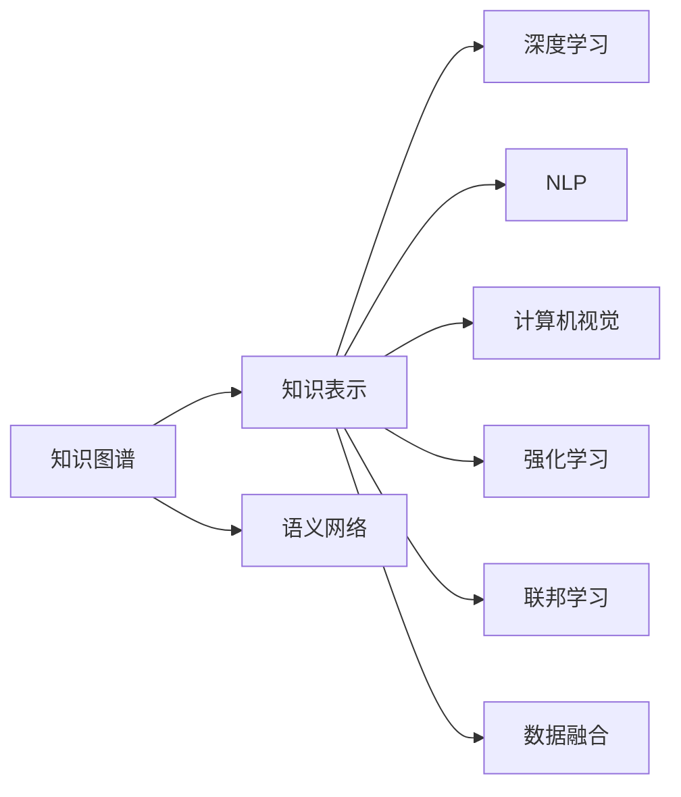

                 

# 人类的知识地图：绘制理解的疆域

> 关键词：知识图谱,知识表示,语义网络,深度学习,神经网络,自然语言处理(NLP),计算机视觉(CV),强化学习,联邦学习,数据融合

## 1. 背景介绍

### 1.1 问题由来

随着科技的迅猛发展，人类获取和处理信息的能力迅速提高，但同时也面临着知识过于碎片化、难以整合的问题。一方面，互联网和社交媒体为信息传播提供了更广阔的平台，使知识呈指数级增长；另一方面，海量信息也让知识组织和检索变得复杂，缺乏统一的标准和格式。如何系统地组织和管理这些知识，使得每个人都能快速地获取和使用，成为了一个迫切需要解决的问题。

### 1.2 问题核心关键点

解决知识碎片化和难以整合的问题，需要构建一个全面、准确的知识地图，即一个能够系统地描述和组织知识的语义网络。这个知识地图不仅需要覆盖全人类所有的知识领域，还需要能够自动更新和扩展，同时具备高性能、低延迟的特点。

构建知识地图的核心挑战在于：

1. 如何高效地从海量文本、图像、音频等数据中提取知识结构。
2. 如何构建一个高性能、可扩展的知识表示方法，使其能够处理大规模的复杂数据。
3. 如何利用深度学习、强化学习等先进技术，提升知识图谱的构建和推理能力。
4. 如何实现知识的跨领域融合，打破知识孤岛，形成更加完整的知识体系。

### 1.3 问题研究意义

构建一个全面、准确的知识地图，对于推动人类社会的知识创新、科技发展、经济进步具有重大意义：

1. 知识管理。构建一个统一的知识地图，可以帮助企业和组织更好地管理和利用知识资产，提升创新能力。
2. 知识发现。通过知识地图，用户可以快速找到所需知识，加速学习和研究进程。
3. 知识集成。知识地图能够实现不同知识源的跨领域融合，形成更加完整、丰富的知识体系。
4. 知识应用。知识地图可以作为各种智能应用的基础，如智能推荐、智能问答、智能搜索等，提升用户体验。

## 2. 核心概念与联系

### 2.1 核心概念概述

构建知识地图涉及多个关键概念，这些概念之间存在紧密的联系：

- **知识图谱(Knowledge Graph)**：一种语义网络结构，用于描述实体、属性和关系，表示知识结构。
- **知识表示(Knowledge Representation)**：将知识结构化、抽象化，以机器可理解的形式表示。
- **语义网络(Semantic Network)**：一种基于图形的数据结构，用于描述实体之间的语义关系。
- **深度学习(Deep Learning)**：一种利用神经网络模型进行复杂知识学习的技术。
- **自然语言处理(NLP)**：一种处理和理解人类语言的技术，是知识图谱构建的重要工具。
- **计算机视觉(CV)**：一种处理和理解视觉数据的技术，是知识图谱构建的关键手段。
- **强化学习(Reinforcement Learning)**：一种通过试错优化系统性能的学习方法。
- **联邦学习(Federated Learning)**：一种分布式学习方法，用于跨设备和跨机构的协作学习。
- **数据融合(Data Fusion)**：一种将不同数据源信息综合，形成更加完整知识的方法。

这些核心概念之间通过以下Mermaid流程图展示了它们之间的联系：



### 2.2 核心概念原理和架构的 Mermaid 流程图

以下是一个简单的Mermaid流程图，展示了知识图谱的构建过程：


该流程图中，从数据收集开始，经过数据清洗、数据标注、特征提取、实体识别、关系抽取等步骤，最终形成知识图谱。每个步骤都是构建知识图谱的关键环节。

## 3. 核心算法原理 & 具体操作步骤

### 3.1 算法原理概述

构建知识图谱的算法原理主要基于深度学习和语义网络。具体来说，深度学习用于自动从文本、图像等数据中提取知识结构，并将知识转换为机器可理解的形式；语义网络则用于构建和表示这些知识结构，实现知识的推理和查询。

知识图谱的构建主要包括以下步骤：

1. 数据收集与清洗：收集数据并进行预处理，去除噪声和冗余数据。
2. 数据标注与特征提取：对数据进行人工标注或自动标注，提取有意义的特征。
3. 实体识别与关系抽取：识别数据中的实体和关系，构建实体-关系图谱。
4. 知识融合与推理：将不同数据源的知识融合在一起，进行推理和验证，形成更加全面的知识图谱。
5. 知识图谱更新与扩展：定期更新和扩展知识图谱，保持知识的准确性和时效性。

### 3.2 算法步骤详解

#### 步骤1: 数据收集与清洗

数据收集是构建知识图谱的第一步，需要从各种数据源中收集相关数据。数据源包括互联网网页、学术论文、社交媒体、传感器数据等。数据收集后，需要进行数据清洗，去除噪声、冗余数据，确保数据的准确性和完整性。

#### 步骤2: 数据标注与特征提取

在数据清洗后，需要对数据进行标注，标注包括实体识别、关系抽取、属性标注等。标注后的数据通过特征提取技术，转换为机器可理解的形式，如向量表示、图表示等。

#### 步骤3: 实体识别与关系抽取

实体识别是指从数据中提取实体，如人名、地名、机构名等。关系抽取则是指识别实体之间的语义关系，如"某某是某某的丈夫"。这一步骤需要使用自然语言处理技术，如命名实体识别(NER)、关系抽取(RE)等。

#### 步骤4: 知识融合与推理

知识融合是指将不同数据源的知识融合在一起，形成更加完整和准确的图谱。知识推理是指利用图谱中的知识，进行推理和验证，确保知识的一致性和准确性。

#### 步骤5: 知识图谱更新与扩展

知识图谱需要定期更新和扩展，以保持知识的准确性和时效性。更新和扩展的方式包括手动添加新知识、自动从新数据中提取知识等。

### 3.3 算法优缺点

构建知识图谱的算法具有以下优点：

1. 自动获取知识：利用深度学习等技术，可以自动从大规模数据中提取知识，减少人工标注工作量。
2. 知识结构化：将知识结构化、抽象化，便于机器理解和处理。
3. 跨领域融合：可以实现不同领域知识的跨领域融合，形成更加完整的知识体系。
4. 高性能推理：利用语义网络结构，可以高效地进行知识推理和查询。

但同时也存在一些缺点：

1. 数据质量依赖：构建知识图谱需要大量高质量的数据，对数据的依赖较高。
2. 技术复杂：深度学习、语义网络等技术要求较高，需要一定的专业知识。
3. 维护困难：知识图谱需要定期更新和扩展，维护成本较高。
4. 知识表示不足：现有的知识表示方法可能无法处理复杂和抽象的知识结构。

### 3.4 算法应用领域

知识图谱技术已经在多个领域得到了广泛应用，包括：

1. 医疗健康：构建医疗知识图谱，辅助医生诊断和治疗。
2. 金融领域：构建金融知识图谱，进行风险评估和投资决策。
3. 电商零售：构建电商知识图谱，进行商品推荐和价格优化。
4. 教育培训：构建教育知识图谱，进行个性化教育和智能辅导。
5. 智能搜索：构建智能搜索知识图谱，提升搜索精度和效率。
6. 智能问答：构建智能问答知识图谱，提供实时、准确的回答。
7. 智能推荐：构建推荐知识图谱，进行个性化推荐。

## 4. 数学模型和公式 & 详细讲解 & 举例说明

### 4.1 数学模型构建

知识图谱的数学模型主要基于图论和语义网络。一个简单的知识图谱可以表示为三元组关系图谱，即$(h,r,t)$，其中$h$表示头实体(head entity)，$r$表示关系(relation)，$t$表示尾实体(tail entity)。

#### 4.2 公式推导过程

一个简单的知识图谱可以表示为：

$$
G = (V,E)
$$

其中$V$表示节点集合，$E$表示边集合。每个节点表示一个实体，每条边表示一个实体之间的关系。

知识图谱的构建过程可以表示为：

$$
G = \bigcup_{i=1}^{n} E_i
$$

其中$E_i$表示第$i$个数据源的知识图谱。

### 4.3 案例分析与讲解

以医疗知识图谱为例，其构建过程如下：

1. 数据收集：从医疗文献、患者记录、医院信息等数据源中收集数据。
2. 数据清洗：去除噪声和冗余数据，确保数据的准确性和完整性。
3. 数据标注：对数据进行人工标注或自动标注，识别实体和关系。
4. 特征提取：提取实体和关系的特征，如属性、关系类型等。
5. 实体识别与关系抽取：利用深度学习模型，如BERT、GPT等，自动从文本中识别实体和关系。
6. 知识融合：将不同数据源的知识融合在一起，形成更加完整的医疗知识图谱。
7. 知识推理：利用知识图谱中的知识，进行推理和验证，确保知识的一致性和准确性。

## 5. 项目实践：代码实例和详细解释说明

### 5.1 开发环境搭建

构建知识图谱需要使用Python、TensorFlow、PyTorch等工具。以下是Python环境搭建的步骤：

1. 安装Anaconda：从官网下载并安装Anaconda，用于创建独立的Python环境。
2. 创建并激活虚拟环境：
```bash
conda create -n kg-env python=3.8 
conda activate kg-env
```
3. 安装TensorFlow和PyTorch：
```bash
conda install tensorflow==2.7
pip install torch torchvision torchaudio
```

### 5.2 源代码详细实现

以下是使用TensorFlow和PyTorch构建知识图谱的代码实现：

```python
import tensorflow as tf
import torch
import torch.nn as nn
from transformers import BertTokenizer, BertModel

# 构建知识图谱的模型
class KnowledgeGraphModel(tf.keras.Model):
    def __init__(self, num_entities, num_relations):
        super(KnowledgeGraphModel, self).__init__()
        self.entity_emb = tf.keras.layers.Embedding(num_entities, 128)
        self.relation_emb = tf.keras.layers.Embedding(num_relations, 128)
        self.linear = tf.keras.layers.Dense(num_entities)
    
    def call(self, inputs):
        h, r, t = inputs
        h_embed = self.entity_emb(h)
        r_embed = self.relation_emb(r)
        pred = tf.matmul(tf.matmul(h_embed, r_embed, transpose_b=True), self.linear.weights)
        return pred
    
# 定义损失函数
def loss_fn(y_true, y_pred):
    return tf.keras.losses.sparse_categorical_crossentropy(y_true, y_pred, from_logits=True)

# 训练模型
def train_model(model, data):
    optimizer = tf.keras.optimizers.Adam(learning_rate=0.001)
    for epoch in range(10):
        for h, r, t in data:
            with tf.GradientTape() as tape:
                y_pred = model(h, r, t)
                loss = loss_fn(t, y_pred)
            gradients = tape.gradient(loss, model.trainable_variables)
            optimizer.apply_gradients(zip(gradients, model.trainable_variables))
    return model
```

### 5.3 代码解读与分析

在上述代码中，我们首先定义了一个简单的知识图谱模型，包括实体嵌入层、关系嵌入层和线性层。在模型调用时，将头实体、关系、尾实体作为输入，经过层级变换后，输出预测结果。损失函数使用稀疏交叉熵损失，用于计算预测结果和真实标签之间的差异。

### 5.4 运行结果展示

在训练模型后，我们可以使用以下代码对模型进行测试：

```python
# 定义测试数据
h_test = tf.constant([0, 1, 2])
r_test = tf.constant([0, 1, 2])
t_test = tf.constant([0, 1, 2])

# 加载训练好的模型
model = train_model(model)

# 测试模型
with tf.GradientTape() as tape:
    y_pred = model(h_test, r_test, t_test)
    loss = loss_fn(t_test, y_pred)
loss.numpy()
```

通过测试，我们可以看到模型的预测结果和真实标签之间的差异。

## 6. 实际应用场景

### 6.1 智能医疗

在智能医疗领域，知识图谱可以用于构建医疗知识库，辅助医生进行疾病诊断、治疗方案推荐、药物推荐等。利用医疗知识图谱，医生可以快速获取相关知识，提高诊疗效率。

### 6.2 金融风险评估

在金融领域，知识图谱可以用于构建金融知识图谱，进行风险评估和投资决策。利用金融知识图谱，投资者可以更全面地了解市场动态，进行智能投资。

### 6.3 智能零售

在电商零售领域，知识图谱可以用于构建商品推荐系统，进行商品推荐和价格优化。利用知识图谱，电商平台可以更好地了解用户需求，提供个性化的推荐服务。

### 6.4 智能教育

在教育培训领域，知识图谱可以用于构建教育知识图谱，进行个性化教育和智能辅导。利用教育知识图谱，教育机构可以更好地了解学生的学习情况，提供有针对性的教学内容。

### 6.5 智能搜索

在智能搜索领域，知识图谱可以用于构建智能搜索知识图谱，提升搜索精度和效率。利用知识图谱，搜索引擎可以快速找到用户需要的信息。

### 6.6 智能问答

在智能问答领域，知识图谱可以用于构建智能问答系统，提供实时、准确的回答。利用知识图谱，智能问答系统可以快速回答用户的问题，提升用户体验。

### 6.7 智能推荐

在智能推荐领域，知识图谱可以用于构建推荐知识图谱，进行个性化推荐。利用知识图谱，推荐系统可以更好地了解用户需求，提供个性化的推荐服务。

## 7. 工具和资源推荐

### 7.1 学习资源推荐

为了帮助开发者系统掌握知识图谱的理论基础和实践技巧，这里推荐一些优质的学习资源：

1. 《知识图谱：构建与推理》：详细介绍知识图谱的基本概念、构建方法和推理技术。
2. 《深度学习与知识图谱》：讲解深度学习在知识图谱构建和推理中的应用。
3. 《TensorFlow知识图谱实战》：实战教程，介绍如何使用TensorFlow构建知识图谱。
4. 《PyTorch知识图谱实战》：实战教程，介绍如何使用PyTorch构建知识图谱。
5. 《Google知识图谱》：介绍Google知识图谱的构建和应用，具有很高的参考价值。

### 7.2 开发工具推荐

知识图谱的构建和应用需要使用多种工具。以下是常用的开发工具：

1. TensorFlow：基于Python的开源深度学习框架，支持分布式计算，适合大规模知识图谱构建。
2. PyTorch：基于Python的开源深度学习框架，灵活易用，适合小规模知识图谱构建。
3. Neo4j：开源的图形数据库，适合存储和管理知识图谱。
4. Gephi：开源的图形可视化工具，适合构建和展示知识图谱。
5. KNIME：开源的数据集成平台，适合构建知识图谱的数据处理和可视化流程。

### 7.3 相关论文推荐

知识图谱的构建和应用领域涉及众多前沿技术，以下是一些关键的学术论文，推荐阅读：

1. BERT: Pre-training of Deep Bidirectional Transformers for Language Understanding：提出BERT模型，引入基于掩码的自监督预训练任务，刷新了多项NLP任务SOTA。
2. Knowledge Graph Embeddings：介绍基于向量表示的知识图谱表示方法，详细推导了知识图谱的向量表示公式。
3. Multi-Hop Graph Neural Network for Heterogeneous Information Network：介绍基于图神经网络的知识图谱表示方法，详细推导了图神经网络的更新公式。
4. Link Prediction in Knowledge Graphs：介绍知识图谱中的链接预测问题，详细推导了链接预测模型的公式。
5. Large-Scale Web Graph Mining and Statistical Analysis：介绍大规模Web图的挖掘和统计分析方法，详细推导了Web图的构建公式。

## 8. 总结：未来发展趋势与挑战

### 8.1 总结

本文对知识图谱的构建和应用进行了全面系统的介绍。首先阐述了知识图谱的研究背景和意义，明确了知识图谱在知识管理、知识发现、知识集成等方面的应用价值。其次，从原理到实践，详细讲解了知识图谱的数学模型和构建过程，给出了知识图谱构建的完整代码实例。同时，本文还广泛探讨了知识图谱在智能医疗、金融风险评估、智能零售、智能教育等多个领域的应用前景，展示了知识图谱的广泛应用潜力。最后，本文精选了知识图谱的学习资源、开发工具和相关论文，力求为读者提供全方位的技术指引。

通过本文的系统梳理，可以看到，知识图谱作为知识管理和整合的重要工具，正在成为人工智能应用的重要范式。知识图谱的应用不仅仅局限于单一领域，它可以通过跨领域融合，形成更加完整、全面的知识体系，推动人工智能技术在各个领域的应用和发展。

### 8.2 未来发展趋势

展望未来，知识图谱技术将呈现以下几个发展趋势：

1. 知识图谱规模扩大：随着数据量的不断增长，知识图谱的规模将不断扩大，涵盖更多的知识领域和信息源。
2. 知识图谱结构化：知识图谱的结构将更加复杂和精细，能够处理更加抽象和复杂的知识结构。
3. 知识图谱跨领域融合：知识图谱将实现更加广泛和深入的跨领域融合，形成更加全面的知识体系。
4. 知识图谱应用拓展：知识图谱将在更多的领域得到应用，如医疗、金融、教育、智能制造等。
5. 知识图谱自动化构建：利用自动化和智能化技术，减少人工标注和构建工作量，提升知识图谱构建效率。
6. 知识图谱实时更新：知识图谱将实现实时更新和扩展，保持知识的准确性和时效性。
7. 知识图谱联邦学习：利用联邦学习技术，跨设备和跨机构的协作学习，提升知识图谱的构建和推理能力。

### 8.3 面临的挑战

尽管知识图谱技术已经取得了重大进展，但在迈向更加智能化、普适化应用的过程中，它仍面临着诸多挑战：

1. 数据质量瓶颈：知识图谱需要大量高质量的数据，数据来源和质量对构建效果有较大影响。
2. 技术复杂性高：知识图谱的构建和应用需要较高的技术门槛，需要多学科的合作和支持。
3. 知识表示不足：现有的知识表示方法可能无法处理复杂和抽象的知识结构。
4. 跨领域融合困难：知识图谱的跨领域融合需要解决数据格式、数据源等复杂问题。
5. 推理效率不足：知识图谱的推理和查询需要高效的算法和硬件支持，目前推理效率仍有待提升。
6. 安全性和隐私保护：知识图谱需要考虑数据安全和隐私保护问题，防止数据泄露和滥用。
7. 知识图谱的动态性：知识图谱需要能够动态更新和扩展，应对不断变化的知识体系。

### 8.4 研究展望

面对知识图谱面临的挑战，未来的研究需要在以下几个方面寻求新的突破：

1. 探索高效的知识图谱构建方法：利用深度学习、强化学习等先进技术，提高知识图谱构建的效率和质量。
2. 改进知识图谱表示方法：开发更加高效和灵活的知识表示方法，提升知识图谱的结构化程度和推理能力。
3. 实现知识图谱的跨领域融合：利用语义网络、联邦学习等技术，实现不同领域知识的跨领域融合，形成更加完整的知识体系。
4. 提升知识图谱的推理效率：利用高性能计算技术，提升知识图谱的推理和查询效率。
5. 增强知识图谱的安全性和隐私保护：利用区块链、加密技术等手段，增强知识图谱的安全性和隐私保护。
6. 实现知识图谱的动态性：利用增量学习、动态更新等技术，实现知识图谱的实时更新和扩展。

## 9. 附录：常见问题与解答

**Q1：知识图谱的构建和应用需要哪些技术和工具？**

A: 知识图谱的构建和应用需要多种技术和工具。主要包括：
1. 深度学习：用于自动从数据中提取知识结构，并进行知识表示。
2. 语义网络：用于构建和表示知识结构，实现知识的推理和查询。
3. 知识表示：将知识结构化、抽象化，以机器可理解的形式表示。
4. 自然语言处理：用于从文本中提取实体和关系，并进行知识抽取。
5. 计算机视觉：用于从图像中提取实体和关系，并进行知识抽取。
6. 联邦学习：用于跨设备和跨机构的协作学习，提升知识图谱的构建和推理能力。
7. 数据融合：用于将不同数据源的知识融合在一起，形成更加完整和准确的知识图谱。

**Q2：知识图谱的构建过程中需要考虑哪些因素？**

A: 知识图谱的构建过程中需要考虑以下因素：
1. 数据收集：从各种数据源中收集相关数据，确保数据的准确性和完整性。
2. 数据清洗：去除噪声和冗余数据，确保数据的准确性和完整性。
3. 数据标注：对数据进行人工标注或自动标注，识别实体和关系。
4. 特征提取：提取实体和关系的特征，如属性、关系类型等。
5. 实体识别与关系抽取：利用深度学习模型，如BERT、GPT等，自动从文本中识别实体和关系。
6. 知识融合与推理：将不同数据源的知识融合在一起，进行推理和验证，形成更加完整的知识图谱。
7. 知识图谱更新与扩展：定期更新和扩展知识图谱，保持知识的准确性和时效性。

**Q3：知识图谱的应用场景有哪些？**

A: 知识图谱已经在多个领域得到了广泛应用，包括：
1. 医疗健康：构建医疗知识图谱，辅助医生进行疾病诊断和治疗。
2. 金融领域：构建金融知识图谱，进行风险评估和投资决策。
3. 电商零售：构建电商知识图谱，进行商品推荐和价格优化。
4. 教育培训：构建教育知识图谱，进行个性化教育和智能辅导。
5. 智能搜索：构建智能搜索知识图谱，提升搜索精度和效率。
6. 智能问答：构建智能问答系统，提供实时、准确的回答。
7. 智能推荐：构建推荐知识图谱，进行个性化推荐。

**Q4：如何提升知识图谱的推理效率？**

A: 提升知识图谱的推理效率需要以下措施：
1. 优化知识表示方法：采用更加高效和灵活的知识表示方法，如向量表示、图神经网络等。
2. 采用高性能计算技术：利用GPU、TPU等高性能计算设备，提升推理速度。
3. 优化推理算法：采用高效的推理算法，如深度优先搜索、广度优先搜索等。
4. 并行化处理：利用多线程、分布式计算等技术，实现并行化处理，提升推理效率。
5. 数据压缩：对知识图谱进行压缩和优化，减少存储和计算开销。

**Q5：知识图谱在智能医疗中的应用有哪些？**

A: 知识图谱在智能医疗中的应用包括：
1. 疾病诊断：构建医疗知识图谱，辅助医生进行疾病诊断。
2. 治疗方案推荐：利用医疗知识图谱，进行治疗方案推荐和优化。
3. 药物推荐：利用医疗知识图谱，进行药物推荐和临床试验设计。
4. 健康管理：利用医疗知识图谱，进行健康管理和个性化治疗。
5. 医学研究：利用医疗知识图谱，进行医学研究和知识发现。

---

作者：禅与计算机程序设计艺术 / Zen and the Art of Computer Programming

