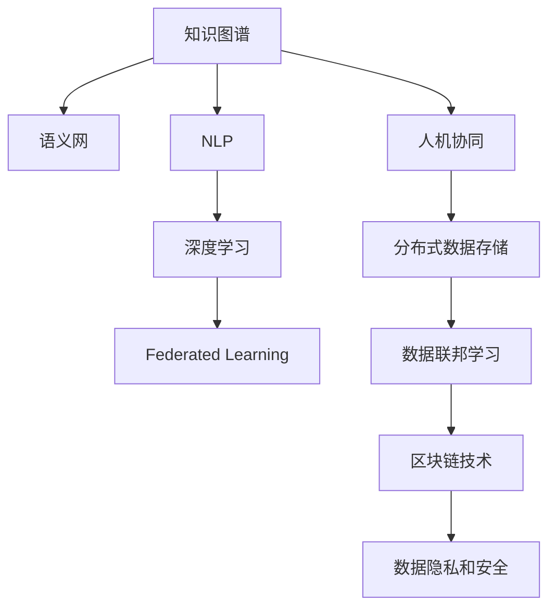

                 

# 人类的知识库：构建永不停歇

> 关键词：知识图谱,语义网,自然语言处理,NLP,深度学习,联邦学习,人机协同,人工智能

## 1. 背景介绍

### 1.1 问题由来
随着互联网的普及，人类知识正以前所未有的速度激增。据统计，全球互联网数据量以每年40%的速度增长，预计到2025年将达到175ZB。这种爆炸式增长的数据不仅包含结构化数据，也涵盖了半结构化和非结构化数据，如文本、音频、视频、图像等。如何高效地组织、存储和利用这些知识，是人类社会面临的一项巨大挑战。

### 1.2 问题核心关键点
为了应对这一挑战，世界各地的研究机构和企业都在积极探索和构建“人类的知识库”。核心问题在于如何构建一个能够广泛集成、共享、管理和利用人类知识的基础设施，使其成为未来智能社会的重要支撑。

### 1.3 问题研究意义
构建“人类的知识库”对于提升人类社会的知识利用效率，推动经济社会发展，有着深远的影响：

- 提升知识利用效率。通过集中存储和组织知识，使其易于获取和应用，加速知识创新和产业升级。
- 促进经济发展。知识是经济增长的关键因素，良好的知识库有助于提升产业竞争力，驱动经济增长。
- 推动社会进步。知识是人类文明进步的基石，构建知识库可以提升公众教育水平，促进社会公正和进步。
- 支持智能应用。知识库是人工智能的重要基础，为自然语言处理、机器学习、智能推荐等应用提供强大的数据支撑。

### 1.4 问题研究现状
目前，知识库的构建主要依赖于数据库、数据仓库、搜索引擎等技术，但这些技术往往难以处理大规模半结构化和非结构化数据，无法充分利用人类知识的全貌。相比之下，语义网（Semantic Web）和知识图谱（Knowledge Graph）技术，通过构建以语义为核心的数据网络，提供了更为丰富的数据表达和利用方式。

## 2. 核心概念与联系

### 2.1 核心概念概述

为了更好地理解“人类的知识库”的构建过程，本节将介绍几个核心概念及其之间的联系：

- **知识图谱（Knowledge Graph）**：一种结构化的语义网络，将实体和关系以图的形式表示出来，用于描述和组织知识。
- **语义网（Semantic Web）**：一种利用Web技术描述、处理和共享语义信息的网络，通过RDF、OWL等语言实现语义化数据表达。
- **自然语言处理（NLP）**：一种利用计算机技术处理和理解自然语言的学科，涉及文本分析、情感分析、机器翻译等技术。
- **深度学习（Deep Learning）**：一种基于多层神经网络的机器学习技术，广泛应用于图像识别、语音识别、自然语言处理等领域。
- **联邦学习（Federated Learning）**：一种分布式机器学习技术，多个客户端联合训练模型，避免数据集中存储带来的隐私和安全风险。
- **人机协同（Human-Machine Collaboration）**：一种强调人与机器协同工作的模式，通过知识共享和知识增强提升机器的智能水平。

这些概念之间具有紧密的联系，通过协同合作，可以在大规模数据和知识的海量环境中，构建出一个高效、安全、易用的“人类的知识库”。

### 2.2 核心概念原理和架构的 Mermaid 流程图



此流程图展示了各核心概念间的联系。知识图谱是语义网的基础，NLP与深度学习用于数据处理和模型训练，联邦学习与区块链技术保证了数据隐私和安全，而人机协同则实现了知识的共享与增强。

## 3. 核心算法原理 & 具体操作步骤

### 3.1 算法原理概述

构建“人类的知识库”的核心算法原理基于语义网和知识图谱的技术，通过将知识表示为RDF图，将实体和关系进行语义化处理，从而实现知识的自动组织和推理。具体步骤包括：

1. **知识抽取**：从大规模数据中抽取实体、属性和关系，构建知识图谱的基本单元。
2. **知识融合**：将多源异构数据进行语义对齐和融合，形成统一的知识表示。
3. **知识推理**：通过逻辑推理和规则，发现知识图谱中的隐含关系和潜在模式，丰富知识的表达和利用。
4. **知识应用**：将知识图谱应用于自然语言处理、智能推荐、智能搜索等场景，提升应用的智能化水平。

### 3.2 算法步骤详解

构建“人类的知识库”主要包括以下几个关键步骤：

**Step 1: 知识抽取**

知识抽取是构建知识图谱的基础。常用的知识抽取方法包括：

- 基于规则的抽取：通过定义语法和规则，自动抽取文本中的实体和关系。
- 基于统计的抽取：使用机器学习算法，如CRF、LSTM等，从文本中自动识别实体和关系。
- 基于深度学习的抽取：利用预训练语言模型，如BERT、GPT等，对文本进行特征提取和实体识别。

以BERT为例，抽取过程如下：

1. 使用BERT将文本转换为向量表示。
2. 使用CRF或LSTM等序列模型对向量进行标注，识别出实体。
3. 根据上下文和语法规则，确定实体之间的关系。

**Step 2: 知识融合**

知识融合是将多源异构数据进行语义对齐和融合的过程。常用的知识融合方法包括：

- 基于匹配的融合：通过规则或算法，将不同数据源中的实体和关系进行匹配和对齐。
- 基于图结构的融合：构建统一的知识图谱，使用图算法进行数据融合。
- 基于分布式的融合：使用联邦学习等技术，在多个客户端联合训练模型，实现数据融合。

**Step 3: 知识推理**

知识推理是通过逻辑推理和规则，发现知识图谱中的隐含关系和潜在模式。常用的知识推理方法包括：

- 基于规则的推理：使用逻辑规则和知识库，进行逻辑推断。
- 基于统计的推理：通过机器学习算法，预测知识图谱中的关系。
- 基于深度学习的推理：利用神经网络模型，进行端到端知识推理。

**Step 4: 知识应用**

知识应用是将知识图谱应用于实际场景的过程。常用的知识应用方法包括：

- 自然语言处理：使用知识图谱进行实体链接、实体识别、关系抽取等，提升NLP的准确性。
- 智能推荐：基于知识图谱进行实体推荐、关系推荐、协同过滤等，提升推荐系统的个性化水平。
- 智能搜索：通过知识图谱进行精确搜索、相关性搜索、问答系统等，提升搜索效率和效果。

### 3.3 算法优缺点

构建“人类的知识库”的算法具有以下优点：

1. 高效性：通过自动化和半自动化的抽取和融合过程，大幅提升了知识获取的效率。
2. 全面性：利用语义网络技术，对知识进行全面、系统的组织，避免了知识孤岛问题。
3. 灵活性：使用分布式计算和联邦学习等技术，适应了数据分布式存储的需求。

同时，也存在一些局限性：

1. 复杂性：知识抽取和融合过程涉及大量复杂的规则和算法，需要高水平的技术支撑。
2. 准确性：知识抽取和推理过程中存在噪声和不确定性，需要不断优化和迭代。
3. 隐私风险：大规模数据和知识的处理存在隐私和安全风险，需要严格的隐私保护措施。

### 3.4 算法应用领域

构建“人类的知识库”的应用领域非常广泛，涵盖多个行业和领域：

- **医疗领域**：构建医学知识图谱，支持临床决策支持、疾病诊断、药物研发等。
- **金融领域**：构建金融知识图谱，支持风险管理、投资分析、智能投顾等。
- **教育领域**：构建教育知识图谱，支持个性化学习、智能辅导、知识推荐等。
- **社交领域**：构建社交知识图谱，支持智能推荐、用户行为分析、情感分析等。
- **商业领域**：构建商业知识图谱，支持市场分析、客户画像、智能推荐等。

## 4. 数学模型和公式 & 详细讲解 & 举例说明

### 4.1 数学模型构建

知识图谱的数学模型主要基于RDF（资源描述框架）和OWL（Web本体语言），用于描述和表示知识。

**RDF三重组表示**：
- 实体（Subject）
- 属性（Predicate）
- 实体（Object）

**OWL语义描述**：
- 类（Class）：表示实体的类型或属性
- 属性（Property）：表示实体的属性或关系
- 个体（Individual）：表示具体的实例

### 4.2 公式推导过程

以一个简单的医疗知识图谱为例，其数学模型构建如下：

1. 定义实体和属性
- 患者（Patient）
- 疾病（Disease）
- 治疗（Treatment）
- 症状（Symptom）

2. 构建RDF三重组
- （Patient1, hasDisease, DiseaseA）
- （DiseaseA, hasTreatment, TreatmentX）
- （Patient1, hasSymptom, SymptomB）

3. 使用OWL描述关系
- <Patient, hasSymptom, Symptom>
- <Disease, hasTreatment, Treatment>

### 4.3 案例分析与讲解

以Google的Healthcare Knowledge Graph为例，其构建过程如下：

1. 知识抽取：从医学文献、临床数据等来源中抽取实体和关系，构建初步的知识图谱。
2. 知识融合：使用逻辑规则和匹配算法，将不同数据源中的知识进行对齐和融合。
3. 知识推理：利用深度学习模型，发现知识图谱中的隐含关系和模式。
4. 知识应用：用于支持临床决策支持、疾病诊断、药物研发等场景。

通过分析Google Healthcare Knowledge Graph的构建过程，可以更好地理解知识图谱技术的实际应用和效果。

## 5. 项目实践：代码实例和详细解释说明

### 5.1 开发环境搭建

构建“人类的知识库”需要强大的计算资源和工具支持。以下是使用Python进行TensorFlow和PyTorch开发的开发环境配置流程：

1. 安装Anaconda：从官网下载并安装Anaconda，用于创建独立的Python环境。

2. 创建并激活虚拟环境：
```bash
conda create -n graph-env python=3.8 
conda activate graph-env
```

3. 安装TensorFlow和PyTorch：根据CUDA版本，从官网获取对应的安装命令。例如：
```bash
conda install tensorflow=2.5 
conda install pytorch torchvision torchaudio cudatoolkit=11.1 -c pytorch -c conda-forge
```

4. 安装各类工具包：
```bash
pip install numpy pandas scikit-learn matplotlib tqdm jupyter notebook ipython
```

完成上述步骤后，即可在`graph-env`环境中开始项目实践。

### 5.2 源代码详细实现

我们以构建简单的医疗知识图谱为例，展示TensorFlow和PyTorch的代码实现。

首先，定义实体和属性：

```python
import tensorflow as tf
from tensorflow.keras.layers import Dense, Input, Embedding

class KnowledgeGraph(tf.keras.Model):
    def __init__(self, num_entities, num_relations, embedding_dim=100):
        super(KnowledgeGraph, self).__init__()
        self.num_entities = num_entities
        self.num_relations = num_relations
        self.embedding = Embedding(num_entities, embedding_dim)
        self.dense = Dense(num_relations, activation='softmax')

    def call(self, x):
        entity = self.embedding(x)
        return self.dense(entity)

# 定义实体和属性
entities = ["Patient", "Disease", "Treatment", "Symptom"]
relations = ["hasDisease", "hasTreatment", "hasSymptom"]
```

然后，定义模型训练过程：

```python
# 定义训练数据集
train_data = [("Patient1", "hasDisease", "DiseaseA"), ("DiseaseA", "hasTreatment", "TreatmentX"), ("Patient1", "hasSymptom", "SymptomB")]

# 构建模型
model = KnowledgeGraph(num_entities=len(entities), num_relations=len(relations))

# 定义损失函数和优化器
loss_fn = tf.keras.losses.SparseCategoricalCrossentropy()
optimizer = tf.keras.optimizers.Adam()

# 训练过程
for epoch in range(10):
    for (s, r, o) in train_data:
        with tf.GradientTape() as tape:
            x = model(s)
            loss = loss_fn(x, o)
        gradients = tape.gradient(loss, model.trainable_variables)
        optimizer.apply_gradients(zip(gradients, model.trainable_variables))
```

最后，测试模型并进行推理：

```python
# 测试数据集
test_data = [("Patient2", "hasDisease", "DiseaseB"), ("DiseaseB", "hasTreatment", "TreatmentY"), ("Patient2", "hasSymptom", "SymptomC")]

# 测试模型
model(tf.constant(test_data[0][0], dtype=tf.int32))

# 推理结果
predictions = model(tf.constant(test_data[0][0], dtype=tf.int32))
```

以上就是使用TensorFlow和PyTorch构建简单医疗知识图谱的完整代码实现。可以看到，TensorFlow和PyTorch提供了强大的计算能力和灵活的API，使得模型构建和训练变得便捷高效。

### 5.3 代码解读与分析

让我们再详细解读一下关键代码的实现细节：

**KnowledgeGraph类**：
- `__init__`方法：初始化实体和属性数量，定义嵌入层和全连接层。
- `call`方法：前向传播过程，通过嵌入层和全连接层，得到预测结果。

**训练过程**：
- 定义训练数据集，包括实体和关系。
- 构建模型，包括嵌入层和全连接层。
- 定义损失函数和优化器。
- 使用梯度下降优化模型，更新模型参数。

**测试和推理**：
- 定义测试数据集。
- 使用测试数据对模型进行推理，输出预测结果。

通过上述代码，可以更好地理解TensorFlow和PyTorch在构建知识图谱中的应用。

## 6. 实际应用场景

### 6.1 智能医疗

知识图谱在医疗领域的应用极为广泛，可以通过自动化的知识抽取和融合，构建医学知识图谱，用于支持临床决策支持、疾病诊断、药物研发等。

以IBM Watson Health为例，其构建了庞大的医学知识图谱，包含数百万个实体和关系，用于支持医生诊断、病历分析、药物推荐等。通过知识图谱的辅助，医生能够快速获取最新的医学信息，提升诊疗水平。

### 6.2 智能金融

金融领域需要实时处理海量数据，构建金融知识图谱可以提升风险管理、投资分析和智能投顾等应用的准确性和效率。

以高盛（Goldman Sachs）为例，其利用知识图谱技术，构建了金融知识图谱，用于分析市场趋势、识别风险点、推荐投资策略等。通过知识图谱的辅助，金融分析师能够更加精准地进行决策，提升投资回报率。

### 6.3 智能推荐

知识图谱在推荐系统中的应用主要集中在实体推荐和关系推荐上。通过抽取用户和物品的实体，构建用户-物品关系图谱，可以实现个性化的推荐。

以Amazon为例，其利用知识图谱技术，构建了商品知识图谱，用于推荐相似商品、关联商品、热销商品等。通过知识图谱的辅助，Amazon能够更加精准地进行推荐，提升用户满意度。

### 6.4 未来应用展望

随着知识图谱技术的不断发展，未来将在更多领域得到应用，为各行各业带来变革性影响。

- **智能制造**：构建制造业知识图谱，用于生产计划、设备维护、质量控制等。
- **智慧农业**：构建农业知识图谱，用于作物识别、土壤分析、病虫害预测等。
- **智能交通**：构建交通知识图谱，用于路线规划、事故预测、交通管理等。
- **智慧能源**：构建能源知识图谱，用于能源消耗分析、能源调度优化等。
- **智能教育**：构建教育知识图谱，用于个性化学习、知识推荐、智能辅导等。

## 7. 工具和资源推荐

### 7.1 学习资源推荐

为了帮助开发者系统掌握知识图谱的理论基础和实践技巧，这里推荐一些优质的学习资源：

1. 《知识图谱概论》系列书籍：介绍知识图谱的基本概念、构建方法和应用场景。
2. Stanford CS224N《深度学习自然语言处理》课程：涵盖知识图谱在NLP中的应用，包括抽取、融合、推理等技术。
3. 《TensorFlow实战》系列书籍：详细讲解TensorFlow在知识图谱中的应用，包括构建、训练和推理等。
4. 《Python知识图谱实践》系列文章：介绍Python在知识图谱中的应用，包括代码实现和案例分析。
5. 《知识图谱在商业应用中的实践》系列文章：介绍知识图谱在电商、金融、医疗等领域的实际应用案例。

通过对这些资源的学习实践，相信你一定能够快速掌握知识图谱的精髓，并用于解决实际的NLP问题。

### 7.2 开发工具推荐

高效的开发离不开优秀的工具支持。以下是几款用于知识图谱开发的常用工具：

1. Neo4j：基于Cypher语言的知识图谱数据库，支持高效的图查询和分析。
2. Gephi：用于可视化和分析知识图谱的工具，支持多种布局算法和分析方法。
3. RapidMiner：数据科学和机器学习平台，支持知识图谱构建、训练和推理等。
4. JaCoP：基于Jena的知识图谱推理引擎，支持复杂逻辑推理和规则引擎。
5. ELK Stack：用于构建、搜索和分析知识图谱的工具栈，支持Solr、ElasticSearch和Lucene等。

合理利用这些工具，可以显著提升知识图谱构建的效率，加快创新迭代的步伐。

### 7.3 相关论文推荐

知识图谱和语义网的研究源于学界的持续探索。以下是几篇奠基性的相关论文，推荐阅读：

1. Linked Data: The Semantic Web as a Knowledge Network（Linked Data）：提出语义网的基本概念和技术框架。
2. The Anatomy of a Large-Scale Linked Data Integration Project（Anatomy）：介绍了Linked Data的实际应用和效果。
3. ConceptNet 4: A Semantic Network of General Knowledge（ConceptNet）：介绍了一个大规模的知识图谱，用于语义推理和知识发现。
4. Knowledge Graphs（KBQA）：介绍了知识图谱在问答系统中的应用，提升了问答系统的准确性和效率。
5. LSTM Networks for Named Entity Recognition（LSTM）：介绍了一种基于LSTM的知识抽取方法，提高了抽取的准确性。

这些论文代表了大规模知识图谱的构建方法和技术，通过学习这些前沿成果，可以帮助研究者把握学科前进方向，激发更多的创新灵感。

## 8. 总结：未来发展趋势与挑战

### 8.1 总结

本文对“人类的知识库”的构建过程进行了全面系统的介绍。首先阐述了知识图谱和语义网的基本概念和技术原理，明确了其在构建人类知识库中的核心地位。其次，从原理到实践，详细讲解了知识图谱的构建方法和关键步骤，给出了知识图谱构建的完整代码实例。同时，本文还广泛探讨了知识图谱在医疗、金融、推荐等多个领域的应用前景，展示了知识图谱技术的广泛价值。此外，本文精选了知识图谱技术的各类学习资源，力求为读者提供全方位的技术指引。

通过本文的系统梳理，可以看到，知识图谱和语义网技术正在成为未来智能社会的重要基础设施，其构建的“人类的知识库”有望成为人类社会知识利用的新范式。未来，伴随知识图谱技术的不断演进，基于知识图谱的系统将会在更广泛的领域得到应用，为人类社会带来深远的影响。

### 8.2 未来发展趋势

展望未来，知识图谱和语义网技术将呈现以下几个发展趋势：

1. 知识图谱的规模和复杂度将持续增大。随着数据量的增长，知识图谱的规模将进一步扩大，复杂度也将不断提高，能够处理更加复杂和多样的实体和关系。
2. 知识图谱的应用将更加广泛。除了传统的医疗、金融、推荐等领域，知识图谱将渗透到更多新兴领域，如智能制造、智慧农业、智能交通等，推动各行业的智能化转型。
3. 知识图谱的融合将更加灵活。通过引入更多的数据源和领域，知识图谱将实现跨领域融合，提升其在多领域应用的通用性。
4. 知识图谱的推理将更加智能。通过引入先进的深度学习和神经网络技术，知识图谱的推理能力将大幅提升，支持更复杂的逻辑推理和关系预测。
5. 知识图谱的可视化将更加友好。通过更好的界面设计和交互方式，知识图谱的可视化将更加直观、易于使用，支持知识探索和知识发现。

以上趋势凸显了知识图谱技术的广阔前景。这些方向的探索发展，必将进一步提升知识图谱的性能和应用范围，为构建智能社会提供坚实的基础。

### 8.3 面临的挑战

尽管知识图谱技术已经取得了显著成就，但在迈向更加智能化、普适化应用的过程中，仍面临诸多挑战：

1. 数据质量和数量：构建知识图谱需要高质量、高数量的数据，数据源的多样性和一致性对知识图谱的准确性和完整性至关重要。
2. 知识抽取的难度：知识抽取是构建知识图谱的基础，面对多样化的文本数据，如何高效、准确地抽取实体和关系，是一个重要难题。
3. 知识融合的复杂性：知识图谱的构建需要多源异构数据的融合，如何消除歧义、进行语义对齐，是知识融合中的关键问题。
4. 知识推理的挑战：知识推理是知识图谱的核心功能，如何支持更复杂的逻辑推理和关系预测，需要更多的算法和技术支撑。
5. 知识图谱的部署和维护：知识图谱的构建和应用需要大规模的计算资源，如何高效部署和维护知识图谱，是一个重要的实际问题。

### 8.4 研究展望

面对知识图谱面临的这些挑战，未来的研究需要在以下几个方面寻求新的突破：

1. 引入多源异构数据：通过引入更多数据源，提升知识图谱的数据质量和多样性，提高其应用价值。
2. 优化知识抽取技术：开发更加高效、准确的知识抽取算法，支持多种文本数据类型的处理。
3. 探索知识融合方法：研究新的知识融合算法和技术，支持更复杂的多源数据融合。
4. 深化知识推理研究：开发更先进的知识推理算法和工具，支持复杂的逻辑推理和关系预测。
5. 提升知识图谱的部署效率：开发更高效的分布式计算和联邦学习技术，提升知识图谱的部署和维护效率。

这些研究方向的探索，必将引领知识图谱技术迈向更高的台阶，为构建更加智能、普适的“人类的知识库”提供坚实的技术基础。面向未来，知识图谱技术还需要与其他人工智能技术进行更深入的融合，如自然语言处理、深度学习、联邦学习等，多路径协同发力，共同推动知识图谱技术的进步。只有勇于创新、敢于突破，才能不断拓展知识图谱的边界，让知识图谱技术更好地造福人类社会。

## 9. 附录：常见问题与解答

**Q1：什么是知识图谱？**

A: 知识图谱是一种结构化的语义网络，将实体和关系以图的形式表示出来，用于描述和组织知识。其核心思想是将知识表示为实体-关系的结构化形式，支持自动化的知识抽取、融合和推理。

**Q2：如何构建知识图谱？**

A: 知识图谱的构建主要包括以下几个步骤：
1. 知识抽取：从大规模数据中抽取实体和关系。
2. 知识融合：将多源异构数据进行语义对齐和融合。
3. 知识推理：通过逻辑推理和规则，发现知识图谱中的隐含关系和模式。

**Q3：知识图谱在实际应用中面临哪些挑战？**

A: 知识图谱在实际应用中面临以下挑战：
1. 数据质量和数量：需要高质量、高数量的数据，数据源的多样性和一致性对知识图谱的准确性和完整性至关重要。
2. 知识抽取的难度：面对多样化的文本数据，如何高效、准确地抽取实体和关系，是一个重要难题。
3. 知识融合的复杂性：知识图谱的构建需要多源异构数据的融合，如何消除歧义、进行语义对齐，是知识融合中的关键问题。
4. 知识推理的挑战：知识推理是知识图谱的核心功能，如何支持更复杂的逻辑推理和关系预测，需要更多的算法和技术支撑。
5. 知识图谱的部署和维护：知识图谱的构建和应用需要大规模的计算资源，如何高效部署和维护知识图谱，是一个重要的实际问题。

**Q4：知识图谱有哪些实际应用？**

A: 知识图谱在多个领域有广泛的应用，包括：
1. 医疗领域：用于支持临床决策支持、疾病诊断、药物研发等。
2. 金融领域：用于风险管理、投资分析、智能投顾等。
3. 推荐系统：用于推荐相似商品、关联商品、热销商品等。
4. 智能搜索：用于精确搜索、相关性搜索、问答系统等。
5. 智慧城市：用于城市事件监测、舆情分析、应急指挥等。

**Q5：如何提升知识图谱的部署效率？**

A: 提升知识图谱的部署效率可以从以下几个方面进行优化：
1. 分布式计算：使用分布式计算框架，如Hadoop、Spark等，提高计算效率。
2. 联邦学习：通过联邦学习技术，在多个客户端联合训练模型，减少数据传输和计算资源消耗。
3. 模型压缩：使用模型压缩技术，如剪枝、量化、稀疏化等，减少模型大小，提高推理速度。
4. 硬件优化：使用GPU、TPU等高性能设备，提升计算性能。

这些优化措施可以显著提升知识图谱的部署效率，减少计算资源消耗，提升系统性能。

---

作者：禅与计算机程序设计艺术 / Zen and the Art of Computer Programming

