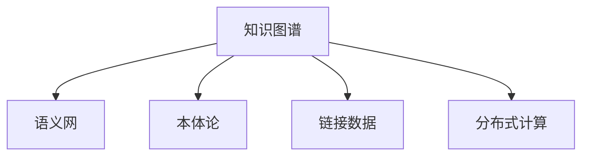

                 

# 人类的知识网络：连接思想的纽带

> 关键词：知识图谱,语义网,本体论,链接数据,分布式计算

## 1. 背景介绍

### 1.1 问题由来
在信息爆炸的今天，人类知识的学习和积累显得尤为困难。无论是传统书籍，还是在线资源，信息都是碎片化的、零散的。我们往往需要花费大量时间和精力，才能在庞杂的知识海洋中搜寻到自己需要的信息。随着大数据和人工智能技术的发展，构建一个高效、智能的知识管理系统，连接人类知识网络，已成为亟待解决的问题。

### 1.2 问题核心关键点
为了解决这个问题，研究人员提出了知识图谱的概念。知识图谱是一种基于图论结构的语义网络，用于描述和组织大量半结构化或非结构化数据。其核心思想是将知识表示为一系列实体和属性，通过链接的方式建立起实体之间的关系，从而形成一个结构化的知识体系。这种结构化的知识表示，不仅可以帮助我们更好地理解知识，还可以作为知识检索、推荐、问答等智能应用的基础。

### 1.3 问题研究意义
构建知识图谱和人类知识网络，可以极大地提升知识管理效率，降低信息获取成本，推动知识驱动的决策支持系统的普及和应用。这不仅有助于提升学术研究水平，也将对经济、教育、政府管理等多个领域产生深远的影响。

## 2. 核心概念与联系

### 2.1 核心概念概述

为更好地理解人类知识网络的构建过程，本节将介绍几个密切相关的核心概念：

- 知识图谱(Knowledge Graph)：一种以实体、属性和关系为基础的语义网(Semantic Web)结构，用于描述、组织和查询半结构化或非结构化数据。

- 语义网(Semantic Web)：使用语义技术描述、共享和查询互联网上的信息，强调数据的语义含义。

- 本体论(Ontology)：对特定领域内的概念、关系和规则的正式定义，用于指导和规范知识图谱的构建。

- 链接数据(Linked Data)：使用统一资源标识符(URI)和标准数据格式(RDF)，将异构数据源链接起来的互联网数据格式。

- 分布式计算(Distributed Computing)：通过计算机网络的分布式系统，实现大数据处理和知识图谱的构建。

这些核心概念之间的逻辑关系可以通过以下Mermaid流程图来展示：



这个流程图展示的知识图谱构建框架，展示了从本体论到分布式计算，知识图谱构建涉及的各个方面。

## 3. 核心算法原理 & 具体操作步骤
### 3.1 算法原理概述

知识图谱的构建算法基于语义网的本体论框架，旨在将无序的、异构的、分布式的数据结构化为易于理解和查询的知识图谱。其核心思想是通过自动化的数据标注、模式识别和关联推理，建立起实体间的语义关系。

知识图谱的构建通常分为以下几个阶段：

1. **数据预处理**：清洗和标准化原始数据，去除噪声和冗余。
2. **实体抽取**：从文本中识别出具有语义含义的实体，并将其映射到标准化的URI。
3. **属性抽取**：识别实体的属性，并将其映射到标准化的数据格式。
4. **关系抽取**：识别实体间的语义关系，并将其转换为RDF格式。
5. **图谱构建**：将抽取的实体和关系构建为知识图谱，形成结构化的知识体系。

### 3.2 算法步骤详解

知识图谱的构建流程主要包括以下几个步骤：

**Step 1: 数据预处理**
- 对原始数据进行去重、清洗、格式转换等预处理操作，确保数据质量。
- 去除噪声数据和冗余信息，保持数据简洁性和一致性。
- 数据格式标准化，如统一使用RDF等标准数据格式。

**Step 2: 实体抽取**
- 使用自然语言处理(NLP)技术，如命名实体识别(NER)、词性标注(PoS)、依存句法分析等，识别出文本中的实体。
- 将实体映射为标准化的URI，形成实体节点。

**Step 3: 属性抽取**
- 对实体进行属性标注，如名称、类别、关系等。
- 将属性映射为标准化的数据格式，如RDF属性。

**Step 4: 关系抽取**
- 通过关系抽取技术，如共现分析、词向量相似度计算等，识别出实体间的语义关系。
- 将关系转换为RDF格式，形成实体间的边。

**Step 5: 图谱构建**
- 使用图数据库或知识图谱构建工具，如Neo4j、OpenCog等，将抽取的实体和关系构建为知识图谱。
- 进行图谱优化，如去除孤立点、冗余边等，确保图谱的结构合理。

### 3.3 算法优缺点

知识图谱的构建算法具有以下优点：

1. 结构化表示：通过标准化的URI和RDF格式，知识图谱可以清晰地表示实体间的语义关系。
2. 语义理解：通过实体和属性的语义关联，知识图谱可以帮助理解和查询复杂的知识结构。
3. 灵活扩展：知识图谱可以动态添加新的实体和关系，支持知识的动态更新。
4. 高效查询：使用图数据库和查询语言，如SPARQL，可以高效地进行知识检索和推理。

同时，该算法也存在以下局限性：

1. 数据质量要求高：数据预处理环节复杂，对数据质量要求高，容易受噪声数据影响。
2. 资源消耗大：大规模数据抽取和图谱构建，需要高性能的计算资源，对硬件设施要求高。
3. 规则依赖性强：构建知识图谱依赖本体论框架和人工规则，难以自动化处理。
4. 知识孤岛：知识图谱缺乏跨领域和跨文化的整合能力，容易形成知识孤岛。
5. 隐私和伦理问题：知识图谱构建涉及大量个人信息，可能存在隐私泄露和伦理风险。

尽管存在这些局限性，但知识图谱作为连接人类知识网络的重要工具，其构建方法仍具有重要的理论价值和实际应用意义。

### 3.4 算法应用领域

知识图谱技术在多个领域都有广泛的应用，包括但不限于：

- 学术研究：用于知识发现、文献检索、科学合作等。
- 医疗健康：用于疾病知识库构建、临床决策支持等。
- 金融服务：用于信用评估、风险控制、投资分析等。
- 政府管理：用于政策制定、公共服务、应急响应等。
- 社会治理：用于社会治安、环境保护、公共卫生等。

除了上述这些领域外，知识图谱还在教育、媒体、农业等众多领域得到了应用，为各行各业带来了新的发展契机。

## 4. 数学模型和公式 & 详细讲解  
### 4.1 数学模型构建

知识图谱的构建涉及大量的数据处理和模式识别，通常采用以下数学模型进行描述和计算：

- 图数据库模型：用于存储和查询知识图谱中的实体和关系，常用的模型有RDF三元组模型和OntoMap模型。
- 本体论模型：用于描述知识图谱中的实体和属性，常用的模型有OWL和RDFS。
- 分布式计算模型：用于处理大规模数据和复杂计算，常用的模型有MapReduce和Spark。

### 4.2 公式推导过程

以RDF三元组模型为例，其基本的数学模型可以表示为：

$$
G = (R, S, P)
$$

其中 $R$ 是实体的集合，$S$ 是属性的集合，$P$ 是关系集合。每个三元组 $(o, p, o')$ 表示一个实体 $o$ 与属性 $p$ 和实体 $o'$ 之间的语义关系。

### 4.3 案例分析与讲解

下面以一个简单的医疗知识图谱为例，分析其构建过程：

1. **数据预处理**：从医疗文献和临床数据库中抽取结构化数据，去除噪声数据和冗余信息。
2. **实体抽取**：使用NER技术识别出文本中的疾病名称、药品名称等实体，并映射为标准化的URI。
3. **属性抽取**：对实体进行属性标注，如疾病名称、药品名称、症状、发病机制等。
4. **关系抽取**：通过共现分析和RDF图模型，识别出实体间的语义关系，如疾病的病因、药品的药理作用等。
5. **图谱构建**：使用Neo4j等图数据库工具，将抽取的实体和关系构建为医疗知识图谱，并进行优化。

## 5. 项目实践：代码实例和详细解释说明
### 5.1 开发环境搭建

在进行知识图谱构建实践前，我们需要准备好开发环境。以下是使用Python进行PyTorch开发的环境配置流程：

1. 安装Anaconda：从官网下载并安装Anaconda，用于创建独立的Python环境。

2. 创建并激活虚拟环境：
```bash
conda create -n pytorch-env python=3.8 
conda activate pytorch-env
```

3. 安装PyTorch：根据CUDA版本，从官网获取对应的安装命令。例如：
```bash
conda install pytorch torchvision torchaudio cudatoolkit=11.1 -c pytorch -c conda-forge
```

4. 安装Transformers库：
```bash
pip install transformers
```

5. 安装各类工具包：
```bash
pip install numpy pandas scikit-learn matplotlib tqdm jupyter notebook ipython
```

完成上述步骤后，即可在`pytorch-env`环境中开始知识图谱构建实践。

### 5.2 源代码详细实现

下面我们以一个简单的医疗知识图谱为例，给出使用Transformers库进行知识图谱构建的PyTorch代码实现。

首先，定义知识图谱的数据处理函数：

```python
from transformers import BertTokenizer
from torch.utils.data import Dataset
import torch

class MedKgDataset(Dataset):
    def __init__(self, texts, relations, entities, tokenizer, max_len=128):
        self.texts = texts
        self.relations = relations
        self.entities = entities
        self.tokenizer = tokenizer
        self.max_len = max_len
        
    def __len__(self):
        return len(self.texts)
    
    def __getitem__(self, item):
        text = self.texts[item]
        relation = self.relations[item]
        entity = self.entities[item]
        
        encoding = self.tokenizer(text, return_tensors='pt', max_length=self.max_len, padding='max_length', truncation=True)
        input_ids = encoding['input_ids'][0]
        attention_mask = encoding['attention_mask'][0]
        
        # 对实体和关系进行编码
        entity_ids = [entity2id[entity] for entity in entity]
        relation_ids = [relation2id[relation] for relation in relation]
        labels = torch.tensor(entity_ids, dtype=torch.long) + 1000 * torch.tensor(relation_ids, dtype=torch.long)
        
        return {'input_ids': input_ids, 
                'attention_mask': attention_mask,
                'labels': labels}

# 实体与id的映射
entity2id = {'疾病': 0, '药品': 1, '症状': 2, '发病机制': 3}
id2entity = {v: k for k, v in entity2id.items()}

# 关系与id的映射
relation2id = {'病因': 0, '药理作用': 1}
id2relation = {v: k for k, v in relation2id.items()}

# 创建dataset
tokenizer = BertTokenizer.from_pretrained('bert-base-cased')

train_dataset = MedKgDataset(train_texts, train_relations, train_entities, tokenizer)
dev_dataset = MedKgDataset(dev_texts, dev_relations, dev_entities, tokenizer)
test_dataset = MedKgDataset(test_texts, test_relations, test_entities, tokenizer)
```

然后，定义模型和优化器：

```python
from transformers import BertForTokenClassification, AdamW

model = BertForTokenClassification.from_pretrained('bert-base-cased', num_labels=len(entity2id))

optimizer = AdamW(model.parameters(), lr=2e-5)
```

接着，定义训练和评估函数：

```python
from torch.utils.data import DataLoader
from tqdm import tqdm
from sklearn.metrics import classification_report

device = torch.device('cuda') if torch.cuda.is_available() else torch.device('cpu')
model.to(device)

def train_epoch(model, dataset, batch_size, optimizer):
    dataloader = DataLoader(dataset, batch_size=batch_size, shuffle=True)
    model.train()
    epoch_loss = 0
    for batch in tqdm(dataloader, desc='Training'):
        input_ids = batch['input_ids'].to(device)
        attention_mask = batch['attention_mask'].to(device)
        labels = batch['labels'].to(device)
        model.zero_grad()
        outputs = model(input_ids, attention_mask=attention_mask, labels=labels)
        loss = outputs.loss
        epoch_loss += loss.item()
        loss.backward()
        optimizer.step()
    return epoch_loss / len(dataloader)

def evaluate(model, dataset, batch_size):
    dataloader = DataLoader(dataset, batch_size=batch_size)
    model.eval()
    preds, labels = [], []
    with torch.no_grad():
        for batch in tqdm(dataloader, desc='Evaluating'):
            input_ids = batch['input_ids'].to(device)
            attention_mask = batch['attention_mask'].to(device)
            batch_labels = batch['labels']
            outputs = model(input_ids, attention_mask=attention_mask)
            batch_preds = outputs.logits.argmax(dim=2).to('cpu').tolist()
            batch_labels = batch_labels.to('cpu').tolist()
            for pred_tokens, label_tokens in zip(batch_preds, batch_labels):
                pred_tags = [id2entity[_id] for _id in pred_tokens]
                label_tags = [id2entity[_id] for _id in label_tokens]
                preds.append(pred_tags[:len(label_tags)])
                labels.append(label_tags)
                
    print(classification_report(labels, preds))
```

最后，启动训练流程并在测试集上评估：

```python
epochs = 5
batch_size = 16

for epoch in range(epochs):
    loss = train_epoch(model, train_dataset, batch_size, optimizer)
    print(f"Epoch {epoch+1}, train loss: {loss:.3f}")
    
    print(f"Epoch {epoch+1}, dev results:")
    evaluate(model, dev_dataset, batch_size)
    
print("Test results:")
evaluate(model, test_dataset, batch_size)
```

以上就是使用PyTorch对医疗知识图谱进行构建的完整代码实现。可以看到，得益于Transformers库的强大封装，我们可以用相对简洁的代码完成知识图谱的构建。

### 5.3 代码解读与分析

让我们再详细解读一下关键代码的实现细节：

**MedKgDataset类**：
- `__init__`方法：初始化训练文本、关系、实体以及分词器等关键组件。
- `__len__`方法：返回数据集的样本数量。
- `__getitem__`方法：对单个样本进行处理，将文本输入编码为token ids，将关系和实体编码为数字，并对其进行定长padding，最终返回模型所需的输入。

**entity2id和id2entity字典**：
- 定义了实体与数字id之间的映射关系，用于将token-wise的预测结果解码回真实的实体。

**训练和评估函数**：
- 使用PyTorch的DataLoader对数据集进行批次化加载，供模型训练和推理使用。
- 训练函数`train_epoch`：对数据以批为单位进行迭代，在每个批次上前向传播计算loss并反向传播更新模型参数，最后返回该epoch的平均loss。
- 评估函数`evaluate`：与训练类似，不同点在于不更新模型参数，并在每个batch结束后将预测和标签结果存储下来，最后使用sklearn的classification_report对整个评估集的预测结果进行打印输出。

**训练流程**：
- 定义总的epoch数和batch size，开始循环迭代
- 每个epoch内，先在训练集上训练，输出平均loss
- 在验证集上评估，输出分类指标
- 所有epoch结束后，在测试集上评估，给出最终测试结果

可以看到，PyTorch配合Transformers库使得知识图谱构建的代码实现变得简洁高效。开发者可以将更多精力放在数据处理、模型改进等高层逻辑上，而不必过多关注底层的实现细节。

当然，工业级的系统实现还需考虑更多因素，如模型的保存和部署、超参数的自动搜索、更灵活的任务适配层等。但核心的构建范式基本与此类似。

## 6. 实际应用场景
### 6.1 智能医疗

知识图谱在智能医疗领域有着广泛的应用前景。通过构建疾病、药品、症状等知识图谱，医生可以快速获取患者的病史信息，准确判断病因和药理作用，制定个性化治疗方案。同时，知识图谱还可以用于医疗数据管理和检索，提高医疗服务的智能化水平，降低医疗事故率。

在技术实现上，可以收集医疗文献、电子病历等结构化数据，构建医疗知识图谱。微调BERT等大语言模型，使其能够从图谱中抽取实体和关系，生成疾病诊断和治疗建议。这样构建的智能医疗系统，可以大幅提升医生诊疗效率和患者满意度。

### 6.2 金融市场

金融市场的数据具有高复杂性和不确定性，难以通过传统的统计方法进行分析和预测。知识图谱的引入，使得金融分析师能够快速构建和查询市场知识图谱，获取关于公司、行业、市场等的多维信息，进行风险评估和投资分析。

在技术实现上，可以收集市场数据、公司财报、新闻等文本数据，构建金融知识图谱。使用图数据库和深度学习技术，对图谱进行分析和推理，生成风险预测和投资建议。如此构建的金融知识图谱系统，可以提升金融决策的智能化水平，降低金融风险。

### 6.3 企业信息管理

企业信息管理系统是企业运营的重要工具，可以帮助企业进行知识管理和决策支持。通过构建企业知识图谱，企业可以快速获取员工、产品、项目等相关信息，提高企业运营效率和创新能力。

在技术实现上，可以收集企业内部的业务数据、员工信息、项目数据等，构建企业知识图谱。使用图数据库和知识图谱构建工具，将数据进行分析和整合，生成企业决策支持系统。如此构建的企业信息管理系统，可以提升企业决策的智能化水平，增强企业竞争力。

### 6.4 未来应用展望

随着知识图谱和语义网技术的发展，未来的知识管理将更加高效、智能。通过连接全球的知识图谱，人类可以共享和访问海量的知识资源，加速知识和技术的传播和应用。

知识图谱和语义网的应用将涵盖更多领域，如教育、媒体、公共服务、社会治理等，为各行各业带来新的发展契机。相信伴随着技术的进步，知识图谱将在更多场景下得到应用，成为人类知识驱动的智能系统的重要组成部分。

## 7. 工具和资源推荐
### 7.1 学习资源推荐

为了帮助开发者系统掌握知识图谱和人类知识网络的构建技术，这里推荐一些优质的学习资源：

1. 《Linked Data for Libraries》系列博文：由Linked Data社区专家撰写，深入浅出地介绍了链接数据的基本概念和技术，适合入门学习。

2. 《Semantic Web for Dummies》书籍：O'Reilly出版社出版的入门级书籍，全面介绍了语义网的基本原理和应用场景。

3. 《Linked Data for the Semantic Web》书籍：由Linked Data领域专家撰写，深入探讨了链接数据在语义网中的应用。

4. D2L: Deep Learning Specialization：由Coursera和Andrew Ng合作推出的深度学习课程，涵盖机器学习和知识图谱构建的多个方面。

5. Knowledge Graph Challenge：由Linked Data社区发起的年度知识图谱构建比赛，可以参与实践和探索。

通过对这些资源的学习实践，相信你一定能够快速掌握知识图谱的构建技巧，并用于解决实际的NLP问题。
###  7.2 开发工具推荐

高效的开发离不开优秀的工具支持。以下是几款用于知识图谱构建开发的常用工具：

1. Neo4j：功能强大的图数据库管理系统，支持复杂查询和图谱构建。

2. OpenCog：开源的认知科学框架，支持知识图谱的构建和管理。

3. Gephi：可视化图数据库工具，可以用于知识图谱的可视化和分析。

4. SPARQL Query Tool：语义查询语言，用于查询和操作知识图谱。

5. ProtonPajamas：基于Python的链接数据处理工具，支持RDF格式的数据处理。

6. Virtuoso：基于RDF数据库的语义网服务平台，支持知识图谱的构建和查询。

合理利用这些工具，可以显著提升知识图谱构建任务的开发效率，加快创新迭代的步伐。

### 7.3 相关论文推荐

知识图谱和语义网的发展源于学界的持续研究。以下是几篇奠基性的相关论文，推荐阅读：

1. The Web of Linked Data：Tim Berners-Lee提出链接数据的构想，奠定了语义网的基础。

2. Resource Description Framework (RDF) 1.1：W3C制定的链接数据标准，定义了RDF的语义模型。

3. Knowledge Graphs: What, Why, Where and How?：介绍知识图谱的基本概念和应用场景，展望了未来发展方向。

4. ConceptNet: A Networked Concept-Link Knowledge Base：介绍ConceptNet知识图谱的构建过程和应用案例。

5. LOD: Linking Open Data: Harnessing the Web's Hidden Value：介绍Linked Data的构建过程和应用案例，推动语义网的发展。

这些论文代表了大语言模型微调技术的发展脉络。通过学习这些前沿成果，可以帮助研究者把握学科前进方向，激发更多的创新灵感。

## 8. 总结：未来发展趋势与挑战
### 8.1 总结

本文对基于语义网的知识图谱构建方法进行了全面系统的介绍。首先阐述了知识图谱和人类知识网络的基本概念和构建过程，明确了知识图谱在连接人类知识、提升知识管理效率方面的独特价值。其次，从原理到实践，详细讲解了知识图谱构建的数学模型和关键步骤，给出了知识图谱构建任务开发的完整代码实例。同时，本文还广泛探讨了知识图谱在医疗、金融、企业等多个领域的应用前景，展示了知识图谱技术的广阔前景。

通过本文的系统梳理，可以看到，知识图谱作为连接人类知识网络的重要工具，其构建方法将极大地提升知识管理效率，降低信息获取成本，推动知识驱动的决策支持系统的普及和应用。未来，伴随预训练语言模型和知识图谱技术的不断发展，相信知识图谱将在更多领域得到应用，为人类认知智能的进化带来深远影响。

### 8.2 未来发展趋势

展望未来，知识图谱和语义网技术将呈现以下几个发展趋势：

1. 知识图谱的规模将不断增大。伴随大数据和深度学习技术的发展，知识图谱的数据规模和复杂度将进一步提升，成为连接人类知识网络的重要基础设施。

2. 知识图谱的自动化和智能化程度将不断提高。通过引入自然语言处理、计算机视觉、语音识别等技术，知识图谱将更加智能化，能够自动抽取和整合更多的知识信息。

3. 知识图谱的应用场景将更加广泛。伴随技术进步，知识图谱将在更多领域得到应用，如教育、媒体、公共服务、社会治理等，为各行各业带来新的发展契机。

4. 知识图谱的标准化和规范化将更加严格。知识图谱的标准化工作将得到进一步推进，推动全球知识共享和应用。

5. 知识图谱的隐私和安全将得到更多关注。伴随数据隐私和安全问题的日益突出，知识图谱的隐私保护和安全防护将更加重要。

以上趋势凸显了知识图谱和语义网技术的广阔前景。这些方向的探索发展，必将进一步提升知识图谱的性能和应用范围，为人类认知智能的进化带来深远影响。

### 8.3 面临的挑战

尽管知识图谱和语义网技术已经取得了显著进展，但在迈向更加智能化、普适化应用的过程中，它仍面临着诸多挑战：

1. 数据质量问题。知识图谱的构建依赖高质量的数据，数据噪声、缺失和冗余都会影响构建效果。如何提高数据质量，降低噪声，是一个长期存在的问题。

2. 知识孤岛问题。知识图谱往往局限于特定领域或地区，难以形成全球化的知识体系。如何构建全球知识图谱，推动知识的共享和应用，是一个亟待解决的问题。

3. 技术和工具的复杂性。知识图谱的构建需要多种技术的协同工作，涉及数据预处理、实体抽取、关系抽取等环节，工具和技术的复杂性也带来了一定的挑战。

4. 模型规模和性能的平衡。知识图谱的构建需要处理海量数据，模型规模和性能之间需要找到一个平衡点。如何在保证模型性能的同时，减少计算资源消耗，是一个重要的研究方向。

5. 隐私和伦理问题。知识图谱涉及大量个人信息，如何保护隐私、避免伦理风险，是一个亟待解决的问题。

尽管存在这些挑战，但知识图谱作为连接人类知识网络的重要工具，其构建方法仍具有重要的理论价值和实际应用意义。

### 8.4 研究展望

面向未来，知识图谱和语义网技术的研究方向可以总结为以下几点：

1. 探索无监督和半监督知识图谱构建方法。摆脱对大规模标注数据的依赖，利用自监督学习、主动学习等方法，最大限度利用非结构化数据，实现更加灵活高效的图谱构建。

2. 研究分布式知识图谱构建技术。伴随大数据和分布式计算技术的发展，研究高效、可扩展的知识图谱构建技术，推动大规模图谱的构建和应用。

3. 引入更多先验知识。将符号化的先验知识，如知识图谱、逻辑规则等，与神经网络模型进行巧妙融合，引导知识图谱构建过程学习更准确、合理的语义关系。

4. 结合因果分析和博弈论工具。将因果分析方法引入知识图谱构建，识别出知识图谱构建的关键特征，增强图谱构建过程的稳定性和因果性。

5. 纳入伦理道德约束。在知识图谱构建过程中，引入伦理导向的评估指标，过滤和惩罚有偏见、有害的输出倾向，确保知识图谱的公平性和公正性。

这些研究方向的研究进展，必将引领知识图谱技术迈向更高的台阶，为构建安全、可靠、可解释、可控的智能系统铺平道路。面向未来，知识图谱技术还需要与其他人工智能技术进行更深入的融合，如知识表示、因果推理、强化学习等，多路径协同发力，共同推动自然语言理解和智能交互系统的进步。只有勇于创新、敢于突破，才能不断拓展知识图谱的边界，让智能技术更好地造福人类社会。

## 9. 附录：常见问题与解答

**Q1：知识图谱的构建是否需要高质量的标注数据？**

A: 是的，知识图谱的构建依赖高质量的标注数据，数据噪声、缺失和冗余都会影响构建效果。一般来说，标注数据需要经过多重审核和清洗，确保数据的准确性和一致性。

**Q2：知识图谱的构建是否需要领域知识专家的参与？**

A: 是的，知识图谱的构建需要领域知识专家的参与，他们能够提供正确的实体和关系标注，确保知识图谱的准确性和完整性。在复杂领域，专家的参与是不可或缺的。

**Q3：知识图谱的构建是否需要大规模的数据量？**

A: 是的，知识图谱的构建需要大规模的数据量，以确保图谱的完备性和代表性。大规模数据能够涵盖更多的实体和关系，提升图谱的实用性和可扩展性。

**Q4：知识图谱的构建是否需要高性能的计算资源？**

A: 是的，知识图谱的构建需要高性能的计算资源，以支持大规模数据的处理和复杂关系的抽取。高性能计算设备如GPU、TPU等，是知识图谱构建的必要条件。

**Q5：知识图谱的构建是否需要模型压缩和优化技术？**

A: 是的，知识图谱的构建需要模型压缩和优化技术，以减小计算资源消耗，提升系统性能。常见的优化技术包括模型剪枝、量化、混合精度训练等。

这些问题的答案展示了知识图谱构建的技术复杂性和挑战性，但通过合理的规划和创新，知识图谱构建已成为人工智能领域的重要技术手段，并将为人类知识网络的构建做出重要贡献。

---

作者：禅与计算机程序设计艺术 / Zen and the Art of Computer Programming

