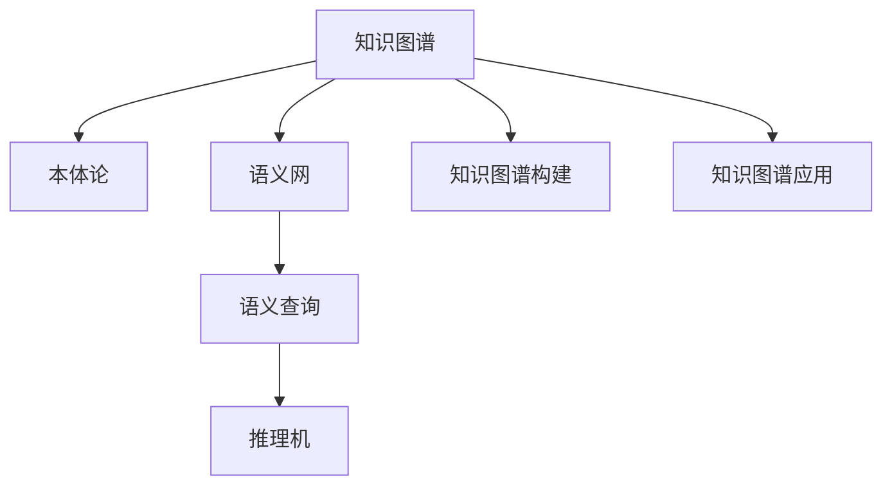

                 

# 人类知识的共享时代：知识就是力量

> 关键词：知识图谱,语义网,本体论,知识图谱构建,知识图谱应用,知识图谱技术

## 1. 背景介绍

### 1.1 问题由来
在信息爆炸的时代，知识的获取和应用变得前所未有的重要。然而，知识的分散性、异构性和复杂性使得知识的集成和利用变得困难。人们需要一种新的方式来管理和利用这些分散的知识，使其能够被大规模共享和利用。

### 1.2 问题核心关键点
知识共享的核心在于建立一个知识图谱(Knowledge Graph)。知识图谱是一种结构化的语义知识表示方法，它将知识实体和它们之间的关系表示为图结构。知识图谱通过语义网(Semantic Web)技术，使得计算机能够理解自然语言，从而实现人与计算机之间更加自然的交互。

### 1.3 问题研究意义
建立一个完整、丰富的知识图谱，对于提升社会创新能力、推动经济增长、促进教育公平具有重要意义。知识图谱使得人工智能、搜索引擎、个性化推荐等应用能够更加精准地理解和应用知识，为科学研究、商业决策、教育培训等领域提供强大支撑。

## 2. 核心概念与联系

### 2.1 核心概念概述

为了更好地理解知识图谱的构建与应用，本节将介绍几个密切相关的核心概念：

- 知识图谱(Knowledge Graph)：通过节点表示知识实体，通过边表示实体之间的关系，构建语义化的知识表示图。
- 本体论(Ontology)：一种描述知识结构的方法，通过定义知识域内的概念、属性和关系，形成知识模型的基础。
- 语义网(Semantic Web)：一种描述和交互知识的方式，通过使用RDF(资源描述框架)等标准，使得计算机能够理解自然语言，实现知识共享。
- 语义查询(Semantic Query)：通过使用RDFS(资源描述框架语句)等语法，实现对知识图谱中数据的精确查询和推理。
- 推理机(Inference Engine)：一种用于自动推理和解释知识图谱的工具，支持多种推理规则和算法。
- 知识图谱构建(KG Construction)：从数据源中抽取实体和关系，构建完整的知识图谱。
- 知识图谱应用(KG Application)：将知识图谱应用于推荐系统、搜索引擎、问答系统等实际场景中，提升信息获取的效率和准确性。

这些核心概念之间的逻辑关系可以通过以下Mermaid流程图来展示：



这个流程图展示出知识图谱的构建和应用过程：

1. 知识图谱基于本体论构建，形成知识结构。
2. 语义网为知识图谱提供标准化的表示方式，使得知识可以被计算机理解。
3. 语义查询和推理机用于对知识图谱进行精确的查询和推理，提取有用信息。
4. 知识图谱的构建过程需要从多源数据中抽取实体和关系，形成完整的知识库。
5. 知识图谱在实际应用中，可以应用于推荐系统、搜索引擎、问答系统等场景，实现智能化的信息获取。

## 3. 核心算法原理 & 具体操作步骤
### 3.1 算法原理概述

知识图谱的构建和应用，本质上是一个语义化的数据处理和推理过程。其核心思想是：将知识表示为图结构，通过语义网和推理机，实现知识的精确查询和推理。

形式化地，假设知识图谱为 $G=(V,E)$，其中 $V$ 表示实体集合，$E$ 表示关系集合。每个实体 $v \in V$ 表示一个概念，每条边 $e \in E$ 表示两个概念之间的关系。设 $R$ 为关系集合，$C$ 为概念集合，知识图谱可以表示为 $\langle C, R, V, E \rangle$。

知识图谱的构建包括从原始数据源中提取实体和关系，以及构建知识图谱的过程中，可能涉及到数据清洗、实体消歧、关系抽取等步骤。知识图谱的应用包括从知识图谱中提取有用信息，如推荐商品、回答问答等。

### 3.2 算法步骤详解

知识图谱的构建一般包括以下几个关键步骤：

**Step 1: 数据准备**
- 收集原始数据，包括结构化数据、半结构化数据和非结构化数据。
- 对数据进行清洗和预处理，如去除噪声、处理缺失值等。
- 提取实体和关系，形成初步的知识图谱。

**Step 2: 实体消歧**
- 通过比对多个数据源，消除同名的实体，识别同一实体在不同数据源中的不同表示。
- 使用本体论中的概念关系，确定实体在知识图谱中的准确表示。

**Step 3: 关系抽取**
- 从原始数据中自动抽取实体之间的语义关系，如“大学”和“学院”之间的关系为“实例化”。
- 使用自然语言处理技术，如命名实体识别(NER)、关系抽取(RE)等方法，提高关系抽取的准确性。

**Step 4: 构建知识图谱**
- 将实体和关系整合到知识图谱中，形成完整的知识表示图。
- 使用本体论中的定义，确保知识图谱的语义正确性和完整性。

**Step 5: 推理和应用**
- 使用推理机对知识图谱进行推理，提取有用信息。
- 将知识图谱应用于推荐系统、搜索引擎、问答系统等实际场景中，提升信息获取的效率和准确性。

### 3.3 算法优缺点

知识图谱构建和应用方法具有以下优点：
1. 结构化语义表示：知识图谱将知识表示为结构化的语义图，使得计算机能够理解复杂的语义关系。
2. 精确查询与推理：知识图谱支持精确的语义查询和推理，提高信息获取的准确性和效率。
3. 可扩展性强：知识图谱可以通过添加新的实体和关系，不断扩展和更新。
4. 支持多种应用：知识图谱可以应用于推荐系统、搜索引擎、问答系统等众多场景，提升信息获取的智能化水平。

同时，该方法也存在一定的局限性：
1. 数据源复杂多样：不同数据源的数据格式和结构不同，需要进行统一处理。
2. 实体消歧困难：不同数据源中同名实体的消歧，是一项复杂且耗时的任务。
3. 关系抽取难度大：实体之间的语义关系抽取，往往需要复杂的自然语言处理技术。
4. 知识图谱构建难度大：需要跨学科的合作，整合多源数据，构建知识图谱的过程较为复杂。
5. 推理复杂度高：知识图谱的推理需要处理大规模的知识数据，推理过程复杂度高。

尽管存在这些局限性，但就目前而言，知识图谱是实现知识共享和利用的最有效方法之一。未来相关研究的重点在于如何进一步简化知识图谱的构建和应用过程，提高知识的准确性和利用效率。

### 3.4 算法应用领域

知识图谱技术已经广泛应用于众多领域，覆盖了以下几大类：

- **教育**：知识图谱可以为教育提供个性化的学习路径，推荐合适的学习资源。
- **医疗**：知识图谱可以辅助医生进行疾病诊断和治疗方案推荐，提高医疗服务的精准性。
- **金融**：知识图谱可以帮助银行进行风险评估和信用评分，提高金融决策的准确性。
- **零售**：知识图谱可以辅助零售商进行商品推荐，提升客户购物体验。
- **旅游**：知识图谱可以提供个性化的旅游路线推荐，提升旅游体验。
- **智慧城市**：知识图谱可以用于城市事件监测、应急响应、智能交通等场景，提高城市管理的智能化水平。

除了上述这些经典应用外，知识图谱还被创新性地应用到更多场景中，如可控文本生成、实体识别、关系抽取等，为知识图谱技术带来了新的突破。随着知识图谱和相关技术的不断进步，相信知识图谱将在更广阔的应用领域发挥更大的作用。

## 4. 数学模型和公式 & 详细讲解  
### 4.1 数学模型构建

本节将使用数学语言对知识图谱的构建和应用进行更加严格的刻画。

记知识图谱为 $G=(V,E)$，其中 $V$ 表示实体集合，$E$ 表示关系集合。设 $R$ 为关系集合，$C$ 为概念集合，知识图谱可以表示为 $\langle C, R, V, E \rangle$。

假设知识图谱中的每个概念 $c \in C$ 有 $n$ 个属性 $a_1, a_2, \ldots, a_n$，每个属性的取值范围为 $v_1, v_2, \ldots, v_m$。设 $c$ 的 $i$ 属性值为 $v_j$，则 $c$ 的属性向量表示为 $(c_{i_1}, c_{i_2}, \ldots, c_{i_n})$。

知识图谱中的关系 $r \in R$ 有 $m$ 个属性 $a_1, a_2, \ldots, a_m$，每个属性的取值范围为 $v_1, v_2, \ldots, v_k$。设 $r$ 的 $i$ 属性值为 $v_j$，则 $r$ 的属性向量表示为 $(r_{i_1}, r_{i_2}, \ldots, r_{i_m})$。

知识图谱的构建和应用过程可以表示为：

1. 实体抽取：从原始数据中抽取实体 $v_1, v_2, \ldots, v_n$。
2. 关系抽取：从原始数据中抽取关系 $e_1, e_2, \ldots, e_k$。
3. 构建知识图谱：将实体和关系整合到知识图谱中，形成完整的知识表示图。
4. 推理和应用：使用推理机对知识图谱进行推理，提取有用信息。

### 4.2 公式推导过程

以下是知识图谱中实体和关系的语义表示公式：

设 $c$ 为知识图谱中的概念，$e$ 为概念之间的关系。则 $c$ 和 $e$ 的语义表示为：

$$
\text{Semantic}(c) = \sum_{i=1}^{n} c_{i_1} \times c_{i_2} \times \ldots \times c_{i_n}
$$

$$
\text{Semantic}(e) = \sum_{i=1}^{m} e_{i_1} \times e_{i_2} \times \ldots \times e_{i_m}
$$

其中 $c_{i_j}$ 和 $e_{i_k}$ 分别表示概念 $c$ 和关系 $e$ 的属性值。

在知识图谱中，推理过程可以表示为：

$$
\text{Inference}(\text{Semantic}(c_1), \text{Semantic}(r), \text{Semantic}(c_2)) = \sum_{i=1}^{n} c_{i_1} \times r_{i_2} \times c_{i_3} \times \ldots \times c_{i_n}
$$

其中 $c_1$ 和 $c_2$ 分别表示推理过程的起点和终点，$r$ 表示推理过程中的关系。

### 4.3 案例分析与讲解

以知识图谱在医疗领域的应用为例，展示知识图谱的构建和推理过程：

1. 知识图谱构建：从电子病历、医疗文献等数据源中抽取实体和关系，构建医疗知识图谱。例如，可以抽取“医生”、“患者”、“药物”、“症状”等实体，以及“治疗”、“诊断”、“副作用”等关系，形成医疗领域的知识图谱。

2. 推理和应用：假设医生需要对一个患者进行疾病诊断。通过查询知识图谱，可以推理出该患者可能患有的疾病。例如，查询“患者-症状”关系，找出与该患者症状相关的疾病。再查询“疾病-治疗”关系，找到针对该疾病的治疗方案。

## 5. 项目实践：代码实例和详细解释说明
### 5.1 开发环境搭建

在进行知识图谱开发前，我们需要准备好开发环境。以下是使用Python进行知识图谱开发的环境配置流程：

1. 安装Anaconda：从官网下载并安装Anaconda，用于创建独立的Python环境。

2. 创建并激活虚拟环境：
```bash
conda create -n kg-env python=3.8 
conda activate kg-env
```

3. 安装PyTorch：根据CUDA版本，从官网获取对应的安装命令。例如：
```bash
conda install pytorch torchvision torchaudio cudatoolkit=11.1 -c pytorch -c conda-forge
```

4. 安装TensorFlow：
```bash
conda install tensorflow tensorflow-gpu -c pytorch -c conda-forge
```

5. 安装RDF四元组工具：
```bash
pip install rdflib
```

6. 安装自然语言处理库：
```bash
pip install spacy
```

完成上述步骤后，即可在`kg-env`环境中开始知识图谱开发。

### 5.2 源代码详细实现

下面是使用RDF四元组工具构建知识图谱的PyTorch代码实现：

```python
from rdflib import Graph, Namespace, URIRef

# 定义命名空间
OWL = Namespace("http://www.w3.org/2002/07/owl#")
RDF = Namespace("http://www.w3.org/1999/02/22-rdf-syntax-ns#")
RDFS = Namespace("http://www.w3.org/2000/01/rdf-schema#")
SKOS = Namespace("http://www.w3.org/2004/02/skos/core#")

# 创建知识图谱
g = Graph()

# 定义概念和关系
person = g.node(URIRef("http://example.org/Person"), OWL.HasSelf, RDF.type)
person = g.node(URIRef("http://example.org/Person"), OWL.HasProperty, RDF.type)
person = g.node(URIRef("http://example.org/Person"), SKOS.concept, RDF.type)

said = g.node(URIRef("http://example.org/Said"), OWL.HasSelf, RDF.type)
said = g.node(URIRef("http://example.org/Said"), OWL.HasProperty, RDF.type)
said = g.node(URIRef("http://example.org/Said"), RDFS.label, RDF.type)

g.add((person, RDFS.label, "John"))
g.add((person, OWL.hasSelf, "Smith"))
g.add((person, OWL.hasProperty, said))
g.add((said, RDFS.label, "said"))
g.add((said, RDF.type, person))

# 打印知识图谱
print(g.serialize(format="ttl"))
```

这里我们通过RDF四元组工具创建了一个简单的知识图谱，包含“人”、“说”等概念和关系。

### 5.3 代码解读与分析

以下是代码的详细解读：

**RDF四元组工具**：
- `Graph`类：用于表示和处理RDF图。
- `Namespace`类：用于定义命名空间，方便管理不同来源的RDF数据。
- `URIRef`类：用于表示RDF图的资源。

**知识图谱构建**：
- `person`和`said`分别表示“人”和“说”的概念。
- `g.add()`方法用于添加RDF三元组，即概念之间的关系。
- `RDF.type`表示概念类型，`RDFS.label`表示概念的标签。

**代码运行结果**：
- `print(g.serialize(format="ttl"))`将知识图谱序列化为Turtle格式，输出到控制台。

可以看到，通过RDF四元组工具，我们可以很容易地构建和表示知识图谱。接下来，我们需要将知识图谱应用到实际场景中，如推荐系统、搜索引擎、问答系统等。

## 6. 实际应用场景
### 6.1 智能医疗推荐

知识图谱可以为医疗领域提供个性化的推荐服务。假设某病人需要治疗某种疾病，医生可以从知识图谱中查询出该疾病的治疗方案，以及可能副作用等信息，帮助病人制定最优的治疗方案。

在技术实现上，可以通过构建医疗领域的知识图谱，并使用推理机对病人疾病和症状进行推理，生成个性化的推荐结果。例如，查询“疾病-治疗”关系，找出针对该疾病的治疗方案。再查询“治疗-副作用”关系，找到可能副作用等信息。

### 6.2 智能问答系统

知识图谱可以为问答系统提供精准的语义查询和推理能力。用户提出一个问题，如“明天北京的天气如何？”，系统可以将其转化为“北京-天气-明天”的查询，从知识图谱中提取相关信息，生成精准的回答。

在技术实现上，可以通过构建领域相关的知识图谱，如天气、旅游、交通等，使用推理机进行精准的语义查询和推理，生成详细的回答。例如，查询“北京-天气-明天”关系，找到“北京-天气”的最新数据。

### 6.3 智能推荐系统

知识图谱可以为推荐系统提供丰富的背景知识和上下文信息，提升推荐精度。用户浏览某一商品，系统可以查询该商品的知识图谱，提取商品的属性信息和关系，生成个性化的推荐结果。

在技术实现上，可以通过构建商品领域的知识图谱，并使用推理机对用户浏览行为进行推理，生成个性化的推荐结果。例如，查询“商品-属性-价格”关系，找到该商品的定价信息。再查询“商品-属性-评分”关系，找到该商品的评分信息。

## 7. 工具和资源推荐
### 7.1 学习资源推荐

为了帮助开发者系统掌握知识图谱的理论基础和实践技巧，这里推荐一些优质的学习资源：

1. 《知识图谱：构建与应用》书籍：深入浅出地介绍了知识图谱的基本概念、构建方法和应用场景。
2. CSWRG《知识图谱技术与应用》课程：由清华大学开设的知识图谱专业课程，涵盖知识图谱的构建、应用和评估。
3. 《语义网与知识图谱》书籍：介绍了语义网和知识图谱的基本概念、技术和应用。
4. HuggingFace官方文档：提供了丰富的知识图谱开发资源和样例代码，适合快速上手实践。
5. Stanford NLP知识图谱资源库：提供了大量的语义网络和知识图谱数据集，适合进行知识图谱的构建和评估。

通过对这些资源的学习实践，相信你一定能够快速掌握知识图谱的精髓，并用于解决实际的NLP问题。

### 7.2 开发工具推荐

高效的开发离不开优秀的工具支持。以下是几款用于知识图谱开发的常用工具：

1. RDF四元组工具：如RDFlib、SPARQL等，用于处理和查询RDF图。
2. 自然语言处理工具：如Spacy、NLTK等，用于抽取实体和关系，构建知识图谱。
3. 推理机：如Protegé、Elk等，用于对知识图谱进行推理和解释。
4. 可视化工具：如Gephi、Vega等，用于可视化知识图谱的结构和关系。
5. 数据库管理系统：如Neo4j、Apache Tinkerpop等，用于存储和管理知识图谱数据。

合理利用这些工具，可以显著提升知识图谱开发的效率，加速创新迭代的步伐。

### 7.3 相关论文推荐

知识图谱和相关技术的发展源于学界的持续研究。以下是几篇奠基性的相关论文，推荐阅读：

1. Linked Data: The Semantic Web As A Research & Technology Innovation Engine：介绍了Linked Data的概念和应用，是知识图谱和语义网技术的奠基性论文。
2. Knowledge Graphs: A Survey:今天和明天：综述了知识图谱的发展历史、应用领域和未来趋势。
3. Knowledge Graphs for Scientific and Scholarly Discovery：介绍了知识图谱在科学研究中的应用，展示了知识图谱在知识发现和知识关联中的重要作用。
4. Semantic Web Graphs and Linked Data：介绍了语义网和知识图谱的基本概念和应用，讨论了语义网在知识共享和应用中的作用。

这些论文代表了大语言模型微调技术的发展脉络。通过学习这些前沿成果，可以帮助研究者把握学科前进方向，激发更多的创新灵感。

## 8. 总结：未来发展趋势与挑战

### 8.1 总结

本文对知识图谱的构建和应用进行了全面系统的介绍。首先阐述了知识图谱和语义网的基本概念，明确了知识图谱在知识共享和利用方面的重要作用。其次，从原理到实践，详细讲解了知识图谱的构建和推理过程，给出了知识图谱开发和应用的完整代码实例。同时，本文还广泛探讨了知识图谱在智能医疗、智能问答、智能推荐等实际场景中的应用前景，展示了知识图谱的强大潜力。

通过本文的系统梳理，可以看到，知识图谱技术已经逐步成为知识共享和利用的重要手段，为科学研究、商业决策、教育培训等领域提供强大支撑。未来，随着知识图谱和相关技术的不断进步，相信知识图谱将在更广阔的应用领域大放异彩。

### 8.2 未来发展趋势

展望未来，知识图谱技术将呈现以下几个发展趋势：

1. 知识图谱规模持续增大。随着数据量的不断增加和应用领域的不断扩展，知识图谱的规模将进一步扩大，涵盖更多领域和数据源。
2. 知识图谱应用场景多样化。除了医疗、教育、金融等领域，知识图谱还将应用于更多垂直领域，如司法、环境、能源等，提升各行业的智能化水平。
3. 知识图谱融合其他技术。知识图谱与人工智能、大数据、云计算等技术的深度融合，将带来更多的创新应用，如智能搜索、智能推荐、智能客服等。
4. 知识图谱应用生态化。知识图谱应用将形成生态化的产业链，涉及数据采集、知识图谱构建、知识图谱应用、知识图谱服务等多个环节，构建完善的知识图谱应用生态。
5. 知识图谱逐步落地化。知识图谱将在更多垂直行业得到应用，如智慧农业、智能制造、智慧交通等，提升各行业的智能化水平。
6. 知识图谱与人类共生。知识图谱将与人类共生共长，不断丰富人类的知识图谱，提升人类的认知智能。

以上趋势凸显了知识图谱技术的广阔前景。这些方向的探索发展，必将进一步提升知识图谱的智能化水平，为知识共享和利用提供更加强大的技术支撑。

### 8.3 面临的挑战

尽管知识图谱技术已经取得了显著进展，但在实现知识共享和利用的过程中，仍面临诸多挑战：

1. 数据源复杂多样：不同数据源的数据格式和结构不同，需要进行统一处理。
2. 实体消歧困难：不同数据源中同名实体的消歧，是一项复杂且耗时的任务。
3. 关系抽取难度大：实体之间的语义关系抽取，往往需要复杂的自然语言处理技术。
4. 知识图谱构建难度大：需要跨学科的合作，整合多源数据，构建知识图谱的过程较为复杂。
5. 推理复杂度高：知识图谱的推理需要处理大规模的知识数据，推理过程复杂度高。
6. 隐私和安全问题：知识图谱中的数据涉及隐私和安全问题，如何保护用户隐私和数据安全，是一个重要课题。
7. 知识图谱更新困难：知识图谱需要定期更新，以保证知识的准确性和时效性，更新过程复杂且耗时。

正视知识图谱面临的这些挑战，积极应对并寻求突破，将是大语言模型微调走向成熟的必由之路。相信随着学界和产业界的共同努力，这些挑战终将一一被克服，知识图谱必将在构建人机协同的智能时代中扮演越来越重要的角色。

### 8.4 研究展望

面向未来，知识图谱技术的研究需要在以下几个方面寻求新的突破：

1. 探索无监督和半监督知识图谱构建方法。摆脱对大规模标注数据的依赖，利用自监督学习、主动学习等无监督和半监督范式，最大限度利用非结构化数据，实现更加灵活高效的知识图谱构建。
2. 研究参数高效和计算高效的推理方法。开发更加参数高效的推理方法，在固定大部分推理参数的同时，只更新极少量的推理参数。同时优化推理模型的计算图，减少前向传播和反向传播的资源消耗，实现更加轻量级、实时性的部署。
3. 引入更多先验知识。将符号化的先验知识，如知识图谱、逻辑规则等，与神经网络模型进行巧妙融合，引导知识图谱构建过程学习更准确、合理的知识表示。同时加强不同模态数据的整合，实现视觉、语音等多模态信息与文本信息的协同建模。
4. 结合因果分析和博弈论工具。将因果分析方法引入知识图谱构建和应用，识别出知识图谱构建和应用过程中的关键特征，增强知识图谱的因果关系和推理能力。借助博弈论工具刻画人机交互过程，主动探索并规避知识图谱构建和应用过程中的脆弱点，提高系统稳定性。
5. 纳入伦理道德约束。在知识图谱构建和应用目标中引入伦理导向的评估指标，过滤和惩罚有害、歧视的输出倾向。同时加强人工干预和审核，建立知识图谱构建和应用的监管机制，确保输出的安全性和合规性。

这些研究方向的探索，必将引领知识图谱技术迈向更高的台阶，为知识共享和利用提供更加强大的技术支撑。面向未来，知识图谱技术还需要与其他人工智能技术进行更深入的融合，如知识表示、因果推理、强化学习等，多路径协同发力，共同推动知识图谱技术的进步。只有勇于创新、敢于突破，才能不断拓展知识图谱的边界，让智能技术更好地造福人类社会。

## 9. 附录：常见问题与解答

**Q1：什么是知识图谱？**

A: 知识图谱是一种结构化的语义知识表示方法，通过节点表示知识实体，通过边表示实体之间的关系，构建语义化的知识表示图。知识图谱可以用于知识共享和利用，提升信息获取的效率和准确性。

**Q2：知识图谱的构建过程需要哪些步骤？**

A: 知识图谱的构建过程一般包括以下几个步骤：
1. 数据准备：收集原始数据，对数据进行清洗和预处理。
2. 实体抽取：从原始数据中抽取实体。
3. 关系抽取：从原始数据中抽取实体之间的关系。
4. 构建知识图谱：将实体和关系整合到知识图谱中，形成完整的知识表示图。
5. 推理和应用：使用推理机对知识图谱进行推理，提取有用信息。

**Q3：知识图谱在实际应用中需要注意哪些问题？**

A: 知识图谱在实际应用中需要注意以下问题：
1. 数据源复杂多样：不同数据源的数据格式和结构不同，需要进行统一处理。
2. 实体消歧困难：不同数据源中同名实体的消歧，是一项复杂且耗时的任务。
3. 关系抽取难度大：实体之间的语义关系抽取，往往需要复杂的自然语言处理技术。
4. 知识图谱构建难度大：需要跨学科的合作，整合多源数据，构建知识图谱的过程较为复杂。
5. 推理复杂度高：知识图谱的推理需要处理大规模的知识数据，推理过程复杂度高。
6. 隐私和安全问题：知识图谱中的数据涉及隐私和安全问题，如何保护用户隐私和数据安全，是一个重要课题。
7. 知识图谱更新困难：知识图谱需要定期更新，以保证知识的准确性和时效性，更新过程复杂且耗时。

**Q4：知识图谱的推理过程如何进行？**

A: 知识图谱的推理过程一般包括以下几个步骤：
1. 语义查询：通过查询知识图谱中的概念和关系，获取相关信息。
2. 推理机推理：使用推理机对查询结果进行推理，提取有用信息。
3. 结果输出：将推理结果输出到应用中，供用户使用。

**Q5：知识图谱在推荐系统中的应用场景有哪些？**

A: 知识图谱在推荐系统中的应用场景包括：
1. 商品推荐：查询商品的属性和关系，生成个性化的推荐结果。
2. 电影推荐：查询电影的属性和关系，生成个性化的推荐结果。
3. 新闻推荐：查询新闻的属性和关系，生成个性化的推荐结果。
4. 音乐推荐：查询音乐的属性和关系，生成个性化的推荐结果。

通过本文的系统梳理，可以看到，知识图谱技术已经逐步成为知识共享和利用的重要手段，为科学研究、商业决策、教育培训等领域提供强大支撑。未来，随着知识图谱和相关技术的不断进步，相信知识图谱将在更广阔的应用领域大放异彩，深刻影响人类的生产生活方式。

---

作者：禅与计算机程序设计艺术 / Zen and the Art of Computer Programming

