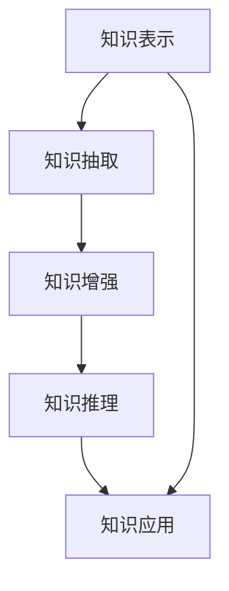

                 

# 人类知识的应用：洞察力指引实践方向

> 关键词：知识应用, 洞察力, 实践方向, 机器学习, 深度学习, 数据科学

## 1. 背景介绍

### 1.1 问题由来
在信息爆炸的时代，人类知识呈现指数级增长，如何高效地应用这些知识，成为科技和产业发展的重要课题。人工智能技术，特别是机器学习和深度学习，为人类知识的自动化处理和智能化应用提供了新的可能性。

人类知识的应用不仅限于数据驱动的模型训练，更在于如何将知识体系与算法结构相结合，形成具备高效推理和决策能力的智能系统。这一过程需要洞察力，即对问题本质的深刻理解和对解决方案的创造性构建。

本文将探讨如何利用洞察力，指导机器学习模型的设计和实践，使知识应用更加精准高效，提升人工智能技术在各行各业的应用水平。

### 1.2 问题核心关键点
- **知识表征与提取**：如何将人类知识有效地编码成算法结构，成为机器学习模型的输入。
- **模型设计与训练**：如何设计具有洞察力的模型结构，使用合适的算法和优化策略进行训练。
- **数据增强与泛化**：如何利用人类知识提升模型的泛化能力，处理数据中的异常情况。
- **推理与决策**：如何设计合理的推理规则和决策机制，使模型能够提供高质量的预测和建议。
- **应用场景与验证**：如何将模型应用于实际问题，并进行验证和优化，以适应复杂多变的场景。

这些关键点共同构成了知识应用的过程，每个环节都需要洞察力的指引和支撑。

## 2. 核心概念与联系

### 2.1 核心概念概述

为更好地理解知识应用的流程，本节将介绍几个关键概念及其联系：

- **知识表示**：将人类知识转化为算法或模型可以处理的形式，如符号表示、向量空间表示等。
- **知识抽取**：从大规模数据中提取出有用的知识信息，形成结构化的知识库。
- **知识增强**：在模型的训练过程中引入外部知识，提升模型的泛化能力和决策质量。
- **知识推理**：利用已有的知识库和模型，进行逻辑推理和因果分析，构建预测和建议。
- **知识应用**：将模型和推理结果应用于实际问题，验证和优化模型的性能。

这些概念之间的逻辑关系可以通过以下Mermaid流程图来展示：



这个流程图展示了知识应用的整个过程：

1. 知识表示：将人类知识编码成算法可处理的形式。
2. 知识抽取：从大规模数据中提取有价值的信息，构建知识库。
3. 知识增强：在模型训练过程中引入知识库，提升泛化能力。
4. 知识推理：利用知识库和模型进行逻辑推理和因果分析，生成预测和建议。
5. 知识应用：将模型应用于实际问题，进行验证和优化。

## 3. 核心算法原理 & 具体操作步骤
### 3.1 算法原理概述

知识应用的过程，本质上是通过算法模型对人类知识的编码、提取、增强、推理和应用。其核心思想是：

- **知识编码**：将人类知识转化为算法可以处理的形式，如符号表示、向量空间表示等。
- **知识抽取**：利用算法模型从大规模数据中提取出有用的知识信息，形成结构化的知识库。
- **知识增强**：在模型的训练过程中引入外部知识，提升模型的泛化能力和决策质量。
- **知识推理**：利用已有的知识库和模型，进行逻辑推理和因果分析，构建预测和建议。
- **知识应用**：将模型和推理结果应用于实际问题，验证和优化模型的性能。

以深度学习模型为例，其核心算法原理可以总结如下：

- **特征提取**：利用卷积神经网络(CNN)、循环神经网络(RNN)、Transformer等结构，从原始数据中提取高层次特征。
- **知识编码**：将提取的特征与人类知识相结合，如使用符号表示法、向量空间表示法等。
- **模型训练**：在标注数据集上训练模型，使模型能够学习到知识编码的规律和特征。
- **知识推理**：利用训练好的模型，进行逻辑推理和因果分析，生成预测和建议。
- **知识应用**：将模型应用于实际问题，进行验证和优化，以适应复杂多变的场景。

### 3.2 算法步骤详解

知识应用的过程，通常包括以下几个关键步骤：

**Step 1: 数据准备与预处理**
- 收集相关领域的数据集，如医疗数据、金融数据、文本数据等。
- 对数据进行清洗、去重、归一化等预处理操作，保证数据质量。

**Step 2: 知识抽取与表示**
- 使用自然语言处理(NLP)技术，从文本数据中抽取实体、关系、事件等信息，形成知识图谱。
- 将抽取的知识信息转化为算法可处理的形式，如向量表示、符号表示等。

**Step 3: 模型设计与训练**
- 选择合适的深度学习模型结构，如CNN、RNN、Transformer等，进行知识编码。
- 使用标注数据集，训练模型，调整模型参数，优化模型性能。

**Step 4: 知识增强**
- 将知识图谱与训练好的模型结合，进行知识增强。如在模型中加入额外的知识表示层，引入领域知识进行微调。

**Step 5: 知识推理与预测**
- 利用训练好的模型和知识图谱，进行逻辑推理和因果分析，生成预测和建议。
- 对模型输出进行后处理，如使用规则引擎进行决策，或结合领域知识进行修正。

**Step 6: 知识应用与验证**
- 将模型应用于实际问题，进行验证和优化。
- 在实际应用场景中进行A/B测试、用户反馈等验证，不断优化模型性能。

### 3.3 算法优缺点

知识应用的方法具有以下优点：

- **知识融合能力强**：能够将人类知识与算法模型相结合，提升模型的决策能力和泛化能力。
- **推理能力强**：利用知识图谱和逻辑推理，生成高质量的预测和建议。
- **应用场景广泛**：适用于各种领域，如医疗、金融、自然语言处理等。

同时，这些方法也存在以下缺点：

- **知识获取成本高**：需要大量标注数据和领域专家知识，成本较高。
- **模型复杂度高**：需要设计复杂的知识抽取和编码机制，增加了模型实现的难度。
- **泛化能力有限**：知识图谱和推理规则可能存在漏洞，影响模型的泛化能力。

尽管存在这些局限性，但就目前而言，知识应用的方法仍是大规模数据处理和智能决策的重要手段。未来相关研究的方向在于如何进一步降低知识获取成本，提升知识推理的准确性，同时兼顾模型复杂度和泛化能力。

### 3.4 算法应用领域

知识应用的方法已经在多个领域得到了广泛应用，如医疗、金融、自然语言处理等，为各行业带来了显著的提升。

- **医疗领域**：利用医疗知识图谱，提高诊断和治疗的精准度，辅助医生进行决策。
- **金融领域**：结合金融知识图谱，进行风险评估和投资建议，提升金融服务的智能化水平。
- **自然语言处理**：利用知识图谱和逻辑推理，进行实体识别、情感分析、问答系统等任务，提升NLP系统的智能化水平。
- **智能推荐系统**：结合用户行为数据和领域知识，进行个性化推荐，提升用户体验和满意度。
- **智能客服**：利用知识图谱和逻辑推理，进行问题解答和客服流程优化，提升客户满意度。

除了上述这些经典应用外，知识应用的方法还在更多领域得到了创新性的应用，如智能制造、智慧城市、智能交通等，为各行各业带来了新的发展机遇。

## 4. 数学模型和公式 & 详细讲解 & 举例说明
### 4.1 数学模型构建

在知识应用的过程中，常见的数学模型包括：

- **神经网络模型**：如CNN、RNN、Transformer等，用于特征提取和知识编码。
- **图模型**：如知识图谱，用于知识表示和推理。
- **优化模型**：如梯度下降、Adam等，用于模型训练和参数优化。

以神经网络模型为例，其数学模型可以表示为：

$$
M_{\theta}(x) = \sigma(W_{\theta}x + b_{\theta})
$$

其中，$x$ 为输入向量，$W_{\theta}$ 为权重矩阵，$b_{\theta}$ 为偏置向量，$\sigma$ 为激活函数，$\theta$ 为模型参数。

### 4.2 公式推导过程

以下我们以神经网络模型为例，推导模型的前向传播和反向传播公式。

**前向传播**：

设神经网络模型包含 $n$ 层，输入为 $x$，输出为 $y$，则前向传播公式为：

$$
y^{(l)} = \sigma(W^{(l)}x^{(l-1)} + b^{(l)})
$$

其中 $l=1,...,n$，$x^{(0)}=x$，$y^{(n)}=y$。

**反向传播**：

设损失函数为 $L(y^{(n)},\hat{y}^{(n)})$，其中 $\hat{y}^{(n)}$ 为模型的预测输出，则反向传播公式为：

$$
\frac{\partial L}{\partial \theta} = \frac{\partial L}{\partial y^{(n)}} \frac{\partial y^{(n)}}{\partial x^{(n-1)}} \frac{\partial x^{(n-1)}}{\partial x^{(n-2)}} ... \frac{\partial x^{(1)}}{\partial x^{(0)}} \frac{\partial x^{(0)}}{\partial \theta}
$$

其中 $\frac{\partial y^{(n)}}{\partial x^{(n-1)}}$ 为激活函数的导数，$\frac{\partial x^{(l)}}{\partial x^{(l+1)}}$ 为权重矩阵的转置。

### 4.3 案例分析与讲解

以医疗诊断为例，其知识应用过程如下：

**Step 1: 数据准备与预处理**
- 收集医院的历史病历数据，并进行清洗、去重、归一化等预处理操作。

**Step 2: 知识抽取与表示**
- 利用NLP技术，从病历数据中抽取症状、检查结果、诊断等信息，形成知识图谱。
- 将知识图谱转化为向量表示，用于神经网络的输入。

**Step 3: 模型设计与训练**
- 设计卷积神经网络模型，提取特征并进行知识编码。
- 使用标注数据集，训练模型，调整模型参数，优化模型性能。

**Step 4: 知识增强**
- 在模型中加入额外的知识表示层，引入医疗知识进行微调。

**Step 5: 知识推理与预测**
- 利用训练好的模型和知识图谱，进行逻辑推理和因果分析，生成诊断结果。
- 对模型输出进行后处理，如结合领域知识进行修正，提升诊断准确性。

**Step 6: 知识应用与验证**
- 将模型应用于实际医疗问题，进行验证和优化。
- 在实际应用场景中进行A/B测试、医生反馈等验证，不断优化模型性能。

## 5. 项目实践：代码实例和详细解释说明
### 5.1 开发环境搭建

在进行知识应用实践前，我们需要准备好开发环境。以下是使用Python进行TensorFlow开发的环境配置流程：

1. 安装Anaconda：从官网下载并安装Anaconda，用于创建独立的Python环境。

2. 创建并激活虚拟环境：
```bash
conda create -n tf-env python=3.8 
conda activate tf-env
```

3. 安装TensorFlow：根据CUDA版本，从官网获取对应的安装命令。例如：
```bash
conda install tensorflow -c tf -c conda-forge
```

4. 安装各类工具包：
```bash
pip install numpy pandas scikit-learn matplotlib tqdm jupyter notebook ipython
```

完成上述步骤后，即可在`tf-env`环境中开始知识应用实践。

### 5.2 源代码详细实现

下面我们以医疗诊断任务为例，给出使用TensorFlow进行知识应用的PyTorch代码实现。

首先，定义医疗诊断任务的数据处理函数：

```python
import tensorflow as tf
from tensorflow.keras.preprocessing.text import Tokenizer
from tensorflow.keras.preprocessing.sequence import pad_sequences

class MedicalDataset(tf.data.Dataset):
    def __init__(self, texts, labels, tokenizer, max_len=128):
        self.texts = texts
        self.labels = labels
        self.tokenizer = tokenizer
        self.max_len = max_len
        
    def __len__(self):
        return len(self.texts)
    
    def __getitem__(self, item):
        text = self.texts[item]
        label = self.labels[item]
        
        encoding = self.tokenizer(text, return_tensors='tf', max_length=self.max_len, padding='post')
        input_ids = encoding['input_ids']
        label = tf.keras.utils.to_categorical(label, num_classes=3)
        
        return {'input_ids': input_ids, 
                'labels': label}
```

然后，定义模型和优化器：

```python
from tensorflow.keras.models import Sequential
from tensorflow.keras.layers import Embedding, LSTM, Dense

model = Sequential([
    Embedding(input_dim=len(tokenizer.word_index) + 1, output_dim=64, input_length=max_len),
    LSTM(64, return_sequences=True),
    Dense(64, activation='relu'),
    Dense(3, activation='softmax')
])

optimizer = tf.keras.optimizers.Adam(learning_rate=0.001)
```

接着，定义训练和评估函数：

```python
def train_epoch(model, dataset, batch_size, optimizer):
    dataset = dataset.shuffle(buffer_size=1024).batch(batch_size)
    model.compile(loss=tf.keras.losses.categorical_crossentropy, optimizer=optimizer, metrics=['accuracy'])
    model.fit(dataset, epochs=10, validation_split=0.2)
    
def evaluate(model, dataset, batch_size):
    dataset = dataset.batch(batch_size)
    model.evaluate(dataset)
```

最后，启动训练流程并在测试集上评估：

```python
tokenizer = Tokenizer()
tokenizer.fit_on_texts(train_texts)
train_dataset = MedicalDataset(train_texts, train_labels, tokenizer)
test_dataset = MedicalDataset(test_texts, test_labels, tokenizer)

epochs = 5
batch_size = 16

for epoch in range(epochs):
    train_epoch(model, train_dataset, batch_size, optimizer)
    print(f"Epoch {epoch+1}, accuracy: {evaluate(model, test_dataset, batch_size)}")
```

以上就是使用TensorFlow进行医疗诊断任务知识应用的完整代码实现。可以看到，TensorFlow提供了强大的计算图和自动微分功能，使得知识应用的代码实现变得简洁高效。

### 5.3 代码解读与分析

让我们再详细解读一下关键代码的实现细节：

**MedicalDataset类**：
- `__init__`方法：初始化文本、标签、分词器等关键组件。
- `__len__`方法：返回数据集的样本数量。
- `__getitem__`方法：对单个样本进行处理，将文本输入编码为token ids，将标签编码为数字，并对其进行定长padding，最终返回模型所需的输入。

**医疗诊断任务**：
- 使用医疗知识图谱中的症状、检查结果等信息作为输入。
- 通过卷积神经网络(CNN)、循环神经网络(RNN)等结构提取特征，进行知识编码。
- 使用医疗诊断标签作为监督信号，训练模型，调整模型参数。
- 在医疗诊断任务上应用，并进行验证和优化。

可以看到，TensorFlow和TensorFlow提供了丰富的工具和库，方便开发者快速搭建和优化知识应用模型。

## 6. 实际应用场景
### 6.1 智能医疗诊断

利用知识应用技术，智能医疗诊断系统可以显著提高医疗服务的智能化水平，辅助医生进行精准诊断。

在技术实现上，可以收集医院的历史病历数据，将症状、检查结果等信息作为输入，训练深度学习模型进行特征提取和知识编码。微调模型，引入医疗知识进行推理，生成诊断结果。对于新的病历数据，系统可以自动进行诊断，提高诊断速度和准确性，减轻医生的工作负担。

### 6.2 金融风险评估

知识应用技术在金融领域也有广泛应用，可以帮助金融机构进行风险评估和投资建议，提升金融服务的智能化水平。

具体而言，可以收集金融领域相关的新闻、报道、评论等文本数据，并对其进行主题标注和情感标注。在此基础上，使用深度学习模型进行特征提取和知识编码，训练模型进行风险评估和投资建议。微调模型，引入金融知识进行推理，生成风险评估和投资建议，帮助投资者做出更明智的投资决策。

### 6.3 智能客服系统

知识应用技术在智能客服系统中也有重要应用，可以帮助企业提升客户服务效率和满意度。

具体而言，可以收集企业内部的历史客服对话记录，将问题-答案对作为输入，训练深度学习模型进行特征提取和知识编码。微调模型，引入客服知识进行推理，生成回复建议，辅助客服人员进行问题解答。对于客户提出的新问题，系统可以自动进行回答，提高服务响应速度和质量，提升客户满意度。

### 6.4 未来应用展望

随着知识应用技术的不断发展，其在各行各业的应用将更加广泛，为人类社会带来深刻的变革。

在智慧医疗领域，智能诊断系统可以提供精准、及时的医疗服务，辅助医生进行诊断和治疗，减少误诊率和漏诊率。

在智能教育领域，智能推荐系统可以提供个性化、高质量的教育内容，帮助学生更好地学习和成长，提升教育公平性。

在智慧城市治理中，智能决策系统可以提供高效的公共服务，优化城市资源配置，提升城市管理水平，构建更安全、便捷的城市环境。

此外，在企业生产、社会治理、文娱传媒等众多领域，知识应用技术也将不断涌现，为传统行业带来新的发展机遇。

## 7. 工具和资源推荐
### 7.1 学习资源推荐

为了帮助开发者系统掌握知识应用技术的原理和实践，这里推荐一些优质的学习资源：

1. 《深度学习》系列书籍：由多位机器学习专家撰写，深入浅出地介绍了深度学习的基本概念和经典算法。
2. 《自然语言处理综论》课程：斯坦福大学开设的NLP明星课程，涵盖自然语言处理的基础理论和实践技能。
3. 《机器学习实战》书籍：通俗易懂地介绍了机器学习的基本流程和实现细节。
4. Kaggle：全球最大的数据科学竞赛平台，提供了丰富的数据集和算法实现案例，是实践知识应用的好地方。
5. ArXiv：学术界顶级预印本服务器，可以获取最新的研究成果和技术进展，是跟踪前沿的好资源。

通过对这些资源的学习实践，相信你一定能够快速掌握知识应用技术的精髓，并用于解决实际的业务问题。

### 7.2 开发工具推荐

高效的开发离不开优秀的工具支持。以下是几款用于知识应用开发的常用工具：

1. TensorFlow：由Google主导开发的开源深度学习框架，生产部署方便，适合大规模工程应用。
2. PyTorch：基于Python的开源深度学习框架，灵活性高，适合快速迭代研究。
3. Keras：高级神经网络API，基于TensorFlow和Theano等后端，易于上手使用。
4. HuggingFace Transformers库：提供了丰富的预训练模型和知识库，方便开发者快速搭建和优化知识应用模型。
5. TensorBoard：TensorFlow配套的可视化工具，可实时监测模型训练状态，提供丰富的图表呈现方式。

合理利用这些工具，可以显著提升知识应用任务的开发效率，加快创新迭代的步伐。

### 7.3 相关论文推荐

知识应用技术的发展源于学界的持续研究。以下是几篇奠基性的相关论文，推荐阅读：

1. Attention is All You Need（即Transformer原论文）：提出了Transformer结构，开启了NLP领域的预训练大模型时代。
2. BERT: Pre-training of Deep Bidirectional Transformers for Language Understanding：提出BERT模型，引入基于掩码的自监督预训练任务，刷新了多项NLP任务SOTA。
3. Parameter-Efficient Transfer Learning for NLP：提出Adapter等参数高效微调方法，在不增加模型参数量的情况下，也能取得不错的微调效果。
4. Knowledge-Graph-Enhanced Collaborative Filtering：提出基于知识图谱的协同过滤方法，提升推荐系统的效果。
5. Knowledge-Rich Question Answering with Neural Attention：提出基于知识图谱的问答系统，提升系统在复杂问答任务上的表现。

这些论文代表了大规模知识应用技术的发展脉络。通过学习这些前沿成果，可以帮助研究者把握学科前进方向，激发更多的创新灵感。

## 8. 总结：未来发展趋势与挑战
### 8.1 总结

本文对知识应用技术的原理和实践进行了全面系统的介绍。首先阐述了知识应用的重要性和必要性，明确了知识应用在拓展预训练模型应用、提升下游任务性能方面的独特价值。其次，从原理到实践，详细讲解了知识应用的核心算法和操作步骤，给出了知识应用任务开发的完整代码实例。同时，本文还广泛探讨了知识应用方法在医疗、金融、智能客服等多个行业领域的应用前景，展示了知识应用范式的巨大潜力。此外，本文精选了知识应用技术的各类学习资源，力求为读者提供全方位的技术指引。

通过本文的系统梳理，可以看到，知识应用技术正在成为知识驱动型人工智能的重要手段，极大地拓展了人工智能技术的应用范围，提升了系统的智能决策能力。未来，伴随知识抽取和推理技术的不断进步，知识应用技术必将在更多领域得到应用，为人类认知智能的进化带来深远影响。

### 8.2 未来发展趋势

展望未来，知识应用技术将呈现以下几个发展趋势：

1. **知识图谱技术发展**：知识图谱的构建和应用将更加成熟，能够更好地捕捉和融合人类知识，提升系统的推理和决策能力。
2. **多模态融合**：知识应用系统将更加注重多模态数据的融合，如视觉、语音、文本数据的协同建模，提升系统的智能感知能力。
3. **知识推理**：利用知识图谱和逻辑推理，提升系统的因果分析和推理能力，构建更精确的预测和建议。
4. **知识抽取**：新的知识抽取技术将不断涌现，如基于预训练语言模型的知识抽取方法，提升系统的知识获取效率和质量。
5. **知识增强**：更加高效的知识增强方法将不断推出，如基于图神经网络的增强方法，提升系统的泛化能力和决策质量。

以上趋势凸显了知识应用技术的广阔前景。这些方向的探索发展，必将进一步提升系统的智能化水平，构建更高效、智能的智能决策系统。

### 8.3 面临的挑战

尽管知识应用技术已经取得了瞩目成就，但在迈向更加智能化、普适化应用的过程中，它仍面临着诸多挑战：

1. **知识获取成本高**：需要大量标注数据和领域专家知识，成本较高。如何进一步降低知识获取成本，是一个重要研究方向。
2. **知识图谱构建难**：构建高质量的知识图谱需要大量人工标注和领域专家知识，成本较高。如何自动化构建和维护知识图谱，是未来的重要挑战。
3. **推理能力不足**：当前知识图谱和推理规则可能存在漏洞，影响系统的推理能力。如何提高系统的推理能力和准确性，是一个重要研究方向。
4. **多模态融合难**：不同模态的数据表示和推理方式不同，融合难度较大。如何实现高效的多模态融合，是未来的重要挑战。
5. **模型复杂度高**：需要设计复杂的知识抽取和编码机制，增加了模型实现的难度。如何降低模型复杂度，提升模型可解释性，是未来的重要研究方向。

这些挑战凸显了知识应用技术的复杂性和复杂性。唯有不断突破这些挑战，知识应用技术才能真正实现其潜力，成为人工智能技术的重要支撑。

### 8.4 研究展望

面对知识应用技术面临的种种挑战，未来的研究需要在以下几个方面寻求新的突破：

1. **知识抽取自动化**：开发新的知识抽取技术，如基于预训练语言模型的知识抽取方法，自动化构建和维护知识图谱，降低知识获取成本。
2. **推理能力提升**：引入更加先进的推理技术，如因果推理、对比学习等，提升系统的推理能力和准确性。
3. **多模态融合**：开发高效的多模态融合方法，如基于深度学习的多模态表示学习，提升系统的智能感知能力。
4. **知识图谱构建**：开发自动化构建和维护知识图谱的技术，降低知识获取成本，提升知识图谱的质量和可维护性。
5. **模型可解释性**：引入可解释性技术，如模型解释、知识可视化等，提升系统的可解释性和可信度。

这些研究方向的探索，必将引领知识应用技术迈向更高的台阶，为构建安全、可靠、可解释、可控的智能系统铺平道路。面向未来，知识应用技术还需要与其他人工智能技术进行更深入的融合，如知识表示、因果推理、强化学习等，多路径协同发力，共同推动自然语言理解和智能交互系统的进步。只有勇于创新、敢于突破，才能不断拓展知识应用技术的边界，让智能技术更好地造福人类社会。

## 9. 附录：常见问题与解答

**Q1：知识应用技术适用于所有领域吗？**

A: 知识应用技术在多数领域都有广泛应用，但不同领域的知识获取和推理方式不同，需要根据具体情况进行设计。对于数据量和知识量较小的领域，知识应用技术可能无法发挥最佳效果。

**Q2：如何高效构建知识图谱？**

A: 高效构建知识图谱的关键在于数据的预处理和特征提取。可以利用自然语言处理技术，从文本数据中抽取实体、关系、事件等信息，形成知识图谱。同时，可以引入知识抽取自动化技术，自动化构建和维护知识图谱，降低成本。

**Q3：知识应用技术的泛化能力如何？**

A: 知识应用技术的泛化能力取决于知识图谱的质量和推理规则的合理性。高质量的知识图谱和合理的推理规则，能够提升系统的泛化能力。同时，引入更多的外部知识，如逻辑规则、常识知识等，也能提升系统的泛化能力。

**Q4：知识应用技术在实际应用中需要注意哪些问题？**

A: 知识应用技术在实际应用中需要注意以下问题：
1. 知识图谱的质量和完备性：高质量的知识图谱能够提升系统的推理和决策能力。
2. 推理规则的合理性：合理的推理规则能够提升系统的因果分析和决策能力。
3. 多模态数据的融合：不同模态的数据表示和推理方式不同，需要设计高效的多模态融合方法。
4. 系统的可解释性：系统的可解释性能够提升用户的信任和理解，有助于系统的部署和维护。

这些因素共同决定了知识应用技术在实际应用中的表现和效果。只有在各个环节进行全面优化，才能真正发挥知识应用技术的潜力。

**Q5：知识应用技术的未来发展方向是什么？**

A: 知识应用技术的未来发展方向主要在于以下几个方面：
1. 知识图谱技术的发展：构建更加高效、准确的知识图谱，提升系统的推理和决策能力。
2. 多模态融合技术的提升：实现高效的多模态数据融合，提升系统的智能感知能力。
3. 推理能力的提升：引入更加先进的推理技术，如因果推理、对比学习等，提升系统的推理能力和准确性。
4. 知识抽取技术的自动化：开发新的知识抽取技术，自动化构建和维护知识图谱，降低知识获取成本。
5. 系统可解释性的增强：引入可解释性技术，提升系统的可解释性和可信度。

这些方向的探索发展，必将引领知识应用技术迈向更高的台阶，为构建安全、可靠、可解释、可控的智能系统铺平道路。面向未来，知识应用技术还需要与其他人工智能技术进行更深入的融合，如知识表示、因果推理、强化学习等，多路径协同发力，共同推动自然语言理解和智能交互系统的进步。只有勇于创新、敢于突破，才能不断拓展知识应用技术的边界，让智能技术更好地造福人类社会。

---

作者：禅与计算机程序设计艺术 / Zen and the Art of Computer Programming

