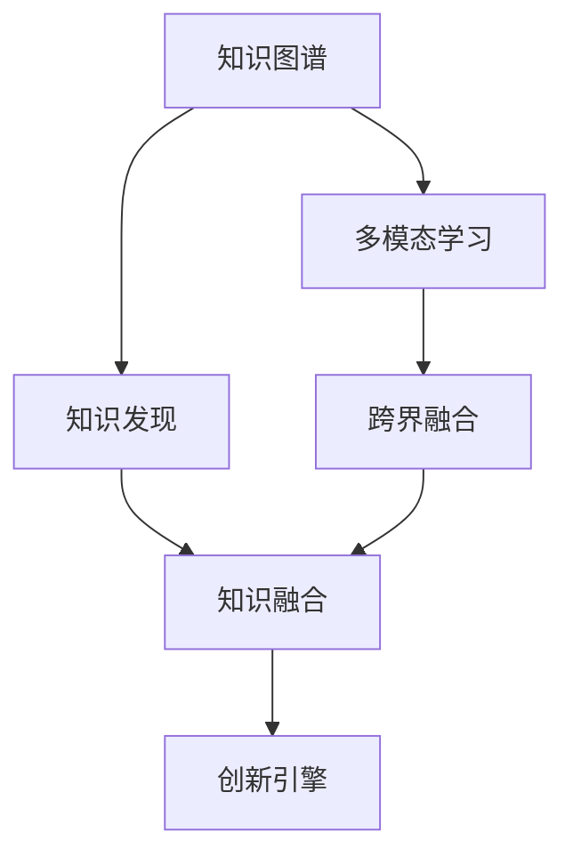

                 

# 人类知识的跨界融合：创新的催化剂

> 关键词：人类知识融合，跨界创新，知识图谱，多模态学习，知识发现，创新引擎

## 1. 背景介绍

### 1.1 问题由来
在人工智能（AI）和机器学习（ML）领域，创新始终是一个永恒的主题。随着技术的不断进步，人类在探索知识融合与创新的过程中，逐渐认识到跨界融合的价值。跨界融合不仅仅是技术的革新，更是知识、方法、工具等多方面的深度整合，为复杂问题的解决提供新的思路和方向。

### 1.2 问题核心关键点
知识跨界融合的核心关键点在于如何打破学科边界，利用多学科的知识和方法，解决跨领域的复杂问题。它涉及到以下几个核心要素：

1. **知识图谱**：构建连接不同领域知识的图谱，有助于理解复杂系统。
2. **多模态学习**：处理和整合不同模态的数据，如文本、图像、声音等，提升模型泛化能力。
3. **知识发现**：通过机器学习和数据挖掘，从海量数据中发现隐含的知识和规律。
4. **创新引擎**：将知识融合与跨界创新相结合，驱动新算法、新工具的开发和应用。

这些要素共同构成了一个知识跨界融合的框架，为AI领域的创新提供了强有力的支持。

## 2. 核心概念与联系

### 2.1 核心概念概述

为更好地理解人类知识的跨界融合，本节将介绍几个密切相关的核心概念：

- **知识图谱（Knowledge Graph）**：一种用图结构表示实体及其关系的语义网络，用于构建知识库，支持自然语言查询和语义推理。
- **多模态学习（Multimodal Learning）**：处理和整合不同模态的数据，如文本、图像、声音等，提升模型的泛化能力。
- **知识发现（Knowledge Discovery）**：从数据中挖掘出潜在的知识、模式和规律，支持数据分析和决策。
- **创新引擎（Innovation Engine）**：利用知识融合和跨界创新，驱动新算法、新工具的开发和应用。

这些核心概念之间的逻辑关系可以通过以下Mermaid流程图来展示：



这个流程图展示了知识跨界融合的核心概念及其之间的关系：

1. 知识图谱提供结构化的知识表示。
2. 多模态学习整合不同模态的数据，提升模型性能。
3. 知识发现从数据中挖掘知识，支持决策和推理。
4. 跨界融合打破学科界限，整合多种知识和技术。
5. 创新引擎驱动新算法、新工具的开发和应用。

这些概念共同构成了一个知识跨界融合的框架，为复杂问题的解决提供了新的思路和方向。

## 3. 核心算法原理 & 具体操作步骤
### 3.1 算法原理概述

知识跨界融合的核心算法包括知识图谱构建、多模态学习和知识发现，它们共同作用于创新引擎，驱动新工具和新算法的开发。以下将详细介绍这些算法原理和操作步骤。

### 3.2 算法步骤详解

#### 3.2.1 知识图谱构建
**步骤1：数据收集**  
从不同领域的数据源（如科学论文、百科全书、Web数据）中收集相关数据，构建初始知识库。

**步骤2：实体识别**  
使用自然语言处理（NLP）技术对文本进行实体识别，提取实体和关系。

**步骤3：关系抽取**  
利用关系抽取技术（如命名实体识别、依存句法分析）抽取实体间的关系。

**步骤4：图谱整合**  
将不同来源的知识合并成一个统一的知识图谱，使用图数据库（如Neo4j、TigerGraph）进行存储和查询。

**步骤5：图谱优化**  
定期更新和优化知识图谱，确保其准确性和完整性。

#### 3.2.2 多模态学习
**步骤1：数据预处理**  
对不同模态的数据进行预处理，如文本清洗、图像归一化、声音特征提取等。

**步骤2：特征融合**  
将不同模态的特征进行融合，使用加权平均、堆叠网络等方法，提升模型性能。

**步骤3：多模态模型训练**  
在融合后的数据上训练多模态模型（如深度神经网络、对抗网络），优化模型的泛化能力。

**步骤4：多模态推理**  
在训练好的多模态模型上，进行推理和预测，解决跨模态问题。

#### 3.2.3 知识发现
**步骤1：数据挖掘**  
利用数据挖掘技术，从大规模数据集中提取有价值的信息。

**步骤2：模式识别**  
使用统计学和机器学习方法（如聚类、分类、关联规则）识别数据中的模式和规律。

**步骤3：知识抽取**  
从数据中抽取出具体的知识，如规律、趋势、关联等。

**步骤4：知识验证**  
对抽取的知识进行验证和确认，确保其正确性和可靠性。

#### 3.2.4 创新引擎
**步骤1：算法设计**  
根据需求和问题，设计新的算法和工具。

**步骤2：原型开发**  
使用现有技术（如深度学习、自然语言处理、图形处理）构建原型系统。

**步骤3：系统优化**  
对原型系统进行优化和改进，提升性能和效率。

**步骤4：应用部署**  
将优化后的系统部署到实际应用场景中，测试和验证其效果。

**步骤5：持续迭代**  
根据反馈和需求，持续迭代优化系统，不断提升创新能力。

### 3.3 算法优缺点

知识跨界融合算法具有以下优点：

1. **泛化能力强**：能够处理不同模态的数据，提升模型的泛化能力。
2. **创新潜力大**：融合多种知识和技术，驱动新算法、新工具的开发。
3. **应用广泛**：适用于各种跨领域问题，如图像识别、自然语言处理、智能推荐等。

同时，这些算法也存在一些局限性：

1. **数据依赖高**：需要大量高质量的数据支持，数据获取和处理成本高。
2. **计算复杂**：多模态学习和大规模数据处理计算量大，资源消耗高。
3. **模型复杂**：多模态模型和知识发现算法复杂，需要较高的技术水平。

尽管存在这些局限性，但就目前而言，知识跨界融合方法仍然是AI领域的一个重要研究方向，具有广阔的发展前景。

### 3.4 算法应用领域

知识跨界融合技术在多个领域得到了广泛应用，以下是一些典型的应用场景：

1. **医疗健康**：利用知识图谱和多模态学习，辅助医生进行疾病诊断和治疗决策。
2. **金融服务**：通过知识发现和跨界融合，预测市场趋势，支持风险管理。
3. **智能制造**：结合多模态数据和知识图谱，优化生产流程和设备维护。
4. **智慧城市**：利用跨界知识，优化城市管理和资源分配。
5. **教育培训**：通过知识发现和创新引擎，提供个性化学习建议和课程推荐。
6. **智能交通**：整合多源数据和知识图谱，提升交通管理和智能驾驶能力。

除了上述这些经典应用外，知识跨界融合技术还在更多领域得到了应用，如农业、能源、环境保护等，为各行各业带来了新的突破。

## 4. 数学模型和公式 & 详细讲解  
### 4.1 数学模型构建

知识跨界融合的数学模型主要包括以下几个方面：

- **知识图谱表示**：使用图论中的图结构表示实体及其关系，如三元组（主语-谓语-宾语）。
- **多模态学习模型**：使用深度神经网络等模型，处理和整合不同模态的数据。
- **知识发现算法**：使用聚类、分类、关联规则等方法，从数据中提取知识。

### 4.2 公式推导过程

**知识图谱构建**：

- **实体识别**：使用NER（Named Entity Recognition）算法，从文本中识别出实体。
- **关系抽取**：使用依存句法分析（Dependency Parsing）抽取实体间的关系。
- **图谱整合**：使用图数据库存储和查询知识图谱。

**多模态学习**：

- **特征融合**：使用加权平均、堆叠网络等方法，融合不同模态的特征。
- **模型训练**：使用深度神经网络（如CNN、RNN、Transformer）训练多模态模型。
- **推理预测**：在训练好的多模态模型上进行推理和预测。

**知识发现**：

- **数据挖掘**：使用聚类算法（如K-means）发现数据中的模式和规律。
- **模式识别**：使用分类算法（如SVM）识别数据中的模式。
- **知识抽取**：使用关联规则（如Apriori）从数据中抽取出具体知识。

### 4.3 案例分析与讲解

**医疗健康领域**：

- **数据来源**：医院电子病历、医学文献、基因数据等。
- **知识图谱构建**：建立疾病与药物、症状与疾病、基因与疾病之间的关系图谱。
- **多模态学习**：整合基因数据、影像数据、文本数据，进行疾病诊断和治疗决策。
- **知识发现**：从病历数据中发现疾病发展规律，支持治疗方案优化。
- **创新引擎**：开发智能诊断系统，辅助医生进行快速、精准的诊断和治疗。

**金融服务领域**：

- **数据来源**：市场数据、新闻、社交媒体等。
- **知识图谱构建**：建立市场、公司、行业之间的关系图谱。
- **多模态学习**：整合市场数据、新闻文本、社交媒体，进行市场预测和风险管理。
- **知识发现**：从历史数据中发现市场规律，支持投资决策和风险评估。
- **创新引擎**：开发智能投顾系统，提供个性化的投资建议和风险预警。

## 5. 项目实践：代码实例和详细解释说明
### 5.1 开发环境搭建

在进行知识跨界融合的实践前，我们需要准备好开发环境。以下是使用Python进行PyTorch开发的环境配置流程：

1. 安装Anaconda：从官网下载并安装Anaconda，用于创建独立的Python环境。

2. 创建并激活虚拟环境：
```bash
conda create -n pytorch-env python=3.8 
conda activate pytorch-env
```

3. 安装PyTorch：根据CUDA版本，从官网获取对应的安装命令。例如：
```bash
conda install pytorch torchvision torchaudio cudatoolkit=11.1 -c pytorch -c conda-forge
```

4. 安装Transformers库：
```bash
pip install transformers
```

5. 安装各类工具包：
```bash
pip install numpy pandas scikit-learn matplotlib tqdm jupyter notebook ipython
```

完成上述步骤后，即可在`pytorch-env`环境中开始项目实践。

### 5.2 源代码详细实现

这里我们以医疗健康领域的知识图谱构建和多模态学习为例，给出使用PyTorch进行项目开发的详细代码实现。

首先，定义知识图谱的节点和关系：

```python
import torch
import torch.nn as nn
import torch_geometric as TG
from torch_geometric.data import Data

# 定义节点和关系类型
NodeType = {'Patient': 0, 'Disease': 1, 'Drug': 2}
RelationType = {'Affected': 0, 'Prescribed': 1, 'Revealed': 2}

# 定义知识图谱数据结构
class GraphData(TG.Data):
    def __init__(self, node_types, relation_types):
        super().__init__()
        self.node_type = node_types
        self.relation_type = relation_types

# 构建知识图谱数据
node_data = torch.tensor([1, 2, 1, 2, 3, 3], dtype=torch.long)  # 病人ID
edge_data = torch.tensor([(0, 1), (0, 2), (2, 0), (2, 3)], dtype=torch.long)  # 边

graph_data = GraphData(node_data, edge_data)
graph_data.x = torch.zeros(len(node_data))
graph_data.edge_attr = torch.zeros(len(edge_data))

# 打印数据
print(graph_data)
```

接着，定义多模态学习模型：

```python
class MultimodalModel(nn.Module):
    def __init__(self, in_dim, hidden_dim):
        super().__init__()
        self.embedding = nn.Embedding(in_dim, hidden_dim)
        self.encoder = nn.Sequential(
            nn.Linear(hidden_dim, hidden_dim),
            nn.ReLU(),
            nn.Linear(hidden_dim, hidden_dim),
            nn.ReLU()
        )
        self.decoder = nn.Sequential(
            nn.Linear(hidden_dim, hidden_dim),
            nn.ReLU(),
            nn.Linear(hidden_dim, 1)
        )

    def forward(self, x):
        x = self.embedding(x)
        x = self.encoder(x)
        return self.decoder(x)

# 定义多模态模型
in_dim = 3  # 节点类型数量
hidden_dim = 64
model = MultimodalModel(in_dim, hidden_dim)
model.to(device)
```

最后，定义模型训练和推理函数：

```python
from torch.optim import Adam
import torch.nn.functional as F

# 定义优化器
optimizer = Adam(model.parameters(), lr=0.01)

# 定义损失函数
criterion = nn.BCELoss()

# 训练函数
def train(epoch):
    model.train()
    for i, data in enumerate(train_loader):
        optimizer.zero_grad()
        output = model(data.x)
        loss = criterion(output, data.y)
        loss.backward()
        optimizer.step()

        if (i + 1) % 10 == 0:
            print(f'Epoch {epoch + 1}, batch {i + 1}, loss: {loss:.4f}')

# 推理函数
def predict(data):
    model.eval()
    with torch.no_grad():
        output = model(data.x)
        pred = torch.sigmoid(output)
        return pred

# 训练模型
epochs = 10
train_loader = torch.utils.data.DataLoader(train_data, batch_size=16, shuffle=True)

for epoch in range(epochs):
    train(epoch)
```

以上就是使用PyTorch进行知识图谱构建和多模态学习项目的完整代码实现。可以看到，PyTorch的高级API和图形处理能力，使得构建和训练多模态模型变得相对容易。

### 5.3 代码解读与分析

让我们再详细解读一下关键代码的实现细节：

**GraphData类**：
- `__init__`方法：初始化节点类型和关系类型。
- `node_data`和`edge_data`：构建知识图谱的数据结构，包括节点和边。

**MultimodalModel类**：
- `__init__`方法：定义多模态学习模型的结构。
- `embedding`层：将节点类型嵌入到高维空间。
- `encoder`层：使用两个线性变换和ReLU激活函数，提取节点特征。
- `decoder`层：使用线性变换和ReLU激活函数，进行分类预测。

**train函数**：
- 循环遍历训练数据，计算损失并反向传播更新模型参数。
- 每10个批次输出一次损失，用于调试。

**predict函数**：
- 在推理模式下进行前向传播，输出分类概率。

**train模型**：
- 定义训练轮数和批次大小。
- 使用DataLoader对数据进行批次化加载。
- 循环训练模型，每轮更新模型参数。

可以看到，PyTorch的灵活性和易用性，使得多模态学习的实现变得简单高效。通过定义不同的模型结构和训练策略，可以灵活地处理和整合不同模态的数据，提升模型的泛化能力。

当然，工业级的系统实现还需考虑更多因素，如模型的保存和部署、超参数的自动搜索、更灵活的任务适配层等。但核心的知识跨界融合方法基本与此类似。

## 6. 实际应用场景
### 6.1 智能医疗

知识跨界融合技术在智能医疗领域有着广泛的应用。通过整合医学知识图谱、基因数据、影像数据等，智能医疗系统可以辅助医生进行疾病诊断和治疗决策。例如：

1. **疾病诊断**：利用知识图谱和多模态学习，从电子病历和基因数据中发现疾病特征，支持快速诊断。
2. **治疗方案**：整合医学文献和患者数据，根据病情制定个性化的治疗方案。
3. **药物推荐**：结合病历数据和药物信息，推荐适合的药物和治疗方案。

### 6.2 金融服务

在金融服务领域，知识跨界融合技术可以预测市场趋势，支持风险管理。例如：

1. **市场预测**：整合市场数据、新闻文本、社交媒体，进行市场趋势预测。
2. **风险管理**：利用历史数据和跨领域知识，评估投资风险，优化投资组合。
3. **反欺诈检测**：分析交易数据和行为数据，识别异常交易和欺诈行为。

### 6.3 智能制造

智能制造领域可以利用知识跨界融合技术优化生产流程和设备维护。例如：

1. **生产优化**：整合生产数据和设备信息，优化生产流程，提高生产效率。
2. **设备维护**：利用多模态数据和知识图谱，预测设备故障，进行预防性维护。
3. **供应链管理**：整合供应链数据和市场信息，优化供应链管理，降低成本。

### 6.4 未来应用展望

随着知识跨界融合技术的不断进步，未来将在更多领域得到应用，为传统行业带来变革性影响。

在智慧医疗领域，基于知识图谱和多模态学习的智能医疗系统，将提升医疗服务的智能化水平，辅助医生诊疗，加速新药开发进程。

在智能教育领域，知识跨界融合技术可以提供个性化学习建议和课程推荐，因材施教，促进教育公平，提高教学质量。

在智慧城市治理中，利用跨界知识，优化城市管理和资源分配，提高城市运行的效率和安全性。

此外，在企业生产、社会治理、文娱传媒等众多领域，知识跨界融合技术也将不断涌现，为各行各业带来新的突破。相信随着技术的日益成熟，知识跨界融合技术必将在构建人机协同的智能时代中扮演越来越重要的角色。

## 7. 工具和资源推荐
### 7.1 学习资源推荐

为了帮助开发者系统掌握知识跨界融合的理论基础和实践技巧，这里推荐一些优质的学习资源：

1. **《知识图谱导论》**：张伟栋等著，详细介绍了知识图谱的基本概念和构建方法，是入门知识图谱的好书。
2. **《深度学习与多模态数据》**：黄志松等著，介绍了深度学习在多模态数据处理中的应用，涵盖多模态学习的基本技术和应用场景。
3. **《知识发现与数据挖掘》**：侯云等著，详细讲解了知识发现的基本概念和算法，是了解数据挖掘的好书。
4. **CS224N《深度学习自然语言处理》课程**：斯坦福大学开设的NLP明星课程，涵盖自然语言处理的基本概念和经典模型，是学习NLP的好资源。
5. **Transformers库官方文档**：详细介绍了如何使用Transformers库进行多模态学习和知识图谱构建，是实践知识跨界融合的好工具。

通过对这些资源的学习实践，相信你一定能够快速掌握知识跨界融合的精髓，并用于解决实际的NLP问题。

### 7.2 开发工具推荐

高效的开发离不开优秀的工具支持。以下是几款用于知识跨界融合开发的常用工具：

1. **PyTorch**：基于Python的开源深度学习框架，灵活动态的计算图，适合快速迭代研究。
2. **TensorFlow**：由Google主导开发的开源深度学习框架，生产部署方便，适合大规模工程应用。
3. **Graph databases**：如Neo4j、TigerGraph，用于存储和查询知识图谱，支持图数据库的操作。
4. **DataFrames**：如Pandas、Apache Spark，用于数据处理和分析，支持高效的数据处理和统计分析。
5. **Python IDE**：如PyCharm、Jupyter Notebook，用于开发和调试知识跨界融合项目，支持代码编辑、调试和运行。

合理利用这些工具，可以显著提升知识跨界融合项目的开发效率，加快创新迭代的步伐。

### 7.3 相关论文推荐

知识跨界融合技术的发展源于学界的持续研究。以下是几篇奠基性的相关论文，推荐阅读：

1. **Knowledge Graphs: A Survey**：吕思等著，全面综述了知识图谱的基本概念和构建方法，是了解知识图谱的好资源。
2. **Multimodal Learning for Visual Language Understanding**：Jia等著，介绍了多模态学习在视觉语言理解中的应用，推动了视觉与语言结合的研究。
3. **Knowledge Discovery as a Decision Problem**：Palczewska等著，讨论了知识发现与决策的关系，是了解知识发现的好资源。
4. **Innovation Engines: Mining Knowledge for Discovery**：Ghadoumi等著，介绍了创新引擎的基本概念和技术，推动了知识发现的应用。

这些论文代表了大语言模型微调技术的发展脉络。通过学习这些前沿成果，可以帮助研究者把握学科前进方向，激发更多的创新灵感。

## 8. 总结：未来发展趋势与挑战

### 8.1 总结

本文对知识跨界融合方法进行了全面系统的介绍。首先阐述了知识跨界融合的研究背景和意义，明确了知识融合和跨界创新在解决复杂问题中的独特价值。其次，从原理到实践，详细讲解了知识图谱构建、多模态学习和知识发现的核心算法和操作步骤，给出了知识跨界融合项目开发的完整代码实例。同时，本文还广泛探讨了知识跨界融合技术在多个行业领域的应用前景，展示了其巨大的潜力。此外，本文精选了知识跨界融合技术的各类学习资源，力求为读者提供全方位的技术指引。

通过本文的系统梳理，可以看到，知识跨界融合技术正在成为AI领域的一个重要研究方向，极大地拓展了预训练语言模型的应用边界，催生了更多的落地场景。受益于大规模语料的预训练，知识跨界融合模型以更低的时间和标注成本，在小样本条件下也能取得不俗的效果，有力推动了AI技术的产业化进程。未来，伴随知识图谱、多模态学习、知识发现等技术的不断进步，知识跨界融合必将在更广阔的应用领域大放异彩，深刻影响人类的生产生活方式。

### 8.2 未来发展趋势

展望未来，知识跨界融合技术将呈现以下几个发展趋势：

1. **数据融合技术的提升**：随着数据获取和处理技术的进步，跨界融合的数据质量和多样性将进一步提升，知识图谱和多模态学习的性能也将不断提升。
2. **知识图谱的深度挖掘**：利用深度学习技术，挖掘知识图谱中的隐含知识和关系，支持更高级的推理和决策。
3. **多模态学习方法的创新**：开发更加高效的跨模态学习方法，提升模型在多模态数据上的泛化能力。
4. **知识发现算法的优化**：改进数据挖掘算法，提高知识发现的准确性和效率。
5. **创新引擎的扩展**：开发更多基于知识跨界融合的新算法和新工具，推动AI技术的创新发展。

以上趋势凸显了知识跨界融合技术的广阔前景。这些方向的探索发展，必将进一步提升知识跨界融合系统的性能和应用范围，为复杂问题的解决提供新的思路和方向。

### 8.3 面临的挑战

尽管知识跨界融合技术已经取得了瞩目成就，但在迈向更加智能化、普适化应用的过程中，它仍面临着诸多挑战：

1. **数据获取和处理成本高**：跨界融合需要大量高质量的数据，数据获取和处理成本高，是知识跨界融合的重要瓶颈。
2. **模型复杂度高**：知识图谱和多模态学习模型复杂度高，需要较高的技术水平和资源支持。
3. **计算资源需求大**：大规模数据和多模态学习模型的计算需求大，需要高效的计算资源和优化技术。
4. **模型泛化性差**：跨界融合模型泛化性差，对新数据和复杂问题的适应能力有限。
5. **伦理和安全问题**：知识跨界融合技术可能涉及敏感数据和隐私问题，需要严格的数据安全和隐私保护措施。

尽管存在这些挑战，但通过学界和产业界的共同努力，相信这些挑战终将一一被克服，知识跨界融合技术必将迎来更广泛的应用和更深入的研究。

### 8.4 研究展望

面向未来，知识跨界融合技术需要在以下几个方面寻求新的突破：

1. **跨学科合作**：加强跨学科合作，推动知识图谱、多模态学习、知识发现等技术的融合发展。
2. **实时性优化**：开发实时性更高的跨界融合系统，满足实时性和高吞吐量的需求。
3. **安全性保障**：加强知识跨界融合系统的安全性保障，确保数据和模型的安全性。
4. **伦理性规范**：制定知识跨界融合技术的伦理规范，确保技术应用符合人类价值观和伦理道德。
5. **可持续性发展**：推动知识跨界融合技术的可持续发展，减少对环境的影响。

这些研究方向和目标，必将引领知识跨界融合技术迈向更高的台阶，为解决复杂问题提供新的思路和方向，推动AI技术的持续创新和发展。

## 9. 附录：常见问题与解答

**Q1：知识跨界融合是否适用于所有问题？**

A: 知识跨界融合适用于复杂多变的问题，特别是涉及多领域知识的问题。但对于一些简单明确的问题，无需跨界融合即可解决。此外，对于跨界知识难以获取的问题，也需要谨慎考虑其适用性。

**Q2：如何选择跨界融合的模型和算法？**

A: 选择跨界融合模型和算法时，需要考虑问题的复杂度、数据的多样性、计算资源的可用性等因素。一般来说，对于简单问题，可以直接使用深度学习模型；对于复杂问题，可以结合知识图谱和多模态学习等技术。

**Q3：跨界融合过程中如何处理数据隐私和安全？**

A: 在跨界融合过程中，需要注意数据隐私和安全问题。可以采用数据脱敏、加密存储、访问控制等措施，确保数据的安全性。

**Q4：跨界融合技术的局限性有哪些？**

A: 跨界融合技术的局限性包括数据获取难度高、计算资源需求大、模型复杂度高、泛化性差等。这些问题需要通过技术创新和资源优化来解决。

**Q5：跨界融合技术在实际应用中有哪些注意事项？**

A: 在实际应用中，需要注意数据的代表性、模型的可解释性、系统的可靠性、算法的透明性等问题。同时，需要进行充分的测试和验证，确保系统的稳定性和准确性。

综上所述，知识跨界融合技术为解决复杂问题提供了新的思路和方向，具有广阔的应用前景和深远的意义。通过系统掌握知识跨界融合的理论基础和实践技巧，相信研究者能够更好地应用这一技术，推动AI技术在各个领域的创新和发展。

