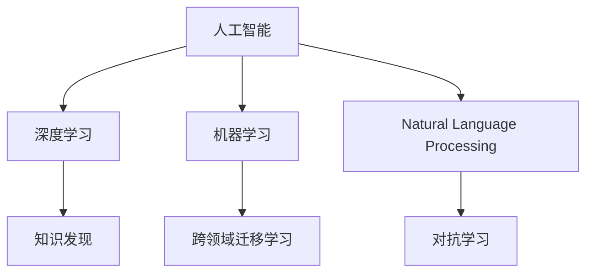

                 

# 人类知识的边界在哪里：无限的探索之旅

> 关键词：知识边界,人工智能,机器学习,深度学习,探索与创新

## 1. 背景介绍

### 1.1 问题由来
在当今科技飞速发展的时代，人类对知识的探索从未停止过。从宇宙的奥秘到微观粒子的行为，从地球生命的起源到意识与意识的本质，知识的边界究竟在哪里？这个问题引发了无数科学家和哲学家的思考。而随着人工智能（AI）技术的日益成熟，机器学习和深度学习在处理复杂问题上的卓越表现，让人类探索知识边界的途径又多了新的选项——通过“智能”的机器进行探索。

### 1.2 问题核心关键点
知识边界的探索不仅仅是一个科学问题，更是一个哲学问题。机器学习在处理大数据、模式识别、自然语言处理等方面的能力，使得它能够辅助人类在未知领域进行深入探索。同时，机器学习模型的自适应性、自我优化能力和跨领域迁移能力，使其在探索人类知识边界的道路上具有独特的优势。

本节将介绍几个与知识边界探索紧密相关的核心概念，并阐明它们之间的联系：

- 人工智能(AI)：机器学习、深度学习、自然语言处理、计算机视觉等领域的研究与应用。
- 深度学习(Deep Learning)：一种模仿人类大脑神经网络结构和功能的机器学习技术。
- 机器学习(Machine Learning)：让机器通过数据训练，自动学习和改进算法，以实现特定任务的智能。
- 自然语言处理(NLP)：使计算机能够理解、处理和生成人类语言的技术。
- 知识发现(Knowledge Discovery)：从大量数据中挖掘、发现、整理有用的知识。
- 跨领域迁移学习：将一个领域的知识迁移到另一个领域的机器学习技术。
- 对抗学习(Adversarial Learning)：训练机器模型抵御恶意攻击的技术。

这些核心概念的联系可以用以下Mermaid流程图表示：



## 2. 核心概念与联系

### 2.1 核心概念概述

为了更好地理解机器学习在探索人类知识边界上的作用，我们首先需要对上述核心概念有一个全面的了解：

- **人工智能**：旨在创造能自主思考、自我学习并适应环境的智能系统。
- **深度学习**：一种基于多层神经网络的机器学习技术，通过反向传播算法进行训练，不断优化网络结构，提升模型的学习能力。
- **机器学习**：使机器能自动学习数据的特征和规律，从而进行模式识别、分类、预测等任务。
- **自然语言处理**：通过理解和处理人类语言，使计算机能够进行文本分析、机器翻译、情感分析等任务。
- **知识发现**：利用数据挖掘技术从大量数据中提取出有用知识和规律，助力科学发现和决策。
- **跨领域迁移学习**：将一个领域学到的知识应用到另一个领域，使模型能更好地适应新场景。
- **对抗学习**：通过训练模型抵御攻击，提升模型的鲁棒性和安全性。

### 2.2 核心概念的数学模型

接下来，我们将使用数学语言对这些核心概念进行更加详细的刻画。

以深度学习为例，假设有一个神经网络模型，它由若干层神经元构成，其中第 $l$ 层的神经元数为 $n_l$，神经元之间的连接权重为 $w_{ij}^{(l)}$，每个神经元的激活函数为 $f$，则该神经网络的数学模型可以表示为：

$$
y = f\left(\sum_{i=1}^{n_l} \sum_{j=1}^{n_{l-1}} w_{ij}^{(l)} f\left(\sum_{k=1}^{n_{l-1}} w_{ik}^{(l-1)} f\left(\sum_{m=1}^{n_0} w_{mj}^{(0)} x_m\right)\right)\right)
$$

其中，$x$ 表示输入数据，$y$ 表示输出。

而对于机器学习，它的目标是通过数据训练，使得模型能够对新的数据进行预测和分类。例如，在二分类问题中，我们希望模型能够将输入数据 $x$ 分为两类 $y \in \{0, 1\}$。模型的损失函数为交叉熵损失函数，可以表示为：

$$
L(y, \hat{y}) = -y\log \hat{y} - (1-y)\log (1-\hat{y})
$$

其中，$\hat{y}$ 表示模型对输入数据的预测结果。

### 2.3 核心概念的应用领域

这些核心概念在实际应用中具有广泛的领域。以下是它们各自的应用示例：

- **人工智能**：广泛应用于自动驾驶、智能客服、医疗诊断、金融风险评估等领域。
- **深度学习**：在图像识别、语音识别、自然语言处理、推荐系统等领域表现出色。
- **机器学习**：涉及预测分析、客户细分、欺诈检测、信用评分等商业应用。
- **自然语言处理**：应用于文本分类、情感分析、机器翻译、问答系统等。
- **知识发现**：用于科学研究、情报分析、市场预测、用户行为分析等。
- **跨领域迁移学习**：在医疗影像分析、金融风控、网络安全等领域有广泛应用。
- **对抗学习**：用于网络安全、广告过滤、图像篡改检测等。

## 3. 核心算法原理 & 具体操作步骤

### 3.1 算法原理概述

探索人类知识的边界，本质上是一个多学科、多领域的问题，涉及数据挖掘、统计分析、模型优化等多个方面。机器学习在这里扮演了关键角色，通过数据训练，不断优化模型，实现对未知领域的探索。

机器学习的核心算法包括监督学习、无监督学习和强化学习。其中，监督学习是通过已标注的数据训练模型，使其能够对新的数据进行预测和分类；无监督学习是从数据中挖掘潜在模式和结构，发现未知的知识；强化学习则是通过试错，不断优化策略，实现最优决策。

在探索知识边界的过程中，监督学习算法是最常用的。它通过对大量数据的学习，识别数据中的规律和模式，进而辅助人类在未知领域进行深入探索。

### 3.2 算法步骤详解

以深度学习模型在自然语言处理中的应用为例，我们详细介绍其操作步骤：

**Step 1: 数据准备**
- 收集和整理数据集。数据集的质量和规模直接影响模型的性能。
- 对数据进行预处理，包括文本清洗、分词、词向量表示等。

**Step 2: 模型选择与构建**
- 选择合适的深度学习模型，如Transformer、LSTM、CNN等。
- 根据具体任务设计模型的架构，包括输入层、隐藏层、输出层等。
- 定义损失函数，选择合适的优化器。

**Step 3: 模型训练**
- 将数据集划分为训练集、验证集和测试集。
- 使用训练集对模型进行训练，通过反向传播算法更新模型参数。
- 在验证集上评估模型性能，防止过拟合。
- 调整模型参数，如学习率、批次大小等。

**Step 4: 模型评估与优化**
- 使用测试集对模型进行评估，评估指标包括准确率、召回率、F1值等。
- 根据评估结果调整模型参数，提升模型性能。
- 引入正则化技术，如Dropout、L2正则等，防止过拟合。

**Step 5: 模型应用与迭代**
- 将训练好的模型应用于实际问题中，进行知识探索。
- 根据探索结果，收集新数据，对模型进行迭代优化。

### 3.3 算法优缺点

深度学习模型在探索人类知识边界方面具有以下优点：
- 强大的数据处理能力：能够处理大规模数据集，提取数据中的复杂模式。
- 自适应性：模型能够自动调整参数，适应不同的数据分布。
- 泛化能力强：通过迁移学习，将一个领域学到的知识迁移到另一个领域。

同时，深度学习模型也存在一些局限性：
- 数据需求高：需要大量标注数据进行训练，数据获取成本高。
- 模型复杂：深度模型结构复杂，训练时间长，计算资源消耗大。
- 黑箱问题：模型内部工作机制不透明，难以解释和调试。

### 3.4 算法应用领域

深度学习模型已经在多个领域展现了其强大的探索能力，以下是几个典型的应用示例：

- **自然语言处理**：用于机器翻译、文本分类、情感分析、问答系统等。
- **计算机视觉**：用于图像识别、物体检测、图像分割等。
- **语音识别**：用于语音合成、语音识别、情感识别等。
- **推荐系统**：用于个性化推荐、广告推荐等。
- **金融风控**：用于信用评估、欺诈检测、市场预测等。
- **医疗影像分析**：用于疾病诊断、影像分类、图像重建等。

## 4. 数学模型和公式 & 详细讲解 & 举例说明

### 4.1 数学模型构建

深度学习模型通常采用神经网络结构，其数学模型可以表示为：

$$
y = f\left(\sum_{i=1}^{n_l} \sum_{j=1}^{n_{l-1}} w_{ij}^{(l)} f\left(\sum_{k=1}^{n_{l-1}} w_{ik}^{(l-1)} f\left(\sum_{m=1}^{n_0} w_{mj}^{(0)} x_m\right)\right)\right)
$$

其中，$x$ 表示输入数据，$y$ 表示输出，$w$ 表示权重，$f$ 表示激活函数。

### 4.2 公式推导过程

以反向传播算法为例，其公式推导过程如下：

设模型损失函数为 $L(y, \hat{y})$，其中 $y$ 为真实标签，$\hat{y}$ 为模型预测值。则损失函数对每个参数 $w$ 的梯度可以表示为：

$$
\frac{\partial L}{\partial w} = \frac{\partial L}{\partial \hat{y}} \frac{\partial \hat{y}}{\partial z} \frac{\partial z}{\partial w}
$$

其中，$\frac{\partial L}{\partial \hat{y}}$ 表示损失函数对预测值的梯度，$\frac{\partial \hat{y}}{\partial z}$ 表示预测值对中间层输出的梯度，$\frac{\partial z}{\partial w}$ 表示中间层输出对权重的梯度。

### 4.3 案例分析与讲解

以图像识别为例，我们分析深度学习模型在图像分类中的应用。

假设有一个卷积神经网络模型，其结构如图1所示：

```
   输入层
    | |
    | |
   卷积层1
    | |
    | |
   激活层1
    | |
    | |
   池化层1
    | |
    | |
   卷积层2
    | |
    | |
   激活层2
    | |
    | |
   池化层2
    | |
    | |
   全连接层
    | |
    | |
   输出层
```

其中，卷积层和池化层用于提取特征，激活层和全连接层用于分类。假设输入图像为 $x$，输出标签为 $y$，模型预测结果为 $\hat{y}$。则模型可以表示为：

$$
y = f\left(\sum_{i=1}^{n_l} \sum_{j=1}^{n_{l-1}} w_{ij}^{(l)} f\left(\sum_{k=1}^{n_{l-1}} w_{ik}^{(l-1)} f\left(\sum_{m=1}^{n_0} w_{mj}^{(0)} x_m\right)\right)\right)
$$

其中，$n_l$ 表示第 $l$ 层的神经元数。

## 5. 项目实践：代码实例和详细解释说明

### 5.1 开发环境搭建

在进行项目实践前，我们需要准备好开发环境。以下是使用Python进行TensorFlow开发的流程图：

1. 安装Anaconda：从官网下载并安装Anaconda，用于创建独立的Python环境。

2. 创建并激活虚拟环境：
```bash
conda create -n tf-env python=3.8 
conda activate tf-env
```

3. 安装TensorFlow：根据CUDA版本，从官网获取对应的安装命令。例如：
```bash
conda install tensorflow -c conda-forge
```

4. 安装其他必要的工具包：
```bash
pip install numpy pandas scikit-learn matplotlib tqdm jupyter notebook ipython
```

完成上述步骤后，即可在`tf-env`环境中开始项目实践。

### 5.2 源代码详细实现

下面以图像分类任务为例，给出使用TensorFlow对卷积神经网络模型进行训练的代码实现。

```python
import tensorflow as tf
from tensorflow.keras import layers

# 定义模型结构
model = tf.keras.Sequential([
    layers.Conv2D(32, (3, 3), activation='relu', input_shape=(28, 28, 1)),
    layers.MaxPooling2D((2, 2)),
    layers.Flatten(),
    layers.Dense(10, activation='softmax')
])

# 编译模型
model.compile(optimizer='adam', loss='categorical_crossentropy', metrics=['accuracy'])

# 加载数据集
mnist = tf.keras.datasets.mnist.load_data()
(x_train, y_train), (x_test, y_test) = mnist

# 数据预处理
x_train = x_train.reshape(-1, 28, 28, 1) / 255.0
x_test = x_test.reshape(-1, 28, 28, 1) / 255.0
y_train = tf.keras.utils.to_categorical(y_train, 10)
y_test = tf.keras.utils.to_categorical(y_test, 10)

# 训练模型
model.fit(x_train, y_train, epochs=10, batch_size=32, validation_data=(x_test, y_test))

# 评估模型
model.evaluate(x_test, y_test)
```

以上就是使用TensorFlow对卷积神经网络模型进行图像分类任务训练的完整代码实现。可以看到，TensorFlow提供了丰富的工具和API，使得模型训练和评估变得简便高效。

### 5.3 代码解读与分析

让我们再详细解读一下关键代码的实现细节：

**Sequential模型定义**：
- 通过`tf.keras.Sequential`定义了一个包含多个层的序列模型，包括卷积层、激活层、池化层和全连接层。
- 其中，`Conv2D`层用于提取图像特征，`MaxPooling2D`层用于减小特征图大小，`Flatten`层将特征图展平为1D向量，`Dense`层用于分类。

**模型编译**：
- 使用`model.compile`方法编译模型，指定了优化器、损失函数和评估指标。
- 在训练过程中，优化器使用Adam算法，损失函数使用交叉熵，评估指标为准确率。

**数据加载与预处理**：
- 使用`tf.keras.datasets.mnist.load_data()`方法加载MNIST数据集。
- 对数据进行预处理，包括将图像像素值归一化到[0, 1]，并将标签进行独热编码。

**模型训练与评估**：
- 使用`model.fit`方法训练模型，指定了训练数据、批次大小、训练轮数和验证数据。
- 在训练过程中，每个批次取32张图像，训练10轮。
- 使用`model.evaluate`方法评估模型性能，输出测试集上的准确率。

**运行结果展示**：
- 输出训练过程中和测试结果的损失和准确率，展示了模型的训练效果。

## 6. 实际应用场景

### 6.1 智能客服系统

基于深度学习模型的智能客服系统可以显著提升客户体验和问题解决效率。通过微调模型，使其能够理解用户意图，提供个性化的回复，甚至能够进行情感分析，判断用户情绪，从而更好地进行人机交互。

### 6.2 金融风控系统

深度学习模型在金融风控系统中的应用，可以大大提升风险评估的准确性和效率。通过对历史交易数据的学习，模型能够识别出潜在的欺诈行为，预测用户的信用风险，帮助金融机构做出更精准的决策。

### 6.3 医疗影像分析

深度学习模型在医疗影像分析中的应用，可以显著提升诊断的准确性和效率。通过对大量医学影像数据的学习，模型能够自动发现病灶，进行图像分类，甚至可以进行肿瘤检测和影像分割，辅助医生进行诊断和治疗。

### 6.4 未来应用展望

随着深度学习技术的发展，深度学习模型在探索人类知识边界上的应用前景将更加广阔。以下是几个未来可能的应用场景：

- **人工智能辅助科学研究**：在天文、物理、化学等领域，深度学习模型可以辅助科学家进行数据挖掘和分析，发现新的科学规律。
- **智能家居与物联网**：深度学习模型可以用于智能家居设备控制、环境监测、智能家居场景优化等，提升用户的生活质量。
- **虚拟现实与增强现实**：深度学习模型可以用于虚拟现实和增强现实中的图像和语音识别，提升用户体验。
- **自动驾驶与机器人**：深度学习模型可以用于自动驾驶和机器人控制，提高交通安全和效率。

## 7. 工具和资源推荐

### 7.1 学习资源推荐

为了帮助开发者系统掌握深度学习技术，这里推荐一些优质的学习资源：

1. **《深度学习》（Ian Goodfellow）**：深入浅出地介绍了深度学习的理论和实践，适合初学者和专业人士。
2. **《动手学深度学习》（李沐等）**：基于PyTorch实现的深度学习教程，注重实践，适合初学者。
3. **Coursera《深度学习专项课程》**：斯坦福大学提供的深度学习课程，由Andrew Ng讲授，内容丰富，适合全面学习深度学习。
4. **DeepLearning.ai《深度学习专项课程》**：由Andrew Ng讲授，涵盖深度学习的理论、实践和应用，适合全面学习深度学习。
5. **Kaggle竞赛**：参加Kaggle数据科学竞赛，实战演练，提升深度学习能力。

通过对这些资源的深入学习，相信你一定能够掌握深度学习技术的精髓，并用于解决实际问题。

### 7.2 开发工具推荐

高效的深度学习开发离不开优秀的工具支持。以下是几款用于深度学习开发的常用工具：

1. **PyTorch**：基于Python的开源深度学习框架，灵活动态的计算图，适合快速迭代研究。
2. **TensorFlow**：由Google主导开发的开源深度学习框架，生产部署方便，适合大规模工程应用。
3. **JAX**：基于JIT编译的深度学习框架，速度快，支持GPU和TPU加速。
4. **MXNet**：由Apache开发的深度学习框架，支持多种编程语言，适合大规模分布式训练。
5. **HuggingFace Transformers库**：提供了多种预训练语言模型，支持微调任务开发，适合NLP任务。
6. **Scikit-learn**：基于Python的机器学习库，包含多种经典机器学习算法，适合各种数据分析和预测任务。

合理利用这些工具，可以显著提升深度学习模型的开发效率，加快创新迭代的步伐。

### 7.3 相关论文推荐

深度学习技术的发展源于学界的持续研究。以下是几篇奠基性的相关论文，推荐阅读：

1. **AlexNet：ImageNet Large Scale Learning**：提出AlexNet模型，开启深度学习在计算机视觉领域的应用。
2. **RNN与LSTM：Long Short-Term Memory**：提出循环神经网络和长短时记忆网络，用于处理序列数据。
3. **深度卷积神经网络：ImageNet Large Scale Learning**：提出VGG网络，用于图像分类和识别。
4. **深度学习在语音识别中的应用**：提出WaveNet模型，用于语音合成和生成。
5. **深度学习在自然语言处理中的应用**：提出Transformer模型，用于机器翻译和语言生成。

这些论文代表了大深度学习技术的演进脉络，通过学习这些前沿成果，可以帮助研究者把握学科前进方向，激发更多的创新灵感。

## 8. 总结：未来发展趋势与挑战

### 8.1 总结

本文对深度学习在探索人类知识边界中的应用进行了全面系统的介绍。首先阐述了深度学习在处理大数据、模式识别、自然语言处理等方面的卓越表现，明确了深度学习在探索知识边界上的独特价值。其次，从原理到实践，详细讲解了深度学习的数学模型和关键步骤，给出了深度学习任务开发的完整代码实例。同时，本文还广泛探讨了深度学习在智能客服、金融风控、医疗影像等领域的应用前景，展示了深度学习技术的广阔前景。

通过本文的系统梳理，可以看到，深度学习技术已经在多个领域展现出强大的探索能力，为科学研究、产业应用、智能系统等提供了有力支持。未来，伴随深度学习技术的不断演进，人类探索知识边界的道路将更加宽广，深度学习必将在更多领域发挥重要作用。

### 8.2 未来发展趋势

展望未来，深度学习技术将呈现以下几个发展趋势：

1. **模型规模持续增大**：深度学习模型的参数量将持续增长，超大规模模型蕴含的丰富知识，将为人类探索知识边界提供更多可能。
2. **模型性能不断提升**：随着算力成本的下降和模型架构的改进，深度学习模型的性能将不断提升，能够处理更复杂的数据和任务。
3. **跨领域迁移学习**：深度学习模型将具有更强的跨领域迁移能力，能够在不同领域之间进行知识迁移，提升模型的泛化性。
4. **深度强化学习**：深度学习与强化学习的结合，将使得模型能够在复杂环境中进行智能决策，探索未知领域。
5. **自监督学习**：自监督学习可以有效地利用未标注数据，提升深度学习模型的学习效率，探索更多的未知领域。

以上趋势凸显了深度学习技术的广阔前景，这些方向的探索发展，必将进一步提升深度学习模型的性能和应用范围，为人类探索知识边界带来新的突破。

### 8.3 面临的挑战

尽管深度学习技术已经取得了瞩目成就，但在探索人类知识边界的道路上，仍面临诸多挑战：

1. **数据需求高**：深度学习模型需要大量的标注数据进行训练，数据获取成本高，数据质量问题也可能影响模型性能。
2. **计算资源需求大**：深度学习模型在训练和推理时，需要大量的计算资源，对硬件要求较高。
3. **模型复杂**：深度学习模型的结构和训练过程复杂，调试和优化难度大。
4. **模型解释性不足**：深度学习模型的内部工作机制不透明，难以解释和调试。
5. **模型鲁棒性不足**：深度学习模型在面对不同数据分布时，泛化性能可能较差，容易发生过拟合。

### 8.4 研究展望

面对深度学习面临的挑战，未来的研究需要在以下几个方面寻求新的突破：

1. **自监督学习**：通过自监督学习，利用未标注数据进行模型训练，减少对标注数据的依赖，探索更多的未知领域。
2. **知识图谱与符号计算**：将符号化的先验知识与深度学习模型结合，提升模型的解释性和可解释性。
3. **跨领域迁移学习**：通过跨领域迁移学习，提升模型的泛化性和适应性，探索更多的未知领域。
4. **强化学习**：通过深度强化学习，使模型能够在复杂环境中进行智能决策，探索未知领域。
5. **对抗学习**：通过对抗学习，提升模型的鲁棒性和安全性，探索更多的未知领域。

这些研究方向的研究，必将使得深度学习技术在探索人类知识边界上发挥更大的作用，为人类认知智能的进步提供新的动力。

## 9. 附录：常见问题与解答

**Q1：深度学习是否适用于所有知识探索问题？**

A: 深度学习在处理大数据、复杂模式识别、自然语言处理等方面表现出色，但在一些需要高度符号化理解和知识推理的任务中，深度学习的效果可能不如其他技术。例如，在科学推理、法律判决等任务中，符号化的知识推理和逻辑推理更为重要。

**Q2：深度学习模型的泛化性能如何保证？**

A: 深度学习模型的泛化性能主要通过正则化技术、对抗学习、跨领域迁移学习等方式进行提升。正则化技术可以防止过拟合，对抗学习可以提高模型的鲁棒性，跨领域迁移学习可以将一个领域学到的知识迁移到另一个领域，提升模型的泛化性能。

**Q3：深度学习模型在探索未知领域时，如何确保模型的安全性和可靠性？**

A: 深度学习模型在探索未知领域时，需要确保模型的安全性和可靠性。可以通过引入对抗学习、知识图谱、符号计算等技术，提升模型的解释性和可解释性。同时，需要在数据预处理和模型训练过程中引入伦理导向的评估指标，避免有害信息的传播和误导。

**Q4：深度学习模型在探索未知领域时，如何克服数据需求高的问题？**

A: 深度学习模型在探索未知领域时，可以采用自监督学习、迁移学习等方式，利用未标注数据和已有知识进行训练，减少对标注数据的依赖。同时，可以通过数据增强、数据合成等技术，生成更多的训练数据。

**Q5：深度学习模型在探索未知领域时，如何确保模型的稳定性和鲁棒性？**

A: 深度学习模型在探索未知领域时，需要确保模型的稳定性和鲁棒性。可以通过引入对抗学习、正则化技术、多模型集成等方式，提升模型的鲁棒性和稳定性。同时，需要在数据预处理和模型训练过程中引入伦理导向的评估指标，避免有害信息的传播和误导。

通过本文的系统梳理，可以看到，深度学习技术在探索人类知识边界上展现出巨大的潜力，为科学研究、产业应用、智能系统等提供了有力支持。未来，伴随深度学习技术的不断演进，人类探索知识边界的道路将更加宽广，深度学习必将在更多领域发挥重要作用。

---

作者：禅与计算机程序设计艺术 / Zen and the Art of Computer Programming

