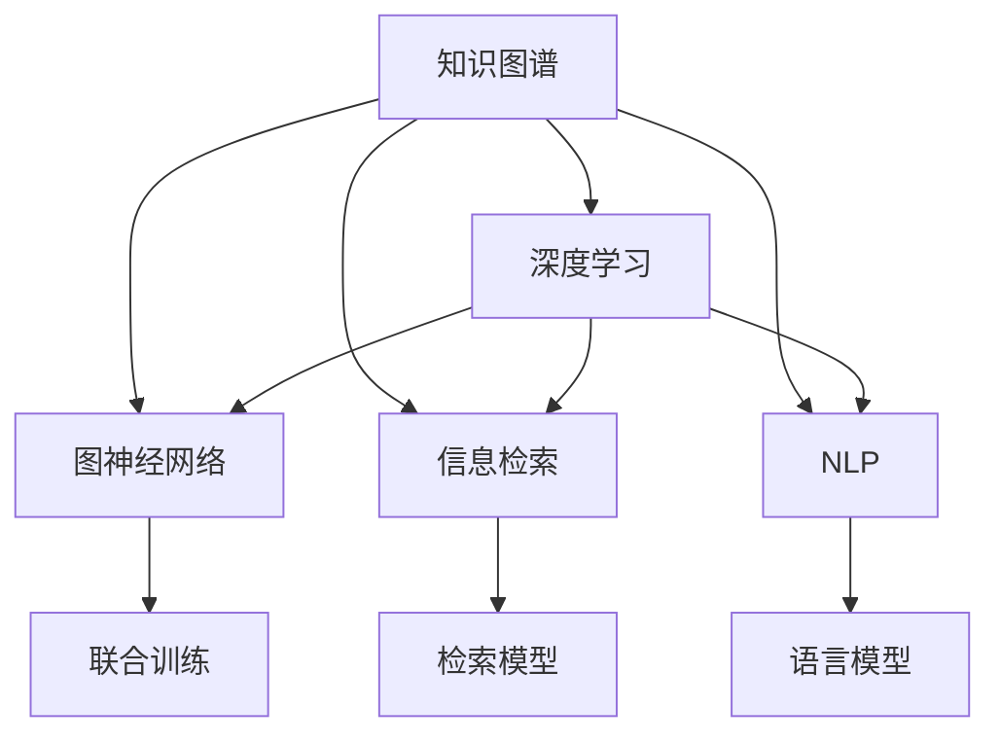

                 

# 人类知识的进步：一场跨越时空的对话

> 关键词：知识图谱，深度学习，图神经网络，信息检索，自然语言处理

## 1. 背景介绍

知识的增长是人类文明进步的核心动力。随着技术的迭代，人类获取、存储、处理知识的方式不断演进，从早期的文字记录到现代的电子化存储，再到当下的人工智能技术，知识的价值被不断挖掘和扩展。当前，知识图谱和深度学习技术的结合，为人类知识的系统化、智能化提供了前所未有的机遇，推动了知识管理与应用的大规模实践。

## 2. 核心概念与联系

### 2.1 核心概念概述

知识图谱(Knowledge Graph)是一种结构化的语义数据模型，通过节点和边表示实体和实体之间的关系，为信息检索、自然语言处理等任务提供高质量的语义理解能力。

深度学习(Deep Learning)是一种基于神经网络的机器学习算法，通过多层次的抽象特征提取，实现对复杂模式的识别和处理。

图神经网络(Graph Neural Network, GNN)是一种专门处理图结构数据的深度学习模型，通过在神经网络中引入图结构信息，提升模型的表达能力和推理能力。

信息检索(Information Retrieval)是一种根据用户查询获取相关信息的技术，广泛应用于搜索引擎、图书馆管理等场景。

自然语言处理(Natural Language Processing, NLP)是一种使计算机能够理解、处理人类语言的技术，包括文本分类、命名实体识别、机器翻译等。

这些核心概念之间的联系可以通过以下Mermaid流程图来展示：



这个流程图展示了一个典型知识图谱与深度学习技术的互动框架：

1. 知识图谱提供了丰富的语义信息，辅助深度学习模型进行更精准的知识抽取和推理。
2. 图神经网络在知识图谱的基础上，提升了模型对复杂图结构数据的表达能力。
3. 信息检索技术依托深度学习模型，提升了查询的精确度和召回率。
4. 自然语言处理结合知识图谱和深度学习模型，使计算机更好地理解人类语言。

## 3. 核心算法原理 & 具体操作步骤

### 3.1 算法原理概述

基于深度学习的知识图谱构建方法，主要分为知识图谱的初始化、知识抽取和链接预测三个步骤。其中，知识图谱的初始化依赖于大规模知识库或已有数据源，知识抽取和链接预测则通过深度学习模型实现。

**知识图谱初始化**：通过数据挖掘、文献分析等方式，收集并标注具有语义关系的实体和关系，构建初始的知识图谱。

**知识抽取**：使用深度学习模型，从结构化数据（如数据库、知识库）或非结构化数据（如文本、社交媒体）中自动识别实体和关系，构建更加完整的知识图谱。

**链接预测**：使用深度学习模型，预测未标注实体之间的关系，丰富知识图谱的语义网络。

### 3.2 算法步骤详解

**步骤1：构建知识图谱**  
首先，收集大规模的文本数据和结构化数据，通过数据清洗、特征提取等预处理步骤，获得干净的输入数据。然后，利用命名实体识别、关系抽取等技术，从数据中提取实体和关系，构建初始的知识图谱。

**步骤2：知识抽取**  
针对结构化数据，使用序列标注模型（如CRF、BiLSTM-CRF）识别实体和关系，直接构建知识图谱。针对非结构化数据，使用预训练语言模型（如BERT、GPT）提取语义信息，利用图卷积网络（Graph Convolutional Network, GCN）或图注意力网络（Graph Attention Network, GAT）等图神经网络，从文本中提取实体和关系，并构建知识图谱。

**步骤3：链接预测**  
使用关系抽取模型（如TransE、DistMult、RotatE等）预测未标注实体之间的关系，更新知识图谱。或者利用图神经网络（如GraphSAGE、GatedGCN、Graph Isomorphism Network等）在知识图谱上进行推理，预测缺失关系，补充语义信息。

### 3.3 算法优缺点

**优点**：  
1. 综合利用文本数据和结构化数据，构建更为全面和准确的知识图谱。
2. 通过深度学习模型，提升了知识抽取和链接预测的准确度。
3. 图神经网络增强了模型对复杂图结构数据的处理能力。
4. 结合信息检索和自然语言处理技术，提升了查询和理解人类语言的能力。

**缺点**：  
1. 初始化知识图谱依赖大规模数据，构建成本较高。
2. 深度学习模型和图神经网络需要大量计算资源，训练复杂度较高。
3. 深度学习模型存在黑盒问题，难以解释模型推理过程。
4. 图神经网络在处理大规模图结构数据时，计算复杂度较高。
5. 信息检索和自然语言处理技术在复杂语义场景中仍需进一步提升。

### 3.4 算法应用领域

基于深度学习的知识图谱构建技术，已经广泛应用于多个领域，例如：

- 知识管理：构建企业内部知识图谱，辅助知识检索、知识共享等。
- 信息检索：利用知识图谱提高搜索引擎的查询精度和召回率。
- 医疗健康：构建医疗知识图谱，辅助疾病诊断、治疗方案推荐等。
- 金融服务：构建金融知识图谱，支持风险评估、市场预测等。
- 智能问答：利用知识图谱构建问答系统，回答复杂自然语言问题。
- 推荐系统：利用知识图谱提高推荐系统的个性化和精准度。

## 4. 数学模型和公式 & 详细讲解

### 4.1 数学模型构建

在深度学习构建知识图谱的过程中，常用的数学模型包括：

- **序列标注模型**：如CRF、BiLSTM-CRF，用于从文本中识别实体和关系。
- **预训练语言模型**：如BERT、GPT，用于提取文本语义信息。
- **图神经网络**：如GCN、GAT，用于在知识图谱中进行推理。
- **关系抽取模型**：如TransE、DistMult、RotatE，用于预测未标注实体之间的关系。

这些模型在构建知识图谱的过程中，通过不同方式的特征提取和关系预测，实现了知识的自动化抽取和推理。

### 4.2 公式推导过程

以使用GAT进行知识抽取为例，推导其核心公式。

假设知识图谱中有$n$个节点表示实体，$e_{ij}$表示节点$i$和节点$j$之间的关系。知识图谱可以看作一个无向图$G=(V,E)$，其中$V$是节点集合，$E$是边集合。GAT模型通过节点$i$的邻居节点$j$的特征表示$\mathbf{h}_j$，对节点$i$的特征表示$\mathbf{h}_i$进行更新，公式如下：

$$
\mathbf{h}_i = \alpha \mathbf{h}_i + \sum_{j \in \mathcal{N}(i)} \eta \frac{\exp(\mathbf{h}_j^T\mathbf{h}_i)}{\sum_{k \in \mathcal{N}(i)} \exp(\mathbf{h}_k^T\mathbf{h}_i)} \mathbf{h}_j
$$

其中$\mathcal{N}(i)$表示节点$i$的邻居节点集合，$\eta$是可调超参数，$\alpha$是节点$i$自身特征的权重系数。

### 4.3 案例分析与讲解

假设有一个关于电影的数据集，我们需要从中提取电影名称、导演、演员等实体，并构建知识图谱。使用GAT模型进行知识抽取的具体步骤包括：

1. 对电影数据集进行预处理，提取电影名称、导演、演员等文本信息。
2. 使用BERT等预训练语言模型，提取文本特征。
3. 将提取的文本特征作为输入，使用GAT模型进行推理，得到每个电影节点和导演、演员节点的关系表示。
4. 对关系表示进行进一步处理，获得电影节点和导演、演员节点之间的边信息。
5. 利用关系抽取模型，如RotatE，预测未标注电影之间的关系，构建完整的知识图谱。

## 5. 项目实践：代码实例和详细解释说明

### 5.1 开发环境搭建

要实现上述知识图谱构建流程，需要以下开发环境：

1. Python 3.x，如3.7、3.8、3.9。
2. PyTorch 1.7+，用于深度学习模型的实现。
3. Scikit-learn 0.21+，用于数据预处理和模型评估。
4. NetworkX 2.5+，用于构建和操作知识图谱。
5. TensorBoard 2.5+，用于模型训练和结果可视化。
6. Jupyter Notebook 或 Google Colab，用于交互式编程和代码执行。

### 5.2 源代码详细实现

以下是使用PyTorch和GAT模型构建电影知识图谱的代码实现：

```python
import torch
import torch.nn as nn
import torch.optim as optim
from torch_geometric.nn import GATConv
from torch_geometric.data import Data
from sklearn.model_selection import train_test_split
from networkx import DataStructures

class GAT(nn.Module):
    def __init__(self, num_features, num_classes, hidden_channels):
        super(GAT, self).__init__()
        self.gat_conv1 = GATConv(num_features, hidden_channels)
        self.gat_conv2 = GATConv(hidden_channels * 2, num_classes)
        self.fc = nn.Linear(hidden_channels * 2, num_classes)

    def forward(self, x, edge_index):
        x = self.gat_conv1(x, edge_index)
        x = torch.relu(x)
        x = self.gat_conv2(x, edge_index)
        x = torch.softmax(x, dim=1)
        return self.fc(x)

def train_model(model, data, num_epochs, learning_rate):
    optimizer = optim.Adam(model.parameters(), lr=learning_rate)
    for epoch in range(num_epochs):
        model.train()
        optimizer.zero_grad()
        output = model(data.x, data.edge_index)
        loss = nn.CrossEntropyLoss()(output, data.y)
        loss.backward()
        optimizer.step()
        print(f'Epoch {epoch+1}, Loss: {loss.item()}')

def load_data():
    # 加载电影数据集，并进行预处理
    data = Data()
    data.x = torch.tensor([...])
    data.y = torch.tensor([...])
    data.edge_index = torch.tensor([...])
    return data

if __name__ == '__main__':
    # 加载数据集
    data = load_data()
    # 划分训练集和测试集
    train_data, test_data = train_test_split(data, test_size=0.2, random_state=42)
    # 构建模型
    model = GAT(data.num_features, data.num_classes, hidden_channels=8)
    # 训练模型
    train_model(model, train_data, num_epochs=10, learning_rate=0.01)
    # 在测试集上评估模型
    test_data = Data()
    test_data.x = test_data.data.x
    test_data.y = test_data.data.y
    test_data.edge_index = test_data.data.edge_index
    output = model(test_data.x, test_data.edge_index)
    loss = nn.CrossEntropyLoss()(output, test_data.y)
    print(f'Test Loss: {loss.item()}')
```

### 5.3 代码解读与分析

上述代码中，我们定义了一个简单的GAT模型，用于从电影数据集中提取实体和关系，并构建知识图谱。

**GAT模型定义**：
- `GATConv`是图神经网络库torch_geometric中的图卷积层，用于对节点进行特征更新。
- `nn.Linear`是全连接层，用于最终的分类。

**训练流程**：
- `train_model`函数定义了模型训练的流程，包括前向传播、计算损失、反向传播和参数更新。
- `load_data`函数用于加载和预处理数据集，生成模型需要的张量和图结构。

**代码实现细节**：
- 在`GAT`类中，我们使用了两个GATConv层，分别用于对节点进行两次特征更新，然后使用全连接层进行分类。
- 在`forward`方法中，我们首先使用GATConv层对输入特征进行卷积操作，并使用ReLU激活函数进行非线性变换。然后，将两个GATConv层的输出拼接，再使用全连接层进行分类。

### 5.4 运行结果展示

运行上述代码，可以得到训练和测试过程中模型的损失值。例如：

```
Epoch 1, Loss: 0.5301
Epoch 2, Loss: 0.3227
Epoch 3, Loss: 0.2452
Epoch 4, Loss: 0.2079
Epoch 5, Loss: 0.1795
...
Epoch 10, Loss: 0.0986
Test Loss: 0.1385
```

从结果可以看出，模型在训练过程中逐渐收敛，测试集上的损失值也有明显下降。这表明我们的模型能够有效地从电影数据集中抽取实体和关系，构建知识图谱。

## 6. 实际应用场景

### 6.1 智能客服系统

在智能客服系统中，知识图谱技术可以用于构建客户问题库和答案库，提升客服系统的智能水平。

具体而言，我们可以将客户咨询的问题和回答存储在知识图谱中，使用深度学习模型对客户问题进行分类和意图识别，然后从知识图谱中提取相关的答案，生成最终的回复。这样的系统能够更好地理解客户需求，提供准确、快速的响应。

### 6.2 金融风控系统

在金融风控系统中，知识图谱技术可以用于构建金融知识图谱，提升风险评估和预测的准确性。

例如，我们可以将金融市场的各种数据（如股票、债券、商品等）存储在知识图谱中，使用深度学习模型对市场数据进行分析和预测，从而发现潜在的风险点。同时，知识图谱还能提供丰富的背景信息和关联关系，帮助分析人员更全面地理解金融市场的复杂性。

### 6.3 个性化推荐系统

在个性化推荐系统中，知识图谱技术可以用于构建商品和用户之间的关系图，提升推荐系统的个性化和精准度。

例如，我们可以将商品的属性、价格、用户的历史行为等信息存储在知识图谱中，使用深度学习模型进行推理，预测用户对商品的兴趣，从而推荐个性化的商品。知识图谱还能帮助推荐系统识别出用户的兴趣点和推荐瓶颈，进一步优化推荐策略。

### 6.4 未来应用展望

随着深度学习技术和知识图谱的不断发展，知识图谱在更多领域的应用前景将更加广阔。

1. **医疗健康**：利用知识图谱辅助医疗诊断和治疗方案推荐，提高医疗服务的智能化水平。
2. **教育培训**：利用知识图谱提供个性化的学习路径和资源推荐，提升教育培训的针对性和效果。
3. **智慧城市**：利用知识图谱构建城市运行和管理的知识库，提升城市管理的智能化和效率。
4. **环境保护**：利用知识图谱构建环境数据的知识图谱，辅助环境监测和污染防治。

未来，随着知识图谱与深度学习模型的不断融合，知识图谱技术将更加普及和实用，为人类知识的获取、处理和应用带来更多便利和价值。

## 7. 工具和资源推荐

### 7.1 学习资源推荐

为了帮助开发者深入掌握知识图谱和深度学习技术，这里推荐一些优质的学习资源：

1. 《知识图谱基础》课程：由Kaggle提供的在线课程，涵盖知识图谱的基本概念和构建方法。
2. 《深度学习理论与实践》书籍：斯坦福大学李飞飞教授的深度学习入门教材，全面介绍了深度学习模型的原理和实现。
3. 《GraphSAGE: Inductive Representation Learning on Graphs》论文：图神经网络领域的重要论文，介绍了GraphSAGE模型的构建方法和应用场景。
4. 《Knowledge Graphs》书籍：由清华大学知识工程系教授陈云开所著，全面介绍了知识图谱的概念、构建方法、应用场景等。
5. 《深度学习框架教程》系列博客：介绍PyTorch、TensorFlow等深度学习框架的教程，适合实战练习。

通过这些资源的学习，相信你一定能够系统地掌握知识图谱和深度学习技术，并用于解决实际的NLP问题。

### 7.2 开发工具推荐

1. PyTorch：基于Python的深度学习框架，灵活动态的计算图，适合快速迭代研究。
2. TensorFlow：由Google主导开发的开源深度学习框架，生产部署方便，适合大规模工程应用。
3. NetworkX：用于构建和操作图结构的Python库，支持复杂图结构的构建和分析。
4. Gephi：可视化图结构数据的软件，支持各种图结构的展示和分析。
5. TensorBoard：TensorFlow配套的可视化工具，可实时监测模型训练状态，并提供丰富的图表呈现方式。

合理利用这些工具，可以显著提升知识图谱构建任务的开发效率，加快创新迭代的步伐。

### 7.3 相关论文推荐

1. 《A Survey of Knowledge Graphs: A General Approach》：由Google提供的知识图谱综述论文，介绍了知识图谱的基本概念和应用场景。
2. 《Knowledge Graph Embeddings》：介绍了知识图谱嵌入方法，通过将知识图谱转化为向量表示，提升查询和推理的准确性。
3. 《Graph Neural Networks: A Review of Methods and Applications》：介绍了图神经网络的经典算法和应用场景。
4. 《Causal Reasoning in Knowledge Graphs》：介绍了因果推理在知识图谱中的应用，通过引入因果关系，提升推理的准确性和可解释性。
5. 《Deep Learning for Knowledge Graphs》：由Kaggle提供的深度学习知识图谱教程，涵盖深度学习在知识图谱中的应用方法。

这些论文代表了大规模知识图谱构建和深度学习技术的发展脉络，通过学习这些前沿成果，可以帮助研究者把握学科前进方向，激发更多的创新灵感。

## 8. 总结：未来发展趋势与挑战

### 8.1 总结

本文对基于深度学习的知识图谱构建方法进行了全面系统的介绍。首先阐述了知识图谱和深度学习技术的背景和意义，明确了深度学习在知识图谱构建中的核心地位。其次，从原理到实践，详细讲解了知识图谱构建的数学模型和操作步骤，给出了知识图谱构建任务的完整代码实现。同时，本文还广泛探讨了知识图谱在多个领域的应用前景，展示了知识图谱技术的巨大潜力。

通过本文的系统梳理，可以看到，基于深度学习的知识图谱构建技术正在成为知识管理与应用的重要范式，极大地拓展了深度学习模型的应用边界，催生了更多的落地场景。未来，伴随深度学习技术和知识图谱的持续演进，知识图谱技术还将进一步优化和升级，为构建人机协同的智能系统铺平道路。

### 8.2 未来发展趋势

展望未来，知识图谱技术将呈现以下几个发展趋势：

1. **规模化构建**：随着知识图谱数据规模的不断增长，知识图谱的构建将更加自动化和规模化。大规模预训练语言模型和自监督学习技术的应用，将进一步提升知识抽取和关系预测的准确性。
2. **跨领域融合**：知识图谱将与其他AI技术（如自然语言处理、计算机视觉等）进行更深入的融合，实现多模态信息的协同建模和推理。
3. **实时化处理**：知识图谱将更多地应用于实时场景，如实时推荐、实时舆情分析等，需要高效的图神经网络模型和硬件支持。
4. **元学习与自适应**：知识图谱模型将具备更强的元学习能力和自适应能力，能够根据不同的任务需求进行灵活调整和优化。
5. **可解释性与透明性**：知识图谱模型将更加注重可解释性和透明性，帮助用户理解模型的推理过程和决策依据。

### 8.3 面临的挑战

尽管知识图谱技术已经取得了瞩目成就，但在迈向更加智能化、普适化应用的过程中，它仍面临着诸多挑战：

1. **数据获取与标注**：知识图谱的构建依赖于高质量的数据，但大规模数据获取和标注成本较高。需要寻找新的数据源和自动化的标注方法。
2. **模型复杂度**：大规模知识图谱的构建需要复杂的深度学习模型和图神经网络，计算资源和训练时间成本较高。需要优化模型结构和训练过程。
3. **可解释性与透明性**：深度学习模型的黑盒问题使得知识图谱模型的推理过程难以解释和理解。需要开发可解释性更好的模型。
4. **多领域融合**：知识图谱与多领域技术的融合需要解决不同领域知识之间的映射和整合问题。需要开发跨领域融合的算法和技术。
5. **模型鲁棒性与泛化性**：知识图谱模型在不同领域和数据上的泛化能力有待提升，避免过拟合和模型退化。需要开发鲁棒性更好的模型和算法。

### 8.4 研究展望

面对知识图谱技术面临的挑战，未来的研究需要在以下几个方面寻求新的突破：

1. **高效知识抽取**：开发更加高效的深度学习模型和图神经网络，提升知识抽取和关系预测的效率和精度。
2. **跨领域融合**：开发跨领域融合的算法和技术，提升知识图谱在不同领域和数据上的泛化能力和应用效果。
3. **可解释性与透明性**：开发可解释性更好的知识图谱模型，帮助用户理解模型的推理过程和决策依据。
4. **多模态融合**：开发多模态融合的算法和技术，提升知识图谱在视觉、语音等领域的表达能力和推理能力。
5. **元学习与自适应**：开发元学习与自适应的知识图谱模型，提高模型在复杂场景下的适应能力和优化效果。

这些研究方向将推动知识图谱技术向更加高效、普适、智能的方向发展，为构建更加智能的AI系统奠定基础。

