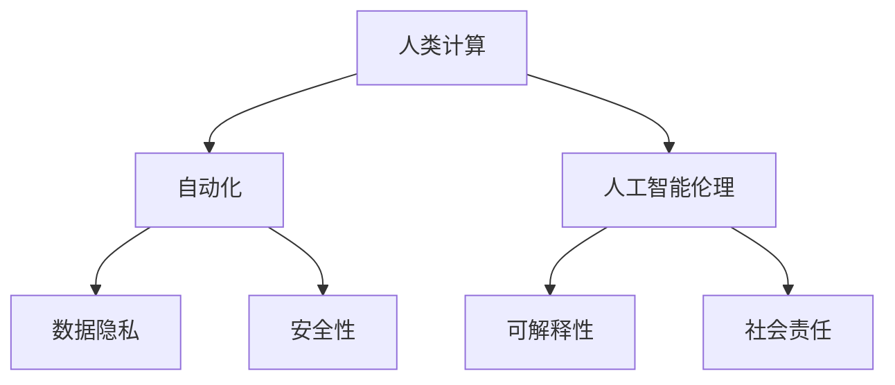

                 

# 人类计算与人工智能伦理

> 关键词：人工智能(AI),人类计算,伦理,自动化,数据隐私,安全性,可解释性,社会责任

## 1. 背景介绍

### 1.1 问题由来

随着人工智能技术的飞速发展，人类计算在诸多领域逐步取代了传统的机械计算，极大地提升了计算效率和精度。然而，人类计算的崛起也引发了一系列伦理和社会问题，需要我们在享受其带来的便利的同时，认真思考和解决这些问题。本文将从人类计算和人工智能伦理两个维度，探讨这一问题，并提出一些解决方案。

## 2. 核心概念与联系

### 2.1 核心概念概述

- **人类计算(Human Computation)**：指利用人类的主观判断、认知能力来处理和解决问题的一种计算方式，区别于传统的机械计算。

- **人工智能伦理(Ethics in AI)**：涉及人工智能系统在设计、开发、应用等各个环节中遵循的伦理原则和规范，旨在保障人工智能技术的安全、公正、透明和可信。

- **自动化(Automation)**：指利用技术手段替代人类完成重复性或复杂性较高的工作，提高效率和生产力。

- **数据隐私(Privacy)**：指个人数据的保密性和隐私保护，确保用户数据不被滥用或泄露。

- **安全性(Security)**：指系统、数据和服务的安全性，防止未经授权的访问和恶意攻击。

- **可解释性(Explainability)**：指人工智能系统的决策过程和结果应可解释和理解，以增强用户信任。

- **社会责任(Social Responsibility)**：指人工智能系统在开发和使用过程中应承担的社会责任，包括对公平性、透明性、责任归属等方面的考虑。

这些核心概念之间的逻辑关系可以通过以下Mermaid流程图来展示：



这个流程图展示了人类计算、人工智能伦理与自动化、数据隐私、安全性、可解释性、社会责任等概念之间的联系：

1. 人类计算通过自动化技术实现，大幅度提升了计算效率。
2. 人工智能伦理应用于自动化技术的开发和应用中，确保其符合伦理标准。
3. 自动化过程中产生的数据隐私和安全问题，需要通过人工智能伦理进行规范。
4. 可解释性和社会责任是人工智能伦理的重要组成部分，需要全程保障。

## 3. 核心算法原理 & 具体操作步骤
### 3.1 算法原理概述

人类计算与人工智能伦理问题的解决，需要依赖一系列的核心算法原理和技术手段。这里将从数据驱动、机器学习、伦理评估三个方面进行探讨。

**数据驱动**：通过对大规模数据集的分析和挖掘，揭示人类计算背后的规律和模式，提供有效的决策支持。

**机器学习**：利用机器学习算法，训练模型自动从数据中学习规律和知识，辅助人类计算。

**伦理评估**：建立伦理评估模型，对人工智能系统的伦理标准进行量化评估，确保其在开发和应用中的合规性。

### 3.2 算法步骤详解

#### 数据驱动

1. **数据收集**：收集与人类计算相关的数据，包括计算任务、计算结果、用户反馈等。

2. **数据清洗**：对收集的数据进行去重、去噪、格式化等预处理，确保数据质量。

3. **数据分析**：利用统计学、数据挖掘、机器学习等技术，对数据进行分析和建模，揭示人类计算规律和模式。

4. **数据可视化**：将分析结果以图表、报告等形式呈现，辅助决策和理解。

#### 机器学习

1. **模型选择**：根据问题特点选择合适的机器学习模型，如决策树、神经网络、支持向量机等。

2. **模型训练**：利用历史数据训练模型，学习规律和知识。

3. **模型评估**：通过交叉验证等方法评估模型性能，选择最优模型。

4. **模型应用**：将训练好的模型应用于新的数据集，提供预测和决策支持。

#### 伦理评估

1. **指标设定**：根据伦理原则，设定一系列评估指标，如公平性、透明性、责任归属等。

2. **模型构建**：构建伦理评估模型，将设定指标量化。

3. **评估验证**：将人工智能系统输入伦理评估模型，验证其是否符合伦理标准。

4. **改进优化**：根据评估结果，优化人工智能系统，确保其伦理合规性。

### 3.3 算法优缺点

**优点**：
1. 数据驱动方法能准确揭示人类计算中的规律和模式，提供有效的决策支持。
2. 机器学习技术可自动从数据中学习规律和知识，提高计算效率。
3. 伦理评估模型能量化伦理标准，确保人工智能系统的合规性。

**缺点**：
1. 数据驱动方法依赖于数据质量，数据不足或数据偏差可能导致结果不准确。
2. 机器学习模型存在"过拟合"风险，需要大量数据和复杂模型才能提高准确性。
3. 伦理评估模型较为复杂，需要多学科专业知识，实现难度较大。

### 3.4 算法应用领域

人类计算与人工智能伦理的应用领域非常广泛，涵盖了多个行业和领域，例如：

- **医疗健康**：利用人工智能辅助诊断和治疗决策，提升医疗服务质量。
- **金融行业**：通过自动化交易和风险控制，提高金融服务效率和安全性。
- **制造业**：利用机器学习优化生产流程，提高生产效率和产品质量。
- **教育领域**：利用智能辅导系统，提供个性化学习支持，提升教育效果。
- **环境保护**：通过数据分析和机器学习，监测和预测环境变化，制定科学决策。

## 4. 数学模型和公式 & 详细讲解  
### 4.1 数学模型构建

在人类计算与人工智能伦理问题的解决过程中，数学模型扮演着重要的角色。这里以一个简单的公平性评估模型为例，说明其构建和应用。

设有一组人类计算任务 $T=\{t_1,t_2,...,t_n\}$，每个任务的处理时间 $t_i$ 和报酬 $r_i$ 均已知。我们需要评估这些任务的公平性。设 $\mu_t$ 和 $\mu_r$ 分别为处理时间的均值和报酬的均值，则公平性可以定义为：

$$
\text{Fairness} = \frac{\mu_t}{\mu_r}
$$

#### 4.2 公式推导过程

在处理时间 $t_i$ 和报酬 $r_i$ 已知的情况下，公平性评估模型的构建和推导过程如下：

1. **计算均值**：

   $$
   \mu_t = \frac{1}{n} \sum_{i=1}^n t_i
   $$
   
   $$
   \mu_r = \frac{1}{n} \sum_{i=1}^n r_i
   $$

2. **计算公平性指标**：

   $$
   \text{Fairness} = \frac{\mu_t}{\mu_r}
   $$

#### 4.3 案例分析与讲解

假设有三个任务 $T=\{t_1,t_2,t_3\}$，它们的处理时间和报酬如下：

- $t_1 = 2$ 小时，$r_1 = 100$ 元
- $t_2 = 3$ 小时，$r_2 = 200$ 元
- $t_3 = 4$ 小时，$r_3 = 300$ 元

利用公式计算公平性指标：

$$
\mu_t = \frac{2+3+4}{3} = 3
$$
   
$$
\mu_r = \frac{100+200+300}{3} = 200
$$
   
$$
\text{Fairness} = \frac{3}{200} = 0.015
$$

公平性指标为 $0.015$，说明这三个任务的报酬处理时间之比偏低，存在不公平现象。

## 5. 项目实践：代码实例和详细解释说明
### 5.1 开发环境搭建

在进行人类计算与人工智能伦理问题的实践研究时，需要一定的开发环境支持。以下是使用Python和PyTorch进行研究的环境配置流程：

1. 安装Anaconda：从官网下载并安装Anaconda，用于创建独立的Python环境。

2. 创建并激活虚拟环境：
```bash
conda create -n ai-env python=3.8 
conda activate ai-env
```

3. 安装PyTorch：根据CUDA版本，从官网获取对应的安装命令。例如：
```bash
conda install pytorch torchvision torchaudio cudatoolkit=11.1 -c pytorch -c conda-forge
```

4. 安装TensorFlow：
```bash
pip install tensorflow
```

5. 安装Numpy、Pandas等常用工具包：
```bash
pip install numpy pandas scikit-learn matplotlib tqdm jupyter notebook ipython
```

完成上述步骤后，即可在`ai-env`环境中开始实践研究。

### 5.2 源代码详细实现

下面以一个简单的公平性评估模型为例，给出使用PyTorch和TensorFlow进行代码实现的完整示例。

#### 使用PyTorch实现

```python
import torch
import torch.nn as nn
import torch.optim as optim

class FairnessModel(nn.Module):
    def __init__(self):
        super(FairnessModel, self).__init__()
        self.fc1 = nn.Linear(3, 1)
    
    def forward(self, x):
        x = self.fc1(x)
        return x

# 训练数据
t = torch.tensor([2, 3, 4], dtype=torch.float)
r = torch.tensor([100, 200, 300], dtype=torch.float)

# 模型实例化
model = FairnessModel()
criterion = nn.MSELoss()
optimizer = optim.SGD(model.parameters(), lr=0.01)

# 训练过程
for epoch in range(100):
    # 计算公平性指标
    mu_t = torch.mean(t)
    mu_r = torch.mean(r)
    fairness = mu_t / mu_r
    
    # 计算损失
    loss = criterion(fairness, torch.tensor(1.0))
    
    # 反向传播更新模型参数
    optimizer.zero_grad()
    loss.backward()
    optimizer.step()
    
    # 打印训练结果
    print(f"Epoch {epoch+1}, Fairness: {fairness.item()}")

# 测试模型
test_t = torch.tensor([1, 2, 3], dtype=torch.float)
test_r = torch.tensor([50, 100, 150], dtype=torch.float)
test_mu_t = torch.mean(test_t)
test_mu_r = torch.mean(test_r)
test_fairness = test_mu_t / test_mu_r
print(f"Test Fairness: {test_fairness}")
```

#### 使用TensorFlow实现

```python
import tensorflow as tf
import numpy as np

# 定义模型
model = tf.keras.Sequential([
    tf.keras.layers.Dense(1, input_shape=(3,))
])

# 训练数据
t = np.array([2, 3, 4])
r = np.array([100, 200, 300])

# 模型编译
model.compile(loss='mse', optimizer='adam')

# 训练过程
model.fit(t, r, epochs=100)

# 测试模型
test_t = np.array([1, 2, 3])
test_r = np.array([50, 100, 150])
test_mu_t = np.mean(test_t)
test_mu_r = np.mean(test_r)
test_fairness = test_mu_t / test_mu_r
print(f"Test Fairness: {test_fairness}")
```

以上代码展示了使用PyTorch和TensorFlow实现公平性评估模型的全过程。可以看到，利用深度学习框架，我们能高效地构建和训练模型，对公平性指标进行评估。

### 5.3 代码解读与分析

让我们再详细解读一下关键代码的实现细节：

**公平性评估模型**：
- `nn.Linear`层：用于构建一个线性回归模型，将输入向量映射到一个标量输出。
- `nn.MSELoss`损失函数：用于计算模型输出与真实公平性指标之间的均方误差。
- `SGD`优化器：用于更新模型参数，最小化损失函数。

**训练过程**：
- 计算公平性指标 $\mu_t$ 和 $\mu_r$。
- 计算损失函数，将公平性指标与期望值 $1.0$ 进行比较。
- 反向传播更新模型参数，优化损失函数。
- 重复迭代，直至模型收敛。

**测试模型**：
- 输入新的测试数据 $t$ 和 $r$，计算公平性指标。
- 输出公平性指标，验证模型性能。

## 6. 实际应用场景

### 6.1 医疗健康

在医疗健康领域，人类计算和人工智能伦理问题的解决尤为重要。自动化的医疗影像诊断、智能辅助决策等技术，极大地提高了医疗服务效率和诊断准确性。然而，这些技术也带来了数据隐私和安全问题，需要严格控制和保护。

**数据隐私保护**：医疗机构需制定严格的数据保护政策，确保患者数据不被泄露或滥用。利用区块链等技术，对医疗数据进行加密和去标识化处理，保障数据隐私。

**安全性保障**：使用加密传输协议和访问控制机制，防止未经授权的访问和恶意攻击。建立健全的安全审计和监控体系，及时发现并处理安全漏洞。

**可解释性提升**：利用可解释性技术，如决策树、LIME等，解释诊断和决策的依据，增强医生和患者的信任。同时，提供可视化界面，帮助医生快速理解诊断结果。

### 6.2 金融行业

金融行业也是人类计算与人工智能伦理问题的重要应用领域。通过自动化交易、风险控制等技术，金融行业实现了更高的效率和安全性。然而，这些技术的滥用可能带来金融风险和伦理问题。

**数据隐私保护**：金融机构需严格控制客户数据的访问权限，防止数据泄露和滥用。使用数据脱敏技术，隐藏敏感信息，保护客户隐私。

**安全性保障**：利用机器学习模型检测异常交易，防止欺诈和网络攻击。建立多重认证机制，确保系统安全。

**可解释性提升**：利用可解释性技术，解释模型决策依据，增强用户信任。同时，提供透明的审计和监控机制，确保系统行为的合规性。

### 6.3 制造业

在制造业领域，利用人工智能和自动化技术，优化生产流程、提高产品质量和生产效率。然而，这些技术的滥用也可能带来伦理和法律问题。

**数据隐私保护**：工业数据需严格控制访问权限，防止数据泄露和滥用。使用数据加密和访问控制技术，保护数据隐私。

**安全性保障**：利用机器学习模型检测异常行为，防止设备故障和网络攻击。建立健全的安全监控体系，及时发现并处理安全漏洞。

**可解释性提升**：利用可解释性技术，解释生产决策依据，增强工人对技术的信任。同时，提供透明的决策过程，确保生产行为的合规性。

### 6.4 环境保护

环境保护也是人类计算与人工智能伦理问题的关键领域。通过数据分析和机器学习，监测和预测环境变化，制定科学决策。然而，这些技术的滥用也可能带来伦理和法律问题。

**数据隐私保护**：环境保护机构需严格控制环境数据的访问权限，防止数据泄露和滥用。使用数据加密和去标识化技术，保护数据隐私。

**安全性保障**：利用机器学习模型监测异常环境行为，防止数据篡改和攻击。建立健全的安全监控体系，及时发现并处理安全漏洞。

**可解释性提升**：利用可解释性技术，解释模型决策依据，增强决策的透明度和可信度。同时，提供透明的审计和监控机制，确保环境决策的合规性。

## 7. 工具和资源推荐

### 7.1 学习资源推荐

为了帮助开发者和研究人员系统掌握人类计算与人工智能伦理的理论基础和实践技巧，这里推荐一些优质的学习资源：

1. **《人类计算与人工智能伦理》系列博文**：由大模型技术专家撰写，深入浅出地介绍了人类计算与人工智能伦理的基本概念和前沿技术。

2. **《人工智能伦理》课程**：斯坦福大学开设的伦理学课程，探讨人工智能技术在伦理、法律和社会等方面的影响。

3. **《人工智能伦理与社会》书籍**：全面介绍了人工智能伦理的多个方面，如公平性、透明性、责任归属等，适合深入学习。

4. **IEEE Ethically Aligned Design for Artificial Intelligence**：IEEE关于人工智能伦理的权威文档，提供了一系列伦理指导原则和实践指南。

5. **《AI伦理与社会责任》报告**：详细讨论了人工智能在伦理、法律和社会等方面的问题，并提出了相应的解决方案。

通过对这些资源的学习实践，相信你一定能够全面掌握人类计算与人工智能伦理的理论基础和实践技巧，为解决实际问题提供有力的支撑。

### 7.2 开发工具推荐

高效的研究开发离不开优秀的工具支持。以下是几款用于人类计算与人工智能伦理研究开发的常用工具：

1. **PyTorch**：基于Python的开源深度学习框架，灵活动态的计算图，适合快速迭代研究。

2. **TensorFlow**：由Google主导开发的开源深度学习框架，生产部署方便，适合大规模工程应用。

3. **Jupyter Notebook**：一个基于Web的交互式笔记本，支持Python、R等语言，适合数据分析和模型训练。

4. **WEKA**：一个开源的机器学习平台，提供各种算法和工具，适合数据挖掘和建模。

5. **Tableau**：一个数据可视化工具，支持多种数据源，适合数据的探索和展示。

6. **RapidMiner**：一个集成化的数据科学平台，支持数据预处理、建模和可视化，适合快速研究开发。

合理利用这些工具，可以显著提升人类计算与人工智能伦理研究的效率，加快创新迭代的步伐。

### 7.3 相关论文推荐

人类计算与人工智能伦理的研究源于学界的持续探索。以下是几篇奠基性的相关论文，推荐阅读：

1. **《人工智能伦理》（The Ethics of Artificial Intelligence）**：斯坦福大学出版的人工智能伦理指南，涵盖了多个伦理问题的讨论。

2. **《人工智能伦理的社会、法律和技术问题》（The Social, Legal, and Technical Challenges of Artificial Intelligence）**：IEEE关于人工智能伦理的权威文档，探讨了多个伦理问题及其解决方案。

3. **《人工智能伦理的多视角分析》（A Multi-Perspective Analysis of AI Ethics）**：探讨了人工智能伦理的多方面问题，并提出了相应的伦理框架。

4. **《人工智能伦理的教育与训练》（Ethics Education and Training for AI Professionals）**：讨论了人工智能伦理的教育和培训，提出了一系列伦理教育和培训的方法。

5. **《人工智能伦理的理论与实践》（Theory and Practice of AI Ethics）**：全面介绍了人工智能伦理的多个方面，如公平性、透明性、责任归属等，并提供了相应的实践指南。

这些论文代表了大模型微调技术的发展脉络。通过学习这些前沿成果，可以帮助研究者把握学科前进方向，激发更多的创新灵感。

## 8. 总结：未来发展趋势与挑战

### 8.1 总结

本文对人类计算与人工智能伦理问题进行了全面系统的介绍。首先阐述了人类计算和人工智能伦理的研究背景和意义，明确了伦理标准和合规性在人类计算应用中的重要价值。其次，从数据驱动、机器学习、伦理评估三个方面，详细讲解了人类计算与人工智能伦理的核心算法原理和技术手段。最后，我们通过多个实际应用场景，展示了人类计算与人工智能伦理的广泛应用。

通过本文的系统梳理，可以看到，人类计算与人工智能伦理在各个行业领域的应用前景广阔，极大地提升了计算效率和决策质量。未来，伴随技术的不断进步，这些领域的实践探索还将不断深入，为社会的发展和进步注入新的动力。

### 8.2 未来发展趋势

展望未来，人类计算与人工智能伦理技术将呈现以下几个发展趋势：

1. **数据隐私保护**：数据隐私保护技术将不断进步，确保数据的安全性和用户的隐私权。

2. **安全性提升**：人工智能系统的安全性将得到持续加强，防止未经授权的访问和攻击。

3. **可解释性增强**：人工智能系统的可解释性将进一步提升，增强用户对系统的信任和理解。

4. **社会责任强化**：人工智能系统将更加注重社会责任，确保其行为的合规性和公正性。

5. **多模态融合**：人工智能系统将实现多模态融合，整合视觉、语音、文本等多种数据，提升综合决策能力。

6. **伦理评估模型**：伦理评估模型的构建和应用将更加成熟，提供更加量化和规范的评估标准。

以上趋势凸显了人类计算与人工智能伦理技术的广阔前景。这些方向的探索发展，必将进一步提升人工智能系统的性能和应用范围，为人类社会的发展带来深远影响。

### 8.3 面临的挑战

尽管人类计算与人工智能伦理技术已经取得了显著进展，但在迈向更加智能化、普适化应用的过程中，仍面临诸多挑战：

1. **数据隐私保护**：在数据收集和存储过程中，如何平衡数据开放和隐私保护是一个难题。

2. **安全性保障**：随着人工智能系统应用的普及，如何应对越来越复杂的安全威胁，也是一个亟待解决的挑战。

3. **可解释性提升**：目前的人工智能系统往往缺乏足够的可解释性，难以满足用户和监管机构的需求。

4. **社会责任**：人工智能系统的决策过程和结果可能涉及社会公平、就业等敏感问题，如何处理这些伦理问题，是一个复杂而重要的课题。

5. **伦理评估**：如何建立全面、客观的伦理评估体系，量化和规范人工智能系统的伦理标准，是一个需要持续探索的问题。

6. **多模态融合**：实现多模态数据的高效整合和利用，是一个技术难题，需要跨学科的协同攻关。

这些挑战需要从技术、伦理、法律等多个维度协同解决，确保人类计算与人工智能伦理技术的应用符合社会利益和伦理规范。

### 8.4 研究展望

面对人类计算与人工智能伦理技术所面临的挑战，未来的研究需要在以下几个方面寻求新的突破：

1. **数据隐私保护**：探索更高效、更安全的数据保护技术，确保数据的安全性和用户的隐私权。

2. **安全性提升**：研究更高级的安全防御技术，提高人工智能系统的安全性。

3. **可解释性增强**：开发更高效、更透明的可解释性技术，增强用户对系统的信任和理解。

4. **社会责任强化**：建立健全的社会责任机制，确保人工智能系统的公正性和透明性。

5. **伦理评估模型**：构建更加全面、客观的伦理评估模型，量化和规范人工智能系统的伦理标准。

6. **多模态融合**：探索多模态数据的高效整合和利用技术，提升综合决策能力。

这些研究方向的探索，必将引领人类计算与人工智能伦理技术迈向更高的台阶，为构建安全、可靠、可解释、可控的智能系统铺平道路。面向未来，我们需要从数据、算法、伦理、法律等多个维度进行深入探索和实践，确保人类计算与人工智能伦理技术的应用符合社会利益和伦理规范，真正造福人类社会。

## 9. 附录：常见问题与解答

**Q1：如何平衡数据隐私保护和数据开放利用？**

A: 在数据隐私保护和数据开放利用之间寻找平衡点，需要综合考虑数据敏感性、用户需求和隐私风险等因素。可以采用数据去标识化、数据匿名化、差分隐私等技术，对数据进行处理，减少隐私泄露风险。同时，需要明确数据使用的目的和范围，确保数据开放利用符合伦理规范。

**Q2：如何提高人工智能系统的安全性？**

A: 提高人工智能系统的安全性需要多方面的努力。可以从以下几个方面入手：

1. 数据安全：采用加密传输、访问控制等技术，保护数据安全。

2. 模型安全：通过对抗样本训练、模型鲁棒性评估等技术，提高模型的鲁棒性和安全性。

3. 系统安全：建立健全的安全监控和审计机制，及时发现和处理安全漏洞。

**Q3：如何增强人工智能系统的可解释性？**

A: 增强人工智能系统的可解释性需要从多个方面入手：

1. 模型设计：设计更简单、更直观的模型结构，便于理解和解释。

2. 解释工具：利用可解释性技术，如LIME、SHAP等，生成模型决策的可视化解释。

3. 用户反馈：建立用户反馈机制，收集用户对模型输出的意见，不断改进模型。

**Q4：如何处理人工智能系统的社会责任问题？**

A: 处理人工智能系统的社会责任问题需要多学科协同：

1. 法律规范：建立健全的法律规范，明确人工智能系统的伦理和责任归属。

2. 公平性评估：利用公平性评估模型，监测和评估人工智能系统的决策公平性。

3. 透明性提升：提高人工智能系统的透明性，让用户了解模型决策过程和依据。

4. 伦理审核：建立伦理审核机制，确保人工智能系统的合规性和公正性。

**Q5：如何实现多模态数据的融合？**

A: 实现多模态数据的融合需要跨学科的协同合作：

1. 数据融合技术：开发高效的多模态数据融合技术，整合不同模态的数据信息。

2. 多模态模型：构建多模态模型，从多个模态数据中提取信息，提升综合决策能力。

3. 多模态交互：设计多模态交互界面，让用户能够方便地输入和输出多模态数据。

---

作者：禅与计算机程序设计艺术 / Zen and the Art of Computer Programming

