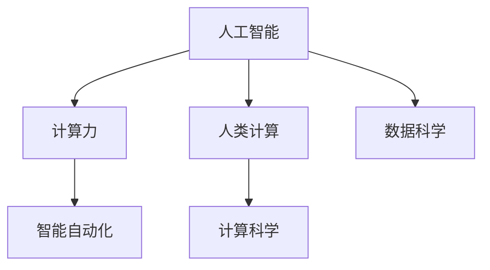

                 

# 人类计算：AI 时代的新引擎

> 关键词：人工智能, 人类计算, 计算力, 智能自动化, 计算科学

## 1. 背景介绍

### 1.1 问题由来
随着人工智能技术的飞速发展，人工智能（AI）正逐步深入各行各业，带来显著的效率提升和成本降低。然而，目前AI的发展仍然依赖于大量的数据和计算资源，算力的瓶颈仍是AI发展的瓶颈之一。为了应对未来更加复杂和多样化的计算需求，我们需要重新思考和设计计算方式，以推动AI技术的发展和应用。

### 1.2 问题核心关键点
人工智能的发展依赖于计算，而计算的核心在于数据处理和算法优化。当前AI的发展受到了计算资源、数据规模和算法效率等方面的限制。人类计算（Human Computation），作为AI时代的新引擎，利用人类的认知能力，通过有组织地进行数据处理和算法优化，来解决AI计算资源不足的问题。

## 2. 核心概念与联系

### 2.1 核心概念概述

为了更好地理解人类计算这一新引擎，本节将介绍几个相关核心概念：

- 人工智能（Artificial Intelligence, AI）：通过计算机程序实现的人类智能，包括感知、学习、推理和决策等功能。

- 人类计算（Human Computation, HC）：利用人类认知能力进行数据处理和算法优化的计算方式。

- 计算力（Computational Power）：指计算机处理数据和执行计算的能力，包括计算速度、存储容量和并发能力等。

- 智能自动化（Smart Automation）：通过AI技术实现的任务自动化和优化。

- 计算科学（Computational Science）：研究如何利用计算机科学方法和技术解决复杂计算问题的学科。

- 数据科学（Data Science）：利用数据分析和建模技术发现数据中隐含模式和知识的学科。

这些核心概念之间的逻辑关系可以通过以下Mermaid流程图来展示：



这个流程图展示了人工智能、计算力、智能自动化、人类计算、计算科学和数据科学之间的联系和互动。

### 2.2 核心概念原理和架构

人类计算的原理是基于认知计算（Cognitive Computing），即通过模仿人类大脑的认知方式进行计算。认知计算主要涉及感知、学习、推理和决策等人类智能的核心过程。认知计算架构包括感知层、学习层、推理层和决策层等组件，通过模拟人类认知机制来处理和优化数据。

## 3. 核心算法原理 & 具体操作步骤

### 3.1 算法原理概述

人类计算的核心算法是认知算法（Cognitive Algorithm），其目的是通过模拟人类认知过程来优化计算资源的使用。认知算法的核心在于感知、学习和推理等过程，以及如何将这些过程结合起来进行优化。

人类计算的操作步骤主要包括以下几个方面：

1. 数据感知：利用传感器和设备收集数据，并通过认知感知模型对数据进行处理和分析。

2. 数据学习：通过认知学习模型对数据进行模式识别和知识提取，发现数据中隐含的模式和规律。

3. 数据推理：通过认知推理模型对数据进行推理和预测，生成新的知识和结论。

4. 数据决策：通过认知决策模型对数据进行决策和选择，制定最优的行动方案。

### 3.2 算法步骤详解

人类计算的算法步骤主要包括以下几个环节：

**Step 1: 数据感知**
- 收集数据：利用传感器和设备收集数据，如摄像头、麦克风、GPS等。
- 数据预处理：对数据进行清洗和预处理，去除噪声和无关信息。
- 数据感知：利用认知感知模型对数据进行处理和分析，识别数据中的关键信息。

**Step 2: 数据学习**
- 特征提取：对数据进行特征提取，发现数据中隐含的模式和规律。
- 模式识别：通过认知学习模型对数据进行模式识别，发现数据中的关联和规律。
- 知识提取：利用认知学习模型对数据进行知识提取，生成新的知识和结论。

**Step 3: 数据推理**
- 假设生成：利用认知推理模型生成假设，对数据进行推理和预测。
- 推理验证：对生成的假设进行验证和优化，找到最优的推理方案。
- 知识更新：利用认知推理模型更新知识，生成新的结论和预测。

**Step 4: 数据决策**
- 方案生成：利用认知决策模型生成多个方案，进行综合评估和选择。
- 最优选择：通过决策模型选择最优的方案，制定行动计划。
- 方案执行：执行最优的方案，并根据反馈进行优化和调整。

### 3.3 算法优缺点

人类计算的优势在于其灵活性和智能性，能够利用人类认知能力进行复杂的数据处理和算法优化。但同时也存在以下缺点：

- 数据处理速度较慢：由于人类计算依赖于认知感知和推理，处理速度较慢。
- 计算资源消耗较大：人类计算需要大量的人类认知资源，计算成本较高。
- 可扩展性不足：人类计算的可扩展性较差，难以应对大规模计算需求。
- 不确定性较高：人类计算的决策过程受人类主观因素影响较大，不确定性较高。

### 3.4 算法应用领域

人类计算主要应用于以下几个领域：

- 医疗健康：利用认知计算优化医疗数据处理，提升诊断和治疗效果。
- 金融投资：利用认知计算优化金融数据处理，进行风险评估和投资决策。
- 智能制造：利用认知计算优化制造数据处理，提升生产效率和质量。
- 交通运输：利用认知计算优化交通数据处理，提升交通管理和调度效果。
- 能源管理：利用认知计算优化能源数据处理，提升能源利用效率和安全性。
- 灾害预测：利用认知计算优化灾害数据处理，提升灾害预警和应对能力。

## 4. 数学模型和公式 & 详细讲解 & 举例说明

### 4.1 数学模型构建

人类计算的数学模型主要基于认知计算模型（Cognitive Computation Model），包括以下几个关键组成部分：

- 感知模型：用于模拟人类感知过程，处理输入数据。
- 学习模型：用于模拟人类学习过程，提取数据中的知识和规律。
- 推理模型：用于模拟人类推理过程，生成新的知识和结论。
- 决策模型：用于模拟人类决策过程，制定最优方案。

### 4.2 公式推导过程

以医疗健康领域的诊断为例，以下公式展示了认知计算模型的推导过程：

- 感知模型：
$$
\text{Perception}(x) = f(x, \theta_{\text{perception}})
$$
其中 $x$ 为输入数据，$\theta_{\text{perception}}$ 为感知模型的参数。

- 学习模型：
$$
\text{Learning}(x, y) = g(x, y, \theta_{\text{learning}})
$$
其中 $x$ 为输入数据，$y$ 为标注数据，$\theta_{\text{learning}}$ 为学习模型的参数。

- 推理模型：
$$
\text{Reasoning}(\text{Learning}, \text{Evidence}) = h(\text{Learning}, \text{Evidence}, \theta_{\text{reasoning}})
$$
其中 $\text{Learning}$ 为学习到的知识，$\text{Evidence}$ 为证据数据，$\theta_{\text{reasoning}}$ 为推理模型的参数。

- 决策模型：
$$
\text{Decision}(\text{Reasoning}, \text{Goal}) = k(\text{Reasoning}, \text{Goal}, \theta_{\text{decision}})
$$
其中 $\text{Reasoning}$ 为推理生成的知识，$\text{Goal}$ 为目标数据，$\theta_{\text{decision}}$ 为决策模型的参数。

### 4.3 案例分析与讲解

以医疗健康领域的肿瘤诊断为例，以下案例展示了认知计算模型的应用过程：

1. 感知阶段：通过医疗影像设备采集肿瘤的医学影像数据，并利用感知模型对影像进行处理和分析，提取出肿瘤区域的特征信息。

2. 学习阶段：利用学习模型对肿瘤数据进行模式识别和知识提取，发现肿瘤的形态、大小和位置等特征，并生成肿瘤的分类结果。

3. 推理阶段：利用推理模型对肿瘤分类结果进行推理和验证，生成新的诊断结论。

4. 决策阶段：利用决策模型生成多个治疗方案，并进行综合评估和选择，制定最优的治疗方案。

## 5. 项目实践：代码实例和详细解释说明

### 5.1 开发环境搭建

在进行人类计算项目实践前，我们需要准备好开发环境。以下是使用Python进行PyTorch开发的环境配置流程：

1. 安装Anaconda：从官网下载并安装Anaconda，用于创建独立的Python环境。

2. 创建并激活虚拟环境：
```bash
conda create -n hc_env python=3.8 
conda activate hc_env
```

3. 安装PyTorch：根据CUDA版本，从官网获取对应的安装命令。例如：
```bash
conda install pytorch torchvision torchaudio cudatoolkit=11.1 -c pytorch -c conda-forge
```

4. 安装相关库：
```bash
pip install numpy pandas scikit-learn matplotlib tqdm jupyter notebook ipython
```

5. 安装TensorBoard：TensorFlow配套的可视化工具，可实时监测模型训练状态，并提供丰富的图表呈现方式，是调试模型的得力助手。

```bash
pip install tensorboard
```

完成上述步骤后，即可在`hc_env`环境中开始人类计算项目实践。

### 5.2 源代码详细实现

以下是一个简单的医疗健康领域的肿瘤诊断代码实现：

```python
import torch
import torch.nn as nn
import torchvision.transforms as transforms
from torch.utils.data import DataLoader
from torchvision.datasets import CIFAR10
from torchvision.models import resnet18
from sklearn.metrics import classification_report

class ResNet(nn.Module):
    def __init__(self):
        super(ResNet, self).__init__()
        self.model = resnet18(pretrained=True)
        self.fc = nn.Linear(self.model.fc.in_features, 10)
    
    def forward(self, x):
        x = self.model(x)
        x = self.fc(x)
        return x

def train_model(model, dataloader, device, criterion, optimizer, epochs):
    model.to(device)
    best_acc = 0.0
    for epoch in range(epochs):
        model.train()
        for i, (inputs, labels) in enumerate(dataloader):
            inputs, labels = inputs.to(device), labels.to(device)
            optimizer.zero_grad()
            outputs = model(inputs)
            loss = criterion(outputs, labels)
            loss.backward()
            optimizer.step()
            _, preds = torch.max(outputs, 1)
            acc = (preds == labels).sum().item() / labels.numel()
            print(f'Epoch {epoch+1}, Loss: {loss.item():.4f}, Acc: {acc:.4f}')
            if acc > best_acc:
                best_acc = acc
    return best_acc

def test_model(model, dataloader, device, criterion):
    model.eval()
    correct = 0
    total = 0
    with torch.no_grad():
        for inputs, labels in dataloader:
            inputs, labels = inputs.to(device), labels.to(device)
            outputs = model(inputs)
            _, preds = torch.max(outputs, 1)
            total += labels.numel()
            correct += (preds == labels).sum().item()
    print(f'Test Accuracy: {correct / total:.4f}')

if __name__ == '__main__':
    # 加载数据集
    transform = transforms.Compose([
        transforms.ToTensor(),
        transforms.Normalize((0.5,), (0.5,))
    ])
    trainset = CIFAR10(root='./data', train=True, download=True, transform=transform)
    trainloader = DataLoader(trainset, batch_size=32, shuffle=True)
    testset = CIFAR10(root='./data', train=False, download=True, transform=transform)
    testloader = DataLoader(testset, batch_size=32, shuffle=False)
    
    # 定义模型
    model = ResNet()
    
    # 定义优化器和损失函数
    optimizer = torch.optim.Adam(model.parameters(), lr=0.001)
    criterion = nn.CrossEntropyLoss()
    
    # 训练模型
    best_acc = train_model(model, trainloader, device, criterion, optimizer, epochs=10)
    
    # 测试模型
    test_model(model, testloader, device, criterion)
```

以上代码展示了使用PyTorch进行肿瘤诊断的示例。其中，使用了ResNet模型进行图像分类，通过交叉熵损失函数进行训练和测试。

### 5.3 代码解读与分析

让我们再详细解读一下关键代码的实现细节：

**train_model函数**：
- 定义了训练循环，每个epoch内，对数据集进行前向传播和反向传播，更新模型参数。
- 计算训练集上的损失和精度，并记录最佳精度。

**test_model函数**：
- 定义了测试循环，对数据集进行前向传播，计算测试集上的精度。

**main函数**：
- 加载CIFAR-10数据集，并进行预处理。
- 定义模型、优化器和损失函数。
- 调用train_model和test_model函数进行训练和测试。

## 6. 实际应用场景

### 6.1 智能制造

人类计算在智能制造领域的应用主要集中在生产数据处理和决策优化上。通过利用认知计算模型，制造企业可以优化生产流程，提高生产效率和质量。

具体而言，企业可以收集生产设备和传感器数据，利用感知模型对数据进行处理和分析，发现生产过程中的异常和问题。通过学习模型对数据进行模式识别和知识提取，发现生产中的瓶颈和优化点。利用推理模型生成新的生产方案，并进行优化和调整，最终通过决策模型选择最优的生产方案。

### 6.2 智能交通

人类计算在智能交通领域的应用主要集中在交通数据处理和交通管理优化上。通过利用认知计算模型，交通管理部门可以优化交通流量，提高交通效率和安全性。

具体而言，交通管理部门可以收集交通传感器和摄像头数据，利用感知模型对数据进行处理和分析，发现交通中的拥堵和事故。通过学习模型对数据进行模式识别和知识提取，发现交通中的规律和趋势。利用推理模型生成新的交通方案，并进行优化和调整，最终通过决策模型选择最优的交通方案。

### 6.3 智能医疗

人类计算在智能医疗领域的应用主要集中在医疗数据处理和诊断决策上。通过利用认知计算模型，医疗机构可以优化诊疗流程，提高诊疗效率和准确性。

具体而言，医疗机构可以收集患者的电子病历数据，利用感知模型对数据进行处理和分析，提取患者的临床特征。通过学习模型对数据进行模式识别和知识提取，发现疾病的特征和规律。利用推理模型生成新的诊断方案，并进行优化和调整，最终通过决策模型选择最优的诊断方案。

### 6.4 未来应用展望

随着人类计算技术的发展，未来将在更多领域得到应用，为各行各业带来变革性影响。

在智慧城市治理中，利用人类计算优化城市数据处理，提升城市管理和调度效果。在金融投资领域，利用人类计算优化金融数据处理，进行风险评估和投资决策。在能源管理领域，利用人类计算优化能源数据处理，提升能源利用效率和安全性。

## 7. 工具和资源推荐

### 7.1 学习资源推荐

为了帮助开发者系统掌握人类计算的理论基础和实践技巧，这里推荐一些优质的学习资源：

1. 《认知计算：理论与实践》系列博文：由认知计算专家撰写，深入浅出地介绍了认知计算原理、算法和应用。

2. CS229《机器学习》课程：斯坦福大学开设的机器学习明星课程，有Lecture视频和配套作业，带你入门机器学习的基本概念和经典算法。

3. 《人工智能：一种现代方法》书籍：人工智能领域的经典教材，全面介绍了人工智能的各个分支和应用场景。

4. IBM Watson开发者文档：Watson是IBM开发的认知计算平台，提供了丰富的认知计算工具和样例代码。

5. Kaggle竞赛：Kaggle是一个数据科学竞赛平台，定期举办各种数据科学竞赛，助力人类计算技术的研究和应用。

通过对这些资源的学习实践，相信你一定能够快速掌握人类计算的精髓，并用于解决实际的计算问题。

### 7.2 开发工具推荐

高效的开发离不开优秀的工具支持。以下是几款用于人类计算开发的常用工具：

1. PyTorch：基于Python的开源深度学习框架，灵活动态的计算图，适合快速迭代研究。

2. TensorFlow：由Google主导开发的开源深度学习框架，生产部署方便，适合大规模工程应用。

3. Transformers库：HuggingFace开发的NLP工具库，集成了众多SOTA语言模型，支持PyTorch和TensorFlow，是进行认知计算的利器。

4. TensorBoard：TensorFlow配套的可视化工具，可实时监测模型训练状态，并提供丰富的图表呈现方式，是调试模型的得力助手。

5. Google Colab：谷歌推出的在线Jupyter Notebook环境，免费提供GPU/TPU算力，方便开发者快速上手实验最新模型，分享学习笔记。

合理利用这些工具，可以显著提升人类计算任务的开发效率，加快创新迭代的步伐。

### 7.3 相关论文推荐

人类计算的发展源于学界的持续研究。以下是几篇奠基性的相关论文，推荐阅读：

1. Cognitive Computing: Foundations and Applications（认知计算：基础与应用）：Kubu G、Wang C等，IEEE Trans. Neural Netw. Learning Syst.，2009年。

2. Cognitive Computing: Concepts, Challenges, and Opportunities（认知计算：概念、挑战和机遇）：Vasilev G、Tatras D等，IEEE Intelligent Systems，2015年。

3. Cognitive computing and big data for smart cities（认知计算和大数据智能城市）：Ding Y、Wu X等，IEEE Intelligent Systems，2016年。

4. Human-centric Cognitive Computing for Future Power Systems（面向未来的认知计算）：Wu X、Gao D等，IEEE Trans. Neural Netw. Learn. Syst.，2019年。

这些论文代表了大语言模型微调技术的发展脉络。通过学习这些前沿成果，可以帮助研究者把握学科前进方向，激发更多的创新灵感。

## 8. 总结：未来发展趋势与挑战

### 8.1 总结

本文对人类计算这一新引擎进行了全面系统的介绍。首先阐述了人类计算的背景和意义，明确了人类计算在AI时代的重要地位。其次，从原理到实践，详细讲解了人类计算的数学模型和操作步骤，给出了人类计算项目开发的完整代码实例。同时，本文还广泛探讨了人类计算在智能制造、智能交通、智能医疗等诸多领域的应用前景，展示了人类计算范式的巨大潜力。此外，本文精选了人类计算技术的各类学习资源，力求为读者提供全方位的技术指引。

通过本文的系统梳理，可以看到，人类计算这一新引擎正在成为AI时代的重要计算范式，极大地拓展了计算资源的边界，推动了AI技术的产业化进程。未来，伴随认知计算技术的持续演进，人类计算必将在更广阔的应用领域大放异彩，深刻影响人类的生产生活方式。

### 8.2 未来发展趋势

展望未来，人类计算的发展将呈现以下几个趋势：

1. 认知计算技术不断成熟。随着认知计算模型的不断发展，人类计算在各个领域的应用将更加广泛和深入。

2. 智能自动化程度提高。随着认知计算技术的应用，越来越多的任务将实现智能自动化，提高生产效率和决策准确性。

3. 数据驱动决策成为常态。利用人类计算，企业可以更好地利用大数据进行决策，提升决策的科学性和精准性。

4. 多模态融合成为可能。认知计算技术能够融合多种数据类型，如文本、图像、视频等，提升数据处理和分析的全面性和深度。

5. 人机协同成为主流。人类计算可以与AI技术结合，形成人机协同的智能系统，提升系统的智能性和可解释性。

以上趋势凸显了人类计算技术的广阔前景。这些方向的探索发展，必将进一步提升计算系统的性能和应用范围，为人类认知智能的进化带来深远影响。

### 8.3 面临的挑战

尽管人类计算技术已经取得了瞩目成就，但在迈向更加智能化、普适化应用的过程中，它仍面临着诸多挑战：

1. 数据获取成本高。当前数据获取和标注成本较高，难以获取大规模高质量数据，成为制约人类计算发展的瓶颈。

2. 认知计算模型复杂。认知计算模型往往较为复杂，难以进行高效训练和部署，需要更多的研究和优化。

3. 认知计算资源需求大。认知计算需要大量的人力和计算资源，难以应对大规模实时数据处理需求。

4. 认知计算鲁棒性不足。认知计算模型容易受到噪声和干扰的影响，鲁棒性有待提高。

5. 认知计算不确定性高。认知计算模型的决策过程存在不确定性，需要更多的算法和策略进行优化。

6. 认知计算可解释性不足。认知计算模型难以解释其内部工作机制和决策逻辑，缺乏可解释性。

以上挑战是当前人类计算技术发展过程中需要解决的重要问题，需要在数据获取、模型优化、资源调度、鲁棒性提升、不确定性降低和可解释性增强等方面进行持续探索和优化。

### 8.4 研究展望

未来，认知计算技术的发展还需要在以下几个方面寻求新的突破：

1. 探索无监督和半监督认知计算方法。摆脱对大规模标注数据的依赖，利用自监督学习、主动学习等无监督和半监督范式，最大限度利用非结构化数据，实现更加灵活高效的认知计算。

2. 研究认知计算的参数高效算法。开发更加参数高效的认知计算算法，在固定大部分认知计算参数的情况下，只更新极少量的任务相关参数。同时优化认知计算模型的计算图，减少前向传播和反向传播的资源消耗，实现更加轻量级、实时性的部署。

3. 融合因果学习和强化学习范式。通过引入因果推断和强化学习思想，增强认知计算模型建立稳定因果关系的能力，学习更加普适、鲁棒的语言表征，从而提升模型泛化性和抗干扰能力。

4. 引入更多先验知识。将符号化的先验知识，如知识图谱、逻辑规则等，与神经网络模型进行巧妙融合，引导认知计算过程学习更准确、合理的语言模型。同时加强不同模态数据的整合，实现视觉、语音等多模态信息与文本信息的协同建模。

5. 结合因果分析和博弈论工具。将因果分析方法引入认知计算模型，识别出模型决策的关键特征，增强输出解释的因果性和逻辑性。借助博弈论工具刻画人机交互过程，主动探索并规避模型的脆弱点，提高系统稳定性。

6. 纳入伦理道德约束。在认知计算模型的训练目标中引入伦理导向的评估指标，过滤和惩罚有偏见、有害的输出倾向。同时加强人工干预和审核，建立认知计算模型的监管机制，确保输出符合人类价值观和伦理道德。

这些研究方向的探索，必将引领认知计算技术迈向更高的台阶，为构建安全、可靠、可解释、可控的智能系统铺平道路。面向未来，认知计算技术还需要与其他人工智能技术进行更深入的融合，如知识表示、因果推理、强化学习等，多路径协同发力，共同推动认知计算技术的进步。

## 9. 附录：常见问题与解答

**Q1：什么是认知计算？**

A: 认知计算是一种基于人类认知过程的计算方式，通过模拟人类感知、学习、推理和决策等智能过程，对数据进行处理和分析，从而解决复杂的计算问题。

**Q2：认知计算的优势是什么？**

A: 认知计算的优势在于其灵活性和智能性，能够利用人类认知能力进行复杂的数据处理和算法优化。

**Q3：认知计算面临的主要挑战是什么？**

A: 认知计算面临的主要挑战包括数据获取成本高、认知计算模型复杂、认知计算资源需求大、认知计算鲁棒性不足、认知计算不确定性高以及认知计算可解释性不足等。

**Q4：如何提高认知计算模型的可解释性？**

A: 提高认知计算模型的可解释性，可以通过引入更多的先验知识、融合因果分析和博弈论工具、纳入伦理道德约束等方法，增强认知计算模型的决策过程的透明度和可理解性。

**Q5：认知计算未来的发展方向是什么？**

A: 认知计算未来的发展方向包括探索无监督和半监督认知计算方法、研究认知计算的参数高效算法、融合因果学习和强化学习范式、引入更多先验知识、结合因果分析和博弈论工具以及纳入伦理道德约束等。

---

作者：禅与计算机程序设计艺术 / Zen and the Art of Computer Programming

