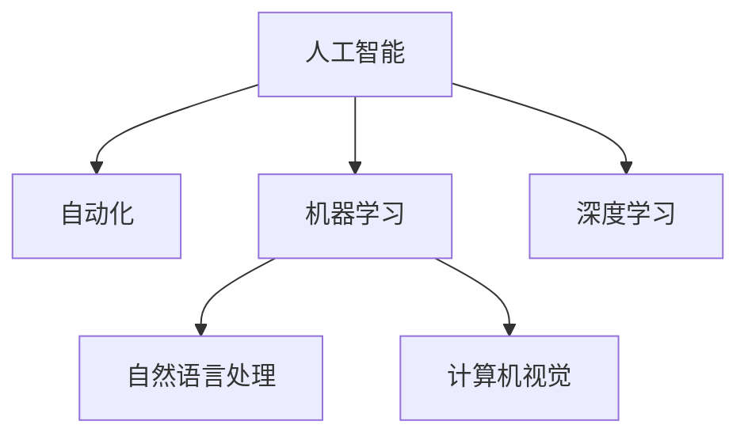
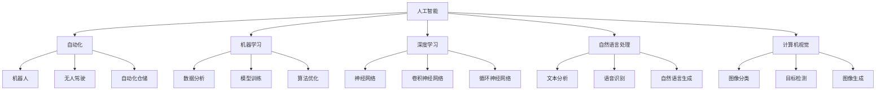

                 

## 1. 背景介绍

在AI技术的飞速发展的今天，人工智能正在以它独特的方式重塑着就业市场。然而，随着AI技术在各行各业的应用，对人类的工作产生了怎样的影响，未来就业市场将呈现何种面貌，成为了我们必须面对的问题。本节将从几个关键角度，探讨AI技术对就业市场带来的影响，并提出我们的思考。

### 1.1 人工智能技术对就业市场的冲击

近年来，人工智能技术的飞速发展，已经在诸多领域展现出巨大的潜力和应用前景。从自动驾驶到机器人，从自然语言处理到计算机视觉，AI技术的应用正在从各个角度改变人类的工作方式。然而，AI技术的普及和应用，也给传统行业带来了巨大的冲击。机器取代人力，自动化流程替代人工，这些变化都极大地影响了就业市场。

例如，制造业自动化使得工厂的生产线不再需要大量的人工操作，物流行业中的无人机和自动化仓储也减少了对人类劳动力的依赖。与此同时，AI技术的应用也让许多传统的职业面临压力，如银行柜员、客服、会计等职位正在逐渐被机器人所取代。

### 1.2 人工智能技术带来的就业机会

尽管人工智能技术带来了对传统就业市场的冲击，但同样也创造了许多新的就业机会。人工智能技术的应用需要大量的数据分析、模型训练、算法优化等专业人才，推动了数据科学、机器学习、算法工程等领域的快速发展。此外，AI技术的应用还催生了新兴产业，如自动驾驶、智能家居、智慧城市等，这些新兴产业也带来了大量的就业机会。

## 2. 核心概念与联系

### 2.1 核心概念概述

在探讨人工智能技术对就业市场的影响时，我们必须明确几个核心概念及其相互联系：

- **人工智能（AI）**：指利用计算机模拟人类智能行为的技术，包括机器学习、自然语言处理、计算机视觉、知识表示和推理等。
- **自动化**：指通过技术手段，将人力从繁琐、重复的工作中解放出来，以提高工作效率。
- **机器学习（ML）**：一种利用数据和算法，使计算机系统能够从经验中学习并不断优化的技术。
- **深度学习（DL）**：一种基于神经网络的机器学习技术，通过多层次的神经网络结构，实现对复杂数据的学习和建模。
- **自然语言处理（NLP）**：一种让计算机理解和处理人类自然语言的技术，包括文本分析、语音识别和生成等。
- **计算机视觉**：一种让计算机识别和理解图像和视频的技术，包括图像分类、目标检测、图像生成等。

这些概念之间的关系如下：



### 2.2 核心概念原理和架构的 Mermaid 流程图

在上述核心概念的基础上，构建了AI时代就业市场的初步架构，如下图所示：



在这个架构中，我们可以看到AI技术不仅改变了就业市场的工作方式，也创造了新的就业机会。

## 3. 核心算法原理 & 具体操作步骤

### 3.1 算法原理概述

人工智能技术的应用，主要基于以下几个关键算法原理：

- **监督学习（Supervised Learning）**：利用有标签的数据集，训练模型以实现对新数据进行预测。
- **无监督学习（Unsupervised Learning）**：利用未标注的数据集，通过数据自身的规律和结构，发现隐藏的模式和特征。
- **强化学习（Reinforcement Learning）**：通过与环境的交互，让模型通过试错和奖励机制，不断优化决策策略。
- **迁移学习（Transfer Learning）**：将在一个任务上训练好的模型，迁移到另一个相关的任务上进行优化。
- **泛化学习（Generalization Learning）**：使模型在新的数据上也能取得良好的表现，而不是仅仅在训练数据上表现优异。

这些算法原理在AI技术的应用中扮演了重要角色，并对就业市场产生了深远影响。

### 3.2 算法步骤详解

AI技术的应用，通常需要以下几个步骤：

1. **数据收集**：收集大量的有标注或未标注数据，为模型的训练提供基础。
2. **模型选择**：根据任务需求选择合适的模型架构，如卷积神经网络（CNN）、循环神经网络（RNN）、Transformer等。
3. **模型训练**：利用训练数据集，通过算法优化器对模型进行训练，使其能够对新数据进行预测。
4. **模型评估**：通过验证集对模型进行评估，检查其在新数据上的表现，并进行必要的调参和优化。
5. **模型部署**：将训练好的模型部署到生产环境，实现自动化和智能化应用。

### 3.3 算法优缺点

#### 优点

- **自动化**：AI技术能够自动处理大量数据，提高工作效率。
- **精准性**：AI技术可以通过深度学习算法，实现高精度的预测和决策。
- **灵活性**：AI技术能够适应多种不同的应用场景，实现定制化的解决方案。

#### 缺点

- **数据依赖**：AI技术的效果依赖于高质量、大量的数据，数据采集和标注成本高。
- **模型复杂性**：复杂的模型需要大量的计算资源，部署和维护成本较高。
- **黑盒问题**：AI模型的决策过程复杂，难以理解和解释，可能存在偏见和错误。

### 3.4 算法应用领域

人工智能技术的应用领域非常广泛，涵盖了金融、医疗、教育、交通、制造等多个行业。以下是一些主要的应用领域：

- **金融行业**：利用AI技术进行风险评估、欺诈检测、投资分析等。
- **医疗行业**：利用AI技术进行疾病诊断、药物研发、个性化医疗等。
- **教育行业**：利用AI技术进行智能教学、智能评估、学生管理等。
- **交通行业**：利用AI技术进行交通监控、自动驾驶、智能交通管理等。
- **制造行业**：利用AI技术进行质量控制、供应链管理、设备维护等。

## 4. 数学模型和公式 & 详细讲解 & 举例说明

### 4.1 数学模型构建

在AI技术中，数学模型和公式是不可或缺的工具。这里我们以机器学习中的监督学习为例，介绍常用的数学模型构建方法。

假设我们有一组训练数据集 $D=\{(x_1, y_1), (x_2, y_2), ..., (x_m, y_m)\}$，其中 $x_i$ 为输入特征，$y_i$ 为对应的标签。我们的目标是通过训练，找到最优的模型参数 $\theta$，使得模型在新数据上的预测结果与真实标签尽可能接近。

常用的监督学习模型包括线性回归、逻辑回归、支持向量机、决策树、随机森林等。以线性回归为例，其数学模型可以表示为：

$$
y = \theta^T x + b
$$

其中 $\theta$ 为模型参数，$x$ 为输入特征向量，$b$ 为偏置项。模型的目标是使得损失函数最小化，常用的损失函数包括均方误差（MSE）和交叉熵损失（CE）。

### 4.2 公式推导过程

以均方误差损失函数为例，其公式为：

$$
\min_{\theta} \frac{1}{2m} \sum_{i=1}^m (y_i - \theta^T x_i)^2
$$

对于线性回归模型，求解上述最小化问题，需要使用梯度下降算法进行求解。具体步骤如下：

1. **初始化参数**：随机初始化模型参数 $\theta$。
2. **前向传播**：将训练数据输入模型，计算预测结果 $y_i = \theta^T x_i + b$。
3. **计算损失**：计算均方误差损失 $L = \frac{1}{2m} \sum_{i=1}^m (y_i - \theta^T x_i)^2$。
4. **反向传播**：计算损失函数对模型参数的梯度 $\frac{\partial L}{\partial \theta}$。
5. **参数更新**：使用梯度下降算法更新模型参数 $\theta$，更新公式为 $\theta \leftarrow \theta - \eta \frac{\partial L}{\partial \theta}$，其中 $\eta$ 为学习率。
6. **迭代优化**：重复步骤2-5，直到损失函数收敛。

### 4.3 案例分析与讲解

以深度学习中的卷积神经网络（CNN）为例，介绍其在图像识别任务中的应用。

卷积神经网络是一种利用卷积层、池化层、全连接层等组件，实现图像分类、目标检测等任务的深度学习模型。其数学模型可以表示为：

$$
y = \sigma(\sum_{i=1}^n \sum_{j=1}^m W_{ij} \sigma(z_{ij} + b_{ij}))
$$

其中 $z_{ij} = \sum_{k=1}^K x_{ik} * W_{jk} + b_j$，$W_{ij}$ 为卷积核参数，$x_{ik}$ 为输入图像的特征图，$b_j$ 为偏置项。$\sigma$ 为激活函数，常用的激活函数包括ReLU、Sigmoid等。

CNN在图像识别任务中的应用步骤如下：

1. **数据准备**：准备包含大量标注样本的图像数据集。
2. **模型搭建**：搭建包含卷积层、池化层、全连接层的CNN模型，并设置相应的参数。
3. **模型训练**：利用训练数据集，通过反向传播算法优化模型参数。
4. **模型评估**：利用验证集对模型进行评估，检查其在新数据上的表现。
5. **模型部署**：将训练好的模型部署到生产环境，实现图像识别功能。

## 5. 项目实践：代码实例和详细解释说明

### 5.1 开发环境搭建

在进行AI项目实践时，我们首先需要搭建好开发环境。以下是常用的开发环境搭建流程：

1. **安装Python**：下载并安装最新版本的Python，推荐使用Anaconda进行环境管理。
2. **安装所需的库**：安装深度学习框架如TensorFlow、PyTorch，以及数据处理和可视化库如NumPy、Pandas、Matplotlib等。
3. **安装GPU驱动**：如果需要进行GPU加速，需要安装相应的GPU驱动，如NVIDIA的CUDA。
4. **安装虚拟环境**：使用虚拟环境工具如Virtualenv或conda，创建独立的Python环境，避免环境冲突。

### 5.2 源代码详细实现

以下是一个简单的图像识别项目的代码实现，包括数据准备、模型搭建、模型训练和模型评估等步骤：

```python
import tensorflow as tf
from tensorflow.keras import layers
from tensorflow.keras.datasets import mnist

# 加载数据集
(x_train, y_train), (x_test, y_test) = mnist.load_data()

# 数据预处理
x_train = x_train / 255.0
x_test = x_test / 255.0
x_train = tf.reshape(x_train, (-1, 28, 28, 1))
x_test = tf.reshape(x_test, (-1, 28, 28, 1))

# 搭建模型
model = tf.keras.Sequential([
    layers.Conv2D(32, (3, 3), activation='relu', input_shape=(28, 28, 1)),
    layers.MaxPooling2D((2, 2)),
    layers.Flatten(),
    layers.Dense(10, activation='softmax')
])

# 编译模型
model.compile(optimizer='adam', loss='sparse_categorical_crossentropy', metrics=['accuracy'])

# 训练模型
model.fit(x_train, y_train, epochs=5, validation_data=(x_test, y_test))

# 评估模型
test_loss, test_acc = model.evaluate(x_test, y_test, verbose=2)
print('Test accuracy:', test_acc)
```

### 5.3 代码解读与分析

上述代码实现了一个简单的卷积神经网络模型，用于手写数字识别。以下是代码的详细解读：

1. **数据准备**：加载MNIST手写数字数据集，并进行归一化和重塑。
2. **模型搭建**：搭建包含一个卷积层、一个池化层和一个全连接层的CNN模型，输入特征为28x28的灰度图像。
3. **模型编译**：设置优化器、损失函数和评估指标，编译模型。
4. **模型训练**：利用训练数据集，对模型进行5轮训练，并在验证集上进行验证。
5. **模型评估**：在测试集上评估模型的准确率，输出结果。

## 6. 实际应用场景

### 6.1 智能制造

在智能制造领域，人工智能技术的应用可以显著提高生产效率和产品质量。通过AI技术对生产数据进行分析和预测，可以实现设备维护、生产调度、质量控制等功能的自动化。例如，利用机器学习算法对生产过程中的传感器数据进行分析，可以预测设备故障，提前进行维护，减少停机时间和生产成本。

### 6.2 智慧城市

智慧城市是利用AI技术实现城市管理智能化的一种新模式。通过AI技术对城市数据进行分析和处理，可以实现交通管理、能源管理、环境监测等功能。例如，利用计算机视觉技术对交通摄像头采集的图像进行实时分析，可以实时监测交通状况，调整信号灯和交通流向，缓解交通拥堵。

### 6.3 智能医疗

在医疗领域，人工智能技术的应用可以显著提高医疗服务的效率和质量。通过AI技术对患者数据进行分析和处理，可以实现疾病诊断、治疗方案推荐、患者管理等功能。例如，利用自然语言处理技术对医疗记录进行分析，可以发现患者的病情和病史，提供个性化的治疗方案。

### 6.4 未来应用展望

随着AI技术的不断发展和应用，未来的就业市场将呈现以下几个趋势：

1. **技术岗位需求增加**：AI技术的普及将带来大量新的技术岗位，如数据科学家、算法工程师、AI工程师等。
2. **传统岗位逐渐消失**：AI技术将替代一些传统的重复性工作岗位，如数据录入、客服等。
3. **岗位技能要求提高**：AI技术的广泛应用将要求从业者具备更高的技术技能和创新能力。
4. **跨领域融合**：AI技术的应用将促进不同领域之间的融合，催生新的行业和应用场景。

## 7. 工具和资源推荐

### 7.1 学习资源推荐

为了帮助从业者系统掌握AI技术，这里推荐一些优质的学习资源：

1. **Coursera**：提供大量的AI相关课程，涵盖从基础到高级的各种内容，适合各个层次的从业者学习。
2. **Udacity**：提供深度学习和AI相关课程，包括TensorFlow、PyTorch等主流框架的使用，适合实战训练。
3. **DeepLearning.AI**：由吴恩达教授创办的AI课程平台，提供深度学习和AI相关的专业课程，包括《深度学习专项课程》等。
4. **Kaggle**：数据科学和机器学习竞赛平台，提供丰富的竞赛数据和解决方案，适合实战练习。

### 7.2 开发工具推荐

AI技术的开发离不开各种工具的支持。以下是一些常用的开发工具：

1. **TensorFlow**：由Google开发的深度学习框架，支持多种设备，包括CPU、GPU和TPU。
2. **PyTorch**：由Facebook开发的深度学习框架，支持动态图和静态图两种计算图模式，适合研究和实验。
3. **Jupyter Notebook**：数据科学和机器学习常用的交互式编程环境，支持多种编程语言和库。
4. **Visual Studio Code**：轻量级代码编辑器，支持多种编程语言和扩展，适合开发和调试AI项目。
5. **Git**：版本控制系统，适合协作开发和项目管理。

### 7.3 相关论文推荐

以下是几篇具有代表性的AI相关论文，推荐阅读：

1. **《深度学习》**：Ian Goodfellow等著，深度学习领域的经典著作，详细介绍了深度学习的基本概念和算法。
2. **《人工智能：一种现代方法》**：Stuart Russell和Peter Norvig著，人工智能领域的经典教材，涵盖AI的基础理论和应用。
3. **《计算机视觉：模型、学习和推理》**：David Forsyth和Jean Ponce著，计算机视觉领域的经典教材，详细介绍计算机视觉的基本概念和算法。
4. **《自然语言处理综论》**：Daniel Jurafsky和James H. Martin著，自然语言处理领域的经典教材，涵盖NLP的基础理论和应用。
5. **《强化学习：一种现代方法》**：Richard S. Sutton和Andrew G. Barto著，强化学习领域的经典教材，详细介绍强化学习的基本概念和算法。

## 8. 总结：未来发展趋势与挑战

### 8.1 研究成果总结

在AI技术的发展过程中，我们已经取得了许多重要的研究成果：

1. **深度学习**：通过多层神经网络的堆叠，实现对复杂数据的建模和处理。
2. **计算机视觉**：利用卷积神经网络等技术，实现图像识别、目标检测等任务。
3. **自然语言处理**：利用Transformer等技术，实现文本分类、情感分析、机器翻译等任务。
4. **强化学习**：利用试错和奖励机制，优化决策策略，应用于游戏、机器人等领域。
5. **迁移学习**：通过在相关任务上训练的模型，迁移到新任务上进行优化，提高模型的泛化能力。

### 8.2 未来发展趋势

未来的AI技术将呈现以下几个趋势：

1. **模型规模不断增大**：随着算力成本的下降和数据规模的扩张，预训练模型的参数量将持续增长。超大规模模型蕴含的丰富知识，有望支撑更加复杂多变的下游任务。
2. **跨领域应用普及**：AI技术将在更多的领域得到应用，如智慧医疗、智能交通、智能制造等。
3. **多模态融合**：AI技术将融合视觉、语音、文本等多种模态信息，实现更全面、更智能的解决方案。
4. **自适应学习**：AI技术将实现更加自适应的学习，能够在不断变化的环境中保持稳定表现。
5. **人机协同**：AI技术将与人类进行更紧密的协同工作，提高工作效率和质量。

### 8.3 面临的挑战

尽管AI技术的发展取得了显著的成果，但在迈向更加智能化、普适化应用的过程中，它仍面临诸多挑战：

1. **数据质量**：高质量、大规模的数据是AI技术的基础，但数据采集和标注成本高，数据质量难以保证。
2. **模型泛化能力**：模型在训练数据上表现优异，但在新数据上泛化能力有限，无法应对复杂的现实问题。
3. **模型可解释性**：AI模型的决策过程复杂，难以理解和解释，可能存在偏见和错误。
4. **伦理和安全性**：AI技术的应用可能带来伦理和安全性问题，如数据隐私、算法偏见等。
5. **技术壁垒**：AI技术的复杂性高，对从业者技术要求高，门槛较高。

### 8.4 研究展望

未来，AI技术的研究将更加注重以下几个方面：

1. **数据治理**：建立高效、规范的数据治理机制，提高数据质量和可用性。
2. **模型鲁棒性**：研究鲁棒性强、泛化能力好的模型，提高模型在复杂环境中的表现。
3. **可解释性**：研究可解释性强的模型，提高模型的透明性和可信度。
4. **伦理与安全**：研究伦理和安全性强的AI技术，确保技术应用的安全性和公正性。
5. **跨领域融合**：研究跨领域的AI技术，实现多模态数据的融合和应用。

## 9. 附录：常见问题与解答

### Q1: 人工智能技术会对就业市场产生哪些影响？

A: 人工智能技术将对就业市场产生深远影响，主要体现在以下几个方面：

1. **自动化替代**：AI技术将替代一些传统的重复性工作岗位，如数据录入、客服等。
2. **新岗位增加**：AI技术将带来大量新的技术岗位，如数据科学家、算法工程师等。
3. **岗位技能要求提高**：AI技术的应用将要求从业者具备更高的技术技能和创新能力。
4. **跨领域融合**：AI技术的应用将促进不同领域之间的融合，催生新的行业和应用场景。

### Q2: 人工智能技术在就业市场中的应用场景有哪些？

A: 人工智能技术在就业市场中的应用场景非常广泛，包括：

1. **智能制造**：利用AI技术对生产数据进行分析和预测，实现设备维护、生产调度、质量控制等功能的自动化。
2. **智慧城市**：利用AI技术对城市数据进行分析和处理，实现交通管理、能源管理、环境监测等功能。
3. **智能医疗**：利用AI技术对患者数据进行分析和处理，实现疾病诊断、治疗方案推荐、患者管理等功能。
4. **金融行业**：利用AI技术进行风险评估、欺诈检测、投资分析等。
5. **教育行业**：利用AI技术进行智能教学、智能评估、学生管理等。

### Q3: 人工智能技术的未来发展趋势有哪些？

A: 人工智能技术的未来发展趋势主要体现在以下几个方面：

1. **模型规模不断增大**：随着算力成本的下降和数据规模的扩张，预训练模型的参数量将持续增长。超大规模模型蕴含的丰富知识，有望支撑更加复杂多变的下游任务。
2. **跨领域应用普及**：AI技术将在更多的领域得到应用，如智慧医疗、智能交通、智能制造等。
3. **多模态融合**：AI技术将融合视觉、语音、文本等多种模态信息，实现更全面、更智能的解决方案。
4. **自适应学习**：AI技术将实现更加自适应的学习，能够在不断变化的环境中保持稳定表现。
5. **人机协同**：AI技术将与人类进行更紧密的协同工作，提高工作效率和质量。

### Q4: 人工智能技术在实际应用中面临哪些挑战？

A: 人工智能技术在实际应用中面临的主要挑战包括：

1. **数据质量**：高质量、大规模的数据是AI技术的基础，但数据采集和标注成本高，数据质量难以保证。
2. **模型泛化能力**：模型在训练数据上表现优异，但在新数据上泛化能力有限，无法应对复杂的现实问题。
3. **模型可解释性**：AI模型的决策过程复杂，难以理解和解释，可能存在偏见和错误。
4. **伦理和安全**：AI技术的应用可能带来伦理和安全性问题，如数据隐私、算法偏见等。
5. **技术壁垒**：AI技术的复杂性高，对从业者技术要求高，门槛较高。

### Q5: 未来AI技术的研究方向有哪些？

A: 未来AI技术的研究方向主要体现在以下几个方面：

1. **数据治理**：建立高效、规范的数据治理机制，提高数据质量和可用性。
2. **模型鲁棒性**：研究鲁棒性强、泛化能力好的模型，提高模型在复杂环境中的表现。
3. **可解释性**：研究可解释性强的模型，提高模型的透明性和可信度。
4. **伦理与安全**：研究伦理和安全性强的AI技术，确保技术应用的安全性和公正性。
5. **跨领域融合**：研究跨领域的AI技术，实现多模态数据的融合和应用。

---

作者：禅与计算机程序设计艺术 / Zen and the Art of Computer Programming

