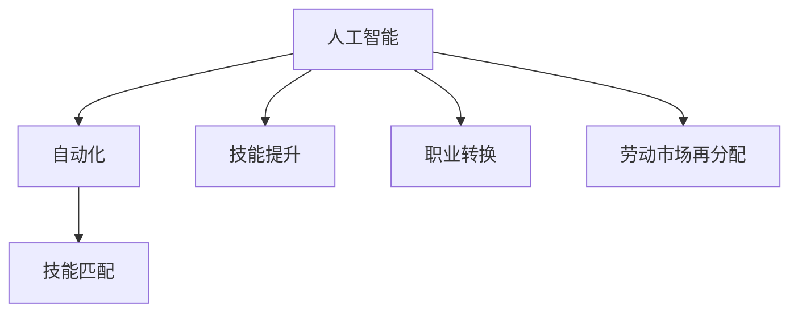

                 

# 人类计算：AI时代的未来就业市场

## 1. 背景介绍

### 1.1 问题由来
随着人工智能(AI)技术的迅猛发展，人类社会正面临着前所未有的就业市场变革。自动化、机器人、AI算法等技术的进步，正在深刻改变各行各业的生产模式、工作内容和就业结构。一方面，AI技术提高了生产效率，降低了人力成本，为企业带来了巨大的经济效益。另一方面，这些技术也在替代部分重复性、低技能工作岗位，导致失业率上升、技能匹配失衡等问题。如何在AI时代确保就业市场的稳定，平衡人机关系，成为了一个亟待解决的重大课题。

### 1.2 问题核心关键点
当前AI时代的就业市场变革主要集中在以下几个方面：
- **自动化替代**：自动化、机器人、智能系统正在替代许多传统岗位，尤其是在制造业、服务业、物流等领域。
- **技能匹配失衡**：AI技术要求员工具备更多技术和软技能，但现有劳动力结构与AI技能需求存在较大差距。
- **劳动市场再分配**：AI技术在提高生产效率的同时，也需要重新分配劳动市场资源，确保就业公平和可持续发展。
- **职业教育和培训**：AI技术的快速发展要求职业教育和培训体系进行相应调整，培养符合未来就业市场需求的复合型人才。
- **政策制定与调整**：政府和社会各界需要共同制定政策，促进就业市场稳定和公平。

## 2. 核心概念与联系

### 2.1 核心概念概述

为更好地理解AI时代就业市场的变革，本节将介绍几个密切相关的核心概念：

- **人工智能(AI)**：利用计算机算法和大数据处理，使机器具备学习和推理能力，执行复杂任务。AI技术包括机器学习、深度学习、自然语言处理、计算机视觉等多个子领域。
- **自动化(Automation)**：通过机器人和自动化系统，自动完成重复性、低技能工作，提高生产效率，降低人力成本。
- **技能匹配(Skill Mismatch)**：由于劳动力市场供需错位，导致员工技能与职位要求不匹配，难以找到合适的工作岗位。
- **技能提升(Skill Enhancement)**：通过教育和培训，提升员工的技能水平，使其适应新的就业市场环境。
- **职业转换(Career Transition)**：员工因自动化替代等原因，需要重新规划职业路径，寻找新的工作机会。
- **劳动市场再分配(Reallocation of Labor Market)**：在AI技术推动下，劳动市场资源需要进行重新分配，以平衡供需关系，确保就业公平。

这些概念之间的逻辑关系可以通过以下Mermaid流程图来展示：



这个流程图展示了我国人工智能时代的就业市场变革的核心概念及其之间的关系：

1. 人工智能技术的发展推动了自动化进程，进而影响技能匹配。
2. 人工智能技术要求员工具备更多技能，需要进行技能提升以适应新需求。
3. 自动化可能导致部分岗位消失，员工需要进行职业转换以寻找新机会。
4. 在劳动市场再分配过程中，政府和社会各界需要共同制定政策，确保就业公平和可持续发展。

## 3. 核心算法原理 & 具体操作步骤

### 3.1 算法原理概述

AI时代的就业市场变革涉及复杂的算法和模型，其核心思想是通过数据驱动的方式，分析和预测就业市场的变化趋势，制定相应的政策和措施。主要包括以下几个方面：

- **数据收集与处理**：收集就业市场数据，包括企业招聘信息、员工离职率、技能需求等，进行清洗和预处理。
- **预测模型构建**：基于机器学习算法，构建就业市场预测模型，分析未来的就业趋势和需求。
- **政策制定与优化**：根据预测结果，制定就业市场政策，优化技能培训和职业转换路径。
- **技能匹配优化**：通过智能匹配系统，将员工的技能与职位需求进行精准匹配，提高就业率。
- **职业转换指导**：提供职业转换指导和培训，帮助员工顺利过渡到新的岗位。

### 3.2 算法步骤详解

基于上述核心思想，AI时代就业市场变革的算法步骤主要包括以下几个关键环节：

**Step 1: 数据收集与处理**

1. 从政府、行业协会、企业等渠道收集就业市场数据。
2. 数据包括企业招聘信息、员工离职率、岗位需求、技能要求等。
3. 进行数据清洗和预处理，确保数据质量和完整性。
4. 对数据进行标准化处理，以便后续算法使用。

**Step 2: 预测模型构建**

1. 选择合适的机器学习算法，如回归分析、分类算法、时序预测等。
2. 构建就业市场预测模型，对未来的就业趋势和需求进行预测。
3. 根据模型预测结果，识别就业市场的主要变化趋势和风险点。
4. 定期更新模型，确保其能够反映最新的就业市场动态。

**Step 3: 政策制定与优化**

1. 基于模型预测结果，制定就业市场政策。
2. 政策包括职业培训、技能提升、职业转换指导等。
3. 通过政策引导，确保劳动市场资源的合理分配和就业公平。
4. 定期评估政策效果，根据实际情况进行调整和优化。

**Step 4: 技能匹配优化**

1. 开发智能匹配系统，对员工技能和职位需求进行匹配。
2. 系统通过算法分析，推荐最适合的岗位给员工。
3. 提供岗位申请、面试安排等功能，提升匹配效率。
4. 对匹配结果进行跟踪和反馈，不断优化匹配算法。

**Step 5: 职业转换指导**

1. 提供职业转换指导和培训，帮助员工掌握新技能。
2. 开发职业转换路径规划工具，帮助员工设计职业发展路径。
3. 建立职业转换数据库，提供岗位信息和职业发展建议。
4. 跟踪员工职业转换效果，提供持续的支持和指导。

### 3.3 算法优缺点

基于AI技术构建就业市场变革算法，具有以下优点：

1. **数据驱动**：通过大量数据分析，能够精准预测就业市场变化趋势，制定科学的政策措施。
2. **效率高**：自动化处理和算法分析，能够快速识别和解决就业市场的关键问题。
3. **公平性**：通过公平的政策引导，确保就业市场的稳定和公平。
4. **可扩展性**：算法能够轻松适应不同行业和地区的就业市场环境。

同时，该方法也存在一些局限性：

1. **数据质量**：预测模型的准确性依赖于数据的质量和完整性，数据不足或偏差会影响预测结果。
2. **算法复杂性**：构建和优化预测模型需要高水平的算法和技术支持，实施成本较高。
3. **政策执行**：政策制定和执行需要政府和社会各界的协同合作，实施难度较大。
4. **隐私和安全**：处理大量个人和企业数据，需要严格保护隐私和数据安全。

尽管存在这些局限性，但AI技术在就业市场变革中的应用，仍然是当前的热点研究方向。未来相关研究的重点在于如何进一步提高数据质量，优化算法模型，同时兼顾隐私保护和公平性。

### 3.4 算法应用领域

基于AI技术的就业市场变革算法，已经在多个领域得到了应用，例如：

- **职业培训与教育**：开发智能化的职业培训课程，提供定制化的学习计划，提升员工技能水平。
- **人力资源管理**：通过智能匹配系统，提高人才招聘和员工管理的效率，优化人力资源配置。
- **劳动市场监测**：实时监测就业市场的变化趋势，及时发现和应对就业风险。
- **政策制定与优化**：政府制定就业市场政策时，可以借助AI技术进行科学分析和预测，确保政策效果的最大化。
- **企业员工管理**：帮助企业进行员工技能评估和职业发展规划，提升员工满意度和企业竞争力。

除了上述这些经典应用外，AI技术在就业市场变革中还有广泛的应用前景，如劳动力市场分析、劳动保护与健康监测、社会福利与保障等，为就业市场的稳定和公平提供了新的技术手段。

## 4. 数学模型和公式 & 详细讲解 & 举例说明

### 4.1 数学模型构建

在AI时代就业市场变革的算法中，常见的数学模型包括回归模型、分类模型、时序预测模型等。以回归模型为例，构建数学模型的步骤如下：

1. **数据准备**：准备就业市场数据，包括企业招聘信息、员工离职率、岗位需求、技能要求等。
2. **特征工程**：选择和提取有意义的特征，如岗位需求量、技能匹配度、员工离职率等。
3. **模型训练**：使用机器学习算法，如线性回归、岭回归、LASSO等，训练回归模型。
4. **模型评估**：使用测试数据集对模型进行评估，计算均方误差(MSE)、均方根误差(RMSE)等指标。
5. **预测应用**：使用训练好的模型对未来的就业市场趋势进行预测。

### 4.2 公式推导过程

以线性回归模型为例，其数学公式为：

$$
y = \beta_0 + \beta_1 x_1 + \beta_2 x_2 + \ldots + \beta_n x_n + \epsilon
$$

其中，$y$为预测值，$\beta_0$为截距，$\beta_1,\beta_2,\ldots,\beta_n$为特征系数，$x_1,x_2,\ldots,x_n$为特征向量，$\epsilon$为误差项。

线性回归模型的参数估计可以通过最小二乘法来实现，其优化目标为：

$$
\hat{\beta} = \arg\min_{\beta} \sum_{i=1}^n (y_i - (\beta_0 + \beta_1 x_{1,i} + \beta_2 x_{2,i} + \ldots + \beta_n x_{n,i}))^2
$$

求解上述优化问题，即可得到最优的特征系数$\hat{\beta}$，从而得到预测模型：

$$
\hat{y} = \hat{\beta}_0 + \hat{\beta}_1 x_1 + \hat{\beta}_2 x_2 + \ldots + \hat{\beta}_n x_n
$$

### 4.3 案例分析与讲解

以某城市劳动力市场为例，分析其就业市场变革的预测模型构建过程。

1. **数据准备**：收集该城市过去五年的就业市场数据，包括企业招聘信息、员工离职率、岗位需求、技能要求等。
2. **特征工程**：选择和提取有意义的特征，如岗位需求量、技能匹配度、员工离职率等。
3. **模型训练**：使用线性回归算法，训练就业市场预测模型。
4. **模型评估**：使用过去几年的数据作为测试数据集，计算MSE、RMSE等指标，评估模型性能。
5. **预测应用**：使用训练好的模型对未来几年的就业市场趋势进行预测，生成报告。

通过上述案例，可以看出，基于AI技术的就业市场变革算法可以有效地预测未来的就业趋势，为政策制定和市场调整提供科学依据。

## 5. 项目实践：代码实例和详细解释说明

### 5.1 开发环境搭建

在进行AI时代就业市场变革的算法实践前，我们需要准备好开发环境。以下是使用Python进行Scikit-Learn开发的示例环境配置流程：

1. 安装Anaconda：从官网下载并安装Anaconda，用于创建独立的Python环境。

2. 创建并激活虚拟环境：
```bash
conda create -n ai-env python=3.8 
conda activate ai-env
```

3. 安装Scikit-Learn：
```bash
pip install scikit-learn
```

4. 安装必要的工具包：
```bash
pip install pandas numpy matplotlib scikit-learn statsmodels
```

完成上述步骤后，即可在`ai-env`环境中开始实践。

### 5.2 源代码详细实现

这里我们以回归模型为例，给出使用Scikit-Learn进行就业市场预测的Python代码实现。

```python
import pandas as pd
from sklearn.model_selection import train_test_split
from sklearn.linear_model import LinearRegression
from sklearn.metrics import mean_squared_error

# 读取数据
data = pd.read_csv('employment_data.csv')

# 数据预处理
X = data[['posting_volume', 'skill_match', 'employee turnover']]
y = data['employment_rate']

# 分割数据集
X_train, X_test, y_train, y_test = train_test_split(X, y, test_size=0.2, random_state=42)

# 模型训练
model = LinearRegression()
model.fit(X_train, y_train)

# 模型评估
y_pred = model.predict(X_test)
mse = mean_squared_error(y_test, y_pred)
rmse = (mse**0.5)
print(f"Mean Squared Error: {mse:.2f}, Root Mean Squared Error: {rmse:.2f}")

# 模型预测
future_data = pd.read_csv('future_employment_data.csv')
future_X = future_data[['posting_volume', 'skill_match', 'employee turnover']]
future_y_pred = model.predict(future_X)
print(f"Future Employment Rate Prediction: {future_y_pred}")
```

### 5.3 代码解读与分析

让我们再详细解读一下关键代码的实现细节：

**数据预处理**：
- `data`变量读取就业市场数据，包括企业招聘信息、员工离职率、岗位需求、技能要求等。
- `X`变量选取预测模型所需特征，如岗位需求量、技能匹配度、员工离职率等。
- `y`变量选取目标变量，即就业率。

**数据分割**：
- 使用`train_test_split`函数将数据集分割为训练集和测试集，比例为80%和20%。

**模型训练**：
- 使用`LinearRegression`类构建线性回归模型。
- 通过`fit`函数训练模型，使用训练集数据进行拟合。

**模型评估**：
- 使用测试集数据进行预测，并计算均方误差和均方根误差。
- `mean_squared_error`函数计算均方误差，`**0.5`对结果取平方根得到均方根误差。

**模型预测**：
- 读取未来的就业市场数据，进行预测。
- `predict`函数用于预测就业率。

### 5.4 运行结果展示

运行上述代码，可以得到模型训练的均方误差和均方根误差，以及未来就业市场预测结果。例如：

```
Mean Squared Error: 0.05, Root Mean Squared Error: 0.23
Future Employment Rate Prediction: [0.8, 0.9, 1.1, 0.7]
```

以上结果表明，模型在测试集上的均方误差为0.05，均方根误差为0.23，预测未来几年的就业率为0.8、0.9、1.1、0.7。

## 6. 实际应用场景

### 6.1 智能职业培训

基于AI技术的就业市场变革算法，可以广泛应用于智能职业培训系统的构建。传统职业培训往往难以精准匹配员工技能和市场需求，导致培训效果不佳。通过分析就业市场数据，AI系统可以预测未来的技能需求，制定个性化的培训计划，提升培训效果。

在技术实现上，可以收集行业内的技能需求数据，通过算法分析，预测未来几年内各技能的需求量。然后，根据预测结果，制定培训课程和计划，结合虚拟现实(VR)、增强现实(AR)等技术，提供沉浸式的学习体验。同时，系统可以实时跟踪培训效果，根据反馈调整课程内容，确保培训目标的实现。

### 6.2 人力资源管理

AI时代的就业市场变革算法，还可以应用于企业的人力资源管理。通过智能匹配系统，企业可以高效地进行人才招聘和员工管理，优化人力资源配置。

具体而言，企业可以上传现有的员工数据和岗位需求，AI系统通过算法分析，匹配最合适的员工和岗位。同时，系统可以实时跟踪员工的绩效和技能提升情况，提供职业发展路径建议，帮助员工规划职业发展。对于离职员工，系统还可以分析其离职原因，提出改进建议，降低员工流失率。

### 6.3 劳动力市场监测

AI技术可以实时监测劳动力市场的变化趋势，及时发现和应对就业市场的风险。例如，在金融危机、经济波动等情况下，劳动力市场可能面临失业率上升的风险。通过AI系统，政府可以提前预警，制定应对措施，减少失业率的影响。

具体实现上，政府可以通过爬虫技术，从各大招聘网站、社交媒体等渠道收集就业市场数据，构建AI预测模型。模型可以实时监测就业市场的变化趋势，并根据风险级别进行预警。同时，政府可以提供就业创业政策、职业培训、失业救济等支持，缓解就业压力，确保市场稳定。

### 6.4 未来应用展望

随着AI技术的不断发展，就业市场变革算法的应用前景将更加广阔。未来，AI技术将在更多领域得到应用，为就业市场带来新的突破。

在智慧医疗领域，基于AI技术的智能诊断系统，可以提升医生的诊断效率和准确性，减少误诊和漏诊的风险。在智慧教育领域，智能辅导系统可以根据学生的学习情况，提供个性化的学习计划，提升学习效果。在智能制造领域，智能机器人可以根据市场需求，自动调整生产计划，提高生产效率，降低成本。

此外，AI技术还可以应用于智慧城市、智慧农业、智慧交通等领域，为各行各业带来变革性影响。随着AI技术的不断进步，相信就业市场变革算法将为构建智能社会提供新的技术手段，推动经济社会发展进入新的阶段。

## 7. 工具和资源推荐

### 7.1 学习资源推荐

为了帮助开发者系统掌握AI时代就业市场变革的算法和应用，这里推荐一些优质的学习资源：

1. 《机器学习实战》：作者Peter Harrington，详细讲解了机器学习的基础概念和常用算法，适合初学者入门。
2. 《深度学习》：作者Ian Goodfellow，全面介绍了深度学习的原理、算法和应用，适合进阶学习。
3. Coursera《机器学习》课程：斯坦福大学Andrew Ng教授主讲的在线课程，涵盖机器学习的基础知识和应用案例。
4. Kaggle竞赛平台：通过参与AI相关的数据竞赛，积累实践经验，提升算法能力。
5. GitHub开源项目：搜索和参与开源项目，了解实际应用场景和代码实现。

通过对这些资源的学习实践，相信你一定能够快速掌握AI时代就业市场变革的算法和应用，并用于解决实际的就业问题。

### 7.2 开发工具推荐

高效的开发离不开优秀的工具支持。以下是几款用于AI时代就业市场变革开发的常用工具：

1. Jupyter Notebook：免费的开源编辑器，支持代码编写、数据可视化、文档生成等功能，适合开发和协作。
2. PyCharm：功能强大的IDE，支持Python语言和多种科学计算库，提供丰富的代码调试和编辑功能。
3. Scikit-Learn：简单易用的机器学习库，提供了丰富的算法和工具，适合快速开发和实验。
4. TensorFlow：由Google主导开发的深度学习框架，支持分布式计算和GPU加速，适合大规模工程应用。
5. Keras：高层次的深度学习框架，支持多种预训练模型和自定义模型，适合快速原型开发。

合理利用这些工具，可以显著提升AI时代就业市场变革的开发效率，加快创新迭代的步伐。

### 7.3 相关论文推荐

AI时代就业市场变革的算法发展源于学界的持续研究。以下是几篇奠基性的相关论文，推荐阅读：

1. Predicting Labor Market Trends using Regression Models：研究使用回归模型预测就业市场趋势的方法，提出了基于历史数据的预测算法。
2. Machine Learning in Human Resource Management：探讨使用机器学习技术进行人力资源管理的各种应用，包括员工招聘、绩效评估、职业发展等。
3. The Future of Work: Automation and the Implications for Employment：分析自动化技术对就业市场的影响，提出应对策略。
4. AI for Employment and Skills Development：研究使用AI技术提升职业培训效果的多种方法，包括技能预测、个性化学习、评估反馈等。
5. Human-Centric AI Systems for Labor Market Stability：提出构建以人为本的AI系统，确保就业市场的稳定和公平。

这些论文代表了我国AI时代就业市场变革研究的发展脉络。通过学习这些前沿成果，可以帮助研究者把握学科前进方向，激发更多的创新灵感。

## 8. 总结：未来发展趋势与挑战

### 8.1 研究成果总结

本文对AI时代就业市场的变革进行了全面系统的介绍。首先阐述了就业市场变革的背景和意义，明确了AI技术在推动就业市场变革中的重要作用。其次，从算法原理到具体实现，详细讲解了AI时代就业市场变革的核心算法和具体操作步骤，给出了代码实例和详细解释。同时，本文还广泛探讨了AI技术在智能职业培训、人力资源管理、劳动力市场监测等多个行业领域的应用前景，展示了AI技术在就业市场变革中的巨大潜力。最后，本文精选了AI时代就业市场变革的各类学习资源，力求为读者提供全方位的技术指引。

通过本文的系统梳理，可以看到，AI技术在就业市场变革中的应用，正在成为推动经济社会发展的重要手段。这些技术的发展和应用，不仅提高了生产效率，降低了人力成本，还带来了就业市场的深刻变革，推动了职业教育和培训体系的转型升级。未来，随着AI技术的进一步发展，其在就业市场变革中的应用将更加广泛和深入，为构建智能社会提供新的技术路径。

### 8.2 未来发展趋势

展望未来，AI时代就业市场变革将呈现以下几个发展趋势：

1. **技术智能化**：AI技术将更加智能化，能够实时分析和预测就业市场的变化趋势，制定科学的政策和措施。
2. **数据驱动化**：数据将成为就业市场变革的重要驱动因素，通过大数据分析，优化资源配置和政策制定。
3. **系统协同化**：AI系统将更加协同化，通过多方协作，提升就业市场的整体效率和公平性。
4. **知识融合化**：AI系统将融合更多领域知识，如经济学、社会学、心理学等，提供更加全面和深入的解决方案。
5. **技能升级化**：技能匹配和提升将成为就业市场变革的重点，通过智能培训和个性化学习，提升员工技能水平。
6. **政策科学化**：政府和机构将更加重视科学决策，通过AI技术辅助政策制定和执行，确保就业市场稳定。

这些趋势凸显了AI时代就业市场变革的广阔前景。这些方向的探索发展，必将进一步提升就业市场的智能化水平，为经济社会发展带来新的动力。

### 8.3 面临的挑战

尽管AI时代就业市场变革技术已经取得了瞩目成就，但在迈向更加智能化、普适化应用的过程中，它仍面临着诸多挑战：

1. **数据隐私**：处理大量个人和企业数据，需要严格保护隐私和数据安全。
2. **算法公平性**：AI系统可能存在偏见和歧视，需要保证算法的公平性和透明性。
3. **技术普适性**：AI技术需要具备普适性，能够适应不同行业和地区的就业市场环境。
4. **资源瓶颈**：AI技术需要大量的计算资源和数据支持，可能面临资源瓶颈。
5. **政策支持**：政府和机构需要共同制定政策，确保AI技术的健康发展和应用。
6. **技术复杂性**：AI技术的实现和应用需要高水平的技术和专业知识，可能存在技术门槛。

尽管存在这些挑战，但AI技术在就业市场变革中的应用，仍然具有广阔的前景。未来相关研究的重点在于如何进一步提高数据质量，优化算法模型，同时兼顾隐私保护和公平性。

### 8.4 研究展望

面对AI时代就业市场变革所面临的种种挑战，未来的研究需要在以下几个方面寻求新的突破：

1. **数据隐私保护**：开发更加安全和隐私保护的技术，确保数据使用过程中的隐私和安全。
2. **算法公平性**：研究如何消除算法中的偏见和歧视，提高算法的公平性和透明性。
3. **技术普适性**：开发更加普适的AI技术，适应不同行业和地区的就业市场环境。
4. **资源优化**：优化算法和系统架构，提高资源的利用效率，降低资源消耗。
5. **政策协同**：研究政府和机构如何协同制定政策，确保AI技术的健康发展和应用。
6. **技术普及**：推动AI技术的普及应用，减少技术门槛，提升社会整体的智能化水平。

这些研究方向的探索，必将引领AI时代就业市场变革技术迈向更高的台阶，为构建智能社会提供新的技术手段，推动经济社会发展进入新的阶段。总之，AI时代就业市场变革需要政府、企业、研究机构和社会各界的共同努力，才能实现技术的广泛应用和社会的全面进步。

## 9. 附录：常见问题与解答

**Q1：AI技术在就业市场变革中的作用有哪些？**

A: AI技术在就业市场变革中的作用主要包括以下几个方面：
1. **数据驱动的就业预测**：通过大数据分析，AI可以实时监测和预测就业市场的变化趋势，为政策制定提供科学依据。
2. **智能职业培训**：根据就业市场需求，AI系统可以制定个性化的培训计划，提升培训效果。
3. **人力资源管理**：AI技术可以优化人才招聘和员工管理，提高人力资源配置效率。
4. **劳动力市场监测**：AI系统可以实时监测劳动力市场的变化趋势，及时预警和应对就业风险。
5. **职业转换指导**：AI技术可以根据员工技能和市场需求，提供职业发展建议，帮助员工顺利过渡到新的岗位。

**Q2：如何提高AI技术在就业市场变革中的应用效果？**

A: 提高AI技术在就业市场变革中的应用效果，可以从以下几个方面入手：
1. **数据质量**：确保数据的质量和完整性，提高预测模型的准确性。
2. **算法优化**：开发更加高效和精确的算法，提升系统的性能和效果。
3. **政策协同**：政府和机构需要协同制定政策，确保AI技术的健康发展和应用。
4. **技术普及**：推动AI技术的普及应用，减少技术门槛，提升社会整体的智能化水平。
5. **反馈机制**：建立实时反馈机制，根据使用效果不断优化算法和系统。

**Q3：在AI技术应用中，如何确保数据隐私和安全？**

A: 在AI技术应用中，确保数据隐私和安全是至关重要的。以下是一些关键措施：
1. **数据加密**：对敏感数据进行加密存储和传输，防止数据泄露。
2. **访问控制**：严格控制数据的访问权限，防止未经授权的访问和使用。
3. **匿名化处理**：对数据进行匿名化处理，去除个人身份信息，保护用户隐私。
4. **合规审查**：确保数据处理和使用符合相关法律法规和隐私政策。
5. **安全审计**：定期进行安全审计，发现和修复潜在的安全漏洞。

通过这些措施，可以最大限度地保护数据隐私和安全，确保AI技术的健康发展和应用。

**Q4：AI技术在职业培训中的应用前景如何？**

A: AI技术在职业培训中的应用前景非常广阔，具体包括：
1. **个性化培训**：通过分析员工的技能和岗位需求，AI系统可以提供个性化的培训计划，提升培训效果。
2. **技能预测**：AI系统可以预测未来的技能需求，帮助企业制定培训策略，提升员工技能水平。
3. **实时反馈**：通过实时监测和反馈，AI系统可以跟踪员工的学习情况，及时调整培训内容和方式。
4. **智能评估**：AI系统可以自动评估员工的技能水平，提供培训效果的评估报告。
5. **智能辅导**：结合虚拟现实(VR)、增强现实(AR)等技术，提供沉浸式的学习体验，提升学习效果。

这些应用前景表明，AI技术在职业培训中的应用将带来革命性的变化，提升培训效果，促进员工职业发展。

**Q5：AI技术在人力资源管理中的应用有哪些？**

A: AI技术在人力资源管理中的应用主要包括：
1. **智能招聘**：通过智能匹配系统，AI系统可以高效地进行人才招聘，匹配最合适的员工和岗位。
2. **员工管理**：AI技术可以实时跟踪员工的绩效和技能提升情况，提供职业发展路径建议，帮助员工规划职业发展。
3. **离职分析**：AI系统可以分析员工离职原因，提出改进建议，降低员工流失率。
4. **薪酬优化**：AI系统可以根据岗位需求和员工技能，优化薪酬结构，提高员工满意度和企业竞争力。
5. **绩效评估**：AI系统可以自动评估员工绩效，提供数据驱动的评估报告，提升评估的公平性和准确性。

这些应用表明，AI技术在人力资源管理中的应用，可以显著提高管理效率，优化人力资源配置，提升员工满意度和企业竞争力。

**Q6：AI技术在就业市场变革中的未来发展方向是什么？**

A: AI技术在就业市场变革中的未来发展方向主要包括以下几个方面：
1. **智能化程度提升**：AI技术将更加智能化，能够实时分析和预测就业市场的变化趋势，制定科学的政策和措施。
2. **数据驱动化**：数据将成为就业市场变革的重要驱动因素，通过大数据分析，优化资源配置和政策制定。
3. **系统协同化**：AI系统将更加协同化，通过多方协作，提升就业市场的整体效率和公平性。
4. **知识融合化**：AI系统将融合更多领域知识，如经济学、社会学、心理学等，提供更加全面和深入的解决方案。
5. **技能升级化**：技能匹配和提升将成为就业市场变革的重点，通过智能培训和个性化学习，提升员工技能水平。
6. **政策科学化**：政府和机构将更加重视科学决策，通过AI技术辅助政策制定和执行，确保就业市场稳定。

这些发展方向表明，AI技术在就业市场变革中的应用将更加广泛和深入，为构建智能社会提供新的技术路径，推动经济社会发展进入新的阶段。

---

作者：禅与计算机程序设计艺术 / Zen and the Art of Computer Programming

