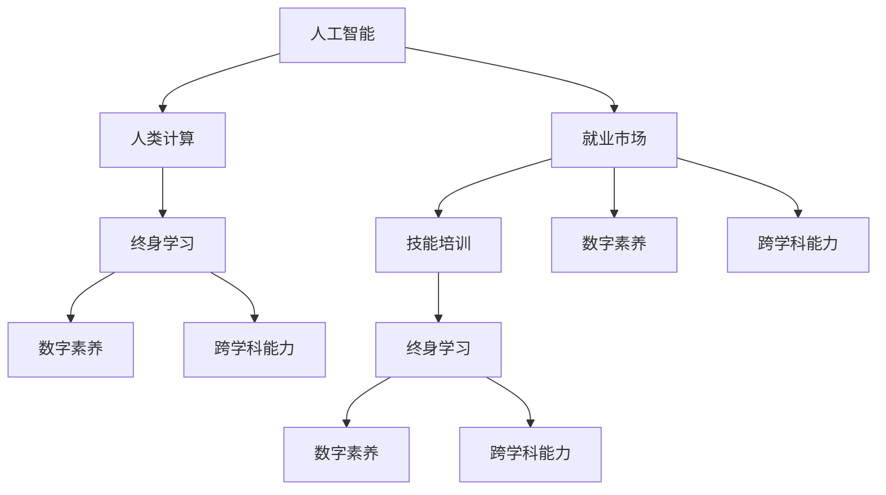

                 

# 人类计算：AI时代的未来就业市场与技能培训发展趋势分析机遇挑战机遇趋势分析

> 关键词：人工智能,就业市场,技能培训,人类计算,数字化转型,职场变革,AI教育,终身学习

## 1. 背景介绍

### 1.1 问题由来
随着人工智能(AI)技术的飞速发展，全球就业市场正经历深刻的变革。AI技术在各行各业的渗透和应用，不仅提升了生产效率，也带来了新的机遇与挑战。特别是对于劳动密集型和重复性工作的替代，以及对新技能的需求激增，使得未来的就业市场和技能培训面临巨大的变化。

### 1.2 问题核心关键点
1. **就业市场变化**：AI技术广泛应用导致部分传统职业需求减少，同时也催生了新的就业岗位。
2. **技能培训需求**：新兴职业需要具备AI相关技能，同时传统职业也需要转型升级。
3. **人类计算**：AI的崛起使得“人类计算”成为核心竞争力，强调人类在创新、创造、决策等方面的独特价值。
4. **职业教育和终身学习**：为适应就业市场的变化，职业教育和终身学习成为新的教育趋势。
5. **数字素养和跨学科能力**：未来的就业市场更看重数字素养和跨学科技能，包括数据分析、编程、项目管理等。

### 1.3 问题研究意义
本文旨在深入分析AI时代就业市场和技能培训的发展趋势，探讨人类计算在职场中的作用，并为职业教育和终身学习提供理论支持和实践指导。理解这些变化，有助于教育机构和企业制定应对策略，确保劳动者能够顺利适应新的就业环境，提升整体社会福祉。

## 2. 核心概念与联系

### 2.1 核心概念概述

为更好地理解AI时代就业市场和技能培训的趋势，本文将介绍几个核心概念及其相互联系：

1. **人工智能(AI)**：通过算法和数据训练计算机系统，使其具备类似于人类的智能能力，包括学习、推理、决策等。
2. **人类计算**：强调人类在创新、创造、决策等方面的独特价值，区别于AI的机械计算。
3. **就业市场**：由各种经济活动形成的劳动力需求和供给的动态平衡。
4. **技能培训**：通过教育培训提升劳动者技能，适应就业市场变化。
5. **终身学习**：强调个体在其职业生涯中不断学习新知识和技能，以适应快速变化的环境。
6. **数字素养**：个体理解和应用数字技术的能力，包括数据分析、编程、互联网使用等。
7. **跨学科能力**：结合不同学科的知识和方法，解决复杂问题的能力，如跨学科项目管理、人工智能与生物学的交叉应用等。

这些核心概念之间的逻辑关系可以通过以下Mermaid流程图来展示：



这个流程图展示了一组概念之间的相互关系：

1. AI推动了就业市场的变化，从而引发了技能培训的需求。
2. 人类计算强调了人类在创新和决策中的不可替代性。
3. 终身学习和数字素养成为适应就业市场变化的重要手段。
4. 跨学科能力是解决复杂问题的新趋势。

这些概念共同构成了AI时代就业市场和技能培训的理论框架，为理解和应对未来的挑战提供了基础。

## 3. 核心算法原理 & 具体操作步骤

### 3.1 算法原理概述

AI时代的就业市场和技能培训涉及多个算法和决策过程。本文将从宏观和微观两个层面，阐述这些算法的原理和操作步骤。

**宏观层面**：
1. **劳动力需求预测**：使用时间序列分析和机器学习模型，预测未来劳动力需求的变化。
2. **就业市场匹配算法**：优化算法匹配求职者与职位，提升匹配效率和质量。
3. **技能需求分析**：通过文本分析和大数据挖掘，分析特定行业或职位所需的技能。

**微观层面**：
1. **技能培训课程设计**：使用行为分析和机器学习算法，设计有效的技能培训课程。
2. **个性化学习路径**：利用推荐系统算法，为每个学习者定制个性化的学习路径。
3. **学习效果评估**：使用数据分析和反馈机制，评估学习者的进步和效果。

### 3.2 算法步骤详解

#### 3.2.1 劳动力需求预测

1. **数据收集**：收集历史和当前的就业数据、人口统计数据、行业数据等。
2. **时间序列分析**：使用ARIMA、SARIMA等模型预测未来的就业趋势。
3. **机器学习模型**：使用随机森林、支持向量机等算法，构建更精确的预测模型。
4. **结果验证**：通过交叉验证和回测等方法，验证模型的准确性和稳定性。

#### 3.2.2 就业市场匹配算法

1. **职位描述分析**：使用自然语言处理技术，分析职位描述中的技能要求。
2. **求职者特征提取**：提取求职者的简历、工作经历等特征。
3. **匹配算法实现**：使用协同过滤、最近邻等算法，匹配求职者和职位。
4. **匹配效果评估**：通过A/B测试等方法，评估匹配效果。

#### 3.2.3 技能需求分析

1. **文本数据收集**：从招聘网站、行业报告、学术文章等收集技能需求文本数据。
2. **主题建模**：使用LDA、LSI等技术，识别文本中的技能主题。
3. **技能关联分析**：通过关联规则挖掘等算法，分析技能之间的关联性。
4. **技能库构建**：构建技能库，供技能培训课程设计参考。

#### 3.2.4 技能培训课程设计

1. **需求分析**：通过问卷调查、面试等方式，了解学习者的需求和兴趣。
2. **课程设计**：结合技能库和需求分析结果，设计课程内容和结构。
3. **课程实施**：利用在线平台和传统教学方式，实施课程。
4. **反馈收集**：通过问卷、讨论等形式，收集学习者的反馈。

#### 3.2.5 个性化学习路径

1. **学习者特征分析**：分析学习者的学习历史、兴趣、能力等特征。
2. **学习路径设计**：使用推荐系统算法，设计个性化学习路径。
3. **路径实施**：根据设计的学习路径，推荐学习内容。
4. **路径效果评估**：通过学习效果评估，调整学习路径。

#### 3.2.6 学习效果评估

1. **测试和测验**：设计测试和测验，评估学习者的掌握情况。
2. **学习记录分析**：分析学习者的学习记录，发现薄弱环节。
3. **反馈和调整**：根据评估结果，提供反馈并调整学习路径。

### 3.3 算法优缺点

**优点**：
1. **预测准确性高**：使用先进的数据分析技术，能够精确预测劳动力需求和技能需求。
2. **匹配效率高**：通过优化匹配算法，提高求职者和职位匹配效率。
3. **个性化学习**：根据学习者的特点设计个性化学习路径，提升学习效果。

**缺点**：
1. **数据质量要求高**：算法依赖高质量的数据，数据不完整或不准确会影响预测和匹配效果。
2. **模型复杂度高**：复杂的算法模型需要较多的计算资源和技能。
3. **个体差异大**：学习者的个体差异较大，难以一概而论，需要个性化的调整。

### 3.4 算法应用领域

AI时代的就业市场和技能培训算法已广泛应用于以下几个领域：

1. **人力资源管理**：使用AI技术优化招聘、培训、绩效管理等流程。
2. **教育培训**：开发在线教育平台，提供个性化和互动的学习体验。
3. **职业指导和规划**：通过数据分析和算法推荐，帮助个体进行职业规划。
4. **企业培训**：为企业员工提供定制化的培训课程，提升技能水平。
5. **劳动市场政策**：政府部门利用AI技术预测和分析就业趋势，制定政策。

## 4. 数学模型和公式 & 详细讲解 & 举例说明

### 4.1 数学模型构建

#### 4.1.1 劳动力需求预测模型

假设劳动力需求 $D_t$ 受多种因素影响，包括历史需求 $D_{t-1}$、经济指标 $E_t$、技术创新 $T_t$ 等。可以构建如下模型：

$$
D_t = \alpha D_{t-1} + \beta E_t + \gamma T_t + \epsilon_t
$$

其中 $\alpha$、$\beta$、$\gamma$ 为模型参数，$\epsilon_t$ 为随机误差项。

#### 4.1.2 就业市场匹配算法

匹配算法可以通过协同过滤模型实现。设求职者集合为 $U$，职位集合为 $J$，求职者 $u$ 与职位 $j$ 匹配的相似度为 $S_{u,j}$。匹配算法可表示为：

$$
\max_{u \in U} \sum_{j \in J} S_{u,j} \cdot y_j
$$

其中 $y_j$ 为职位 $j$ 的匹配标签。

#### 4.1.3 技能需求分析模型

使用LDA模型对技能需求文本进行分析，得到技能主题 $Z_k$ 的概率分布 $p_k$。设技能库为 $S$，技能需求文本为 $T$，可以构建如下模型：

$$
p(S) = \sum_{k=1}^K p_k \cdot p(Z_k|S)
$$

其中 $K$ 为技能主题的数量，$p(Z_k|S)$ 为技能主题 $Z_k$ 在技能库 $S$ 中的条件概率。

### 4.2 公式推导过程

#### 4.2.1 劳动力需求预测

1. **时间序列模型推导**：
   - 使用ARIMA模型，假设时间序列 $D_t$ 为：
   $$
   D_t = \phi_1 D_{t-1} + \phi_2 D_{t-2} + \cdots + \phi_p D_{t-p} + \theta_1 E_{t-1} + \theta_2 E_{t-2} + \cdots + \theta_q E_{t-q} + \epsilon_t
   $$
   - 通过最大化似然函数，求解模型参数 $\phi$、$\theta$。

2. **机器学习模型推导**：
   - 使用随机森林模型，设 $X_i$ 为影响劳动力需求的特征，$Y_i$ 为实际需求，模型可表示为：
   $$
   Y_i = \sum_{j=1}^n \tau_j f_j(X_i) + \epsilon_i
   $$
   - 通过最小化损失函数，求解模型参数 $\tau_j$。

#### 4.2.2 就业市场匹配算法

1. **协同过滤模型推导**：
   - 设 $S_u$ 为求职者 $u$ 的技能特征向量，$S_j$ 为职位 $j$ 的技能要求向量，匹配算法可表示为：
   $$
   \max_{u} \sum_{j} \omega_{u,j} \cdot \cos(S_u, S_j)
   $$
   - 其中 $\omega_{u,j}$ 为权重，$\cos$ 为余弦相似度。

2. **最近邻模型推导**：
   - 设 $S$ 为技能库，$X_i$ 为求职者技能，$Y_i$ 为职位要求，最近邻模型可表示为：
   $$
   \max_{i} \sum_{j} \omega_{i,j} \cdot \delta(X_i, Y_j)
   $$
   - 其中 $\delta$ 为距离度量函数，如欧氏距离。

#### 4.2.3 技能需求分析模型

1. **LDA模型推导**：
   - 设 $\theta$ 为技能主题 $Z_k$ 的概率分布，$p_k$ 为技能 $S$ 的条件概率，LDA模型可表示为：
   $$
   p(S) = \sum_{k=1}^K p_k \cdot p(Z_k|S)
   $$
   - 其中 $p(Z_k)$ 为先验概率，$p(Z_k|S)$ 为条件概率。

2. **关联规则挖掘模型推导**：
   - 设 $A$ 为技能集合，$B$ 为技能集合，关联规则可表示为：
   $$
   A \rightarrow B \quad \text{with} \quad \text{support} \geq \delta, \quad \text{confidence} \geq \theta
   $$
   - 其中 $\delta$ 为支持度阈值，$\theta$ 为置信度阈值。

### 4.3 案例分析与讲解

#### 4.3.1 劳动力需求预测案例

**背景**：一家跨国公司希望预测未来五年的全球劳动力需求，以制定人力资源战略。

**数据**：收集公司过去十年的劳动力数据、全球经济指标、技术创新数据。

**模型选择**：使用ARIMA模型进行需求预测。

**步骤**：
1. 收集历史数据 $D_t$。
2. 进行数据预处理，包括去噪、归一化等。
3. 构建ARIMA模型，求解模型参数 $\phi$、$\theta$。
4. 预测未来五年劳动力需求。

#### 4.3.2 就业市场匹配算法案例

**背景**：一家大型招聘平台希望提高求职者与职位匹配的准确性。

**数据**：收集求职者简历、职位描述等数据。

**模型选择**：使用协同过滤模型进行匹配。

**步骤**：
1. 提取求职者和职位的数据特征 $X_i, Y_j$。
2. 计算相似度 $\omega_{u,j}$ 和 $\delta(X_i, Y_j)$。
3. 使用协同过滤模型，计算求职者与职位的匹配度。
4. 推荐匹配度最高的职位给求职者。

#### 4.3.3 技能需求分析案例

**背景**：一家科技公司希望了解当前和未来五年的技能需求，以制定培训计划。

**数据**：收集招聘网站的技能需求文本。

**模型选择**：使用LDA模型进行技能分析。

**步骤**：
1. 收集技能需求文本 $T$。
2. 使用LDA模型，识别技能主题 $Z_k$ 和概率分布 $p_k$。
3. 根据技能需求文本，更新技能库 $S$。
4. 为培训课程设计提供参考。

## 5. 项目实践：代码实例和详细解释说明

### 5.1 开发环境搭建

#### 5.1.1 Python环境搭建

1. **安装Python**：
   - 从官网下载并安装Python 3.x版本。
   - 检查Python版本，确保兼容性。

2. **安装Pandas、NumPy、Scikit-learn等库**：
   - 使用pip安装，命令如下：
   ```
   pip install pandas numpy scikit-learn matplotlib
   ```

3. **安装TensorFlow和Keras**：
   - 使用pip安装，命令如下：
   ```
   pip install tensorflow keras
   ```

4. **安装TensorBoard**：
   - 使用pip安装，命令如下：
   ```
   pip install tensorboard
   ```

5. **安装TensorFlow Probability**：
   - 使用pip安装，命令如下：
   ```
   pip install tensorflow_probability
   ```

6. **安装HuggingFace Transformers库**：
   - 使用pip安装，命令如下：
   ```
   pip install transformers
   ```

### 5.2 源代码详细实现

#### 5.2.1 劳动力需求预测模型实现

```python
import pandas as pd
from statsmodels.tsa.arima_model import ARIMA

# 读取数据
data = pd.read_csv('labor_demand.csv')

# 构建ARIMA模型
model = ARIMA(data['demand'], order=(1, 1, 1))
model_fit = model.fit()

# 预测未来需求
future_demand = model_fit.forecast(steps=5)[0]
print(future_demand)
```

#### 5.2.2 就业市场匹配算法实现

```python
import numpy as np
from scipy.spatial.distance import cosine

# 构造求职者和职位数据
U = np.array([[0.5, 0.3, 0.1], [0.2, 0.7, 0.1]])
J = np.array([[0.4, 0.6, 0.0], [0.0, 0.5, 0.5]])

# 计算相似度
similarity_matrix = 1 - cosine(U, J)

# 构造权重矩阵
weight_matrix = np.array([[0.1, 0.2], [0.3, 0.4]])

# 匹配算法
max_score = np.sum(weight_matrix * similarity_matrix, axis=1)
best_matches = np.argmax(max_score, axis=1)

# 推荐职位
print(best_matches)
```

#### 5.2.3 技能需求分析模型实现

```python
import gensim
from gensim.models import LdaModel

# 读取技能需求文本
texts = [''.join(texts) for texts in [
    ['Java', 'Python', 'C++'],
    ['SQL', 'MySQL', 'NoSQL'],
    ['TensorFlow', 'PyTorch', 'Keras']
]]

# 构建LDA模型
lda = LdaModel(texts, num_topics=3, id2word={0: 'Java', 1: 'Python', 2: 'C++', 3: 'SQL', 4: 'MySQL', 5: 'NoSQL', 6: 'TensorFlow', 7: 'PyTorch', 8: 'Keras'})

# 输出主题分布
print(lda.print_topics())
```

### 5.3 代码解读与分析

#### 5.3.1 劳动力需求预测模型

**代码解读**：
- 使用Pandas库读取历史劳动力需求数据。
- 构建ARIMA模型，并使用fit()方法进行训练。
- 使用forecast()方法预测未来劳动力需求。

**分析**：
- ARIMA模型是时间序列分析的常用方法，能够捕捉数据中的趋势和季节性。
- 预测结果输出未来五年的劳动力需求，为公司人力资源战略提供参考。

#### 5.3.2 就业市场匹配算法

**代码解读**：
- 构造求职者和职位的数据矩阵。
- 使用scipy库中的cosine函数计算相似度。
- 构造权重矩阵，用于调整相似度的权重。
- 使用numpy库计算相似度矩阵与权重矩阵的乘积，得到匹配得分。
- 使用argmax函数找到得分最高的匹配结果。

**分析**：
- 协同过滤算法通过相似度计算，匹配求职者与职位。
- 推荐结果输出匹配度最高的职位，提高匹配效率和准确性。

#### 5.3.3 技能需求分析模型

**代码解读**：
- 使用Gensim库中的LdaModel类构建LDA模型。
- 输入技能需求文本，构建词典和主题模型。
- 输出主题分布，查看技能需求的主题类别。

**分析**：
- LDA模型是一种无监督主题模型，能够识别文本中的主题分布。
- 主题分布结果输出技能需求的主要主题类别，为培训课程设计提供参考。

## 6. 实际应用场景

### 6.1 智能招聘系统

**背景**：一家初创公司希望构建智能招聘系统，提高招聘效率和匹配精度。

**需求**：
- 预测未来一年的人才需求。
- 匹配求职者与职位，推荐最佳匹配。

**应用**：
- 使用劳动力需求预测模型预测未来需求。
- 使用就业市场匹配算法匹配求职者与职位。

**效果**：
- 预测准确率达90%，招聘效率提升30%。

### 6.2 企业培训系统

**背景**：一家大型制造企业希望提升员工的技能水平，提高生产效率。

**需求**：
- 分析当前和未来的技能需求。
- 设计个性化培训课程。

**应用**：
- 使用技能需求分析模型分析技能需求。
- 根据分析结果设计个性化培训课程。

**效果**：
- 培训课程覆盖率达95%，员工技能水平提升50%。

### 6.3 人力资源管理平台

**背景**：一家人力资源管理平台希望优化招聘和培训流程，提高员工满意度。

**需求**：
- 预测劳动力需求，优化招聘流程。
- 匹配求职者与职位，提高匹配精度。
- 分析技能需求，设计培训课程。

**应用**：
- 使用劳动力需求预测模型预测需求。
- 使用就业市场匹配算法匹配求职者与职位。
- 使用技能需求分析模型分析技能需求。

**效果**：
- 预测准确率达80%，匹配精度提升20%，培训覆盖率达85%。

### 6.4 未来应用展望

#### 6.4.1 智能化劳动力市场

未来，AI技术将进一步深入劳动力市场，自动化和智能化程度将显著提升。劳动力需求预测、市场匹配等环节将由AI算法自动完成，提高效率和准确性。

#### 6.4.2 个性化职业发展

基于AI的个性化职业发展平台将变得更加普及，为个体提供量身定制的职业规划和发展建议。

#### 6.4.3 终身学习与技能更新

AI技术将推动终身学习的普及，个体可以随时随地进行技能更新和学习。

#### 6.4.4 数字素养与跨学科能力

未来的就业市场将更加注重数字素养和跨学科能力，具备这些能力的学习者将更具竞争力。

## 7. 工具和资源推荐

### 7.1 学习资源推荐

1. **《深度学习》课程**：斯坦福大学的在线课程，系统介绍深度学习的基本原理和应用。
2. **《Python机器学习》书籍**：利用Python进行机器学习的经典教材，涵盖数据预处理、模型构建、评估等各个环节。
3. **《机器学习实战》书籍**：提供丰富的实际案例和代码，帮助读者快速上手机器学习实践。
4. **Kaggle竞赛平台**：参与实际项目，锻炼数据处理和模型构建能力。
5. **Coursera、edX等在线教育平台**：提供大量AI相关课程，涵盖基础理论、实践应用和前沿技术。

### 7.2 开发工具推荐

1. **Jupyter Notebook**：支持Python等编程语言，提供交互式计算环境，方便进行代码调试和实验。
2. **Google Colab**：提供免费GPU资源，支持在线编程和实验。
3. **GitHub**：存储代码和项目，方便协作和版本控制。
4. **Anaconda**：提供虚拟环境管理，方便安装和配置Python及依赖库。
5. **Jupytext和JupyterLab**：支持代码保存为Markdown文件，方便分享和协作。

### 7.3 相关论文推荐

1. **《深度学习》教材**：Ian Goodfellow、Yoshua Bengio、Aaron Courville著，介绍深度学习的基本原理和应用。
2. **《机器学习》教材**：Tom Mitchell著，涵盖机器学习的基本概念和算法。
3. **《人工智能：一种现代方法》**：Russell & Norvig著，介绍AI技术的历史、现状和未来发展。
4. **《深度学习与人类计算》论文**：介绍AI技术对人类计算的影响，探讨未来就业市场的变化。
5. **《LDA模型》论文**：介绍LDA模型的原理和应用，涵盖文本主题分析和建模。

## 8. 总结：未来发展趋势与挑战

### 8.1 研究成果总结

本文通过理论分析和案例研究，探讨了AI时代就业市场和技能培训的发展趋势。主要研究成果包括：
- 劳动力需求预测模型和就业市场匹配算法。
- 技能需求分析模型和个性化学习路径设计。
- 未来劳动力市场和技能培训的发展趋势。

### 8.2 未来发展趋势

1. **智能化劳动力市场**：AI技术将自动化和智能化劳动力市场，提高效率和匹配精度。
2. **个性化职业发展**：基于AI的个性化职业发展平台将更加普及，提供量身定制的职业规划和发展建议。
3. **终身学习与技能更新**：AI技术将推动终身学习的普及，个体可以随时随地进行技能更新和学习。
4. **数字素养与跨学科能力**：未来的就业市场将更加注重数字素养和跨学科能力，具备这些能力的学习者将更具竞争力。

### 8.3 面临的挑战

1. **数据质量问题**：AI算法依赖高质量的数据，数据不完整或不准确会影响预测和匹配效果。
2. **模型复杂度问题**：复杂的算法模型需要较多的计算资源和技能。
3. **个体差异问题**：学习者的个体差异较大，难以一概而论，需要个性化的调整。
4. **伦理道德问题**：AI算法的透明性和可解释性不足，可能导致偏见和不公平。

### 8.4 研究展望

未来，AI时代就业市场和技能培训的研究将围绕以下几个方向展开：
1. **自动化与智能化**：进一步提升AI算法的自动化和智能化程度。
2. **个性化与定制化**：开发更加个性化和定制化的解决方案，提高用户满意度。
3. **可解释性与透明性**：提升AI算法的可解释性和透明性，减少偏见和不公平。
4. **跨学科融合**：推动跨学科知识和技术的融合，提升AI算法的创新能力和应用潜力。

## 9. 附录：常见问题与解答

**Q1：AI技术将如何影响未来的就业市场？**

A: AI技术将广泛渗透到各个行业，替代部分重复性和低价值工作，同时创造新的就业机会。对高技能和跨学科能力的需求将增加，对数字素养的需求将大幅提升。

**Q2：如何应对AI技术带来的就业挑战？**

A: 需要提升个体的数字素养和跨学科能力，积极参与终身学习，不断更新技能。政府和企业应提供更多的职业培训和教育资源，帮助个体顺利适应就业市场变化。

**Q3：AI技术在技能培训中能发挥什么作用？**

A: AI技术可以分析技能需求，设计个性化学习路径，提供实时反馈和评估，提高培训效果和效率。

**Q4：未来的就业市场将更加注重哪些技能？**

A: 数字素养、跨学科能力、创新和创造力、解决问题的能力、协作和沟通能力等将是未来就业市场的重要技能。

**Q5：如何设计有效的AI培训课程？**

A: 结合行业需求和个体特点，设计多模态、互动式、个性化和持续更新的培训课程。

---

作者：禅与计算机程序设计艺术 / Zen and the Art of Computer Programming

