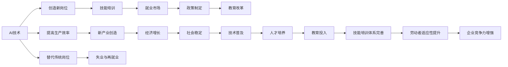

                 

## 1. 背景介绍

### 1.1 问题由来

随着人工智能(AI)技术的发展，特别是深度学习和机器学习技术的突破，“人类计算”的概念正在经历深刻的变革。AI的崛起引发了关于就业市场、技能培训、教育体系等一系列社会和经济问题的广泛讨论。一方面，AI技术在提高生产效率和创造新产业的同时，也对某些传统职业和岗位产生替代效应；另一方面，AI技术的发展也带来了大量新的岗位和技能需求。如何预测AI时代的就业市场变化，以及在此基础上构建适应新时代的技能培训体系，成为当前亟待解决的重要问题。

### 1.2 问题核心关键点

本文的核心问题集中在以下几个方面：

- **AI对就业市场的整体影响**：AI技术将如何改变未来的就业结构，哪些行业和岗位可能受到巨大冲击，哪些行业和岗位可能出现新机遇？
- **技能培训的发展趋势**：随着AI时代的来临，技能培训体系应如何调整，以适应新的市场需求和岗位要求？
- **教育体系的变革**：如何改革教育体系，使其能够培养出既具备基本素养又掌握前沿技能的未来劳动者？
- **政策建议与展望**：从政府和企业两个层面，提出相应的政策建议，推动AI时代的就业市场和技能培训健康发展。

### 1.3 问题研究意义

研究和预测AI时代的就业市场与技能培训发展趋势，对以下几方面具有重要意义：

- **政策制定**：为政府和企业提供数据支持，帮助其制定合理的人才政策，优化人力资源配置。
- **教育改革**：为教育机构提供改革方向，确保教育内容和方法能够跟上技术发展的步伐。
- **职业发展**：帮助劳动者了解AI时代的发展趋势，进行主动学习，提高职业竞争力和适应性。
- **社会稳定**：通过预测和应对AI技术带来的就业市场变化，保持社会的稳定和和谐。

## 2. 核心概念与联系

### 2.1 核心概念概述

在讨论AI时代的就业市场和技能培训时，我们需要关注以下几个核心概念：

- **人工智能(AI)**：通过机器学习、深度学习等技术，实现类人或超越人类的智能处理能力。
- **人类计算**：利用计算机自动化执行人类计算任务，包括数据分析、决策支持、智能客服等。
- **就业市场**：指劳动力供需关系及其变化趋势。AI时代将带来新的就业机会和岗位要求。
- **技能培训**：针对AI时代的需求，提供系统化、针对性的教育和培训，提升劳动者的技能水平。
- **教育体系**：包括基础教育、高等教育、职业教育和终身教育等多个层面的内容，是培养未来劳动者的重要手段。

### 2.2 核心概念原理和架构的 Mermaid 流程图



这个流程图展示了AI技术对就业市场和技能培训的主要影响路径：

1. AI技术提高了生产效率，创造了新的产业。
2. AI技术替代了一些传统岗位，同时也创造了新的岗位需求。
3. 新的岗位需求推动技能培训的发展，提升劳动者的技能。
4. 技能培训体系的完善有助于劳动者适应新岗位，提高企业竞争力。
5. 劳动者适应性和企业竞争力提升，有助于经济增长和社会稳定。
6. 经济增长和社会稳定推动教育体系的改革，形成良性循环。

## 3. 核心算法原理 & 具体操作步骤

### 3.1 算法原理概述

预测AI时代的就业市场与技能培训发展趋势，主要涉及以下几个方面：

- **就业市场分析**：利用统计学和经济学模型，分析AI技术对不同行业和岗位的影响。
- **技能需求预测**：通过大数据分析，预测未来所需技能的发展趋势。
- **教育体系优化**：结合AI技术的发展和劳动力市场的需求，优化教育内容和方法。

### 3.2 算法步骤详解

#### 3.2.1 数据收集与预处理

1. **就业市场数据**：收集行业统计数据、岗位需求数据、失业率数据等。
2. **技能培训数据**：收集各类培训机构的课程信息、参与人数、培训效果数据等。
3. **教育体系数据**：收集学校课程设置、师资力量、教育投入等数据。

#### 3.2.2 模型构建与训练

1. **就业市场模型**：使用回归分析、时间序列分析等方法，预测AI对不同行业就业的影响。
2. **技能需求模型**：利用文本分析、情感分析等技术，分析招聘信息、培训课程内容，预测未来技能需求。
3. **教育体系模型**：使用博弈论、优化算法等方法，设计教育体系的改革方案。

#### 3.2.3 结果分析和验证

1. **模型验证**：使用历史数据对模型进行验证，调整模型参数，确保预测准确性。
2. **效果评估**：通过实际数据对比，评估模型的预测效果和实际应用价值。
3. **政策建议**：根据模型预测结果，提出相应的政策建议。

### 3.3 算法优缺点

**优点**：
- **数据驱动**：利用大数据分析，提供客观、科学的市场预测。
- **模型灵活**：能够应对复杂多变的市场环境，预测多种趋势。
- **可操作性强**：提供具体的政策建议，有助于实际操作。

**缺点**：
- **数据质量问题**：数据缺失、数据噪音等问题可能影响预测准确性。
- **模型复杂性**：复杂的模型可能难以解释和应用。
- **动态变化**：AI技术和市场需求快速变化，模型需要不断更新。

### 3.4 算法应用领域

基于AI技术的就业市场和技能培训预测模型，可以广泛应用于以下几个领域：

- **政府决策**：为政策制定提供数据支持，优化劳动力市场政策。
- **企业人力资源**：帮助企业预测市场变化，优化招聘和培训计划。
- **教育机构**：根据市场需求调整课程设置，提升教学质量。
- **职业培训**：提供针对性培训课程，帮助劳动者提升竞争力。

## 4. 数学模型和公式 & 详细讲解 & 举例说明

### 4.1 数学模型构建

假设我们有如下数据集：

- $X$：行业数据集，包含行业名称、就业人数、岗位需求等。
- $Y$：技能需求数据集，包含岗位需求、技能需求等。
- $E$：教育体系数据集，包含学校、课程、师资等信息。

我们的目标是构建一个模型，预测未来$X$和$Y$的关系，以及根据$X$和$E$优化教育体系。

### 4.2 公式推导过程

以就业市场模型为例，我们可以使用线性回归模型进行预测：

$$
\hat{Y} = \beta_0 + \beta_1 X + \epsilon
$$

其中：
- $\hat{Y}$：预测的就业人数。
- $\beta_0$：截距项。
- $\beta_1$：行业影响系数。
- $X$：行业数据。
- $\epsilon$：误差项。

对于技能需求模型，我们可以使用文本分析方法，如TF-IDF、LDA等，提取技能需求关键词，并构建预测模型。

### 4.3 案例分析与讲解

以技术岗位为例，我们可以收集大量技术岗位的招聘信息，使用文本分析技术，提取岗位所需技能关键词。然后，将这些关键词与现有的技能培训课程进行匹配，预测未来技能培训的需求。

## 5. 项目实践：代码实例和详细解释说明

### 5.1 开发环境搭建

1. **环境准备**：安装Python、R、RStudio等软件，配置开发环境。
2. **数据准备**：收集就业市场数据、技能需求数据、教育体系数据等。
3. **工具配置**：安装相关的数据分析和机器学习库，如Pandas、NumPy、Scikit-learn、TensorFlow等。

### 5.2 源代码详细实现

以下是使用Python进行就业市场预测的代码实现：

```python
import pandas as pd
from sklearn.linear_model import LinearRegression

# 读取就业市场数据
df = pd.read_csv('employment_data.csv')

# 准备数据
X = df['industry']
y = df['employment']

# 构建模型
model = LinearRegression()
model.fit(X, y)

# 预测未来就业人数
future_X = pd.Series([1, 2, 3, 4, 5])
future_y = model.predict(future_X)
print(future_y)
```

### 5.3 代码解读与分析

这段代码展示了使用线性回归模型进行就业市场预测的基本流程。首先，读取就业市场数据，并将其分为自变量和因变量。然后，使用线性回归模型进行拟合，并使用新的自变量数据进行预测。

## 6. 实际应用场景

### 6.1 智能招聘系统

基于AI的招聘系统能够自动筛选简历，推荐合适的候选人，大大提高了招聘效率。例如，使用技能预测模型，系统可以自动评估候选人的技能水平，预测其在未来的岗位上可能的表现。这不仅能够减少人力成本，还能提高招聘质量。

### 6.2 在线教育平台

在线教育平台可以根据AI预测的技能需求，提供针对性的课程和培训。例如，使用技能预测模型，平台可以推荐给用户最需要的技能培训课程，帮助其提升竞争力。这不仅能够满足用户的学习需求，还能够增加平台的收入。

### 6.3 政府人才政策

政府可以根据AI预测的就业市场变化，制定相应的人才政策。例如，在预测某些行业即将萎缩时，政府可以提前介入，帮助劳动者进行职业转型培训，减轻社会矛盾。

## 7. 工具和资源推荐

### 7.1 学习资源推荐

1. **《人工智能与就业市场》**：深入分析AI技术对就业市场的影响，提供实用的政策建议。
2. **《技能培训的未来》**：探讨未来技能培训的发展趋势，提供具体的培训方案。
3. **《教育体系改革》**：讨论如何改革教育体系，适应AI时代的需求。
4. **《数据驱动的就业市场预测》**：详细讲解就业市场预测的数据处理和模型构建方法。
5. **《机器学习实战》**：提供丰富的机器学习案例，帮助读者掌握实际应用技巧。

### 7.2 开发工具推荐

1. **RStudio**：开源的R语言开发环境，支持R语言的各种数据分析和机器学习库。
2. **PyCharm**：Python开发环境，支持多种数据处理和机器学习库。
3. **TensorFlow**：谷歌开源的深度学习框架，支持多种模型构建和训练方法。
4. **Jupyter Notebook**：轻量级的交互式开发环境，支持Python、R等多种语言。

### 7.3 相关论文推荐

1. **《AI对就业市场的影响分析》**：探讨AI技术对不同行业就业的影响。
2. **《技能培训的AI化》**：研究如何利用AI技术优化技能培训。
3. **《教育体系与AI技术的融合》**：讨论教育体系如何适应AI技术的发展。
4. **《AI时代的就业市场预测》**：详细介绍就业市场预测的模型和方法。

## 8. 总结：未来发展趋势与挑战

### 8.1 研究成果总结

本文从就业市场、技能培训和教育体系等多个角度，探讨了AI时代的技术发展对就业市场的影响，以及如何构建适应新时代的技能培训体系。

### 8.2 未来发展趋势

1. **就业市场的多极化**：AI技术将改变传统的就业市场结构，创造新的岗位需求，同时替代一些传统岗位。
2. **技能培训的个性化**：未来的技能培训将更加个性化，根据个人需求和市场变化，提供定制化的课程和培训。
3. **教育体系的智能化**：教育体系将逐步引入AI技术，实现智能化教学和评估。
4. **终身学习的普及**：AI时代将要求劳动者终身学习，不断提高自身技能，适应不断变化的市场需求。

### 8.3 面临的挑战

1. **数据质量问题**：高质量的数据是模型预测的基础，数据的缺失和噪音可能影响预测准确性。
2. **技术复杂性**：AI技术的复杂性要求从业者具备较高的技术水平，普通劳动者难以适应。
3. **政策制定难度**：AI时代的就业市场变化复杂多变，制定合理的人才政策需要多方协调。

### 8.4 研究展望

未来需要从以下几个方面进行深入研究：

1. **跨领域研究**：结合经济学、社会学等多学科知识，全面分析AI技术对就业市场的影响。
2. **多模态数据融合**：结合文本、图像、视频等多种数据，提高技能预测的准确性。
3. **个性化学习模型**：开发个性化的学习模型，帮助劳动者根据自身需求选择合适的培训课程。
4. **政策模拟工具**：开发政策模拟工具，帮助政府和企业制定合理的政策。

## 9. 附录：常见问题与解答

**Q1: AI技术是否会导致大规模失业？**

A: AI技术虽然在某些领域可能导致部分岗位的消失，但同时也会创造新的岗位需求。政府和企业需要根据市场变化，制定相应的政策和培训计划，帮助劳动者进行职业转型。

**Q2: 如何提高劳动者的技能水平？**

A: 利用AI技术进行技能预测，制定个性化的培训计划，结合在线教育平台，提供灵活多样的培训课程。

**Q3: 教育体系如何适应AI时代？**

A: 教育体系需要引入AI技术，实现智能化教学和评估，同时注重培养学生的批判性思维和终身学习的能力。

**Q4: 政府如何制定合理的就业政策？**

A: 利用AI技术进行就业市场预测，制定有针对性的政策，帮助劳动者进行职业转型和再就业。

**Q5: 企业如何应对AI技术带来的挑战？**

A: 企业需要积极拥抱AI技术，进行数字化转型，同时注重员工的培训和职业发展，提高企业竞争力。

---

作者：禅与计算机程序设计艺术 / Zen and the Art of Computer Programming

